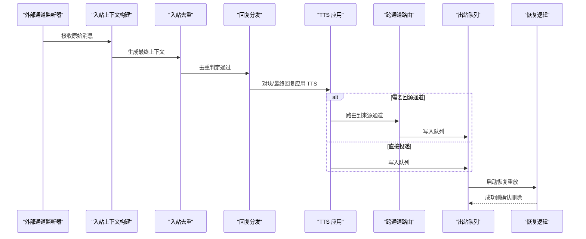
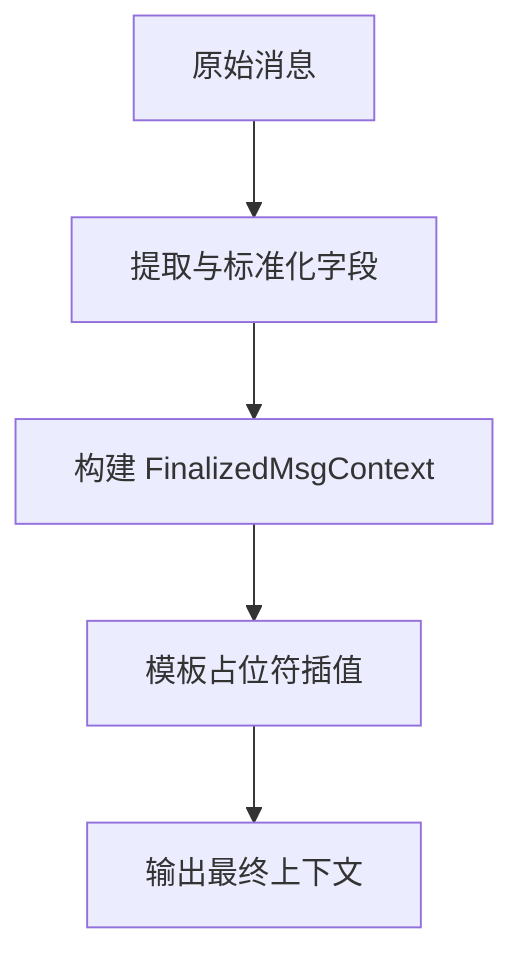
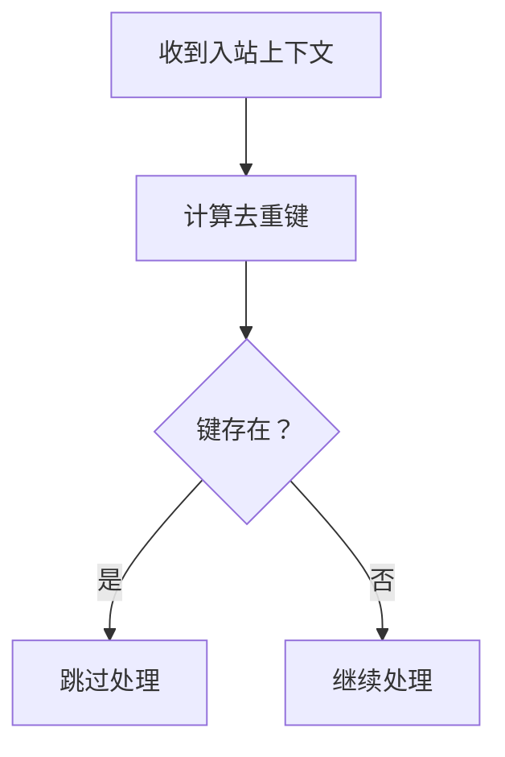
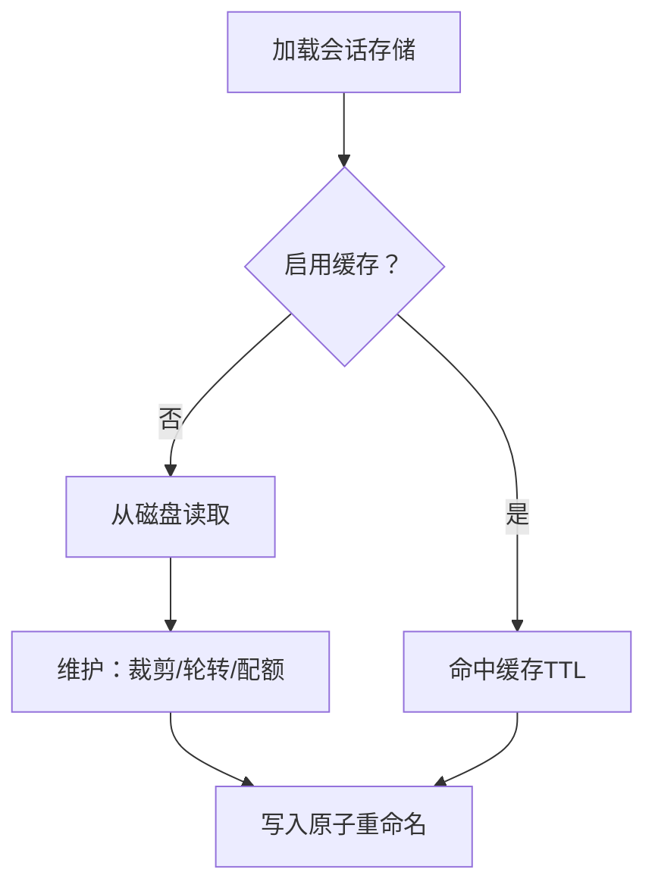
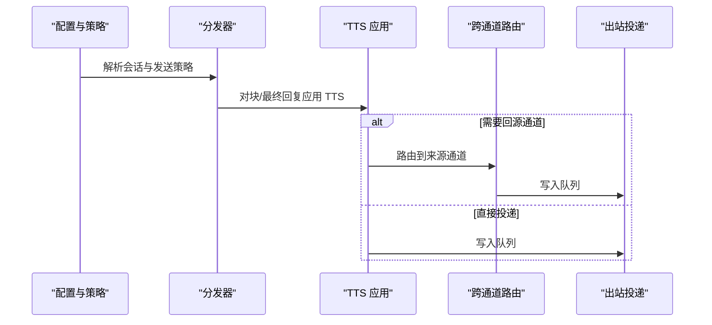
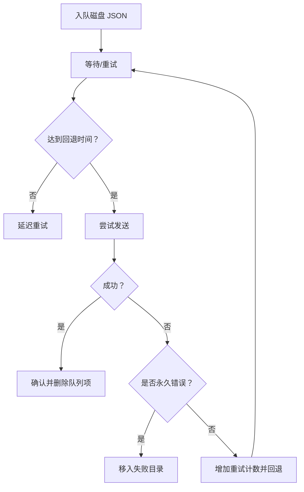
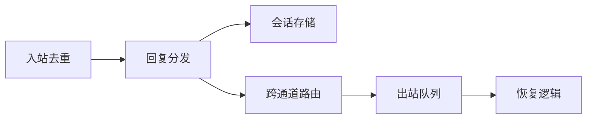

# 数据流设计

<cite>
**本文引用的文件**
- [src/infra/outbound/delivery-queue.ts](file://src/infra/outbound/delivery-queue.ts)
- [src/auto-reply/reply/dispatch-from-config.ts](file://src/auto-reply/reply/dispatch-from-config.ts)
- [src/auto-reply/reply/route-reply.ts](file://src/auto-reply/reply/route-reply.ts)
- [src/auto-reply/reply/inbound-dedupe.ts](file://src/auto-reply/reply/inbound-dedupe.ts)
- [src/auto-reply/templating.ts](file://src/auto-reply/templating.ts)
- [src/config/sessions/store.ts](file://src/config/sessions/store.ts)
- [src/commands/agent/delivery.ts](file://src/commands/agent/delivery.ts)
- [src/gateway/server-methods/agent.ts](file://src/gateway/server-methods/agent.ts)
- [src/web/auto-reply/web-auto-reply-monitor.test.ts](file://src/web/auto-reply/web-auto-reply-monitor.test.ts)
- [extensions/tlon/src/monitor/processed-messages.ts](file://extensions/tlon/src/monitor/processed-messages.ts)
- [src/infra/outbound/outbound.test.ts](file://src/infra/outbound/outbound.test.ts)
</cite>

## 目录

1. [引言](#引言)
2. [项目结构](#项目结构)
3. [核心组件](#核心组件)
4. [架构总览](#架构总览)
5. [详细组件分析](#详细组件分析)
6. [依赖关系分析](#依赖关系分析)
7. [性能考量](#性能考量)
8. [故障排查指南](#故障排查指南)
9. [结论](#结论)
10. [附录](#附录)

## 引言

本文件系统性梳理 OpenClaw 的数据流设计，覆盖从外部消息接入、上下文构建与去重、回复生成与路由、到最终交付与持久化的全流程。重点说明消息在各组件之间的传递机制、数据格式转换与状态变更、持久化与缓存策略、一致性保障、性能优化、监控指标以及故障恢复机制，并提供调试与性能分析建议。

## 项目结构

OpenClaw 的数据流主要由“入站处理”“会话与上下文”“回复分发与路由”“出站投递队列与恢复”等模块协同完成。下图给出与数据流相关的关键模块关系概览（概念性）：

```mermaid
graph TB
subgraph "入站接入"
EXT["扩展/通道监听器<br/>如 Discord/Telegram/Web 等"]
INBOUND_CTX["入站上下文构建<br/>模板与占位符解析"]
DEDUPE["入站去重缓存"]
end
subgraph "会话与状态"
SESSION_STORE["会话存储与缓存<br/>TTL/维护/轮转"]
ROUTE["路由决策<br/>来源通道回送"]
end
subgraph "回复生成与分发"
DISPATCH["配置驱动的回复分发"]
TTS["TTS 应用与合成"]
ROUTER["跨通道路由"]
end
subgraph "出站投递"
QUEUE["投递队列<br/>磁盘持久化/重试/回退"]
RECOVERY["启动恢复<br/>幂等重放"]
end
EXT --> INBOUND_CTX --> DEDUPE --> DISPATCH
DISPATCH --> TTS --> ROUTER --> QUEUE --> RECOVERY
DISPATCH <- --> SESSION_STORE
ROUTER <- --> SESSION_STORE
```

## 核心组件

- 入站上下文与模板：负责将原始消息标准化为统一的 MsgContext，并进行模板占位符插值，形成可被后续模块消费的“最终上下文”。
- 入站去重：基于消息键（提供方+账号+会话+对端+线程+消息ID）的去重缓存，避免重复处理。
- 会话存储与缓存：以 JSON 文件持久化会话状态，支持 TTL 缓存、定期维护（裁剪、轮转）、磁盘配额控制。
- 回复分发与路由：根据配置与会话状态生成回复，必要时将回复路由回来源通道，确保用户感知的一致性。
- 出站投递队列与恢复：将回复写入磁盘队列，按指数回退重试；启动时扫描并恢复未完成任务，保证幂等与最终一致。

**章节来源**

- file://src/auto-reply/templating.ts#L155-L213
- file://src/auto-reply/reply/inbound-dedupe.ts#L1-L56
- file://src/config/sessions/store.ts#L37-L70
- file://src/auto-reply/reply/dispatch-from-config.ts#L100-L179
- file://src/auto-reply/reply/route-reply.ts#L59-L161
- file://src/infra/outbound/delivery-queue.ts#L78-L108

## 架构总览

下图展示一次典型的数据流路径：外部消息进入，经去重与上下文构建后进入回复分发，再通过路由或直接投递至出站队列，最终由恢复逻辑兜底保证交付。



**图表来源**

- [src/auto-reply/templating.ts](file://src/auto-reply/templating.ts#L155-L213)
- [src/auto-reply/reply/inbound-dedupe.ts](file://src/auto-reply/reply/inbound-dedupe.ts#L37-L51)
- [src/auto-reply/reply/dispatch-from-config.ts](file://src/auto-reply/reply/dispatch-from-config.ts#L299-L581)
- [src/auto-reply/reply/route-reply.ts](file://src/auto-reply/reply/route-reply.ts#L59-L161)
- [src/infra/outbound/delivery-queue.ts](file://src/infra/outbound/delivery-queue.ts#L278-L376)

**章节来源**

- file://src/auto-reply/reply/dispatch-from-config.ts#L100-L179
- file://src/auto-reply/reply/route-reply.ts#L59-L161
- file://src/infra/outbound/delivery-queue.ts#L278-L376

## 详细组件分析

### 组件一：入站上下文构建与模板插值

- 职责：将来自不同通道的消息标准化为 FinalizedMsgContext，提取关键字段（时间戳、消息ID、内容、渠道、会话键等），并对模板字符串进行占位符插值。
- 关键点：
  - FinalizedMsgContext 在模板阶段固定 CommandAuthorized 字段，便于后续授权与命令处理。
  - 模板插值采用安全的占位符匹配与类型格式化，避免注入与异常。
- 影响范围：所有入站处理链路的基础输入。



**图表来源**

- [src/auto-reply/templating.ts](file://src/auto-reply/templating.ts#L155-L213)

**章节来源**

- file://src/auto-reply/templating.ts#L155-L213

### 组件二：入站去重与重复检测

- 职责：基于“提供方+账号+会话+对端+线程+消息ID”的复合键进行去重，防止重复处理与风暴。
- 关键点：
  - 默认 TTL 与最大容量可配置，支持日志记录跳过的键。
  - 去重键构建考虑多通道场景（OriginatingChannel/Surface/Provider）与线程标识。
- 影响范围：所有入站处理入口，显著降低抖动与资源浪费。



**图表来源**

- [src/auto-reply/reply/inbound-dedupe.ts](file://src/auto-reply/reply/inbound-dedupe.ts#L18-L51)

**章节来源**

- file://src/auto-reply/reply/inbound-dedupe.ts#L1-L56

### 组件三：会话存储与缓存、维护与轮转

- 职责：以 JSON 文件持久化会话状态，提供 TTL 缓存、定期清理、条目上限裁剪、文件大小轮转与磁盘配额控制。
- 关键点：
  - 缓存 TTL 可通过环境变量调整，默认约 45 秒，避免频繁磁盘 IO。
  - 写入采用临时文件+原子重命名，Windows 平台增加重试与并发保护。
  - 支持“仅告警”模式下的维护策略，避免误删活跃会话。
- 影响范围：所有需要读写会话状态的模块（回复分发、路由、网关选择等）。



**图表来源**

- [src/config/sessions/store.ts](file://src/config/sessions/store.ts#L198-L284)

**章节来源**

- file://src/config/sessions/store.ts#L37-L70
- file://src/config/sessions/store.ts#L198-L284
- file://src/config/sessions/store.ts#L642-L800

### 组件四：回复分发与跨通道路由

- 职责：根据配置与会话策略生成回复，必要时将回复路由回来源通道，确保用户感知一致；同时支持 TTS 应用与工具结果的分发。
- 关键点：
  - 发送策略可拒绝（deny）或允许（allow），支持命令旁路（ACP）。
  - 跨通道路由通过 routeReply 将消息发送到 OriginatingChannel/OriginatingTo，避免“会话共享导致的错发”。
  - 对块级回复与最终回复分别处理，支持 TTS 合成与静默/最佳努力等语义。
- 影响范围：所有回复生成与投递路径。



**图表来源**

- [src/auto-reply/reply/dispatch-from-config.ts](file://src/auto-reply/reply/dispatch-from-config.ts#L299-L581)
- [src/auto-reply/reply/route-reply.ts](file://src/auto-reply/reply/route-reply.ts#L59-L161)

**章节来源**

- file://src/auto-reply/reply/dispatch-from-config.ts#L100-L179
- file://src/auto-reply/reply/dispatch-from-config.ts#L336-L379
- file://src/auto-reply/reply/route-reply.ts#L59-L161

### 组件五：出站投递队列与恢复

- 职责：将待投递的回复写入磁盘队列，按指数回退重试；启动时扫描并恢复未完成任务，移动到失败目录或确认成功。
- 关键点：
  - 队列项包含原始负载（用于幂等重放）、重试计数、最后尝试时间与错误信息。
  - 最大重试次数与回退延迟（5s、25s、2m、10m）可配置；永久性错误（如“未找到对话/用户被拉黑”等）直接移入失败目录。
  - 恢复过程按最早入队优先，带时间预算，避免启动阻塞。
- 影响范围：所有出站投递的可靠性保障。



**图表来源**

- [src/infra/outbound/delivery-queue.ts](file://src/infra/outbound/delivery-queue.ts#L78-L108)
- [src/infra/outbound/delivery-queue.ts](file://src/infra/outbound/delivery-queue.ts#L127-L141)
- [src/infra/outbound/delivery-queue.ts](file://src/infra/outbound/delivery-queue.ts#L278-L376)

**章节来源**

- file://src/infra/outbound/delivery-queue.ts#L78-L108
- file://src/infra/outbound/delivery-queue.ts#L127-L141
- file://src/infra/outbound/delivery-queue.ts#L278-L376
- file://src/infra/outbound/outbound.test.ts#L118-L147

### 组件六：网关与内部通道选择

- 职责：当目标通道为内部消息通道时，解析并选择实际投递通道；若未显式指定目标，使用默认选择器。
- 关键点：
  - 内部通道标记与显式通道提示共同决定最终投递通道。
  - 外部通道缺失时，可回退到代理目标解析。

**章节来源**

- file://src/commands/agent/delivery.ts#L96-L117
- file://src/gateway/server-methods/agent.ts#L517-L552

### 组件七：Web 入站与组历史处理（示例）

- 职责：Web 入站消息的组消息前缀构建、组成员名映射、组合体构建与去回显（echo）管理。
- 关键点：
  - 组消息会添加发送者标识与号码，便于溯源。
  - 提供组合体键构建与去回显缓存，避免自触发与重复。

**章节来源**

- file://src/web/auto-reply/web-auto-reply-monitor.test.ts#L275-L293
- file://extensions/tlon/src/monitor/processed-messages.ts#L1-L33

## 依赖关系分析

- 入站去重依赖通用去重缓存实现，键构造考虑多通道与线程维度。
- 回复分发依赖会话存储以解析会话策略与 TTS 自动模式，同时调用跨通道路由。
- 跨通道路由依赖通道插件注册表与出站会话上下文，最终委托出站投递。
- 出站投递依赖磁盘队列与恢复逻辑，确保幂等与最终一致。



**图表来源**

- [src/auto-reply/reply/inbound-dedupe.ts](file://src/auto-reply/reply/inbound-dedupe.ts#L1-L56)
- [src/auto-reply/reply/dispatch-from-config.ts](file://src/auto-reply/reply/dispatch-from-config.ts#L100-L179)
- [src/auto-reply/reply/route-reply.ts](file://src/auto-reply/reply/route-reply.ts#L59-L161)
- [src/infra/outbound/delivery-queue.ts](file://src/infra/outbound/delivery-queue.ts#L278-L376)

**章节来源**

- file://src/auto-reply/reply/inbound-dedupe.ts#L1-L56
- file://src/auto-reply/reply/dispatch-from-config.ts#L100-L179
- file://src/auto-reply/reply/route-reply.ts#L59-L161
- file://src/infra/outbound/delivery-queue.ts#L278-L376

## 性能考量

- 缓存与磁盘 IO
  - 会话存储默认 TTL 约 45 秒，减少频繁读写；Windows 下写入采用临时文件+重命名，避免并发读空文件问题。
  - 建议通过环境变量调节 TTL 以平衡一致性与吞吐。
- 去重与批处理
  - 入站去重可显著降低重复处理开销；对于高并发场景，结合去抖与合并策略可进一步提升吞吐。
- 投递回退与背压
  - 指数回退与最大重试限制避免雪崩；启动恢复带时间预算，防止长时间阻塞。
- I/O 与序列化
  - 队列项序列化为 JSON，建议控制单条负载大小，避免磁盘与网络压力过大。

[本节为通用指导，无需特定文件引用]

## 故障排查指南

- 常见错误与定位
  - 永久性错误：如“未找到对话/用户被拉黑”等，将直接移入失败目录。检查通道配置与目标有效性。
  - 临时性错误：连接失败、超时等，按回退策略重试；可通过查看队列项的 retryCount 与 lastAttemptAt 判断。
- 恢复与审计
  - 启动恢复会扫描队列并重放，日志记录恢复统计（已恢复/失败/跳过最大重试/延迟回退）。关注恢复完成日志与剩余条目数量。
- 单元测试参考
  - 出站队列测试覆盖了失败移动、重试计数更新与失败目录迁移，可据此验证行为一致性。

**章节来源**

- file://src/infra/outbound/delivery-queue.ts#L380-L394
- file://src/infra/outbound/outbound.test.ts#L118-L147

## 结论

OpenClaw 的数据流通过“入站去重+上下文构建+会话存储+回复分发+跨通道路由+磁盘队列+恢复”的闭环，实现了高可靠、可扩展且可观测的消息处理体系。合理的缓存策略、幂等恢复与严格的错误分类，确保在复杂通道与高并发场景下仍能保持稳定与一致。

[本节为总结性内容，无需特定文件引用]

## 附录

### 数据流调试与性能分析要点

- 调试
  - 启用详细日志，观察“消息已处理/跳过/错误”与“会话状态变化”事件，定位卡点。
  - 使用入站去重与处理跟踪（如 processed-messages 追踪）识别重复与积压。
- 性能分析
  - 关注会话存储读写延迟与队列长度；评估 TTL 与维护策略对吞吐的影响。
  - 分析跨通道路由与 TTS 合成耗时，必要时拆分或异步化。

**章节来源**

- file://extensions/tlon/src/monitor/processed-messages.ts#L1-L33
