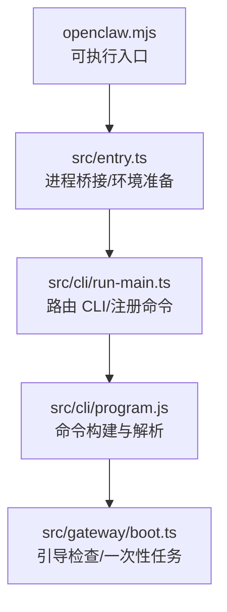
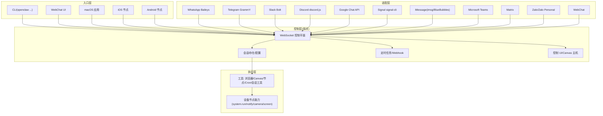
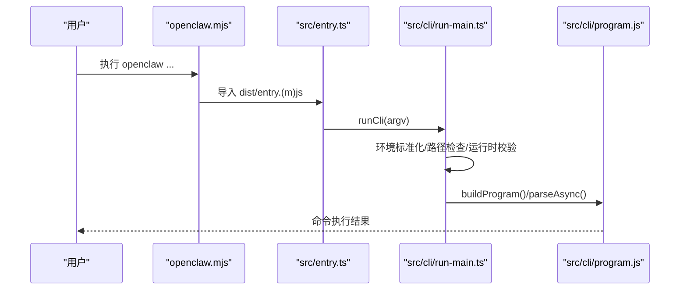
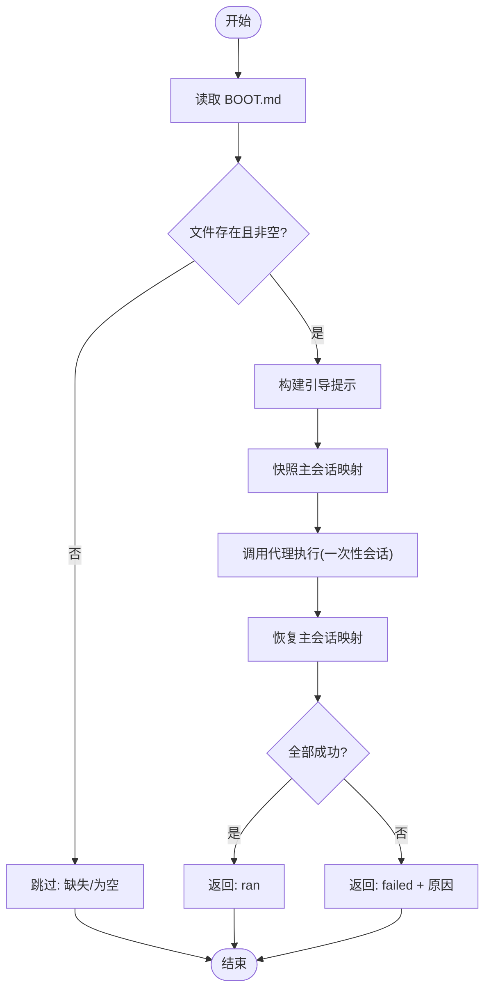
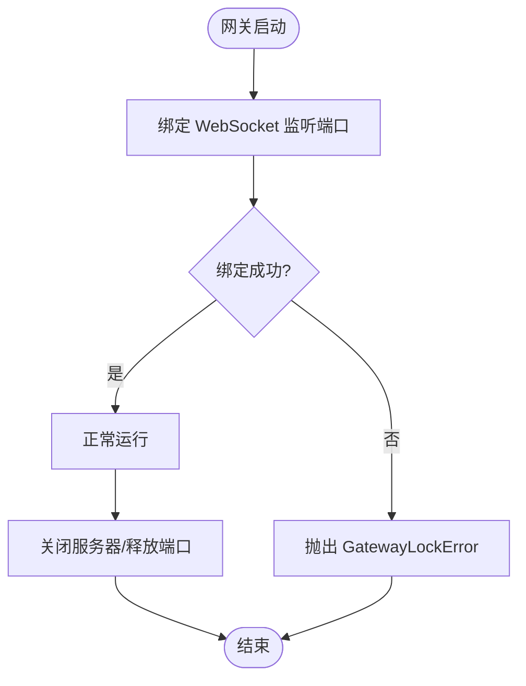
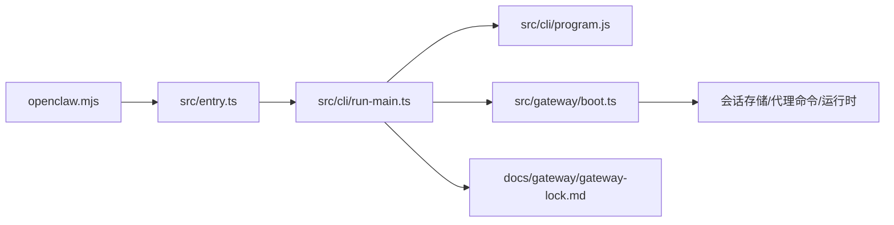

# 系统概览

<cite>
**本文引用的文件**
- [README.md](file://README.md)
- [package.json](file://package.json)
- [src/index.ts](file://src/index.ts)
- [src/entry.ts](file://src/entry.ts)
- [openclaw.mjs](file://openclaw.mjs)
- [src/cli/run-main.ts](file://src/cli/run-main.ts)
- [src/gateway/boot.ts](file://src/gateway/boot.ts)
- [docs/gateway/gateway-lock.md](file://docs/gateway/gateway-lock.md)
- [src/commands/status.command.ts](file://src/commands/status.command.ts)
- [src/gateway/test-helpers.server.ts](file://src/gateway/test-helpers.server.ts)
</cite>

## 目录

1. [简介](#简介)
2. [项目结构](#项目结构)
3. [核心组件](#核心组件)
4. [架构总览](#架构总览)
5. [详细组件分析](#详细组件分析)
6. [依赖关系分析](#依赖关系分析)
7. [性能考量](#性能考量)
8. [故障排查指南](#故障排查指南)
9. [结论](#结论)

## 简介

OpenClaw 是一个“个人 AI 助手”，可在本地设备上运行，作为多通道消息网关（如 WhatsApp、Telegram、Slack、Discord、Google Chat、Signal、iMessage、Microsoft Teams、WebChat 等），并通过 WebSocket 控制平面统一管理会话、工具与事件。它支持通过 CLI、Web 控制界面、macOS 应用、iOS/Android 节点以及 Pi 代理（RPC）等多种入口协同工作。

- 网关控制平面：单一路由器，承载会话、存在性、配置、定时任务、Webhook、控制 UI 与 Canvas 主机。
- 多平台客户端：CLI、WebChat、macOS 菜单栏应用、iOS/Android 节点。
- 分布式消息网关：从入口点到各子系统的完整数据流贯穿 CLI、WebSocket 控制面、通道适配器、工具执行与节点能力调用。

本节为入门级概述，后续章节将深入系统架构、启动流程、初始化与核心服务协调机制，并给出面向初学者的框架与面向资深开发者的细节。

## 项目结构

- 入口与打包
  - CLI 可执行入口通过二进制映射到 openclaw.mjs，再动态加载 dist/entry.(m)js。
  - package.json 定义了 bin 映射、构建脚本与导出模块（含插件 SDK）。
- 核心运行路径
  - openclaw.mjs -> src/entry.ts -> src/cli/run-main.ts -> src/cli/program.js（命令注册与解析）
  - 启动网关时，通过 src/gateway/boot.ts 执行引导检查与一次性任务。
- 文档与运行指南
  - README 提供高层架构、关键子系统与远程访问方式。
  - docs/gateway/gateway-lock.md 解释网关互斥锁（基于端口绑定）。

图表来源

- [openclaw.mjs](file://openclaw.mjs#L1-L57)
- [src/entry.ts](file://src/entry.ts#L1-L144)
- [src/cli/run-main.ts](file://src/cli/run-main.ts#L64-L124)
- [src/gateway/boot.ts](file://src/gateway/boot.ts#L138-L203)

章节来源

- [package.json](file://package.json#L16-L48)
- [openclaw.mjs](file://openclaw.mjs#L1-L57)
- [src/entry.ts](file://src/entry.ts#L1-L144)
- [src/cli/run-main.ts](file://src/cli/run-main.ts#L64-L124)
- [src/gateway/boot.ts](file://src/gateway/boot.ts#L138-L203)

## 核心组件

- CLI 与命令系统
  - 运行入口：openclaw.mjs 加载警告过滤与 dist/entry.(m)js。
  - 入口包装：src/entry.ts 负责实验性警告抑制、参数规范化、进程桥接与二次启动策略。
  - CLI 主流程：src/cli/run-main.ts 负责环境标准化、路径检查、运行时校验、命令路由与解析。
  - 命令程序：src/cli/program.js（导出 buildProgram）负责命令注册与解析。
- 网关引导与生命周期
  - 引导检查：src/gateway/boot.ts 在工作区检测 BOOT.md 并以一次性会话触发代理执行，完成后恢复主会话映射。
- 网关互斥锁
  - docs/gateway/gateway-lock.md 描述基于 WebSocket 监听端口的互斥锁机制，避免重复实例。
- 状态与连接信息
  - src/commands/status.command.ts 提供网关连接详情与控制 UI 链接解析。

章节来源

- [openclaw.mjs](file://openclaw.mjs#L1-L57)
- [src/entry.ts](file://src/entry.ts#L1-L144)
- [src/cli/run-main.ts](file://src/cli/run-main.ts#L64-L124)
- [src/gateway/boot.ts](file://src/gateway/boot.ts#L138-L203)
- [docs/gateway/gateway-lock.md](file://docs/gateway/gateway-lock.md#L1-L34)
- [src/commands/status.command.ts](file://src/commands/status.command.ts#L208-L231)

## 架构总览

OpenClaw 的分布式消息网关以“WebSocket 控制平面 + 多入口 + 多通道适配器 + 工具与节点”为核心，形成如下分层：

- 入口层
  - CLI（openclaw …）、WebChat、macOS 应用、iOS/Android 节点均通过 WebSocket 连接到网关。
- 控制层
  - 网关控制平面：会话管理、存在性、配置、定时任务、Webhook、控制 UI、Canvas 主机。
- 适配层
  - 多通道适配器：WhatsApp、Telegram、Slack、Discord、Google Chat、Signal、iMessage、Microsoft Teams、Matrix、Zalo、WebChat 等。
- 执行层
  - 工具执行（浏览器、Canvas、节点、Cron、会话间通信等）与设备节点能力（macOS 通知、屏幕录制、相机、位置等）。
- 安全与运维
  - 端口互斥锁、远程暴露（Tailscale Serve/Funnel 或 SSH 隧道）、健康检查、日志与诊断。

图表来源

- [README.md](file://README.md#L185-L238)
- [docs/gateway/gateway-lock.md](file://docs/gateway/gateway-lock.md#L19-L34)

章节来源

- [README.md](file://README.md#L185-L238)

## 详细组件分析

### 组件一：CLI 启动与命令路由

- 设计要点
  - openclaw.mjs 作为可执行入口，加载警告过滤并尝试导入 dist/entry.(m)js。
  - src/entry.ts 负责实验性警告抑制、参数规范化、环境标准化与进程桥接；必要时二次启动以抑制警告。
  - src/cli/run-main.ts 负责环境准备、路径检查、运行时校验、命令路由与解析；在解析前注册核心命令与插件命令。
- 数据流
  - openclaw.mjs -> src/entry.ts -> src/cli/run-main.ts -> src/cli/program.js -> 命令执行。
- 错误处理
  - 全局未捕获异常与未处理拒绝处理器安装，确保错误被记录并优雅退出。

图表来源

- [openclaw.mjs](file://openclaw.mjs#L1-L57)
- [src/entry.ts](file://src/entry.ts#L119-L142)
- [src/cli/run-main.ts](file://src/cli/run-main.ts#L64-L124)

章节来源

- [openclaw.mjs](file://openclaw.mjs#L1-L57)
- [src/entry.ts](file://src/entry.ts#L1-L144)
- [src/cli/run-main.ts](file://src/cli/run-main.ts#L64-L124)

### 组件二：网关引导与一次性任务

- 设计要点
  - src/gateway/boot.ts 检测工作区 BOOT.md，构建一次性引导提示，调用代理执行并在完成后恢复主会话映射。
- 数据流
  - 读取 BOOT.md -> 生成一次性会话 -> 构建引导提示 -> 调用代理执行 -> 恢复会话映射 -> 返回执行结果。
- 错误处理
  - 文件读取失败、代理执行失败或会话映射恢复失败均会被记录并返回失败原因。

图表来源

- [src/gateway/boot.ts](file://src/gateway/boot.ts#L138-L203)

章节来源

- [src/gateway/boot.ts](file://src/gateway/boot.ts#L138-L203)

### 组件三：网关互斥锁（端口绑定）

- 设计要点
  - 网关启动时立即绑定 WebSocket 监听端口（默认 127.0.0.1:18789），使用独占监听器确保单实例。
  - 若端口被占用，抛出明确错误；崩溃或 SIGKILL 时系统自动释放监听，无需额外清理。
- 运维建议
  - 若端口被其他进程占用，选择不同端口或释放端口；macOS 应用仍维护轻量 PID 保护，但最终互斥由 WebSocket 绑定保证。

图表来源

- [docs/gateway/gateway-lock.md](file://docs/gateway/gateway-lock.md#L19-L34)

章节来源

- [docs/gateway/gateway-lock.md](file://docs/gateway/gateway-lock.md#L1-L34)

### 组件四：状态与连接信息展示

- 设计要点
  - status 命令可输出网关连接详情与控制 UI 链接（基于配置的绑定、自定义主机与基础路径）。
- 使用场景
  - 快速确认网关是否可用、控制 UI 是否启用、链接是否正确解析。

章节来源

- [src/commands/status.command.ts](file://src/commands/status.command.ts#L208-L231)

## 依赖关系分析

- 入口与运行时
  - openclaw.mjs 依赖 dist/entry.(m)js；src/entry.ts 依赖 CLI 运行主流程与进程桥接。
  - src/cli/run-main.ts 依赖命令构建与解析、环境标准化、路径检查与运行时校验。
- 网关引导
  - src/gateway/boot.ts 依赖会话存储、代理命令与运行时环境，用于一次性引导任务。
- 网关互斥锁
  - docs/gateway/gateway-lock.md 说明端口绑定互斥机制，避免重复实例。

图表来源

- [openclaw.mjs](file://openclaw.mjs#L1-L57)
- [src/entry.ts](file://src/entry.ts#L1-L144)
- [src/cli/run-main.ts](file://src/cli/run-main.ts#L64-L124)
- [src/gateway/boot.ts](file://src/gateway/boot.ts#L138-L203)
- [docs/gateway/gateway-lock.md](file://docs/gateway/gateway-lock.md#L19-L34)

章节来源

- [openclaw.mjs](file://openclaw.mjs#L1-L57)
- [src/entry.ts](file://src/entry.ts#L1-L144)
- [src/cli/run-main.ts](file://src/cli/run-main.ts#L64-L124)
- [src/gateway/boot.ts](file://src/gateway/boot.ts#L138-L203)
- [docs/gateway/gateway-lock.md](file://docs/gateway/gateway-lock.md#L1-L34)

## 性能考量

- 单实例互斥：通过独占监听端口避免资源竞争，减少不必要的冲突与重试开销。
- 启动路径优化：入口层采用延迟导入与最小化初始化，仅在需要时注册命令与插件，降低冷启动时间。
- 事件循环与超时：测试辅助函数对 WebSocket 消息等待设置合理超时，避免长时间阻塞导致的不稳定。

## 故障排查指南

- 端口占用
  - 现象：启动时报“另一个网关实例已在监听”或绑定失败。
  - 排查：确认端口占用情况，更换端口或释放端口；查看 macOS 应用的 PID 保护与网关互斥锁说明。
- CLI 启动失败
  - 现象：openclaw 命令无法启动或报错。
  - 排查：检查 openclaw.mjs 是否正确加载 dist/entry.(m)js；确认环境变量与 Node 版本满足要求；查看 src/entry.ts 的警告抑制与二次启动逻辑。
- 状态与连接
  - 现象：无法访问控制 UI 或连接信息不正确。
  - 排查：使用 status 命令查看连接详情与控制 UI 链接；核对绑定地址、自定义主机与基础路径配置。

章节来源

- [docs/gateway/gateway-lock.md](file://docs/gateway/gateway-lock.md#L26-L34)
- [src/commands/status.command.ts](file://src/commands/status.command.ts#L208-L231)

## 结论

OpenClaw 以“WebSocket 控制平面 + 多入口 + 多通道适配器 + 工具与节点”的分布式消息网关为核心，结合 CLI、Web 控制界面与桌面/移动节点，形成统一的个人 AI 助手体系。其启动流程从 openclaw.mjs 到 src/entry.ts 再到 CLI 主流程，最终进入网关控制平面；通过端口互斥锁确保单实例运行，并提供状态命令与文档指引帮助快速定位问题。对于初学者，建议从 README 的架构概览与入门指南入手；对于开发者，可从 CLI 启动路径、网关引导与互斥锁机制深入理解系统边界与集成点。
