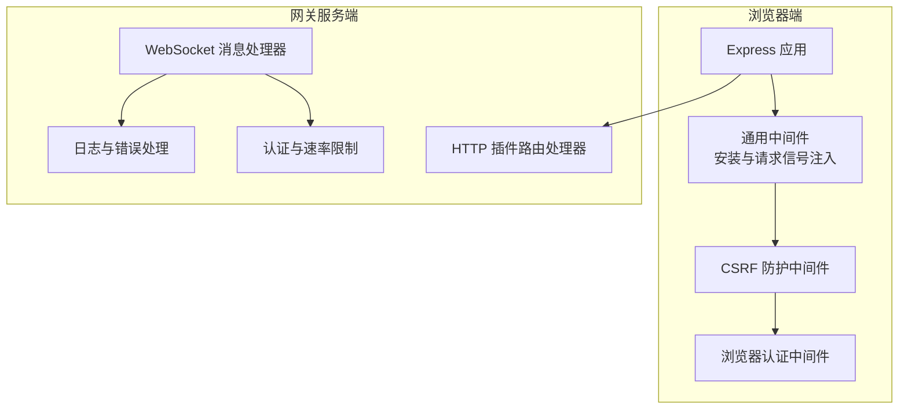
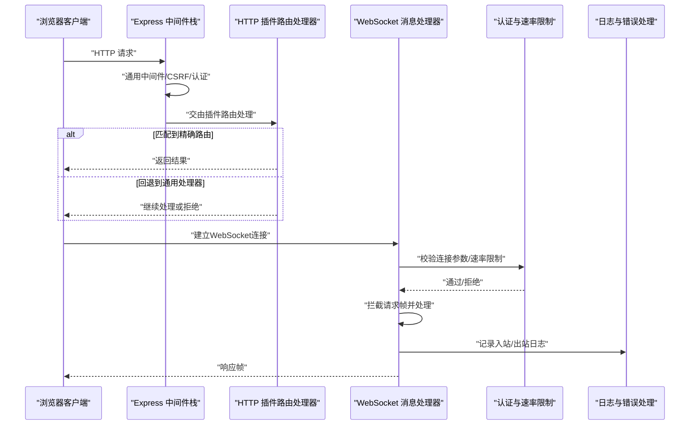
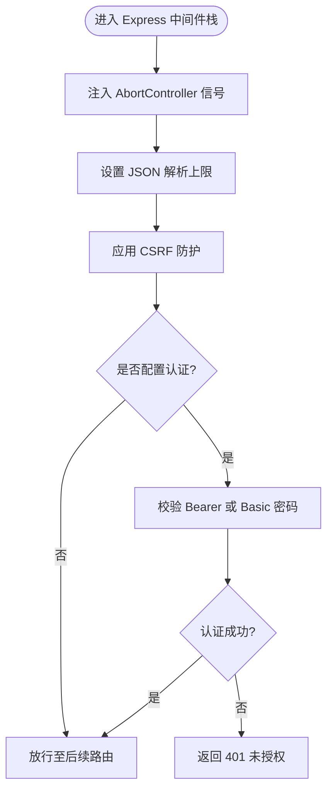
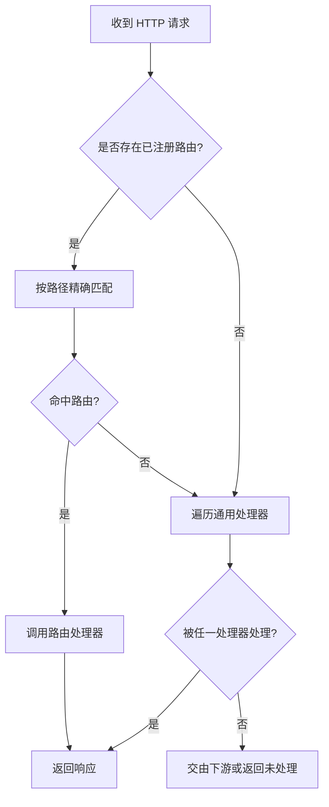
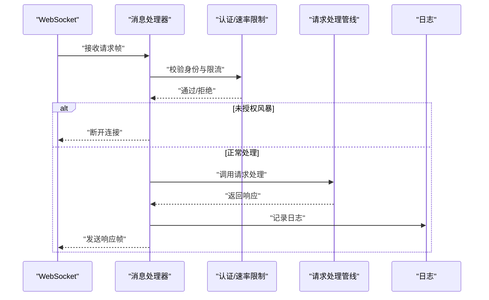
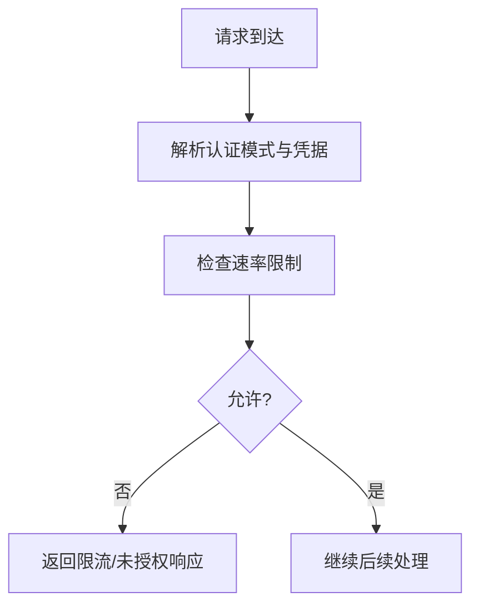
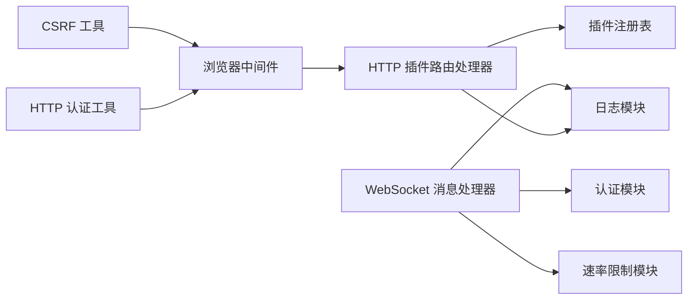

# 中间件系统

<cite>
**本文档引用的文件**
- [src/browser/server-middleware.ts](file://src/browser/server-middleware.ts)
- [dist/server-middleware-BqKURFqJ.js](file://dist/server-middleware-BqKURFqJ.js)
- [dist/server-middleware-CksvUSHW.js](file://dist/server-middleware-CksvUSHW.js)
- [src/gateway/server/ws-connection/message-handler.ts](file://src/gateway/server/ws-connection/message-handler.ts)
- [src/gateway/auth-rate-limit.ts](file://src/gateway/auth-rate-limit.ts)
- [src/gateway/auth.ts](file://src/gateway/auth.ts)
- [src/gateway/server/plugins-http.ts](file://src/gateway/server/plugins-http.ts)
- [src/gateway/http-auth-helpers.ts](file://src/gateway/http-auth-helpers.ts)
- [src/gateway/http-common.ts](file://src/gateway/http-common.ts)
- [src/gateway/server/ws-connection/unauthorized-flood-guard.ts](file://src/gateway/server/ws-connection/unauthorized-flood-guard.ts)
- [src/gateway/ws-log.ts](file://src/gateway/ws-log.ts)
- [src/gateway/server/__tests__/test-utils.ts](file://src/gateway/server/__tests__/test-utils.ts)
- [src/gateway/server/plugins-http.test.ts](file://src/gateway/server/plugins-http.test.ts)
- [src/gateway/http-endpoint-helpers.test.ts](file://src/gateway/http-endpoint-helpers.test.ts)
- [src/gateway/server.agent.gateway-server-agent.mocks.ts](file://src/gateway/server.agent.gateway-server-agent.mocks.ts)
</cite>

## 目录

1. [简介](#简介)
2. [项目结构](#项目结构)
3. [核心组件](#核心组件)
4. [架构总览](#架构总览)
5. [详细组件分析](#详细组件分析)
6. [依赖关系分析](#依赖关系分析)
7. [性能考量](#性能考量)
8. [故障排查指南](#故障排查指南)
9. [结论](#结论)
10. [附录](#附录)

## 简介

本文件面向OpenClaw网关中间件系统，系统性阐述请求/响应拦截、消息过滤与处理管道的设计与实现；详解中间件注册机制、执行顺序与优先级管理；并覆盖内置中间件能力（认证检查、速率限制、日志记录、错误处理），以及自定义中间件开发指南、中间件链配置与性能监控方法。文档同时提供可操作的最佳实践与示例路径，帮助开发者快速上手并安全高效地扩展网关能力。

## 项目结构

OpenClaw网关中间件体系由“浏览器端Express中间件”和“网关服务端中间件”两部分组成：

- 浏览器端Express中间件：负责通用请求生命周期、CSRF防护与浏览器认证。
- 网关服务端中间件：负责WebSocket消息拦截、HTTP插件路由、认证与速率限制、日志与错误处理。

图表来源

- [src/browser/server-middleware.ts](file://src/browser/server-middleware.ts#L6-L22)
- [src/gateway/server/plugins-http.ts](file://src/gateway/server/plugins-http.ts#L12-L61)
- [src/gateway/server/ws-connection/message-handler.ts](file://src/gateway/server/ws-connection/message-handler.ts#L210-L243)

章节来源

- [src/browser/server-middleware.ts](file://src/browser/server-middleware.ts#L1-L38)
- [src/gateway/server/plugins-http.ts](file://src/gateway/server/plugins-http.ts#L1-L62)
- [src/gateway/server/ws-connection/message-handler.ts](file://src/gateway/server/ws-connection/message-handler.ts#L1-L120)

## 核心组件

- 浏览器端Express中间件
  - 通用中间件：注入AbortController信号、设置JSON解析上限、应用CSRF防护。
  - 认证中间件：支持Bearer Token与Basic Password两种方式，安全比较口令。
- 网关服务端中间件
  - HTTP插件路由处理器：按注册顺序匹配精确路径路由，再回退到通用处理器。
  - WebSocket消息处理器：统一拦截请求帧，执行认证与速率限制，调用请求处理逻辑，并记录日志与错误。
  - 认证与速率限制：基于滑动窗口的内存限流器，支持多作用域计数与环回豁免。
  - 日志与错误处理：统一输出格式化日志，标准化HTTP错误响应。

章节来源

- [src/browser/server-middleware.ts](file://src/browser/server-middleware.ts#L6-L37)
- [src/gateway/server/plugins-http.ts](file://src/gateway/server/plugins-http.ts#L12-L61)
- [src/gateway/server/ws-connection/message-handler.ts](file://src/gateway/server/ws-connection/message-handler.ts#L210-L243)
- [src/gateway/auth-rate-limit.ts](file://src/gateway/auth-rate-limit.ts#L1-L117)
- [src/gateway/http-common.ts](file://src/gateway/http-common.ts#L35-L70)

## 架构总览

下图展示从浏览器到网关的关键交互路径与中间件参与点：

图表来源

- [src/browser/server-middleware.ts](file://src/browser/server-middleware.ts#L6-L37)
- [src/gateway/server/plugins-http.ts](file://src/gateway/server/plugins-http.ts#L12-L61)
- [src/gateway/server/ws-connection/message-handler.ts](file://src/gateway/server/ws-connection/message-handler.ts#L210-L243)
- [src/gateway/auth.ts](file://src/gateway/auth.ts#L57-L76)

## 详细组件分析

### 组件A：浏览器端Express中间件

- 通用中间件安装流程
  - 注入AbortController信号，监听请求中止与连接关闭事件，确保资源及时释放。
  - 设置JSON解析大小限制，避免过大负载。
  - 应用CSRF防护中间件，对跨站/非环回来源的变更型请求进行拦截。
- 认证中间件
  - 支持Bearer Token与Basic Password两种认证方式，使用安全比较函数防止时序攻击。
  - 当未配置token或password时跳过认证。

图表来源

- [src/browser/server-middleware.ts](file://src/browser/server-middleware.ts#L6-L37)

章节来源

- [src/browser/server-middleware.ts](file://src/browser/server-middleware.ts#L1-L38)
- [dist/server-middleware-BqKURFqJ.js](file://dist/server-middleware-BqKURFqJ.js#L87-L107)
- [dist/server-middleware-CksvUSHW.js](file://dist/server-middleware-CksvUSHW.js#L87-L107)

### 组件B：HTTP插件路由处理器

- 路由匹配策略
  - 先按精确路径匹配已注册的插件路由，命中即调用对应处理器并结束。
  - 若无匹配，则依次尝试通用处理器，直到有处理器返回已处理状态。
- 错误处理
  - 处理器抛错时统一记录警告日志，并在尚未发送响应头时返回500与文本内容。

图表来源

- [src/gateway/server/plugins-http.ts](file://src/gateway/server/plugins-http.ts#L12-L61)

章节来源

- [src/gateway/server/plugins-http.ts](file://src/gateway/server/plugins-http.ts#L1-L62)
- [src/gateway/server/plugins-http.test.ts](file://src/gateway/server/plugins-http.test.ts#L36-L99)

### 组件C：WebSocket消息处理器

- 请求拦截与处理
  - 统一拦截请求帧，执行认证与速率限制检查，随后调用请求处理逻辑。
  - 对未授权访问进行统计与防护，超过阈值将主动断开连接。
  - 记录入站/出站日志，包含连接ID、请求ID、方法名、错误码等元数据。
- 执行顺序与优先级
  - 连接握手阶段先完成认证与安全上下文评估，再进入消息处理。
  - 未授权风暴防护独立于主处理逻辑，优先判定并决定是否断连。

图表来源

- [src/gateway/server/ws-connection/message-handler.ts](file://src/gateway/server/ws-connection/message-handler.ts#L210-L243)
- [src/gateway/server/ws-connection/message-handler.ts](file://src/gateway/server/ws-connection/message-handler.ts#L1150-L1171)
- [src/gateway/server/ws-connection/unauthorized-flood-guard.ts](file://src/gateway/server/ws-connection/unauthorized-flood-guard.ts#L18-L58)

章节来源

- [src/gateway/server/ws-connection/message-handler.ts](file://src/gateway/server/ws-connection/message-handler.ts#L210-L1171)
- [src/gateway/server/ws-connection/unauthorized-flood-guard.ts](file://src/gateway/server/ws-connection/unauthorized-flood-guard.ts#L1-L69)
- [src/gateway/ws-log.ts](file://src/gateway/ws-log.ts#L294-L330)

### 组件D：认证与速率限制

- 认证
  - 支持多种模式（无/令牌/密码/受信代理），并可结合Tailscale用户信息与代理头进行验证。
  - 提供HTTP与WS控制界面的认证表面区分，以满足不同场景的安全需求。
- 速率限制
  - 基于滑动窗口的内存计数器，按{作用域, 客户端IP}维度跟踪失败尝试。
  - 默认豁免环回地址，支持自定义最大尝试次数、窗口与封禁时长、清理周期等。
  - 提供检查、记录失败、重置、修剪与销毁等接口。

图表来源

- [src/gateway/auth.ts](file://src/gateway/auth.ts#L57-L76)
- [src/gateway/auth-rate-limit.ts](file://src/gateway/auth-rate-limit.ts#L95-L117)

章节来源

- [src/gateway/auth.ts](file://src/gateway/auth.ts#L1-L200)
- [src/gateway/auth-rate-limit.ts](file://src/gateway/auth-rate-limit.ts#L1-L117)

### 组件E：日志记录与错误处理

- HTTP错误响应
  - 提供方法不允许、未授权、限流、无效请求等标准化响应。
- WebSocket日志
  - 统一格式化入站/出站日志，包含方向、类型、方法、耗时、连接ID、请求ID等。
  - 内置优化：对活跃请求键进行缓存，避免高频写入造成压力。

章节来源

- [src/gateway/http-common.ts](file://src/gateway/http-common.ts#L35-L70)
- [src/gateway/ws-log.ts](file://src/gateway/ws-log.ts#L294-L330)

## 依赖关系分析

- 浏览器端中间件
  - 依赖CSRF工具与HTTP认证工具，形成完整的前端安全链路。
- 网关服务端中间件
  - 插件HTTP处理器依赖插件注册表，按注册顺序执行。
  - WebSocket消息处理器依赖认证模块与速率限制模块，确保连接安全与稳定。
  - 日志模块贯穿请求全链路，提供可观测性支撑。

图表来源

- [src/browser/server-middleware.ts](file://src/browser/server-middleware.ts#L1-L38)
- [src/gateway/server/plugins-http.ts](file://src/gateway/server/plugins-http.ts#L1-L62)
- [src/gateway/server/ws-connection/message-handler.ts](file://src/gateway/server/ws-connection/message-handler.ts#L1-L120)

章节来源

- [src/gateway/server/plugins-http.ts](file://src/gateway/server/plugins-http.ts#L1-L62)
- [src/gateway/server/ws-connection/message-handler.ts](file://src/gateway/server/ws-connection/message-handler.ts#L1-L120)

## 性能考量

- 浏览器端
  - JSON解析上限与CSRF防护减少恶意请求对后端的压力。
  - AbortController信号确保请求取消时及时释放资源，降低泄漏风险。
- 网关端
  - 插件HTTP处理器采用“精确路由优先”的策略，减少不必要的遍历。
  - 速率限制器采用内存Map与定期修剪，避免无限增长；默认豁免环回地址，保证本地调试体验。
  - WebSocket日志优化：对活跃请求键进行缓存，降低频繁写入成本。
- 建议
  - 在高并发场景下，合理设置速率限制参数与日志级别，避免成为瓶颈。
  - 对插件路由尽量使用精确路径，减少正则匹配成本。

[本节为通用指导，无需列出具体文件来源]

## 故障排查指南

- HTTP认证失败
  - 使用辅助函数进行认证授权并返回标准化未授权/限流响应。
  - 参考测试用例验证方法不允许、认证失败与JSON解析异常的行为。
- WebSocket未授权风暴
  - 未授权风暴防护会统计连续未授权请求并在阈值后断开连接。
  - 检查日志中的未授权计数与断开原因，定位攻击源或客户端问题。
- 插件HTTP处理器异常
  - 处理器抛错时会记录警告并返回500；确认插件注册表是否正确、处理器是否返回布尔值表示已处理。
- 速率限制误伤
  - 检查速率限制配置与作用域，必要时调整最大尝试次数、窗口与封禁时长，或关闭环回豁免以加强防护。

章节来源

- [src/gateway/http-auth-helpers.ts](file://src/gateway/http-auth-helpers.ts#L7-L29)
- [src/gateway/http-common.ts](file://src/gateway/http-common.ts#L35-L70)
- [src/gateway/server/plugins-http.test.ts](file://src/gateway/server/plugins-http.test.ts#L72-L99)
- [src/gateway/server/ws-connection/unauthorized-flood-guard.ts](file://src/gateway/server/ws-connection/unauthorized-flood-guard.ts#L18-L58)
- [src/gateway/http-endpoint-helpers.test.ts](file://src/gateway/http-endpoint-helpers.test.ts#L36-L80)

## 结论

OpenClaw网关中间件系统通过“浏览器端Express中间件 + 网关服务端中间件”的双层设计，实现了从入口到处理的全链路安全与可观测性。HTTP插件路由处理器提供了灵活的注册与执行顺序控制；WebSocket消息处理器在认证、限流与日志方面形成闭环；内置速率限制与风暴防护有效抵御暴力破解与滥用。配合完善的错误处理与日志体系，开发者可以在此基础上安全、高效地扩展自定义中间件与业务逻辑。

[本节为总结，无需列出具体文件来源]

## 附录

### 自定义中间件开发指南

- 浏览器端
  - 在Express应用中安装通用中间件与CSRF防护，再按需添加认证中间件。
  - 使用安全比较函数进行口令比对，避免时序攻击。
- 网关端
  - HTTP插件路由：通过注册表注册精确路径路由或通用处理器，遵循“先路由后通用”的顺序。
  - WebSocket消息：在消息处理器中插入认证与限流检查，确保请求安全后再进入业务处理。
  - 日志：使用统一日志接口记录关键元数据，便于追踪与审计。

章节来源

- [src/browser/server-middleware.ts](file://src/browser/server-middleware.ts#L6-L37)
- [src/gateway/server/plugins-http.ts](file://src/gateway/server/plugins-http.ts#L12-L61)
- [src/gateway/server/ws-connection/message-handler.ts](file://src/gateway/server/ws-connection/message-handler.ts#L210-L243)
- [src/gateway/ws-log.ts](file://src/gateway/ws-log.ts#L294-L330)

### 中间件链配置与优先级

- 浏览器端
  - 通用中间件 → CSRF防护 → 认证中间件（按需启用）。
- 网关端
  - HTTP插件路由（精确匹配优先）→ 通用处理器（逐个尝试）。
  - WebSocket消息：握手阶段认证与限流 → 请求处理 → 日志记录。

章节来源

- [src/browser/server-middleware.ts](file://src/browser/server-middleware.ts#L6-L37)
- [src/gateway/server/plugins-http.ts](file://src/gateway/server/plugins-http.ts#L12-L61)
- [src/gateway/server/ws-connection/message-handler.ts](file://src/gateway/server/ws-connection/message-handler.ts#L210-L243)

### 性能监控与最佳实践

- 监控指标
  - 速率限制器大小、剩余尝试次数、封禁到期时间。
  - WebSocket日志中的请求量、平均耗时、错误率。
- 最佳实践
  - 合理设置速率限制参数，避免误伤正常用户。
  - 对本地调试开启环回豁免，生产环境谨慎放宽。
  - 使用精确路由减少匹配开销，必要时引入缓存优化热点路径。

章节来源

- [src/gateway/auth-rate-limit.ts](file://src/gateway/auth-rate-limit.ts#L95-L117)
- [src/gateway/ws-log.ts](file://src/gateway/ws-log.ts#L316-L330)
