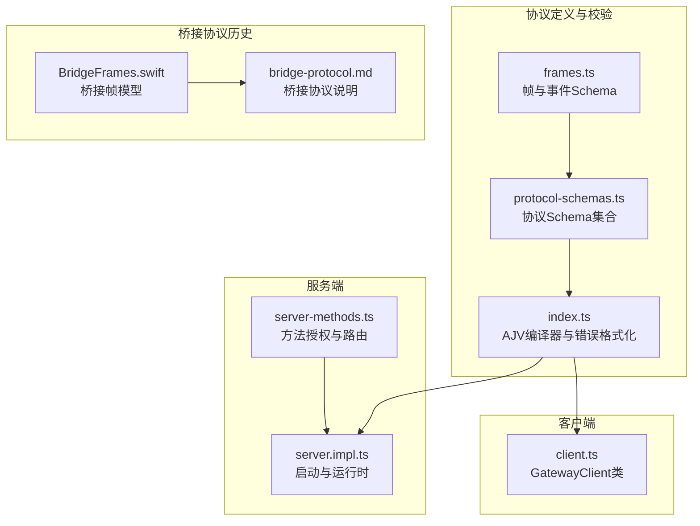
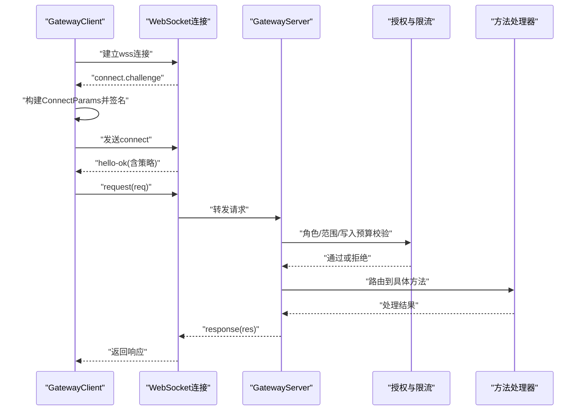
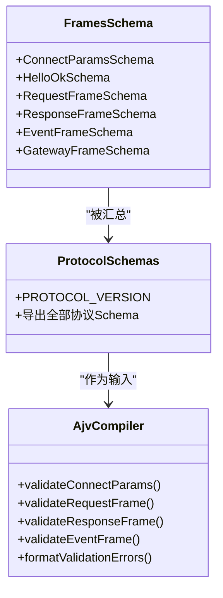
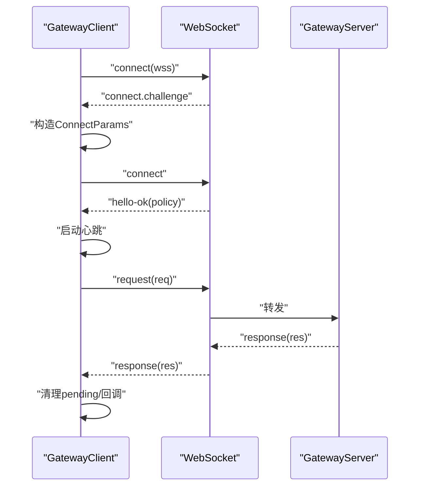
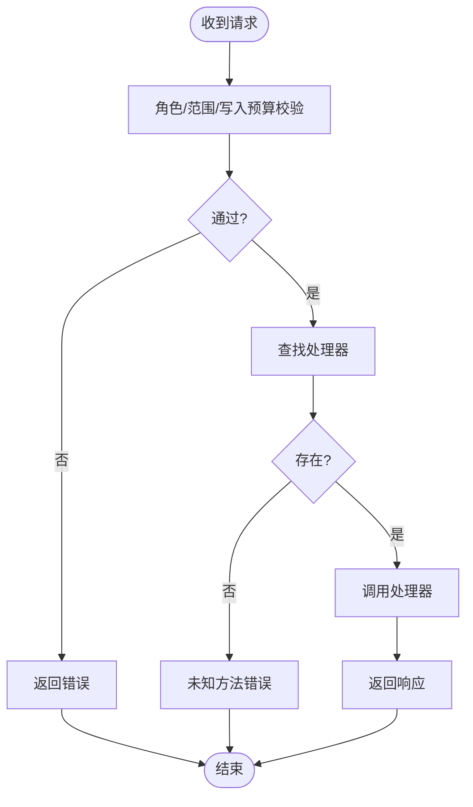
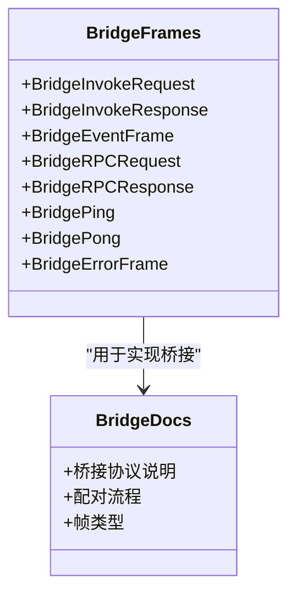
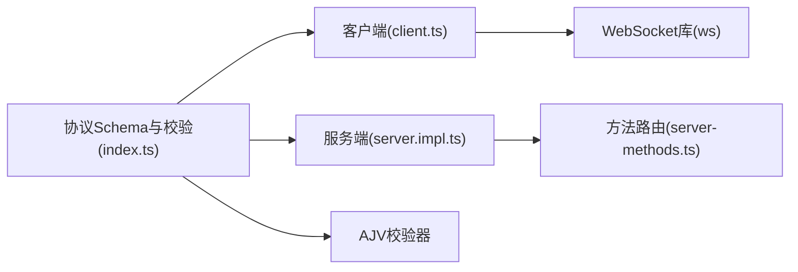

# 协议适配层

<cite>
**本文引用的文件**
- [src/gateway/protocol/index.ts](file://src/gateway/protocol/index.ts)
- [src/gateway/protocol/schema.ts](file://src/gateway/protocol/schema.ts)
- [src/gateway/protocol/schema/frames.ts](file://src/gateway/protocol/schema/frames.ts)
- [src/gateway/protocol/schema/protocol-schemas.ts](file://src/gateway/protocol/schema/protocol-schemas.ts)
- [src/gateway/client.ts](file://src/gateway/client.ts)
- [src/gateway/server.ts](file://src/gateway/server.ts)
- [src/gateway/server.impl.ts](file://src/gateway/server.impl.ts)
- [src/gateway/server-methods.ts](file://src/gateway/server-methods.ts)
- [apps/shared/OpenClawKit/Sources/OpenClawKit/BridgeFrames.swift](file://apps/shared/OpenClawKit/Sources/OpenClawKit/BridgeFrames.swift)
- [apps/shared/OpenClawKit/Sources/OpenClawKit/GatewayNodeSession.swift](file://apps/shared/OpenClawKit/Sources/OpenClawKit/GatewayNodeSession.swift)
- [docs/gateway/bridge-protocol.md](file://docs/gateway/bridge-protocol.md)
</cite>

## 目录

1. [简介](#简介)
2. [项目结构](#项目结构)
3. [核心组件](#核心组件)
4. [架构总览](#架构总览)
5. [详细组件分析](#详细组件分析)
6. [依赖关系分析](#依赖关系分析)
7. [性能考量](#性能考量)
8. [故障排查指南](#故障排查指南)
9. [结论](#结论)
10. [附录](#附录)

## 简介

本文件系统性梳理 OpenClaw 网关协议适配层，聚焦以下目标：

- 协议转换机制：消息格式标准化、通道特定协议适配、双向通信桥接
- 支持的协议类型与版本：统一 Gateway WebSocket 协议与历史 Bridge 协议
- 协议转换规则与数据序列化方法：TypeBox Schema 驱动的强类型校验与 AJV 校验器
- 消息模型统一：通过内部帧模型屏蔽不同渠道的消息差异
- 扩展机制：协议 Schema 可扩展、方法处理器可插拔
- 性能优化策略：连接保活、背压与速率限制、TLS 指纹校验
- 配置示例与调试技巧：最小可运行示例与常见问题定位

## 项目结构

协议适配层主要由三部分组成：

- 协议定义与校验：TypeBox Schema + AJV 校验器
- 客户端与服务端实现：WebSocket 连接、请求/响应帧处理、方法路由
- 桥接协议（历史）：面向旧节点的 TCP JSONL 桥接与配对流程

**图表来源**

- [src/gateway/protocol/schema/frames.ts](file://src/gateway/protocol/schema/frames.ts#L1-L164)
- [src/gateway/protocol/schema/protocol-schemas.ts](file://src/gateway/protocol/schema/protocol-schemas.ts#L1-L286)
- [src/gateway/protocol/index.ts](file://src/gateway/protocol/index.ts#L1-L640)
- [src/gateway/client.ts](file://src/gateway/client.ts#L1-L523)
- [src/gateway/server.impl.ts](file://src/gateway/server.impl.ts#L1-L200)
- [src/gateway/server-methods.ts](file://src/gateway/server-methods.ts#L1-L150)
- [apps/shared/OpenClawKit/Sources/OpenClawKit/BridgeFrames.swift](file://apps/shared/OpenClawKit/Sources/OpenClawKit/BridgeFrames.swift#L1-L262)
- [docs/gateway/bridge-protocol.md](file://docs/gateway/bridge-protocol.md#L1-L92)

**章节来源**

- [src/gateway/protocol/schema.ts](file://src/gateway/protocol/schema.ts#L1-L18)
- [src/gateway/protocol/index.ts](file://src/gateway/protocol/index.ts#L1-L640)
- [src/gateway/client.ts](file://src/gateway/client.ts#L1-L523)
- [src/gateway/server.impl.ts](file://src/gateway/server.impl.ts#L1-L200)
- [src/gateway/server-methods.ts](file://src/gateway/server-methods.ts#L1-L150)
- [apps/shared/OpenClawKit/Sources/OpenClawKit/BridgeFrames.swift](file://apps/shared/OpenClawKit/Sources/OpenClawKit/BridgeFrames.swift#L1-L262)
- [docs/gateway/bridge-protocol.md](file://docs/gateway/bridge-protocol.md#L1-L92)

## 核心组件

- 协议 Schema 与校验
  - 使用 TypeBox 定义帧、事件、参数与结果的严格 Schema，并导出协议 Schema 集合与当前协议版本常量
  - 使用 AJV 编译 Schema 生成验证函数，统一在协议入口导出
- 客户端 GatewayClient
  - 负责安全连接（wss+TLS指纹）、握手挑战、连接参数构建、请求/响应帧发送与等待、事件分发、重连与退避
  - 提供 request 方法，按 Schema 校验请求帧并维护 pending 映射
- 服务端 GatewayServer
  - 启动 WebSocket/HTTP 服务，注册方法处理器，执行权限校验与速率限制，转发请求到对应处理器
- 桥接协议（历史）
  - Swift 桥接帧模型与桥接协议说明文档，描述 TCP JSONL、配对与 RPC 的历史用法

**章节来源**

- [src/gateway/protocol/schema/protocol-schemas.ts](file://src/gateway/protocol/schema/protocol-schemas.ts#L153-L286)
- [src/gateway/protocol/index.ts](file://src/gateway/protocol/index.ts#L243-L432)
- [src/gateway/client.ts](file://src/gateway/client.ts#L85-L523)
- [src/gateway/server.impl.ts](file://src/gateway/server.impl.ts#L195-L200)
- [src/gateway/server-methods.ts](file://src/gateway/server-methods.ts#L66-L149)
- [apps/shared/OpenClawKit/Sources/OpenClawKit/BridgeFrames.swift](file://apps/shared/OpenClawKit/Sources/OpenClawKit/BridgeFrames.swift#L1-L262)
- [docs/gateway/bridge-protocol.md](file://docs/gateway/bridge-protocol.md#L1-L92)

## 架构总览

下图展示从客户端到服务端的典型交互路径，以及方法授权与路由。

**图表来源**

- [src/gateway/client.ts](file://src/gateway/client.ts#L168-L350)
- [src/gateway/server.impl.ts](file://src/gateway/server.impl.ts#L195-L200)
- [src/gateway/server-methods.ts](file://src/gateway/server-methods.ts#L97-L149)

## 详细组件分析

### 组件A：协议定义与校验（TypeBox + AJV）

- 设计要点
  - 帧与事件使用 TypeBox 定义，保证字段完整性与类型一致性
  - 协议 Schema 集合集中导出，便于客户端/服务端共享
  - AJV 编译器在运行时进行快速校验，并提供统一错误格式化
- 数据结构复杂度
  - Schema 定义为 O(1) 结构，校验复杂度取决于字段数量；整体以常数开销为主
- 依赖链
  - frames.ts 定义基础帧与事件
  - protocol-schemas.ts 汇总各模块 Schema 并导出协议版本
  - index.ts 编译 Schema 并导出校验函数与错误格式化工具
- 优化点
  - 将常用 Schema 缓存于内存，避免重复编译
  - 对大型响应启用压缩（如后续扩展）

**图表来源**

- [src/gateway/protocol/schema/frames.ts](file://src/gateway/protocol/schema/frames.ts#L20-L164)
- [src/gateway/protocol/schema/protocol-schemas.ts](file://src/gateway/protocol/schema/protocol-schemas.ts#L153-L286)
- [src/gateway/protocol/index.ts](file://src/gateway/protocol/index.ts#L243-L432)

**章节来源**

- [src/gateway/protocol/schema/frames.ts](file://src/gateway/protocol/schema/frames.ts#L1-L164)
- [src/gateway/protocol/schema/protocol-schemas.ts](file://src/gateway/protocol/schema/protocol-schemas.ts#L1-L286)
- [src/gateway/protocol/index.ts](file://src/gateway/protocol/index.ts#L243-L432)

### 组件B：客户端 GatewayClient（WebSocket）

- 功能
  - 安全连接：仅允许 wss；可选 TLS 指纹校验
  - 握手挑战：接收 connect.challenge 后发送 connect 请求
  - 请求/响应：UUID 标识请求，等待响应或最终状态
  - 事件分发：解析事件帧并回调
  - 保活与断线重连：心跳检测、指数退避重连
- 错误处理
  - 连接失败、超时、策略违规、设备令牌不匹配等场景均有明确处理
- 性能特性
  - 大载荷支持（最大 25MB），适合屏幕快照等场景
  - 心跳间隔可由服务端策略动态调整

**图表来源**

- [src/gateway/client.ts](file://src/gateway/client.ts#L168-L350)
- [src/gateway/client.ts](file://src/gateway/client.ts#L352-L403)
- [src/gateway/client.ts](file://src/gateway/client.ts#L445-L467)

**章节来源**

- [src/gateway/client.ts](file://src/gateway/client.ts#L85-L523)

### 组件C：服务端 GatewayServer 与方法路由

- 功能
  - 启动服务、注册方法处理器、执行角色/范围授权、控制面写入限流
  - 将请求路由到对应处理器并返回响应
- 授权与限流
  - 角色与范围校验，管理员范围豁免，写操作受预算限制
- 方法集
  - 包含连接、聊天、会话、配置、设备、技能、工具目录、系统、更新、代理等完整方法集

**图表来源**

- [src/gateway/server-methods.ts](file://src/gateway/server-methods.ts#L37-L149)

**章节来源**

- [src/gateway/server.impl.ts](file://src/gateway/server.impl.ts#L195-L200)
- [src/gateway/server-methods.ts](file://src/gateway/server-methods.ts#L66-L149)

### 组件D：桥接协议（历史）与双向桥接

- 桥接协议
  - 历史上的 TCP JSONL 协议，用于旧节点与网关的配对与受限 RPC
  - 文档说明了帧类型、配对流程、生命周期事件与尾网使用方式
- Swift 桥接帧模型
  - 定义了 invoke/invoke-res、req/res、event、ping/pong、error 等帧结构
  - 支持节点命令调用与事件订阅
- 双向桥接
  - 服务端通过方法处理器将内部消息映射为桥接事件
  - 客户端通过 GatewayNodeSession 将桥接命令转换为内部调用

**图表来源**

- [apps/shared/OpenClawKit/Sources/OpenClawKit/BridgeFrames.swift](file://apps/shared/OpenClawKit/Sources/OpenClawKit/BridgeFrames.swift#L11-L261)
- [docs/gateway/bridge-protocol.md](file://docs/gateway/bridge-protocol.md#L42-L92)

**章节来源**

- [apps/shared/OpenClawKit/Sources/OpenClawKit/BridgeFrames.swift](file://apps/shared/OpenClawKit/Sources/OpenClawKit/BridgeFrames.swift#L1-L262)
- [docs/gateway/bridge-protocol.md](file://docs/gateway/bridge-protocol.md#L1-L92)

## 依赖关系分析

- 协议层耦合
  - 协议 Schema 与校验器低耦合，通过集中导出解耦客户端与服务端
  - 客户端依赖协议校验器进行请求帧校验
  - 服务端依赖协议校验器与方法路由表
- 外部依赖
  - ws 用于 WebSocket 客户端
  - AJV 用于 Schema 校验
  - Node 内置 crypto/path 用于设备认证与路径解析

**图表来源**

- [src/gateway/protocol/index.ts](file://src/gateway/protocol/index.ts#L243-L432)
- [src/gateway/client.ts](file://src/gateway/client.ts#L1-L523)
- [src/gateway/server.impl.ts](file://src/gateway/server.impl.ts#L1-L200)
- [src/gateway/server-methods.ts](file://src/gateway/server-methods.ts#L1-L150)

**章节来源**

- [src/gateway/protocol/index.ts](file://src/gateway/protocol/index.ts#L1-L640)
- [src/gateway/client.ts](file://src/gateway/client.ts#L1-L523)
- [src/gateway/server.impl.ts](file://src/gateway/server.impl.ts#L1-L200)
- [src/gateway/server-methods.ts](file://src/gateway/server-methods.ts#L1-L150)

## 性能考量

- 连接保活
  - 服务端策略包含心跳间隔，客户端定时发送心跳并检测超时
- 背压与缓冲
  - 服务端策略包含最大载荷与缓冲字节限制，防止内存压力
- 速率限制
  - 控制面写入方法（如 config.apply）受预算限制，避免滥用
- TLS 指纹校验
  - 在 wss 场景下可选指纹校验，提升安全性同时保持握手开销可控

**章节来源**

- [src/gateway/client.ts](file://src/gateway/client.ts#L445-L467)
- [src/gateway/protocol/schema/frames.ts](file://src/gateway/protocol/schema/frames.ts#L102-L110)
- [src/gateway/server-methods.ts](file://src/gateway/server-methods.ts#L106-L131)

## 故障排查指南

- 连接失败
  - 检查是否使用 wss；若使用非本地地址，需使用 wss 或隧道
  - 若启用 TLS 指纹，确认指纹一致且未过期
- 握手超时
  - 确认 connect.challenge 是否到达；检查网络延迟与防火墙
- 设备令牌不匹配
  - 服务端关闭时可能清除设备令牌缓存，需重新配对
- 响应未达或超时
  - 检查 pending 映射与 expectFinal 标记；必要时增大超时或禁用
- 权限不足
  - 校验角色与范围；管理员范围可豁免多数限制

**章节来源**

- [src/gateway/client.ts](file://src/gateway/client.ts#L112-L137)
- [src/gateway/client.ts](file://src/gateway/client.ts#L168-L178)
- [src/gateway/client.ts](file://src/gateway/client.ts#L186-L206)
- [src/gateway/client.ts](file://src/gateway/client.ts#L405-L423)
- [src/gateway/server-methods.ts](file://src/gateway/server-methods.ts#L37-L64)

## 结论

OpenClaw 协议适配层通过强类型的 Schema 与 AJV 校验器，实现了统一的内部消息模型与严格的协议约束；GatewayClient 与 GatewayServer 分别负责两端的连接管理、授权与方法路由；桥接协议作为历史兼容层，保留了对旧节点的支持。整体设计具备良好的扩展性与安全性，适合在多渠道、多角色的复杂环境中稳定运行。

## 附录

### 协议类型与版本

- 当前统一协议：Gateway WebSocket 协议，版本号在协议 Schema 中集中定义
- 历史协议：Bridge 协议（TCP JSONL），已不再默认启用

**章节来源**

- [src/gateway/protocol/schema/protocol-schemas.ts](file://src/gateway/protocol/schema/protocol-schemas.ts#L285-L286)
- [docs/gateway/bridge-protocol.md](file://docs/gateway/bridge-protocol.md#L12-L19)

### 协议转换规则与数据序列化

- 序列化：请求/响应/事件帧采用 JSON；参数与结果遵循 Schema
- 转换：客户端/服务端均使用同一套 Schema 校验，确保跨端一致性
- 版本：协议版本在 hello-ok 中协商，客户端可设置 min/maxProtocol

**章节来源**

- [src/gateway/protocol/schema/frames.ts](file://src/gateway/protocol/schema/frames.ts#L125-L164)
- [src/gateway/protocol/index.ts](file://src/gateway/protocol/index.ts#L243-L432)

### 协议扩展机制

- 新增方法：在方法路由表中添加处理器，并在协议 Schema 中补充参数/结果 Schema
- 新增帧类型：在 frames.ts 中定义新帧 Schema，并在协议 Schema 集合中注册
- 兼容性：新增字段建议使用可选字段，避免破坏现有客户端

**章节来源**

- [src/gateway/server-methods.ts](file://src/gateway/server-methods.ts#L66-L95)
- [src/gateway/protocol/schema/protocol-schemas.ts](file://src/gateway/protocol/schema/protocol-schemas.ts#L153-L286)

### 自定义协议适配与桥接

- 旧节点适配：通过桥接协议与 Swift 桥接帧模型实现命令调用与事件订阅
- 配对流程：节点发起 pair-request，网关审批后下发 pair-ok 与 hello-ok
- 事件映射：系统运行事件映射为网关事件，供节点订阅

**章节来源**

- [apps/shared/OpenClawKit/Sources/OpenClawKit/BridgeFrames.swift](file://apps/shared/OpenClawKit/Sources/OpenClawKit/BridgeFrames.swift#L140-L181)
- [docs/gateway/bridge-protocol.md](file://docs/gateway/bridge-protocol.md#L42-L70)

### 性能优化策略

- 启用 wss 并使用 TLS 指纹校验，减少中间人风险
- 合理设置心跳间隔与最大载荷，平衡实时性与资源占用
- 控制面写入限流，避免突发写入导致拥塞

**章节来源**

- [src/gateway/client.ts](file://src/gateway/client.ts#L112-L137)
- [src/gateway/protocol/schema/frames.ts](file://src/gateway/protocol/schema/frames.ts#L102-L110)
- [src/gateway/server-methods.ts](file://src/gateway/server-methods.ts#L106-L131)

### 协议配置示例与调试技巧

- 最小可运行示例
  - 客户端：指定 wss 地址、可选 TLS 指纹、连接参数（role/scopes/caps 等）
  - 服务端：启动 GatewayServer，默认启用方法集与授权策略
- 调试技巧
  - 开启日志子系统，关注 ws、auth、plugins、health 等子日志
  - 使用 connect.challenge 与 hello-ok 确认握手成功
  - 通过 request/response 定位方法级问题

**章节来源**

- [src/gateway/client.ts](file://src/gateway/client.ts#L43-L72)
- [src/gateway/server.impl.ts](file://src/gateway/server.impl.ts#L195-L200)
