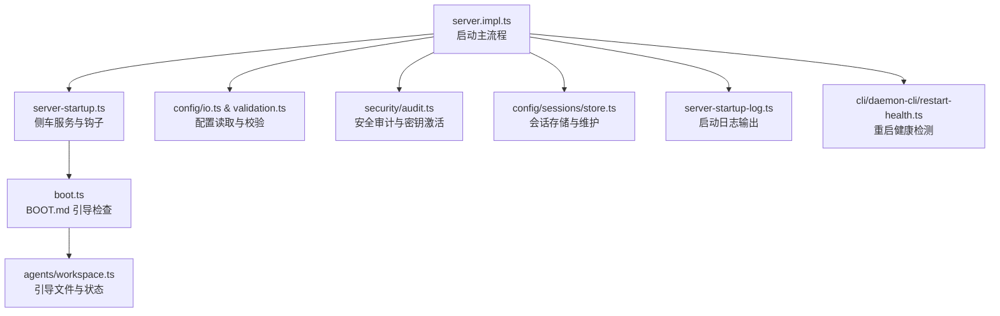
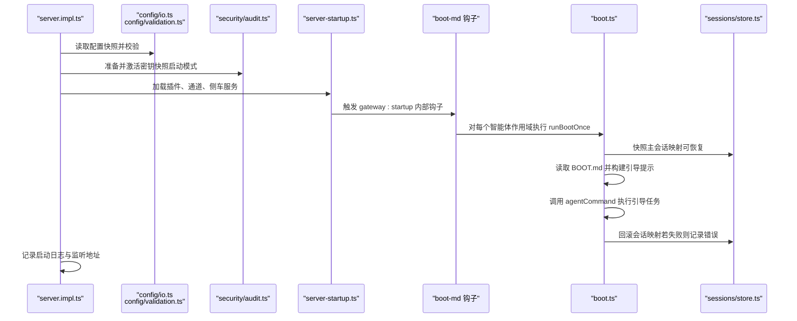
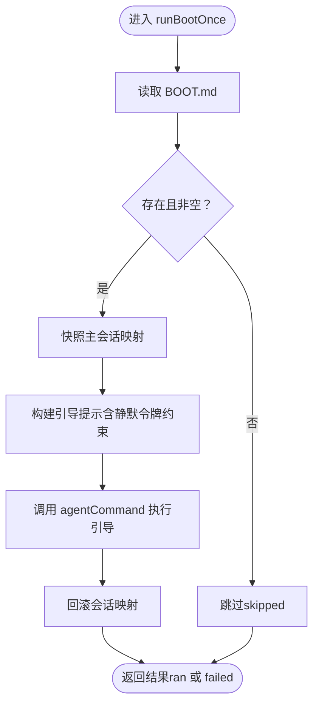
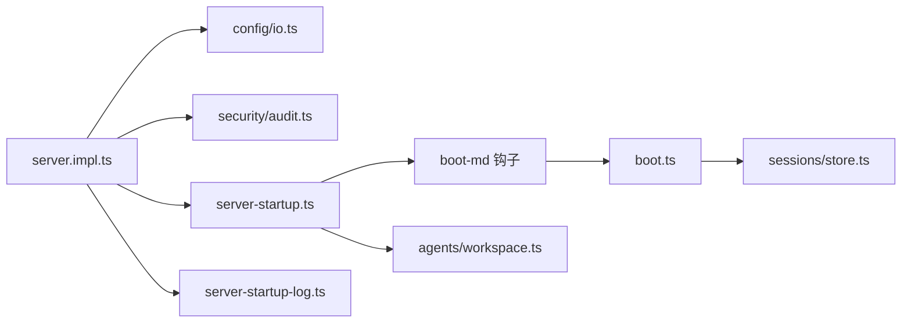

# 网关启动流程

<cite>
**本文引用的文件**
- [src/gateway/boot.ts](file://src/gateway/boot.ts)
- [src/hooks/bundled/boot-md/handler.ts](file://src/hooks/bundled/boot-md/handler.ts)
- [src/hooks/bundled/boot-md/HOOK.md](file://src/hooks/bundled/boot-md/HOOK.md)
- [docs/reference/templates/BOOT.md](file://docs/reference/templates/BOOT.md)
- [src/gateway/server-startup.ts](file://src/gateway/server-startup.ts)
- [src/gateway/server.impl.ts](file://src/gateway/server.impl.ts)
- [src/config/sessions/store.ts](file://src/config/sessions/store.ts)
- [src/gateway/server-startup-log.ts](file://src/gateway/server-startup-log.ts)
- [src/config/validation.ts](file://src/config/validation.ts)
- [src/config/io.ts](file://src/config/io.ts)
- [src/security/audit.ts](file://src/security/audit.ts)
- [src/agents/workspace.ts](file://src/agents/workspace.ts)
- [src/cli/daemon-cli/restart-health.ts](file://src/cli/daemon-cli/restart-health.ts)
</cite>

## 目录

1. [简介](#简介)
2. [项目结构](#项目结构)
3. [核心组件](#核心组件)
4. [架构总览](#架构总览)
5. [详细组件分析](#详细组件分析)
6. [依赖关系分析](#依赖关系分析)
7. [性能考量](#性能考量)
8. [故障排除指南](#故障排除指南)
9. [结论](#结论)
10. [附录](#附录)

## 简介

本文件系统性梳理 OpenClaw 网关的启动流程，重点覆盖以下方面：

- 启动序列与控制流：从配置读取、安全检查、资源初始化到内部钩子触发与服务就绪
- 引导检查机制（BOOT.md）：作用、处理流程、会话映射快照与错误恢复
- 会话状态的持久化与恢复：会话存储的读写、缓存与维护、映射快照与回滚
- 安全检查、配置验证与资源初始化：密钥激活、配置校验、通道与插件加载
- 启动失败的诊断与故障排除：日志、健康检查、重启健康检测
- 启动配置示例与最佳实践：基于模板与内置钩子的建议

## 项目结构

围绕“启动”主题的关键目录与文件：

- 网关启动与生命周期：src/gateway/server.impl.ts、src/gateway/server-startup.ts、src/gateway/server-startup-log.ts
- 引导检查（BOOT.md）：src/hooks/bundled/boot-md/\*、docs/reference/templates/BOOT.md
- 会话与存储：src/config/sessions/store.ts
- 配置与验证：src/config/io.ts、src/config/validation.ts
- 安全审计：src/security/audit.ts
- 工作区与引导文件：src/agents/workspace.ts
- 重启与健康诊断：src/cli/daemon-cli/restart-health.ts

图表来源

- [src/gateway/server.impl.ts](file://src/gateway/server.impl.ts#L195-L345)
- [src/gateway/server-startup.ts](file://src/gateway/server-startup.ts#L34-L191)
- [src/gateway/boot.ts](file://src/gateway/boot.ts#L138-L202)
- [src/config/io.ts](file://src/config/io.ts#L714-L747)
- [src/config/validation.ts](file://src/config/validation.ts#L132-L171)
- [src/security/audit.ts](file://src/security/audit.ts#L54-L106)
- [src/config/sessions/store.ts](file://src/config/sessions/store.ts#L1-L200)
- [src/gateway/server-startup-log.ts](file://src/gateway/server-startup-log.ts#L8-L44)
- [src/agents/workspace.ts](file://src/agents/workspace.ts#L150-L208)
- [src/cli/daemon-cli/restart-health.ts](file://src/cli/daemon-cli/restart-health.ts#L1-L139)

章节来源

- [src/gateway/server.impl.ts](file://src/gateway/server.impl.ts#L195-L345)
- [src/gateway/server-startup.ts](file://src/gateway/server-startup.ts#L34-L191)

## 核心组件

- 启动主流程（server.impl.ts）
  - 读取并迁移旧配置、校验新配置、自动启用插件、准备并激活密钥快照、加载插件与通道、创建运行时状态、启动侧车服务、触发内部钩子、记录启动日志、暴露服务端口
- 侧车与钩子（server-startup.ts）
  - 清理过期会话锁、启动浏览器控制、启动 Gmail 监视器、加载内部钩子、按配置启动通道、触发 gateway:startup 内部钩子事件
- 引导检查（BOOT.md）（boot.ts 与 boot-md 钩子）
  - 在每个智能体作用域查找 BOOT.md，构建引导提示，以静默回复令牌确保无副作用地执行消息工具指令，并在完成后回滚会话映射
- 会话存储（sessions/store.ts）
  - 提供会话存储的加载、缓存、规范化、更新与维护（含备份轮换、磁盘预算清理等）
- 配置与安全（config/io.ts、config/validation.ts、security/audit.ts）
  - 配置读取与插件校验、默认值应用与路径归一化；安全审计与密钥激活策略，启动阶段要求密钥可用
- 启动日志（server-startup-log.ts）
  - 输出监听地址、模型信息、日志文件位置、危险配置警告
- 工作区与引导文件（agents/workspace.ts）
  - 定义受支持的引导文件名集合，提供缺失文件写入与存在性判断

章节来源

- [src/gateway/server.impl.ts](file://src/gateway/server.impl.ts#L195-L345)
- [src/gateway/server-startup.ts](file://src/gateway/server-startup.ts#L34-L191)
- [src/gateway/boot.ts](file://src/gateway/boot.ts#L138-L202)
- [src/config/sessions/store.ts](file://src/config/sessions/store.ts#L1-L200)
- [src/config/io.ts](file://src/config/io.ts#L714-L747)
- [src/config/validation.ts](file://src/config/validation.ts#L132-L171)
- [src/security/audit.ts](file://src/security/audit.ts#L54-L106)
- [src/gateway/server-startup-log.ts](file://src/gateway/server-startup-log.ts#L8-L44)
- [src/agents/workspace.ts](file://src/agents/workspace.ts#L150-L208)

## 架构总览

下图展示启动阶段的关键交互：配置读取与校验、密钥激活、插件与通道加载、内部钩子触发、BOOT.md 执行、会话存储维护与日志输出。

图表来源

- [src/gateway/server.impl.ts](file://src/gateway/server.impl.ts#L213-L345)
- [src/gateway/server-startup.ts](file://src/gateway/server-startup.ts#L142-L151)
- [src/hooks/bundled/boot-md/handler.ts](file://src/hooks/bundled/boot-md/handler.ts#L10-L42)
- [src/gateway/boot.ts](file://src/gateway/boot.ts#L138-L202)
- [src/config/sessions/store.ts](file://src/config/sessions/store.ts#L114-L136)

## 详细组件分析

### 组件A：启动主流程（server.impl.ts）

- 关键职责
  - 读取配置快照并迁移旧配置，校验配置有效性，自动启用插件并写回变更
  - 准备并激活密钥快照，启动阶段要求密钥可用，否则直接抛出启动失败错误
  - 加载插件与通道，创建运行时状态，启动侧车服务（如发现、定时任务、心跳等）
  - 触发内部钩子（gateway:startup），记录启动日志，暴露服务端口
- 错误恢复策略
  - 密钥激活失败在启动阶段直接中断；非启动阶段降级为保留上次已知良好快照并发出事件通知
  - 配置无效时立即抛错，提示使用 doctor 修复
- 性能与并发
  - 使用串行化的密钥激活操作，避免竞态；侧车服务异步启动，不影响主流程

章节来源

- [src/gateway/server.impl.ts](file://src/gateway/server.impl.ts#L213-L345)

### 组件B：侧车与钩子（server-startup.ts）

- 关键职责
  - 清理过期会话锁文件，避免死锁
  - 启动浏览器控制服务器、Gmail 监视器、插件服务、Acp 身份协调与内存后端
  - 加载内部钩子处理器，按配置决定是否启动通道
  - 延迟触发 gateway:startup 内部钩子事件，确保环境就绪
- 安全与健壮性
  - 对各子系统启动异常进行捕获与告警，不阻断整体启动
  - 支持通过环境变量跳过通道启动（用于测试）

章节来源

- [src/gateway/server-startup.ts](file://src/gateway/server-startup.ts#L34-L191)

### 组件C：引导检查（BOOT.md）与会话映射快照（boot.ts 与 boot-md 钩子）

- BOOT.md 的作用
  - 作为智能体作用域内的启动引导清单，指导网关在首次启动或特定场景下执行必要的初始化步骤
  - 文档模板定义了最小化指引：启用内部钩子、使用消息工具发送消息后以静默令牌回复
- 处理流程
  - 钩子在 gateway:startup 事件中被触发，遍历所有智能体作用域
  - 对每个作用域解析工作区目录，调用 runBootOnce
  - runBootOnce 流程：
    - 读取 BOOT.md（不存在或为空则跳过）
    - 生成引导会话 ID，快照主会话映射（含可恢复标记）
    - 构建引导提示（包含工具使用与静默回复令牌约束）
    - 调用 agentCommand 执行引导命令（deliver=false，避免真实投递）
    - 无论成功与否，尝试回滚会话映射（失败则记录错误）
- 会话映射快照与恢复
  - 快照包含 storePath、sessionKey、canRestore、hadEntry 以及可选 entry
  - 恢复逻辑根据 hadEntry 判断新增或删除对应键，异常时返回错误信息
- 错误恢复策略
  - 若 agent 运行失败或映射恢复失败，返回 failed 状态并汇总原因
  - 钩子对单个作用域的失败进行记录并继续下一个作用域

图表来源

- [src/gateway/boot.ts](file://src/gateway/boot.ts#L138-L202)
- [src/gateway/boot.ts](file://src/gateway/boot.ts#L76-L136)

章节来源

- [src/gateway/boot.ts](file://src/gateway/boot.ts#L138-L202)
- [src/hooks/bundled/boot-md/handler.ts](file://src/hooks/bundled/boot-md/handler.ts#L10-L42)
- [src/hooks/bundled/boot-md/HOOK.md](file://src/hooks/bundled/boot-md/HOOK.md#L1-L21)
- [docs/reference/templates/BOOT.md](file://docs/reference/templates/BOOT.md#L1-L12)

### 组件D：会话状态的持久化与恢复（sessions/store.ts）

- 数据结构与复杂度
  - 会话存储为键值映射，规范化与合并逻辑在加载时完成，时间复杂度近似 O(n)（n 为条目数）
  - 缓存采用 Map 结构，TTL 控制在 45 秒左右，减少频繁 IO
- 维护与备份
  - 写入前失效缓存，写后归一化存储；支持维护模式（warn-only）与回调统计
  - 自动清理超过上限的备份文件，避免磁盘占用膨胀
- 与引导流程的关系
  - 引导前快照当前会话映射，引导后回滚，保证引导期间不会污染持久化状态

章节来源

- [src/config/sessions/store.ts](file://src/config/sessions/store.ts#L1-L200)
- [src/config/sessions/store.ts](file://src/config/sessions/store.ts#L614-L656)

### 组件E：安全检查、配置验证与资源初始化

- 配置验证
  - 读取配置快照并进行插件校验，应用默认值与路径归一化，输出警告与未来版本提示
- 安全审计
  - 提供安全审计报告结构，包含严重级别、发现项与修复建议；启动阶段要求密钥可用
- 资源初始化
  - 启动阶段准备并激活密钥快照，失败即刻终止；随后加载插件与通道，创建运行时状态

章节来源

- [src/config/io.ts](file://src/config/io.ts#L714-L747)
- [src/config/validation.ts](file://src/config/validation.ts#L132-L171)
- [src/security/audit.ts](file://src/security/audit.ts#L54-L106)
- [src/gateway/server.impl.ts](file://src/gateway/server.impl.ts#L328-L345)

### 组件F：启动日志与诊断（server-startup-log.ts）

- 输出内容
  - 显示代理模型、监听地址（支持 IPv6 方括号格式）、日志文件路径
  - 在 Nix 模式下提示外部管理配置
  - 检测并警告危险配置标志
- 用途
  - 便于运维快速确认启动参数与运行状态

章节来源

- [src/gateway/server-startup-log.ts](file://src/gateway/server-startup-log.ts#L8-L44)

### 组件G：工作区与引导文件（agents/workspace.ts）

- 受支持的引导文件名集合（如 DEFAULT_BOOTSTRAP_FILENAME 等）
- 提供缺失文件写入与存在性判断，保障工作区完整性

章节来源

- [src/agents/workspace.ts](file://src/agents/workspace.ts#L150-L208)

## 依赖关系分析

- 组件耦合
  - server.impl.ts 作为入口，耦合 config、security、plugins、channels、startup 等模块
  - server-startup.ts 依赖内部钩子、通道管理器与插件服务
  - boot.ts 依赖 agentCommand、会话存储与令牌常量
- 外部依赖
  - 文件系统（读取 BOOT.md、会话存储文件）
  - 日志系统（子系统日志与启动日志）
  - 环境变量（控制通道启动、缓存 TTL 等）

图表来源

- [src/gateway/server.impl.ts](file://src/gateway/server.impl.ts#L1-L120)
- [src/gateway/server-startup.ts](file://src/gateway/server-startup.ts#L1-L48)
- [src/hooks/bundled/boot-md/handler.ts](file://src/hooks/bundled/boot-md/handler.ts#L1-L8)
- [src/gateway/boot.ts](file://src/gateway/boot.ts#L1-L17)
- [src/config/sessions/store.ts](file://src/config/sessions/store.ts#L1-L31)
- [src/gateway/server-startup-log.ts](file://src/gateway/server-startup-log.ts#L1-L7)
- [src/agents/workspace.ts](file://src/agents/workspace.ts#L150-L179)

## 性能考量

- 会话存储缓存：默认 TTL 约 45 秒，减少重复读取；写入前后失效缓存保证一致性
- 维护与备份：写入时进行维护与备份轮换，避免磁盘占用持续增长
- 启动阶段异步化：通道与插件服务异步启动，不影响主流程；钩子延迟触发以确保环境就绪
- 密钥激活串行化：避免并发竞争导致的不稳定

## 故障排除指南

- 启动失败（配置无效）
  - 现象：启动阶段抛出“Invalid config”错误
  - 排查：使用 doctor 修复配置，重新启动
  - 参考：配置读取与校验流程
- 启动失败（密钥不可用）
  - 现象：启动阶段因密钥不可用而失败
  - 排查：检查密钥来源与权限，确保密钥快照可准备并激活
  - 参考：密钥激活流程与错误处理
- BOOT.md 执行失败
  - 现象：runBootOnce 返回 failed，包含 agent run failed 或 mapping restore failed
  - 排查：查看钩子日志与引导提示构建；确认消息工具调用与静默令牌使用；检查会话存储写入权限
  - 参考：引导检查流程与会话映射恢复
- 重启健康问题
  - 现象：重启后服务未就绪或端口占用
  - 排查：使用重启健康检测工具检查运行时状态、端口占用与僵尸进程
  - 参考：重启健康检测与诊断渲染
- 危险配置警告
  - 现象：启动日志提示危险配置标志
  - 排查：运行安全审计，禁用不必要的危险标志
  - 参考：安全审计与启动日志

章节来源

- [src/config/io.ts](file://src/config/io.ts#L714-L747)
- [src/gateway/server.impl.ts](file://src/gateway/server.impl.ts#L319-L325)
- [src/gateway/boot.ts](file://src/gateway/boot.ts#L194-L202)
- [src/cli/daemon-cli/restart-health.ts](file://src/cli/daemon-cli/restart-health.ts#L31-L128)
- [src/gateway/server-startup-log.ts](file://src/gateway/server-startup-log.ts#L37-L43)
- [src/security/audit.ts](file://src/security/audit.ts#L444-L476)

## 结论

OpenClaw 网关启动流程以“配置—安全—资源—钩子—服务”的顺序展开，BOOT.md 引导检查通过会话映射快照与恢复确保启动过程的原子性与可回滚性。会话存储具备完善的缓存与维护机制，启动阶段的安全与配置校验保障了运行时的稳定性。结合健康检测与诊断工具，可快速定位并解决启动与重启过程中的问题。

## 附录

### 启动配置示例与最佳实践

- 使用内置模板添加 BOOT.md
  - 参考模板文件，明确引导任务与消息工具使用规范
- 启动前检查
  - 确认配置有效并通过插件校验
  - 确保密钥快照可激活
  - 检查工作区引导文件完整性
- 引导任务编写建议
  - 仅启用必要钩子，避免冗余操作
  - 使用消息工具发送消息后必须以静默令牌回复
  - 将可能失败的操作放在引导检查中，以便回滚
- 安全与合规
  - 禁用危险配置标志，运行安全审计
  - 启动日志中关注危险配置警告

章节来源

- [docs/reference/templates/BOOT.md](file://docs/reference/templates/BOOT.md#L1-L12)
- [src/gateway/server-startup-log.ts](file://src/gateway/server-startup-log.ts#L37-L43)
- [src/security/audit.ts](file://src/security/audit.ts#L444-L476)
