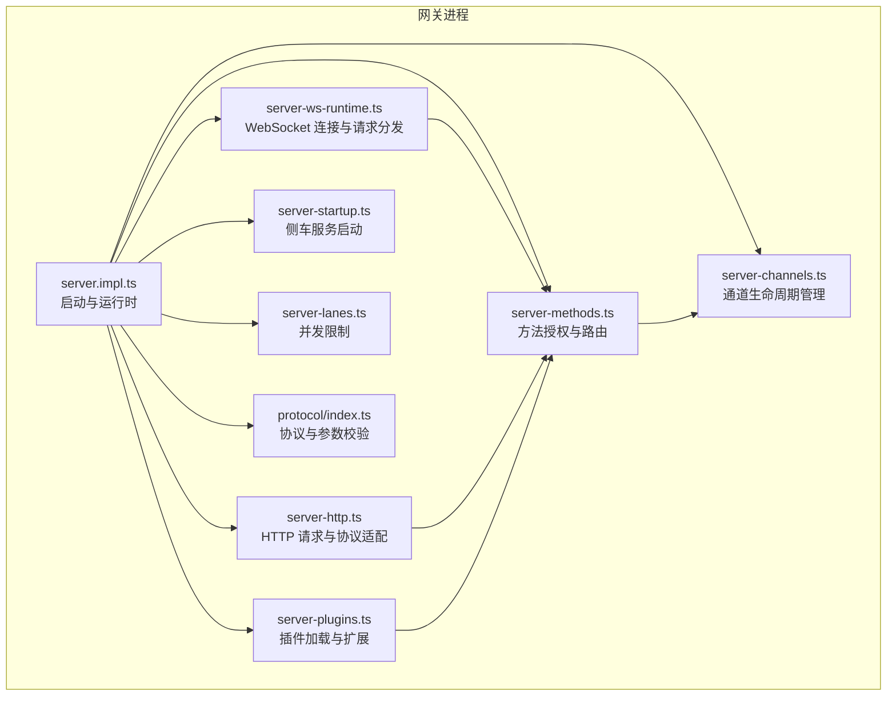
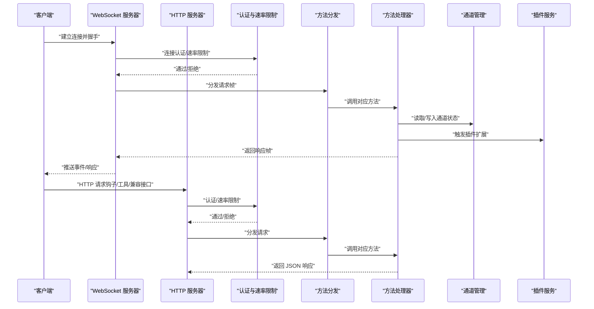
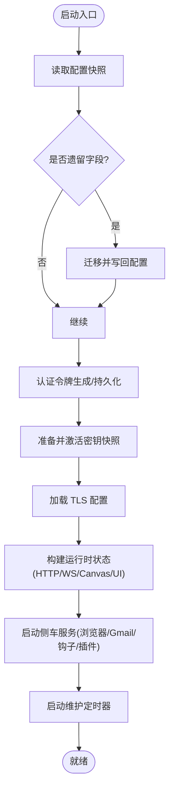
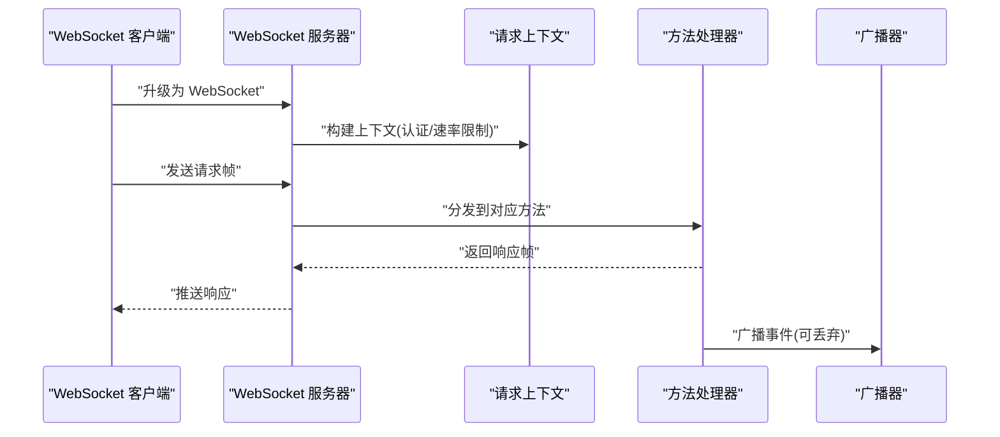
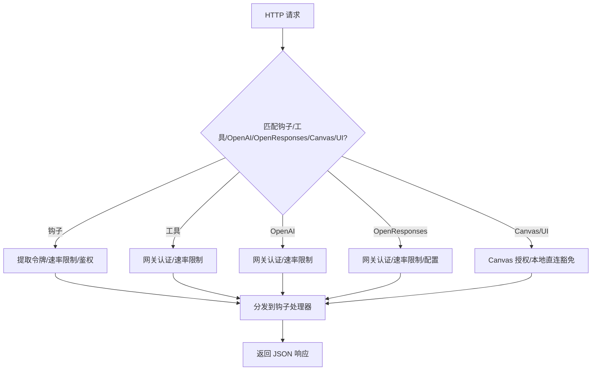
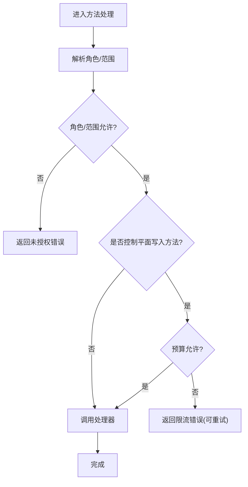
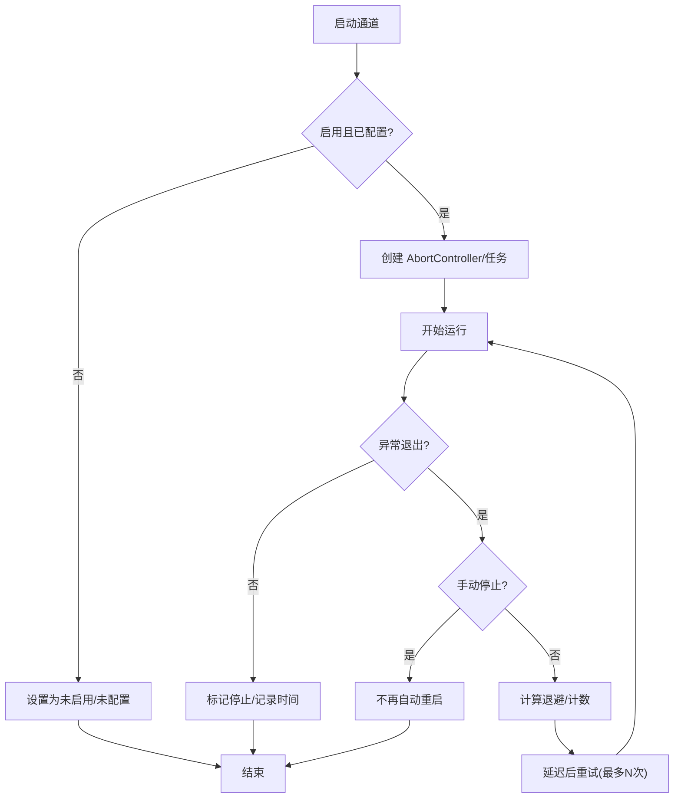
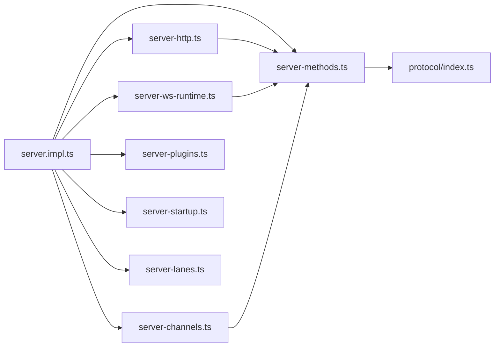

# 网关架构

<cite>
**本文引用的文件**   
- [src/gateway/server.ts](file://src/gateway/server.ts)
- [src/gateway/server.impl.ts](file://src/gateway/server.impl.ts)
- [src/gateway/server-startup.ts](file://src/gateway/server-startup.ts)
- [src/gateway/server-http.ts](file://src/gateway/server-http.ts)
- [src/gateway/server-ws-runtime.ts](file://src/gateway/server-ws-runtime.ts)
- [src/gateway/server-methods.ts](file://src/gateway/server-methods.ts)
- [src/gateway/server-channels.ts](file://src/gateway/server-channels.ts)
- [src/gateway/server-plugins.ts](file://src/gateway/server-plugins.ts)
- [src/gateway/server-lanes.ts](file://src/gateway/server-lanes.ts)
- [src/gateway/protocol/index.ts](file://src/gateway/protocol/index.ts)
- [src/gateway/boot.ts](file://src/gateway/boot.ts)
- [scripts/e2e/gateway-network-docker.sh](file://scripts/e2e/gateway-network-docker.sh)
- [src/gateway/test-helpers.server.ts](file://src/gateway/test-helpers.server.ts)
</cite>

## 目录

1. [引言](#引言)
2. [项目结构](#项目结构)
3. [核心组件](#核心组件)
4. [架构总览](#架构总览)
5. [详细组件分析](#详细组件分析)
6. [依赖关系分析](#依赖关系分析)
7. [性能考量](#性能考量)
8. [故障排查指南](#故障排查指南)
9. [结论](#结论)
10. [附录：配置与最佳实践](#附录配置与最佳实践)

## 引言

本文件系统性阐述 OpenClaw 网关的架构设计与实现要点，聚焦以下主题：

- 控制平面与数据平面的分离：方法授权、速率限制与事件广播的职责划分
- 消息路由与协议适配：WebSocket 请求处理、HTTP 协议适配与插件扩展点
- 负载均衡与故障转移：通道（Channel）生命周期管理与自动重启策略
- 启动流程与中间件体系：配置加载、认证初始化、TLS/安全头、插件服务与侧车启动
- 连接管理与会话：节点注册、订阅、会话键解析与会话状态同步
- 集群部署与高可用：Tailscale 暴露、健康检查、诊断心跳与更新检查
- 性能优化与并发控制：命令队列与通道并发限制
- 配置示例与最佳实践：端口绑定、认证、TLS、钩子与插件

## 项目结构

OpenClaw 网关位于 src/gateway 目录，采用“按职责分层 + 插件化”的组织方式：

- server.\*：网关启动、运行时状态、HTTP/WebSocket 处理、方法分发与事件广播
- server-methods/\*：各方法处理器（如 chat、config、sessions 等）
- protocol/\*：协议定义、参数校验与错误模型
- server-channels.ts：通道生命周期管理（多账号、自动重启、运行时快照）
- server-plugins.ts：插件加载与方法扩展
- server-startup.ts：侧车服务（浏览器控制、Gmail 监视器、内部钩子、插件服务等）
- server-lanes.ts：命令队列并发限制（主代理、子代理、定时任务）

图表来源

- [src/gateway/server.impl.ts](file://src/gateway/server.impl.ts#L195-L800)
- [src/gateway/server-ws-runtime.ts](file://src/gateway/server-ws-runtime.ts#L9-L56)
- [src/gateway/server-http.ts](file://src/gateway/server-http.ts#L451-L630)
- [src/gateway/server-methods.ts](file://src/gateway/server-methods.ts#L97-L150)
- [src/gateway/server-channels.ts](file://src/gateway/server-channels.ts#L80-L414)
- [src/gateway/server-plugins.ts](file://src/gateway/server-plugins.ts#L5-L49)
- [src/gateway/server-startup.ts](file://src/gateway/server-startup.ts#L34-L191)
- [src/gateway/server-lanes.ts](file://src/gateway/server-lanes.ts#L6-L10)
- [src/gateway/protocol/index.ts](file://src/gateway/protocol/index.ts#L243-L432)

章节来源

- [src/gateway/server.ts](file://src/gateway/server.ts#L1-L4)
- [src/gateway/server.impl.ts](file://src/gateway/server.impl.ts#L195-L800)
- [src/gateway/server-http.ts](file://src/gateway/server-http.ts#L451-L630)
- [src/gateway/server-ws-runtime.ts](file://src/gateway/server-ws-runtime.ts#L9-L56)
- [src/gateway/server-methods.ts](file://src/gateway/server-methods.ts#L97-L150)
- [src/gateway/server-channels.ts](file://src/gateway/server-channels.ts#L80-L414)
- [src/gateway/server-plugins.ts](file://src/gateway/server-plugins.ts#L5-L49)
- [src/gateway/server-startup.ts](file://src/gateway/server-startup.ts#L34-L191)
- [src/gateway/server-lanes.ts](file://src/gateway/server-lanes.ts#L6-L10)
- [src/gateway/protocol/index.ts](file://src/gateway/protocol/index.ts#L243-L432)

## 核心组件

- 启动与运行时（server.impl.ts）
  - 负责配置读取与迁移、认证令牌生成与持久化、密钥运行时激活、TLS 加载、运行时状态构建、HTTP/WS 服务器创建、维护定时器、心跳与诊断、通道与插件服务启动、更新检查与 Tailscale 暴露等。
- WebSocket 运行时（server-ws-runtime.ts）
  - 将连接接入到请求上下文与方法处理器，支持 Canvas 能力授权、速率限制与日志。
- HTTP 协议适配（server-http.ts）
  - 提供钩子（Hooks）、工具调用、OpenAI/OpenResponses 兼容接口、Canvas/Control UI、插件受保护路由的统一入口，并进行认证与速率限制。
- 方法授权与路由（server-methods.ts）
  - 统一授权策略（角色/范围）、控制平面写入速率限制、核心与插件方法聚合与分发。
- 通道管理（server-channels.ts）
  - 多账号通道生命周期、自动重启（指数退避）、手动停止标记、运行时快照与错误记录。
- 插件加载（server-plugins.ts）
  - 动态加载插件、合并方法集、输出诊断信息。
- 并发限制（server-lanes.ts）
  - 基于命令队列的通道并发控制（定时任务、主代理、子代理）。
- 协议与参数校验（protocol/index.ts）
  - 使用 Ajv 对请求帧、响应帧、事件帧与各方法参数进行严格校验。

章节来源

- [src/gateway/server.impl.ts](file://src/gateway/server.impl.ts#L195-L800)
- [src/gateway/server-ws-runtime.ts](file://src/gateway/server-ws-runtime.ts#L9-L56)
- [src/gateway/server-http.ts](file://src/gateway/server-http.ts#L451-L630)
- [src/gateway/server-methods.ts](file://src/gateway/server-methods.ts#L97-L150)
- [src/gateway/server-channels.ts](file://src/gateway/server-channels.ts#L80-L414)
- [src/gateway/server-plugins.ts](file://src/gateway/server-plugins.ts#L5-L49)
- [src/gateway/server-lanes.ts](file://src/gateway/server-lanes.ts#L6-L10)
- [src/gateway/protocol/index.ts](file://src/gateway/protocol/index.ts#L243-L432)

## 架构总览

下图展示从客户端连接到方法执行、事件广播与通道交互的整体流程：

图表来源

- [src/gateway/server-ws-runtime.ts](file://src/gateway/server-ws-runtime.ts#L9-L56)
- [src/gateway/server-http.ts](file://src/gateway/server-http.ts#L451-L630)
- [src/gateway/server-methods.ts](file://src/gateway/server-methods.ts#L97-L150)
- [src/gateway/server-channels.ts](file://src/gateway/server-channels.ts#L80-L414)
- [src/gateway/server-plugins.ts](file://src/gateway/server-plugins.ts#L5-L49)

## 详细组件分析

### 启动流程与中间件体系

- 配置与迁移：读取配置快照，处理遗留字段迁移与写回；必要时抛出错误提示修复。
- 认证初始化：确保启动时存在有效认证令牌，缺失则生成并持久化或仅本次运行使用。
- 密钥运行时：准备并激活密钥快照，失败时在启动阶段直接报错，运行中降级并发出系统事件。
- TLS 加载：根据配置加载 TLS，失败时立即终止启动。
- 运行时状态：创建 HTTP/WS 服务器、Canvas/Control UI、安全头、认证限流器、事件广播器与上下文。
- 侧车服务：启动浏览器控制、Gmail 监视器、内部钩子、插件服务、内存后端、重启哨兵等。
- 维护定时器：心跳、去重清理、会话活跃清理、节点订阅广播等。
- 更新检查与 Tailscale 暴露：调度更新检查并在需要时暴露服务。

图表来源

- [src/gateway/server.impl.ts](file://src/gateway/server.impl.ts#L213-L414)
- [src/gateway/server-startup.ts](file://src/gateway/server-startup.ts#L34-L191)

章节来源

- [src/gateway/server.impl.ts](file://src/gateway/server.impl.ts#L213-L414)
- [src/gateway/server-startup.ts](file://src/gateway/server-startup.ts#L34-L191)

### WebSocket 连接与请求处理

- 连接接入：建立 WebSocket 服务器，处理升级与连接事件。
- 认证与速率限制：区分普通连接与浏览器来源，分别应用速率限制策略。
- 方法分发：将请求帧交由方法处理器，支持额外插件处理器。
- 事件广播：对慢消费者丢弃策略，避免阻塞主循环。
- Canvas 授权：基于能力令牌与已认证节点进行授权。

图表来源

- [src/gateway/server-ws-runtime.ts](file://src/gateway/server-ws-runtime.ts#L9-L56)
- [src/gateway/server-methods.ts](file://src/gateway/server-methods.ts#L97-L150)

章节来源

- [src/gateway/server-ws-runtime.ts](file://src/gateway/server-ws-runtime.ts#L9-L56)
- [src/gateway/server-methods.ts](file://src/gateway/server-methods.ts#L97-L150)

### HTTP 协议适配与钩子

- 钩子（Hooks）：统一入口，支持唤醒与代理调用，路径前缀与鉴权令牌校验，映射与策略。
- 工具调用：受网关认证保护，支持速率限制。
- OpenAI 兼容接口：/v1/chat/completions 与 /v1/responses（可配置开关）。
- Canvas/Control UI：受 Canvas 能力授权与本地直连豁免策略影响。
- 插件受保护路由：默认网关认证保护，非受保护路由由插件自行处理。

图表来源

- [src/gateway/server-http.ts](file://src/gateway/server-http.ts#L451-L630)

章节来源

- [src/gateway/server-http.ts](file://src/gateway/server-http.ts#L451-L630)

### 方法授权与控制平面写入限流

- 角色与范围：解析连接角色，校验方法是否允许该角色访问；节点角色放行，其他角色需满足范围授权。
- 控制平面写入：对 config.apply/config.patch/update.run 进行预算式限流，超限返回可重试的错误。
- 错误模型：统一错误码与结构，便于客户端处理。

图表来源

- [src/gateway/server-methods.ts](file://src/gateway/server-methods.ts#L36-L150)
- [src/gateway/protocol/index.ts](file://src/gateway/protocol/index.ts#L531-L533)

章节来源

- [src/gateway/server-methods.ts](file://src/gateway/server-methods.ts#L36-L150)
- [src/gateway/protocol/index.ts](file://src/gateway/protocol/index.ts#L531-L533)

### 通道生命周期管理与故障转移

- 多账号支持：每个通道可配置多个账号，独立运行时状态与错误记录。
- 自动重启：指数退避与抖动，最大重试次数限制；手动停止标记避免自动恢复。
- 运行时快照：聚合所有通道与账号的状态，用于 UI 或诊断。
- 登出标记：当账户登出时更新运行时状态，保留上次错误以便诊断。

图表来源

- [src/gateway/server-channels.ts](file://src/gateway/server-channels.ts#L118-L264)

章节来源

- [src/gateway/server-channels.ts](file://src/gateway/server-channels.ts#L80-L414)

### 插件加载与扩展点

- 动态加载：根据配置加载插件，合并核心与插件方法集合。
- 诊断输出：汇总插件诊断信息，区分级别输出。
- 方法扩展：插件可提供额外网关方法与处理器，参与统一分发。

章节来源

- [src/gateway/server-plugins.ts](file://src/gateway/server-plugins.ts#L5-L49)

### 并发限制与命令队列

- 命令队列并发：为定时任务、主代理与子代理分别设置并发上限，避免资源争用。
- 网关启动时应用：根据配置动态调整各通道并发。

章节来源

- [src/gateway/server-lanes.ts](file://src/gateway/server-lanes.ts#L6-L10)

### 协议与参数校验

- 参数校验：使用 Ajv 对请求帧、响应帧、事件帧与各方法参数进行严格校验，格式化错误信息。
- 错误模型：统一错误码与结构，便于客户端处理。

章节来源

- [src/gateway/protocol/index.ts](file://src/gateway/protocol/index.ts#L243-L432)

### 启动辅助与引导

- 引导文件（BOOT.md）：在启动时读取并执行引导指令，生成静默回复令牌，保证会话映射一致性。
- 测试辅助：提供带重试的端口分配与服务器启动封装，便于端到端测试。

章节来源

- [src/gateway/boot.ts](file://src/gateway/boot.ts#L138-L202)
- [src/gateway/test-helpers.server.ts](file://src/gateway/test-helpers.server.ts#L312-L347)

## 依赖关系分析

- 组件耦合
  - server.impl.ts 是中枢，依赖 server-http.ts、server-ws-runtime.ts、server-methods.ts、server-channels.ts、server-plugins.ts、server-startup.ts、server-lanes.ts、protocol/index.ts。
  - server-http.ts 与 server-ws-runtime.ts 共享方法分发与认证逻辑。
  - server-channels.ts 与 server-methods.ts 双向协作：方法处理器读取/写入通道状态。
  - server-plugins.ts 为 server-methods.ts 提供额外方法集。
- 外部依赖
  - ws、Ajv、Node 内置模块（net、fs、path 等）。
  - 插件生态与通道插件（channels/plugins）。

图表来源

- [src/gateway/server.impl.ts](file://src/gateway/server.impl.ts#L195-L800)
- [src/gateway/server-http.ts](file://src/gateway/server-http.ts#L451-L630)
- [src/gateway/server-ws-runtime.ts](file://src/gateway/server-ws-runtime.ts#L9-L56)
- [src/gateway/server-methods.ts](file://src/gateway/server-methods.ts#L97-L150)
- [src/gateway/server-channels.ts](file://src/gateway/server-channels.ts#L80-L414)
- [src/gateway/server-plugins.ts](file://src/gateway/server-plugins.ts#L5-L49)
- [src/gateway/server-startup.ts](file://src/gateway/server-startup.ts#L34-L191)
- [src/gateway/server-lanes.ts](file://src/gateway/server-lanes.ts#L6-L10)
- [src/gateway/protocol/index.ts](file://src/gateway/protocol/index.ts#L243-L432)

## 性能考量

- 广播丢弃策略：对慢消费者丢弃事件，降低广播风暴风险。
- 速率限制：连接认证与钩子认证均具备速率限制，防止暴力破解与滥用。
- 并发限制：通过命令队列并发限制避免过载，合理分配 CPU 与 I/O。
- 去重与清理：维护定时器清理过期去重条目与会话活跃状态，减少内存占用。
- Canvas 能力滑动过期：在节点持续使用 Canvas 时延长能力有效期，提升交互体验。

## 故障排查指南

- 启动失败
  - 配置无效：检查配置快照与验证问题，使用修复命令后重试。
  - 密钥不可用：启动阶段失败，需修复密钥；运行中降级会发出系统事件。
  - TLS 加载失败：检查证书与私钥配置。
- 连接失败
  - 429/401：检查速率限制与认证令牌；确认代理与真实 IP 解析策略。
  - Canvas 授权失败：确认能力令牌与已认证节点状态。
- 通道异常
  - 多次重启：查看指数退避日志与错误信息；检查手动停止标记。
  - 登出导致断开：通道运行时状态会记录“已登出”，可用于定位。
- HTTP/WS 不可达
  - 端口占用：测试辅助函数提供端口重试与释放逻辑。
  - Docker 环境：使用端到端脚本等待网关就绪并查看日志。

章节来源

- [src/gateway/server.impl.ts](file://src/gateway/server.impl.ts#L213-L414)
- [src/gateway/server-http.ts](file://src/gateway/server-http.ts#L202-L229)
- [src/gateway/server-channels.ts](file://src/gateway/server-channels.ts#L222-L251)
- [scripts/e2e/gateway-network-docker.sh](file://scripts/e2e/gateway-network-docker.sh#L36-L79)
- [src/gateway/test-helpers.server.ts](file://src/gateway/test-helpers.server.ts#L312-L347)

## 结论

OpenClaw 网关以清晰的控制平面与数据平面分离为核心，结合严格的认证与速率限制、完善的通道生命周期管理与插件扩展机制，实现了高可用、可观测与可扩展的统一消息接入平台。通过协议参数校验与广播丢弃策略，兼顾了安全性与性能。配合 Tailscale 暴露与诊断心跳，适合在多环境部署与运维场景中稳定运行。

## 附录：配置与最佳实践

- 端口与绑定
  - 通过启动选项或配置决定绑定地址策略（loopback/lan/tailnet/auto），并确保端口未被占用。
- 认证与速率限制
  - 为浏览器来源与普通来源分别配置速率限制；启用受信任代理与真实 IP 回退策略。
- TLS
  - 在生产环境启用 TLS，并确保证书链与私钥正确加载。
- 钩子与插件
  - 钩子令牌必须通过头部传递；插件受保护路由默认网关认证保护。
- 通道与并发
  - 合理设置通道并发与命令队列并发，避免资源争用；关注通道错误日志与登出标记。
- 高可用与暴露
  - 使用 Tailscale 模式暴露服务；开启健康检查与诊断心跳；定期检查更新。

章节来源

- [src/gateway/server.impl.ts](file://src/gateway/server.impl.ts#L144-L193)
- [src/gateway/server-http.ts](file://src/gateway/server-http.ts#L451-L630)
- [src/gateway/server-channels.ts](file://src/gateway/server-channels.ts#L80-L414)
- [src/gateway/server-lanes.ts](file://src/gateway/server-lanes.ts#L6-L10)
