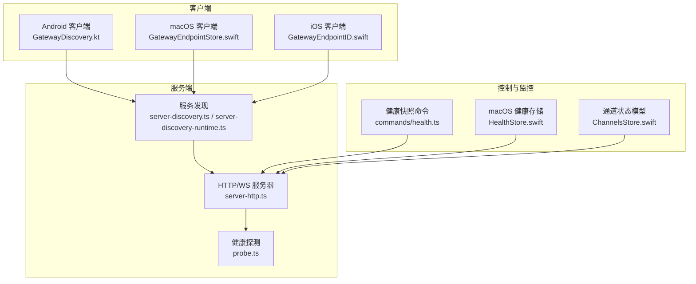
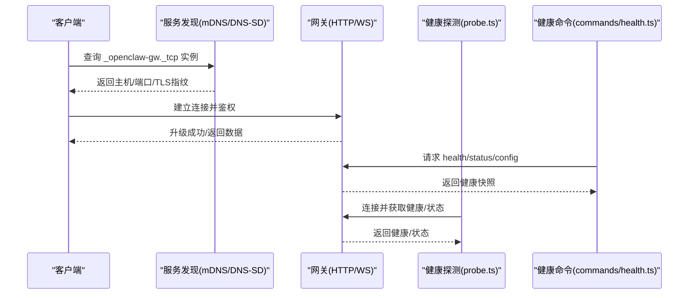
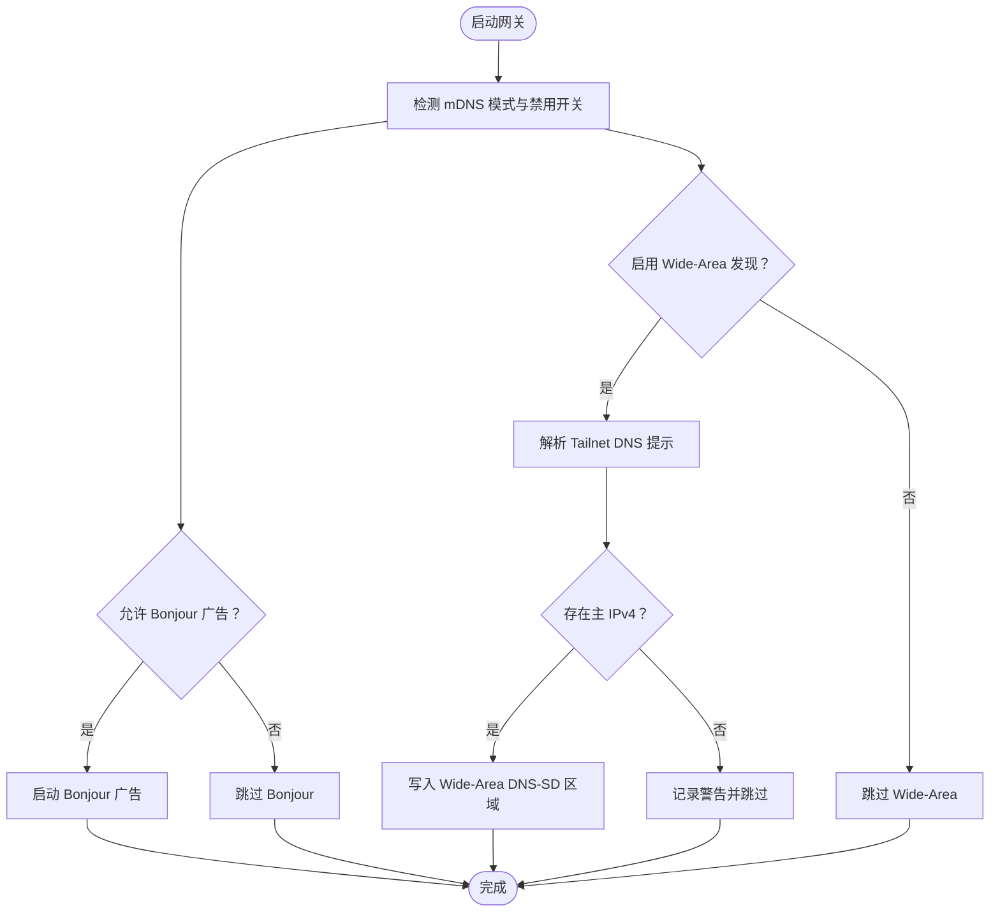
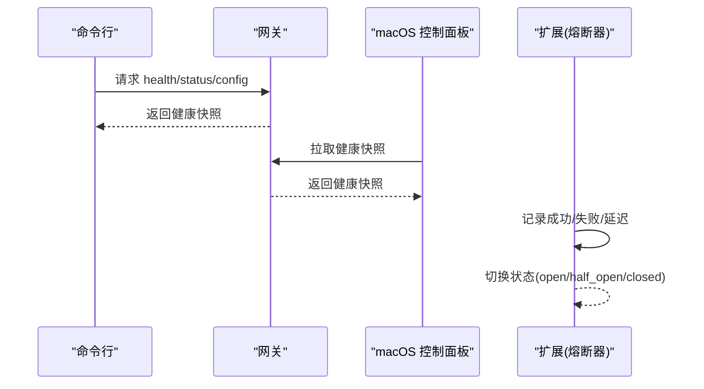
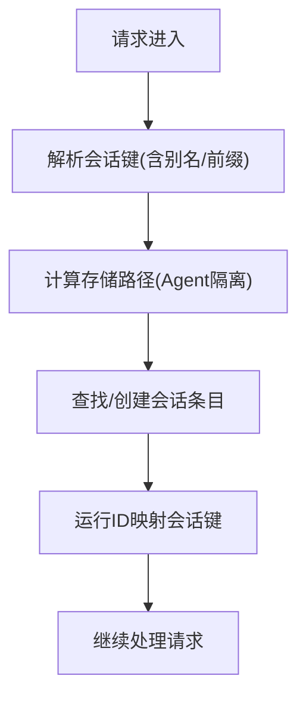
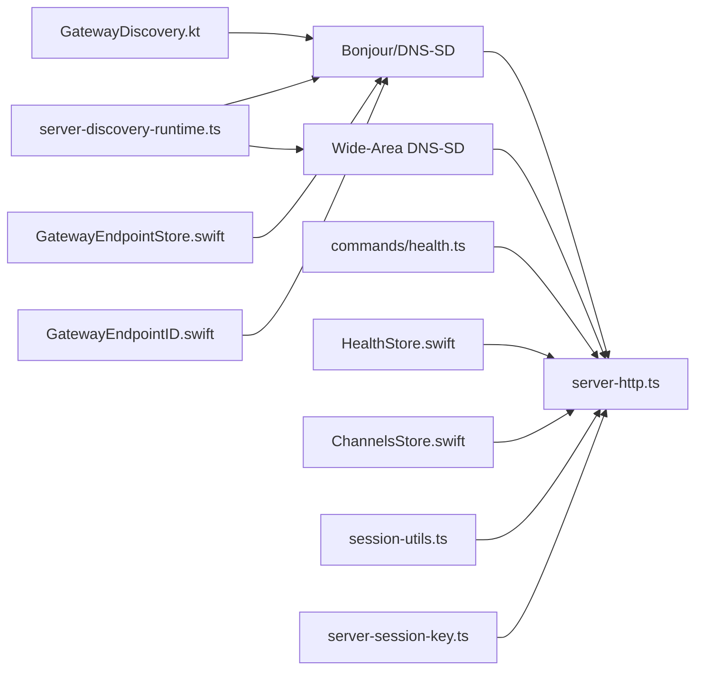

# 负载均衡

<cite>
**本文引用的文件**
- [src/gateway/server-discovery.ts](file://src/gateway/server-discovery.ts)
- [src/gateway/server-discovery-runtime.ts](file://src/gateway/server-discovery-runtime.ts)
- [src/gateway/server-http.ts](file://src/gateway/server-http.ts)
- [src/gateway/probe.ts](file://src/gateway/probe.ts)
- [apps/android/app/src/main/java/ai/openclaw/android/gateway/GatewayDiscovery.kt](file://apps/android/app/src/main/java/ai/openclaw/android/gateway/GatewayDiscovery.kt)
- [apps/macos/Sources/OpenClaw/GatewayEndpointStore.swift](file://apps/macos/Sources/OpenClaw/GatewayEndpointStore.swift)
- [apps/shared/OpenClawKit/Sources/OpenClawKit/GatewayEndpointID.swift](file://apps/shared/OpenClawKit/Sources/OpenClawKit/GatewayEndpointID.swift)
- [apps/macos/Sources/OpenClaw/HealthStore.swift](file://apps/macos/Sources/OpenClaw/HealthStore.swift)
- [apps/macos/Sources/OpenClaw/ChannelsStore.swift](file://apps/macos/Sources/OpenClaw/ChannelsStore.swift)
- [src/commands/health.ts](file://src/commands/health.ts)
- [src/gateway/session-utils.ts](file://src/gateway/session-utils.ts)
- [src/gateway/server-session-key.ts](file://src/gateway/server-session-key.ts)
- [src/commands/agent/session.ts](file://src/commands/agent/session.ts)
- [extensions/nostr/src/nostr-bus.ts](file://extensions/nostr/src/nostr-bus.ts)
- [docs/zh-CN/install/fly.md](file://docs/zh-CN/install/fly.md)
</cite>

## 目录

1. [简介](#简介)
2. [项目结构](#项目结构)
3. [核心组件](#核心组件)
4. [架构总览](#架构总览)
5. [详细组件分析](#详细组件分析)
6. [依赖关系分析](#依赖关系分析)
7. [性能考量](#性能考量)
8. [故障排查指南](#故障排查指南)
9. [结论](#结论)
10. [附录](#附录)

## 简介

本文件围绕 OpenClaw 网关的“负载均衡”主题，系统梳理其在分布式环境中的服务发现、健康检查、故障转移、会话亲和与状态同步、以及可操作的配置与运维实践。需要特别说明的是：当前代码库并未实现传统意义上的“轮询/加权轮询/最少连接”等显式负载均衡算法。本文将基于现有服务发现、健康检查与客户端连接流程，给出可落地的部署与运维建议，并对可能的扩展点进行说明。

## 项目结构

与“负载均衡”直接相关的模块主要分布在以下位置：

- 网关服务端：负责 HTTP/WebSocket 接入、认证与路由分发
- 服务发现：通过 Bonjour/DNS-SD、Tailscale、Wide-Area DNS 等方式对外宣告
- 客户端：Android/macOS 端通过 mDNS/SRV 解析网关实例并建立连接
- 健康检查：CLI/命令行与控制通道用于探测网关健康状态
- 会话与状态：会话键解析、运行上下文映射与存储路径解析



**图表来源**

- [src/gateway/server-http.ts](file://src/gateway/server-http.ts#L451-L630)
- [src/gateway/server-discovery.ts](file://src/gateway/server-discovery.ts#L1-L91)
- [src/gateway/server-discovery-runtime.ts](file://src/gateway/server-discovery-runtime.ts#L10-L101)
- [src/gateway/probe.ts](file://src/gateway/probe.ts#L31-L122)
- [apps/android/app/src/main/java/ai/openclaw/android/gateway/GatewayDiscovery.kt](file://apps/android/app/src/main/java/ai/openclaw/android/gateway/GatewayDiscovery.kt#L226-L244)
- [apps/macos/Sources/OpenClaw/GatewayEndpointStore.swift](file://apps/macos/Sources/OpenClaw/GatewayEndpointStore.swift#L494-L526)
- [apps/shared/OpenClawKit/Sources/OpenClawKit/GatewayEndpointID.swift](file://apps/shared/OpenClawKit/Sources/OpenClawKit/GatewayEndpointID.swift#L1-L25)
- [src/commands/health.ts](file://src/commands/health.ts#L348-L375)
- [apps/macos/Sources/OpenClaw/HealthStore.swift](file://apps/macos/Sources/OpenClaw/HealthStore.swift#L121-L180)
- [apps/macos/Sources/OpenClaw/ChannelsStore.swift](file://apps/macos/Sources/OpenClaw/ChannelsStore.swift#L110-L144)

**章节来源**

- [src/gateway/server-http.ts](file://src/gateway/server-http.ts#L451-L630)
- [src/gateway/server-discovery.ts](file://src/gateway/server-discovery.ts#L1-L91)
- [src/gateway/server-discovery-runtime.ts](file://src/gateway/server-discovery-runtime.ts#L10-L101)
- [apps/android/app/src/main/java/ai/openclaw/android/gateway/GatewayDiscovery.kt](file://apps/android/app/src/main/java/ai/openclaw/android/gateway/GatewayDiscovery.kt#L226-L244)
- [apps/macos/Sources/OpenClaw/GatewayEndpointStore.swift](file://apps/macos/Sources/OpenClaw/GatewayEndpointStore.swift#L494-L526)
- [apps/shared/OpenClawKit/Sources/OpenClawKit/GatewayEndpointID.swift](file://apps/shared/OpenClawKit/Sources/OpenClawKit/GatewayEndpointID.swift#L1-L25)
- [src/commands/health.ts](file://src/commands/health.ts#L348-L375)
- [apps/macos/Sources/OpenClaw/HealthStore.swift](file://apps/macos/Sources/OpenClaw/HealthStore.swift#L121-L180)
- [apps/macos/Sources/OpenClaw/ChannelsStore.swift](file://apps/macos/Sources/OpenClaw/ChannelsStore.swift#L110-L144)

## 核心组件

- 服务发现与注册
  - 通过 Bonjour/DNS-SD、Tailscale、Wide-Area DNS 将网关实例对外宣告，供客户端解析
  - 支持最小化/完整模式的 mDNS 广告，以及 SSH 端口、CLI 路径等元信息
- 客户端解析与连接
  - Android/macOS/iOS 使用 mDNS/SRV 解析网关实例，支持 TLS 指纹校验与回退策略
- 健康检查与故障转移
  - CLI/命令行可抓取健康快照；macOS 控制面板定期拉取健康状态；通道状态模型记录探针结果
  - 扩展模块（如 Nostr）内置熔断器与健康追踪，体现故障隔离与降级思路
- 会话亲和与状态同步
  - 会话键解析与运行上下文映射，确保请求与会话状态一致
  - 会话存储路径按 Agent 分离，避免跨实例状态耦合

**章节来源**

- [src/gateway/server-discovery-runtime.ts](file://src/gateway/server-discovery-runtime.ts#L10-L101)
- [apps/android/app/src/main/java/ai/openclaw/android/gateway/GatewayDiscovery.kt](file://apps/android/app/src/main/java/ai/openclaw/android/gateway/GatewayDiscovery.kt#L226-L244)
- [apps/macos/Sources/OpenClaw/GatewayEndpointStore.swift](file://apps/macos/Sources/OpenClaw/GatewayEndpointStore.swift#L494-L526)
- [src/commands/health.ts](file://src/commands/health.ts#L348-L375)
- [apps/macos/Sources/OpenClaw/HealthStore.swift](file://apps/macos/Sources/OpenClaw/HealthStore.swift#L121-L180)
- [apps/macos/Sources/OpenClaw/ChannelsStore.swift](file://apps/macos/Sources/OpenClaw/ChannelsStore.swift#L110-L144)
- [extensions/nostr/src/nostr-bus.ts](file://extensions/nostr/src/nostr-bus.ts#L163-L207)
- [src/gateway/session-utils.ts](file://src/gateway/session-utils.ts#L490-L513)
- [src/gateway/server-session-key.ts](file://src/gateway/server-session-key.ts#L6-L22)

## 架构总览

下图展示了从客户端到网关再到健康监控的整体交互：



**图表来源**

- [apps/android/app/src/main/java/ai/openclaw/android/gateway/GatewayDiscovery.kt](file://apps/android/app/src/main/java/ai/openclaw/android/gateway/GatewayDiscovery.kt#L226-L244)
- [apps/macos/Sources/OpenClaw/GatewayEndpointStore.swift](file://apps/macos/Sources/OpenClaw/GatewayEndpointStore.swift#L494-L526)
- [src/gateway/server-http.ts](file://src/gateway/server-http.ts#L451-L630)
- [src/gateway/probe.ts](file://src/gateway/probe.ts#L31-L122)
- [src/commands/health.ts](file://src/commands/health.ts#L348-L375)

## 详细组件分析

### 服务发现与注册

- 功能要点
  - 通过 Bonjour/DNS-SD 对外宣告网关实例名称、端口、TLS 开关与指纹、Canvas 端口、SSH 端口、Tailnet DNS 提示等
  - 支持 Wide-Area DNS-SD 区域更新，便于公网/跨域访问
  - 可按最小化/完整模式控制 mDNS 广告范围
- 关键行为
  - 当未启用 Bonjour 或 Wide-Area 时，自动跳过对应步骤
  - 若无法解析 Tailnet DNS 提示或无可用 IPv4 地址，记录警告并继续



**图表来源**

- [src/gateway/server-discovery-runtime.ts](file://src/gateway/server-discovery-runtime.ts#L10-L101)
- [src/gateway/server-discovery.ts](file://src/gateway/server-discovery.ts#L67-L91)

**章节来源**

- [src/gateway/server-discovery-runtime.ts](file://src/gateway/server-discovery-runtime.ts#L10-L101)
- [src/gateway/server-discovery.ts](file://src/gateway/server-discovery.ts#L1-L91)

### 客户端解析与连接

- Android
  - 通过 mDNS/SRV 解析实例，再解析目标主机，支持单播回退
- macOS
  - 通过 NWEndpoint 生成稳定 ID，支持连接状态订阅与本地模式下的回退
- iOS
  - 通过服务名/类型/域名生成稳定 ID，便于跨设备识别

```mermaid
sequenceDiagram
participant AND as "Android"
participant DNS as "DNS(mDNS/SRV/A)"
participant GW as "网关"
AND->>DNS : 查询 PTR/SRV/A 记录
DNS-->>AND : 返回主机/端口
AND->>GW : 建立连接(TLS 可选)
GW-->>AND : 鉴权/握手
```

**图表来源**

- [apps/android/app/src/main/java/ai/openclaw/android/gateway/GatewayDiscovery.kt](file://apps/android/app/src/main/java/ai/openclaw/android/gateway/GatewayDiscovery.kt#L226-L244)
- [apps/macos/Sources/OpenClaw/GatewayEndpointStore.swift](file://apps/macos/Sources/OpenClaw/GatewayEndpointStore.swift#L494-L526)
- [apps/shared/OpenClawKit/Sources/OpenClawKit/GatewayEndpointID.swift](file://apps/shared/OpenClawKit/Sources/OpenClawKit/GatewayEndpointID.swift#L1-L25)

**章节来源**

- [apps/android/app/src/main/java/ai/openclaw/android/gateway/GatewayDiscovery.kt](file://apps/android/app/src/main/java/ai/openclaw/android/gateway/GatewayDiscovery.kt#L226-L244)
- [apps/macos/Sources/OpenClaw/GatewayEndpointStore.swift](file://apps/macos/Sources/OpenClaw/GatewayEndpointStore.swift#L494-L526)
- [apps/shared/OpenClawKit/Sources/OpenClawKit/GatewayEndpointID.swift](file://apps/shared/OpenClawKit/Sources/OpenClawKit/GatewayEndpointID.swift#L1-L25)

### 健康检查与故障转移

- 健康快照
  - 命令行可聚合各 Agent 的心跳、会话等信息，作为健康评估依据
- 控制面板健康
  - macOS 控制面板周期性拉取健康快照，记录错误与恢复
- 通道状态
  - 通道状态模型记录探针结果（状态码、耗时、版本等），用于 UI 展示与故障定位
- 故障隔离与熔断
  - 扩展模块内置熔断器与健康追踪，按失败次数与时间窗口切换状态，降低级联故障风险



**图表来源**

- [src/commands/health.ts](file://src/commands/health.ts#L348-L375)
- [apps/macos/Sources/OpenClaw/HealthStore.swift](file://apps/macos/Sources/OpenClaw/HealthStore.swift#L121-L180)
- [apps/macos/Sources/OpenClaw/ChannelsStore.swift](file://apps/macos/Sources/OpenClaw/ChannelsStore.swift#L110-L144)
- [extensions/nostr/src/nostr-bus.ts](file://extensions/nostr/src/nostr-bus.ts#L163-L207)

**章节来源**

- [src/commands/health.ts](file://src/commands/health.ts#L348-L375)
- [apps/macos/Sources/OpenClaw/HealthStore.swift](file://apps/macos/Sources/OpenClaw/HealthStore.swift#L121-L180)
- [apps/macos/Sources/OpenClaw/ChannelsStore.swift](file://apps/macos/Sources/OpenClaw/ChannelsStore.swift#L110-L144)
- [extensions/nostr/src/nostr-bus.ts](file://extensions/nostr/src/nostr-bus.ts#L163-L207)

### 会话亲和与状态同步

- 会话键解析
  - 支持主键别名、Agent 前缀、全局/未知键等多形态解析
  - 会话存储路径按 Agent 分离，避免跨实例状态耦合
- 运行上下文映射
  - 通过运行 ID 反查会话键，保证请求与会话状态一致
- 请求侧键选择
  - 命令行工具根据作用域、主键、上下文等规则解析最终会话键



**图表来源**

- [src/gateway/session-utils.ts](file://src/gateway/session-utils.ts#L490-L513)
- [src/gateway/server-session-key.ts](file://src/gateway/server-session-key.ts#L6-L22)
- [src/commands/agent/session.ts](file://src/commands/agent/session.ts#L42-L80)

**章节来源**

- [src/gateway/session-utils.ts](file://src/gateway/session-utils.ts#L490-L513)
- [src/gateway/server-session-key.ts](file://src/gateway/server-session-key.ts#L6-L22)
- [src/commands/agent/session.ts](file://src/commands/agent/session.ts#L42-L80)

## 依赖关系分析

- 服务发现依赖
  - Bonjour/DNS-SD 与 Wide-Area DNS-SD 依赖 Tailnet 主机名与网络接口
  - mDNS 可通过环境变量禁用
- 客户端依赖
  - Android/macOS/iOS 依赖本地网络栈解析 mDNS/SRV/A 记录
- 健康检查依赖
  - 命令行与控制面板均依赖网关提供的健康接口
- 会话依赖
  - 会话存储路径与 Agent 配置强相关，需保持一致性



**图表来源**

- [src/gateway/server-discovery-runtime.ts](file://src/gateway/server-discovery-runtime.ts#L10-L101)
- [src/gateway/server-http.ts](file://src/gateway/server-http.ts#L451-L630)
- [apps/android/app/src/main/java/ai/openclaw/android/gateway/GatewayDiscovery.kt](file://apps/android/app/src/main/java/ai/openclaw/android/gateway/GatewayDiscovery.kt#L226-L244)
- [apps/macos/Sources/OpenClaw/GatewayEndpointStore.swift](file://apps/macos/Sources/OpenClaw/GatewayEndpointStore.swift#L494-L526)
- [apps/shared/OpenClawKit/Sources/OpenClawKit/GatewayEndpointID.swift](file://apps/shared/OpenClawKit/Sources/OpenClawKit/GatewayEndpointID.swift#L1-L25)
- [src/commands/health.ts](file://src/commands/health.ts#L348-L375)
- [apps/macos/Sources/OpenClaw/HealthStore.swift](file://apps/macos/Sources/OpenClaw/HealthStore.swift#L121-L180)
- [apps/macos/Sources/OpenClaw/ChannelsStore.swift](file://apps/macos/Sources/OpenClaw/ChannelsStore.swift#L110-L144)
- [src/gateway/session-utils.ts](file://src/gateway/session-utils.ts#L490-L513)
- [src/gateway/server-session-key.ts](file://src/gateway/server-session-key.ts#L6-L22)

**章节来源**

- [src/gateway/server-discovery-runtime.ts](file://src/gateway/server-discovery-runtime.ts#L10-L101)
- [src/gateway/server-http.ts](file://src/gateway/server-http.ts#L451-L630)
- [apps/android/app/src/main/java/ai/openclaw/android/gateway/GatewayDiscovery.kt](file://apps/android/app/src/main/java/ai/openclaw/android/gateway/GatewayDiscovery.kt#L226-L244)
- [apps/macos/Sources/OpenClaw/GatewayEndpointStore.swift](file://apps/macos/Sources/OpenClaw/GatewayEndpointStore.swift#L494-L526)
- [apps/shared/OpenClawKit/Sources/OpenClawKit/GatewayEndpointID.swift](file://apps/shared/OpenClawKit/Sources/OpenClawKit/GatewayEndpointID.swift#L1-L25)
- [src/commands/health.ts](file://src/commands/health.ts#L348-L375)
- [apps/macos/Sources/OpenClaw/HealthStore.swift](file://apps/macos/Sources/OpenClaw/HealthStore.swift#L121-L180)
- [apps/macos/Sources/OpenClaw/ChannelsStore.swift](file://apps/macos/Sources/OpenClaw/ChannelsStore.swift#L110-L144)
- [src/gateway/session-utils.ts](file://src/gateway/session-utils.ts#L490-L513)
- [src/gateway/server-session-key.ts](file://src/gateway/server-session-key.ts#L6-L22)

## 性能考量

- 服务发现开销
  - mDNS 广告与 Wide-Area DNS-SD 更新应避免频繁触发，建议在配置变更或网络变化时更新
- 健康检查频率
  - 健康快照与探针应结合业务峰值与资源占用设定合理间隔，避免过度拉取
- 会话存储
  - 存储路径按 Agent 分离可减少跨实例竞争，但需注意磁盘空间与锁竞争
- 客户端连接
  - TLS 指纹校验与回退策略应在安全与可用性之间平衡

[本节为通用指导，不直接分析具体文件]

## 故障排查指南

- 服务发现异常
  - 检查 mDNS 模式与禁用开关、Tailnet DNS 提示是否可用、Wide-Area 域名是否配置
- 客户端无法解析
  - 确认 mDNS/SRV/A 记录是否存在，必要时启用单播回退
- 健康状态异常
  - 使用命令行健康快照核对心跳、会话与通道状态；macOS 控制面板查看最近错误
- 熔断器触发
  - 观察扩展模块的熔断状态与健康追踪指标，确认阈值与恢复时间

**章节来源**

- [src/gateway/server-discovery-runtime.ts](file://src/gateway/server-discovery-runtime.ts#L10-L101)
- [apps/android/app/src/main/java/ai/openclaw/android/gateway/GatewayDiscovery.kt](file://apps/android/app/src/main/java/ai/openclaw/android/gateway/GatewayDiscovery.kt#L226-L244)
- [src/commands/health.ts](file://src/commands/health.ts#L348-L375)
- [apps/macos/Sources/OpenClaw/HealthStore.swift](file://apps/macos/Sources/OpenClaw/HealthStore.swift#L121-L180)
- [extensions/nostr/src/nostr-bus.ts](file://extensions/nostr/src/nostr-bus.ts#L163-L207)

## 结论

OpenClaw 当前的“负载均衡”能力主要体现在：

- 通过服务发现与客户端解析实现“实例选择”
- 通过健康检查与熔断机制实现“故障隔离与降级”
- 通过会话键与运行上下文映射实现“会话亲和”

若需引入更精细的负载均衡算法（如轮询/加权轮询/最少连接），可在客户端解析层或网关接入层扩展相应策略，并结合健康状态与会话亲和进行综合决策。

[本节为总结性内容，不直接分析具体文件]

## 附录

### 集群部署与高可用建议

- 使用服务发现
  - 启用 Bonjour/DNS-SD 与 Wide-Area DNS-SD，确保客户端可解析到多个网关实例
- 健康检查与自动伸缩
  - 在平台层面配置健康检查端口与最小运行实例数，结合内存与 CPU 配额
- 会话与状态
  - 保持会话存储路径按 Agent 分离，避免跨实例状态耦合
- TLS 与安全
  - 客户端优先使用存储的 TLS 指纹，避免信任未知指纹

**章节来源**

- [docs/zh-CN/install/fly.md](file://docs/zh-CN/install/fly.md#L51-L94)
