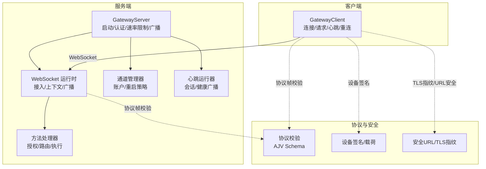
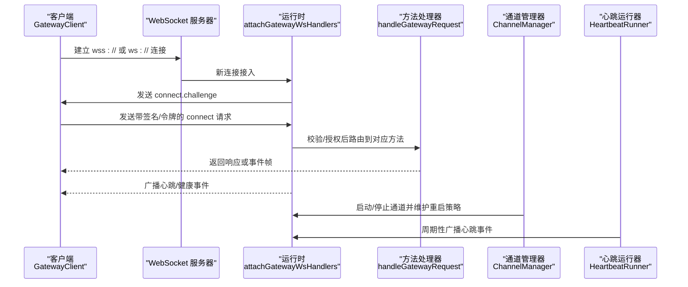
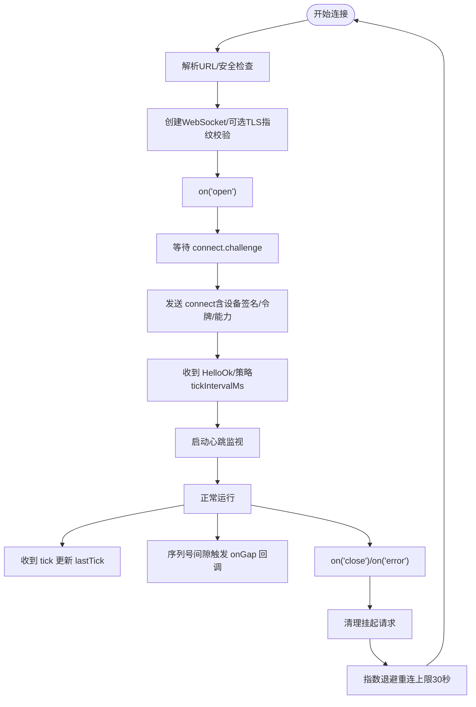
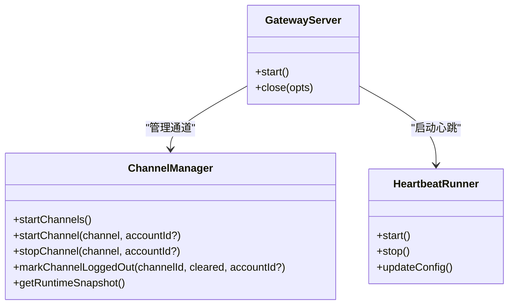
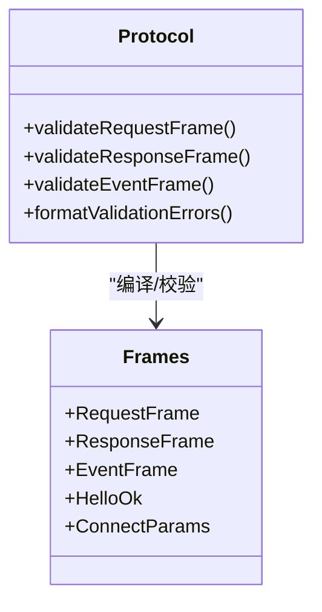
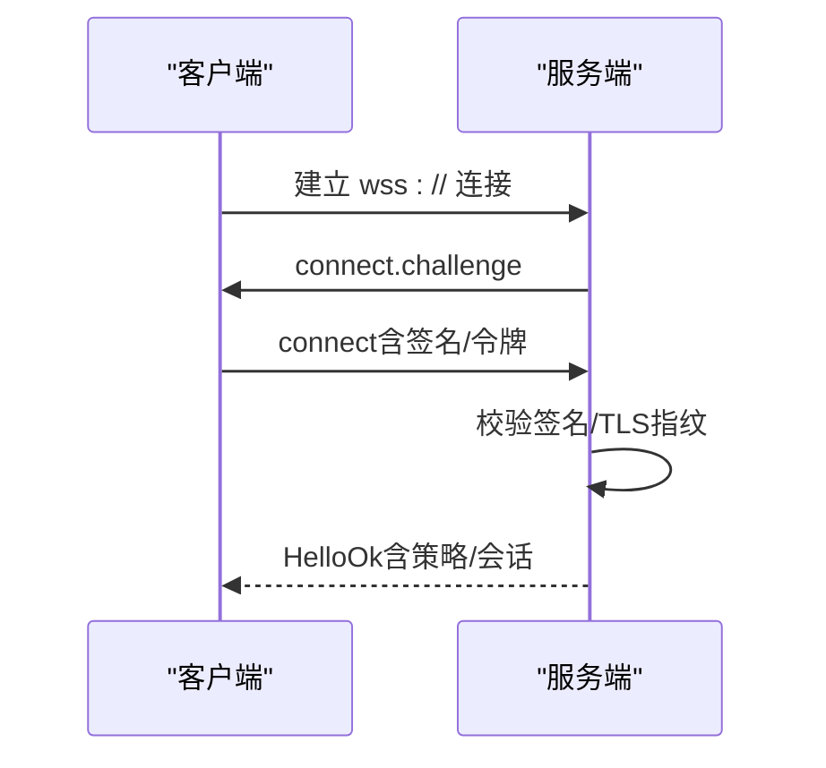
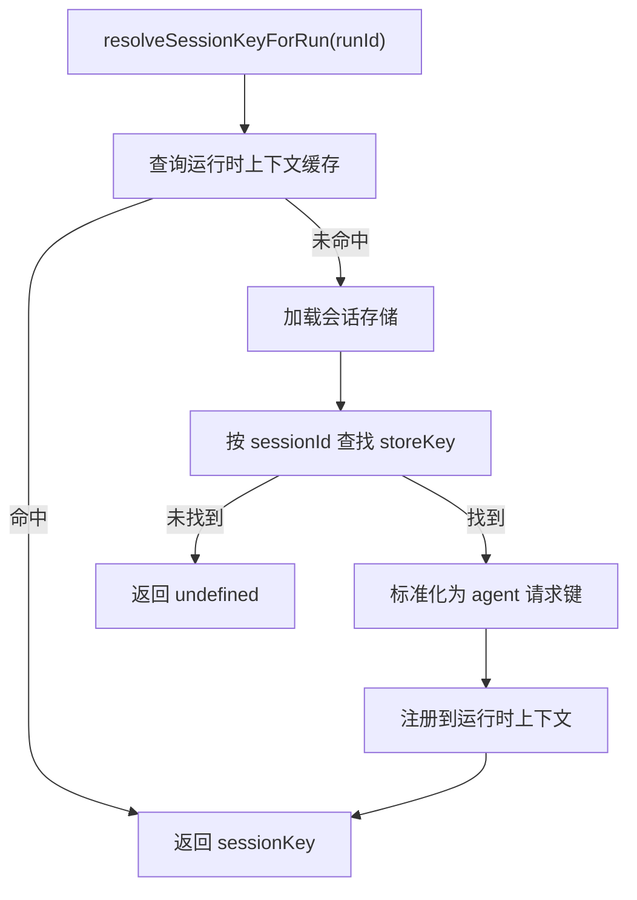
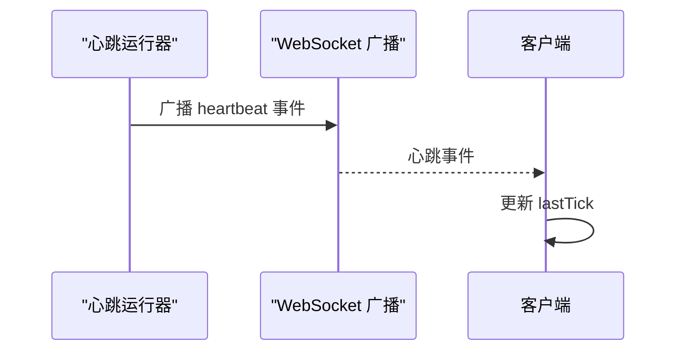
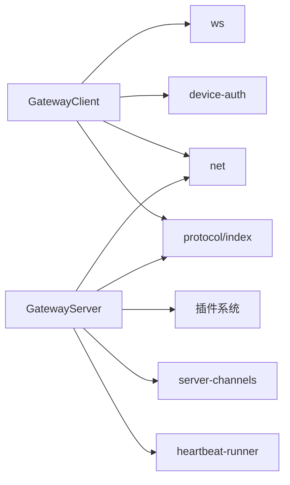

# 连接管理

<cite>
**本文引用的文件**
- [src/gateway/client.ts](file://src/gateway/client.ts)
- [src/gateway/server.impl.ts](file://src/gateway/server.impl.ts)
- [src/gateway/server-ws-runtime.ts](file://src/gateway/server-ws-runtime.ts)
- [src/gateway/server-methods.ts](file://src/gateway/server-methods.ts)
- [src/gateway/server-channels.ts](file://src/gateway/server-channels.ts)
- [src/gateway/server-session-key.ts](file://src/gateway/server-session-key.ts)
- [src/gateway/net.ts](file://src/gateway/net.ts)
- [src/gateway/protocol/index.ts](file://src/gateway/protocol/index.ts)
- [src/gateway/device-auth.ts](file://src/gateway/device-auth.ts)
- [src/web/auto-reply/monitor.ts](file://src/web/auto-reply/monitor.ts)
- [src/web/auto-reply/heartbeat-runner.ts](file://src/web/auto-reply/heartbeat-runner.ts)
</cite>

## 目录

1. [简介](#简介)
2. [项目结构](#项目结构)
3. [核心组件](#核心组件)
4. [架构总览](#架构总览)
5. [详细组件分析](#详细组件分析)
6. [依赖关系分析](#依赖关系分析)
7. [性能考量](#性能考量)
8. [故障排查指南](#故障排查指南)
9. [结论](#结论)
10. [附录](#附录)

## 简介

本文件系统化梳理 OpenClaw 网关连接管理系统，围绕连接生命周期（建立、心跳、断线重连）、连接池与并发控制、资源限制、状态跟踪与会话绑定、安全校验、监控指标、性能优化与故障恢复进行深入解析，并提供配置示例与排障建议，帮助开发者与运维人员在复杂场景下稳定运行网关。

## 项目结构

- 客户端侧：GatewayClient 负责与网关建立 WebSocket 连接、发送请求、处理事件帧、心跳检测与断线重连。
- 服务端侧：GatewayServer 启动时初始化认证、速率限制、通道管理、广播与维护任务；通过 WebSocketServer 接入客户端连接并分发请求。
- 协议与安全：协议定义与校验、设备签名与 TLS 指纹校验、URL 安全性检查。
- 会话与状态：会话键解析、会话持久化与心跳会话快照记录。
- 监控与健康：心跳事件广播、健康快照、诊断心跳。

图示来源

- [src/gateway/client.ts](file://src/gateway/client.ts#L85-L523)
- [src/gateway/server.impl.ts](file://src/gateway/server.impl.ts#L195-L800)
- [src/gateway/server-ws-runtime.ts](file://src/gateway/server-ws-runtime.ts#L9-L57)
- [src/gateway/server-methods.ts](file://src/gateway/server-methods.ts#L36-L150)
- [src/gateway/server-channels.ts](file://src/gateway/server-channels.ts#L80-L415)
- [src/gateway/protocol/index.ts](file://src/gateway/protocol/index.ts#L243-L432)
- [src/gateway/device-auth.ts](file://src/gateway/device-auth.ts#L34-L69)
- [src/gateway/net.ts](file://src/gateway/net.ts#L360-L379)

章节来源

- [src/gateway/client.ts](file://src/gateway/client.ts#L85-L523)
- [src/gateway/server.impl.ts](file://src/gateway/server.impl.ts#L195-L800)
- [src/gateway/server-ws-runtime.ts](file://src/gateway/server-ws-runtime.ts#L9-L57)
- [src/gateway/server-methods.ts](file://src/gateway/server-methods.ts#L36-L150)
- [src/gateway/server-channels.ts](file://src/gateway/server-channels.ts#L80-L415)
- [src/gateway/protocol/index.ts](file://src/gateway/protocol/index.ts#L243-L432)
- [src/gateway/device-auth.ts](file://src/gateway/device-auth.ts#L34-L69)
- [src/gateway/net.ts](file://src/gateway/net.ts#L360-L379)

## 核心组件

- GatewayClient（客户端）
  - 负责连接建立、connect 挑战、鉴权参数组装、设备签名、TLS 指纹校验、请求/响应队列、事件处理、心跳监视、断线退避重连。
- GatewayServer（服务端）
  - 初始化认证与速率限制、加载插件与方法、创建 WebSocket 服务器、注册广播与维护任务、启动通道管理器、暴露心跳与健康事件。
- 协议与校验
  - 使用 AJV 对请求/响应/事件帧进行严格校验，确保消息结构一致与安全。
- 设备认证与安全
  - 设备载荷签名与规范化、TLS 指纹比对、ws/wss URL 安全性检查。
- 会话与状态
  - 会话键解析、会话存储更新、心跳会话快照记录、会话缓存 TTL 控制。
- 监控与健康
  - 心跳事件广播、健康快照、诊断心跳、通道健康检查。

章节来源

- [src/gateway/client.ts](file://src/gateway/client.ts#L85-L523)
- [src/gateway/server.impl.ts](file://src/gateway/server.impl.ts#L195-L800)
- [src/gateway/protocol/index.ts](file://src/gateway/protocol/index.ts#L243-L432)
- [src/gateway/device-auth.ts](file://src/gateway/device-auth.ts#L34-L69)
- [src/gateway/net.ts](file://src/gateway/net.ts#L360-L379)
- [src/web/auto-reply/heartbeat-runner.ts](file://src/web/auto-reply/heartbeat-runner.ts#L78-L116)

## 架构总览

下图展示从客户端发起连接到服务端处理请求、广播事件、维护心跳的整体流程。

图示来源

- [src/gateway/client.ts](file://src/gateway/client.ts#L168-L350)
- [src/gateway/server-ws-runtime.ts](file://src/gateway/server-ws-runtime.ts#L37-L56)
- [src/gateway/server-methods.ts](file://src/gateway/server-methods.ts#L97-L150)
- [src/gateway/server-channels.ts](file://src/gateway/server-channels.ts#L118-L264)
- [src/web/auto-reply/heartbeat-runner.ts](file://src/web/auto-reply/heartbeat-runner.ts#L78-L116)

章节来源

- [src/gateway/client.ts](file://src/gateway/client.ts#L168-L350)
- [src/gateway/server-ws-runtime.ts](file://src/gateway/server-ws-runtime.ts#L37-L56)
- [src/gateway/server-methods.ts](file://src/gateway/server-methods.ts#L97-L150)
- [src/gateway/server-channels.ts](file://src/gateway/server-channels.ts#L118-L264)
- [src/web/auto-reply/heartbeat-runner.ts](file://src/web/auto-reply/heartbeat-runner.ts#L78-L116)

## 详细组件分析

### 客户端：GatewayClient 生命周期与重连机制

- 连接建立
  - 解析 URL，若为非本地 ws:// 则拒绝；wss:// 可选 TLS 指纹校验；设置最大消息负载；监听 open、message、close、error。
- connect 挑战与鉴权
  - 收到 connect.challenge 后生成 nonce；构造 connect 参数（含客户端元信息、能力、权限、设备签名、令牌等）；发送后等待 HelloOk，持久化设备令牌并初始化心跳周期。
- 心跳检测
  - 服务端周期性发送 tick；客户端记录 lastTick；启动 tickWatch，若超过两倍 tick 间隔未收到 tick，则主动关闭连接（4000）。
- 断线与指数退避重连
  - close/error 触发 flushPendingErrors，清理挂起请求；scheduleReconnect 采用指数退避（上限 30 秒），逐次递增 backoffMs。
- 安全与错误提示
  - 提供描述关闭码的提示映射；connect 挑战超时、指纹不匹配、策略违规等均以明确错误码与原因关闭连接。
- 并发与请求队列
  - pending Map 维护请求 ID 到 Promise 的映射；request 方法返回 Promise，支持 expectFinal 标记以等待最终结果；validateRequestFrame 防止非法帧进入网络。

图示来源

- [src/gateway/client.ts](file://src/gateway/client.ts#L107-L467)

章节来源

- [src/gateway/client.ts](file://src/gateway/client.ts#L107-L467)

### 服务端：GatewayServer 启动与运行时

- 启动流程
  - 读取并迁移配置、激活密钥快照、启动诊断心跳、初始化子代理注册、加载插件与方法、创建运行时状态（含 WebSocket 服务器、客户端集合、广播函数等）。
- 认证与速率限制
  - 创建通用与浏览器专用速率限制器；在连接接入时应用认证策略与限流。
- 通道管理
  - ChannelManager 负责通道账户的启停、重启策略（指数回退+抖动，最多尝试次数限制）、手动停止标记、运行状态快照。
- 维护与广播
  - 启动心跳/健康/去重清理定时器；订阅代理事件与心跳事件并广播；启动自动回复心跳运行器。
- 关闭与清理
  - 提供优雅关闭接口，支持原因与预期重启时间参数。

图示来源

- [src/gateway/server.impl.ts](file://src/gateway/server.impl.ts#L195-L800)
- [src/gateway/server-channels.ts](file://src/gateway/server-channels.ts#L80-L415)

章节来源

- [src/gateway/server.impl.ts](file://src/gateway/server.impl.ts#L195-L800)
- [src/gateway/server-channels.ts](file://src/gateway/server-channels.ts#L80-L415)

### 协议与校验：AJV Schema 与帧类型

- 校验器
  - 使用 AJV 编译各类 Schema（请求/响应/事件/握手等），统一格式化错误信息，保证协议一致性与安全性。
- 帧类型
  - RequestFrame、ResponseFrame、EventFrame、HelloOk、ConnectParams 等，配合 validateRequestFrame/validateResponseFrame/validateEventFrame 使用。

图示来源

- [src/gateway/protocol/index.ts](file://src/gateway/protocol/index.ts#L243-L432)

章节来源

- [src/gateway/protocol/index.ts](file://src/gateway/protocol/index.ts#L243-L432)

### 设备认证与安全：签名与 TLS 校验

- 设备载荷
  - 规范化平台/设备家族字段，构建 v3 载荷字符串，使用设备私钥签名，服务端用公钥与签名验证。
- TLS 指纹
  - wss:// 下可配置指纹校验，连接成功后再次校验对端证书指纹，不匹配则关闭连接并提示。
- URL 安全
  - ws:// 仅允许本地回环地址；远程连接必须使用 wss://，否则拒绝。

图示来源

- [src/gateway/device-auth.ts](file://src/gateway/device-auth.ts#L34-L69)
- [src/gateway/client.ts](file://src/gateway/client.ts#L168-L177)
- [src/gateway/net.ts](file://src/gateway/net.ts#L360-L379)

章节来源

- [src/gateway/device-auth.ts](file://src/gateway/device-auth.ts#L34-L69)
- [src/gateway/client.ts](file://src/gateway/client.ts#L168-L177)
- [src/gateway/net.ts](file://src/gateway/net.ts#L360-L379)

### 会话绑定与状态跟踪

- 会话键解析
  - 通过运行时上下文缓存与会话存储查找 sessionId 对应的会话键，用于后续请求路由与事件分发。
- 心跳会话快照
  - 在心跳运行器中更新会话存储、记录会话键与过期时间，便于诊断与会话治理。
- 会话缓存
  - 会话管理器缓存 TTL 控制，避免频繁 IO。

图示来源

- [src/gateway/server-session-key.ts](file://src/gateway/server-session-key.ts#L6-L22)
- [src/web/auto-reply/heartbeat-runner.ts](file://src/web/auto-reply/heartbeat-runner.ts#L78-L116)

章节来源

- [src/gateway/server-session-key.ts](file://src/gateway/server-session-key.ts#L6-L22)
- [src/web/auto-reply/heartbeat-runner.ts](file://src/web/auto-reply/heartbeat-runner.ts#L78-L116)

### 监控与健康：心跳与诊断

- 心跳事件
  - 服务端周期性广播 heartbeat 事件；客户端收到 tick 更新 lastTick；心跳运行器记录会话快照。
- 健康快照
  - 维护健康版本与存在性版本，定期刷新快照并广播。
- 诊断心跳
  - 启动诊断心跳，便于问题定位。

图示来源

- [src/web/auto-reply/heartbeat-runner.ts](file://src/web/auto-reply/heartbeat-runner.ts#L78-L116)
- [src/gateway/server.impl.ts](file://src/gateway/server.impl.ts#L638-L659)

章节来源

- [src/web/auto-reply/heartbeat-runner.ts](file://src/web/auto-reply/heartbeat-runner.ts#L78-L116)
- [src/gateway/server.impl.ts](file://src/gateway/server.impl.ts#L638-L659)

## 依赖关系分析

- 客户端依赖
  - ws 库、设备身份与配对、TLS 指纹、协议校验、消息通道工具、网络辅助。
- 服务端依赖
  - 插件系统、通道插件、认证与速率限制、心跳与健康、诊断日志、运行时环境。
- 协议与安全
  - AJV 校验器、设备签名工具、URL 安全检查。

图示来源

- [src/gateway/client.ts](file://src/gateway/client.ts#L1-L36)
- [src/gateway/server.impl.ts](file://src/gateway/server.impl.ts#L1-L103)
- [src/gateway/protocol/index.ts](file://src/gateway/protocol/index.ts#L1-L242)
- [src/gateway/device-auth.ts](file://src/gateway/device-auth.ts#L1-L69)
- [src/gateway/net.ts](file://src/gateway/net.ts#L1-L379)

章节来源

- [src/gateway/client.ts](file://src/gateway/client.ts#L1-L36)
- [src/gateway/server.impl.ts](file://src/gateway/server.impl.ts#L1-L103)
- [src/gateway/protocol/index.ts](file://src/gateway/protocol/index.ts#L1-L242)
- [src/gateway/device-auth.ts](file://src/gateway/device-auth.ts#L1-L69)
- [src/gateway/net.ts](file://src/gateway/net.ts#L1-L379)

## 性能考量

- 心跳与超时
  - 客户端基于服务端策略动态调整 tick 间隔，避免过频心跳造成开销；tickWatch 双倍阈值检测静默，及时关闭异常连接。
- 重连退避
  - 指数退避上限 30 秒，避免雪崩式重试；通道重启策略引入抖动与最大尝试次数，降低持续失败带来的压力。
- 广播与丢弃
  - 广播支持“慢速丢弃”策略，防止拥塞；心跳/健康事件广播设置 dropIfSlow，保障系统稳定性。
- 资源限制
  - 客户端设置 maxPayload 以限制大响应；服务端维护队列大小与待处理回复计数，重启前延迟检查避免中断关键任务。
- 会话缓存
  - 会话管理器缓存 TTL 控制，减少频繁 IO；心跳会话快照记录避免重复计算。

章节来源

- [src/gateway/client.ts](file://src/gateway/client.ts#L445-L467)
- [src/gateway/server-channels.ts](file://src/gateway/server-channels.ts#L12-L18)
- [src/gateway/server.impl.ts](file://src/gateway/server.impl.ts#L603-L620)
- [src/agents/pi-embedded-runner/session-manager-cache.ts](file://src/agents/pi-embedded-runner/session-manager-cache.ts#L13-L46)

## 故障排查指南

- 连接被拒绝（1008 策略违规）
  - 检查 connect 参数合法性与权限范围；确认设备签名与令牌有效；核对服务端策略与角色授权。
- 连接挑战超时
  - 客户端在限定时间内未收到 connect.challenge 或发送 connect 失败；检查网络连通性与服务端负载。
- TLS 指纹不匹配
  - wss:// 下指纹校验失败；确认服务端证书指纹配置与实际证书一致。
- tick 超时（4000）
  - 客户端长时间未收到服务端 tick；检查服务端心跳广播是否正常、网络是否存在丢包或 NAT 超时。
- 设备令牌不匹配
  - 服务端关闭连接并清除设备令牌；重新配对或更换令牌后重试。
- 重连风暴
  - 检查退避策略是否生效；确认服务端是否频繁重启；必要时增加最小连接间隔与退避上限。
- 通道反复重启
  - 查看通道重启尝试次数与回退策略；定位具体账户配置与运行时错误，避免无限重启。
- 会话键解析失败
  - 确认会话存储路径与键命名规范；检查心跳会话快照是否正确写入。

章节来源

- [src/gateway/client.ts](file://src/gateway/client.ts#L180-L216)
- [src/gateway/client.ts](file://src/gateway/client.ts#L405-L436)
- [src/gateway/server-channels.ts](file://src/gateway/server-channels.ts#L216-L252)
- [src/web/auto-reply/monitor.ts](file://src/web/auto-reply/monitor.ts#L149-L166)

## 结论

OpenClaw 网关连接管理通过严格的协议校验、设备签名与 TLS 指纹、心跳与超时检测、指数退避重连、通道重启策略与广播丢弃等机制，实现了高可靠、可诊断、可扩展的连接生命周期管理。结合会话键解析与心跳会话快照，系统在复杂网络环境下仍能保持稳定运行。建议在生产环境中启用 wss://、合理配置心跳与退避参数、关注通道健康与诊断日志，以获得最佳稳定性与可观测性。

## 附录

### 连接配置示例（客户端）

- 基本连接
  - url：wss://127.0.0.1:18789 或远程 wss://example.com:18789
  - token/deviceToken/password：任选其一或组合
  - instanceId/clientName/clientVersion/platform/deviceFamily：客户端标识与环境
  - caps/commands/scopes/permissions：能力与权限声明
  - minProtocol/maxProtocol：协议版本范围
  - tlsFingerprint：wss:// 时可选，用于证书指纹校验
  - connectDelayMs：connect 挑战超时时间（毫秒）
  - tickWatchMinIntervalMs：心跳监视最小间隔（毫秒）
- 安全建议
  - 远程连接必须使用 wss://；本地回环可使用 ws://，但不推荐
  - 若使用 wss://，建议配置 tlsFingerprint 以增强抗中间人攻击能力

章节来源

- [src/gateway/client.ts](file://src/gateway/client.ts#L43-L72)
- [src/gateway/net.ts](file://src/gateway/net.ts#L360-L379)

### 连接配置示例（服务端）

- 绑定模式
  - loopback/lan/tailnet/auto/custom：根据部署环境选择
  - host：自定义绑定地址（优先级低于 bind）
- 认证与速率限制
  - gateway.auth.rateLimit：认证速率限制策略
  - 浏览器来源使用 loopback 非豁免策略
- 通道健康检查
  - gateway.channelHealthCheckMinutes：通道健康检查周期（分钟）

章节来源

- [src/gateway/server.impl.ts](file://src/gateway/server.impl.ts#L144-L193)
- [src/gateway/server.impl.ts](file://src/gateway/server.impl.ts#L431-L434)
