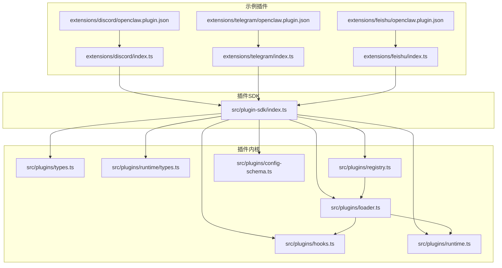
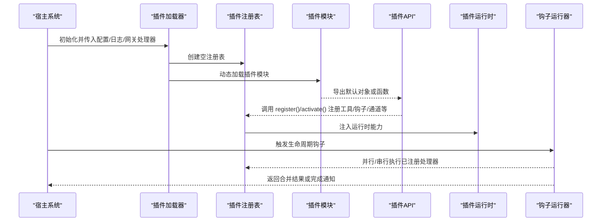
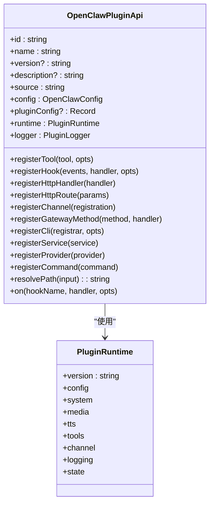
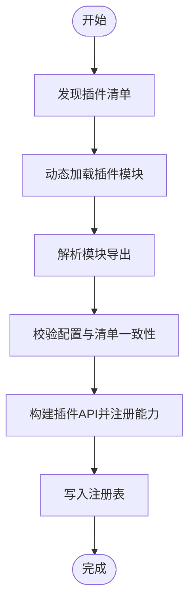
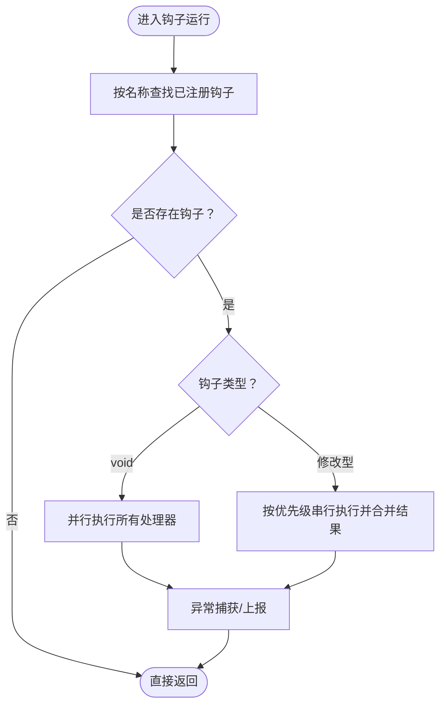
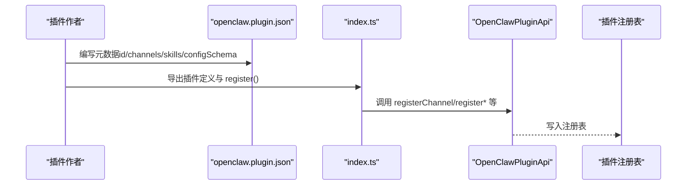
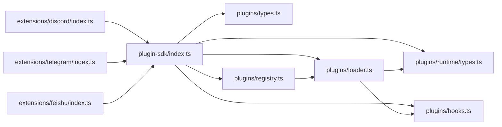

# 插件开发指南

<cite>
**本文引用的文件**
- [src/plugin-sdk/index.ts](file://src/plugin-sdk/index.ts)
- [src/plugins/types.ts](file://src/plugins/types.ts)
- [src/plugins/runtime/types.ts](file://src/plugins/runtime/types.ts)
- [src/plugins/registry.ts](file://src/plugins/registry.ts)
- [src/plugins/loader.ts](file://src/plugins/loader.ts)
- [src/plugins/hooks.ts](file://src/plugins/hooks.ts)
- [src/plugins/runtime.ts](file://src/plugins/runtime.ts)
- [src/plugins/config-schema.ts](file://src/plugins/config-schema.ts)
- [extensions/discord/index.ts](file://extensions/discord/index.ts)
- [extensions/discord/openclaw.plugin.json](file://extensions/discord/openclaw.plugin.json)
- [extensions/telegram/index.ts](file://extensions/telegram/index.ts)
- [extensions/telegram/openclaw.plugin.json](file://extensions/telegram/openclaw.plugin.json)
- [extensions/feishu/index.ts](file://extensions/feishu/index.ts)
- [extensions/feishu/openclaw.plugin.json](file://extensions/feishu/openclaw.plugin.json)
</cite>

## 目录

1. [简介](#简介)
2. [项目结构](#项目结构)
3. [核心组件](#核心组件)
4. [架构总览](#架构总览)
5. [详细组件分析](#详细组件分析)
6. [依赖关系分析](#依赖关系分析)
7. [性能考量](#性能考量)
8. [故障排查指南](#故障排查指南)
9. [结论](#结论)
10. [附录](#附录)

## 简介

本指南面向希望在 OpenClaw 平台上开发插件的开发者，系统讲解插件基础架构、开发环境与项目结构、插件接口与生命周期钩子、配置与元数据规范、版本管理策略、调试与测试方法、发布流程以及与核心系统的集成方式。文中所有技术细节均基于仓库中的实际实现进行提炼与可视化呈现。

## 项目结构

OpenClaw 的插件体系由“插件 SDK”“插件运行时与注册表”“插件加载器与生命周期”“示例插件（通道插件）”等模块构成。下图展示与插件开发相关的关键目录与文件：

图表来源

- [src/plugin-sdk/index.ts](file://src/plugin-sdk/index.ts#L1-L597)
- [src/plugins/types.ts](file://src/plugins/types.ts#L1-L764)
- [src/plugins/runtime/types.ts](file://src/plugins/runtime/types.ts#L1-L375)
- [src/plugins/registry.ts](file://src/plugins/registry.ts#L1-L520)
- [src/plugins/loader.ts](file://src/plugins/loader.ts#L1-L726)
- [src/plugins/hooks.ts](file://src/plugins/hooks.ts#L175-L714)
- [src/plugins/runtime.ts](file://src/plugins/runtime.ts#L1-L41)
- [src/plugins/config-schema.ts](file://src/plugins/config-schema.ts#L1-L34)
- [extensions/discord/index.ts](file://extensions/discord/index.ts#L1-L20)
- [extensions/discord/openclaw.plugin.json](file://extensions/discord/openclaw.plugin.json#L1-L10)
- [extensions/telegram/index.ts](file://extensions/telegram/index.ts#L1-L18)
- [extensions/telegram/openclaw.plugin.json](file://extensions/telegram/openclaw.plugin.json#L1-L10)
- [extensions/feishu/index.ts](file://extensions/feishu/index.ts#L1-L64)
- [extensions/feishu/openclaw.plugin.json](file://extensions/feishu/openclaw.plugin.json#L1-L11)

章节来源

- [src/plugin-sdk/index.ts](file://src/plugin-sdk/index.ts#L1-L597)
- [src/plugins/registry.ts](file://src/plugins/registry.ts#L1-L520)
- [src/plugins/loader.ts](file://src/plugins/loader.ts#L1-L726)
- [extensions/discord/index.ts](file://extensions/discord/index.ts#L1-L20)
- [extensions/telegram/index.ts](file://extensions/telegram/index.ts#L1-L18)
- [extensions/feishu/index.ts](file://extensions/feishu/index.ts#L1-L64)

## 核心组件

- 插件 SDK 汇总：通过统一入口导出插件开发所需类型、工具与适配器，便于插件作者快速接入通道、命令、HTTP 路由、网关方法、服务、工具等能力。
- 插件类型与钩子：定义插件生命周期钩子名称、事件载荷、处理器签名，覆盖从会话到消息、工具调用、内存管理、网关启停等关键阶段。
- 运行时 API：提供文本分块、回复派发、媒体处理、会话记录、通道能力（Discord/Slack/Telegram/Signal/iMessage/WhatsApp/LINE 等）、日志与状态目录解析等能力。
- 注册表与加载器：负责插件发现、加载、校验、注册工具/钩子/通道/网关方法/CLI/服务/命令等，并维护诊断信息与错误状态。
- 配置模式：提供空配置模式与 JSON Schema 校验工具，确保插件配置安全与可验证。

章节来源

- [src/plugin-sdk/index.ts](file://src/plugin-sdk/index.ts#L1-L597)
- [src/plugins/types.ts](file://src/plugins/types.ts#L245-L764)
- [src/plugins/runtime/types.ts](file://src/plugins/runtime/types.ts#L188-L375)
- [src/plugins/registry.ts](file://src/plugins/registry.ts#L124-L162)
- [src/plugins/loader.ts](file://src/plugins/loader.ts#L106-L126)
- [src/plugins/config-schema.ts](file://src/plugins/config-schema.ts#L13-L34)

## 架构总览

下图展示了插件从加载到运行的总体流程，包括注册表构建、钩子执行模型、运行时能力注入与错误处理策略：

图表来源

- [src/plugins/loader.ts](file://src/plugins/loader.ts#L1-L200)
- [src/plugins/registry.ts](file://src/plugins/registry.ts#L164-L200)
- [src/plugins/hooks.ts](file://src/plugins/hooks.ts#L194-L255)
- [src/plugins/runtime/types.ts](file://src/plugins/runtime/types.ts#L188-L375)

章节来源

- [src/plugins/loader.ts](file://src/plugins/loader.ts#L1-L200)
- [src/plugins/registry.ts](file://src/plugins/registry.ts#L164-L200)
- [src/plugins/hooks.ts](file://src/plugins/hooks.ts#L194-L255)

## 详细组件分析

### 组件A：插件接口与生命周期钩子

- 接口定义：OpenClawPluginApi 提供注册工具、钩子、通道、网关方法、CLI、服务、命令、路径解析与生命周期钩子注册等能力。
- 生命周期钩子：涵盖模型选择、提示构建、代理运行、消息收发、工具调用、会话与子代理生命周期、网关启停等。
- 钩子执行模型：
  - 无返回值钩子（如 gateway_start/gateway_stop）采用并行执行以提升性能。
  - 可修改结果的钩子（如 before_prompt_build/before_tool_call）按优先级顺序串行执行，并支持结果合并。

图表来源

- [src/plugins/types.ts](file://src/plugins/types.ts#L245-L284)
- [src/plugins/runtime/types.ts](file://src/plugins/runtime/types.ts#L188-L375)

章节来源

- [src/plugins/types.ts](file://src/plugins/types.ts#L245-L764)
- [src/plugins/hooks.ts](file://src/plugins/hooks.ts#L194-L255)

### 组件B：插件注册表与加载器

- 注册表职责：维护插件清单、工具、钩子、通道、提供商、网关方法、HTTP 处理器/路由、CLI、服务、命令与诊断信息。
- 加载器职责：解析 SDK 别名、校验配置、动态加载模块、对比导出定义与清单、决定内存槽位、构建运行时 API 并注册各能力。

图表来源

- [src/plugins/loader.ts](file://src/plugins/loader.ts#L127-L148)
- [src/plugins/loader.ts](file://src/plugins/loader.ts#L572-L609)
- [src/plugins/registry.ts](file://src/plugins/registry.ts#L164-L200)

章节来源

- [src/plugins/registry.ts](file://src/plugins/registry.ts#L124-L200)
- [src/plugins/loader.ts](file://src/plugins/loader.ts#L127-L148)
- [src/plugins/loader.ts](file://src/plugins/loader.ts#L572-L609)

### 组件C：钩子运行器与错误处理

- 错误处理策略：可选择捕获错误并记录日志，或抛出异常中断流程；对 void 钩子采用并行执行，对修改型钩子采用串行执行并合并结果。
- 常用钩子：
  - 网关启停：gateway_start/gateway_stop（并行）
  - 代理运行：before_model_resolve/before_prompt_build/llm_input/llm_output/agent_end
  - 消息：message_received/message_sending/message_sent
  - 工具：before_tool_call/after_tool_call/tool_result_persist/before_message_write
  - 会话与子代理：session*start/session_end/subagent*\* 系列
  - 重置：before_reset/before_compaction/after_compaction

图表来源

- [src/plugins/hooks.ts](file://src/plugins/hooks.ts#L194-L255)
- [src/plugins/hooks.ts](file://src/plugins/hooks.ts#L676-L714)

章节来源

- [src/plugins/hooks.ts](file://src/plugins/hooks.ts#L194-L255)
- [src/plugins/hooks.ts](file://src/plugins/hooks.ts#L676-L714)

### 组件D：运行时状态与全局注册表

- 全局状态：通过全局符号保存当前活跃的插件注册表与缓存键，确保跨模块共享同一实例。
- 使用场景：在插件内部或工具中获取当前注册表，以便读取其他插件注册的能力或状态。

章节来源

- [src/plugins/runtime.ts](file://src/plugins/runtime.ts#L1-L41)

### 组件E：配置模式与校验

- 空配置模式：emptyPluginConfigSchema 提供最简校验，要求配置为对象且不可有额外属性。
- JSON Schema：用于 UI 呈现与前端校验，保证配置合法与一致。

章节来源

- [src/plugins/config-schema.ts](file://src/plugins/config-schema.ts#L13-L34)

### 组件F：示例插件（通道插件）

- Discord 插件：通过 openclaw.plugin.json 声明 id 与 channels，index.ts 中导出插件定义并注册通道与子代理钩子。
- Telegram 插件：声明 id 与 channels，注册通道插件。
- Feishu 插件：声明 id、channels 与 skills 目录，注册多种工具与通道能力。

图表来源

- [extensions/discord/openclaw.plugin.json](file://extensions/discord/openclaw.plugin.json#L1-L10)
- [extensions/discord/index.ts](file://extensions/discord/index.ts#L7-L17)
- [extensions/telegram/openclaw.plugin.json](file://extensions/telegram/openclaw.plugin.json#L1-L10)
- [extensions/telegram/index.ts](file://extensions/telegram/index.ts#L6-L15)
- [extensions/feishu/openclaw.plugin.json](file://extensions/feishu/openclaw.plugin.json#L1-L11)
- [extensions/feishu/index.ts](file://extensions/feishu/index.ts#L47-L61)

章节来源

- [extensions/discord/index.ts](file://extensions/discord/index.ts#L1-L20)
- [extensions/telegram/index.ts](file://extensions/telegram/index.ts#L1-L18)
- [extensions/feishu/index.ts](file://extensions/feishu/index.ts#L1-L64)

## 依赖关系分析

- 插件 SDK 作为统一入口，向上游提供类型与工具，向下游连接注册表、加载器与钩子运行器。
- 注册表与加载器耦合紧密：前者负责数据结构与注册逻辑，后者负责发现、加载与校验。
- 钩子运行器独立于具体插件，仅依赖注册表与运行时日志。
- 示例插件依赖 SDK 类型与工具，通过 openclaw.plugin.json 提供元数据。

图表来源

- [src/plugin-sdk/index.ts](file://src/plugin-sdk/index.ts#L1-L597)
- [src/plugins/registry.ts](file://src/plugins/registry.ts#L1-L520)
- [src/plugins/loader.ts](file://src/plugins/loader.ts#L1-L726)
- [src/plugins/hooks.ts](file://src/plugins/hooks.ts#L175-L714)
- [extensions/discord/index.ts](file://extensions/discord/index.ts#L1-L20)
- [extensions/telegram/index.ts](file://extensions/telegram/index.ts#L1-L18)
- [extensions/feishu/index.ts](file://extensions/feishu/index.ts#L1-L64)

章节来源

- [src/plugin-sdk/index.ts](file://src/plugin-sdk/index.ts#L1-L597)
- [src/plugins/registry.ts](file://src/plugins/registry.ts#L1-L520)
- [src/plugins/loader.ts](file://src/plugins/loader.ts#L1-L726)

## 性能考量

- 并行钩子：gateway_start/gateway_stop 等 void 钩子采用并行执行，减少总延迟。
- 串行钩子：修改型钩子按优先级顺序执行，避免竞态并允许结果合并。
- 运行时能力：媒体处理、文本分块、会话记录等操作尽量异步化，避免阻塞主线程。
- 配置校验：使用 JSON Schema 快速过滤非法配置，降低后续处理成本。

[本节为通用指导，无需列出章节来源]

## 故障排查指南

- 常见问题
  - 插件未加载：检查 openclaw.plugin.json 的 id 与 channels 是否正确，确认模块导出是否为对象或函数。
  - 配置不合法：使用 emptyPluginConfigSchema 或自定义 JSON Schema 校验，确保配置对象无额外字段。
  - 钩子报错：钩子运行器支持捕获异常并记录日志；若 catchErrors=false，则会抛出异常中断流程。
- 定位手段
  - 查看注册表中的 diagnostics 与插件状态（loaded/disabled/error）。
  - 在钩子处理器中添加日志，区分不同插件的输出。
  - 使用运行时 API 的日志能力，设置子日志器并携带上下文键值。

章节来源

- [src/plugins/hooks.ts](file://src/plugins/hooks.ts#L175-L188)
- [src/plugins/loader.ts](file://src/plugins/loader.ts#L187-L200)
- [src/plugins/registry.ts](file://src/plugins/registry.ts#L124-L162)

## 结论

OpenClaw 的插件体系以 SDK 为核心，结合注册表、加载器与钩子运行器，提供了清晰的扩展点与强大的运行时能力。通过遵循本文档的接口定义、生命周期钩子、配置与元数据规范、调试与测试策略，开发者可以高效地构建高质量的插件并稳定集成到核心系统中。

[本节为总结性内容，无需列出章节来源]

## 附录

### A. 开发环境搭建与项目结构建议

- 建议在 extensions 下新建子目录，包含：
  - openclaw.plugin.json：定义 id、channels、skills、configSchema 等元数据。
  - index.ts：导出插件定义与 register()。
  - src/：插件源码（通道适配、工具、钩子、运行时注入等）。
- 使用插件 SDK 的类型与工具，确保类型安全与能力对齐。

章节来源

- [extensions/discord/openclaw.plugin.json](file://extensions/discord/openclaw.plugin.json#L1-L10)
- [extensions/discord/index.ts](file://extensions/discord/index.ts#L1-L20)
- [extensions/telegram/openclaw.plugin.json](file://extensions/telegram/openclaw.plugin.json#L1-L10)
- [extensions/telegram/index.ts](file://extensions/telegram/index.ts#L1-L18)
- [extensions/feishu/openclaw.plugin.json](file://extensions/feishu/openclaw.plugin.json#L1-L11)
- [extensions/feishu/index.ts](file://extensions/feishu/index.ts#L1-L64)

### B. 插件接口与必需导出函数清单

- 必需导出
  - 插件定义：id、name、description、configSchema、register/activate。
  - 注册能力：registerChannel、registerTool、registerHook、registerGatewayMethod、registerCli、registerService、registerCommand、registerHttpHandler、registerHttpRoute。
- 可选导出：根据插件功能选择性导出工具与适配器。

章节来源

- [src/plugins/types.ts](file://src/plugins/types.ts#L230-L284)
- [src/plugins/runtime/types.ts](file://src/plugins/runtime/types.ts#L188-L375)

### C. 生命周期钩子参考

- 代理阶段：before_model_resolve、before_prompt_build、llm_input、llm_output、agent_end。
- 会话与子代理：session*start、session_end、subagent*\* 系列。
- 消息：message_received、message_sending、message_sent。
- 工具：before_tool_call、after_tool_call、tool_result_persist、before_message_write。
- 网关：gateway_start、gateway_stop。
- 重置与压缩：before_reset、before_compaction、after_compaction。

章节来源

- [src/plugins/types.ts](file://src/plugins/types.ts#L299-L764)
- [src/plugins/hooks.ts](file://src/plugins/hooks.ts#L676-L714)

### D. 配置文件格式与元数据规范

- openclaw.plugin.json 字段
  - id：插件唯一标识。
  - channels：支持的通道列表。
  - skills：技能目录（可选）。
  - configSchema：JSON Schema（可选）。
- 配置校验
  - 使用 emptyPluginConfigSchema 或自定义 JSON Schema。
  - 通过 validatePluginConfig 对配置进行校验并生成错误列表。

章节来源

- [extensions/discord/openclaw.plugin.json](file://extensions/discord/openclaw.plugin.json#L1-L10)
- [extensions/telegram/openclaw.plugin.json](file://extensions/telegram/openclaw.plugin.json#L1-L10)
- [extensions/feishu/openclaw.plugin.json](file://extensions/feishu/openclaw.plugin.json#L1-L11)
- [src/plugins/config-schema.ts](file://src/plugins/config-schema.ts#L13-L34)
- [src/plugins/loader.ts](file://src/plugins/loader.ts#L106-L126)

### E. 版本管理与兼容性

- 插件版本与核心版本解耦：插件 manifest 中的 version 字段与运行时版本无关，但建议保持语义化版本。
- 运行时能力演进：通过 PluginRuntime 的能力集合变化影响插件行为，建议在插件中做能力检测与降级处理。

章节来源

- [src/plugins/types.ts](file://src/plugins/types.ts#L230-L243)
- [src/plugins/runtime/types.ts](file://src/plugins/runtime/types.ts#L188-L375)

### F. 调试方法与测试策略

- 调试
  - 使用插件 API 的 logger 输出关键路径日志。
  - 在钩子处理器中打印事件与上下文，定位问题范围。
  - 使用运行时 API 的日志子通道与级别控制输出。
- 测试
  - 单元测试：针对工具与钩子处理器编写最小化测试。
  - 集成测试：模拟插件加载、注册与钩子触发，验证流程完整性。
  - 端到端测试：在真实通道上验证消息收发、工具调用与会话行为。

章节来源

- [src/plugins/runtime/types.ts](file://src/plugins/runtime/types.ts#L181-L186)
- [src/plugins/hooks.ts](file://src/plugins/hooks.ts#L194-L255)

### G. 发布流程建议

- 本地验证：确保 openclaw.plugin.json 正确、index.ts 导出完整、配置校验通过。
- 打包与分发：将插件目录打包为可安装包，提供安装说明与依赖声明。
- 文档与示例：提供 README、最小可用示例与常见问题解答。

[本节为通用指导，无需列出章节来源]
