# 插件注册系统

<cite>
**本文档引用的文件**
- [loader.ts](file://src/plugins/loader.ts)
- [manifest-registry.ts](file://src/plugins/manifest-registry.ts)
- [discovery.ts](file://src/plugins/discovery.ts)
- [registry.ts](file://src/plugins/registry.ts)
- [runtime.ts](file://src/plugins/runtime.ts)
- [config-state.ts](file://src/plugins/config-state.ts)
- [types.ts](file://src/plugins/types.ts)
- [manifest.ts](file://src/plugins/manifest.ts)
- [hook-runner-global.ts](file://src/plugins/hook-runner-global.ts)
- [schema-validator.ts](file://src/plugins/schema-validator.ts)
- [plugin-registry.ts](file://src/cli/plugin-registry.ts)
- [config-reload.ts](file://src/gateway/config-reload.ts)
- [uninstall.ts](file://src/plugins/uninstall.ts)
</cite>

## 目录

1. [简介](#简介)
2. [项目结构](#项目结构)
3. [核心组件](#核心组件)
4. [架构总览](#架构总览)
5. [详细组件分析](#详细组件分析)
6. [依赖关系分析](#依赖关系分析)
7. [性能考虑](#性能考虑)
8. [故障排除指南](#故障排除指南)
9. [结论](#结论)
10. [附录](#附录)

## 简介

本文件系统性阐述 OpenClaw 插件注册系统的设计与实现，覆盖插件发现机制、自动扫描流程、注册表管理、加载顺序与依赖解析、冲突处理、配置验证、权限检查与安全策略、插件注册 API、事件监听与状态管理、生命周期与热重载、错误恢复策略以及版本兼容性与降级处理等主题。目标是帮助开发者与运维人员全面理解并高效使用该系统。

## 项目结构

OpenClaw 插件注册系统由以下关键模块组成：

- 发现与清单：负责扫描候选插件、加载清单并去重
- 加载器：执行插件加载、配置校验、注册 API 构建与调用
- 注册表：集中存储已加载插件及其资源（工具、钩子、通道、服务等）
- 运行时：维护全局活跃注册表与缓存键
- 配置状态：规范化与解析启用策略、内存槽位决策
- 类型与契约：统一的插件接口、钩子事件与诊断信息
- 全局钩子运行器：在系统启动时初始化，供任意模块调用
- 模式验证：基于 JSON Schema 的配置校验
- CLI 集成：确保插件注册表在需要时被加载
- 热重载规则：基于配置前缀的热重载与无操作规则
- 卸载清理：移除安装记录、负载路径与内存槽位

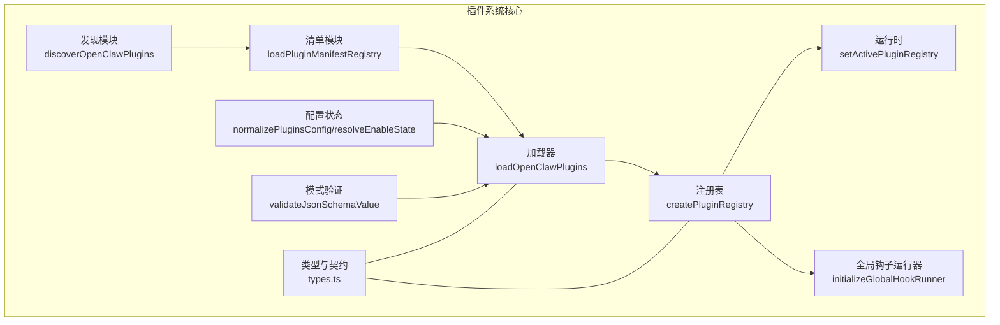

**图表来源**

- [discovery.ts](file://src/plugins/discovery.ts#L567-L635)
- [manifest-registry.ts](file://src/plugins/manifest-registry.ts#L134-L248)
- [loader.ts](file://src/plugins/loader.ts#L368-L717)
- [registry.ts](file://src/plugins/registry.ts#L164-L519)
- [runtime.ts](file://src/plugins/runtime.ts#L23-L41)
- [config-state.ts](file://src/plugins/config-state.ts#L66-L232)
- [types.ts](file://src/plugins/types.ts#L245-L284)
- [schema-validator.ts](file://src/plugins/schema-validator.ts#L27-L44)
- [hook-runner-global.ts](file://src/plugins/hook-runner-global.ts#L22-L37)

**章节来源**

- [loader.ts](file://src/plugins/loader.ts#L368-L717)
- [manifest-registry.ts](file://src/plugins/manifest-registry.ts#L134-L248)
- [discovery.ts](file://src/plugins/discovery.ts#L567-L635)
- [registry.ts](file://src/plugins/registry.ts#L164-L519)
- [runtime.ts](file://src/plugins/runtime.ts#L23-L41)
- [config-state.ts](file://src/plugins/config-state.ts#L66-L232)
- [types.ts](file://src/plugins/types.ts#L245-L284)
- [schema-validator.ts](file://src/plugins/schema-validator.ts#L27-L44)
- [hook-runner-global.ts](file://src/plugins/hook-runner-global.ts#L22-L37)

## 核心组件

- 插件发现与候选生成：扫描工作区、全局与捆绑目录，解析 package.json 扩展入口，过滤不安全路径与所有权问题，生成候选列表并附带来源与元数据。
- 清单注册表：从候选中加载 openclaw.plugin.json，构建清单记录，处理重复 ID、来源优先级与缓存。
- 插件加载器：规范化配置、构建注册 API、加载模块、校验导出、执行注册函数、收集诊断信息与错误。
- 注册表与 API：集中管理插件记录与各类资源注册（工具、钩子、通道、网关方法、HTTP 路由、CLI 命令、服务），提供统一的注册 API。
- 运行时与全局钩子：维护全局活跃注册表与缓存键；初始化全局钩子运行器，支持跨模块调用。
- 配置与安全：规范化插件启用策略、内存槽位决策、路径边界检查、权限与所有权校验、配置 JSON Schema 校验。
- CLI 集成与热重载：确保插件注册表按需加载；基于配置前缀的热重载规则与无操作规则。

**章节来源**

- [discovery.ts](file://src/plugins/discovery.ts#L567-L635)
- [manifest-registry.ts](file://src/plugins/manifest-registry.ts#L134-L248)
- [loader.ts](file://src/plugins/loader.ts#L368-L717)
- [registry.ts](file://src/plugins/registry.ts#L164-L519)
- [runtime.ts](file://src/plugins/runtime.ts#L23-L41)
- [hook-runner-global.ts](file://src/plugins/hook-runner-global.ts#L22-L37)
- [config-state.ts](file://src/plugins/config-state.ts#L66-L232)
- [types.ts](file://src/plugins/types.ts#L245-L284)
- [schema-validator.ts](file://src/plugins/schema-validator.ts#L27-L44)

## 架构总览

下图展示从发现到注册的端到端流程，包括安全检查、配置验证与注册 API 调用：

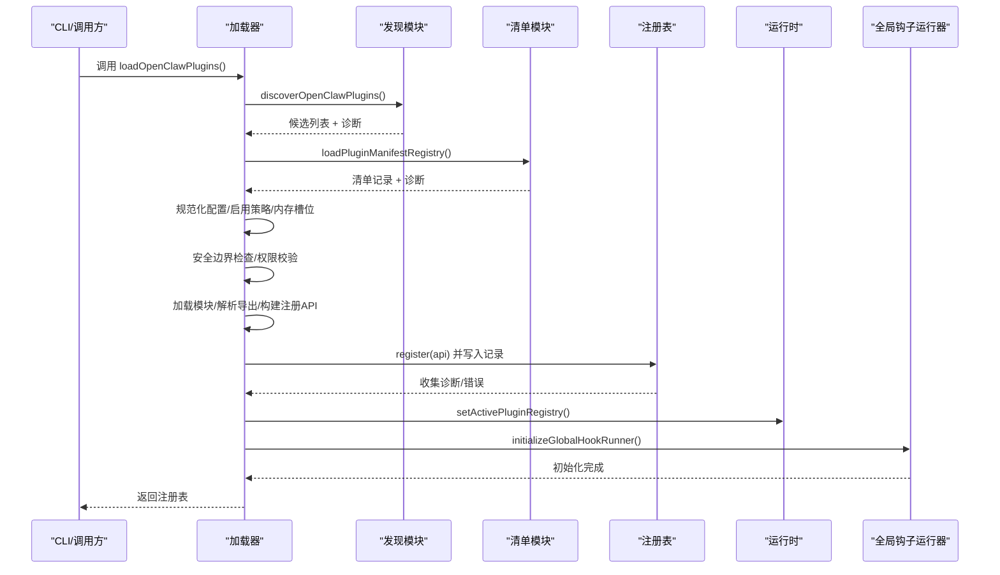

**图表来源**

- [loader.ts](file://src/plugins/loader.ts#L368-L717)
- [discovery.ts](file://src/plugins/discovery.ts#L567-L635)
- [manifest-registry.ts](file://src/plugins/manifest-registry.ts#L134-L248)
- [registry.ts](file://src/plugins/registry.ts#L164-L519)
- [runtime.ts](file://src/plugins/runtime.ts#L23-L41)
- [hook-runner-global.ts](file://src/plugins/hook-runner-global.ts#L22-L37)

## 详细组件分析

### 组件A：插件发现与候选生成

- 扫描范围：配置指定路径、工作区扩展目录、全局扩展目录、捆绑插件目录。
- 安全与权限：检查源文件是否逃逸根目录、路径是否存在、是否世界可写、所有者是否可疑（非捆绑且 UID 不匹配）。
- 包元数据：读取 package.json，解析 openclaw 扩展入口，派生 ID 提示，避免重复扫描。
- 输出：候选数组与诊断列表，包含来源、根目录、包信息与入口路径。

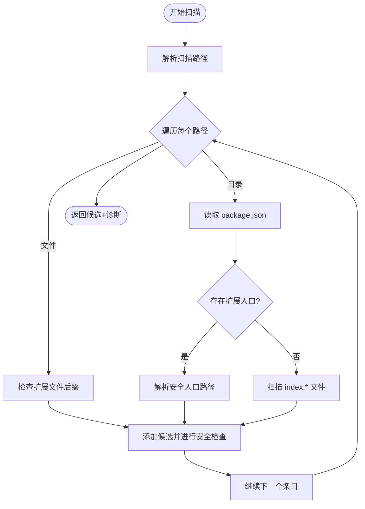

**图表来源**

- [discovery.ts](file://src/plugins/discovery.ts#L347-L451)
- [discovery.ts](file://src/plugins/discovery.ts#L453-L565)
- [discovery.ts](file://src/plugins/discovery.ts#L567-L635)

**章节来源**

- [discovery.ts](file://src/plugins/discovery.ts#L567-L635)

### 组件B：清单注册表与重复检测

- 清单加载：从候选根目录加载 openclaw.plugin.json，提取 id、configSchema、kind、channels/providers/skills 等字段。
- 重复检测：基于 manifest.id 与物理路径（realpath）去重，遵循来源优先级（config > workspace > global > bundled）。
- 缓存：基于工作区与加载路径构建缓存键，支持 TTL 控制。

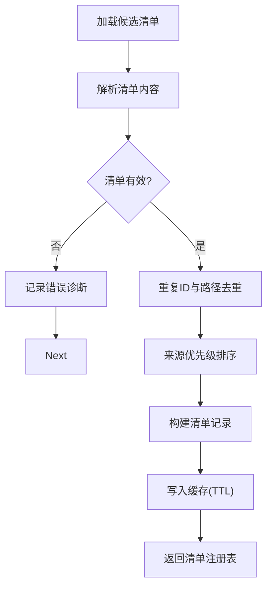

**图表来源**

- [manifest-registry.ts](file://src/plugins/manifest-registry.ts#L134-L248)
- [manifest.ts](file://src/plugins/manifest.ts#L45-L115)

**章节来源**

- [manifest-registry.ts](file://src/plugins/manifest-registry.ts#L134-L248)
- [manifest.ts](file://src/plugins/manifest.ts#L45-L115)

### 组件C：插件加载器与注册 API

- 配置与缓存：构建缓存键，命中则直接返回；否则清理命令缓存、创建运行时与注册表。
- 启用策略：根据 allow/deny、entries、origin 与默认值决定启用状态；内存槽位决策确保唯一性。
- 安全边界：对入口文件进行边界检查，防止逃逸与别名问题；权限与所有权校验。
- 模块加载：通过 Jiti 动态加载，解析默认或具名导出，构建注册 API 并调用 register/activate。
- 配置校验：使用 JSON Schema 校验插件配置，格式化错误信息。
- 诊断与错误：捕获异常并记录诊断，区分同步/异步注册行为。

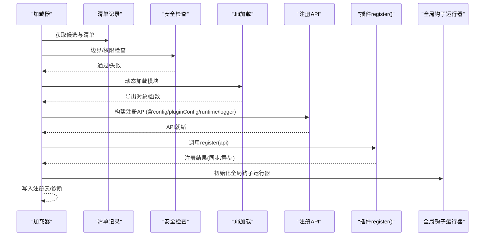

**图表来源**

- [loader.ts](file://src/plugins/loader.ts#L368-L717)
- [registry.ts](file://src/plugins/registry.ts#L472-L503)
- [hook-runner-global.ts](file://src/plugins/hook-runner-global.ts#L22-L37)

**章节来源**

- [loader.ts](file://src/plugins/loader.ts#L368-L717)
- [registry.ts](file://src/plugins/registry.ts#L472-L503)

### 组件D：注册表与注册 API

- 注册表结构：聚合插件记录与各类资源（工具、钩子、通道、提供者、网关方法、HTTP 路由、CLI、服务、命令、诊断）。
- 注册 API：提供 registerTool/registerHook/registerChannel/registerProvider/registerGatewayMethod/registerCli/registerService/registerCommand/on 等方法，统一记录与去重。
- 钩子系统：支持内部钩子注册与全局运行器初始化，允许插件声明生命周期钩子。

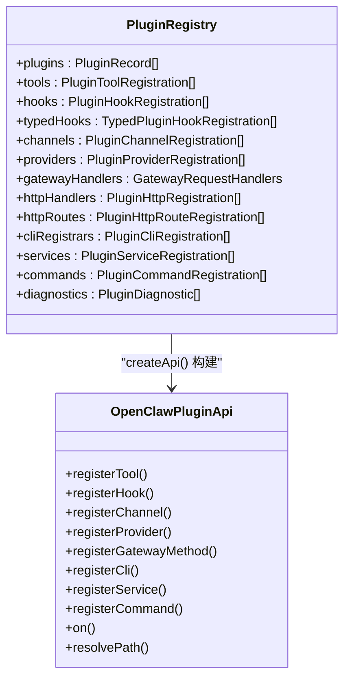

**图表来源**

- [registry.ts](file://src/plugins/registry.ts#L124-L138)
- [registry.ts](file://src/plugins/registry.ts#L472-L503)

**章节来源**

- [registry.ts](file://src/plugins/registry.ts#L124-L138)
- [registry.ts](file://src/plugins/registry.ts#L472-L503)

### 组件E：运行时与全局钩子运行器

- 运行时：以全局符号保存当前注册表与缓存键，提供获取与设置能力。
- 全局钩子运行器：在插件加载完成后初始化，提供钩子查询与安全执行能力，支持 gateway_stop 等关键钩子的安全回调。

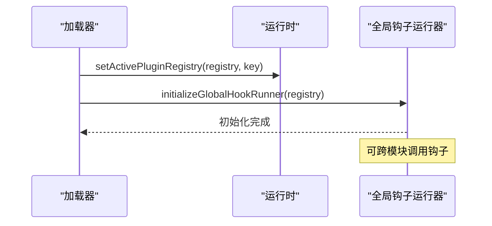

**图表来源**

- [runtime.ts](file://src/plugins/runtime.ts#L23-L41)
- [hook-runner-global.ts](file://src/plugins/hook-runner-global.ts#L22-L37)

**章节来源**

- [runtime.ts](file://src/plugins/runtime.ts#L23-L41)
- [hook-runner-global.ts](file://src/plugins/hook-runner-global.ts#L22-L37)

### 组件F：配置状态与启用策略

- 规范化：将配置转换为 NormalizedPluginsConfig，处理 allow/deny、loadPaths、slots、entries。
- 启用策略：综合 plugins.enabled、deny/allow、entries 显式开关、origin 来源与默认值（如捆绑插件）。
- 内存槽位：解析 memory slot 决策，确保同一时刻仅一个 memory 插件被启用。

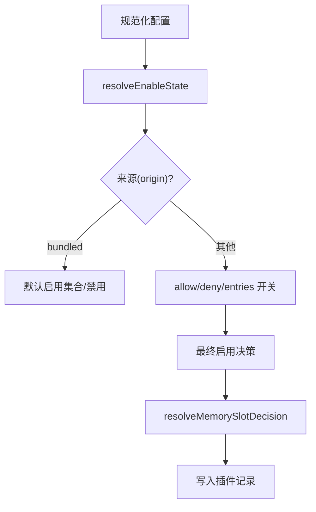

**图表来源**

- [config-state.ts](file://src/plugins/config-state.ts#L66-L232)

**章节来源**

- [config-state.ts](file://src/plugins/config-state.ts#L66-L232)

### 组件G：配置验证与安全策略

- JSON Schema 校验：编译并缓存校验器，格式化错误路径与消息。
- 安全边界：openBoundaryFileSync 限制访问范围，避免逃逸与别名问题；路径权限与所有权检查。
- 插件 SDK 别名：在开发/生产/测试环境下解析 openclaw/plugin-sdk 别名，支持源码与分发目录。

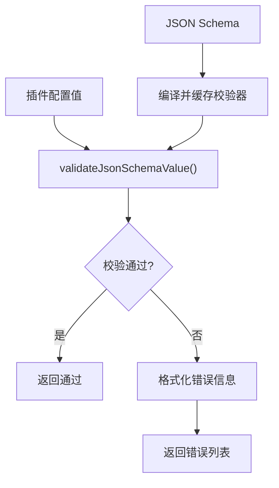

**图表来源**

- [schema-validator.ts](file://src/plugins/schema-validator.ts#L27-L44)
- [loader.ts](file://src/plugins/loader.ts#L528-L552)

**章节来源**

- [schema-validator.ts](file://src/plugins/schema-validator.ts#L27-L44)
- [loader.ts](file://src/plugins/loader.ts#L528-L552)

### 组件H：插件注册 API、事件监听与状态管理

- 注册 API：提供工具、钩子、通道、提供者、网关方法、HTTP 路由、CLI、服务、命令的注册方法，并支持生命周期钩子 on。
- 事件监听：全局钩子运行器初始化后，插件可通过 on 注册生命周期钩子，系统在相应阶段触发。
- 状态管理：插件记录包含 enabled/status/error 等状态字段，配合诊断信息追踪加载与注册过程。

**章节来源**

- [types.ts](file://src/plugins/types.ts#L245-L284)
- [registry.ts](file://src/plugins/registry.ts#L472-L503)
- [hook-runner-global.ts](file://src/plugins/hook-runner-global.ts#L22-L37)

### 组件I：生命周期管理、热重载与错误恢复

- 生命周期：通过 typed hooks 提供 before_model_resolve/before_prompt_build/before_agent_start/llm_input/llm_output/agent_end 等阶段钩子。
- 热重载：基于配置前缀的规则，支持“热重载”与“无操作”两类动作；规则动态构建并缓存。
- 错误恢复：全局钩子运行器在 catchErrors 模式下运行，gateway_stop 钩子提供安全回调；加载器捕获异常并记录诊断。

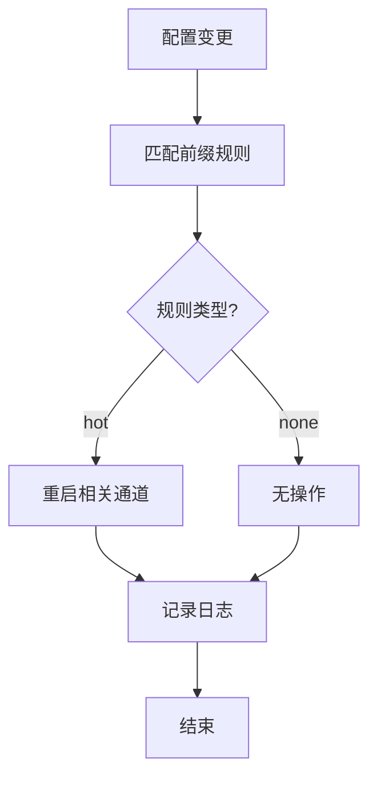

**图表来源**

- [config-reload.ts](file://src/gateway/config-reload.ts#L96-L133)

**章节来源**

- [config-reload.ts](file://src/gateway/config-reload.ts#L96-L133)
- [hook-runner-global.ts](file://src/plugins/hook-runner-global.ts#L62-L80)

### 组件J：卸载清理与冲突处理

- 卸载清理：移除安装记录中的 sourcePath，更新 load.paths；若卸载的是内存槽位插件，则重置为默认槽位。
- 冲突处理：清单模块对重复 ID 与相同物理路径进行去重；加载器对同 ID 多来源进行覆盖提示与错误记录。

**章节来源**

- [uninstall.ts](file://src/plugins/uninstall.ts#L106-L156)
- [manifest-registry.ts](file://src/plugins/manifest-registry.ts#L196-L238)
- [loader.ts](file://src/plugins/loader.ts#L466-L482)

## 依赖关系分析

- 模块耦合：发现模块与清单模块解耦，通过候选与清单记录传递；加载器依赖配置状态、清单与注册表；注册表依赖类型与运行时。
- 外部依赖：Jiti 用于动态加载；AJV 用于 JSON Schema 校验；Node FS/Path 用于文件系统操作。
- 循环依赖：未见循环导入；全局运行时通过符号隔离状态。

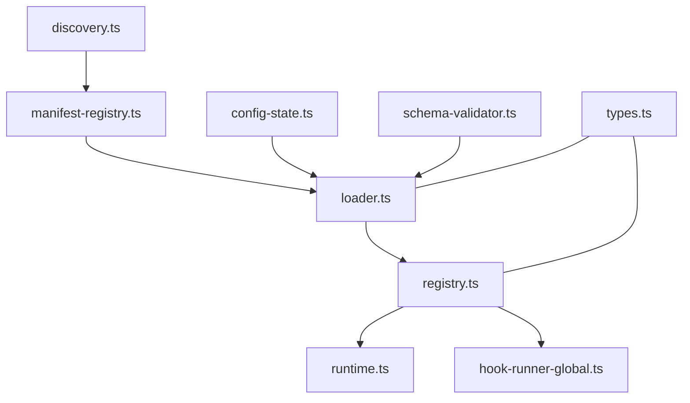

**图表来源**

- [discovery.ts](file://src/plugins/discovery.ts#L567-L635)
- [manifest-registry.ts](file://src/plugins/manifest-registry.ts#L134-L248)
- [loader.ts](file://src/plugins/loader.ts#L368-L717)
- [registry.ts](file://src/plugins/registry.ts#L164-L519)
- [runtime.ts](file://src/plugins/runtime.ts#L23-L41)
- [hook-runner-global.ts](file://src/plugins/hook-runner-global.ts#L22-L37)
- [config-state.ts](file://src/plugins/config-state.ts#L66-L232)
- [types.ts](file://src/plugins/types.ts#L245-L284)
- [schema-validator.ts](file://src/plugins/schema-validator.ts#L27-L44)

**章节来源**

- [loader.ts](file://src/plugins/loader.ts#L368-L717)
- [registry.ts](file://src/plugins/registry.ts#L164-L519)
- [runtime.ts](file://src/plugins/runtime.ts#L23-L41)
- [hook-runner-global.ts](file://src/plugins/hook-runner-global.ts#L22-L37)
- [config-state.ts](file://src/plugins/config-state.ts#L66-L232)
- [types.ts](file://src/plugins/types.ts#L245-L284)
- [schema-validator.ts](file://src/plugins/schema-validator.ts#L27-L44)

## 性能考虑

- 缓存策略：清单注册表与插件注册表均支持缓存，清单使用 TTL，加载器使用缓存键；manifest-cache-ms 可配置。
- 动态加载：Jiti 按需创建，避免测试环境不必要的开销；插件 SDK 别名解析减少查找成本。
- I/O 优化：安全边界检查与权限校验集中在入口处，减少后续重复检查；清单缓存提升重复加载性能。
- 并发与异步：注册 API 对异步注册给出警告，避免阻塞主流程。

[本节为通用指导，无需特定文件引用]

## 故障排除指南

- 插件未加载：检查 plugins.allow 是否为空且存在非捆绑插件；查看诊断信息中的“未在白名单中/被拒绝/未启用”等提示。
- 配置校验失败：查看 formatAjvErrors 输出的路径与错误信息，修正 openclaw.plugin.json 中的 configSchema。
- 权限与所有权：检查路径是否世界可写、是否逃逸根目录、UID 是否匹配；根据诊断信息调整文件权限或归属。
- 注册异常：加载器捕获 register 抛错并记录诊断；查看日志中的错误堆栈与来源路径。
- 全局钩子：确认 initializeGlobalHookRunner 已调用；使用 hasGlobalHooks 检查是否存在对应钩子。

**章节来源**

- [loader.ts](file://src/plugins/loader.ts#L187-L210)
- [schema-validator.ts](file://src/plugins/schema-validator.ts#L16-L25)
- [discovery.ts](file://src/plugins/discovery.ts#L143-L199)
- [hook-runner-global.ts](file://src/plugins/hook-runner-global.ts#L58-L80)

## 结论

OpenClaw 插件注册系统通过清晰的发现、清单、加载与注册流程，结合严格的权限与安全检查、完善的配置验证与诊断机制，实现了高可靠性的插件生态。其全局钩子运行器与热重载规则进一步增强了系统的可观测性与可维护性。建议在生产环境中合理配置 allow/deny 与 loadPaths，利用缓存与清单 TTL 提升启动性能，并通过诊断信息持续监控插件健康状况。

[本节为总结性内容，无需特定文件引用]

## 附录

- CLI 集成：ensurePluginRegistryLoaded 在首次调用时加载插件注册表，避免重复开销。
- 版本兼容与降级：清单模块基于 manifest.mtime 构建 schemaCacheKey，确保配置 schema 更新时重新校验；未显式提供降级策略，建议在升级前保留旧 schema 或提供迁移脚本。

**章节来源**

- [plugin-registry.ts](file://src/cli/plugin-registry.ts#L11-L39)
- [manifest-registry.ts](file://src/plugins/manifest-registry.ts#L190-L194)
