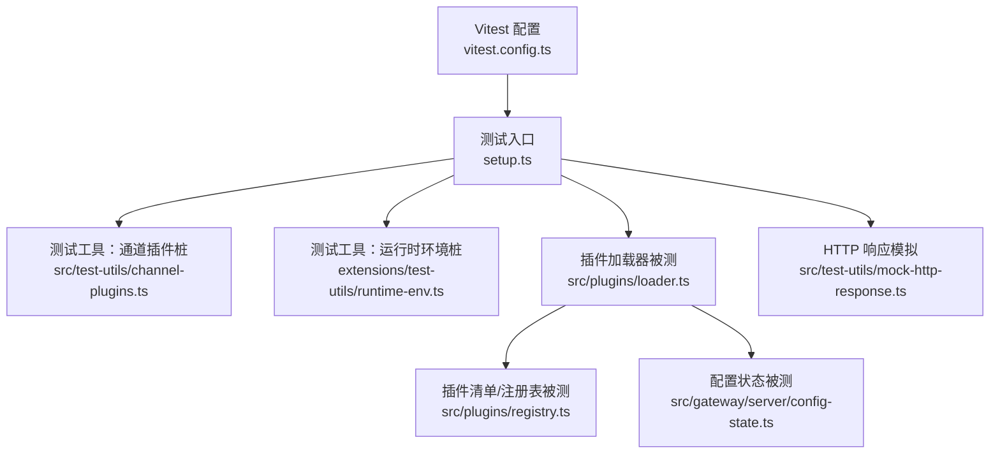
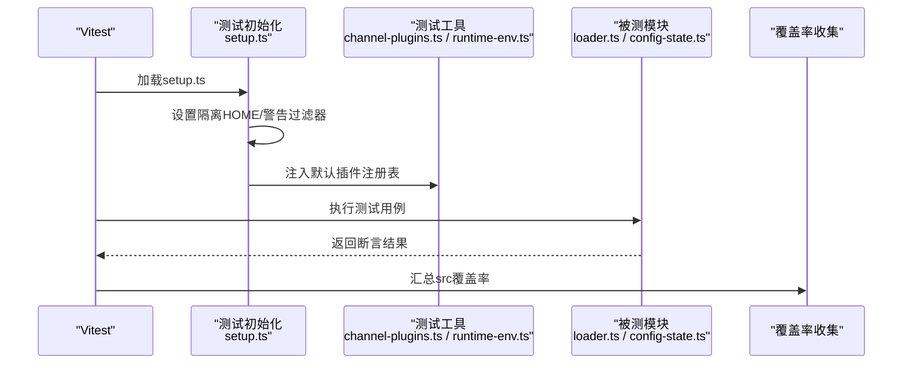
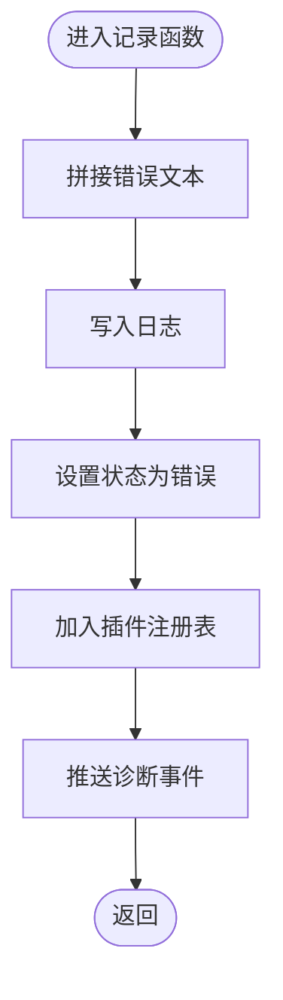
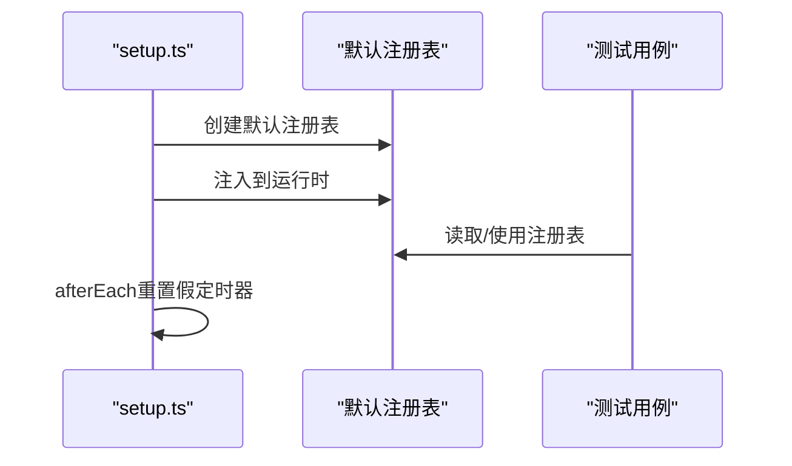
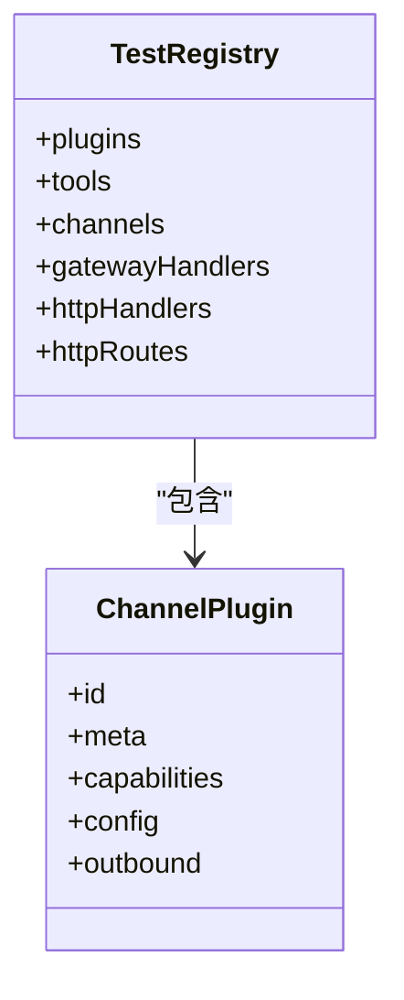
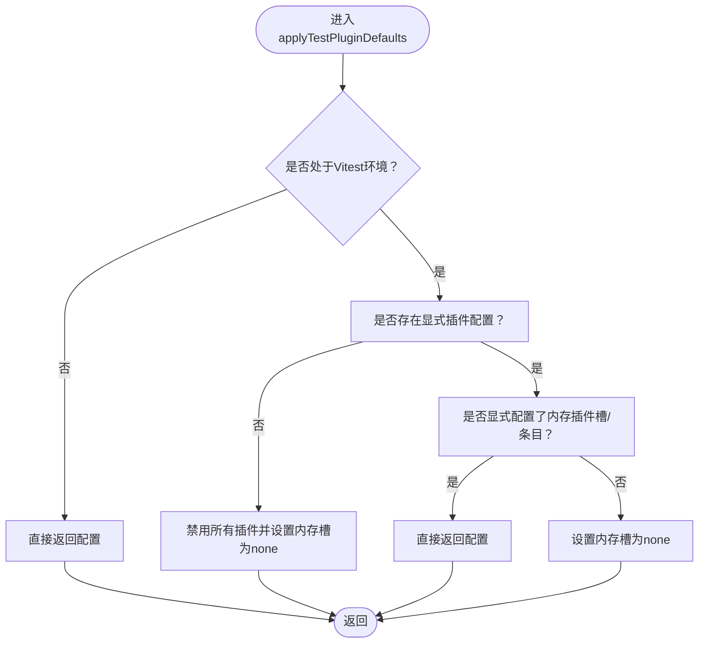
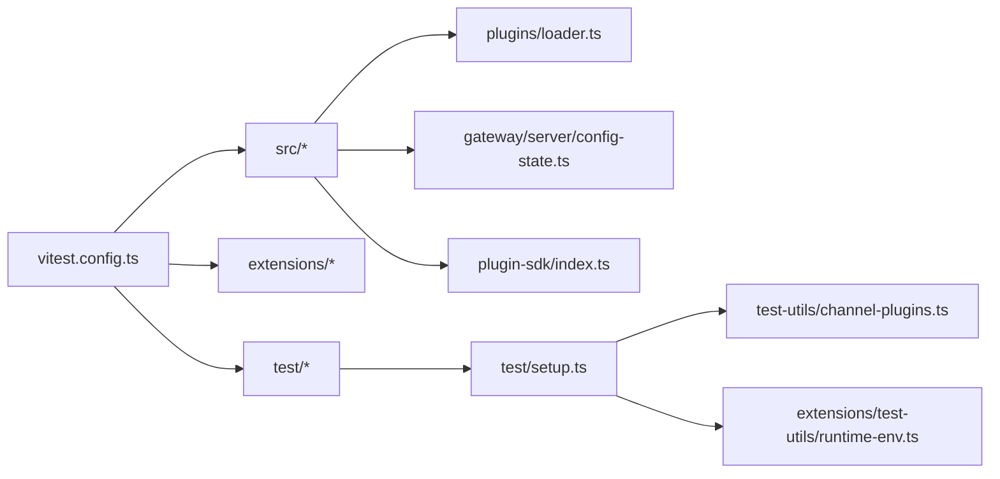

# 插件测试与调试

<cite>
**本文引用的文件**
- [vitest.config.ts](file://vitest.config.ts)
- [setup.ts](file://test/setup.ts)
- [channel-plugins.ts](file://src/test-utils/channel-plugins.ts)
- [loader.test.ts](file://src/plugins/loader.test.ts)
- [config-state.ts](file://src/gateway/server/config-state.ts)
- [runtime-env.ts](file://extensions/test-utils/runtime-env.ts)
- [index.ts](file://src/plugin-sdk/index.ts)
- [ci.md](file://docs/ci.md)
- [SECURITY.md](file://SECURITY.md)
- [status.command.ts](file://src/commands/status.command.ts)
- [mock-http-response.ts](file://src/test-utils/mock-http-response.ts)
- [loader.ts](file://src/plugins/loader.ts)
</cite>

## 目录

1. [简介](#简介)
2. [项目结构](#项目结构)
3. [核心组件](#核心组件)
4. [架构总览](#架构总览)
5. [详细组件分析](#详细组件分析)
6. [依赖关系分析](#依赖关系分析)
7. [性能考量](#性能考量)
8. [故障排查指南](#故障排查指南)
9. [结论](#结论)
10. [附录](#附录)

## 简介

本指南面向OpenClaw插件的测试与调试，覆盖测试框架、单元测试与集成测试策略、测试环境搭建、模拟对象与断言方法、调试工具与日志分析、性能监控、最佳实践与覆盖率要求、持续集成流程、问题诊断与修复路径，以及安全测试与合规性验证。内容基于仓库中现有的测试配置、工具与插件运行时实现进行归纳总结，帮助开发者在不直接阅读代码的前提下快速上手并高效定位问题。

## 项目结构

OpenClaw采用Vitest作为测试框架，通过统一的配置文件控制测试超时、并发、覆盖率阈值与排除范围；测试环境通过setup脚本隔离工作目录、安装进程警告过滤器，并预置默认插件注册表；测试工具模块提供通道插件桩、HTTP响应模拟等辅助能力；插件加载器与配置状态模块是插件测试的关键被测对象。

图表来源

- [vitest.config.ts](file://vitest.config.ts#L12-L158)
- [setup.ts](file://test/setup.ts#L1-L190)
- [channel-plugins.ts](file://src/test-utils/channel-plugins.ts#L1-L106)
- [runtime-env.ts](file://extensions/test-utils/runtime-env.ts#L1-L12)
- [loader.ts](file://src/plugins/loader.ts#L187-L233)
- [config-state.ts](file://src/gateway/server/config-state.ts#L113-L196)
- [mock-http-response.ts](file://src/test-utils/mock-http-response.ts#L1-L25)

章节来源

- [vitest.config.ts](file://vitest.config.ts#L12-L158)
- [setup.ts](file://test/setup.ts#L1-L190)

## 核心组件

- 测试框架与配置
  - Vitest配置集中于单一文件，定义别名、超时、并发、include/exclude与覆盖率阈值，确保跨平台稳定性与可重复性。
- 测试环境初始化
  - 通过setup脚本设置Vitest标志、进程监听上限、隔离测试HOME目录、安装进程警告过滤器、注入默认插件注册表。
- 测试工具
  - 通道插件桩：快速构建通道插件对象，支持自定义元数据、能力、配置解析与出站适配器。
  - 运行时环境桩：为插件SDK提供日志、错误输出与退出行为的可测试桩。
  - HTTP响应模拟：构造Node原生ServerResponse以断言网关处理逻辑。
- 被测系统
  - 插件加载器：负责记录错误、维护诊断事件、构建路径匹配规则与安装跟踪。
  - 配置状态：在测试环境下应用默认插件槽位与启用状态，避免默认内存插件影响测试结果。

章节来源

- [vitest.config.ts](file://vitest.config.ts#L12-L158)
- [setup.ts](file://test/setup.ts#L1-L190)
- [channel-plugins.ts](file://src/test-utils/channel-plugins.ts#L1-L106)
- [runtime-env.ts](file://extensions/test-utils/runtime-env.ts#L1-L12)
- [mock-http-response.ts](file://src/test-utils/mock-http-response.ts#L1-L25)
- [loader.ts](file://src/plugins/loader.ts#L187-L233)
- [config-state.ts](file://src/gateway/server/config-state.ts#L113-L196)

## 架构总览

下图展示测试执行的总体流程：Vitest启动后加载setup脚本，注入默认插件注册表与工具；各测试用例调用被测模块（如插件加载器），通过断言验证行为；覆盖率统计仅对src内实际被执行的源码生效。

图表来源

- [setup.ts](file://test/setup.ts#L1-L190)
- [channel-plugins.ts](file://src/test-utils/channel-plugins.ts#L1-L106)
- [runtime-env.ts](file://extensions/test-utils/runtime-env.ts#L1-L12)
- [loader.ts](file://src/plugins/loader.ts#L187-L233)
- [config-state.ts](file://src/gateway/server/config-state.ts#L113-L196)
- [vitest.config.ts](file://vitest.config.ts#L56-L155)

## 详细组件分析

### 组件A：插件加载器与错误记录

- 职责
  - 记录插件加载错误、更新状态与诊断事件，便于后续诊断。
- 关键点
  - 错误文本化、状态标记、诊断事件推送，确保可观测性。
- 断言建议
  - 验证错误消息是否包含预期关键字。
  - 验证诊断事件数量与级别。
  - 验证插件记录状态字段。

图表来源

- [loader.ts](file://src/plugins/loader.ts#L187-L210)

章节来源

- [loader.ts](file://src/plugins/loader.ts#L187-L233)

### 组件B：测试环境与默认注册表

- 职责
  - 初始化隔离的测试环境，注入默认通道插件注册表，避免跨文件污染。
- 关键点
  - 默认注册表包含多个通道插件桩，覆盖主流渠道。
  - 每个测试前激活默认注册表，结束后重置假定时器。
- 断言建议
  - 在测试开始前断言当前注册表为默认注册表。
  - 在测试结束时断言未泄漏假定时器。

图表来源

- [setup.ts](file://test/setup.ts#L128-L190)
- [channel-plugins.ts](file://src/test-utils/channel-plugins.ts#L15-L29)

章节来源

- [setup.ts](file://test/setup.ts#L128-L190)
- [channel-plugins.ts](file://src/test-utils/channel-plugins.ts#L15-L29)

### 组件C：通道插件桩与HTTP响应模拟

- 职责
  - 快速生成通道插件对象，支持自定义元信息、能力与出站适配器。
  - 提供HTTP响应模拟，用于断言网关处理逻辑。
- 断言建议
  - 断言出站发送函数被调用且参数符合预期。
  - 断言响应体与头部正确设置。

图表来源

- [channel-plugins.ts](file://src/test-utils/channel-plugins.ts#L15-L29)

章节来源

- [channel-plugins.ts](file://src/test-utils/channel-plugins.ts#L1-L106)
- [mock-http-response.ts](file://src/test-utils/mock-http-response.ts#L1-L25)

### 组件D：插件配置状态与测试默认值

- 职责
  - 在测试环境中自动应用默认插件槽位与启用状态，避免默认内存插件影响测试。
- 断言建议
  - 断言测试默认内存槽位被禁用或显式配置存在时保持不变。
  - 断言启用状态解析逻辑按预期分支工作。

图表来源

- [config-state.ts](file://src/gateway/server/config-state.ts#L113-L149)

章节来源

- [config-state.ts](file://src/gateway/server/config-state.ts#L113-L196)

### 组件E：插件SDK与运行时环境桩

- 职责
  - 提供插件开发所需的类型与工具函数；运行时环境桩用于模拟日志、错误与退出行为。
- 断言建议
  - 断言日志/错误函数被调用且参数符合预期。
  - 断言退出行为触发异常以中断测试流。

章节来源

- [index.ts](file://src/plugin-sdk/index.ts#L1-L597)
- [runtime-env.ts](file://extensions/test-utils/runtime-env.ts#L1-L12)

## 依赖关系分析

- 测试配置对被测模块的影响
  - 覆盖率仅统计src内实际执行的代码，排除入口、CLI、网关服务器等大面集成模块，确保阈值稳定。
  - include/exclude列表明确限定测试范围，避免无关包干扰。
- 测试工具与被测模块的耦合
  - 通道插件桩与默认注册表降低测试耦合度，便于独立验证插件加载与配置解析。
  - 运行时环境桩与HTTP响应模拟提升对SDK与网关处理逻辑的可控性。

图表来源

- [vitest.config.ts](file://vitest.config.ts#L36-L55)
- [loader.ts](file://src/plugins/loader.ts#L187-L233)
- [config-state.ts](file://src/gateway/server/config-state.ts#L113-L196)
- [index.ts](file://src/plugin-sdk/index.ts#L1-L597)
- [setup.ts](file://test/setup.ts#L1-L190)
- [channel-plugins.ts](file://src/test-utils/channel-plugins.ts#L1-L106)
- [runtime-env.ts](file://extensions/test-utils/runtime-env.ts#L1-L12)

章节来源

- [vitest.config.ts](file://vitest.config.ts#L36-L155)
- [setup.ts](file://test/setup.ts#L1-L190)

## 性能考量

- 并发与超时
  - Vitest在CI与本地采用不同最大工作线程数；测试与钩子超时根据平台调整，避免Windows平台的额外等待。
- 覆盖率统计
  - 仅统计src内被实际执行的文件，排除大型集成模块与UI，确保覆盖率阈值稳定且可达成。
- 环境隔离
  - 通过隔离HOME与警告过滤器减少跨测试污染，提高测试稳定性与可重复性。

章节来源

- [vitest.config.ts](file://vitest.config.ts#L1-L158)
- [setup.ts](file://test/setup.ts#L1-L190)

## 故障排查指南

- 插件加载失败
  - 使用插件加载器的错误记录逻辑定位具体错误文本与诊断事件，检查插件清单与来源。
- 配置状态异常
  - 在测试环境中确认默认插件槽位与启用状态是否被正确应用，必要时显式配置以避免默认内存插件影响。
- 日志与诊断
  - 利用SDK提供的诊断事件与日志工具，结合测试环境中的警告过滤器，定位问题根因。
- 安全审计
  - 使用命令行安全审计功能查看严重程度为“critical”或“warn”的发现，优先处理高风险项。

章节来源

- [loader.ts](file://src/plugins/loader.ts#L187-L233)
- [config-state.ts](file://src/gateway/server/config-state.ts#L113-L196)
- [index.ts](file://src/plugin-sdk/index.ts#L429-L449)
- [status.command.ts](file://src/commands/status.command.ts#L447-L482)

## 结论

通过统一的Vitest配置、完善的测试环境初始化、丰富的测试工具与对关键模块（插件加载器、配置状态）的针对性断言，OpenClaw为插件测试与调试提供了清晰、可重复且可扩展的工程化路径。配合覆盖率阈值与CI智能分层，既能保证质量门槛，又能兼顾效率与可维护性。

## 附录

### A. 测试环境搭建步骤

- 安装依赖并准备测试环境
  - 确保已安装项目依赖并在本地或CI环境中运行Vitest。
- 隔离测试HOME与警告过滤
  - setup脚本会自动设置隔离HOME与警告过滤器，无需手动干预。
- 注入默认插件注册表
  - 每个测试前会激活默认注册表，包含多个通道插件桩，便于直接使用。

章节来源

- [setup.ts](file://test/setup.ts#L1-L190)

### B. 单元测试与集成测试策略

- 单元测试
  - 针对插件加载器与配置状态等核心模块编写单元测试，断言错误记录、状态变更与诊断事件。
- 集成测试
  - 使用通道插件桩与HTTP响应模拟，验证从插件到网关的端到端流程；通过include/exclude列表控制测试范围。

章节来源

- [loader.test.ts](file://src/plugins/loader.test.ts#L36-L74)
- [channel-plugins.ts](file://src/test-utils/channel-plugins.ts#L1-L106)
- [mock-http-response.ts](file://src/test-utils/mock-http-response.ts#L1-L25)
- [vitest.config.ts](file://vitest.config.ts#L36-L55)

### C. 覆盖率要求与持续集成

- 覆盖率阈值
  - 行、函数、分支、语句阈值分别为70%、70%、55%、70%，仅统计src内实际执行文件。
- CI策略
  - CI文档描述了作业图、范围门控与本地等价命令，便于理解与调试。

章节来源

- [vitest.config.ts](file://vitest.config.ts#L56-L155)
- [ci.md](file://docs/ci.md#L1-L12)

### D. 安全测试与合规性验证

- 安全审计命令
  - 使用安全审计命令查看严重问题与修复建议，优先处理critical与warn级别。
- 合规范围与边界
  - 参考安全文档中的“常见误报模式”与“不在范围内”的场景，避免将非边界绕过问题误判为漏洞。

章节来源

- [status.command.ts](file://src/commands/status.command.ts#L447-L482)
- [SECURITY.md](file://SECURITY.md#L48-L122)
