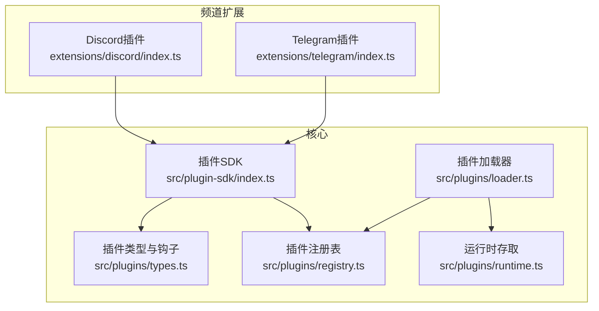
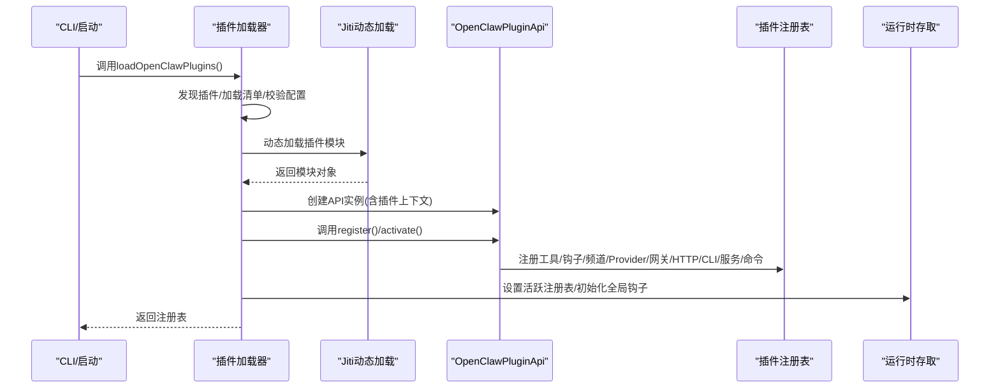
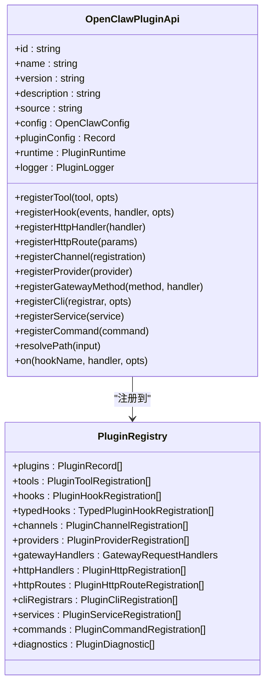
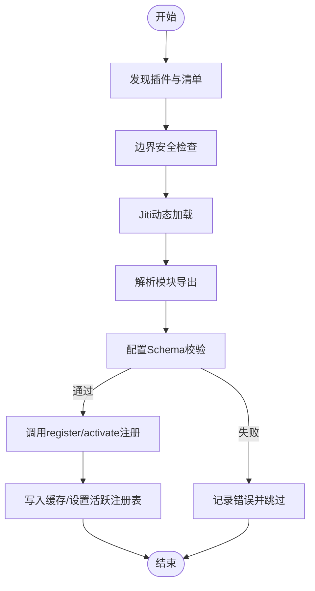
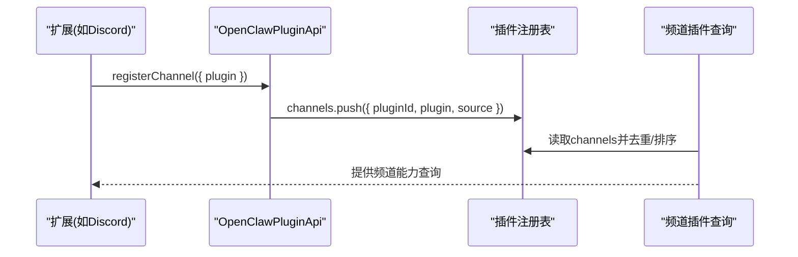
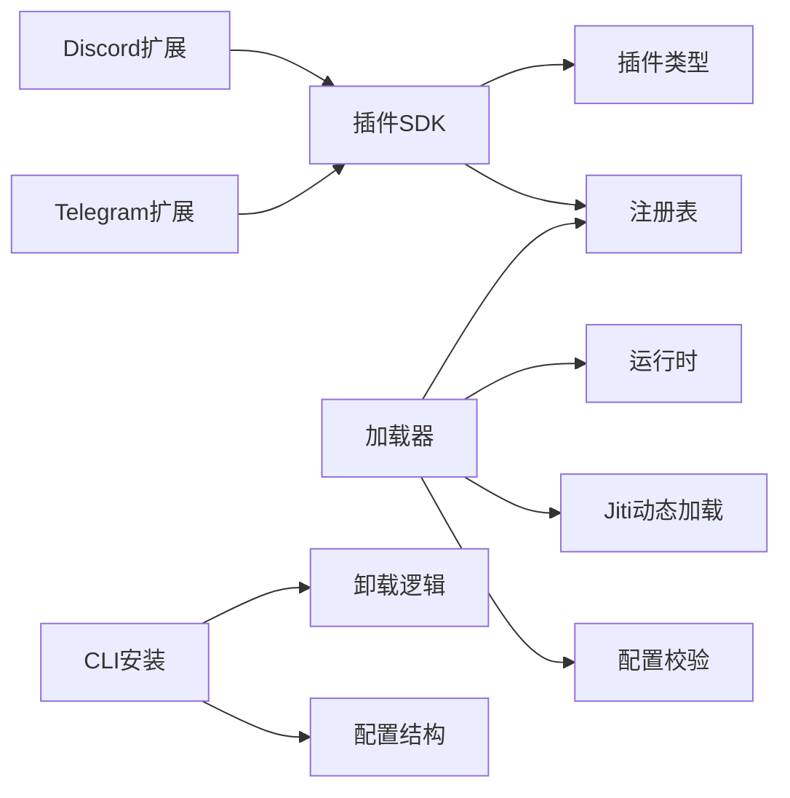

# 插件频道扩展

<cite>
**本文引用的文件**
- [src/plugin-sdk/index.ts](file://src/plugin-sdk/index.ts)
- [src/plugins/types.ts](file://src/plugins/types.ts)
- [src/plugins/registry.ts](file://src/plugins/registry.ts)
- [src/plugins/loader.ts](file://src/plugins/loader.ts)
- [src/plugins/runtime.ts](file://src/plugins/runtime.ts)
- [src/channels/plugins/types.ts](file://src/channels/plugins/types.ts)
- [src/channels/plugins/index.ts](file://src/channels/plugins/index.ts)
- [src/channels/plugins/pairing.ts](file://src/channels/plugins/pairing.ts)
- [src/plugins/config-schema.ts](file://src/plugins/config-schema.ts)
- [src/cli/plugins-cli.ts](file://src/cli/plugins-cli.ts)
- [src/plugins/uninstall.ts](file://src/plugins/uninstall.ts)
- [extensions/discord/index.ts](file://extensions/discord/index.ts)
- [extensions/telegram/index.ts](file://extensions/telegram/index.ts)
</cite>

## 目录

1. [引言](#引言)
2. [项目结构](#项目结构)
3. [核心组件](#核心组件)
4. [架构总览](#架构总览)
5. [详细组件分析](#详细组件分析)
6. [依赖关系分析](#依赖关系分析)
7. [性能考量](#性能考量)
8. [故障排查指南](#故障排查指南)
9. [结论](#结论)
10. [附录](#附录)

## 引言

本文件面向OpenClaw插件频道扩展，系统化阐述插件化频道系统的架构设计与实现细节，覆盖插件注册机制、动态加载流程、生命周期管理、开发规范与接口定义、与核心系统的交互协议、数据交换与错误处理、最佳实践与调试技巧、发布流程、版本管理与兼容性保障等。目标是帮助开发者快速理解并高效构建稳定、可维护的频道插件。

## 项目结构

OpenClaw采用“核心+插件SDK+扩展”的分层组织方式：

- 核心运行时与插件框架位于src/plugins与src/plugin-sdk目录，负责插件发现、加载、注册、运行时API与钩子系统。
- 频道插件位于extensions目录下，每个频道作为独立包导出OpenClawPluginDefinition或register函数，并通过OpenClawPluginApi完成注册。
- 频道插件类型与适配器定义在src/channels/plugins中，统一抽象消息、认证、网关、状态等能力。

图示来源

- [src/plugin-sdk/index.ts](file://src/plugin-sdk/index.ts#L1-L597)
- [src/plugins/types.ts](file://src/plugins/types.ts#L1-L764)
- [src/plugins/registry.ts](file://src/plugins/registry.ts#L1-L520)
- [src/plugins/loader.ts](file://src/plugins/loader.ts#L1-L726)
- [src/plugins/runtime.ts](file://src/plugins/runtime.ts#L1-L41)
- [extensions/discord/index.ts](file://extensions/discord/index.ts#L1-L20)
- [extensions/telegram/index.ts](file://extensions/telegram/index.ts#L1-L18)

章节来源

- [src/plugin-sdk/index.ts](file://src/plugin-sdk/index.ts#L1-L597)
- [src/plugins/types.ts](file://src/plugins/types.ts#L1-L764)
- [src/plugins/registry.ts](file://src/plugins/registry.ts#L1-L520)
- [src/plugins/loader.ts](file://src/plugins/loader.ts#L1-L726)
- [src/plugins/runtime.ts](file://src/plugins/runtime.ts#L1-L41)
- [extensions/discord/index.ts](file://extensions/discord/index.ts#L1-L20)
- [extensions/telegram/index.ts](file://extensions/telegram/index.ts#L1-L18)

## 核心组件

- 插件SDK与导出入口：集中导出频道适配器、工具、类型、运行时API、HTTP/Webhook路由、状态辅助、安全策略等，供插件与核心共享。
- 插件类型与钩子：定义插件API、命令、服务、HTTP路由、CLI注册、Provider认证、插件记录与诊断信息；声明丰富生命周期钩子（模型解析、提示构建、消息收发、工具调用、会话、网关启停等）。
- 插件注册表：统一收集插件工具、钩子、频道、Provider、网关方法、HTTP处理器/路由、CLI注册器、服务、命令等，支持去重、统计与诊断。
- 插件加载器：负责插件发现、清单校验、边界安全检查、Jiti动态加载、配置校验、注册调用、缓存与全局注册表设置。
- 运行时存取：通过全局状态保存当前活跃注册表，支持键值缓存与全局钩子初始化。

章节来源

- [src/plugin-sdk/index.ts](file://src/plugin-sdk/index.ts#L1-L597)
- [src/plugins/types.ts](file://src/plugins/types.ts#L1-L764)
- [src/plugins/registry.ts](file://src/plugins/registry.ts#L124-L162)
- [src/plugins/loader.ts](file://src/plugins/loader.ts#L368-L717)
- [src/plugins/runtime.ts](file://src/plugins/runtime.ts#L1-L41)

## 架构总览

OpenClaw的插件频道扩展遵循“声明式注册 + 动态加载 + 生命周期钩子”的模式：

- 插件通过OpenClawPluginDefinition或register导出，使用OpenClawPluginApi完成工具、钩子、频道、Provider、网关方法、HTTP路由、CLI、服务、命令等注册。
- 加载器按配置与路径发现插件，进行边界安全检查、配置校验、Jiti加载与注册调用，最终将注册表设为活跃状态并初始化全局钩子。
- 频道插件通过ChannelPlugin接口对接具体消息平台，统一对外暴露认证、网关、状态、消息、线程、提及、心跳等适配器。

图示来源

- [src/plugins/loader.ts](file://src/plugins/loader.ts#L368-L717)
- [src/plugins/registry.ts](file://src/plugins/registry.ts#L472-L503)
- [src/plugins/runtime.ts](file://src/plugins/runtime.ts#L23-L41)

章节来源

- [src/plugins/loader.ts](file://src/plugins/loader.ts#L368-L717)
- [src/plugins/registry.ts](file://src/plugins/registry.ts#L472-L503)
- [src/plugins/runtime.ts](file://src/plugins/runtime.ts#L1-L41)

## 详细组件分析

### 组件A：插件注册机制与API

- OpenClawPluginApi提供统一注册入口：
  - registerTool/registerHook/registerChannel/registerProvider/registerGatewayMethod/registerHttpHandler/registerHttpRoute/registerCli/registerService/registerCommand/on等。
  - 支持resolvePath、日志、运行时访问等通用能力。
- 注册表结构：
  - plugins：插件记录（含状态、工具名、钩子名、频道ID、Provider ID、网关方法、CLI命令、服务、命令、HTTP处理器数、钩子数、配置Schema等）。
  - tools/hooks/typedHooks/channels/providers/gatewayHandlers/httpHandlers/httpRoutes/cliRegistrars/services/commands/diagnostics等集合。
- 钩子系统：
  - 定义丰富的生命周期钩子（before*model_resolve/before_prompt_build/before_agent_start/llm_input/llm_output/agent_end/before_compaction/after_compaction/before_reset/message_received/message_sending/message_sent/before_tool_call/after_tool_call/tool_result_persist/before_message_write/session_start/session_end/subagent*\*等），并支持优先级与内部钩子注册。

图示来源

- [src/plugins/types.ts](file://src/plugins/types.ts#L245-L284)
- [src/plugins/registry.ts](file://src/plugins/registry.ts#L124-L138)

章节来源

- [src/plugins/types.ts](file://src/plugins/types.ts#L245-L284)
- [src/plugins/registry.ts](file://src/plugins/registry.ts#L124-L138)

### 组件B：动态加载流程与安全边界

- 发现与清单：discoverOpenClawPlugins + loadPluginManifestRegistry，结合配置的load.paths与插件根目录，生成候选清单与诊断。
- 边界安全：openBoundaryFileSync限制插件入口文件必须位于插件根目录内，避免路径逃逸。
- Jiti动态加载：根据环境选择src或dist下的plugin-sdk别名，支持多扩展名，加载插件模块并解析默认导出或命名导出。
- 配置校验：validateJsonSchemaValue基于manifest中的configSchema进行校验，失败则记录错误并跳过。
- 注册调用：createApi后调用register/activate，若返回Promise则发出警告（异步注册被忽略）。
- 缓存与全局状态：构建cacheKey，命中则直接返回；否则写入缓存并设置为活跃注册表，初始化全局钩子。

图示来源

- [src/plugins/loader.ts](file://src/plugins/loader.ts#L368-L717)

章节来源

- [src/plugins/loader.ts](file://src/plugins/loader.ts#L368-L717)

### 组件C：频道插件与适配器

- 频道插件类型：ChannelPlugin统一抽象消息、认证、网关、状态、线程、提及、心跳、安全等适配器与元数据。
- 频道插件注册：通过api.registerChannel({ plugin })完成，频道插件由扩展包导出并在register中注册。
- 频道列表与归一化：listChannelPlugins/getChannelPlugin/normalizeChannelId从活跃注册表读取并排序，保持顺序与去重。
- 配对支持：listPairingChannels/getPairingAdapter/requirePairingAdapter/resolvePairingChannel用于通道配对能力的查询与校验。

图示来源

- [src/channels/plugins/index.ts](file://src/channels/plugins/index.ts#L31-L57)
- [src/channels/plugins/pairing.ts](file://src/channels/plugins/pairing.ts#L11-L49)
- [extensions/discord/index.ts](file://extensions/discord/index.ts#L12-L16)

章节来源

- [src/channels/plugins/types.ts](file://src/channels/plugins/types.ts#L1-L66)
- [src/channels/plugins/index.ts](file://src/channels/plugins/index.ts#L31-L57)
- [src/channels/plugins/pairing.ts](file://src/channels/plugins/pairing.ts#L1-L49)
- [extensions/discord/index.ts](file://extensions/discord/index.ts#L1-L20)
- [extensions/telegram/index.ts](file://extensions/telegram/index.ts#L1-L18)

### 组件D：插件开发规范与接口定义

- 插件定义：OpenClawPluginDefinition需提供id/name/description/version/kind/configSchema/register/activate等字段；推荐使用emptyPluginConfigSchema或自定义Schema。
- 注册函数：在register中使用OpenClawPluginApi完成各类注册；注意register返回Promise会被忽略并记录警告。
- 配置Schema：使用OpenClawPluginConfigSchema.safeParse/parse/validate/uiHints/jsonSchema；emptyPluginConfigSchema用于无配置场景。
- 命令与服务：通过registerCommand/registerService分别注册简单命令与后台服务；命令具备鉴权与参数约定。
- HTTP与网关：registerHttpHandler/registerHttpRoute/registerGatewayMethod提供HTTP与网关方法扩展点。
- 钩子：通过registerHook/on注册生命周期钩子，支持事件列表与内部钩子系统。

章节来源

- [src/plugins/types.ts](file://src/plugins/types.ts#L230-L284)
- [src/plugins/config-schema.ts](file://src/plugins/config-schema.ts#L13-L33)
- [src/plugins/registry.ts](file://src/plugins/registry.ts#L172-L267)

### 组件E：与核心系统的交互协议

- 插件通过OpenClawPluginApi访问核心能力：
  - 日志：logger.info/warn/error/debug。
  - 运行时：runtime（注入式，插件不可直接导入核心源码）。
  - 路径解析：resolvePath。
  - 配置：config/pluginConfig。
- 网关方法：registerGatewayMethod将新方法注入核心网关请求处理器映射。
- HTTP路由：registerHttpRoute将插件路由注册到统一HTTP服务器。
- CLI：registerCli允许插件注册自己的命令行子命令。
- Provider：registerProvider注册认证与模型提供方，支持OAuth等认证方式。

章节来源

- [src/plugins/types.ts](file://src/plugins/types.ts#L245-L284)
- [src/plugins/registry.ts](file://src/plugins/registry.ts#L269-L330)
- [src/plugins/registry.ts](file://src/plugins/registry.ts#L389-L402)

### 组件F：生命周期管理与错误处理

- 生命周期钩子：覆盖模型解析、提示构建、代理运行、消息收发、工具调用、会话、子代理、网关启停等阶段，支持结果修改与阻断。
- 错误处理：
  - 加载失败：记录错误并标记为error状态，同时推送诊断信息。
  - 配置无效：记录invalid config并终止加载。
  - 注册异常：捕获并记录，不影响其他插件加载。
  - 内存槽位：当memory slot未匹配或未标记为memory时发出警告。
- 诊断系统：统一收集warn/error级别的诊断信息，便于问题定位与报告。

章节来源

- [src/plugins/types.ts](file://src/plugins/types.ts#L299-L755)
- [src/plugins/loader.ts](file://src/plugins/loader.ts#L187-L210)
- [src/plugins/loader.ts](file://src/plugins/loader.ts#L683-L695)
- [src/plugins/loader.ts](file://src/plugins/loader.ts#L698-L703)

### 组件G：安装、卸载与配置管理

- 安装：CLI在找不到npm包时回退到本地bundled插件路径，更新plugins.entries与plugins.load.paths，并记录插槽选择与警告。
- 卸载：removePluginFromConfig从配置中移除插件的entries/installs/allow/loads/内存槽位等引用，清理undefined属性。
- 配置Schema：emptyPluginConfigSchema提供空配置校验与JSON Schema。

章节来源

- [src/cli/plugins-cli.ts](file://src/cli/plugins-cli.ts#L636-L676)
- [src/plugins/uninstall.ts](file://src/plugins/uninstall.ts#L65-L156)
- [src/plugins/config-schema.ts](file://src/plugins/config-schema.ts#L13-L33)

## 依赖关系分析

- 插件SDK依赖核心类型与工具，向插件暴露统一API。
- 插件加载器依赖发现、清单、边界检查、Jiti、配置校验、注册表与运行时。
- 频道插件依赖SDK提供的ChannelPlugin与适配器，通过api.registerChannel接入。
- CLI与卸载逻辑依赖配置结构与插件记录，确保配置一致性。

图示来源

- [src/plugin-sdk/index.ts](file://src/plugin-sdk/index.ts#L1-L597)
- [src/plugins/loader.ts](file://src/plugins/loader.ts#L1-L726)
- [src/plugins/registry.ts](file://src/plugins/registry.ts#L1-L520)
- [src/plugins/runtime.ts](file://src/plugins/runtime.ts#L1-L41)
- [extensions/discord/index.ts](file://extensions/discord/index.ts#L1-L20)
- [extensions/telegram/index.ts](file://extensions/telegram/index.ts#L1-L18)
- [src/cli/plugins-cli.ts](file://src/cli/plugins-cli.ts#L636-L676)
- [src/plugins/uninstall.ts](file://src/plugins/uninstall.ts#L65-L156)

章节来源

- [src/plugin-sdk/index.ts](file://src/plugin-sdk/index.ts#L1-L597)
- [src/plugins/loader.ts](file://src/plugins/loader.ts#L1-L726)
- [src/plugins/registry.ts](file://src/plugins/registry.ts#L1-L520)
- [src/plugins/runtime.ts](file://src/plugins/runtime.ts#L1-L41)
- [extensions/discord/index.ts](file://extensions/discord/index.ts#L1-L20)
- [extensions/telegram/index.ts](file://extensions/telegram/index.ts#L1-L18)
- [src/cli/plugins-cli.ts](file://src/cli/plugins-cli.ts#L636-L676)
- [src/plugins/uninstall.ts](file://src/plugins/uninstall.ts#L65-L156)

## 性能考量

- 缓存：加载器基于workspaceDir与插件配置构建cacheKey，命中则直接返回注册表，避免重复扫描与加载。
- 懒加载：在测试环境下默认禁用插件，减少不必要的Jiti初始化与依赖加载。
- 并发与异步：注册阶段若返回Promise会发出警告（异步注册被忽略），建议在register中同步完成注册。
- 路径与边界：严格限制插件入口文件在插件根目录内，避免越界读取与潜在安全风险。

章节来源

- [src/plugins/loader.ts](file://src/plugins/loader.ts#L98-L104)
- [src/plugins/loader.ts](file://src/plugins/loader.ts#L370-L371)
- [src/plugins/loader.ts](file://src/plugins/loader.ts#L426-L448)
- [src/plugins/loader.ts](file://src/plugins/loader.ts#L528-L552)

## 故障排查指南

- 插件未加载：
  - 检查plugins.allow是否包含该插件ID；若为空且存在非bundled插件，可能被自动加载但会发出警告。
  - 确认插件root目录与入口文件未越界，查看边界检查错误。
  - 查看诊断信息与错误日志，定位具体失败原因（缺少register/activate、配置无效、加载异常等）。
- 注册异常：
  - register返回Promise会被忽略并记录警告；应改为同步注册或在activate中处理异步逻辑。
  - 若出现“插件ID不匹配/类型不一致”警告，检查manifest与导出定义。
- 内存槽位：
  - 当memory slot未匹配或未标记为memory时，会发出警告；确认插件kind与slots配置。
- 卸载后残留：
  - 使用removePluginFromConfig清理entries/installs/allow/load.paths/slots；确认配置已写入并重启网关生效。

章节来源

- [src/plugins/loader.ts](file://src/plugins/loader.ts#L312-L336)
- [src/plugins/loader.ts](file://src/plugins/loader.ts#L528-L552)
- [src/plugins/loader.ts](file://src/plugins/loader.ts#L673-L680)
- [src/plugins/loader.ts](file://src/plugins/loader.ts#L576-L597)
- [src/plugins/loader.ts](file://src/plugins/loader.ts#L698-L703)
- [src/plugins/uninstall.ts](file://src/plugins/uninstall.ts#L65-L156)

## 结论

OpenClaw的插件频道扩展以清晰的API与严格的加载流程为基础，结合强大的钩子系统与统一的注册表，实现了高扩展性与强隔离性的插件生态。通过标准化的开发规范、完善的错误处理与诊断机制、以及安全的边界检查，开发者可以快速构建稳定、可维护的频道插件，并与核心系统无缝协作。

## 附录

- 开发模板与示例：
  - 参考Discord与Telegram扩展的最小实现，包含id/name/description/configSchema/register与api.registerChannel调用。
  - 使用emptyPluginConfigSchema或自定义Schema，确保配置校验通过。
- 最佳实践：
  - 在register中完成所有注册，避免在activate中进行昂贵操作。
  - 合理使用钩子，避免过度阻断链路；必要时提供可选钩子。
  - 明确插件权限与安全策略，谨慎暴露HTTP路由与网关方法。
- 版本管理与兼容性：
  - 语义化版本控制，提供明确稳定性保证；在破坏性变更前增加桥接协议版本字段。
  - 通过manifest与导出的kind/id/name/version等字段保持一致性，避免警告与冲突。

章节来源

- [extensions/discord/index.ts](file://extensions/discord/index.ts#L7-L17)
- [extensions/telegram/index.ts](file://extensions/telegram/index.ts#L6-L15)
- [src/plugins/config-schema.ts](file://src/plugins/config-schema.ts#L13-L33)
- [docs/zh-CN/refactor/plugin-sdk.md](file://docs/zh-CN/refactor/plugin-sdk.md#L42-L50)
