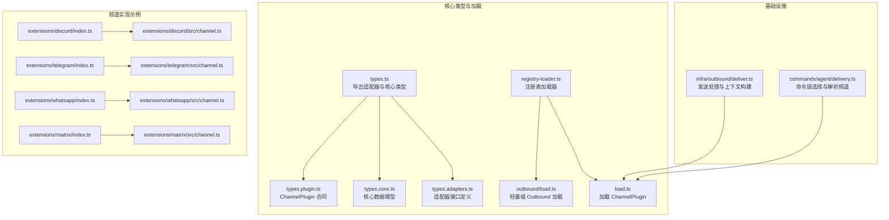
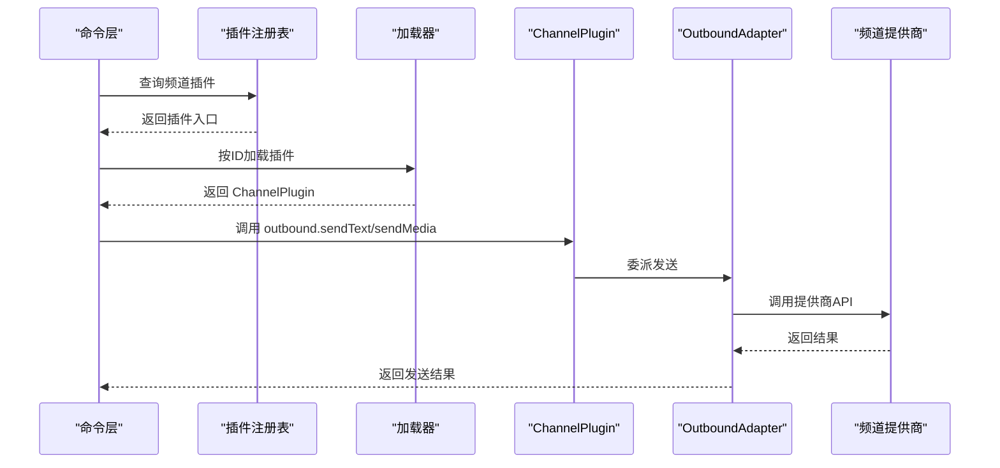
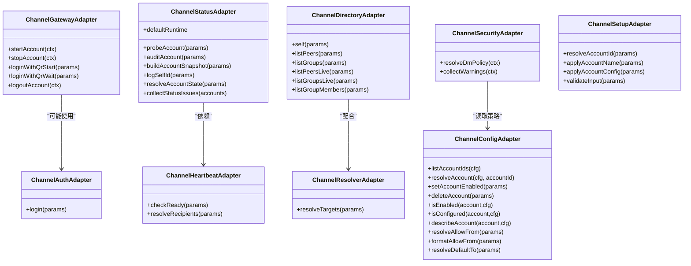
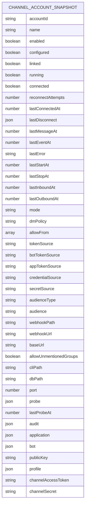
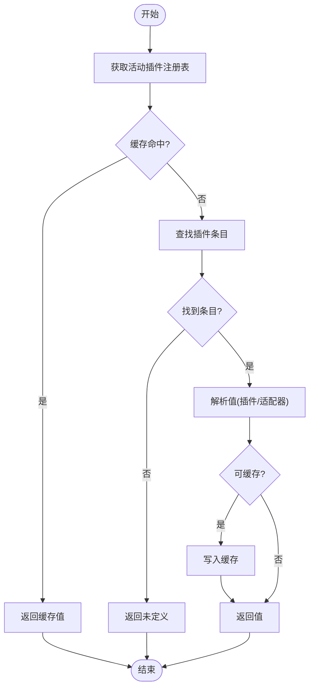
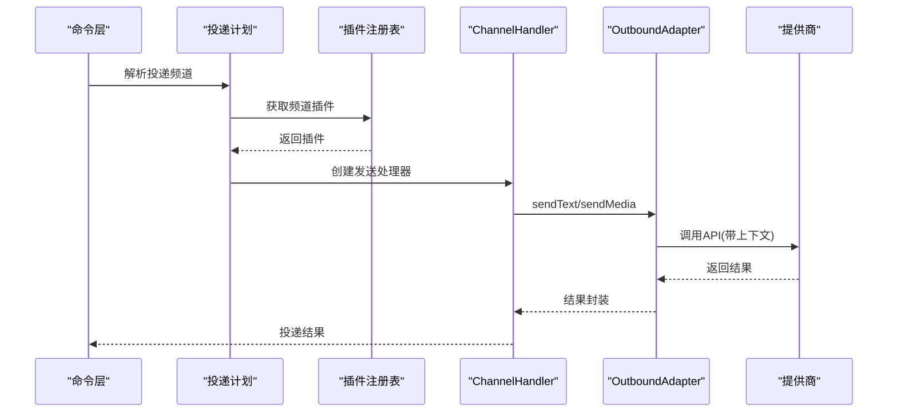
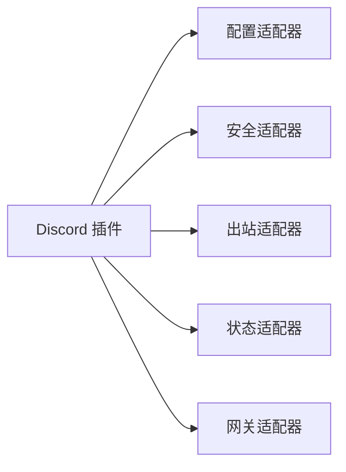
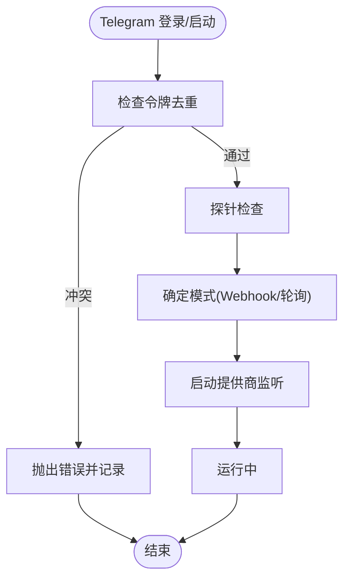
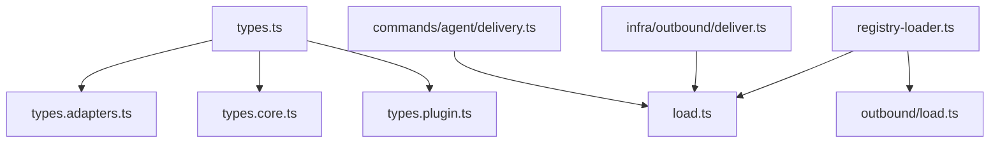

# 频道插件实现

<cite>
**本文档引用的文件**
- [src/channels/plugins/types.ts](file://src/channels/plugins/types.ts)
- [src/channels/plugins/types.adapters.ts](file://src/channels/plugins/types.adapters.ts)
- [src/channels/plugins/types.core.ts](file://src/channels/plugins/types.core.ts)
- [src/channels/plugins/types.plugin.ts](file://src/channels/plugins/types.plugin.ts)
- [src/channels/plugins/registry-loader.ts](file://src/channels/plugins/registry-loader.ts)
- [src/channels/plugins/load.ts](file://src/channels/plugins/load.ts)
- [src/channels/plugins/outbound/load.ts](file://src/channels/plugins/outbound/load.ts)
- [src/infra/outbound/deliver.ts](file://src/infra/outbound/deliver.ts)
- [src/commands/agent/delivery.ts](file://src/commands/agent/delivery.ts)
- [extensions/discord/index.ts](file://extensions/discord/index.ts)
- [extensions/discord/src/channel.ts](file://extensions/discord/src/channel.ts)
- [extensions/telegram/index.ts](file://extensions/telegram/index.ts)
- [extensions/telegram/src/channel.ts](file://extensions/telegram/src/channel.ts)
- [extensions/whatsapp/index.ts](file://extensions/whatsapp/index.ts)
- [extensions/whatsapp/src/channel.ts](file://extensions/whatsapp/src/channel.ts)
- [extensions/matrix/index.ts](file://extensions/matrix/index.ts)
- [extensions/matrix/src/channel.ts](file://extensions/matrix/src/channel.ts)
</cite>

## 目录

1. [简介](#简介)
2. [项目结构](#项目结构)
3. [核心组件](#核心组件)
4. [架构总览](#架构总览)
5. [详细组件分析](#详细组件分析)
6. [依赖关系分析](#依赖关系分析)
7. [性能考虑](#性能考虑)
8. [故障排除指南](#故障排除指南)
9. [结论](#结论)
10. [附录](#附录)

## 简介

本文件系统性阐述 OpenClaw 频道插件实现，聚焦频道适配器的架构设计、消息路由机制与状态管理；详解频道特定 API 集成、认证流程与连接管理；阐明消息转换器、数据序列化与协议适配；并覆盖配置选项、性能优化与资源管理、调试工具、监控指标与故障排除方法，以及扩展点、自定义功能与第三方集成能力。

## 项目结构

OpenClaw 将“频道插件”作为可插拔模块，通过统一的 ChannelPlugin 接口对接不同即时通讯平台（如 Discord、Telegram、WhatsApp、Matrix 等）。核心类型与加载机制位于 src/channels/plugins 下，具体频道实现位于 extensions/<channel>/index.ts 与 extensions/<channel>/src/channel.ts。

**图表来源**

- [src/channels/plugins/types.ts](file://src/channels/plugins/types.ts#L1-L66)
- [src/channels/plugins/types.adapters.ts](file://src/channels/plugins/types.adapters.ts#L1-L320)
- [src/channels/plugins/types.core.ts](file://src/channels/plugins/types.core.ts#L1-L372)
- [src/channels/plugins/types.plugin.ts](file://src/channels/plugins/types.plugin.ts#L1-L86)
- [src/channels/plugins/registry-loader.ts](file://src/channels/plugins/registry-loader.ts#L1-L36)
- [src/channels/plugins/load.ts](file://src/channels/plugins/load.ts#L1-L9)
- [src/channels/plugins/outbound/load.ts](file://src/channels/plugins/outbound/load.ts#L1-L17)
- [src/infra/outbound/deliver.ts](file://src/infra/outbound/deliver.ts#L133-L178)
- [src/commands/agent/delivery.ts](file://src/commands/agent/delivery.ts#L96-L117)
- [extensions/discord/index.ts](file://extensions/discord/index.ts#L1-L20)
- [extensions/discord/src/channel.ts](file://extensions/discord/src/channel.ts#L1-L452)
- [extensions/telegram/index.ts](file://extensions/telegram/index.ts#L1-L18)
- [extensions/telegram/src/channel.ts](file://extensions/telegram/src/channel.ts#L1-L570)
- [extensions/whatsapp/index.ts](file://extensions/whatsapp/index.ts#L1-L18)
- [extensions/whatsapp/src/channel.ts](file://extensions/whatsapp/src/channel.ts#L1-L200)
- [extensions/matrix/index.ts](file://extensions/matrix/index.ts#L1-L18)
- [extensions/matrix/src/channel.ts](file://extensions/matrix/src/channel.ts#L1-L200)

**章节来源**

- [src/channels/plugins/types.ts](file://src/channels/plugins/types.ts#L1-L66)
- [src/channels/plugins/types.adapters.ts](file://src/channels/plugins/types.adapters.ts#L1-L320)
- [src/channels/plugins/types.core.ts](file://src/channels/plugins/types.core.ts#L1-L372)
- [src/channels/plugins/types.plugin.ts](file://src/channels/plugins/types.plugin.ts#L1-L86)
- [src/channels/plugins/registry-loader.ts](file://src/channels/plugins/registry-loader.ts#L1-L36)
- [src/channels/plugins/load.ts](file://src/channels/plugins/load.ts#L1-L9)
- [src/channels/plugins/outbound/load.ts](file://src/channels/plugins/outbound/load.ts#L1-L17)
- [src/infra/outbound/deliver.ts](file://src/infra/outbound/deliver.ts#L133-L178)
- [src/commands/agent/delivery.ts](file://src/commands/agent/delivery.ts#L96-L117)

## 核心组件

- 适配器接口族：认证、网关、状态、目录、解析器、安全、命令、心跳等，统一抽象不同频道差异。
- 核心数据模型：账户快照、能力集、线程上下文、消息动作、轮询上下文等。
- 插件契约：ChannelPlugin 定义频道实现必须提供的能力集合与生命周期钩子。
- 注册表加载器：从活动插件注册表中按频道 ID 解析并缓存插件实例或适配器。
- 发送处理：基于 OutboundAdapter 的文本/媒体/投票发送与分块策略，支持 payload 自定义发送。

**章节来源**

- [src/channels/plugins/types.adapters.ts](file://src/channels/plugins/types.adapters.ts#L23-L320)
- [src/channels/plugins/types.core.ts](file://src/channels/plugins/types.core.ts#L76-L372)
- [src/channels/plugins/types.plugin.ts](file://src/channels/plugins/types.plugin.ts#L49-L86)
- [src/channels/plugins/registry-loader.ts](file://src/channels/plugins/registry-loader.ts#L9-L35)
- [src/infra/outbound/deliver.ts](file://src/infra/outbound/deliver.ts#L133-L178)

## 架构总览

OpenClaw 采用“插件化频道适配器 + 统一基础设施”的架构。命令层根据目标通道解析到具体频道插件，插件通过 OutboundAdapter 执行发送；网关适配器负责长连接/监听；状态适配器负责探针、审计与快照生成；安全适配器负责 DM 策略与警告收集；解析器与目录适配器负责用户/群组解析与发现。

**图表来源**

- [src/commands/agent/delivery.ts](file://src/commands/agent/delivery.ts#L96-L117)
- [src/channels/plugins/load.ts](file://src/channels/plugins/load.ts#L6-L8)
- [src/channels/plugins/types.adapters.ts](file://src/channels/plugins/types.adapters.ts#L106-L123)
- [extensions/discord/src/channel.ts](file://extensions/discord/src/channel.ts#L299-L341)
- [extensions/telegram/src/channel.ts](file://extensions/telegram/src/channel.ts#L317-L368)

## 详细组件分析

### 适配器接口与职责

- 认证适配器：提供登录入口（含二维码登录）。
- 网关适配器：启动/停止账户监听，支持二维码登录等待。
- 状态适配器：默认运行时快照、探针、审计、构建账户快照、日志记录、状态解析。
- 目录适配器：自描述、列出成员/群组、实时查询。
- 解析器适配器：将输入解析为用户/群组 ID。
- 安全适配器：DM 策略解析、警告收集。
- 心跳适配器：就绪检查、收件人解析。
- 配置/设置适配器：账户列表、解析、启用/删除、校验输入、应用配置。

**图表来源**

- [src/channels/plugins/types.adapters.ts](file://src/channels/plugins/types.adapters.ts#L23-L320)

**章节来源**

- [src/channels/plugins/types.adapters.ts](file://src/channels/plugins/types.adapters.ts#L23-L320)

### 核心数据模型

- ChannelAccountSnapshot：账户运行时状态（启用/配置/运行/连接/错误/探针/审计/令牌来源等）。
- ChannelCapabilities：频道能力清单（聊天类型、投票、反应、编辑、取消发送、回复、效果、群组管理、线程、媒体、原生命令、阻断流式输出）。
- ChannelThreadingContext/ToolContext：线程上下文与工具上下文，支持回复模式与跨上下文装饰控制。
- ChannelMessageActionContext：消息动作上下文（动作名、参数、请求者、网关信息、工具上下文等）。
- ChannelPollContext/PollResult：轮询发送上下文与结果。

**图表来源**

- [src/channels/plugins/types.core.ts](file://src/channels/plugins/types.core.ts#L97-L149)

**章节来源**

- [src/channels/plugins/types.core.ts](file://src/channels/plugins/types.core.ts#L76-L372)

### 插件契约与加载机制

- ChannelPlugin：统一合同，定义频道元信息、能力、配置、设置、配对、安全、群组、提及、出站、状态、网关、认证、提升、命令、流式、线程、消息、代理提示、目录、解析、消息动作、心跳、代理工具等。
- 注册表加载器：按频道 ID 从活动插件注册表中查找并缓存插件或适配器，避免重复解析。
- 轻量级 Outbound 加载：仅导入发送所需最小依赖，降低开销。
- 发送处理器：在命令层调用时，基于 ChannelHandlerParams 创建适配器句柄，注入上下文并委派发送。

**图表来源**

- [src/channels/plugins/registry-loader.ts](file://src/channels/plugins/registry-loader.ts#L15-L35)
- [src/channels/plugins/load.ts](file://src/channels/plugins/load.ts#L6-L8)
- [src/channels/plugins/outbound/load.ts](file://src/channels/plugins/outbound/load.ts#L13-L17)

**章节来源**

- [src/channels/plugins/types.plugin.ts](file://src/channels/plugins/types.plugin.ts#L49-L86)
- [src/channels/plugins/registry-loader.ts](file://src/channels/plugins/registry-loader.ts#L1-L36)
- [src/channels/plugins/load.ts](file://src/channels/plugins/load.ts#L1-L9)
- [src/channels/plugins/outbound/load.ts](file://src/channels/plugins/outbound/load.ts#L1-L17)
- [src/infra/outbound/deliver.ts](file://src/infra/outbound/deliver.ts#L133-L178)

### 消息路由与发送处理

- 命令层选择频道：根据显式/隐式通道提示解析最终投递频道，并通过插件注册表获取对应插件。
- 发送处理器：创建 ChannelOutboundContext 基础上下文，合并 replyToId/threadId 等，委派给 OutboundAdapter 的 sendText/sendMedia/sendPayload/sendPoll。
- 分块与限制：不同频道设置不同的文本分块器与限制，确保符合提供商 API 限制。

**图表来源**

- [src/commands/agent/delivery.ts](file://src/commands/agent/delivery.ts#L96-L117)
- [src/infra/outbound/deliver.ts](file://src/infra/outbound/deliver.ts#L133-L178)
- [extensions/discord/src/channel.ts](file://extensions/discord/src/channel.ts#L299-L341)
- [extensions/telegram/src/channel.ts](file://extensions/telegram/src/channel.ts#L317-L368)

**章节来源**

- [src/commands/agent/delivery.ts](file://src/commands/agent/delivery.ts#L96-L117)
- [src/infra/outbound/deliver.ts](file://src/infra/outbound/deliver.ts#L133-L178)

### 频道特定实现示例

#### Discord 插件

- 元信息与能力：支持 direct/channel/thread、投票、反应、线程、媒体、原生命令。
- 配置与安全：令牌来源、DM 策略、允许来源、默认收件人解析。
- 出站：直接发送文本/媒体/投票，支持回复与静默发送。
- 状态：探针（应用/机器人）、审计（权限检查）、构建快照。
- 网关：启动提供商监听，记录消息内容意图状态。

**图表来源**

- [extensions/discord/src/channel.ts](file://extensions/discord/src/channel.ts#L51-L452)

**章节来源**

- [extensions/discord/src/channel.ts](file://extensions/discord/src/channel.ts#L51-L452)

#### Telegram 插件

- 元信息与能力：支持 direct/group/channel/thread、反应、线程、媒体、投票、原生命令、阻断流式输出。
- 配置与安全：令牌去重检测、DM 策略、允许来源格式化、默认收件人解析。
- 出站：Markdown 文本分块、媒体发送、投票（匿名可选）、线程与回复解析。
- 状态：探针（代理支持）、审计（群组成员）、构建快照（模式、未提及群组标记）。
- 网关：启动提供商监听，支持 Webhook 或轮询模式，登出清理令牌。

**图表来源**

- [extensions/telegram/src/channel.ts](file://extensions/telegram/src/channel.ts#L39-L61)
- [extensions/telegram/src/channel.ts](file://extensions/telegram/src/channel.ts#L453-L500)
- [extensions/telegram/src/channel.ts](file://extensions/telegram/src/channel.ts#L500-L568)

**章节来源**

- [extensions/telegram/src/channel.ts](file://extensions/telegram/src/channel.ts#L87-L570)

#### WhatsApp/MatriX 插件

- WhatsApp：通过插件入口注册 ChannelPlugin，实现消息发送与状态管理。
- Matrix：通过插件入口注册 ChannelPlugin，实现消息发送与状态管理。

**章节来源**

- [extensions/whatsapp/index.ts](file://extensions/whatsapp/index.ts#L1-L18)
- [extensions/whatsapp/src/channel.ts](file://extensions/whatsapp/src/channel.ts#L1-L200)
- [extensions/matrix/index.ts](file://extensions/matrix/index.ts#L1-L18)
- [extensions/matrix/src/channel.ts](file://extensions/matrix/src/channel.ts#L1-L200)

## 依赖关系分析

- 类型耦合：types.ts 汇总导出适配器与核心类型，types.adapters.ts/types.core.ts/types.plugin.ts 定义接口与数据模型。
- 运行时耦合：registry-loader.ts 依赖插件注册表；load.ts/outbound/load.ts 依赖 registry-loader.ts；deliver.ts 依赖 OutboundAdapter。
- 命令层耦合：commands/agent/delivery.ts 依赖 getChannelPlugin 与插件注册表。

**图表来源**

- [src/channels/plugins/types.ts](file://src/channels/plugins/types.ts#L1-L66)
- [src/channels/plugins/registry-loader.ts](file://src/channels/plugins/registry-loader.ts#L1-L36)
- [src/channels/plugins/load.ts](file://src/channels/plugins/load.ts#L1-L9)
- [src/channels/plugins/outbound/load.ts](file://src/channels/plugins/outbound/load.ts#L1-L17)
- [src/infra/outbound/deliver.ts](file://src/infra/outbound/deliver.ts#L133-L178)
- [src/commands/agent/delivery.ts](file://src/commands/agent/delivery.ts#L96-L117)

**章节来源**

- [src/channels/plugins/types.ts](file://src/channels/plugins/types.ts#L1-L66)
- [src/channels/plugins/registry-loader.ts](file://src/channels/plugins/registry-loader.ts#L1-L36)
- [src/channels/plugins/load.ts](file://src/channels/plugins/load.ts#L1-L9)
- [src/channels/plugins/outbound/load.ts](file://src/channels/plugins/outbound/load.ts#L1-L17)
- [src/infra/outbound/deliver.ts](file://src/infra/outbound/deliver.ts#L133-L178)
- [src/commands/agent/delivery.ts](file://src/commands/agent/delivery.ts#L96-L117)

## 性能考虑

- 分块策略：不同频道设置不同的文本分块器与限制，避免超限失败与重试风暴。
- 缓存与懒加载：注册表加载器内置缓存，避免重复解析；轻量级 Outbound 加载仅引入必要依赖。
- 并发与队列：ChannelPlugin.defaults.queue.debounceMs 可用于节流；命令前摄取与预检可减少无效调用。
- 资源管理：网关启动/停止严格绑定 AbortSignal；探针/审计设置合理超时，避免阻塞。
- 序列化与协议：OutboundAdapter 支持 sendPayload 自定义负载，便于协议适配与压缩。

[本节为通用指导，无需特定文件来源]

## 故障排除指南

- 配置问题：使用 ChannelStatusAdapter.collectStatusIssues 收集问题；通过 describeAccount/unconfiguredReason 提供明确原因。
- 权限与意图：Discord 网关适配器记录消息内容意图状态；Telegram 网关适配器记录模式（Webhook/轮询）。
- 登出清理：Telegram 网关适配器提供 logoutAccount 清理令牌与账户条目。
- 探针与审计：status.probeAccount/status.auditAccount 提供诊断依据；buildAccountSnapshot 合并运行时与诊断结果。
- 日志：ChannelLogSink 提供 info/warn/error/debug 输出，便于定位问题。

**章节来源**

- [extensions/discord/src/channel.ts](file://extensions/discord/src/channel.ts#L406-L451)
- [extensions/telegram/src/channel.ts](file://extensions/telegram/src/channel.ts#L453-L568)
- [src/channels/plugins/types.core.ts](file://src/channels/plugins/types.core.ts#L151-L156)

## 结论

OpenClaw 频道插件体系通过统一的 ChannelPlugin 合同与适配器接口，将多平台差异抽象为一致的发送、状态、安全与网关体验。借助注册表加载器与轻量级 Outbound 加载，系统在保证扩展性的同时兼顾性能与可维护性。通过完善的诊断与日志机制，开发者可以快速定位并解决频道集成中的常见问题。

[本节为总结，无需特定文件来源]

## 附录

### 配置选项与扩展点

- ChannelPlugin.configSchema：定义频道配置 Schema 与 UI 提示。
- ChannelPlugin.setup：账户 ID 解析、名称应用、输入校验、配置应用。
- ChannelPlugin.pairing：配对标识、允许来源归一化、批准通知。
- ChannelPlugin.security：DM 策略解析、警告收集。
- ChannelPlugin.streaming：流式输出合并默认策略。
- ChannelPlugin.threading：回复模式解析、工具上下文构建。
- ChannelPlugin.messaging：目标归一化、解析器提示。
- ChannelPlugin.directory/resolver/actions/heartbeat：目录与解析、消息动作、心跳。
- ChannelPlugin.agentTools：频道专属代理工具（登录流程等）。

**章节来源**

- [src/channels/plugins/types.plugin.ts](file://src/channels/plugins/types.plugin.ts#L49-L86)
- [extensions/discord/src/channel.ts](file://extensions/discord/src/channel.ts#L51-L452)
- [extensions/telegram/src/channel.ts](file://extensions/telegram/src/channel.ts#L87-L570)

### 第三方集成与插件入口

- 插件入口通过 openclaw.plugin.json 与 index.ts 注册，调用 api.registerChannel 注册 ChannelPlugin。
- 典型实现：Discord、Telegram、WhatsApp、Matrix 等均遵循相同模式。

**章节来源**

- [extensions/discord/index.ts](file://extensions/discord/index.ts#L1-L20)
- [extensions/telegram/index.ts](file://extensions/telegram/index.ts#L1-L18)
- [extensions/whatsapp/index.ts](file://extensions/whatsapp/index.ts#L1-L18)
- [extensions/matrix/index.ts](file://extensions/matrix/index.ts#L1-L18)
