# Discord频道实现

<cite>
**本文档引用的文件**
- [extensions/discord/index.ts](file://extensions/discord/index.ts)
- [extensions/discord/src/channel.ts](file://extensions/discord/src/channel.ts)
- [src/discord/client.ts](file://src/discord/client.ts)
- [src/discord/monitor/provider.ts](file://src/discord/monitor/provider.ts)
- [src/discord/monitor/message-handler.ts](file://src/discord/monitor/message-handler.ts)
- [src/discord/send.outbound.ts](file://src/discord/send.outbound.ts)
- [src/discord/send.permissions.ts](file://src/discord/send.permissions.ts)
- [src/discord/token.ts](file://src/discord/token.ts)
- [src/discord/guilds.ts](file://src/discord/guilds.ts)
</cite>

## 目录

1. [简介](#简介)
2. [项目结构](#项目结构)
3. [核心组件](#核心组件)
4. [架构概览](#架构概览)
5. [详细组件分析](#详细组件分析)
6. [依赖关系分析](#依赖关系分析)
7. [性能考虑](#性能考虑)
8. [故障排除指南](#故障排除指南)
9. [结论](#结论)

## 简介

本文件详细阐述了OpenClaw项目中Discord频道的实现架构与工作机制。该实现基于Carbon框架构建，提供了完整的Discord API集成功能，包括Bot令牌认证、WebSocket连接、实时消息处理、权限管理、频道角色管理以及消息转发等核心能力。

系统采用模块化设计，通过插件架构实现了与OpenClaw主框架的无缝集成，支持多账户管理、动态配置更新和运行时监控。

## 项目结构

OpenClaw的Discord实现主要分布在两个关键目录中：

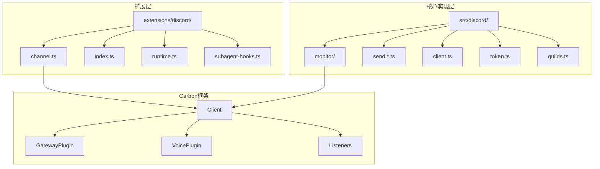

**图表来源**

- [extensions/discord/src/channel.ts](file://extensions/discord/src/channel.ts#L1-L452)
- [src/discord/monitor/provider.ts](file://src/discord/monitor/provider.ts#L1-L687)

**章节来源**

- [extensions/discord/index.ts](file://extensions/discord/index.ts#L1-L20)
- [extensions/discord/src/channel.ts](file://extensions/discord/src/channel.ts#L1-L452)

## 核心组件

### 插件注册与初始化

Discord插件通过标准OpenClaw插件接口进行注册，实现了自动化的运行时配置和生命周期管理。

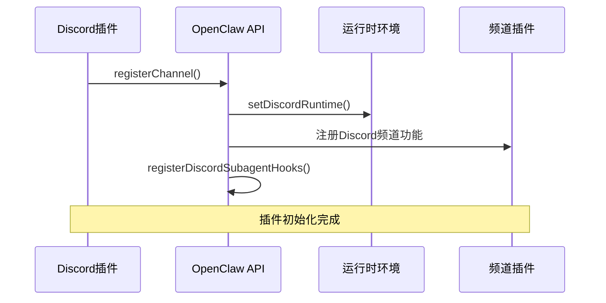

**图表来源**

- [extensions/discord/index.ts](file://extensions/discord/index.ts#L12-L16)
- [extensions/discord/src/channel.ts](file://extensions/discord/src/channel.ts#L51-L74)

### 认证与令牌管理

系统支持多种令牌来源，包括配置文件、环境变量和直接参数传递，确保灵活的部署选项。

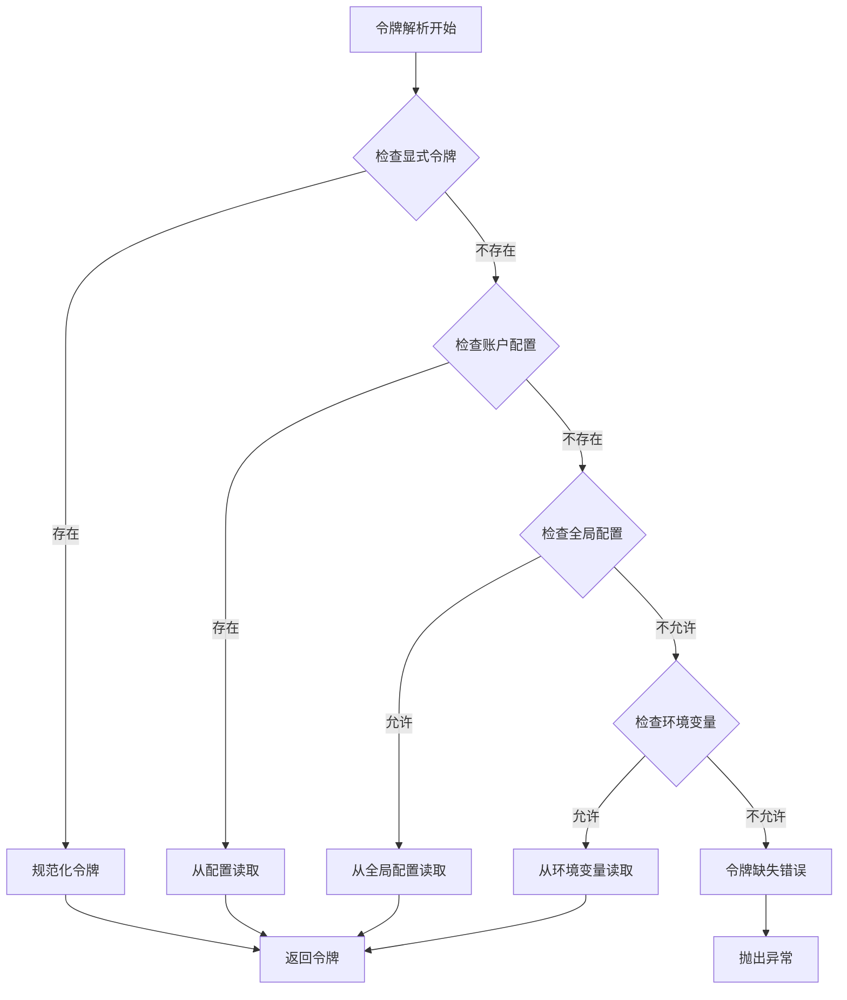

**图表来源**

- [src/discord/token.ts](file://src/discord/token.ts#L22-L51)

**章节来源**

- [src/discord/token.ts](file://src/discord/token.ts#L1-L52)
- [src/discord/client.ts](file://src/discord/client.ts#L1-L61)

## 架构概览

### 整体系统架构

OpenClaw的Discord实现采用分层架构设计，各层职责明确，耦合度低：

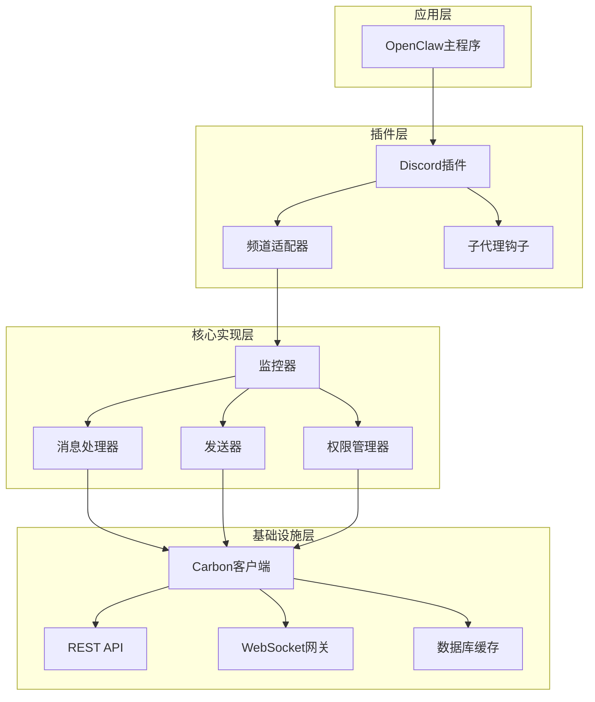

**图表来源**

- [src/discord/monitor/provider.ts](file://src/discord/monitor/provider.ts#L512-L534)
- [extensions/discord/src/channel.ts](file://extensions/discord/src/channel.ts#L51-L74)

### WebSocket连接与实时通信

系统使用Carbon框架的GatewayPlugin实现与Discord的WebSocket连接，支持实时消息接收和状态更新。

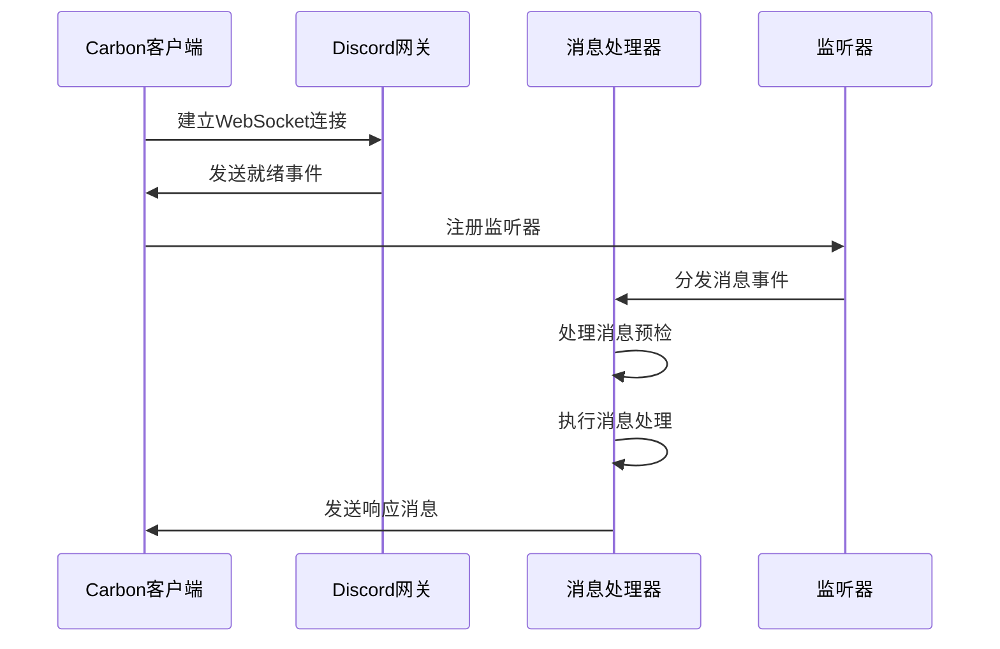

**图表来源**

- [src/discord/monitor/provider.ts](file://src/discord/monitor/provider.ts#L518-L534)
- [src/discord/monitor/message-handler.ts](file://src/discord/monitor/message-handler.ts#L24-L144)

## 详细组件分析

### 监控器组件

监控器是Discord集成的核心组件，负责管理整个连接生命周期和消息处理流程。

#### 关键特性

1. **多账户支持**: 支持同时管理多个Discord账户
2. **动态配置**: 支持运行时配置更新和热重载
3. **错误恢复**: 具备自动重连和错误处理机制
4. **性能监控**: 内置性能指标收集和报告

#### 生命周期管理

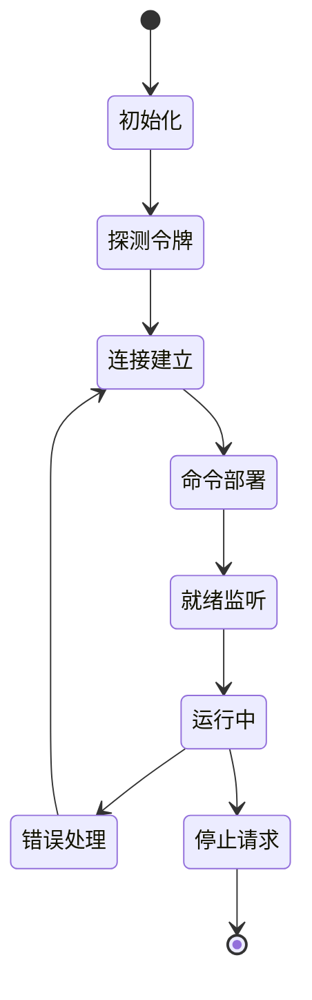

**图表来源**

- [src/discord/monitor/provider.ts](file://src/discord/monitor/provider.ts#L249-L662)

**章节来源**

- [src/discord/monitor/provider.ts](file://src/discord/monitor/provider.ts#L1-L687)

### 消息处理机制

系统实现了智能的消息处理管道，包括预检、去重、批处理和最终处理四个阶段。

#### 消息处理流水线

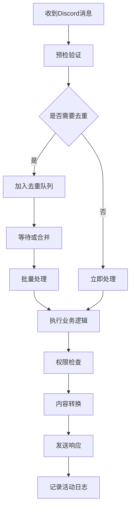

**图表来源**

- [src/discord/monitor/message-handler.ts](file://src/discord/monitor/message-handler.ts#L35-L134)

#### 权限管理实现

系统提供了完整的权限检查机制，支持管理员权限检测和细粒度权限验证。

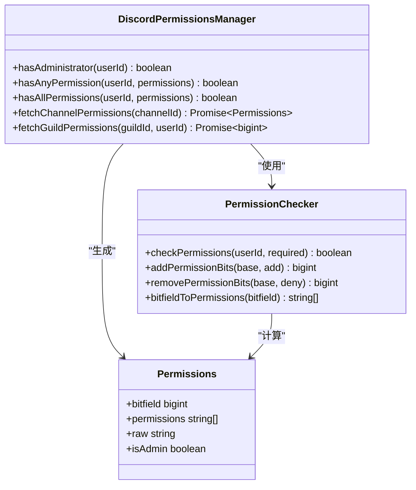

**图表来源**

- [src/discord/send.permissions.ts](file://src/discord/send.permissions.ts#L94-L147)

**章节来源**

- [src/discord/send.permissions.ts](file://src/discord/send.permissions.ts#L1-L233)

### 发送器组件

发送器负责处理各种类型的Discord消息发送操作，包括普通文本、媒体、投票和语音消息。

#### 支持的消息类型

| 消息类型    | 功能描述       | 特殊属性           |
| ----------- | -------------- | ------------------ |
| 文本消息    | 基础文本回复   | 支持组件、嵌入     |
| 媒体消息    | 图片、视频上传 | 自动分块处理       |
| 投票消息    | 创建交互式投票 | 时间限制、选项数量 |
| 语音消息    | 语音波形可视化 | OGG/Opus格式       |
| Webhook消息 | 无权限要求发送 | 线程支持           |

#### 发送流程

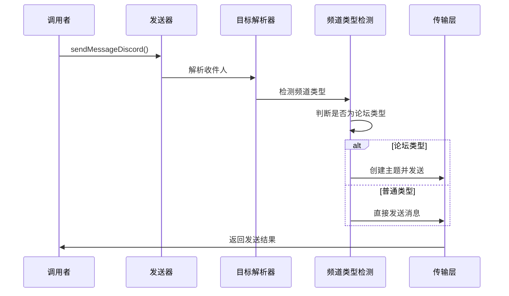

**图表来源**

- [src/discord/send.outbound.ts](file://src/discord/send.outbound.ts#L129-L305)

**章节来源**

- [src/discord/send.outbound.ts](file://src/discord/send.outbound.ts#L1-L561)

### 频道角色管理

系统提供了完整的服务器权限和频道权限管理功能，支持动态权限检查和权限审计。

#### 权限检查流程

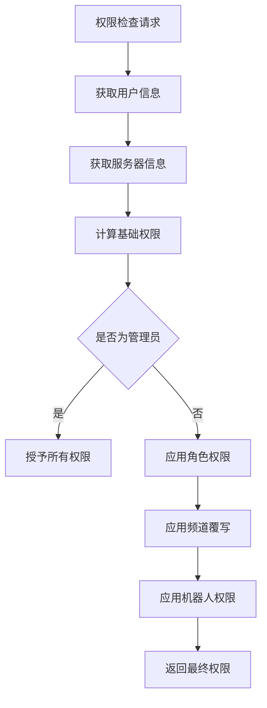

**图表来源**

- [src/discord/send.permissions.ts](file://src/discord/send.permissions.ts#L154-L232)

**章节来源**

- [src/discord/guilds.ts](file://src/discord/guilds.ts#L1-L30)

## 依赖关系分析

### 外部依赖

系统依赖于多个关键库和服务：

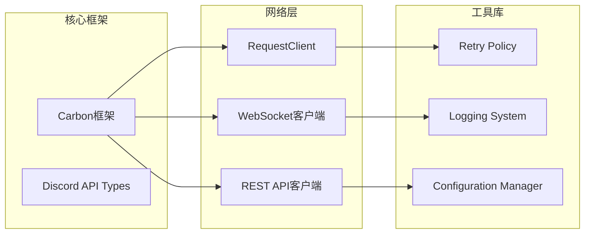

**图表来源**

- [src/discord/client.ts](file://src/discord/client.ts#L1-L61)
- [src/discord/monitor/provider.ts](file://src/discord/monitor/provider.ts#L1-L100)

### 内部模块依赖

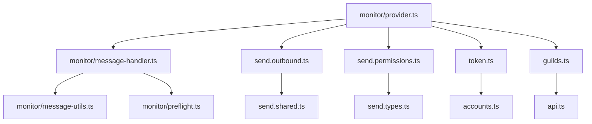

**图表来源**

- [src/discord/monitor/provider.ts](file://src/discord/monitor/provider.ts#L63-L80)

**章节来源**

- [src/discord/client.ts](file://src/discord/client.ts#L1-L61)
- [src/discord/monitor/provider.ts](file://src/discord/monitor/provider.ts#L1-L687)

## 性能考虑

### 连接池管理

系统实现了智能的连接池管理，优化了资源利用率和响应时间。

### 缓存策略

- **权限缓存**: 缓存用户权限信息减少API调用
- **频道信息缓存**: 缓存频道元数据避免重复查询
- **令牌缓存**: 缓存有效的令牌以提高启动速度

### 错误处理与重试

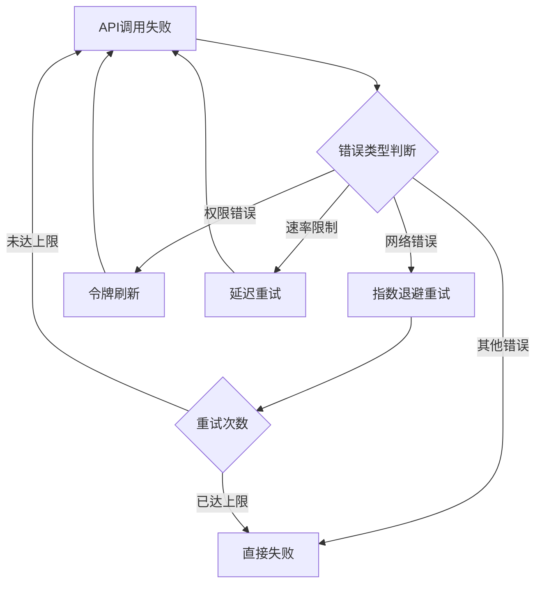

**图表来源**

- [src/discord/client.ts](file://src/discord/client.ts#L50-L55)

## 故障排除指南

### 常见问题诊断

| 问题类型 | 症状          | 可能原因        | 解决方案                 |
| -------- | ------------- | --------------- | ------------------------ |
| 认证失败 | 401/403错误   | 令牌无效或过期  | 检查令牌配置和有效期     |
| 连接中断 | WebSocket断开 | 网络不稳定      | 检查防火墙和代理设置     |
| 权限不足 | 操作被拒绝    | 缺少必要权限    | 检查机器人权限和覆写规则 |
| 速率限制 | 429错误       | API调用过于频繁 | 实现退避策略和缓存       |

### 日志分析

系统提供了详细的日志记录机制，支持不同级别的调试信息输出。

**章节来源**

- [src/discord/monitor/provider.ts](file://src/discord/monitor/provider.ts#L241-L247)

## 结论

OpenClaw的Discord频道实现展现了现代聊天平台集成的最佳实践。通过模块化设计、完善的错误处理机制和灵活的配置选项，该实现能够满足各种复杂的Discord集成需求。

系统的主要优势包括：

1. **高度模块化**: 清晰的组件分离和职责划分
2. **强大的扩展性**: 插件架构支持功能扩展和定制
3. **完善的监控**: 全面的运行时监控和诊断能力
4. **优秀的性能**: 智能缓存和连接管理优化
5. **健壮的错误处理**: 完善的错误恢复和重试机制

该实现为开发者提供了一个坚实的基础，可以在此基础上构建更复杂的功能和集成场景。
