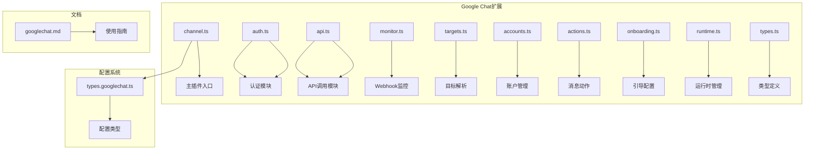
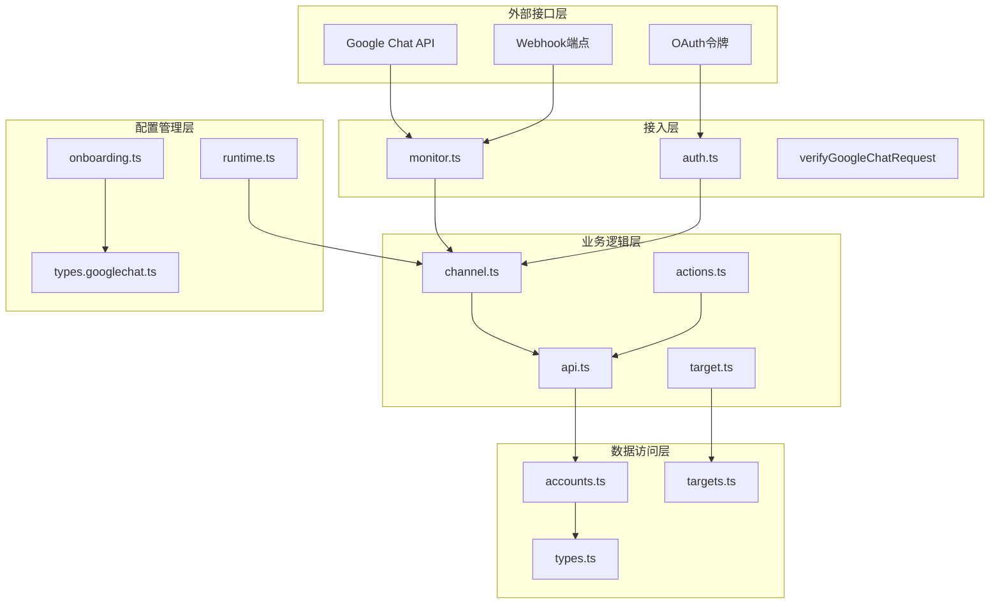
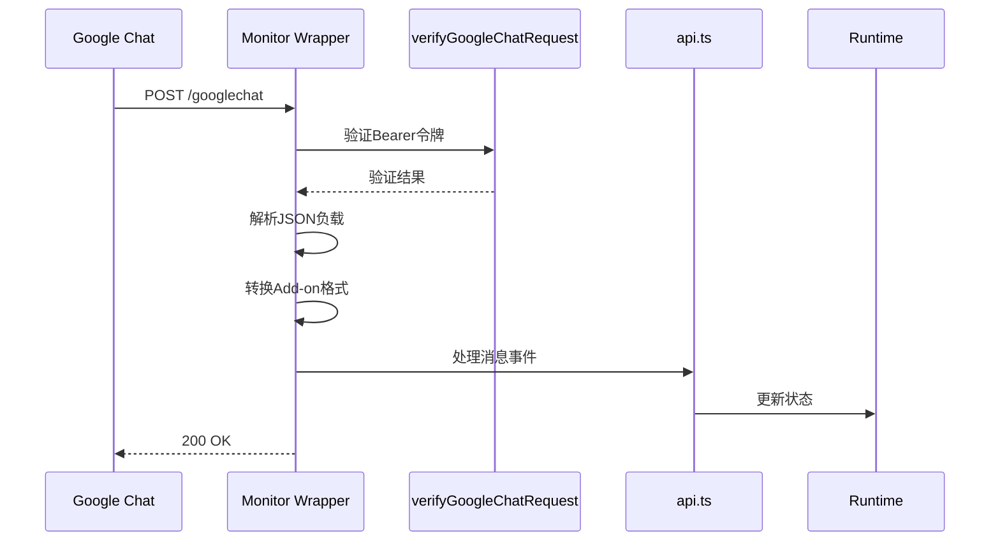
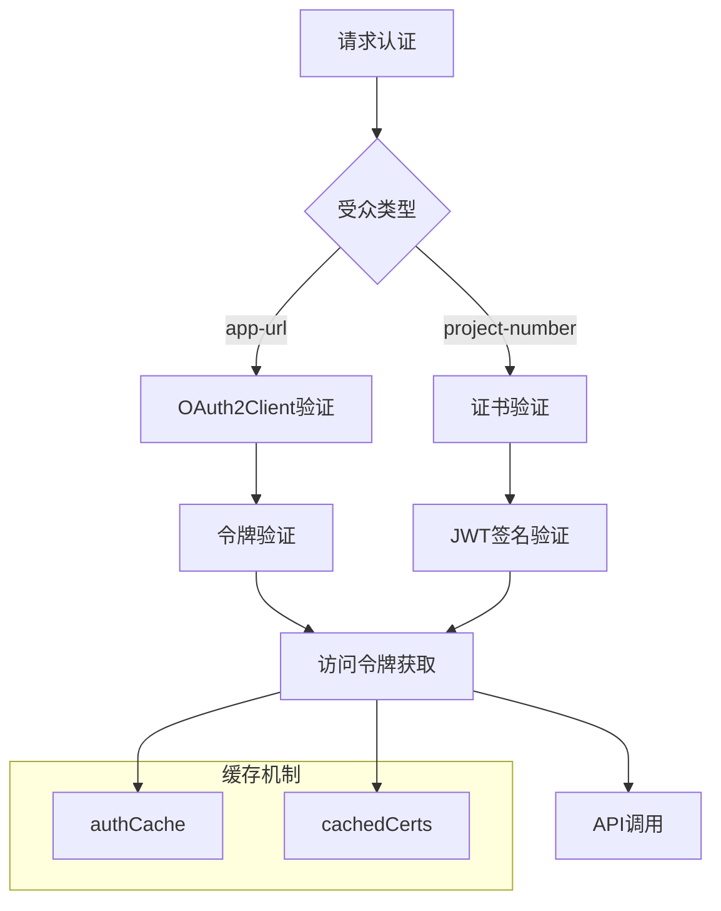
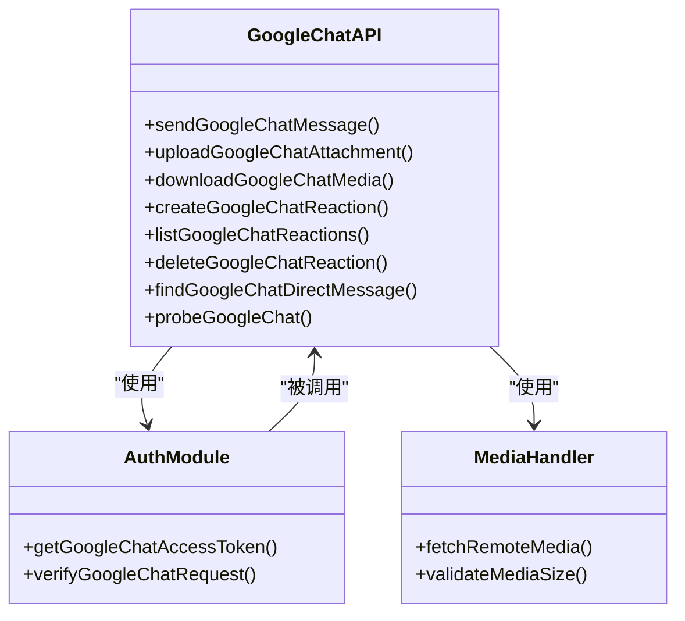
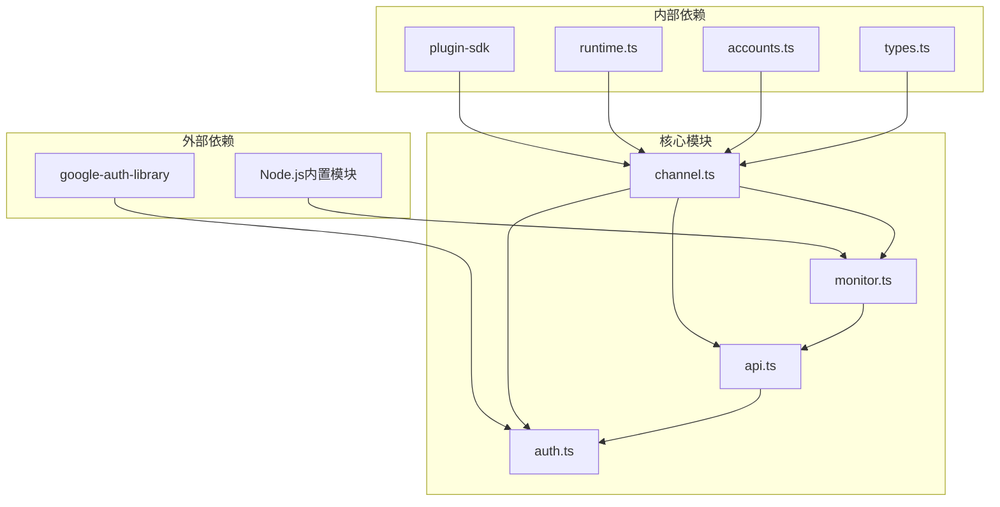

# Google Chat频道实现

<cite>
**本文档引用的文件**
- [extensions/googlechat/src/channel.ts](file://extensions/googlechat/src/channel.ts)
- [extensions/googlechat/src/auth.ts](file://extensions/googlechat/src/auth.ts)
- [extensions/googlechat/src/api.ts](file://extensions/googlechat/src/api.ts)
- [extensions/googlechat/src/monitor.ts](file://extensions/googlechat/src/monitor.ts)
- [extensions/googlechat/src/targets.ts](file://extensions/googlechat/src/targets.ts)
- [extensions/googlechat/src/accounts.ts](file://extensions/googlechat/src/accounts.ts)
- [extensions/googlechat/src/actions.ts](file://extensions/googlechat/src/actions.ts)
- [extensions/googlechat/src/onboarding.ts](file://extensions/googlechat/src/onboarding.ts)
- [extensions/googlechat/src/runtime.ts](file://extensions/googlechat/src/runtime.ts)
- [extensions/googlechat/src/types.ts](file://extensions/googlechat/src/types.ts)
- [src/config/types.googlechat.ts](file://src/config/types.googlechat.ts)
- [docs/channels/googlechat.md](file://docs/channels/googlechat.md)
- [extensions/googlechat/package.json](file://extensions/googlechat/package.json)
</cite>

## 目录

1. [简介](#简介)
2. [项目结构](#项目结构)
3. [核心组件](#核心组件)
4. [架构概览](#架构概览)
5. [详细组件分析](#详细组件分析)
6. [依赖关系分析](#依赖关系分析)
7. [性能考虑](#性能考虑)
8. [故障排除指南](#故障排除指南)
9. [结论](#结论)
10. [附录](#附录)

## 简介

Google Chat频道实现是OpenClaw项目中用于集成Google Workspace Chat API的核心模块。该实现提供了完整的Webhook接收、OAuth验证、消息发送和事件处理机制，支持Google Chat特有的消息格式、空间管理和用户权限控制。

本实现基于Google Chat API v1，采用服务账号认证模式，通过HTTPS Webhook接收Google Chat事件，支持直接消息(DM)和群组空间两种通信模式。系统集成了完整的安全机制，包括令牌验证、访问控制列表和配对管理。

## 项目结构

Google Chat频道实现位于扩展目录中，采用模块化设计：



**图表来源**

- [extensions/googlechat/src/channel.ts](file://extensions/googlechat/src/channel.ts#L1-L583)
- [extensions/googlechat/src/auth.ts](file://extensions/googlechat/src/auth.ts#L1-L138)
- [extensions/googlechat/src/api.ts](file://extensions/googlechat/src/api.ts#L1-L283)

**章节来源**

- [extensions/googlechat/src/channel.ts](file://extensions/googlechat/src/channel.ts#L1-L50)
- [extensions/googlechat/package.json](file://extensions/googlechat/package.json#L1-L38)

## 核心组件

### 认证与授权系统

Google Chat频道实现了双重认证机制：

1. **服务账号认证**: 使用Google Cloud服务账号进行API调用
2. **Webhook令牌验证**: 验证来自Google Chat的请求令牌
3. **受众验证**: 支持应用URL和项目编号两种受众类型

### 消息处理管道

系统提供完整的消息生命周期管理：

- **入站消息**: Webhook接收 → 令牌验证 → 消息解析 → 会话路由
- **出站消息**: 内容处理 → API调用 → 响应返回
- **媒体处理**: 远程下载 → 上传 → 附件发送

### 权限控制系统

实现多层次的安全控制：

- **DM策略**: 配对、允许列表、开放三种模式
- **群组策略**: 允许列表、禁用、开放三种模式
- **用户权限**: 基于用户ID和邮箱的访问控制
- **配对管理**: 动态授权机制

**章节来源**

- [extensions/googlechat/src/auth.ts](file://extensions/googlechat/src/auth.ts#L1-L138)
- [extensions/googlechat/src/accounts.ts](file://extensions/googlechat/src/accounts.ts#L1-L148)
- [src/config/types.googlechat.ts](file://src/config/types.googlechat.ts#L1-L121)

## 架构概览

Google Chat频道采用分层架构设计，确保高内聚低耦合：



**图表来源**

- [extensions/googlechat/src/monitor.ts](file://extensions/googlechat/src/monitor.ts#L120-L200)
- [extensions/googlechat/src/auth.ts](file://extensions/googlechat/src/auth.ts#L93-L135)
- [extensions/googlechat/src/channel.ts](file://extensions/googlechat/src/channel.ts#L100-L180)

## 详细组件分析

### Webhook监控器

Webhook监控器负责处理来自Google Chat的HTTP POST请求：



**图表来源**

- [extensions/googlechat/src/monitor.ts](file://extensions/googlechat/src/monitor.ts#L120-L197)
- [extensions/googlechat/src/auth.ts](file://extensions/googlechat/src/auth.ts#L93-L135)

Webhook处理器的关键特性：

1. **多格式支持**: 自动识别标准Chat API和Google Workspace Add-on格式
2. **令牌验证**: 支持两种受众类型的应用URL和项目编号
3. **负载限制**: 1MB请求体大小限制
4. **错误处理**: 完善的错误响应和日志记录

**章节来源**

- [extensions/googlechat/src/monitor.ts](file://extensions/googlechat/src/monitor.ts#L120-L200)

### 认证与授权模块

认证模块实现了灵活的服务账号管理：



**图表来源**

- [extensions/googlechat/src/auth.ts](file://extensions/googlechat/src/auth.ts#L28-L75)
- [extensions/googlechat/src/auth.ts](file://extensions/googlechat/src/auth.ts#L77-L89)

认证流程的关键优化：

- **令牌缓存**: 最大32个条目的认证实例缓存
- **证书缓存**: 10分钟内重复使用证书
- **作用域管理**: 仅请求chat.bot范围权限
- **多源支持**: 文件、内联、环境变量三种凭证来源

**章节来源**

- [extensions/googlechat/src/auth.ts](file://extensions/googlechat/src/auth.ts#L1-L138)

### API调用模块

API调用模块封装了所有Google Chat API操作：



**图表来源**

- [extensions/googlechat/src/api.ts](file://extensions/googlechat/src/api.ts#L110-L137)
- [extensions/googlechat/src/api.ts](file://extensions/googlechat/src/api.ts#L162-L202)

API模块的核心功能：

1. **消息发送**: 支持文本和附件消息
2. **媒体处理**: 远程下载、上传和存储
3. **反应管理**: 创建、列出和删除表情反应
4. **DM查找**: 自动发现用户直聊空间
5. **健康检查**: 连接状态验证

**章节来源**

- [extensions/googlechat/src/api.ts](file://extensions/googlechat/src/api.ts#L1-L283)

### 目标解析系统

目标解析系统处理Google Chat特有的标识符格式：

```mermaid
flowchart LR
A[原始输入] --> B[normalizeGoogleChatTarget]
B --> C{检测前缀}
C --> |googlechat:| D[移除前缀]
C --> |users/| E[用户ID]
C --> |spaces/| F[空间ID]
C --> |无前缀| G[自动检测]
G --> |@包含| H[邮箱地址]
G --> |其他| I[原始ID]
E --> J[标准化用户ID]
F --> K[标准化空间ID]
H --> L[转换为users/邮箱]
I --> M[保持原样]
J --> N[最终输出]
K --> N
L --> N
M --> N
```

**图表来源**

- [extensions/googlechat/src/targets.ts](file://extensions/googlechat/src/targets.ts#L4-L24)

目标解析的关键特性：

- **多格式支持**: 支持多种输入格式
- **自动标准化**: 统一用户ID和空间ID格式
- **邮箱处理**: 将邮箱转换为用户ID
- **DM解析**: 自动查找用户直聊空间

**章节来源**

- [extensions/googlechat/src/targets.ts](file://extensions/googlechat/src/targets.ts#L1-L66)

### 配置管理系统

配置系统提供了灵活的多账户支持：

```mermaid
graph TB
subgraph "配置层次"
A[基础配置] --> B[账户特定配置]
B --> C[默认账户]
C --> D[多账户支持]
end
subgraph "凭证来源"
E[服务账号文件] --> F[JSON文件路径]
G[内联服务账号] --> H[JSON字符串]
I[环境变量] --> J[GOOGLE_CHAT_SERVICE_ACCOUNT]
end
subgraph "安全配置"
K[受众类型] --> L[app-url]
K --> M[project-number]
N[Webhook路径] --> O[/googlechat]
P[默认目标] --> Q[CLI默认收件人]
end
A --> E
A --> K
B --> N
C --> P
```

**图表来源**

- [src/config/types.googlechat.ts](file://src/config/types.googlechat.ts#L36-L113)
- [extensions/googlechat/src/accounts.ts](file://extensions/googlechat/src/accounts.ts#L69-L119)

配置系统的高级特性：

- **多账户支持**: 单一部署支持多个Google Chat账户
- **凭证优先级**: 文件 > 内联 > 环境变量
- **动态配置**: 运行时配置更新支持
- **安全隔离**: 每个账户独立的权限控制

**章节来源**

- [src/config/types.googlechat.ts](file://src/config/types.googlechat.ts#L1-L121)
- [extensions/googlechat/src/accounts.ts](file://extensions/googlechat/src/accounts.ts#L1-L148)

## 依赖关系分析

Google Chat频道实现的依赖关系图：



**图表来源**

- [extensions/googlechat/package.json](file://extensions/googlechat/package.json#L7-L12)
- [extensions/googlechat/src/channel.ts](file://extensions/googlechat/src/channel.ts#L1-L40)

依赖关系特点：

- **最小外部依赖**: 仅依赖google-auth-library
- **内部模块解耦**: 通过plugin-sdk实现松耦合
- **运行时注入**: 通过runtime.ts实现依赖注入
- **类型安全**: 完整的TypeScript类型定义

**章节来源**

- [extensions/googlechat/package.json](file://extensions/googlechat/package.json#L1-L38)

## 性能考虑

### 缓存策略

系统实现了多层缓存机制以提升性能：

1. **认证缓存**: 最大32个条目的认证实例缓存
2. **证书缓存**: 10分钟内重复使用Google Chat证书
3. **令牌缓存**: 临时缓存访问令牌减少API调用

### 流式处理

支持流式消息处理以优化长文本传输：

- **块合并**: 可配置的流式块合并策略
- **字符限制**: 默认4000字符块大小
- **智能分割**: 基于Markdown的智能文本分割

### 并发控制

- **请求限制**: 30秒超时和1MB负载限制
- **内存管理**: 流式媒体下载避免内存溢出
- **连接池**: 复用HTTP连接减少延迟

## 故障排除指南

### 常见问题诊断

#### Webhook验证失败

**症状**: Google Cloud Logs显示401或令牌验证错误

**解决方案**:

1. 验证受众类型配置正确
2. 检查服务账号权限范围
3. 确认Webhook URL配置准确

#### 消息无法发送

**症状**: 发送API调用返回错误

**解决方案**:

1. 检查服务账号文件权限
2. 验证目标空间ID格式
3. 确认媒体大小限制设置

#### DM访问被拒绝

**症状**: 用户无法通过直聊发送消息

**解决方案**:

1. 检查DM策略配置
2. 验证用户ID格式
3. 确认配对状态

### 日志分析

系统提供详细的日志记录：

- **Webhook请求**: 完整的请求和响应日志
- **认证过程**: 令牌验证详细信息
- **API调用**: 所有API交互的跟踪
- **错误详情**: 具体的错误原因和解决建议

**章节来源**

- [docs/channels/googlechat.md](file://docs/channels/googlechat.md#L207-L260)

## 结论

Google Chat频道实现提供了企业级的Google Workspace Chat集成解决方案。通过模块化设计、完善的认证机制和灵活的配置系统，该实现能够满足各种规模的部署需求。

关键优势包括：

1. **安全性**: 多层认证和权限控制
2. **可靠性**: 完善的错误处理和重试机制
3. **可扩展性**: 支持多账户和动态配置
4. **易用性**: 简化的配置和管理界面
5. **性能**: 优化的缓存和流式处理

该实现为Google Chat的集成提供了坚实的基础，支持从个人使用到企业部署的各种场景。

## 附录

### 配置示例

完整的Google Chat配置示例可在官方文档中找到，包括服务账号设置、Webhook配置和安全策略。

### 最佳实践

1. **安全配置**: 始终使用服务账号而非用户OAuth
2. **网络隔离**: Webhook端点仅暴露必要路径
3. **监控设置**: 启用详细的日志记录和健康检查
4. **备份策略**: 定期备份服务账号密钥
5. **测试环境**: 在生产环境前充分测试配置
