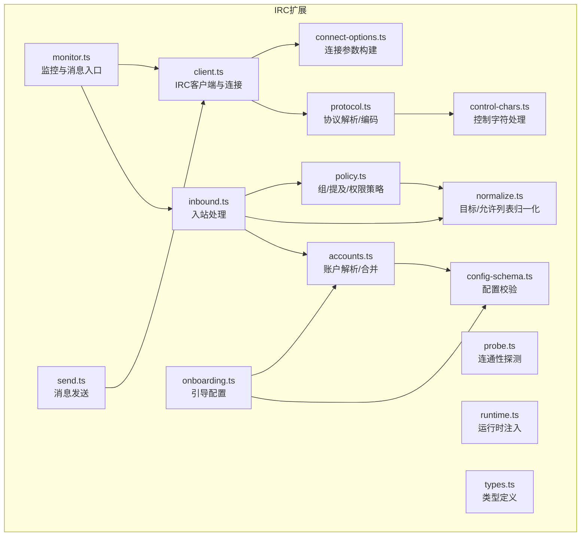
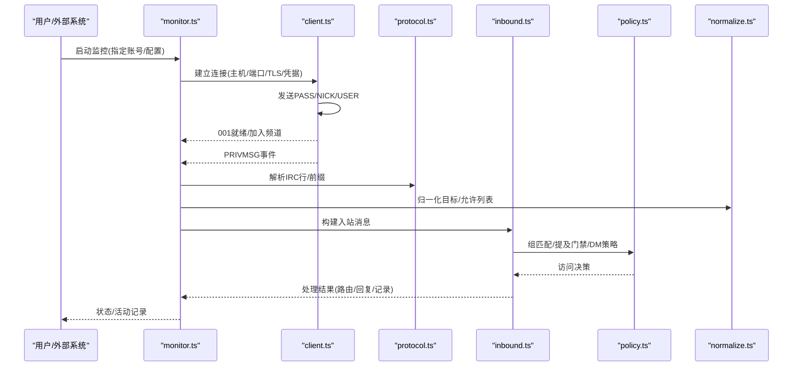
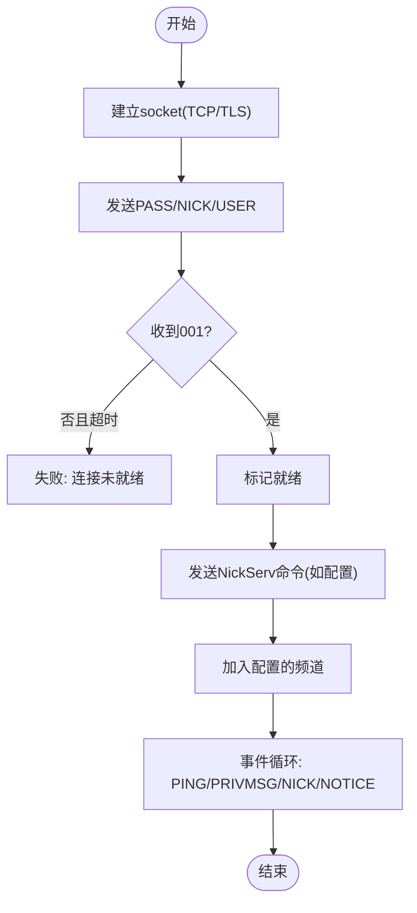
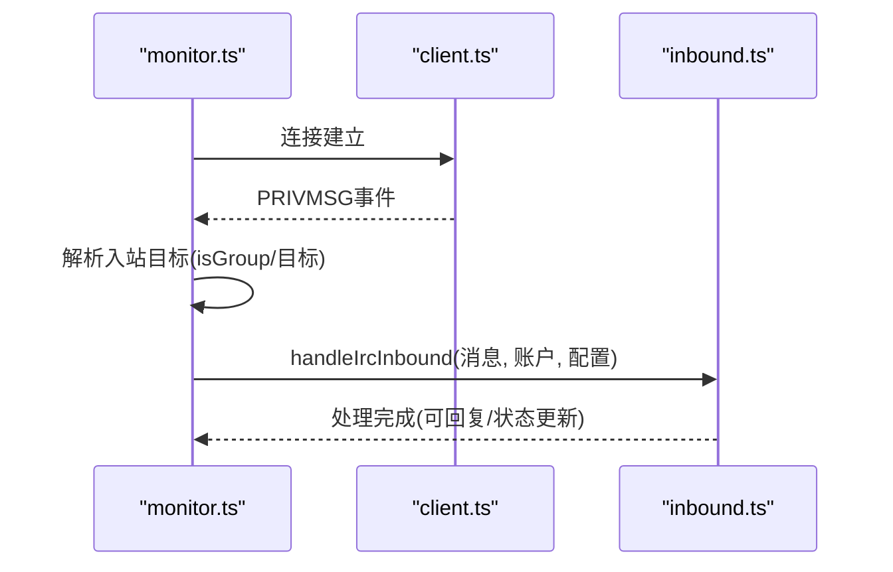
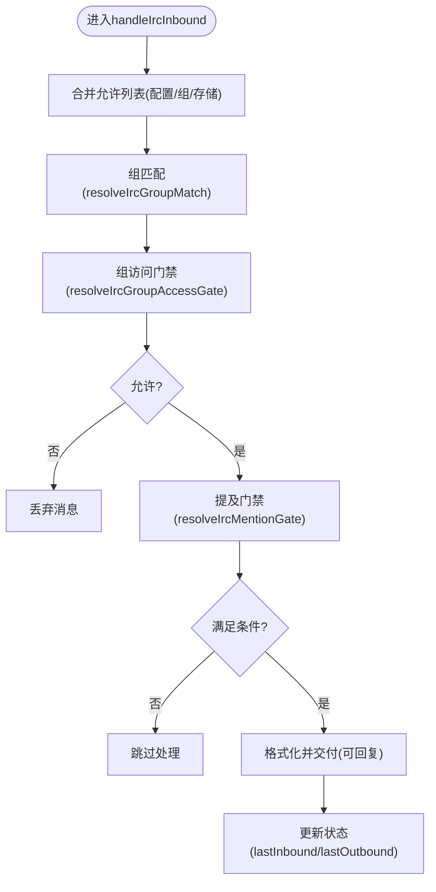
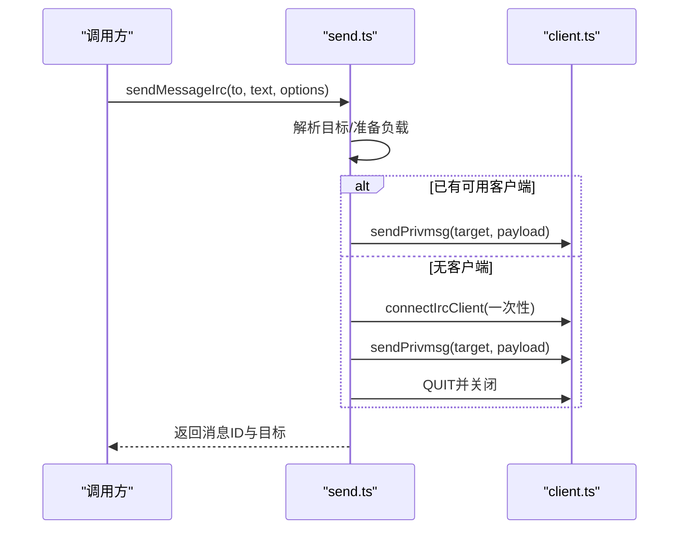
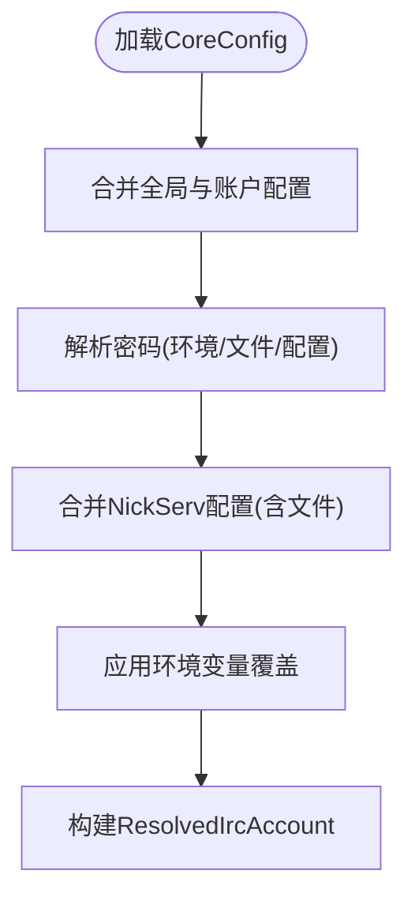
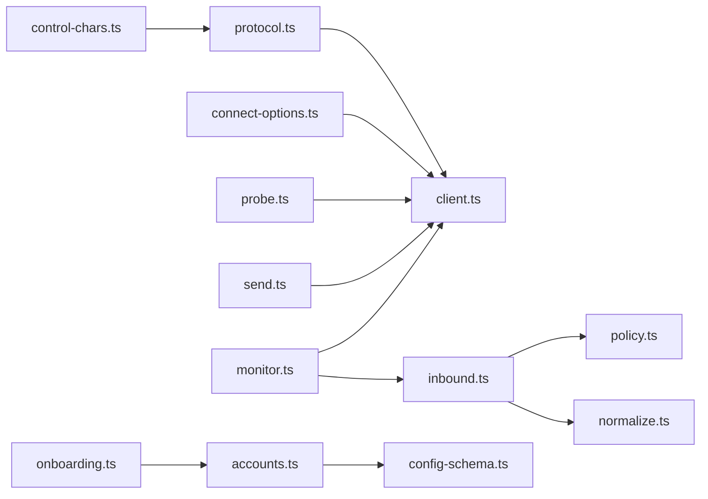

# IRC频道实现

<cite>
**本文档引用的文件**
- [extensions/irc/src/client.ts](file://extensions/irc/src/client.ts)
- [extensions/irc/src/monitor.ts](file://extensions/irc/src/monitor.ts)
- [extensions/irc/src/send.ts](file://extensions/irc/src/send.ts)
- [extensions/irc/src/inbound.ts](file://extensions/irc/src/inbound.ts)
- [extensions/irc/src/protocol.ts](file://extensions/irc/src/protocol.ts)
- [extensions/irc/src/normalize.ts](file://extensions/irc/src/normalize.ts)
- [extensions/irc/src/policy.ts](file://extensions/irc/src/policy.ts)
- [extensions/irc/src/accounts.ts](file://extensions/irc/src/accounts.ts)
- [extensions/irc/src/config-schema.ts](file://extensions/irc/src/config-schema.ts)
- [extensions/irc/src/connect-options.ts](file://extensions/irc/src/connect-options.ts)
- [extensions/irc/src/control-chars.ts](file://extensions/irc/src/control-chars.ts)
- [extensions/irc/src/probe.ts](file://extensions/irc/src/probe.ts)
- [extensions/irc/src/onboarding.ts](file://extensions/irc/src/onboarding.ts)
- [extensions/irc/src/runtime.ts](file://extensions/irc/src/runtime.ts)
- [extensions/irc/src/types.ts](file://extensions/irc/src/types.ts)
</cite>

## 目录

1. [简介](#简介)
2. [项目结构](#项目结构)
3. [核心组件](#核心组件)
4. [架构总览](#架构总览)
5. [详细组件分析](#详细组件分析)
6. [依赖关系分析](#依赖关系分析)
7. [性能考虑](#性能考虑)
8. [故障排除指南](#故障排除指南)
9. [结论](#结论)
10. [附录](#附录)

## 简介

本文件面向OpenClaw项目的IRC频道实现，系统性阐述IRC协议集成架构与运行机制，覆盖服务器连接、频道加入、消息路由、权限控制、消息格式与编码、SSL/TLS支持、以及实际配置示例与故障排除方法。文档以代码为依据，通过多层级可视化图表帮助读者理解从底层协议到上层业务的完整链路。

## 项目结构

IRC扩展位于extensions/irc目录，采用按职责分层的模块化组织：

- 协议解析与编码：protocol.ts、control-chars.ts
- 客户端与连接：client.ts、connect-options.ts、probe.ts
- 运行时与账户解析：accounts.ts、runtime.ts
- 入站处理与策略：inbound.ts、policy.ts、normalize.ts
- 监控与发送：monitor.ts、send.ts
- 配置与引导：config-schema.ts、onboarding.ts、types.ts

**图示来源**

- [extensions/irc/src/client.ts](file://extensions/irc/src/client.ts#L116-L440)
- [extensions/irc/src/monitor.ts](file://extensions/irc/src/monitor.ts#L34-L147)
- [extensions/irc/src/send.ts](file://extensions/irc/src/send.ts#L34-L89)
- [extensions/irc/src/inbound.ts](file://extensions/irc/src/inbound.ts#L83-L149)
- [extensions/irc/src/protocol.ts](file://extensions/irc/src/protocol.ts#L21-L170)
- [extensions/irc/src/normalize.ts](file://extensions/irc/src/normalize.ts#L10-L124)
- [extensions/irc/src/policy.ts](file://extensions/irc/src/policy.ts#L17-L167)
- [extensions/irc/src/accounts.ts](file://extensions/irc/src/accounts.ts#L80-L262)
- [extensions/irc/src/connect-options.ts](file://extensions/irc/src/connect-options.ts#L9-L31)
- [extensions/irc/src/probe.ts](file://extensions/irc/src/probe.ts#L13-L54)
- [extensions/irc/src/onboarding.ts](file://extensions/irc/src/onboarding.ts#L288-L480)
- [extensions/irc/src/config-schema.ts](file://extensions/irc/src/config-schema.ts#L45-L92)
- [extensions/irc/src/control-chars.ts](file://extensions/irc/src/control-chars.ts#L1-L23)
- [extensions/irc/src/runtime.ts](file://extensions/irc/src/runtime.ts#L1-L15)
- [extensions/irc/src/types.ts](file://extensions/irc/src/types.ts#L1-L100)

**章节来源**

- [extensions/irc/src/client.ts](file://extensions/irc/src/client.ts#L1-L440)
- [extensions/irc/src/monitor.ts](file://extensions/irc/src/monitor.ts#L1-L147)
- [extensions/irc/src/send.ts](file://extensions/irc/src/send.ts#L1-L89)
- [extensions/irc/src/inbound.ts](file://extensions/irc/src/inbound.ts#L1-L149)
- [extensions/irc/src/protocol.ts](file://extensions/irc/src/protocol.ts#L1-L170)
- [extensions/irc/src/normalize.ts](file://extensions/irc/src/normalize.ts#L1-L124)
- [extensions/irc/src/policy.ts](file://extensions/irc/src/policy.ts#L1-L167)
- [extensions/irc/src/accounts.ts](file://extensions/irc/src/accounts.ts#L1-L269)
- [extensions/irc/src/connect-options.ts](file://extensions/irc/src/connect-options.ts#L1-L31)
- [extensions/irc/src/probe.ts](file://extensions/irc/src/probe.ts#L1-L54)
- [extensions/irc/src/onboarding.ts](file://extensions/irc/src/onboarding.ts#L1-L480)
- [extensions/irc/src/config-schema.ts](file://extensions/irc/src/config-schema.ts#L1-L92)
- [extensions/irc/src/control-chars.ts](file://extensions/irc/src/control-chars.ts#L1-L23)
- [extensions/irc/src/runtime.ts](file://extensions/irc/src/runtime.ts#L1-L15)
- [extensions/irc/src/types.ts](file://extensions/irc/src/types.ts#L1-L100)

## 核心组件

- IRC客户端与连接管理：负责建立TCP或TLS连接、登录序列、JOIN频道、PING/PONG心跳、PRIVMSG发送与拆分、Nick冲突恢复、错误处理与超时。
- 监控与消息入口：监听PRIVMSG事件，构建入站消息对象，调用入站处理流程或回调。
- 入站处理与策略：解析允许列表、组匹配、提及门禁、DM策略、回复路由与状态上报。
- 消息发送：支持持久连接或瞬时连接发送，自动Markdown表格转换与回复标记附加。
- 账户与配置：合并全局与账户级配置，支持环境变量覆盖、密码文件、NickServ注册/识别。
- 协议与编码：IRC文本与目标规范化、控制字符过滤、消息拆分策略、前缀解析。
- 引导与探测：交互式引导配置、连通性探测与延迟测量。

**章节来源**

- [extensions/irc/src/client.ts](file://extensions/irc/src/client.ts#L116-L440)
- [extensions/irc/src/monitor.ts](file://extensions/irc/src/monitor.ts#L34-L147)
- [extensions/irc/src/inbound.ts](file://extensions/irc/src/inbound.ts#L83-L149)
- [extensions/irc/src/send.ts](file://extensions/irc/src/send.ts#L34-L89)
- [extensions/irc/src/accounts.ts](file://extensions/irc/src/accounts.ts#L80-L262)
- [extensions/irc/src/protocol.ts](file://extensions/irc/src/protocol.ts#L21-L170)
- [extensions/irc/src/normalize.ts](file://extensions/irc/src/normalize.ts#L10-L124)
- [extensions/irc/src/policy.ts](file://extensions/irc/src/policy.ts#L17-L167)
- [extensions/irc/src/probe.ts](file://extensions/irc/src/probe.ts#L13-L54)
- [extensions/irc/src/onboarding.ts](file://extensions/irc/src/onboarding.ts#L288-L480)

## 架构总览

下图展示从连接建立到消息路由的端到端流程：

**图示来源**

- [extensions/irc/src/monitor.ts](file://extensions/irc/src/monitor.ts#L62-L134)
- [extensions/irc/src/client.ts](file://extensions/irc/src/client.ts#L116-L440)
- [extensions/irc/src/protocol.ts](file://extensions/irc/src/protocol.ts#L21-L106)
- [extensions/irc/src/normalize.ts](file://extensions/irc/src/normalize.ts#L10-L124)
- [extensions/irc/src/inbound.ts](file://extensions/irc/src/inbound.ts#L83-L149)
- [extensions/irc/src/policy.ts](file://extensions/irc/src/policy.ts#L17-L167)

## 详细组件分析

### 组件A：IRC客户端与连接（client.ts）

- 功能要点
  - 支持明文与TLS两种连接模式，可配置连接超时与消息分片长度。
  - 登录序列：发送密码、昵称、USER命令；在001后执行NickServ命令并加入配置的频道。
  - 心跳与事件：自动响应PING，解析PRIVMSG/NICK/NOTICE等事件。
  - 错误处理：识别常见错误码与昵称冲突，尝试NickServ GHOST或回退昵称。
  - 消息发送：PRIVMSG自动按最大字符数拆分，避免截断单词。
- 关键流程（连接与登录）

**图示来源**

- [extensions/irc/src/client.ts](file://extensions/irc/src/client.ts#L116-L440)

**章节来源**

- [extensions/irc/src/client.ts](file://extensions/irc/src/client.ts#L116-L440)

### 组件B：监控与消息入口（monitor.ts）

- 功能要点
  - 解析账户配置，构建连接选项，启动连接。
  - 监听PRIVMSG事件，过滤自身消息，解析入站目标（群组/私聊）。
  - 将消息交由入站处理流程或外部回调处理，记录活动。
- 关键流程（消息入口）

**图示来源**

- [extensions/irc/src/monitor.ts](file://extensions/irc/src/monitor.ts#L79-L134)
- [extensions/irc/src/inbound.ts](file://extensions/irc/src/inbound.ts#L83-L149)

**章节来源**

- [extensions/irc/src/monitor.ts](file://extensions/irc/src/monitor.ts#L34-L147)

### 组件C：入站处理与策略（inbound.ts + policy.ts + normalize.ts）

- 功能要点
  - 允许列表与组策略：支持全局/组别/存储来源的允许列表，区分DM策略。
  - 组匹配：大小写不敏感匹配配置键，支持通配符“\*”。
  - 提及门禁：默认要求@提及，可通过配置关闭；支持控制命令授权。
  - 有效负载：格式化文本与附件链接，记录入站/出站时间戳。
- 关键流程（入站处理）

**图示来源**

- [extensions/irc/src/inbound.ts](file://extensions/irc/src/inbound.ts#L83-L149)
- [extensions/irc/src/policy.ts](file://extensions/irc/src/policy.ts#L17-L167)
- [extensions/irc/src/normalize.ts](file://extensions/irc/src/normalize.ts#L10-L124)

**章节来源**

- [extensions/irc/src/inbound.ts](file://extensions/irc/src/inbound.ts#L83-L149)
- [extensions/irc/src/policy.ts](file://extensions/irc/src/policy.ts#L17-L167)
- [extensions/irc/src/normalize.ts](file://extensions/irc/src/normalize.ts#L10-L124)

### 组件D：消息发送（send.ts）

- 功能要点
  - 支持复用现有客户端或临时连接发送。
  - 自动Markdown表格转换与回复标记附加。
  - 记录出站活动。
- 关键流程（发送）

**图示来源**

- [extensions/irc/src/send.ts](file://extensions/irc/src/send.ts#L34-L89)
- [extensions/irc/src/client.ts](file://extensions/irc/src/client.ts#L116-L440)

**章节来源**

- [extensions/irc/src/send.ts](file://extensions/irc/src/send.ts#L34-L89)

### 组件E：协议解析与编码（protocol.ts + control-chars.ts）

- 功能要点
  - IRC行解析：支持前缀、命令、参数与尾随文本。
  - 文本与目标安全：去除控制字符，拒绝空白与非法目标。
  - 文本拆分：按空格回退策略拆分，避免截断单词。
- 关键流程（文本拆分）

**图示来源**

- [extensions/irc/src/protocol.ts](file://extensions/irc/src/protocol.ts#L143-L165)
- [extensions/irc/src/control-chars.ts](file://extensions/irc/src/control-chars.ts#L1-L23)

**章节来源**

- [extensions/irc/src/protocol.ts](file://extensions/irc/src/protocol.ts#L21-L170)
- [extensions/irc/src/control-chars.ts](file://extensions/irc/src/control-chars.ts#L1-L23)

### 组件F：账户与配置（accounts.ts + config-schema.ts + onboarding.ts + types.ts）

- 功能要点
  - 账户解析：合并全局与账户级配置，支持环境变量覆盖、密码文件、NickServ配置。
  - 配置校验：使用Zod Schema确保字段合法与互斥。
  - 引导配置：交互式提示主机、端口、TLS、昵称、用户名、真实姓名、自动加入频道、组策略、提及要求、允许列表、NickServ等。
  - 类型定义：统一暴露IRC配置与消息类型。
- 关键流程（账户解析）

**图示来源**

- [extensions/irc/src/accounts.ts](file://extensions/irc/src/accounts.ts#L80-L262)
- [extensions/irc/src/config-schema.ts](file://extensions/irc/src/config-schema.ts#L45-L92)
- [extensions/irc/src/onboarding.ts](file://extensions/irc/src/onboarding.ts#L303-L467)
- [extensions/irc/src/types.ts](file://extensions/irc/src/types.ts#L32-L100)

**章节来源**

- [extensions/irc/src/accounts.ts](file://extensions/irc/src/accounts.ts#L80-L262)
- [extensions/irc/src/config-schema.ts](file://extensions/irc/src/config-schema.ts#L45-L92)
- [extensions/irc/src/onboarding.ts](file://extensions/irc/src/onboarding.ts#L288-L480)
- [extensions/irc/src/types.ts](file://extensions/irc/src/types.ts#L32-L100)

### 组件G：连接选项与探测（connect-options.ts + probe.ts）

- 功能要点
  - 连接选项构建：将账户信息映射为客户端连接参数。
  - 探测：在超时内建立连接并计算延迟，退出时发送QUIT。

**章节来源**

- [extensions/irc/src/connect-options.ts](file://extensions/irc/src/connect-options.ts#L9-L31)
- [extensions/irc/src/probe.ts](file://extensions/irc/src/probe.ts#L13-L54)

## 依赖关系分析

- 模块耦合
  - monitor.ts依赖client.ts与inbound.ts，形成“监听-处理”闭环。
  - inbound.ts依赖policy.ts与normalize.ts，形成“策略-归一化”闭环。
  - send.ts依赖client.ts与connect-options.ts，形成“发送-连接”闭环。
  - accounts.ts与config-schema.ts共同保证配置正确性。
- 外部依赖
  - Node内置net/tls用于网络通信。
  - 插件SDK提供日志、活动记录、配置加载等能力。

**图示来源**

- [extensions/irc/src/monitor.ts](file://extensions/irc/src/monitor.ts#L1-L147)
- [extensions/irc/src/client.ts](file://extensions/irc/src/client.ts#L1-L440)
- [extensions/irc/src/inbound.ts](file://extensions/irc/src/inbound.ts#L1-L149)
- [extensions/irc/src/policy.ts](file://extensions/irc/src/policy.ts#L1-L167)
- [extensions/irc/src/normalize.ts](file://extensions/irc/src/normalize.ts#L1-L124)
- [extensions/irc/src/send.ts](file://extensions/irc/src/send.ts#L1-L89)
- [extensions/irc/src/accounts.ts](file://extensions/irc/src/accounts.ts#L1-L269)
- [extensions/irc/src/config-schema.ts](file://extensions/irc/src/config-schema.ts#L1-L92)
- [extensions/irc/src/onboarding.ts](file://extensions/irc/src/onboarding.ts#L1-L480)
- [extensions/irc/src/probe.ts](file://extensions/irc/src/probe.ts#L1-L54)
- [extensions/irc/src/connect-options.ts](file://extensions/irc/src/connect-options.ts#L1-L31)
- [extensions/irc/src/protocol.ts](file://extensions/irc/src/protocol.ts#L1-L170)
- [extensions/irc/src/control-chars.ts](file://extensions/irc/src/control-chars.ts#L1-L23)

**章节来源**

- [extensions/irc/src/monitor.ts](file://extensions/irc/src/monitor.ts#L1-L147)
- [extensions/irc/src/client.ts](file://extensions/irc/src/client.ts#L1-L440)
- [extensions/irc/src/inbound.ts](file://extensions/irc/src/inbound.ts#L1-L149)
- [extensions/irc/src/policy.ts](file://extensions/irc/src/policy.ts#L1-L167)
- [extensions/irc/src/normalize.ts](file://extensions/irc/src/normalize.ts#L1-L124)
- [extensions/irc/src/send.ts](file://extensions/irc/src/send.ts#L1-L89)
- [extensions/irc/src/accounts.ts](file://extensions/irc/src/accounts.ts#L1-L269)
- [extensions/irc/src/config-schema.ts](file://extensions/irc/src/config-schema.ts#L1-L92)
- [extensions/irc/src/onboarding.ts](file://extensions/irc/src/onboarding.ts#L1-L480)
- [extensions/irc/src/probe.ts](file://extensions/irc/src/probe.ts#L1-L54)
- [extensions/irc/src/connect-options.ts](file://extensions/irc/src/connect-options.ts#L1-L31)
- [extensions/irc/src/protocol.ts](file://extensions/irc/src/protocol.ts#L1-L170)
- [extensions/irc/src/control-chars.ts](file://extensions/irc/src/control-chars.ts#L1-L23)

## 性能考虑

- 连接复用：优先复用已建立的客户端，减少握手开销。
- 消息分片：按空格回退策略拆分，避免长单词截断，提升可读性。
- 控制字符清理：在发送前移除控制字符，降低协议异常风险。
- 超时与重试：连接超时与Nick冲突恢复，避免长时间阻塞。
- 日志级别：仅在详细日志模式下打印原始IRC行，平衡可观测性与性能。

[本节为通用建议，无需特定文件引用]

## 故障排除指南

- 连接失败
  - 检查主机/端口/TLS配置是否正确，必要时使用探测功能验证连通性与延迟。
  - 若出现昵称冲突，确认NickServ配置或启用回退昵称策略。
- 无法加入频道
  - 确认JOIN目标以“#”或“&”开头，检查权限与允许列表。
- 提及门禁导致未响应
  - 在组配置中关闭requireMention，或确保消息包含@机器人昵称。
- DM策略限制
  - 当dmPolicy为pairing时，需在存储中建立配对；设为open时需allowFrom包含“\*”。
- 文本被截断或显示异常
  - 检查消息长度与分片阈值，确认控制字符已被清理。
- 环境变量与密码文件
  - 确保IRC_HOST/IRC_PORT/IRC_TLS/IRC_NICK等环境变量正确，密码文件可读。

**章节来源**

- [extensions/irc/src/probe.ts](file://extensions/irc/src/probe.ts#L13-L54)
- [extensions/irc/src/client.ts](file://extensions/irc/src/client.ts#L116-L440)
- [extensions/irc/src/policy.ts](file://extensions/irc/src/policy.ts#L17-L167)
- [extensions/irc/src/normalize.ts](file://extensions/irc/src/normalize.ts#L10-L124)
- [extensions/irc/src/accounts.ts](file://extensions/irc/src/accounts.ts#L95-L120)

## 结论

OpenClaw的IRC扩展通过清晰的模块划分与严格的配置校验，实现了从底层协议到上层业务的完整闭环。其特性包括灵活的账户与环境变量配置、强大的组与提及策略、稳健的连接与错误恢复、以及完善的引导与探测工具。遵循本文档的配置与排障建议，可快速搭建稳定可靠的IRC频道集成。

[本节为总结，无需特定文件引用]

## 附录

### 实际配置示例（基于onboarding与配置模式）

- 服务器设置
  - 主机与端口：推荐TLS端口6697；若非TLS则使用6667。
  - 昵称、用户名、真实姓名：可从环境变量注入。
- 频道配置
  - 自动加入频道：逗号分隔列表；支持通配符“\*”作为默认组。
  - 组策略：disabled/allowlist/open；默认allowlist。
  - 提及要求：requireMention默认开启，可在组或通配符上关闭。
- 用户认证
  - 密码：支持直接配置、密码文件与环境变量。
  - NickServ：可配置服务名、密码、注册邮箱与注册开关。
- DM策略
  - pairing：默认，需配对；open：需allowFrom包含“\*”。

**章节来源**

- [extensions/irc/src/onboarding.ts](file://extensions/irc/src/onboarding.ts#L303-L467)
- [extensions/irc/src/config-schema.ts](file://extensions/irc/src/config-schema.ts#L45-L92)
- [extensions/irc/src/accounts.ts](file://extensions/irc/src/accounts.ts#L95-L147)
