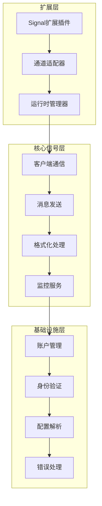
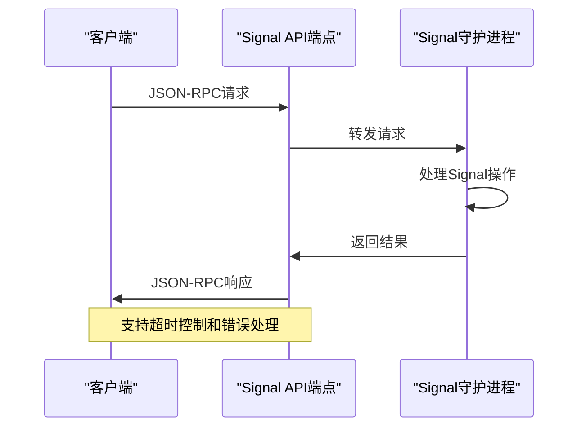
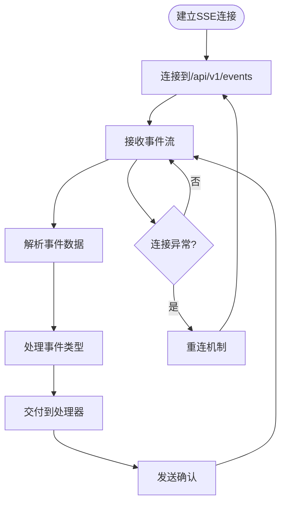
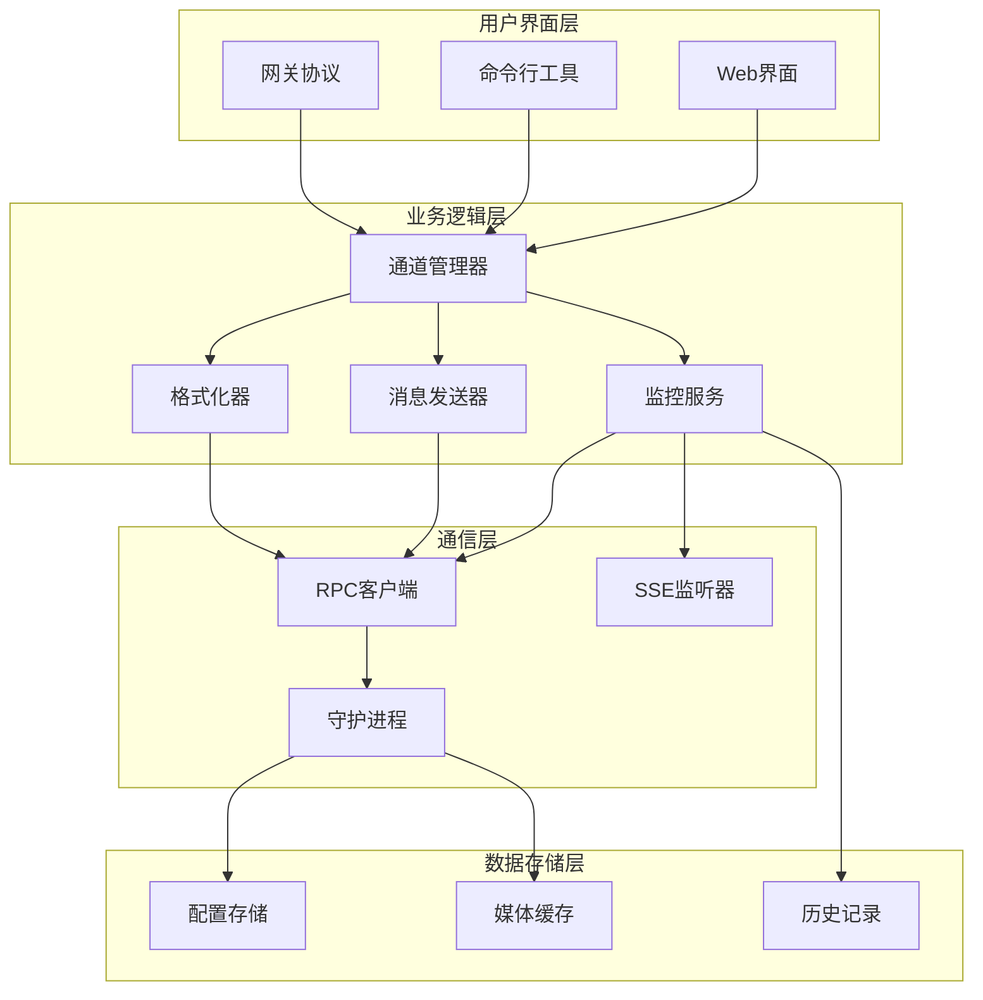
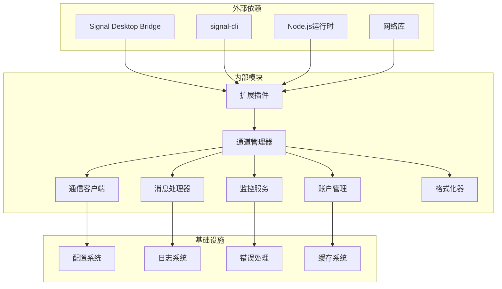

# Signal频道实现

<cite>
**本文档引用的文件**
- [extensions/signal/index.ts](file://extensions/signal/index.ts)
- [extensions/signal/src/channel.ts](file://extensions/signal/src/channel.ts)
- [extensions/signal/src/runtime.ts](file://extensions/signal/src/runtime.ts)
- [extensions/signal/openclaw.plugin.json](file://extensions/signal/openclaw.plugin.json)
- [src/signal/index.ts](file://src/signal/index.ts)
- [src/signal/client.ts](file://src/signal/client.ts)
- [src/signal/send.ts](file://src/signal/send.ts)
- [src/signal/format.ts](file://src/signal/format.ts)
- [src/signal/monitor.ts](file://src/signal/monitor.ts)
- [src/signal/probe.ts](file://src/signal/probe.ts)
- [src/signal/accounts.ts](file://src/signal/accounts.ts)
- [src/signal/identity.ts](file://src/signal/identity.ts)
</cite>

## 目录

1. [简介](#简介)
2. [项目结构](#项目结构)
3. [核心组件](#核心组件)
4. [架构概览](#架构概览)
5. [详细组件分析](#详细组件分析)
6. [依赖关系分析](#依赖关系分析)
7. [性能考虑](#性能考虑)
8. [故障排除指南](#故障排除指南)
9. [结论](#结论)

## 简介

Signal频道实现是OpenClaw平台中用于连接Signal即时通讯应用的插件系统。该实现基于Signal Desktop Bridge API，通过本地API通信、消息发送和状态同步机制，实现了与Signal客户端的深度集成。

本实现支持多种Signal功能特性，包括：

- 本地API通信（HTTP REST API + Server-Sent Events）
- 消息发送（文本、媒体、链接预览）
- 设备绑定和账户管理
- 加密通信和安全验证
- 实时状态同步和事件处理
- 多账户支持和配置管理

## 项目结构

Signal频道实现采用分层架构设计，主要分为三个层次：

**图表来源**

- [extensions/signal/index.ts](file://extensions/signal/index.ts#L1-L18)
- [src/signal/client.ts](file://src/signal/client.ts#L1-L216)

**章节来源**

- [extensions/signal/index.ts](file://extensions/signal/index.ts#L1-L18)
- [extensions/signal/src/channel.ts](file://extensions/signal/src/channel.ts#L1-L300)
- [extensions/signal/src/runtime.ts](file://extensions/signal/src/runtime.ts#L1-L15)

## 核心组件

### 扩展插件架构

Signal扩展插件采用标准的OpenClaw插件架构，通过以下关键组件实现：

#### 插件注册机制

- **插件标识符**: "signal"
- **名称**: "Signal"
- **描述**: "Signal频道插件"
- **配置模式**: 空配置模式（emptyPluginConfigSchema）

#### 通道适配器

通道适配器实现了完整的Signal频道功能，包括：

- 消息动作处理
- 配对管理
- 安全策略
- 配置管理
- 状态监控

**章节来源**

- [extensions/signal/index.ts](file://extensions/signal/index.ts#L6-L15)
- [extensions/signal/src/channel.ts](file://extensions/signal/src/channel.ts#L48-L300)

### 通信协议实现

#### RPC通信协议

实现基于JSON-RPC 2.0标准的Signal Desktop Bridge API：

**图表来源**

- [src/signal/client.ts](file://src/signal/client.ts#L70-L107)

#### SSE事件流

实时事件处理通过Server-Sent Events实现：

**图表来源**

- [src/signal/client.ts](file://src/signal/client.ts#L134-L216)

**章节来源**

- [src/signal/client.ts](file://src/signal/client.ts#L1-L216)

## 架构概览

Signal频道实现采用分层架构，确保了模块间的清晰分离和高内聚低耦合：

**图表来源**

- [src/signal/monitor.ts](file://src/signal/monitor.ts#L327-L477)
- [src/signal/send.ts](file://src/signal/send.ts#L98-L192)

**章节来源**

- [src/signal/monitor.ts](file://src/signal/monitor.ts#L1-L477)
- [src/signal/send.ts](file://src/signal/send.ts#L1-L249)

## 详细组件分析

### 通道管理器

通道管理器是Signal频道的核心协调组件，负责管理所有Signal相关的操作：

#### 配置管理

- **账户列表**: 支持多账户配置
- **默认账户**: 自动选择活动账户
- **配置验证**: 输入参数验证和规范化
- **动态更新**: 运行时配置热更新

#### 安全策略

- **发送者验证**: 基于允许列表的访问控制
- **群组策略**: 群组消息的安全策略
- **配对流程**: 受信任发送者的认证机制
- **权限管理**: 细粒度的访问控制

**章节来源**

- [extensions/signal/src/channel.ts](file://extensions/signal/src/channel.ts#L72-L142)

### 消息发送系统

消息发送系统提供了完整的Signal消息发送能力：

#### 目标解析

支持多种目标格式：

- 个人号码: `+1234567890`
- UUID格式: `uuid:xxxxxxxx-xxxx-xxxx-xxxx-xxxxxxxxxxxx`
- 群组ID: `group:xxxxxxxx-xxxx-xxxx-xxxx-xxxxxxxxxxxx`
- 用户名: `username:johndoe`

#### 文本格式化

- **Markdown支持**: 标准Markdown语法转换
- **样式映射**: 支持粗体、斜体、删除线等
- **链接处理**: 自动链接识别和格式化
- **表格支持**: 多种表格渲染模式

#### 媒体处理

- **附件上传**: 支持图片、视频、文档等
- **大小限制**: 自动检查和限制文件大小
- **类型检测**: MIME类型自动识别
- **占位符**: 纯附件消息的智能处理

**章节来源**

- [src/signal/send.ts](file://src/signal/send.ts#L98-L192)
- [src/signal/format.ts](file://src/signal/format.ts#L234-L397)

### 监控服务

监控服务负责实时处理Signal事件和状态变化：

#### 事件处理

- **消息事件**: 新消息接收和处理
- **反应事件**: 表情反应和互动
- **状态事件**: 在线状态和设备状态
- **媒体事件**: 附件下载和处理

#### 连接管理

- **自动重连**: 断线自动恢复机制
- **心跳检测**: 连接健康状态监控
- **超时处理**: 请求超时和重试策略
- **资源清理**: 异常情况下的资源释放

#### 历史管理

- **消息历史**: 最近消息的缓存和查询
- **会话状态**: 用户会话状态跟踪
- **历史限制**: 可配置的历史记录数量限制

**章节来源**

- [src/signal/monitor.ts](file://src/signal/monitor.ts#L327-L477)

### 账户管理系统

账户管理系统提供了完整的Signal账户生命周期管理：

#### 账户解析

- **配置合并**: 基础配置和账户特定配置合并
- **默认值处理**: 缺省配置的智能填充
- **验证检查**: 配置有效性和完整性检查
- **状态跟踪**: 账户启用状态和配置状态

#### 设备绑定

- **本地守护进程**: 自动启动和管理Signal守护进程
- **HTTP接口**: 本地REST API接口暴露
- **端口管理**: 动态端口分配和冲突检测
- **进程监控**: 守护进程健康状态监控

#### 多账户支持

- **账户隔离**: 不同账户间的完全隔离
- **资源共享**: 必要时的资源共享机制
- **优先级管理**: 多账户间的操作优先级
- **切换机制**: 平滑的账户切换和状态迁移

**章节来源**

- [src/signal/accounts.ts](file://src/signal/accounts.ts#L35-L70)
- [src/signal/monitor.ts](file://src/signal/monitor.ts#L382-L398)

### 身份验证系统

身份验证系统确保只有受信任的用户可以与Signal频道交互：

#### 发送者识别

- **号码标准化**: E.164格式的号码标准化
- **UUID识别**: 唯一设备标识符识别
- **显示格式**: 用户友好的显示格式
- **兼容性**: 支持多种输入格式

#### 访问控制

- **允许列表**: 白名单机制
- **群组策略**: 群组消息的特殊策略
- **动态更新**: 运行时的访问控制更新
- **审计日志**: 所有访问尝试的记录

#### 安全策略

- **默认保护**: 默认的严格访问控制
- **灵活配置**: 可配置的安全级别
- **威胁检测**: 异常访问模式的检测
- **防护措施**: 自动化的安全防护

**章节来源**

- [src/signal/identity.ts](file://src/signal/identity.ts#L30-L136)

## 依赖关系分析

Signal频道实现的依赖关系体现了清晰的分层架构：

**图表来源**

- [extensions/signal/src/channel.ts](file://extensions/signal/src/channel.ts#L1-L30)
- [src/signal/client.ts](file://src/signal/client.ts#L1-L48)

**章节来源**

- [extensions/signal/src/channel.ts](file://extensions/signal/src/channel.ts#L1-L30)
- [src/signal/client.ts](file://src/signal/client.ts#L1-L48)

## 性能考虑

### 通信优化

- **连接池**: 复用HTTP连接减少延迟
- **批量处理**: 多个消息的批量发送优化
- **压缩传输**: 压缩SSE事件数据减少带宽
- **缓存策略**: 频繁访问数据的本地缓存

### 内存管理

- **流式处理**: 大文件的流式传输避免内存峰值
- **垃圾回收**: 及时释放不再使用的对象
- **资源监控**: 内存使用情况的实时监控
- **泄漏检测**: 自动检测和报告内存泄漏

### 并发控制

- **队列管理**: 消息发送的有序队列管理
- **限流机制**: 防止过度请求的速率限制
- **超时控制**: 请求超时的统一处理
- **错误恢复**: 失败操作的自动重试机制

## 故障排除指南

### 常见问题诊断

#### 连接问题

- **症状**: 无法连接到Signal守护进程
- **原因**: 端口被占用或守护进程未启动
- **解决方案**: 检查端口使用情况，重启守护进程

#### 验证失败

- **症状**: 配置验证总是失败
- **原因**: 配置参数格式不正确
- **解决方案**: 使用配置验证工具检查参数格式

#### 权限问题

- **症状**: 无权访问某些功能
- **原因**: 用户不在允许列表中
- **解决方案**: 更新允许列表配置

#### 性能问题

- **症状**: 响应缓慢或超时
- **原因**: 网络延迟或服务器负载过高
- **解决方案**: 优化网络配置或增加服务器资源

### 调试工具

#### 日志分析

- **详细日志**: 启用详细日志模式获取完整调试信息
- **时间戳**: 所有日志条目包含精确的时间戳
- **上下文信息**: 包含请求ID和相关上下文信息
- **错误追踪**: 完整的错误堆栈跟踪

#### 状态监控

- **连接状态**: 实时显示当前连接状态
- **性能指标**: 关键性能指标的实时监控
- **资源使用**: CPU、内存、网络使用情况
- **错误统计**: 错误类型和频率的统计

#### 配置检查

- **配置验证**: 自动验证配置的有效性
- **兼容性检查**: 检查配置与当前版本的兼容性
- **最佳实践**: 提供配置优化建议
- **迁移指导**: 从旧版本配置的迁移指导

**章节来源**

- [src/signal/probe.ts](file://src/signal/probe.ts#L23-L56)
- [src/signal/monitor.ts](file://src/signal/monitor.ts#L205-L232)

## 结论

Signal频道实现是一个功能完整、架构清晰的即时通讯集成解决方案。通过采用分层架构设计和模块化组件，该实现提供了：

- **完整的Signal功能支持**: 从基础消息发送到高级特性如表情反应和群组管理
- **强大的扩展性**: 基于插件架构的设计，易于添加新功能
- **高可靠性**: 完善的错误处理和恢复机制
- **良好的性能**: 优化的通信协议和资源管理
- **安全性保障**: 多层次的安全策略和访问控制

该实现为OpenClaw平台提供了可靠的Signal集成能力，支持个人用户和企业用户的多样化需求。通过持续的优化和维护，Signal频道将继续为用户提供优质的即时通讯体验。
