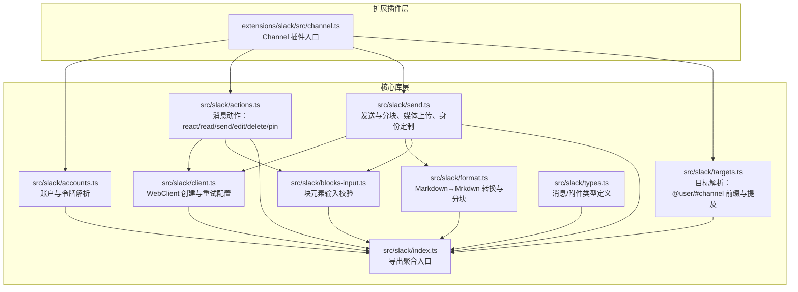
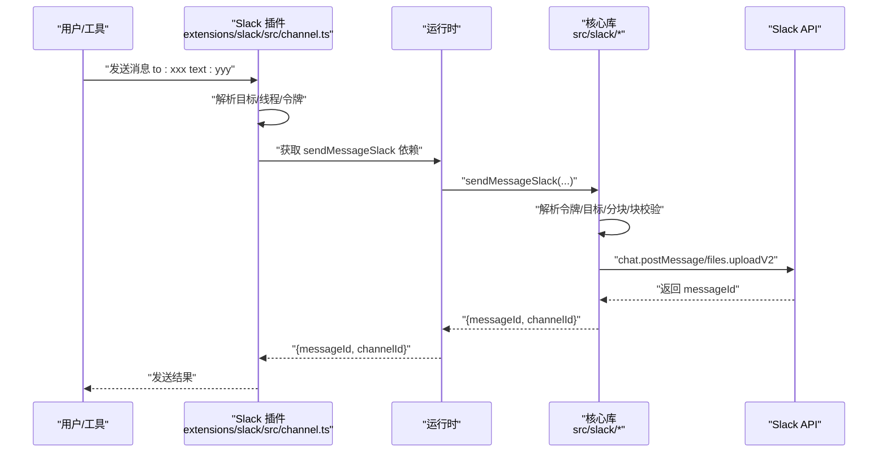
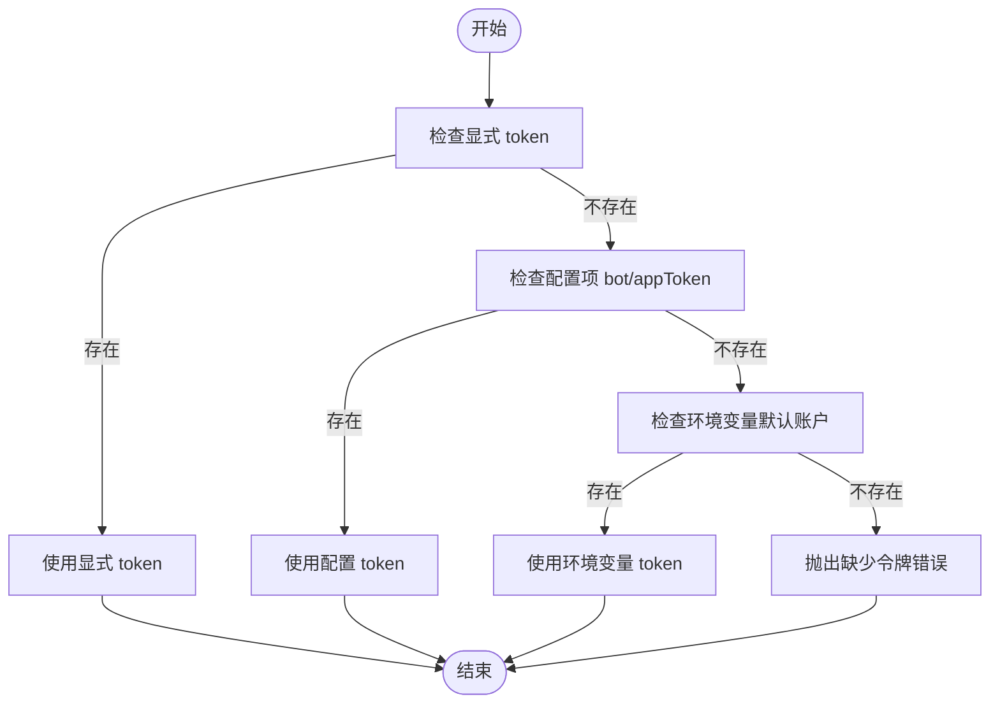
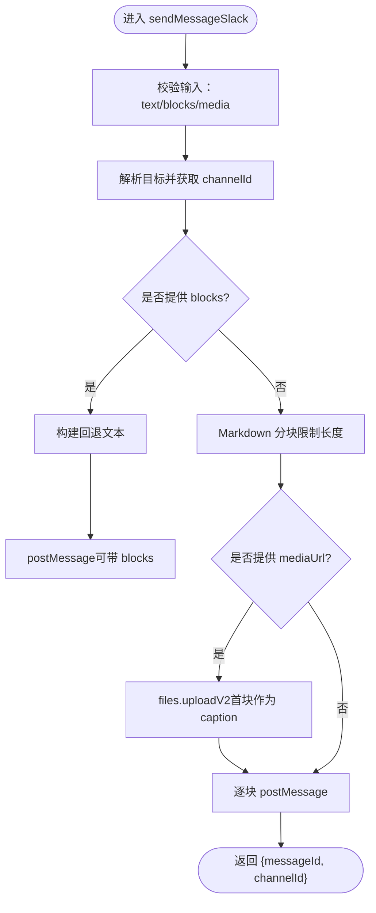
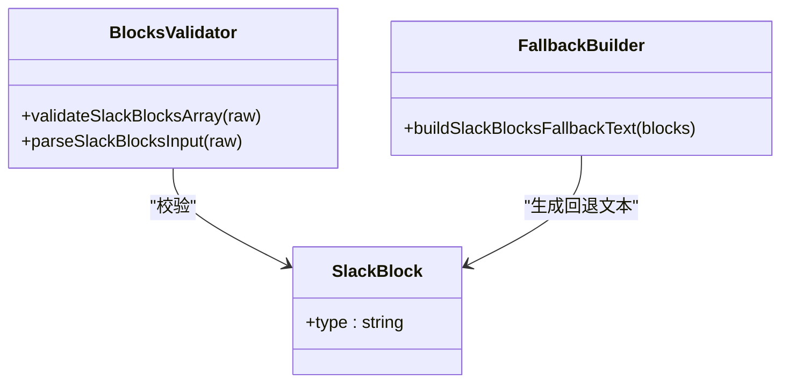
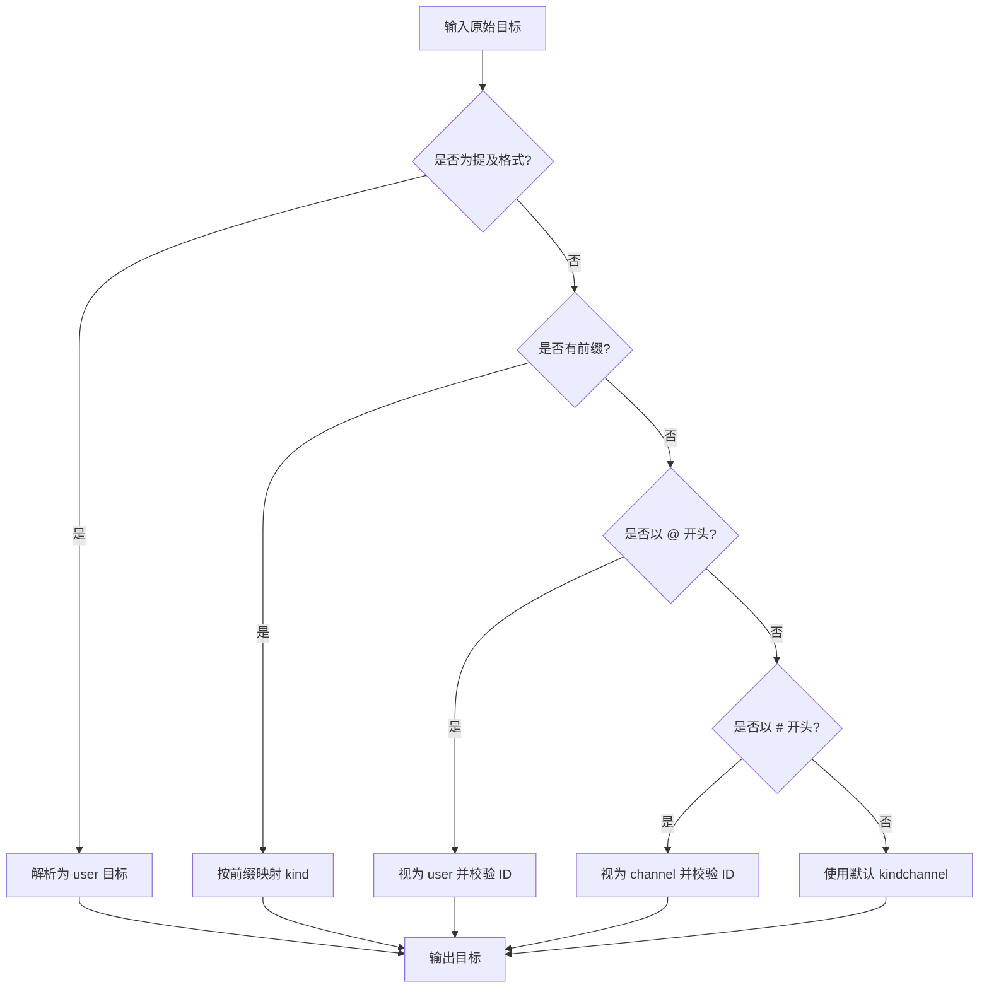
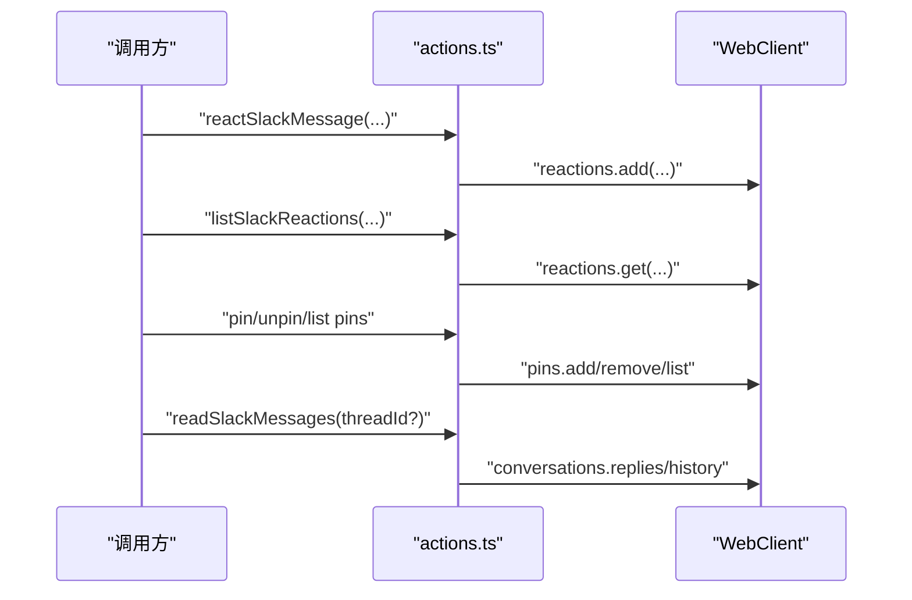
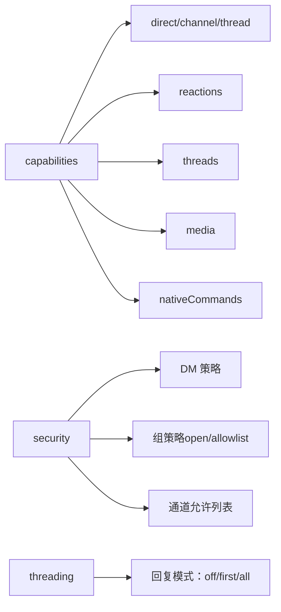
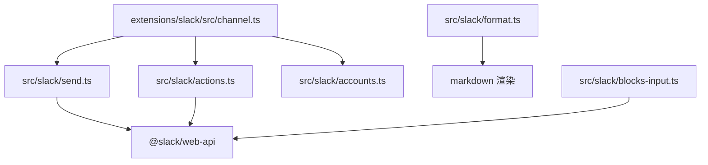

# Slack频道实现

<cite>
**本文引用的文件**
- [src/slack/index.ts](file://src/slack/index.ts)
- [src/slack/accounts.ts](file://src/slack/accounts.ts)
- [src/slack/actions.ts](file://src/slack/actions.ts)
- [src/slack/send.ts](file://src/slack/send.ts)
- [src/slack/client.ts](file://src/slack/client.ts)
- [src/slack/targets.ts](file://src/slack/targets.ts)
- [src/slack/format.ts](file://src/slack/format.ts)
- [src/slack/blocks-input.ts](file://src/slack/blocks-input.ts)
- [src/slack/types.ts](file://src/slack/types.ts)
- [extensions/slack/src/channel.ts](file://extensions/slack/src/channel.ts)
</cite>

## 目录

1. [简介](#简介)
2. [项目结构](#项目结构)
3. [核心组件](#核心组件)
4. [架构总览](#架构总览)
5. [详细组件分析](#详细组件分析)
6. [依赖关系分析](#依赖关系分析)
7. [性能考虑](#性能考虑)
8. [故障排查指南](#故障排查指南)
9. [结论](#结论)
10. [附录](#附录)

## 简介

本文件系统性梳理 OpenClaw 项目中 Slack 频道的实现，覆盖以下主题：

- Slack API 集成架构：Bot 令牌认证、Web API 使用与错误处理、消息发送与分块策略
- 消息格式与块元素：Markdown 到 Slack Mrkdwn 的转换、块数组校验与回退文本生成
- 用户权限与 Workspace 集成：令牌来源解析、读写操作选择、DM/频道白名单与组策略
- 频道权限与消息交互：目标解析、线程回复、媒体上传、反应（reactions）与 Pin
- Slack 应用创建、权限配置与事件订阅：在 OpenClaw 中的落地方式与最佳实践
- 集成策略与性能优化：重试策略、分块与流式合并、令牌切换与降级

## 项目结构

围绕 Slack 的实现主要分布在两个层面：

- 核心库层（src/slack/\*）：提供 Slack 客户端、令牌解析、消息发送、块元素校验、Markdown 转换、目标解析等通用能力
- 扩展插件层（extensions/slack/src/channel.ts）：封装为 OpenClaw 的 Channel 插件，暴露 onboarding、capabilities、security、groups、threading、messaging、directory、resolver、actions、setup、outbound、status、gateway 等能力，并与运行时集成

图表来源

- [extensions/slack/src/channel.ts](file://extensions/slack/src/channel.ts#L54-L100)
- [src/slack/accounts.ts](file://src/slack/accounts.ts#L52-L92)
- [src/slack/actions.ts](file://src/slack/actions.ts#L1-L274)
- [src/slack/send.ts](file://src/slack/send.ts#L229-L338)
- [src/slack/client.ts](file://src/slack/client.ts#L18-L21)
- [src/slack/targets.ts](file://src/slack/targets.ts#L18-L73)
- [src/slack/format.ts](file://src/slack/format.ts#L111-L141)
- [src/slack/blocks-input.ts](file://src/slack/blocks-input.ts#L34-L46)
- [src/slack/types.ts](file://src/slack/types.ts#L31-L62)
- [src/slack/index.ts](file://src/slack/index.ts#L1-L26)

章节来源

- [extensions/slack/src/channel.ts](file://extensions/slack/src/channel.ts#L54-L100)
- [src/slack/index.ts](file://src/slack/index.ts#L1-L26)

## 核心组件

- 账户与令牌解析：统一解析 Bot/App 令牌来源（环境变量/配置），并支持默认账户与多账户管理；提供读写令牌选择策略
- 动作接口：提供 reactions、pins、messages 的增删改查与历史读取；支持线程回复与 DM 打开
- 发送与分块：将 Markdown 分块为 Slack 兼容的 Mrkdwn 文本；支持块元素（blocks）与媒体上传；支持自定义身份（用户名/头像）
- 目标解析：支持 user:、channel:、<@ID>、@ID、#ID 等多种前缀与格式
- Markdown→Mrkdwn：保留合法的 <...> 触发器（如 @mentions、#channels、!subteam、链接等），并对其他字符进行转义
- 块元素校验：限制数量、要求每个块对象包含非空 type 字段
- 类型定义：对 Slack 消息事件、附件、文件等进行建模

章节来源

- [src/slack/accounts.ts](file://src/slack/accounts.ts#L52-L92)
- [src/slack/actions.ts](file://src/slack/actions.ts#L149-L236)
- [src/slack/send.ts](file://src/slack/send.ts#L229-L338)
- [src/slack/targets.ts](file://src/slack/targets.ts#L18-L73)
- [src/slack/format.ts](file://src/slack/format.ts#L111-L141)
- [src/slack/blocks-input.ts](file://src/slack/blocks-input.ts#L34-L46)
- [src/slack/types.ts](file://src/slack/types.ts#L31-L62)

## 架构总览

OpenClaw 将 Slack 实现为一个 Channel 插件，通过运行时注入的依赖调用核心库函数。插件负责：

- 解析与选择令牌（读/写）
- 统一的目标解析与线程模式
- 安全策略（DM 白名单、组策略、通道允许列表）
- 外部消息发送（outbound）、状态探测与运行时监控（gateway）

图表来源

- [extensions/slack/src/channel.ts](file://extensions/slack/src/channel.ts#L324-L357)
- [src/slack/send.ts](file://src/slack/send.ts#L229-L338)

## 详细组件分析

### 令牌与账户解析

- 令牌来源优先级：显式传入 > 配置项 > 环境变量（仅默认账户）
- 读写令牌选择：根据是否允许 userToken 只读，决定读/写操作优先使用的令牌
- 账户合并：将全局配置与账户级配置合并，形成最终生效配置

图表来源

- [src/slack/accounts.ts](file://src/slack/accounts.ts#L52-L92)
- [extensions/slack/src/channel.ts](file://extensions/slack/src/channel.ts#L37-L52)

章节来源

- [src/slack/accounts.ts](file://src/slack/accounts.ts#L52-L92)
- [extensions/slack/src/channel.ts](file://extensions/slack/src/channel.ts#L37-L52)

### 发送流程与分块策略

- 输入校验：空消息需满足至少有 blocks 或 mediaUrl
- 目标解析：自动区分 user/channel；用户 ID 强制通过 conversations.open 获取 DM channel_id
- 分块策略：按 Markdown IR 分块，限制每块长度；支持表格渲染模式与换行分块模式
- 媒体上传：files.uploadV2 支持 caption 与 thread_ts；后续文本块以 chat.postMessage 连续发送
- 自定义身份：当缺少 chat:write.customize 权限时自动降级移除 icon_url/icon_emoji 并重试
- 返回值：返回最后一条消息的 messageId 与 channelId

图表来源

- [src/slack/send.ts](file://src/slack/send.ts#L229-L338)
- [src/slack/format.ts](file://src/slack/format.ts#L125-L141)
- [src/slack/targets.ts](file://src/slack/targets.ts#L18-L73)

章节来源

- [src/slack/send.ts](file://src/slack/send.ts#L229-L338)
- [src/slack/format.ts](file://src/slack/format.ts#L111-L141)
- [src/slack/targets.ts](file://src/slack/targets.ts#L18-L73)

### 块元素与消息格式

- 块元素输入校验：数组长度限制、每个块对象必须包含非空字符串 type
- 回退文本：当使用 blocks 时，若无 text，则自动生成回退文本以兼容旧客户端
- Markdown→Mrkdwn：保留合法的 <...> 触发器（@mentions、#channels、!subteam、链接等），并对其他字符转义

图表来源

- [src/slack/blocks-input.ts](file://src/slack/blocks-input.ts#L34-L46)
- [src/slack/format.ts](file://src/slack/format.ts#L111-L141)

章节来源

- [src/slack/blocks-input.ts](file://src/slack/blocks-input.ts#L34-L46)
- [src/slack/format.ts](file://src/slack/format.ts#L111-L141)

### 目标解析与线程回复

- 支持多种前缀与格式：<@ID>、user:ID、channel:ID、slack:ID、@ID（DM）、#ID（频道）
- 默认 kind 选择：未指定前缀时默认为 channel
- DM 特殊处理：用户 ID 强制通过 conversations.open 获取 DM channel_id

图表来源

- [src/slack/targets.ts](file://src/slack/targets.ts#L18-L73)

章节来源

- [src/slack/targets.ts](file://src/slack/targets.ts#L18-L73)

### 动作接口（reactions/pins/messages）

- 反应（reactions）：添加/移除/列出；支持仅移除机器人自己的反应
- Pin：添加/移除/列出
- 消息：发送、编辑、删除、历史读取（支持线程 replies 与频道 history）
- DM 打开：通过 conversations.open 获取 DM channel_id

图表来源

- [src/slack/actions.ts](file://src/slack/actions.ts#L72-L236)

章节来源

- [src/slack/actions.ts](file://src/slack/actions.ts#L72-L236)

### 插件能力与安全策略

- 能力声明：支持 direct/channel/thread、reactions、threads、media、nativeCommands
- 安全策略：DM 白名单、组策略（open/allowlist）、通道允许列表；收集配置警告
- 线程模式：支持 off/first/all 的回复模式，按聊天类型与 DM 配置差异化
- 目录与解析：支持从配置或实时查询用户/群组；支持通道/用户解析

图表来源

- [extensions/slack/src/channel.ts](file://extensions/slack/src/channel.ts#L88-L188)

章节来源

- [extensions/slack/src/channel.ts](file://extensions/slack/src/channel.ts#L88-L188)

## 依赖关系分析

- 插件层依赖核心库：通过运行时注入的 sendMessageSlack、probeSlack、handleSlackAction 等函数调用核心能力
- 核心库内部依赖：Web API 客户端、Markdown 渲染、块元素校验、令牌解析
- 外部依赖：@slack/web-api（WebClient、RetryOptions）

图表来源

- [extensions/slack/src/channel.ts](file://extensions/slack/src/channel.ts#L324-L357)
- [src/slack/send.ts](file://src/slack/send.ts#L229-L338)
- [src/slack/actions.ts](file://src/slack/actions.ts#L1-L274)
- [src/slack/format.ts](file://src/slack/format.ts#L1-L141)
- [src/slack/blocks-input.ts](file://src/slack/blocks-input.ts#L1-L46)

章节来源

- [extensions/slack/src/channel.ts](file://extensions/slack/src/channel.ts#L324-L357)
- [src/slack/send.ts](file://src/slack/send.ts#L229-L338)
- [src/slack/actions.ts](file://src/slack/actions.ts#L1-L274)
- [src/slack/format.ts](file://src/slack/format.ts#L1-L141)
- [src/slack/blocks-input.ts](file://src/slack/blocks-input.ts#L1-L46)

## 性能考虑

- 重试策略：默认最多 2 次指数回退重试，最小/最大超时可控，降低瞬时网络抖动影响
- 分块与流式：文本分块避免超过 Slack 单次上限；块流式合并参数可调（最小字符数与空闲时间）
- 媒体上传：大文件分块发送，先上传媒体再追加文本，减少往返次数
- 令牌降级：当缺少 chat:write.customize 时自动移除自定义身份字段并重试，避免失败阻塞
- 并发控制：在调用层合理并发，避免对同一频道/线程造成过载

章节来源

- [src/slack/client.ts](file://src/slack/client.ts#L3-L21)
- [extensions/slack/src/channel.ts](file://extensions/slack/src/channel.ts#L95-L97)
- [src/slack/send.ts](file://src/slack/send.ts#L129-L156)

## 故障排查指南

- 缺少令牌：当未设置 SLACK_BOT_TOKEN 或 channels.slack.accounts.<id>.botToken 时会抛错；检查账户启用状态与令牌来源
- 权限不足：缺少 chat:write.customize 会导致自定义身份失败；系统会自动降级重试；若仍失败，检查应用权限
- 目标无效：用户/频道 ID 格式不正确或未带前缀时解析失败；确认使用 user:ID、channel:ID 或提及格式
- 块元素错误：blocks 必须是非空数组且每个块包含非空 type；检查 JSON 格式与数量限制
- DM 打不开：用户 ID 需要通过 conversations.open 获取 DM channel_id；确保 Bot 已加入该用户
- 响应异常：关注 reactions.list/get 返回结构差异；确保传入正确的 channel 与 ts

章节来源

- [src/slack/accounts.ts](file://src/slack/accounts.ts#L52-L92)
- [src/slack/send.ts](file://src/slack/send.ts#L59-L83)
- [src/slack/targets.ts](file://src/slack/targets.ts#L18-L73)
- [src/slack/blocks-input.ts](file://src/slack/blocks-input.ts#L34-L46)
- [src/slack/actions.ts](file://src/slack/actions.ts#L134-L147)

## 结论

OpenClaw 对 Slack 的集成以“插件+核心库”的方式实现，既保证了与平台 API 的强耦合能力（令牌解析、Web API 调用、块元素与 Markdown 转换），又提供了灵活的安全策略与线程模式。通过合理的分块、重试与令牌降级策略，系统能在复杂场景下保持稳定与高性能。

## 附录

### Slack 应用创建与权限配置（在 OpenClaw 中的落地）

- 创建 Slack 应用并安装到工作区
- 在 OAuth 与 Permissions 页面授予必要范围：
  - chat:write、chat:write.public（公开频道）
  - chat:write.user（用户令牌写入）
  - chat:write.customize（自定义身份）
  - groups:read、channels:read、users:read（读取）
  - files:write（媒体上传）
  - reactions:write、pins:write（动作）
- 在 Event Subscriptions 中配置请求 URL，并启用相应事件（如 message.channels、message.groups、app_mention 等）
- 在 Interactivity & Shortcuts 中启用并配置交互回调
- 在 OpenClaw 中配置：
  - 默认账户：SLACK_BOT_TOKEN、SLACK_APP_TOKEN
  - 多账户：channels.slack.accounts.<id>.botToken、appToken
  - DM 白名单：channels.slack.dm.allowFrom
  - 组策略：channels.slack.groupPolicy 与 channels.slack.channels
  - 线程回复模式：channels.slack.replyToMode / dm.replyToMode / replyToModeByChatType

### 事件订阅与交互要点

- 事件过滤：结合组策略与通道允许列表，仅对允许的频道触发
- 交互提取：从消息中提取工具调用参数，交由运行时处理
- 状态与探测：定期探测令牌有效性与运行状态，记录探针结果与时间戳

章节来源

- [extensions/slack/src/channel.ts](file://extensions/slack/src/channel.ts#L100-L188)
- [src/slack/actions.ts](file://src/slack/actions.ts#L197-L236)
