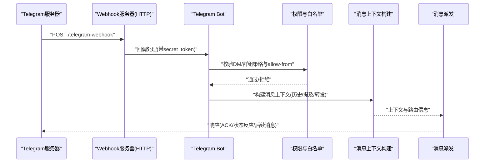
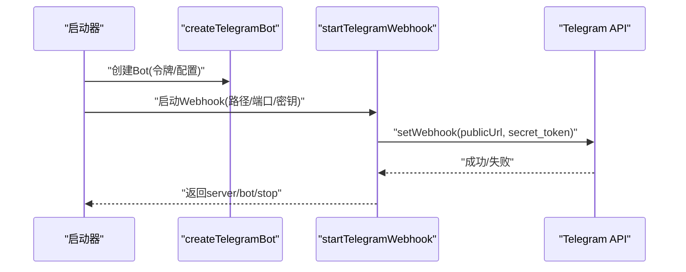
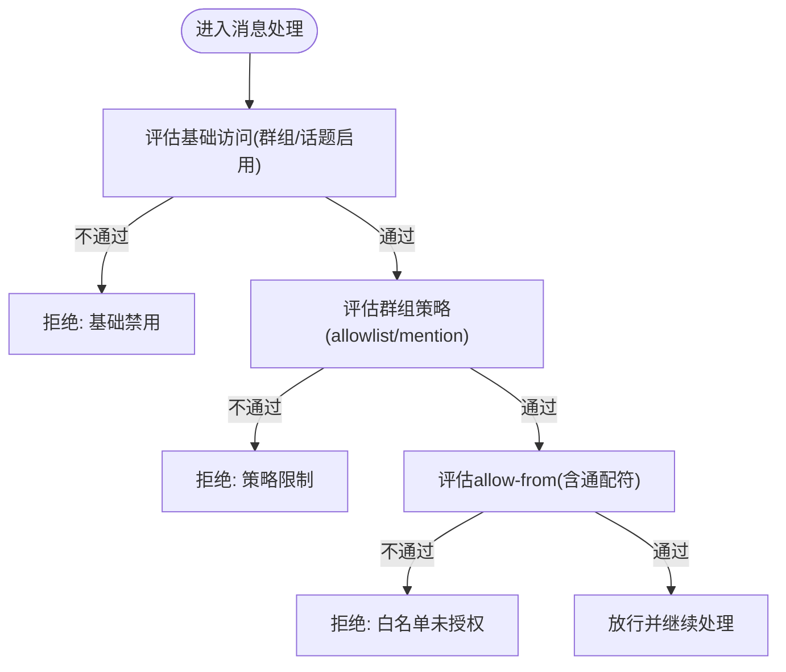
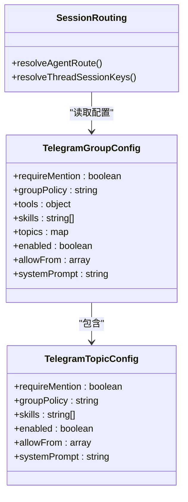
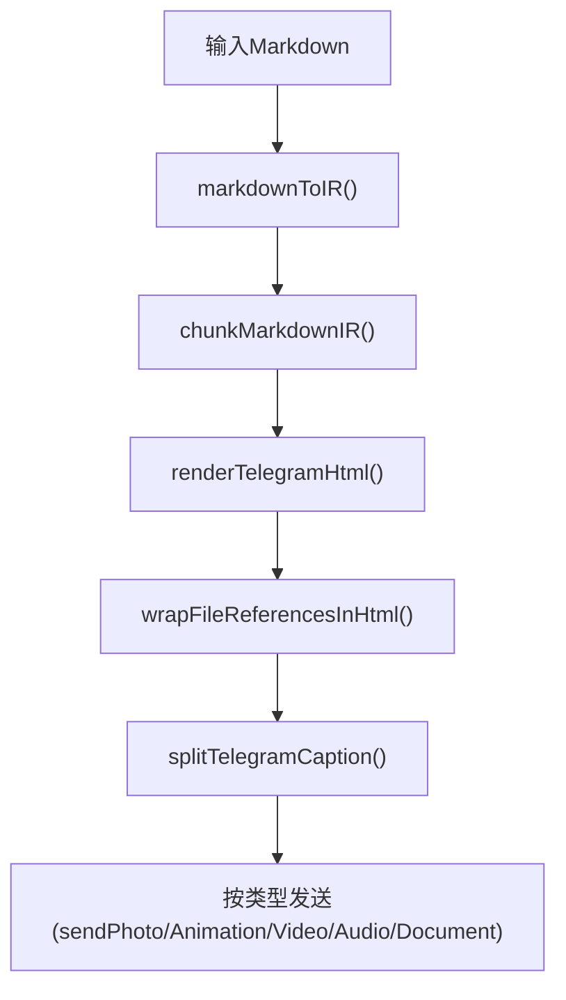
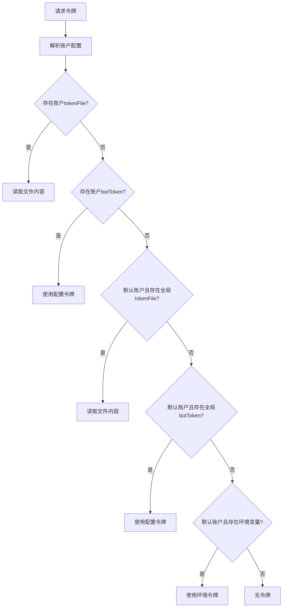
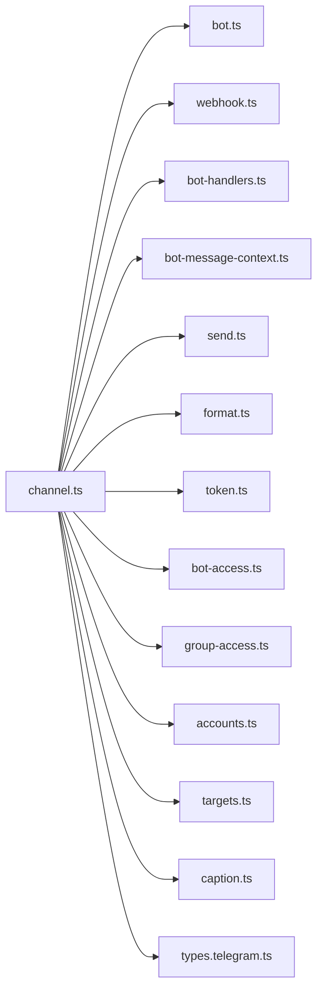

# Telegram频道实现

<cite>
**本文档引用的文件**
- [extensions/telegram/src/channel.ts](file://extensions/telegram/src/channel.ts)
- [src/telegram/bot.ts](file://src/telegram/bot.ts)
- [src/telegram/webhook.ts](file://src/telegram/webhook.ts)
- [src/telegram/accounts.ts](file://src/telegram/accounts.ts)
- [src/telegram/group-access.ts](file://src/telegram/group-access.ts)
- [src/telegram/bot-access.ts](file://src/telegram/bot-access.ts)
- [src/telegram/token.ts](file://src/telegram/token.ts)
- [src/telegram/format.ts](file://src/telegram/format.ts)
- [src/telegram/send.ts](file://src/telegram/send.ts)
- [src/telegram/bot-message.ts](file://src/telegram/bot-message.ts)
- [src/telegram/bot-handlers.ts](file://src/telegram/bot-handlers.ts)
- [src/telegram/bot-message-context.ts](file://src/telegram/bot-message-context.ts)
- [src/telegram/targets.ts](file://src/telegram/targets.ts)
- [src/telegram/caption.ts](file://src/telegram/caption.ts)
- [src/config/types.telegram.ts](file://src/config/types.telegram.ts)
- [src/telegram/webhook.test.ts](file://src/telegram/webhook.test.ts)
- [src/telegram/bot.create-telegram-bot.test.ts](file://src/telegram/bot.create-telegram-bot.test.ts)
- [src/telegram/bot.test.ts](file://src/telegram/bot.test.ts)
- [src/telegram/accounts.test.ts](file://src/telegram/accounts.test.ts)
- [src/config/telegram-webhook-port.test.ts](file://src/config/telegram-webhook-port.test.ts)
</cite>

## 目录

1. [简介](#简介)
2. [项目结构](#项目结构)
3. [核心组件](#核心组件)
4. [架构总览](#架构总览)
5. [详细组件分析](#详细组件分析)
6. [依赖关系分析](#依赖关系分析)
7. [性能考虑](#性能考虑)
8. [故障排除指南](#故障排除指南)
9. [结论](#结论)
10. [附录](#附录)

## 简介

本文件系统性阐述OpenClaw中Telegram频道的实现，涵盖Bot API集成、Webhook配置与消息处理机制，以及Telegram特有消息格式转换、用户身份验证、群组管理、allow-from白名单机制、媒体文件处理与用户权限管理。文档同时提供Telegram Bot创建、API令牌配置与Webhook设置的实际示例，以及常见问题解决方案与性能优化建议。

## 项目结构

OpenClaw的Telegram实现主要由两部分组成：

- 扩展层（extensions/telegram）：提供通道插件接口、配置模式、状态收集与运行时适配器，负责与OpenClaw主框架对接。
- 核心实现（src/telegram）：基于grammy构建的Telegram Bot实现，包含消息处理、Webhook启动、令牌解析、权限控制、媒体处理、消息格式化等。

```mermaid
graph TB
subgraph "扩展层"
EXT_CHANNEL["extensions/telegram/src/channel.ts"]
EXT_RUNTIME["extensions/telegram/src/runtime.ts"]
end
subgraph "核心实现"
CORE_BOT["src/telegram/bot.ts"]
CORE_WEBHOOK["src/telegram/webhook.ts"]
CORE_HANDLERS["src/telegram/bot-handlers.ts"]
CORE_CONTEXT["src/telegram/bot-message-context.ts"]
CORE_SEND["src/telegram/send.ts"]
CORE_FORMAT["src/telegram/format.ts"]
CORE_TOKEN["src/telegram/token.ts"]
CORE_ACCESS["src/telegram/bot-access.ts"]
CORE_GROUP_ACCESS["src/telegram/group-access.ts"]
CORE_ACCOUNTS["src/telegram/accounts.ts"]
CORE_TARGETS["src/telegram/targets.ts"]
CORE_CAPTION["src/telegram/caption.ts"]
CORE_TYPES["src/config/types.telegram.ts"]
end
EXT_CHANNEL --> CORE_BOT
EXT_CHANNEL --> CORE_WEBHOOK
EXT_CHANNEL --> CORE_HANDLERS
EXT_CHANNEL --> CORE_CONTEXT
EXT_CHANNEL --> CORE_SEND
EXT_CHANNEL --> CORE_FORMAT
EXT_CHANNEL --> CORE_TOKEN
EXT_CHANNEL --> CORE_ACCESS
EXT_CHANNEL --> CORE_GROUP_ACCESS
EXT_CHANNEL --> CORE_ACCOUNTS
EXT_CHANNEL --> CORE_TARGETS
EXT_CHANNEL --> CORE_CAPTION
EXT_CHANNEL --> CORE_TYPES
```

**图表来源**

- [extensions/telegram/src/channel.ts](file://extensions/telegram/src/channel.ts#L87-L570)
- [src/telegram/bot.ts](file://src/telegram/bot.ts#L116-L427)
- [src/telegram/webhook.ts](file://src/telegram/webhook.ts#L77-L283)
- [src/telegram/bot-handlers.ts](file://src/telegram/bot-handlers.ts#L102-L800)
- [src/telegram/bot-message-context.ts](file://src/telegram/bot-message-context.ts#L144-L783)
- [src/telegram/send.ts](file://src/telegram/send.ts#L459-L750)
- [src/telegram/format.ts](file://src/telegram/format.ts#L110-L266)
- [src/telegram/token.ts](file://src/telegram/token.ts#L19-L103)
- [src/telegram/bot-access.ts](file://src/telegram/bot-access.ts#L41-L94)
- [src/telegram/group-access.ts](file://src/telegram/group-access.ts#L21-L160)
- [src/telegram/accounts.ts](file://src/telegram/accounts.ts#L104-L159)
- [src/telegram/targets.ts](file://src/telegram/targets.ts#L91-L121)
- [src/telegram/caption.ts](file://src/telegram/caption.ts#L3-L16)
- [src/config/types.telegram.ts](file://src/config/types.telegram.ts#L53-L211)

**章节来源**

- [extensions/telegram/src/channel.ts](file://extensions/telegram/src/channel.ts#L87-L570)
- [src/telegram/bot.ts](file://src/telegram/bot.ts#L116-L427)
- [src/telegram/webhook.ts](file://src/telegram/webhook.ts#L77-L283)

## 核心组件

- 通道插件与运行时适配：提供Telegram通道的配置、校验、状态检查、消息动作适配、分组策略与线程支持等能力。
- Bot核心：基于grammy创建Bot实例，注册中间件、序列化执行、去重、更新偏移水位、错误捕获与日志记录。
- Webhook服务：本地HTTP服务器监听、Telegram Webhook注册、回调处理、健康检查端点、诊断事件记录。
- 权限与白名单：DM与群组的allow-from白名单、群组策略（open/disabled/allowlist）、提及要求、配对存储集成。
- 消息处理：消息上下文构建、历史上下文聚合、提及检测、命令授权、ACK反应、状态反应、转发与回复上下文。
- 媒体与格式化：媒体下载与类型识别、HTML渲染与Telegram兼容格式、分段发送、视频/语音/动图特殊处理、标题截断与后续文本分离。
- 令牌与账户：多源令牌解析（环境变量、tokenFile、配置）、账户列表与默认账户解析、重复令牌检测、登出清理。

**章节来源**

- [extensions/telegram/src/channel.ts](file://extensions/telegram/src/channel.ts#L87-L570)
- [src/telegram/bot.ts](file://src/telegram/bot.ts#L116-L427)
- [src/telegram/webhook.ts](file://src/telegram/webhook.ts#L77-L283)
- [src/telegram/bot-access.ts](file://src/telegram/bot-access.ts#L41-L94)
- [src/telegram/group-access.ts](file://src/telegram/group-access.ts#L21-L160)
- [src/telegram/bot-message-context.ts](file://src/telegram/bot-message-context.ts#L144-L783)
- [src/telegram/send.ts](file://src/telegram/send.ts#L459-L750)
- [src/telegram/format.ts](file://src/telegram/format.ts#L110-L266)
- [src/telegram/token.ts](file://src/telegram/token.ts#L19-L103)

## 架构总览

下图展示从外部请求到内部消息处理的端到端流程，包括Webhook接收、权限校验、消息上下文构建与派发。

**图表来源**

- [src/telegram/webhook.ts](file://src/telegram/webhook.ts#L126-L218)
- [src/telegram/bot-handlers.ts](file://src/telegram/bot-handlers.ts#L700-L800)
- [src/telegram/bot-message-context.ts](file://src/telegram/bot-message-context.ts#L144-L783)
- [src/telegram/bot.ts](file://src/telegram/bot.ts#L409-L424)

## 详细组件分析

### Bot API与Webhook集成

- Bot创建：初始化grammy Bot，应用API节流、错误捕获、去重与顺序化执行；注入消息处理器与原生命令。
- Webhook启动：创建HTTP服务器，注册Telegram Webhook，设置secret_token与allowed_updates；提供健康检查端点；支持动态publicUrl与诊断事件。
- 回调处理：读取请求体、校验secret_token头、调用grammy回调、确保幂等响应、记录诊断事件。

**图表来源**

- [src/telegram/bot.ts](file://src/telegram/bot.ts#L116-L149)
- [src/telegram/webhook.ts](file://src/telegram/webhook.ts#L77-L120)
- [src/telegram/webhook.ts](file://src/telegram/webhook.ts#L236-L253)

**章节来源**

- [src/telegram/bot.ts](file://src/telegram/bot.ts#L116-L427)
- [src/telegram/webhook.ts](file://src/telegram/webhook.ts#L77-L283)
- [src/telegram/webhook.test.ts](file://src/telegram/webhook.test.ts#L259-L343)

### 用户身份验证与allow-from白名单

- 允许来源标准化：仅接受纯数字Telegram用户ID，自动去除前缀与通配符；对无效条目发出警告。
- DM策略：支持pairing/allowlist/open/disabled四种策略，结合配对存储与allow-from。
- 群组策略：groupPolicy支持open/disabled/allowlist，可按群组/话题覆盖；强制提及要求与空allowlist拒绝。
- 授权判定：综合基础访问（群组/话题启用状态）、策略授权与聊天允许列表，决定是否放行。

**图表来源**

- [src/telegram/group-access.ts](file://src/telegram/group-access.ts#L21-L160)
- [src/telegram/bot-access.ts](file://src/telegram/bot-access.ts#L41-L94)

**章节来源**

- [src/telegram/bot-access.ts](file://src/telegram/bot-access.ts#L41-L94)
- [src/telegram/group-access.ts](file://src/telegram/group-access.ts#L21-L160)

### 群组管理与权限控制

- 群组与话题配置：支持按群组/话题覆盖requireMention、groupPolicy、tools策略、skills过滤与systemPrompt。
- 会话键与路由：根据群组/论坛主题/DM线程生成会话键，支持模型与代理选择。
- 提及检测与门控：在群组中基于显式提及、正则匹配与预检转录结果判断是否需要提及。
- ACK与状态反应：根据配置与作用域决定是否发送ACK反应，支持状态反应变体与可用反应查询。

**图表来源**

- [src/config/types.telegram.ts](file://src/config/types.telegram.ts#L188-L205)
- [src/telegram/bot-message-context.ts](file://src/telegram/bot-message-context.ts#L254-L328)

**章节来源**

- [src/config/types.telegram.ts](file://src/config/types.telegram.ts#L188-L205)
- [src/telegram/bot-message-context.ts](file://src/telegram/bot-message-context.ts#L254-L328)

### 消息格式转换与媒体处理

- Markdown到HTML：将Markdown转换为Telegram兼容的HTML，处理链接、加粗、斜体、删除线、代码块、spoiler、引用等；自动包裹可能被误认为URL的文件引用。
- 分段发送：按字符限制拆分Markdown IR，支持表格模式；对超长caption分离为独立文本消息。
- 媒体处理：识别gif/image/video/audio/document，按类型选择sendAnimation/sendPhoto/sendVideo/sendAudio/sendDocument；支持asVoice/asVideoNote；处理标题长度限制与后续文本。
- 链接预览：根据配置控制是否显示链接预览。

**图表来源**

- [src/telegram/format.ts](file://src/telegram/format.ts#L110-L266)
- [src/telegram/send.ts](file://src/telegram/send.ts#L560-L750)
- [src/telegram/caption.ts](file://src/telegram/caption.ts#L3-L16)

**章节来源**

- [src/telegram/format.ts](file://src/telegram/format.ts#L110-L266)
- [src/telegram/send.ts](file://src/telegram/send.ts#L560-L750)
- [src/telegram/caption.ts](file://src/telegram/caption.ts#L3-L16)

### 令牌解析与账户管理

- 多源令牌解析：优先级为tokenFile > botToken > TELEGRAM_BOT_TOKEN（仅默认账户），支持账户级与全局级配置。
- 账户列表与默认账户：合并配置与绑定账户，解析默认账户；避免重复令牌共享。
- 登出清理：清除配置中的botToken字段，必要时删除空账户或整个section。

**图表来源**

- [src/telegram/token.ts](file://src/telegram/token.ts#L19-L103)
- [src/telegram/accounts.ts](file://src/telegram/accounts.ts#L104-L159)

**章节来源**

- [src/telegram/token.ts](file://src/telegram/token.ts#L19-L103)
- [src/telegram/accounts.ts](file://src/telegram/accounts.ts#L104-L159)

### 目标解析与线程/话题支持

- 目标解析：支持纯数字chatId、t.me链接、@username与内部前缀；支持`:topic:threadId`与`:threadId`两种话题语法。
- 聊天类型推断：根据chatId符号判断direct/group/unknown。
- 线程参数：根据DM与forum场景构建thread参数，避免静默错误。

**章节来源**

- [src/telegram/targets.ts](file://src/telegram/targets.ts#L91-L121)

## 依赖关系分析

- 组件耦合：通道插件与核心实现松耦合，通过运行时适配器与配置模式交互；核心实现内部模块职责清晰，消息处理链路自上而下。
- 外部依赖：grammy作为Bot框架；Node内置HTTP服务器；Telegram Bot API；可选代理与网络配置。
- 循环依赖：未发现循环导入；各模块通过函数与类型接口交互。

**图表来源**

- [extensions/telegram/src/channel.ts](file://extensions/telegram/src/channel.ts#L87-L570)
- [src/telegram/bot.ts](file://src/telegram/bot.ts#L116-L427)
- [src/telegram/webhook.ts](file://src/telegram/webhook.ts#L77-L283)
- [src/telegram/bot-handlers.ts](file://src/telegram/bot-handlers.ts#L102-L800)
- [src/telegram/bot-message-context.ts](file://src/telegram/bot-message-context.ts#L144-L783)
- [src/telegram/send.ts](file://src/telegram/send.ts#L459-L750)
- [src/telegram/format.ts](file://src/telegram/format.ts#L110-L266)
- [src/telegram/token.ts](file://src/telegram/token.ts#L19-L103)
- [src/telegram/bot-access.ts](file://src/telegram/bot-access.ts#L41-L94)
- [src/telegram/group-access.ts](file://src/telegram/group-access.ts#L21-L160)
- [src/telegram/accounts.ts](file://src/telegram/accounts.ts#L104-L159)
- [src/telegram/targets.ts](file://src/telegram/targets.ts#L91-L121)
- [src/telegram/caption.ts](file://src/telegram/caption.ts#L3-L16)
- [src/config/types.telegram.ts](file://src/config/types.telegram.ts#L53-L211)

**章节来源**

- [extensions/telegram/src/channel.ts](file://extensions/telegram/src/channel.ts#L87-L570)
- [src/telegram/bot.ts](file://src/telegram/bot.ts#L116-L427)
- [src/telegram/webhook.ts](file://src/telegram/webhook.ts#L77-L283)

## 性能考虑

- 序列化与去重：按chat/topic键序列化处理，避免并发冲突；维护pending update集合与安全水位，减少重复处理。
- 文本分段：合理设置textChunkLimit与分段策略，避免超长消息导致多次往返。
- 媒体批处理：媒体组缓冲与定时刷新，降低API调用次数；对不可恢复的媒体错误进行跳过与降级。
- 网络与代理：可配置timeoutSeconds与网络选项，必要时使用代理；对401等错误进行回退与熔断处理。
- 诊断与可观测性：启用诊断事件与心跳，记录处理耗时与错误，便于定位性能瓶颈。

[本节为通用指导，无需特定文件引用]

## 故障排除指南

- Webhook启动失败：检查webhookSecret非空、端口可用、publicUrl可达；查看setWebhook错误与日志。
- 401未授权：确认请求头x-telegram-bot-api-secret-token正确传递；核对secret_token配置。
- 消息未处理：检查allow-from与groupPolicy配置；确认提及要求与配对策略；查看诊断事件。
- 媒体发送失败：检查媒体大小限制、类型识别与网络代理；对gif/image/video/audio/document分别处理。
- 令牌问题：确认tokenFile存在且可读、botToken有效、环境变量TELEGRAM_BOT_TOKEN仅用于默认账户。

**章节来源**

- [src/telegram/webhook.ts](file://src/telegram/webhook.ts#L96-L101)
- [src/telegram/webhook.ts](file://src/telegram/webhook.ts#L191-L197)
- [src/telegram/send.ts](file://src/telegram/send.ts#L560-L750)
- [src/telegram/token.ts](file://src/telegram/token.ts#L47-L66)

## 结论

OpenClaw的Telegram实现以grammy为核心，结合严格的权限控制、灵活的消息格式化与媒体处理、完善的Webhook与诊断机制，提供了生产级的Telegram频道集成方案。通过allow-from白名单、群组策略与提及门控，既能保证安全性又能提升用户体验；通过分段发送与媒体批处理优化了性能与可靠性。

[本节为总结，无需特定文件引用]

## 附录

### 实际示例与最佳实践

- 创建Telegram Bot与获取令牌
  - 在Telegram中通过BotFather创建Bot，获取API令牌。
  - 将令牌配置到OpenClaw：可通过环境变量、tokenFile或配置文件；默认账户支持环境变量，其他账户需使用tokenFile或botToken。
- 配置Webhook
  - 设置channels.telegram.webhookUrl与webhookSecret；可选webhookPath、webhookHost与webhookPort（0表示随机端口）。
  - 启动后自动注册Telegram Webhook，本地监听HTTP端口并验证secret_token。
- 使用CLI添加账户
  - 使用CLI工具添加Telegram账户，指定名称、令牌或tokenFile；默认账户可直接使用环境变量。
- 安全与权限
  - DM策略：建议使用pairing或allowlist；open模式需配合allowFrom通配符。
  - 群组策略：推荐allowlist并配置requireMention；对允许的群组配置groupAllowFrom。
  - 避免重复令牌：同一令牌不应在多个账户间共享，系统会检测并提示。

**章节来源**

- [extensions/telegram/src/channel.ts](file://extensions/telegram/src/channel.ts#L242-L316)
- [src/config/types.telegram.ts](file://src/config/types.telegram.ts#L131-L138)
- [src/telegram/webhook.ts](file://src/telegram/webhook.ts#L95-L101)
- [src/telegram/token.ts](file://src/telegram/token.ts#L73-L99)
