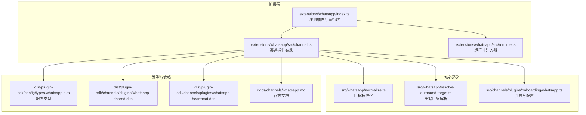
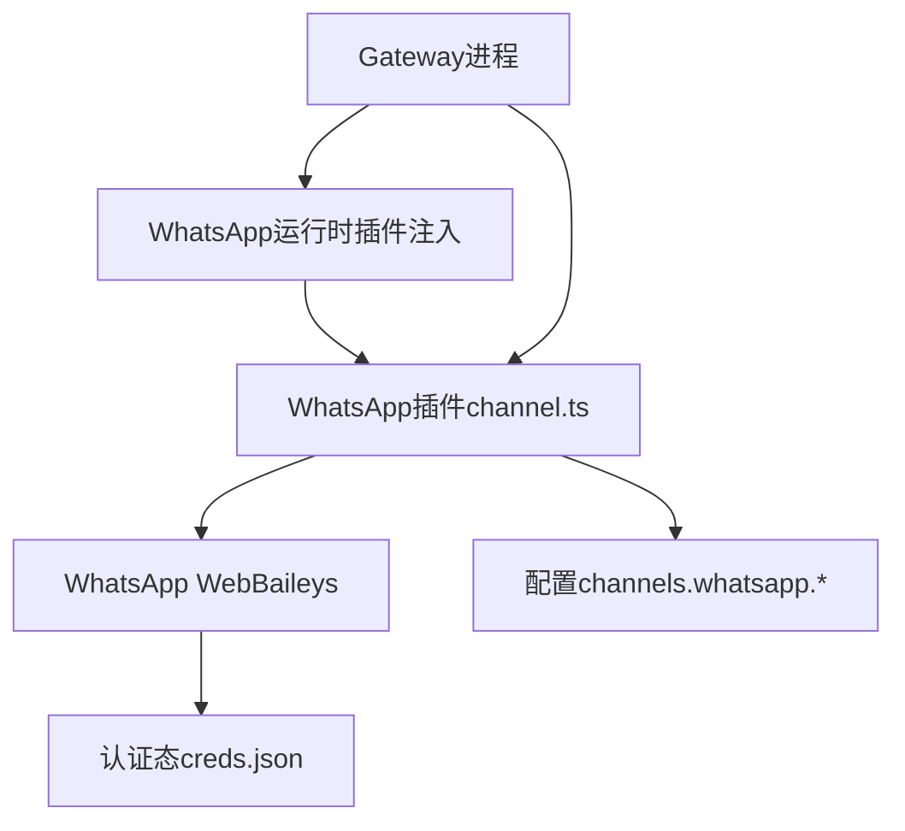
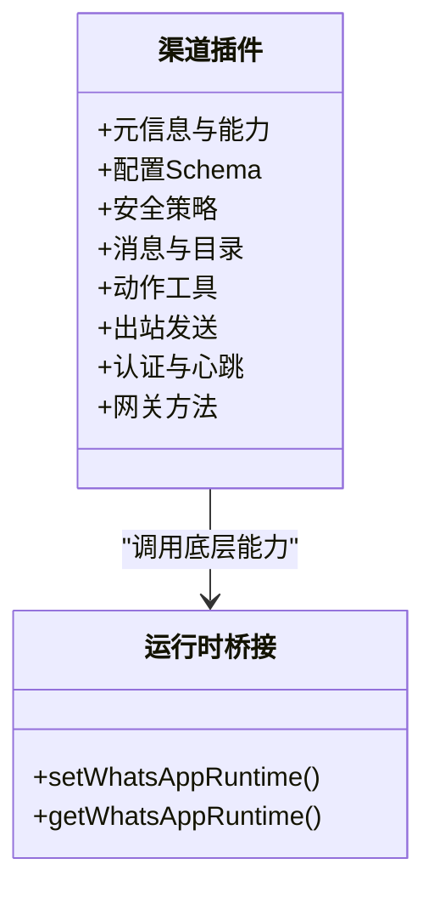
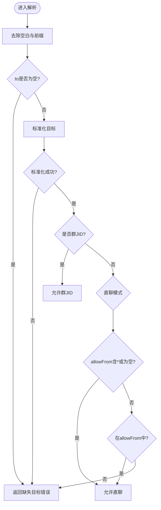
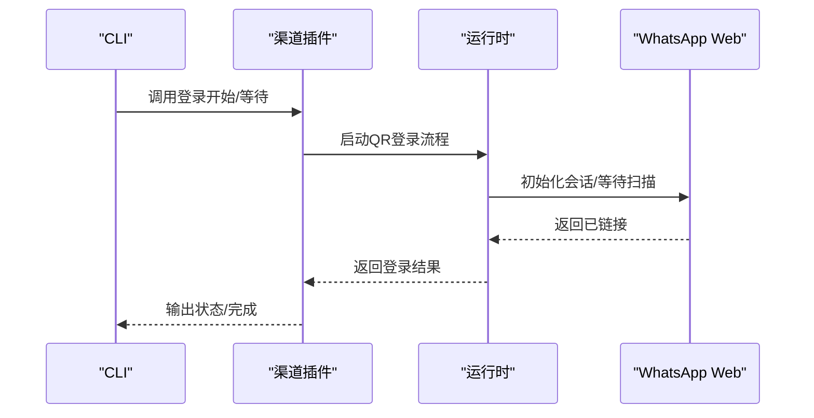
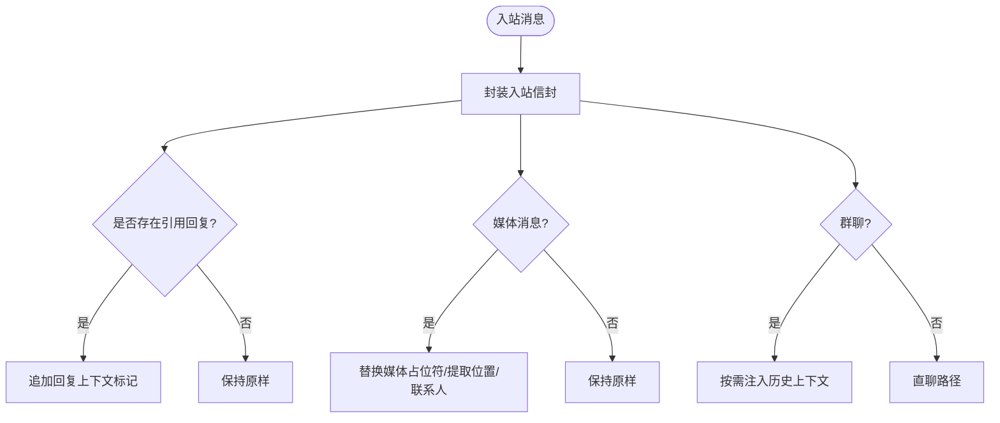
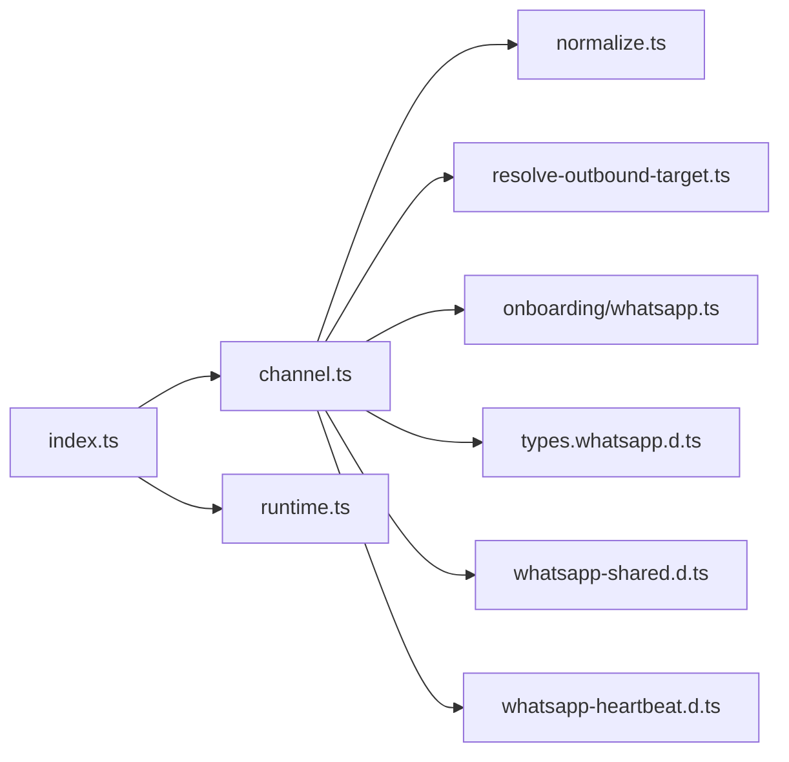

# WhatsApp频道实现

<cite>
**本文引用的文件**
- [index.ts](file://extensions/whatsapp/index.ts)
- [channel.ts](file://extensions/whatsapp/src/channel.ts)
- [runtime.ts](file://extensions/whatsapp/src/runtime.ts)
- [normalize.ts](file://src/whatsapp/normalize.ts)
- [resolve-outbound-target.ts](file://src/whatsapp/resolve-outbound-target.ts)
- [whatsapp.md](file://docs/channels/whatsapp.md)
- [whatsapp.ts](file://src/channels/plugins/onboarding/whatsapp.ts)
- [types.whatsapp.d.ts](file://dist/plugin-sdk/config/types.whatsapp.d.ts)
- [whatsapp-shared.d.ts](file://dist/plugin-sdk/channels/plugins/whatsapp-shared.d.ts)
- [whatsapp-heartbeat.d.ts](file://dist/plugin-sdk/channels/plugins/whatsapp-heartbeat.d.ts)
- [whatsapp-actions-D8QhABKK.js](file://dist/whatsapp-actions-D8QhABKK.js)
</cite>

## 目录

1. [简介](#简介)
2. [项目结构](#项目结构)
3. [核心组件](#核心组件)
4. [架构总览](#架构总览)
5. [组件详解](#组件详解)
6. [依赖关系分析](#依赖关系分析)
7. [性能与可靠性](#性能与可靠性)
8. [故障排除指南](#故障排除指南)
9. [结论](#结论)
10. [附录](#附录)

## 简介

本文件系统性梳理并文档化了OpenClaw中WhatsApp频道（基于WhatsApp Web，使用Baileys）的实现与运行机制，覆盖消息发送、接收、状态跟踪、认证与心跳、连接管理、消息格式标准化、用户身份映射与群组路由、配置与Webhook、以及错误处理与最佳实践。目标是帮助开发者与运维人员快速理解并稳定部署WhatsApp频道。

## 项目结构

WhatsApp频道由“扩展插件”和“核心通道实现”两部分组成：

- 扩展插件：负责注册渠道、桥接运行时、暴露登录/心跳/状态等能力。
- 核心通道：负责消息归一化、出站目标解析、安全策略、动作工具等。

**图表来源**

- [index.ts](file://extensions/whatsapp/index.ts#L1-L18)
- [channel.ts](file://extensions/whatsapp/src/channel.ts#L1-L460)
- [runtime.ts](file://extensions/whatsapp/src/runtime.ts#L1-L15)
- [normalize.ts](file://src/whatsapp/normalize.ts#L1-L81)
- [resolve-outbound-target.ts](file://src/whatsapp/resolve-outbound-target.ts#L1-L53)
- [whatsapp.ts](file://src/channels/plugins/onboarding/whatsapp.ts#L1-L200)
- [types.whatsapp.d.ts](file://dist/plugin-sdk/config/types.whatsapp.d.ts#L1-L102)
- [whatsapp-shared.d.ts](file://dist/plugin-sdk/channels/plugins/whatsapp-shared.d.ts#L1-L6)
- [whatsapp-heartbeat.d.ts](file://dist/plugin-sdk/channels/plugins/whatsapp-heartbeat.d.ts#L1-L12)
- [whatsapp.md](file://docs/channels/whatsapp.md#L1-L445)

**章节来源**

- [index.ts](file://extensions/whatsapp/index.ts#L1-L18)
- [channel.ts](file://extensions/whatsapp/src/channel.ts#L1-L460)
- [runtime.ts](file://extensions/whatsapp/src/runtime.ts#L1-L15)
- [normalize.ts](file://src/whatsapp/normalize.ts#L1-L81)
- [resolve-outbound-target.ts](file://src/whatsapp/resolve-outbound-target.ts#L1-L53)
- [whatsapp.ts](file://src/channels/plugins/onboarding/whatsapp.ts#L1-L200)
- [types.whatsapp.d.ts](file://dist/plugin-sdk/config/types.whatsapp.d.ts#L1-L102)
- [whatsapp-shared.d.ts](file://dist/plugin-sdk/channels/plugins/whatsapp-shared.d.ts#L1-L6)
- [whatsapp-heartbeat.d.ts](file://dist/plugin-sdk/channels/plugins/whatsapp-heartbeat.d.ts#L1-L12)
- [whatsapp.md](file://docs/channels/whatsapp.md#L1-L445)

## 核心组件

- 渠道插件：定义渠道元数据、能力、配置模式、安全策略、消息编排、动作工具、心跳与状态、网关方法等。
- 运行时桥接：通过set/get注入WhatsApp运行时，供插件调用底层能力（如登录、监听、发送、心跳）。
- 目标标准化与出站解析：统一输入的目标标识（E.164或群JID），并结合allowFrom进行授权校验。
- 引导与配置：提供向导式配置、自检、账户管理、默认值与迁移等。

**章节来源**

- [channel.ts](file://extensions/whatsapp/src/channel.ts#L39-L460)
- [runtime.ts](file://extensions/whatsapp/src/runtime.ts#L1-L15)
- [normalize.ts](file://src/whatsapp/normalize.ts#L55-L80)
- [resolve-outbound-target.ts](file://src/whatsapp/resolve-outbound-target.ts#L8-L52)
- [whatsapp.ts](file://src/channels/plugins/onboarding/whatsapp.ts#L254-L289)

## 架构总览

WhatsApp频道采用“网关持有会话”的架构：Gateway启动并维护WhatsApp Web连接，监听入站消息；出站消息需在目标账号存在活动监听的前提下发送；状态与心跳用于健康检查与告警；动作工具支持反应、投票等。

**图表来源**

- [channel.ts](file://extensions/whatsapp/src/channel.ts#L422-L458)
- [whatsapp.md](file://docs/channels/whatsapp.md#L126-L133)

**章节来源**

- [channel.ts](file://extensions/whatsapp/src/channel.ts#L422-L458)
- [whatsapp.md](file://docs/channels/whatsapp.md#L126-L133)

## 组件详解

### 渠道插件（channel.ts）

- 元信息与能力：声明支持直聊/群聊、投票、反应、媒体等能力，并强制绑定账户、优先会话查找等。
- 配置Schema与账户管理：构建配置Schema，支持列出/默认账户、启用/删除账户、描述账户、解析默认投递目标等。
- 安全策略：解析DM策略（pairing/allowlist/open/disabled）、允许来源、配对提示、E.164规范化；收集组策略警告。
- 消息与目录：消息归一化、目标解析器、目录（自已、联系人、群组）。
- 动作工具：根据actions门控返回可用动作（react/poll），执行反应等操作。
- 出站发送：文本/媒体/投票发送，分块策略（默认4000字符），支持gif回放。
- 认证与心跳：登录（QR）、检查就绪、心跳收件人解析、状态汇总与快照。
- 网关方法：启动账户监听、QR登录开始/等待、登出。

**图表来源**

- [channel.ts](file://extensions/whatsapp/src/channel.ts#L39-L460)
- [runtime.ts](file://extensions/whatsapp/src/runtime.ts#L1-L15)

**章节来源**

- [channel.ts](file://extensions/whatsapp/src/channel.ts#L39-L460)
- [runtime.ts](file://extensions/whatsapp/src/runtime.ts#L1-L15)

### 目标标准化与出站解析（normalize.ts / resolve-outbound-target.ts）

- 标准化规则：
  - 去除前缀（如whatsapp:），识别群JID（以@g.us结尾且本地段符合规则）、用户JID（s.whatsapp.net或@lid）。
  - 用户JID提取手机号并规范化为E.164；非JID字符串若含@则拒绝。
- 出站目标解析：
  - 若目标为群JID，直接允许。
  - 直聊场景：若allowFrom包含通配符或为空，则允许；否则必须在allowFrom列表中。
  - 无目标或无法标准化时返回缺失目标错误。

**图表来源**

- [normalize.ts](file://src/whatsapp/normalize.ts#L55-L80)
- [resolve-outbound-target.ts](file://src/whatsapp/resolve-outbound-target.ts#L8-L52)

**章节来源**

- [normalize.ts](file://src/whatsapp/normalize.ts#L1-L81)
- [resolve-outbound-target.ts](file://src/whatsapp/resolve-outbound-target.ts#L1-L53)

### 认证、心跳与连接管理

- 登录（QR）：插件暴露login.start/wait方法，配合运行时执行QR登录流程。
- 就绪检查：校验通道启用、已链接（auth存在）、有活动监听，三者满足才视为就绪。
- 心跳收件人：支持按配置解析心跳通知收件人，可限定单个或全部账户。
- 状态汇总：聚合链接状态、认证年龄、自已身份、运行/连接状态、错误等。

**图表来源**

- [channel.ts](file://extensions/whatsapp/src/channel.ts#L441-L449)
- [channel.ts](file://extensions/whatsapp/src/channel.ts#L318-L328)

**章节来源**

- [channel.ts](file://extensions/whatsapp/src/channel.ts#L318-L350)
- [channel.ts](file://extensions/whatsapp/src/channel.ts#L422-L458)

### 消息格式标准化、用户身份映射与群组路由

- 格式标准化：入站消息包裹通用信封；回复上下文追加“回复到...”标记；媒体仅消息体替换占位符；位置/联系人转文本上下文。
- 自己聊天保护：当自已号码在allowFrom中时，跳过自聊已读回执、避免自触发提及、默认回复前缀可按身份推断。
- 群组路由：默认群会话隔离；支持历史上下文注入（可配置上限）；提及/回复激活策略可配置。

**图表来源**

- [whatsapp.md](file://docs/channels/whatsapp.md#L210-L290)

**章节来源**

- [whatsapp.md](file://docs/channels/whatsapp.md#L210-L290)

### 配置、Webhook与错误处理

- 配置要点：访问控制（dmPolicy/allowFrom/groupPolicy/groupAllowFrom/groups）、投递（textChunkLimit/chunkMode/mediaMaxMb/sendReadReceipts/ackReaction）、多账户（accounts.\*）、运行参数（configWrites/debounceMs/web.heartbeat等）、会话行为（session.dmScope/historyLimit等）。
- Webhook：官方文档未见独立Webhook端点说明，当前实现以网关主动监听为主。
- 错误处理：缺失目标、未就绪、未链接、无活动监听、组策略不匹配、媒体失败降级（首项失败时发送文本警告）等均有明确分支与日志。

**章节来源**

- [whatsapp.md](file://docs/channels/whatsapp.md#L425-L438)
- [whatsapp.md](file://docs/channels/whatsapp.md#L317-L341)
- [whatsapp.md](file://docs/channels/whatsapp.md#L309-L315)

## 依赖关系分析

- 插件注册：index.ts导入channel与runtime，注册渠道插件并注入运行时。
- 插件实现：channel.ts依赖运行时提供的登录、监听、发送、心跳等能力；同时依赖核心通道的标准化与解析逻辑。
- 类型与共享：配置类型、共享常量、心跳解析函数由SDK类型文件提供，确保插件与运行时契约一致。
- 引导与配置：onboarding模块负责向导式配置、自检与默认策略迁移。

**图表来源**

- [index.ts](file://extensions/whatsapp/index.ts#L1-L18)
- [channel.ts](file://extensions/whatsapp/src/channel.ts#L1-L460)
- [runtime.ts](file://extensions/whatsapp/src/runtime.ts#L1-L15)
- [normalize.ts](file://src/whatsapp/normalize.ts#L1-L81)
- [resolve-outbound-target.ts](file://src/whatsapp/resolve-outbound-target.ts#L1-L53)
- [whatsapp.ts](file://src/channels/plugins/onboarding/whatsapp.ts#L1-L200)
- [types.whatsapp.d.ts](file://dist/plugin-sdk/config/types.whatsapp.d.ts#L1-L102)
- [whatsapp-shared.d.ts](file://dist/plugin-sdk/channels/plugins/whatsapp-shared.d.ts#L1-L6)
- [whatsapp-heartbeat.d.ts](file://dist/plugin-sdk/channels/plugins/whatsapp-heartbeat.d.ts#L1-L12)

**章节来源**

- [index.ts](file://extensions/whatsapp/index.ts#L1-L18)
- [channel.ts](file://extensions/whatsapp/src/channel.ts#L1-L460)
- [runtime.ts](file://extensions/whatsapp/src/runtime.ts#L1-L15)
- [normalize.ts](file://src/whatsapp/normalize.ts#L1-L81)
- [resolve-outbound-target.ts](file://src/whatsapp/resolve-outbound-target.ts#L1-L53)
- [whatsapp.ts](file://src/channels/plugins/onboarding/whatsapp.ts#L1-L200)
- [types.whatsapp.d.ts](file://dist/plugin-sdk/config/types.whatsapp.d.ts#L1-L102)
- [whatsapp-shared.d.ts](file://dist/plugin-sdk/channels/plugins/whatsapp-shared.d.ts#L1-L6)
- [whatsapp-heartbeat.d.ts](file://dist/plugin-sdk/channels/plugins/whatsapp-heartbeat.d.ts#L1-L12)

## 性能与可靠性

- 分块与媒体：默认文本分块4000字符，支持按换行分块；媒体自动优化与尺寸限制，失败时首项回退为文本警告，避免静默丢弃。
- 历史上下文：群组默认缓冲上限50条，可配置；DM历史可单独配置，减少重复上下文。
- 心跳与重连：心跳可见性与收件人可配置；连接断开后由网关负责重连循环，状态指标记录最后连接/断开时间与错误。
- 自身聊天保护：自已号码在allowFrom中时跳过自聊回执与自触发提及，降低误触发风险。

**章节来源**

- [whatsapp.md](file://docs/channels/whatsapp.md#L292-L315)
- [whatsapp.md](file://docs/channels/whatsapp.md#L241-L254)
- [whatsapp.md](file://docs/channels/whatsapp.md#L256-L289)

## 故障排除指南

- 未链接（需QR）：执行登录命令并确认状态；若仍显示未链接，重新登录。
- 已链接但断线/重连：运行诊断与跟随日志，必要时重新登录。
- 发送失败（无活动监听）：确保网关运行且目标账号已链接。
- 群消息被忽略：检查groupPolicy、groupAllowFrom/allowFrom、groups白名单、提及要求、JSON键重复导致覆盖。
- Bun运行时警告：建议使用Node，Bun可能不稳定。

**章节来源**

- [whatsapp.md](file://docs/channels/whatsapp.md#L373-L423)

## 结论

WhatsApp频道在OpenClaw中通过“插件+运行时”的方式，将WhatsApp Web（Baileys）能力与平台的配置、安全、消息编排、动作工具、心跳与状态等能力整合在一起。其设计强调：

- 明确的安全边界（DM/群策略、提及/回复激活、自已聊天保护）
- 可靠的消息编排（分块、媒体、历史上下文、ACK反应）
- 稳定的连接与可观测性（心跳、状态、重连）
- 易用的配置与引导（向导、默认策略、多账户）

## 附录

### 配置参考要点（摘自官方文档）

- 访问控制：dmPolicy、allowFrom、groupPolicy、groupAllowFrom、groups
- 投递行为：textChunkLimit、chunkMode、mediaMaxMb、sendReadReceipts、ackReaction
- 多账户：accounts.<id>.enabled、accounts.<id>.authDir、账户级覆盖
- 运行参数：configWrites、debounceMs、web.enabled、web.heartbeatSeconds、web.reconnect.\*
- 会话行为：session.dmScope、historyLimit、dmHistoryLimit、dms.<id>.historyLimit

**章节来源**

- [whatsapp.md](file://docs/channels/whatsapp.md#L425-L438)

### 动作工具与授权（摘要）

- 动作工具：react（反应）、poll（投票）受actions门控。
- 授权：工具参数中的chatJid需在账户allowFrom中，否则抛出授权错误。
- 执行：根据门控与参数解析后调用底层发送反应接口。

**章节来源**

- [whatsapp-actions-D8QhABKK.js](file://dist/whatsapp-actions-D8QhABKK.js#L85-L122)
