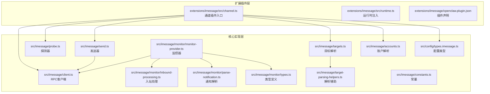
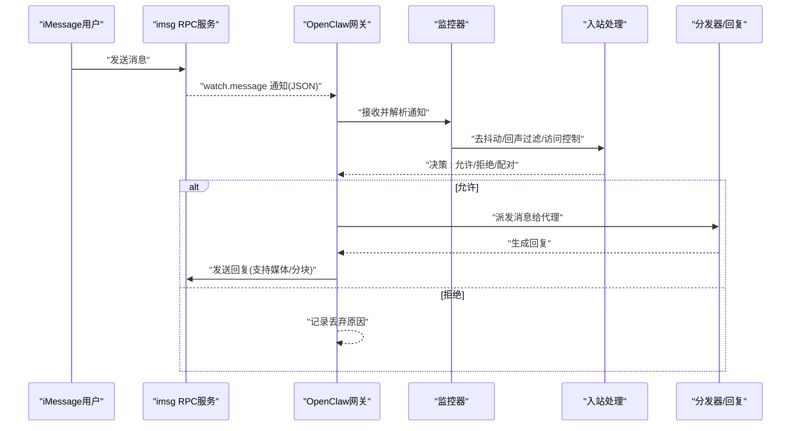
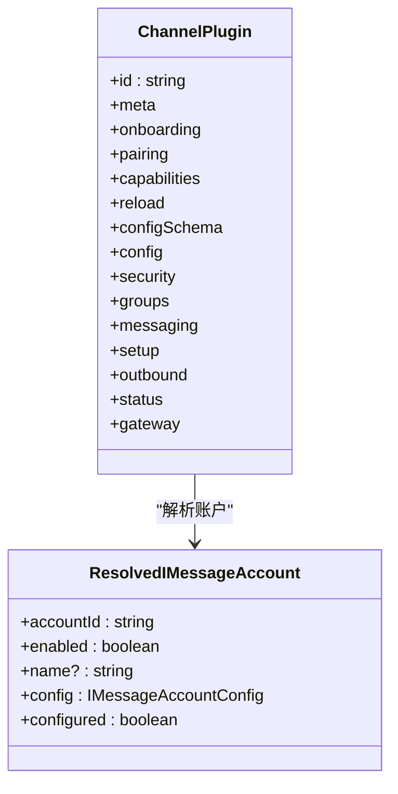
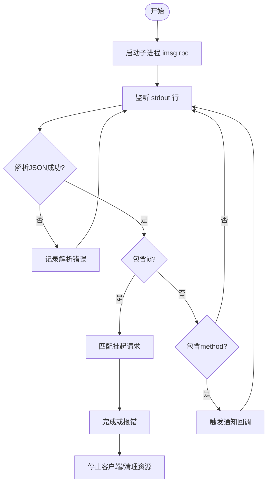
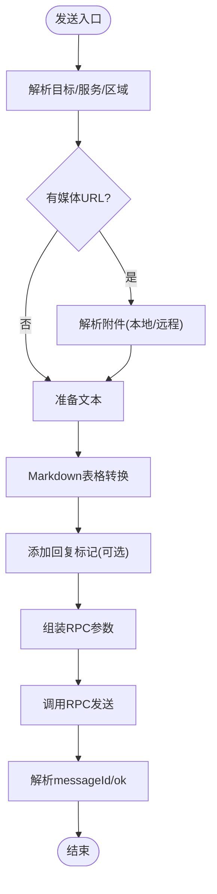
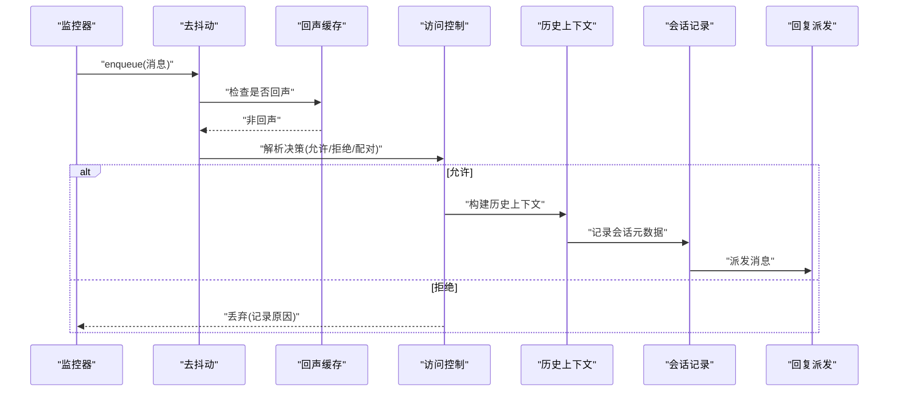
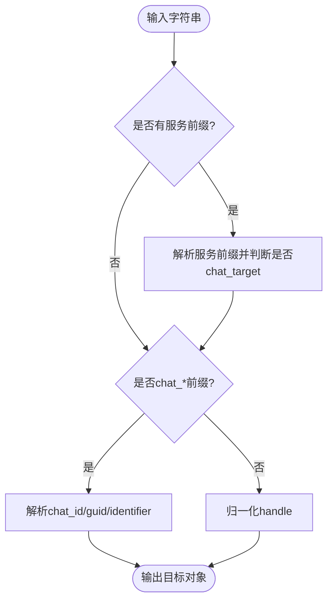
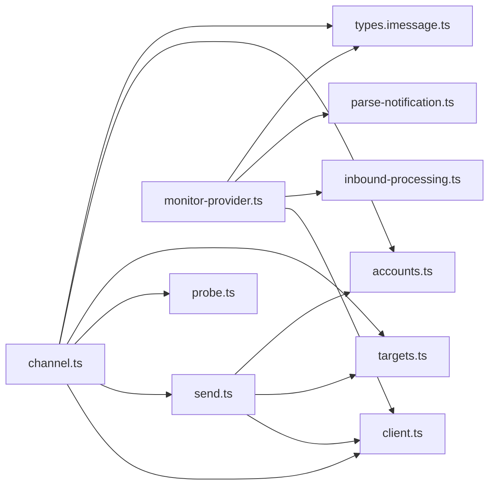

# iMessage频道实现

<cite>
**本文档引用的文件**
- [extensions/imessage/openclaw.plugin.json](file://extensions/imessage/openclaw.plugin.json)
- [extensions/imessage/src/channel.ts](file://extensions/imessage/src/channel.ts)
- [extensions/imessage/src/runtime.ts](file://extensions/imessage/src/runtime.ts)
- [src/imessage/accounts.ts](file://src/imessage/accounts.ts)
- [src/imessage/client.ts](file://src/imessage/client.ts)
- [src/imessage/constants.ts](file://src/imessage/constants.ts)
- [src/imessage/probe.ts](file://src/imessage/probe.ts)
- [src/imessage/send.ts](file://src/imessage/send.ts)
- [src/imessage/targets.ts](file://src/imessage/targets.ts)
- [src/imessage/target-parsing-helpers.ts](file://src/imessage/target-parsing-helpers.ts)
- [src/imessage/monitor/monitor-provider.ts](file://src/imessage/monitor/monitor-provider.ts)
- [src/imessage/monitor/inbound-processing.ts](file://src/imessage/monitor/inbound-processing.ts)
- [src/imessage/monitor/parse-notification.ts](file://src/imessage/monitor/parse-notification.ts)
- [src/imessage/monitor/types.ts](file://src/imessage/monitor/types.ts)
- [src/config/types.imessage.ts](file://src/config/types.imessage.ts)
- [docs/channels/imessage.md](file://docs/channels/imessage.md)
</cite>

## 目录

1. [简介](#简介)
2. [项目结构](#项目结构)
3. [核心组件](#核心组件)
4. [架构总览](#架构总览)
5. [详细组件分析](#详细组件分析)
6. [依赖关系分析](#依赖关系分析)
7. [性能考虑](#性能考虑)
8. [故障排除指南](#故障排除指南)
9. [结论](#结论)
10. [附录](#附录)

## 简介

本文件面向在 macOS 上通过 iMessage 频道与用户进行消息交互的实现，系统性阐述 OpenClaw 的 iMessage 集成架构与运行机制。内容涵盖：

- macOS iMessage API（通过外部 imsg CLI 的 JSON-RPC 接口）集成方式
- 联系人与目标解析、消息路由与会话管理
- iMessage 特有的消息格式、联系人标识与群组聊天策略
- macOS 权限与系统集成要点、消息转发与回执检测
- 实际配置、联系人设置与消息处理示例
- 系统要求与常见问题排查

## 项目结构

iMessage 频道由“扩展插件层”和“核心实现层”两部分组成：

- 扩展插件层：负责通道元数据、配置模式、配对流程、出站发送等
- 核心实现层：负责 RPC 客户端、探测、监控、入站处理、目标解析等

图表来源

- [extensions/imessage/src/channel.ts](file://extensions/imessage/src/channel.ts#L1-L305)
- [extensions/imessage/src/runtime.ts](file://extensions/imessage/src/runtime.ts#L1-L15)
- [src/imessage/client.ts](file://src/imessage/client.ts#L1-L256)
- [src/imessage/probe.ts](file://src/imessage/probe.ts#L1-L106)
- [src/imessage/send.ts](file://src/imessage/send.ts#L1-L191)
- [src/imessage/targets.ts](file://src/imessage/targets.ts#L1-L169)
- [src/imessage/target-parsing-helpers.ts](file://src/imessage/target-parsing-helpers.ts#L1-L133)
- [src/imessage/monitor/monitor-provider.ts](file://src/imessage/monitor/monitor-provider.ts#L1-L492)
- [src/imessage/monitor/inbound-processing.ts](file://src/imessage/monitor/inbound-processing.ts#L1-L491)
- [src/imessage/monitor/parse-notification.ts](file://src/imessage/monitor/parse-notification.ts#L1-L84)
- [src/imessage/monitor/types.ts](file://src/imessage/monitor/types.ts#L1-L41)
- [src/imessage/accounts.ts](file://src/imessage/accounts.ts#L1-L31)
- [src/config/types.imessage.ts](file://src/config/types.imessage.ts#L1-L88)
- [src/imessage/constants.ts](file://src/imessage/constants.ts#L1-L2)

章节来源

- [extensions/imessage/src/channel.ts](file://extensions/imessage/src/channel.ts#L1-L305)
- [src/imessage/monitor/monitor-provider.ts](file://src/imessage/monitor/monitor-provider.ts#L1-L492)

## 核心组件

- 通道插件（Channel Plugin）
  - 提供通道元信息、配对流程、能力声明、配置模式、消息路由与安全策略
  - 出站发送：文本与媒体消息封装、分块、最大字节限制
  - 状态探测：运行时状态收集、探针执行
- RPC 客户端（IMessageRpcClient）
  - 基于子进程与 JSON-RPC over stdio 的通信
  - 请求/响应、通知、超时与错误处理
- 探测器（probeIMessage）
  - 检测 imsg 可用性、RPC 支持与可用性
- 发送器（sendMessageIMessage）
  - 解析目标、服务与区域、附件处理、Markdown 表格转换、回复标记
- 目标解析（targets.ts）
  - 支持 handle、chat_id、chat_guid、chat_identifier 多种格式
  - 服务前缀（imessage:/sms:/auto:）、大小写不敏感规范化
- 入站监控（monitor-provider.ts）
  - 连接 imsg RPC、订阅 watch 事件、去抖动、回声过滤、会话记录、派发与回复
- 入站处理（inbound-processing.ts）
  - 访问控制（DM/群组策略）、提及检测、命令授权、历史上下文构建
- 配置类型（types.imessage.ts）
  - 账户级与全局级配置项：权限策略、附件根目录、媒体大小、文本分块等

章节来源

- [extensions/imessage/src/channel.ts](file://extensions/imessage/src/channel.ts#L31-L305)
- [src/imessage/client.ts](file://src/imessage/client.ts#L48-L256)
- [src/imessage/probe.ts](file://src/imessage/probe.ts#L67-L106)
- [src/imessage/send.ts](file://src/imessage/send.ts#L96-L191)
- [src/imessage/targets.ts](file://src/imessage/targets.ts#L79-L169)
- [src/imessage/monitor/monitor-provider.ts](file://src/imessage/monitor/monitor-provider.ts#L84-L492)
- [src/imessage/monitor/inbound-processing.ts](file://src/imessage/monitor/inbound-processing.ts#L88-L491)
- [src/config/types.imessage.ts](file://src/config/types.imessage.ts#L11-L88)

## 架构总览

下图展示从用户到 OpenClaw、再到 imsg RPC 的完整链路，以及回声检测、去抖动与会话记录的关键节点。

图表来源

- [src/imessage/monitor/monitor-provider.ts](file://src/imessage/monitor/monitor-provider.ts#L414-L486)
- [src/imessage/monitor/inbound-processing.ts](file://src/imessage/monitor/inbound-processing.ts#L104-L342)
- [src/imessage/send.ts](file://src/imessage/send.ts#L96-L191)

## 详细组件分析

### 通道插件与配置

- 插件元信息与别名、配对提示、能力声明（直聊/群组、媒体）
- 配置模式构建、账户列表与默认账户解析
- 安全策略：DM 策略、允许来源、警告提示
- 群组策略：是否需要提及、工具策略
- 消息路由：目标标准化、目标解析器
- 设置：账户应用名称、配置迁移
- 出站：直接投递、文本分块、媒体发送
- 状态：默认运行时快照、问题收集、探针、账户快照、状态解析

图表来源

- [extensions/imessage/src/channel.ts](file://extensions/imessage/src/channel.ts#L31-L188)
- [src/imessage/accounts.ts](file://src/imessage/accounts.ts#L7-L31)

章节来源

- [extensions/imessage/src/channel.ts](file://extensions/imessage/src/channel.ts#L31-L305)
- [src/imessage/accounts.ts](file://src/imessage/accounts.ts#L1-L31)

### RPC 客户端与探测

- RPC 客户端
  - 子进程启动 imsg rpc，stdio 读写 JSON-RPC
  - 请求计数器、挂起请求、超时、错误传播
  - 通知回调、关闭与清理
- 探测
  - 检测二进制存在、RPC 子命令支持、连接 chats.list

图表来源

- [src/imessage/client.ts](file://src/imessage/client.ts#L148-L247)
- [src/imessage/probe.ts](file://src/imessage/probe.ts#L67-L106)

章节来源

- [src/imessage/client.ts](file://src/imessage/client.ts#L48-L256)
- [src/imessage/probe.ts](file://src/imessage/probe.ts#L1-L106)

### 发送器与消息格式

- 目标解析：handle、chat_id、chat_guid、chat_identifier
- 服务与区域：imessage/sms/auto、region
- 附件处理：URL 解析、本地路径、MIME 类型、占位符
- Markdown 表格转换、回复标记（[[reply_to:...]]）预处理
- RPC 参数组装与结果解析（messageId/message_id/id/guid）

图表来源

- [src/imessage/send.ts](file://src/imessage/send.ts#L96-L191)
- [src/imessage/targets.ts](file://src/imessage/targets.ts#L79-L112)

章节来源

- [src/imessage/send.ts](file://src/imessage/send.ts#L1-L191)
- [src/imessage/targets.ts](file://src/imessage/targets.ts#L1-L169)

### 入站监控与处理

- 监控器
  - 等待传输就绪、建立 RPC 连接、订阅 watch
  - 去抖动（按对话键聚合）、回声过滤（最近发送比对）
  - 附件路径白名单校验、远程主机自动检测
- 入站处理
  - 访问控制：DM/群组策略、允许来源、存储来源
  - 提及检测（正则）、控制命令授权、历史上下文
  - 回复上下文（reply*to*\* 字段）、会话记录、回复派发

图表来源

- [src/imessage/monitor/monitor-provider.ts](file://src/imessage/monitor/monitor-provider.ts#L154-L412)
- [src/imessage/monitor/inbound-processing.ts](file://src/imessage/monitor/inbound-processing.ts#L104-L342)

章节来源

- [src/imessage/monitor/monitor-provider.ts](file://src/imessage/monitor/monitor-provider.ts#L1-L492)
- [src/imessage/monitor/inbound-processing.ts](file://src/imessage/monitor/inbound-processing.ts#L1-L491)

### 目标解析与联系人标识

- 支持多种目标格式：handle、chat_id、chat_guid、chat_identifier
- 服务前缀：imessage:/sms:/auto:，大小写不敏感
- 规范化：邮箱小写、E.164 格式、去除多余空白
- 允许来源解析：支持 handle 与 chat\_\* 前缀

图表来源

- [src/imessage/targets.ts](file://src/imessage/targets.ts#L79-L143)
- [src/imessage/target-parsing-helpers.ts](file://src/imessage/target-parsing-helpers.ts#L20-L98)

章节来源

- [src/imessage/targets.ts](file://src/imessage/targets.ts#L1-L169)
- [src/imessage/target-parsing-helpers.ts](file://src/imessage/target-parsing-helpers.ts#L1-L133)

### 群组聊天与消息路由

- 群组判定：is_group 或显式配置的 chat_id
- 群组策略：allowlist/open/disabled；提及检测（正则）
- 会话隔离：群组会话键包含 chat_id；DM 使用主会话
- 回复路由：基于原始 To/Provider 元数据回注到 iMessage

章节来源

- [src/imessage/monitor/inbound-processing.ts](file://src/imessage/monitor/inbound-processing.ts#L134-L199)
- [src/imessage/monitor/inbound-processing.ts](file://src/imessage/monitor/inbound-processing.ts#L323-L342)

## 依赖关系分析

- 插件层依赖核心实现层的 RPC、发送、探测、目标解析、监控与类型
- 核心实现层之间耦合度低，职责清晰：客户端独立、监控器自洽、处理器专注业务规则
- 配置类型贯穿两端，保证强类型约束

图表来源

- [extensions/imessage/src/channel.ts](file://extensions/imessage/src/channel.ts#L1-L27)
- [src/imessage/monitor/monitor-provider.ts](file://src/imessage/monitor/monitor-provider.ts#L44-L54)
- [src/imessage/send.ts](file://src/imessage/send.ts#L6-L8)

章节来源

- [extensions/imessage/src/channel.ts](file://extensions/imessage/src/channel.ts#L1-L305)
- [src/imessage/monitor/monitor-provider.ts](file://src/imessage/monitor/monitor-provider.ts#L1-L492)
- [src/imessage/send.ts](file://src/imessage/send.ts#L1-L191)

## 性能考虑

- 去抖动：减少高频连续消息的处理开销，仅在必要时合并
- 回声过滤：避免重复处理自身发出的消息
- 分块发送：根据 textChunkLimit 控制单次发送长度
- 附件路径白名单：降低无效 IO 与安全风险
- 超时控制：RPC 默认超时与可配置超时，避免阻塞

## 故障排除指南

- imsg 不可用或 RPC 不支持
  - 使用 `imsg rpc --help` 检查支持情况
  - 使用通道状态探针验证
- DM 被忽略
  - 检查 dmPolicy 与 allowFrom
  - 查看配对请求并批准
- 群组消息被忽略
  - 检查 groupPolicy、groupAllowFrom、mentionPatterns
  - 显式配置 chat_id 为群组行为
- 远程附件失败
  - 检查 remoteHost、remoteAttachmentRoots、SSH 密钥与 known_hosts
- macOS 权限提示遗漏
  - 在相同用户/会话上下文中重新执行 imsg 命令以触发权限弹窗

章节来源

- [docs/channels/imessage.md](file://docs/channels/imessage.md#L304-L360)
- [src/imessage/probe.ts](file://src/imessage/probe.ts#L67-L106)

## 结论

OpenClaw 的 iMessage 频道通过外部 imsg CLI 的 JSON-RPC 接口实现与 macOS Messages 的深度集成。其设计强调：

- 清晰的职责分离：插件层负责通道语义，核心层负责通信与业务规则
- 强大的访问控制：DM/群组双策略、允许来源、提及检测与命令授权
- 稳健的运行保障：去抖动、回声过滤、会话记录与错误日志
- 可扩展的配置：账户级与全局级配置覆盖权限、附件、媒体与路由

对于新部署，推荐优先采用 BlueBubbles 等替代方案；如需继续使用 imsg，请严格遵循权限与配置最佳实践。

## 附录

### 系统要求与权限

- Messages 已登录
- Full Disk Access（访问 Messages 数据库）
- Automation 权限（通过 Messages.app 发送消息）

章节来源

- [docs/channels/imessage.md](file://docs/channels/imessage.md#L117-L133)

### 配置参考要点

- 账户启用、CLI 路径、数据库路径
- DM/群组策略、允许来源、提及要求
- 附件根目录、远程主机、媒体大小限制
- 文本分块与超时

章节来源

- [src/config/types.imessage.ts](file://src/config/types.imessage.ts#L11-L88)
- [docs/channels/imessage.md](file://docs/channels/imessage.md#L288-L289)
