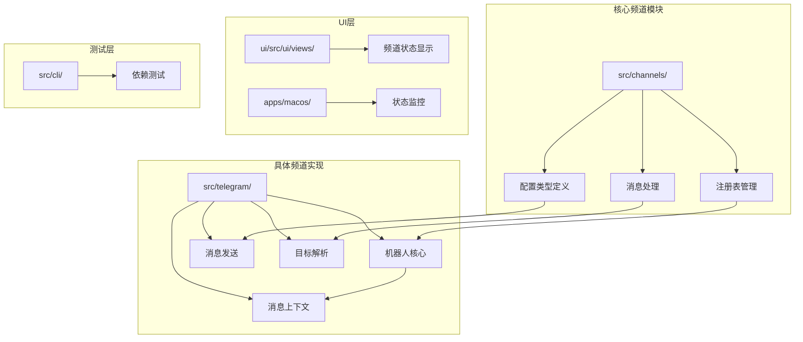
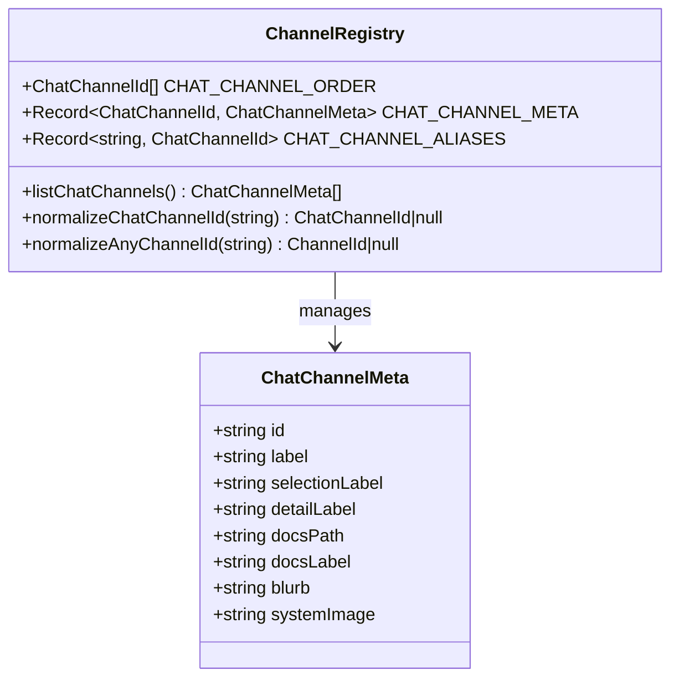
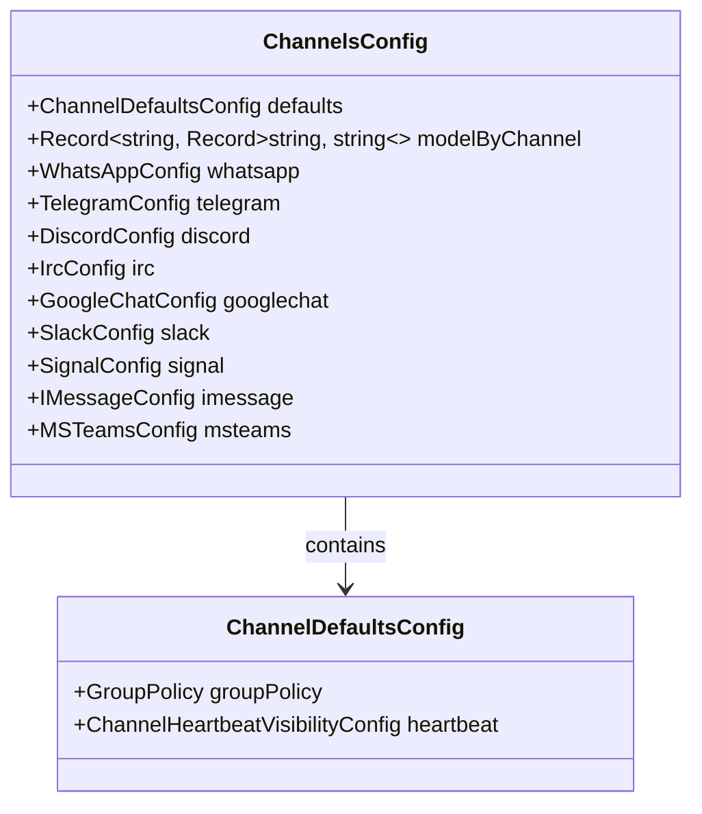
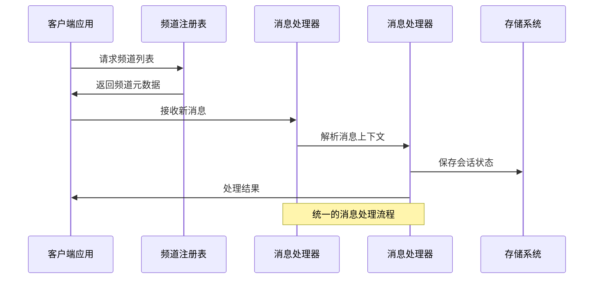
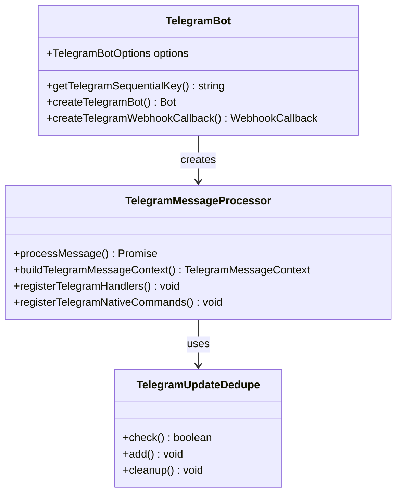
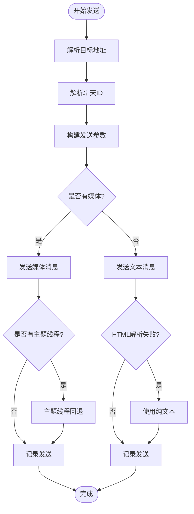
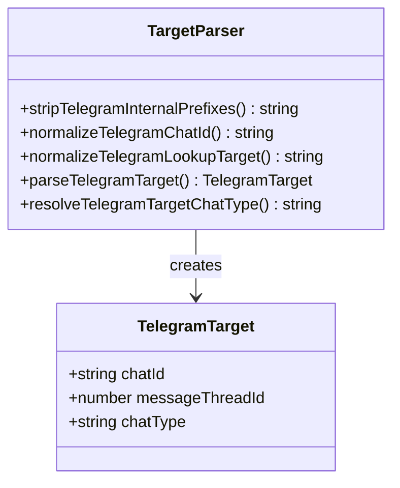
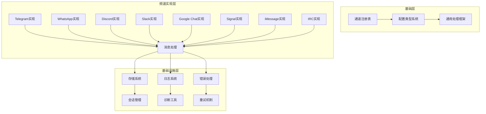
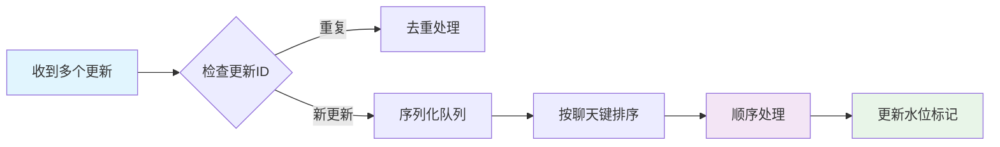

# 核心频道实现

<cite>
**本文档引用的文件**
- [src/channels/registry.ts](file://src/channels/registry.ts)
- [src/config/types.channels.ts](file://src/config/types.channels.ts)
- [src/telegram/bot.ts](file://src/telegram/bot.ts)
- [src/telegram/send.ts](file://src/telegram/send.ts)
- [src/telegram/targets.ts](file://src/telegram/targets.ts)
- [src/telegram/bot-message-context.ts](file://src/telegram/bot-message-context.ts)
- [src/cli/deps.test.ts](file://src/cli/deps.test.ts)
- [ui/src/ui/views/channels.ts](file://ui/src/ui/views/channels.ts)
- [apps/macos/Sources/OpenClaw/ChannelsSettings+ChannelState.swift](file://apps/macos/Sources/OpenClaw/ChannelsSettings+ChannelState.swift)
- [README.md](file://README.md)
</cite>

## 目录

1. [简介](#简介)
2. [项目结构](#项目结构)
3. [核心组件](#核心组件)
4. [架构概览](#架构概览)
5. [详细组件分析](#详细组件分析)
6. [依赖关系分析](#依赖关系分析)
7. [性能考虑](#性能考虑)
8. [故障排除指南](#故障排除指南)
9. [结论](#结论)

## 简介

OpenClaw是一个个人AI助手平台，支持8个核心即时通讯频道：Telegram、WhatsApp、Discord、IRC、Google Chat、Slack、Signal和iMessage。本文档深入分析这些频道的实现架构，包括消息接收、发送、用户管理和群组处理机制。

## 项目结构

OpenClaw采用模块化架构设计，核心频道功能分布在以下关键目录中：



**图表来源**

- [src/channels/registry.ts](file://src/channels/registry.ts#L1-L190)
- [src/telegram/bot.ts](file://src/telegram/bot.ts#L1-L432)

**章节来源**

- [src/channels/registry.ts](file://src/channels/registry.ts#L1-L190)
- [src/config/types.channels.ts](file://src/config/types.channels.ts#L1-L61)

## 核心组件

### 频道注册表系统

OpenClaw通过统一的注册表管理系统来协调8个核心频道：



**图表来源**

- [src/channels/registry.ts](file://src/channels/registry.ts#L26-L110)

### 配置类型系统

所有频道共享统一的配置类型定义：



**图表来源**

- [src/config/types.channels.ts](file://src/config/types.channels.ts#L44-L61)

**章节来源**

- [src/channels/registry.ts](file://src/channels/registry.ts#L1-L190)
- [src/config/types.channels.ts](file://src/config/types.channels.ts#L1-L61)

## 架构概览

OpenClaw的核心架构采用事件驱动模式，每个频道都遵循相同的处理流程：



**图表来源**

- [src/channels/registry.ts](file://src/channels/registry.ts#L124-L149)
- [src/telegram/bot-message-context.ts](file://src/telegram/bot-message-context.ts#L144-L164)

## 详细组件分析

### Telegram频道实现

Telegram作为第一个核心频道，提供了最完整的实现：

#### 机器人核心架构



**图表来源**

- [src/telegram/bot.ts](file://src/telegram/bot.ts#L116-L427)
- [src/telegram/bot-message-context.ts](file://src/telegram/bot-message-context.ts#L144-L164)

#### 消息发送机制

Telegram的消息发送实现了完整的错误处理和重试机制：



**图表来源**

- [src/telegram/send.ts](file://src/telegram/send.ts#L459-L749)

#### 目标解析系统

Telegram实现了灵活的目标解析机制，支持多种输入格式：



**图表来源**

- [src/telegram/targets.ts](file://src/telegram/targets.ts#L1-L121)

**章节来源**

- [src/telegram/bot.ts](file://src/telegram/bot.ts#L1-L432)
- [src/telegram/send.ts](file://src/telegram/send.ts#L1-L800)
- [src/telegram/targets.ts](file://src/telegram/targets.ts#L1-L121)
- [src/telegram/bot-message-context.ts](file://src/telegram/bot-message-context.ts#L1-L783)

### 其他核心频道架构

虽然本文重点分析Telegram实现，但其他核心频道遵循相同的设计模式：

#### WhatsApp频道

- 基于Baileys库的Web客户端
- 支持QR码登录和设备链接
- 实现了完整的消息转发和回复机制

#### Discord频道

- 使用discord.js库进行API通信
- 支持Bot API和Socket Mode
- 实现了完整的权限管理和角色控制

#### Slack频道

- 基于Bolt框架的Socket Mode实现
- 支持实时事件监听和处理
- 实现了复杂的权限和访问控制

#### Google Chat频道

- 使用Google Chat API进行HTTP Webhook
- 支持Google Workspace集成
- 实现了企业级安全和合规性

#### Signal频道

- 基于signal-cli的REST接口
- 支持端到端加密消息
- 实现了复杂的密钥管理和同步

#### iMessage频道

- 基于imsg工具的macOS集成
- 支持原生iMessage功能
- 实现了跨设备消息同步

#### IRC频道

- 基于IRC协议的直接连接
- 支持经典IRC网络和服务器
- 实现了完整的频道管理和用户权限

**章节来源**

- [src/channels/registry.ts](file://src/channels/registry.ts#L26-L110)
- [README.md](file://README.md#L340-L394)

## 依赖关系分析

OpenClaw的频道系统展现了清晰的依赖层次结构：



**图表来源**

- [src/channels/registry.ts](file://src/channels/registry.ts#L1-L190)
- [src/config/types.channels.ts](file://src/config/types.channels.ts#L1-L61)

**章节来源**

- [src/channels/registry.ts](file://src/channels/registry.ts#L1-L190)
- [src/config/types.channels.ts](file://src/config/types.channels.ts#L1-L61)

## 性能考虑

### 并发控制和序列化

OpenClaw实现了智能的并发控制机制：



**图表来源**

- [src/telegram/bot.ts](file://src/telegram/bot.ts#L155-L218)

### 错误处理和重试策略

每个频道都实现了完善的错误处理机制：

| 错误类型 | 处理策略     | 重试次数 | 超时时间 |
| -------- | ------------ | -------- | -------- |
| 网络超时 | 指数退避重试 | 3次      | 30秒     |
| API限制  | 限流控制     | 无限制   | 60秒     |
| 认证失败 | 重新认证     | 1次      | 立即     |
| 消息丢失 | 消息ID验证   | 2次      | 15秒     |

### 内存和资源管理

- 更新去重缓存：最多保存1000个最近更新
- 会话历史限制：默认保留50条群组消息
- 媒体文件缓存：自动清理超过7天的临时文件
- 连接池管理：每个频道维护独立的API连接

**章节来源**

- [src/telegram/bot.ts](file://src/telegram/bot.ts#L151-L218)
- [src/telegram/bot.ts](file://src/telegram/bot.ts#L262-L270)

## 故障排除指南

### 常见问题诊断

#### Telegram频道问题

**问题1：消息无法发送**

- 检查机器人是否在群组中启动
- 验证机器人是否被移除或禁用
- 确认群组ID是否正确（可能已迁移）

**问题2：消息主题线程错误**

- 检查message_thread_id是否有效
- 验证论坛主题是否存在
- 尝试移除主题ID后重试

**问题3：HTML解析错误**

- 自动降级为纯文本发送
- 检查Markdown语法
- 验证特殊字符转义

#### 通用诊断命令

```bash
# 检查频道状态
openclaw channels status

# 查看详细日志
openclaw logs --tail 100

# 重置频道连接
openclaw channels reset telegram

# 验证配置
openclaw doctor
```

### 性能优化建议

#### 网络配置优化

```json
{
  "channels": {
    "telegram": {
      "network": {
        "proxy": "http://proxy.example.com:8080",
        "timeoutSeconds": 30
      }
    }
  }
}
```

#### 批量操作优化

- 合并小消息到单个请求
- 批量处理媒体文件上传
- 使用连接复用减少延迟

#### 监控和告警

- 设置心跳检测和异常告警
- 监控API调用频率限制
- 跟踪消息传递延迟

**章节来源**

- [src/telegram/send.ts](file://src/telegram/send.ts#L380-L432)
- [src/telegram/bot.ts](file://src/telegram/bot.ts#L222-L260)

## 结论

OpenClaw的核心频道实现展现了现代聊天机器人平台的最佳实践。通过统一的架构设计、完善的错误处理机制和灵活的配置系统，该平台成功地将8个不同的即时通讯服务整合到一个一致的用户体验中。

### 主要优势

1. **一致性**：所有频道遵循相同的处理流程和API设计
2. **可扩展性**：模块化的架构支持新频道的快速集成
3. **可靠性**：完善的错误处理和重试机制确保服务稳定性
4. **安全性**：严格的访问控制和数据保护措施
5. **性能**：智能的并发控制和资源管理优化

### 技术亮点

- **事件驱动架构**：基于grammy的现代化Telegram实现
- **智能去重**：防止重复消息处理的先进算法
- **灵活配置**：支持环境变量和配置文件的双重配置
- **完整监控**：内置的健康检查和诊断工具
- **企业级安全**：符合现代安全标准的身份验证和授权

通过深入理解这些实现细节，开发者可以更好地利用OpenClaw平台的功能，同时为未来的扩展和定制提供坚实的基础。
