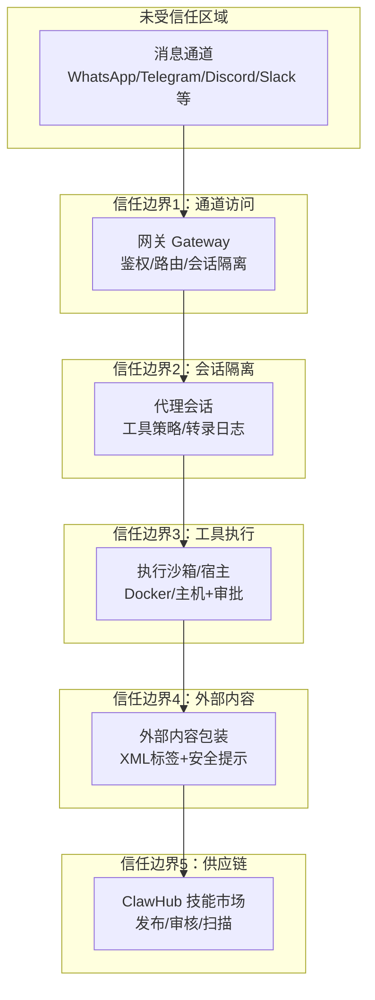
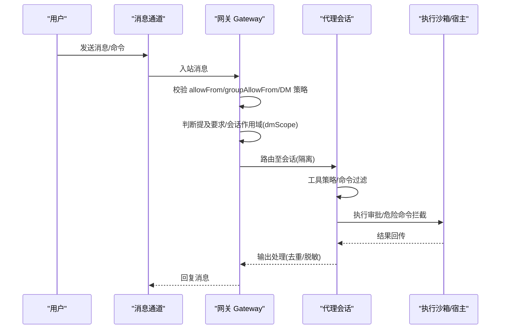
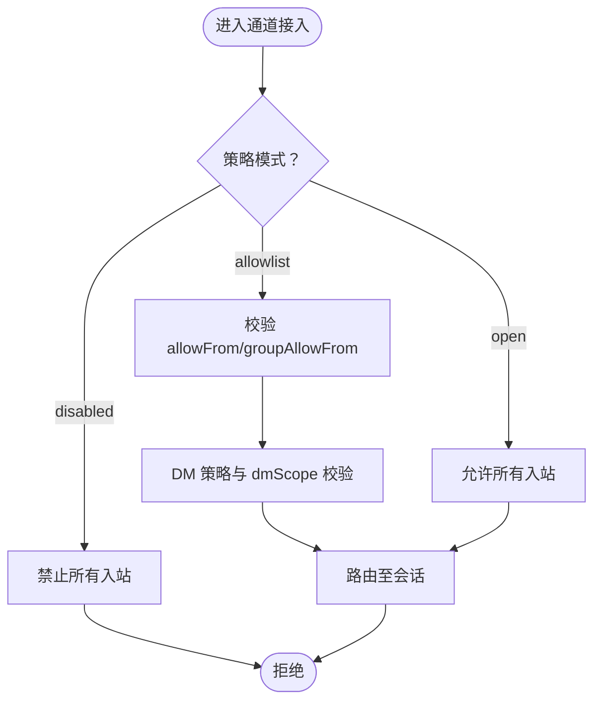
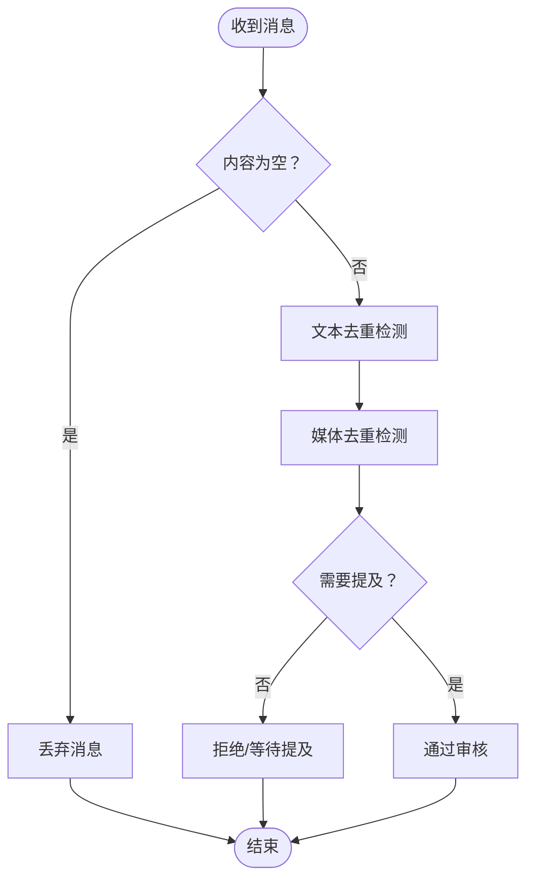
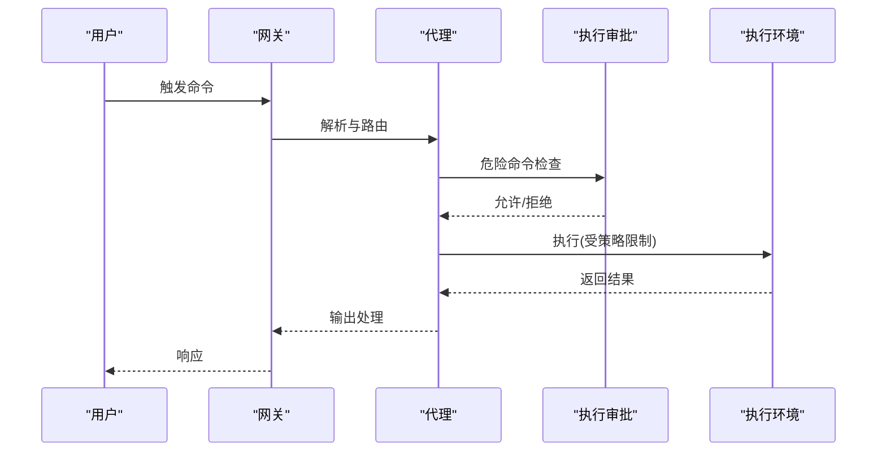
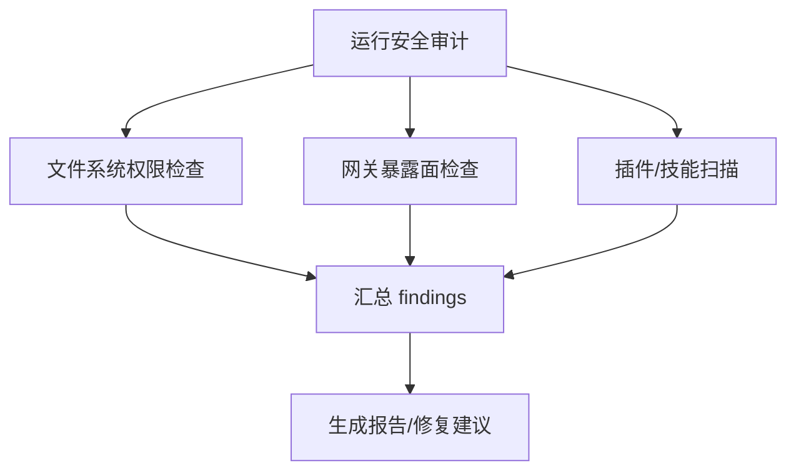
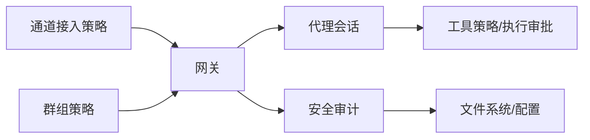

# 频道安全机制

<cite>
**本文档引用的文件**
- [src/security/audit.ts](file://src/security/audit.ts)
- [src/security/audit-channel.ts](file://src/security/audit-channel.ts)
- [src/config/group-policy.ts](file://src/config/group-policy.ts)
- [src/channels/plugins/onboarding/channel-access.ts](file://src/channels/plugins/onboarding/channel-access.ts)
- [src/channels/plugins/onboarding/channel-access-configure.ts](file://src/channels/plugins/onboarding/channel-access-configure.ts)
- [src/discord/monitor/message-handler.process.ts](file://src/discord/monitor/message-handler.process.ts)
- [src/agents/pi-embedded-helpers/messaging-dedupe.ts](file://src/agents/pi-embedded-helpers/messaging-dedupe.ts)
- [src/agents/pi-embedded-helpers.sanitizeuserfacingtext.test.ts](file://src/agents/pi-embedded-helpers.sanitizeuserfacingtext.test.ts)
- [src/auto-reply/reply/reply-payloads.test.ts](file://src/auto-reply/reply/reply-payloads.test.ts)
- [src/security/audit-extra.async.ts](file://src/security/audit-extra.async.ts)
- [src/security/audit-extra.sync.ts](file://src/security/audit-extra.sync.ts)
- [SECURITY.md](file://SECURITY.md)
- [docs/security/THREAT-MODEL-ATLAS.md](file://docs/security/THREAT-MODEL-ATLAS.md)
- [docs/zh-CN/gateway/security/index.md](file://docs/zh-CN/gateway/security/index.md)
- [src/logging/redact.ts](file://src/logging/redact.ts)
- [src/config/redact-snapshot.ts](file://src/config/redact-snapshot.ts)
- [src/cli/exec-approvals-cli.ts](file://src/cli/exec-approvals-cli.ts)
- [extensions/synology-chat/src/security.test.ts](file://extensions/synology-chat/src/security.test.ts)
</cite>

## 目录

1. [引言](#引言)
2. [项目结构](#项目结构)
3. [核心组件](#核心组件)
4. [架构总览](#架构总览)
5. [详细组件分析](#详细组件分析)
6. [依赖关系分析](#依赖关系分析)
7. [性能考虑](#性能考虑)
8. [故障排除指南](#故障排除指南)
9. [结论](#结论)
10. [附录](#附录)

## 引言

本文件系统化梳理 OpenClaw 的频道安全机制，围绕访问控制、权限管理、威胁防护展开，重点覆盖白名单系统、来源验证、命令过滤、提及过滤、消息审核与异常行为检测，并补充安全配置选项、风险评估、合规要求、安全审计工具、入侵检测与应急响应流程，以及数据加密、隐私保护与安全更新机制。

## 项目结构

OpenClaw 将“路由/网关”与“执行/代理”分离，形成多层信任边界：

- 通道入口层：各消息平台（如 Discord、Telegram、Slack 等）通过网关接入，进行身份与来源校验。
- 网关层：负责认证、路由、会话隔离、工具策略与外部内容包装。
- 执行层：代理在沙箱或宿主环境中执行工具调用，受执行审批与策略约束。
- 外部内容层：对外部抓取内容进行包装与安全提示，降低注入风险。
- 供应链层：ClawHub 技能市场采用发布与审核流程，逐步完善病毒扫描与签名等能力。

图示来源

- [docs/security/THREAT-MODEL-ATLAS.md](file://docs/security/THREAT-MODEL-ATLAS.md#L56-L123)

章节来源

- [docs/security/THREAT-MODEL-ATLAS.md](file://docs/security/THREAT-MODEL-ATLAS.md#L56-L123)

## 核心组件

- 访问控制与白名单
  - 通道接入策略：支持 open、disabled、allowlist 三种模式；允许按账户/群组/话题维度细化。
  - 入站来源校验：基于 allowFrom、groupAllowFrom、DM 策略与会话作用域（dmScope）控制。
  - 通道特定规则：Discord/Slack/Telegram 等对斜杠命令、公会/频道用户列表、名称匹配等进行安全检查。
- 权限管理与工具策略
  - 工具策略：全局与代理级工具配置、最小权限配置覆盖、沙箱工具策略叠加。
  - 执行审批：危险命令需经 allowlist 或交互式审批。
- 威胁防护与异常检测
  - 提及过滤：默认要求提及机器人，可按群组/通道覆盖。
  - 消息重复检测：文本归一化去重，避免刷屏与重复投递。
  - 外部内容包装：XML 标签与安全提示，降低注入风险。
  - 审计与告警：文件系统权限、网关暴露面、反向代理信任、日志文件可读性等自动发现。
- 数据与隐私
  - 日志脱敏：工具摘要脱敏、正则模式与掩码策略。
  - 配置快照还原：红化配置的还原与恢复流程。
- 合规与应急
  - 安全政策与报告流程、可信插件概念、操作指导与事件响应步骤。
  - 威胁模型与风险矩阵：明确关键攻击路径与缓解建议。

章节来源

- [src/config/group-policy.ts](file://src/config/group-policy.ts#L12-L429)
- [src/channels/plugins/onboarding/channel-access.ts](file://src/channels/plugins/onboarding/channel-access.ts#L1-L99)
- [src/security/audit-channel.ts](file://src/security/audit-channel.ts#L1-L669)
- [src/security/audit.ts](file://src/security/audit.ts#L1-L800)
- [src/logging/redact.ts](file://src/logging/redact.ts#L46-L82)
- [src/config/redact-snapshot.ts](file://src/config/redact-snapshot.ts#L405-L449)
- [SECURITY.md](file://SECURITY.md#L1-L268)

## 架构总览

下图展示从通道到执行的关键安全流程与决策点，强调白名单、来源验证、命令过滤与会话隔离。

图示来源

- [src/discord/monitor/message-handler.process.ts](file://src/discord/monitor/message-handler.process.ts#L60-L118)
- [src/security/audit-channel.ts](file://src/security/audit-channel.ts#L115-L176)
- [src/config/group-policy.ts](file://src/config/group-policy.ts#L325-L359)

## 详细组件分析

### 白名单系统与来源验证

- 通道接入策略
  - 支持三种策略：open（允许所有）、disabled（禁止所有）、allowlist（白名单）。
  - onboarding 流程提供交互式配置，支持逗号分隔条目输入与格式化。
- 来源验证
  - allowFrom：按通道/账户/群组/话题维度配置允许发送者。
  - groupAllowFrom：群组级来源过滤，结合 groupPolicy 实现 sender-level 过滤。
  - DM 策略：dmPolicy=open/disable，配合 allowFrom 中的通配符与会话作用域（dmScope）控制跨用户上下文泄漏。
- 通道特定规则
  - Discord：斜杠命令启用时，若未配置 owner allowFrom 或 per-guild/channel 用户 allowlist，则发出高危/警告提示。
  - Slack：slash 命令启用且 useAccessGroups 关闭时，存在绕过访问组的风险。
  - Telegram：群组命令需显式 allowlist，否则允许任意成员触发命令；非数值用户 ID 将被标记为无效。

图示来源

- [src/channels/plugins/onboarding/channel-access.ts](file://src/channels/plugins/onboarding/channel-access.ts#L17-L98)
- [src/channels/plugins/onboarding/channel-access-configure.ts](file://src/channels/plugins/onboarding/channel-access-configure.ts#L5-L41)
- [src/security/audit-channel.ts](file://src/security/audit-channel.ts#L115-L176)

章节来源

- [src/channels/plugins/onboarding/channel-access.ts](file://src/channels/plugins/onboarding/channel-access.ts#L1-L99)
- [src/channels/plugins/onboarding/channel-access-configure.ts](file://src/channels/plugins/onboarding/channel-access-configure.ts#L5-L41)
- [src/security/audit-channel.ts](file://src/security/audit-channel.ts#L178-L665)

### 提及过滤与消息审核

- 提及过滤
  - 默认要求提及机器人，可通过 groupPolicy/requireMention 覆盖。
  - 若 DM 作用域设置为 main 且存在多用户 DM，发出警告建议改为 per-channel-peer 等更严格的隔离。
- 消息重复检测
  - 文本归一化（去空白、小写、去表情、压缩空格），判断是否为重复内容，避免刷屏与重复投递。
  - 媒体去重：对媒体 URL 进行去重处理，避免重复发送相同图片/视频。
- 外部内容包装
  - 对 fetched 内容进行 XML 包装与安全提示，降低注入风险。

图示来源

- [src/discord/monitor/message-handler.process.ts](file://src/discord/monitor/message-handler.process.ts#L107-L118)
- [src/agents/pi-embedded-helpers/messaging-dedupe.ts](file://src/agents/pi-embedded-helpers/messaging-dedupe.ts#L1-L46)
- [src/auto-reply/reply/reply-payloads.test.ts](file://src/auto-reply/reply/reply-payloads.test.ts#L1-L77)

章节来源

- [src/agents/pi-embedded-helpers/messaging-dedupe.ts](file://src/agents/pi-embedded-helpers/messaging-dedupe.ts#L1-L46)
- [src/auto-reply/reply/reply-payloads.test.ts](file://src/auto-reply/reply/reply-payloads.test.ts#L1-L77)
- [src/security/audit-channel.ts](file://src/security/audit-channel.ts#L163-L175)

### 命令过滤与执行审批

- 工具策略与最小权限
  - 全局 tools.profile 与代理级覆盖，结合沙箱工具策略叠加，确保最小授权。
- 执行审批
  - 危险命令需经 allowlist 或交互式审批；CLI 提供添加/移除 allowlist 条目的能力。
- 通道命令安全
  - Discord/Slack 等启用斜杠命令时，若未配置 allowlist，将触发严重/警告提示，建议通过 pairing 或 allowlist 精确授权。

图示来源

- [src/cli/exec-approvals-cli.ts](file://src/cli/exec-approvals-cli.ts#L300-L482)
- [src/security/audit-channel.ts](file://src/security/audit-channel.ts#L352-L384)

章节来源

- [src/cli/exec-approvals-cli.ts](file://src/cli/exec-approvals-cli.ts#L300-L482)
- [src/security/audit-channel.ts](file://src/security/audit-channel.ts#L352-L384)

### 安全审计与入侵检测

- 文件系统与配置安全
  - 自动检查 state/config 目录与文件权限、日志文件可读性、auth-profiles.json 权限等。
- 网关暴露面与反向代理信任
  - 检测 gateway.bind 非 loopback 且缺少认证、trusted-proxy 配置缺失或 allowUsers 为空等高危项。
- 插件与技能供应链
  - 插件目录扫描、manifest 扩展解析、技能扫描与模式检测。
- 审计报告
  - 统计严重级别、生成 findings 与修复建议，支持 deep 模式探测网关可达性。

图示来源

- [src/security/audit.ts](file://src/security/audit.ts#L131-L260)
- [src/security/audit.ts](file://src/security/audit.ts#L262-L551)
- [src/security/audit-extra.async.ts](file://src/security/audit-extra.async.ts#L1-L200)
- [src/security/audit-extra.async.ts](file://src/security/audit-extra.async.ts#L855-L894)
- [src/security/audit-extra.async.ts](file://src/security/audit-extra.async.ts#L922-L964)

章节来源

- [src/security/audit.ts](file://src/security/audit.ts#L131-L551)
- [src/security/audit-extra.async.ts](file://src/security/audit-extra.async.ts#L855-L964)

### 异常行为检测与风险评估

- 威胁模型与风险矩阵
  - 明确关键威胁（如直接/间接提示注入、执行审批绕过、资源耗尽、声誉损害等）与优先级。
  - 攻击链示例：技能持久化→规避审核→凭据窃取；提示注入→审批绕过→远程命令执行。
- 通道特定风险
  - Discord/Slack/Telegram 的 allowlist 缺失、名称匹配、通配符等风险项被自动识别并分级。
- 建议与缓解
  - 立即（P0）：完成 VirusTotal 集成、实现技能沙箱、增强输出验证。
  - 短期（P1）：实施速率限制、令牌加密、改进执行审批 UX 与 URL 白名单。
  - 中期（P2）：通道来源加密验证、配置完整性校验、更新签名与版本固定。

章节来源

- [docs/security/THREAT-MODEL-ATLAS.md](file://docs/security/THREAT-MODEL-ATLAS.md#L485-L556)
- [src/security/audit-channel.ts](file://src/security/audit-channel.ts#L224-L384)

### 安全配置选项与合规要求

- 安全策略与报告流程
  - 明确漏洞报告要求、接受门槛、常见误报模式与可信操作者模型。
- 操作指导
  - 网关本地使用建议、Canvas 主机网络可见性说明、Docker 安全运行参数。
- 隐私与数据保护
  - 日志脱敏策略、配置快照红化与还原流程。
- 供应链合规
  - ClawHub 发布流程、GitHub 账户年龄验证、路径清理、大小限制与模式审核。

章节来源

- [SECURITY.md](file://SECURITY.md#L1-L268)
- [docs/zh-CN/gateway/security/index.md](file://docs/zh-CN/gateway/security/index.md#L273-L315)
- [src/logging/redact.ts](file://src/logging/redact.ts#L46-L82)
- [src/config/redact-snapshot.ts](file://src/config/redact-snapshot.ts#L405-L449)

### 应急响应流程

- 事件响应步骤
  - 阻止影响范围、轮换密钥、撤销可疑配对、审查产物与扩展、重新运行审计。
- 教训与最佳实践
  - 避免随意探索文件系统、警惕社会工程与“找到真相”类诱导。

章节来源

- [docs/zh-CN/gateway/security/index.md](file://docs/zh-CN/gateway/security/index.md#L273-L315)

## 依赖关系分析

- 组件耦合
  - 网关层依赖通道插件的安全检查与 DM 策略解析；代理层依赖工具策略与执行审批；审计层依赖文件系统与配置读取。
- 外部依赖
  - Docker 标签检查、Windows ACL 检查、插件目录扫描、技能扫描器等。
- 循环依赖
  - 代码组织上通过模块化导入避免循环依赖；审计收集函数独立于核心执行路径。

图示来源

- [src/config/group-policy.ts](file://src/config/group-policy.ts#L325-L429)
- [src/security/audit.ts](file://src/security/audit.ts#L1-L800)
- [src/security/audit-extra.async.ts](file://src/security/audit-extra.async.ts#L1-L200)

章节来源

- [src/config/group-policy.ts](file://src/config/group-policy.ts#L325-L429)
- [src/security/audit.ts](file://src/security/audit.ts#L1-L800)
- [src/security/audit-extra.async.ts](file://src/security/audit-extra.async.ts#L1-L200)

## 性能考虑

- 审计扫描
  - 文件系统与配置读取可能带来 I/O 开销，建议在 CI/CD 中按需启用 deep 模式。
- 去重与媒体处理
  - 文本归一化与媒体 URL 去重在高频场景下需注意内存与 CPU 使用，建议合理设置阈值与缓存。
- 执行审批
  - allowlist 命中率越高，审批交互越少；建议定期维护与精简 allowlist。

## 故障排除指南

- 常见问题定位
  - 通道命令无法使用：检查 useAccessGroups、allowFrom、per-guild/channel users allowlist 配置。
  - DM 泄漏上下文：调整 dmScope 为 per-channel-peer 或更高隔离级别。
  - 日志泄露敏感信息：开启 logging.redactSensitive 或自定义 redactPatterns。
  - 文件权限告警：根据 remediation 建议收紧 state/config 目录与文件权限。
- 审计修复
  - 使用 openclaw security audit --deep 生成报告，逐项修复 findings 并重新审计。

章节来源

- [src/security/audit-channel.ts](file://src/security/audit-channel.ts#L163-L175)
- [src/logging/redact.ts](file://src/logging/redact.ts#L46-L82)
- [src/security/audit.ts](file://src/security/audit.ts#L131-L260)

## 结论

OpenClaw 的频道安全机制通过多层信任边界与自动化审计，实现了从通道接入、会话隔离、工具策略到供应链治理的闭环防护。建议在生产部署中启用严格白名单、最小权限策略、执行审批与日志脱敏，并结合威胁模型持续优化缓解措施与应急流程。

## 附录

- 相关测试参考
  - 提及过滤与重复检测单元测试、媒体去重测试、速率限制测试等，可作为行为验证与回归测试的依据。

章节来源

- [extensions/synology-chat/src/security.test.ts](file://extensions/synology-chat/src/security.test.ts#L100-L137)
- [src/agents/pi-embedded-helpers.sanitizeuserfacingtext.test.ts](file://src/agents/pi-embedded-helpers.sanitizeuserfacingtext.test.ts#L333-L378)
- [src/auto-reply/reply/reply-payloads.test.ts](file://src/auto-reply/reply/reply-payloads.test.ts#L1-L77)
