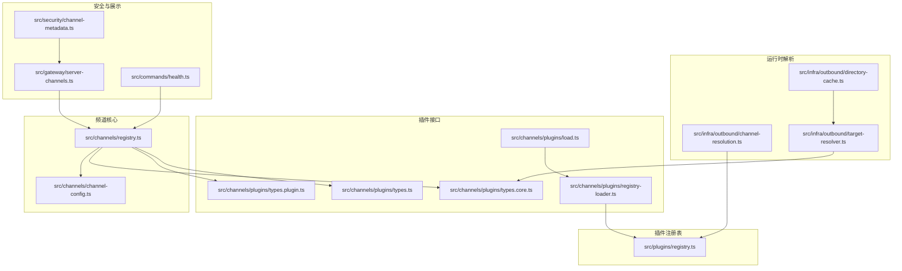
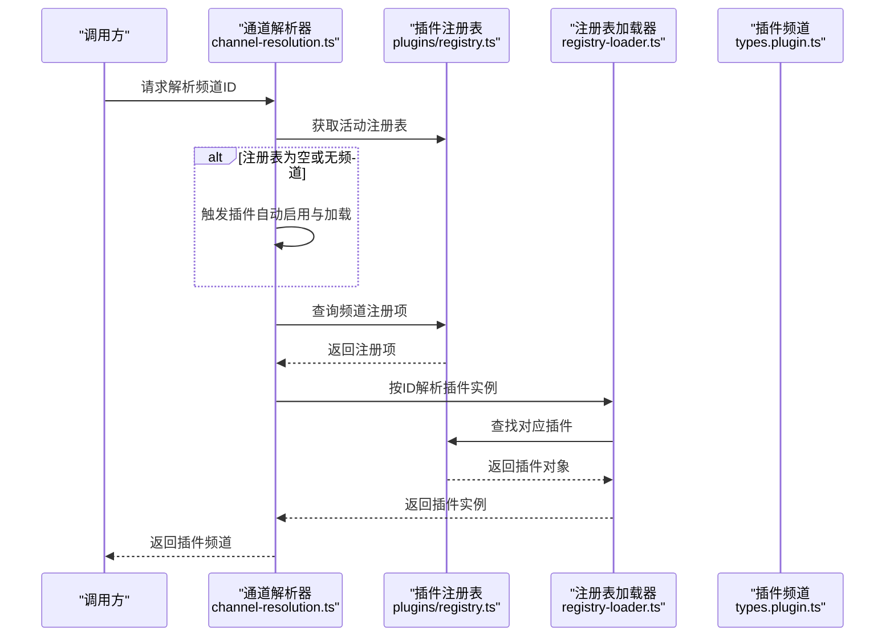
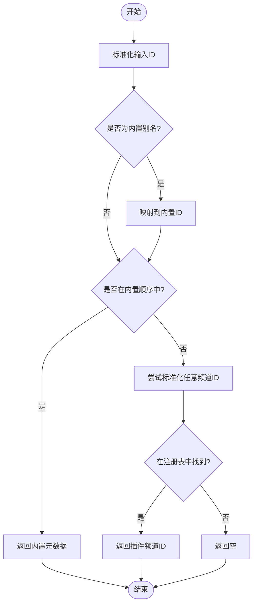
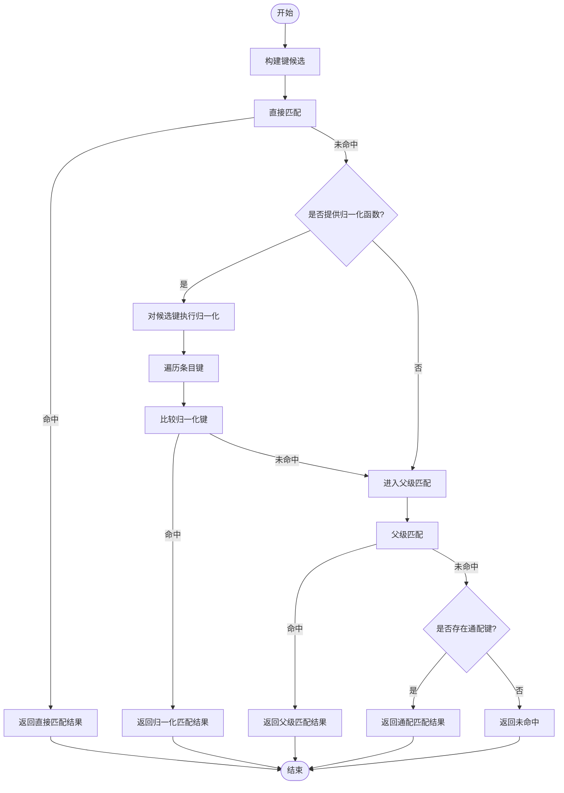
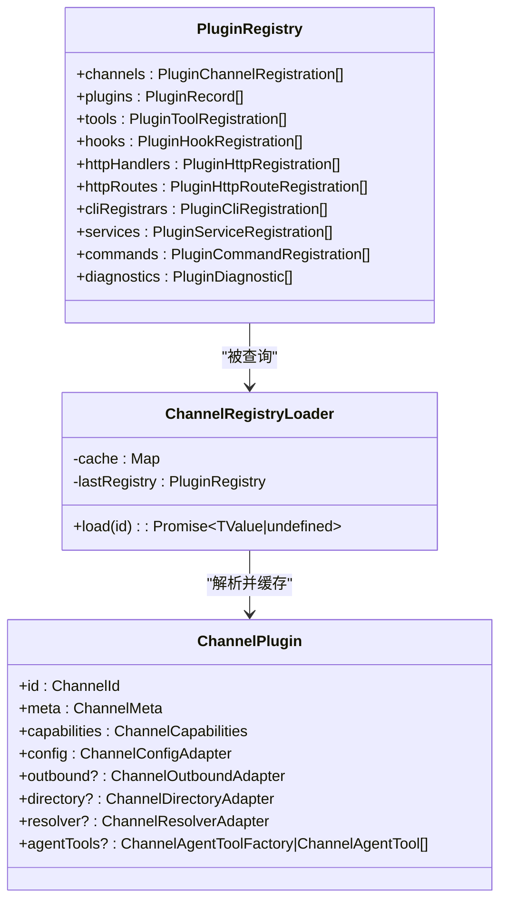
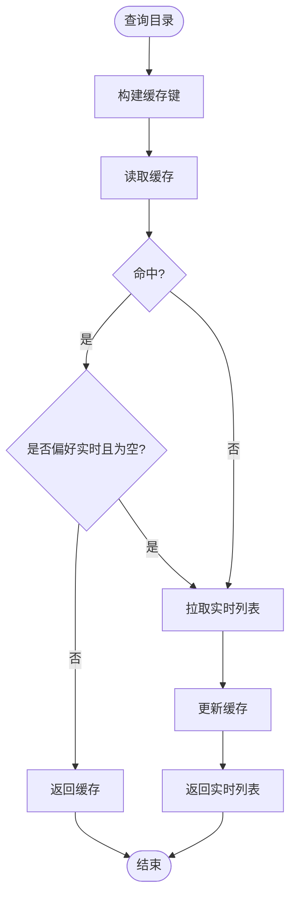

# 频道注册中心

<cite>
**本文引用的文件**
- [src/channels/channel-config.ts](file://src/channels/channel-config.ts)
- [src/channels/registry.ts](file://src/channels/registry.ts)
- [src/channels/plugins/types.core.ts](file://src/channels/plugins/types.core.ts)
- [src/channels/plugins/types.plugin.ts](file://src/channels/plugins/types.plugin.ts)
- [src/channels/plugins/types.ts](file://src/channels/plugins/types.ts)
- [src/channels/plugins/registry-loader.ts](file://src/channels/plugins/registry-loader.ts)
- [src/channels/plugins/load.ts](file://src/channels/plugins/load.ts)
- [src/plugins/registry.ts](file://src/plugins/registry.ts)
- [src/infra/outbound/target-resolver.ts](file://src/infra/outbound/target-resolver.ts)
- [src/infra/outbound/directory-cache.ts](file://src/infra/outbound/directory-cache.ts)
- [src/security/channel-metadata.ts](file://src/security/channel-metadata.ts)
- [src/infra/outbound/channel-resolution.ts](file://src/infra/outbound/channel-resolution.ts)
- [src/gateway/server-channels.ts](file://src/gateway/server-channels.ts)
- [src/commands/health.ts](file://src/commands/health.ts)
</cite>

## 目录

1. [简介](#简介)
2. [项目结构](#项目结构)
3. [核心组件](#核心组件)
4. [架构总览](#架构总览)
5. [详细组件分析](#详细组件分析)
6. [依赖关系分析](#依赖关系分析)
7. [性能考量](#性能考量)
8. [故障排查指南](#故障排查指南)
9. [结论](#结论)
10. [附录](#附录)

## 简介

本文件面向OpenClaw频道注册中心，系统化阐述频道注册机制的设计与实现，覆盖以下主题：

- 频道元数据管理：定义与展示、文档链接、选择与排序
- 频道ID标准化与别名解析：规范化输入、别名映射、跨内置与插件频道统一解析
- 内置频道注册流程：顺序、元数据、别名表
- 插件频道动态加载机制：运行时注册表、缓存与懒加载
- 频道优先级与排序规则：内置顺序、可扩展偏好字段
- 元数据结构与文档链接管理：类型定义、渲染与展示
- 新频道注册标准流程、配置校验与最佳实践
- 调试方法与常见问题定位

## 项目结构

围绕“频道注册中心”的关键目录与文件如下图所示：

**图表来源**

- [src/channels/registry.ts](file://src/channels/registry.ts#L1-L190)
- [src/channels/channel-config.ts](file://src/channels/channel-config.ts#L1-L183)
- [src/channels/plugins/types.core.ts](file://src/channels/plugins/types.core.ts#L1-L372)
- [src/channels/plugins/types.plugin.ts](file://src/channels/plugins/types.plugin.ts#L1-L86)
- [src/channels/plugins/types.ts](file://src/channels/plugins/types.ts#L1-L66)
- [src/channels/plugins/load.ts](file://src/channels/plugins/load.ts#L1-L9)
- [src/channels/plugins/registry-loader.ts](file://src/channels/plugins/registry-loader.ts#L1-L36)
- [src/plugins/registry.ts](file://src/plugins/registry.ts#L1-L520)
- [src/infra/outbound/channel-resolution.ts](file://src/infra/outbound/channel-resolution.ts#L35-L78)
- [src/infra/outbound/target-resolver.ts](file://src/infra/outbound/target-resolver.ts#L182-L304)
- [src/infra/outbound/directory-cache.ts](file://src/infra/outbound/directory-cache.ts#L1-L42)
- [src/security/channel-metadata.ts](file://src/security/channel-metadata.ts#L1-L45)
- [src/gateway/server-channels.ts](file://src/gateway/server-channels.ts#L356-L383)
- [src/commands/health.ts](file://src/commands/health.ts#L577-L609)

**章节来源**

- [src/channels/registry.ts](file://src/channels/registry.ts#L1-L190)
- [src/channels/channel-config.ts](file://src/channels/channel-config.ts#L1-L183)
- [src/channels/plugins/types.core.ts](file://src/channels/plugins/types.core.ts#L1-L372)
- [src/channels/plugins/types.plugin.ts](file://src/channels/plugins/types.plugin.ts#L1-L86)
- [src/channels/plugins/types.ts](file://src/channels/plugins/types.ts#L1-L66)
- [src/channels/plugins/load.ts](file://src/channels/plugins/load.ts#L1-L9)
- [src/channels/plugins/registry-loader.ts](file://src/channels/plugins/registry-loader.ts#L1-L36)
- [src/plugins/registry.ts](file://src/plugins/registry.ts#L1-L520)
- [src/infra/outbound/channel-resolution.ts](file://src/infra/outbound/channel-resolution.ts#L35-L78)
- [src/infra/outbound/target-resolver.ts](file://src/infra/outbound/target-resolver.ts#L182-L304)
- [src/infra/outbound/directory-cache.ts](file://src/infra/outbound/directory-cache.ts#L1-L42)
- [src/security/channel-metadata.ts](file://src/security/channel-metadata.ts#L1-L45)
- [src/gateway/server-channels.ts](file://src/gateway/server-channels.ts#L356-L383)
- [src/commands/health.ts](file://src/commands/health.ts#L577-L609)

## 核心组件

- 频道元数据与内置注册
  - 内置频道顺序与元数据：定义在注册表中，包含标签、文档路径、简述、系统图标等
  - 别名映射：支持对内置频道ID进行别名解析
- 频道ID标准化与匹配
  - ID标准化函数：去除空白、转小写、处理前缀
  - 键候选构建：去重、去空、保留顺序
  - 匹配策略：直接匹配、父级匹配（用于继承）、通配匹配、归一化键匹配
- 插件频道动态加载
  - 运行时注册表：集中记录已加载的插件频道
  - 注册表加载器：基于注册表查找并缓存插件频道
  - 插件频道加载器：对外暴露按ID获取插件频道的能力
- 目录解析与缓存
  - 目录条目结构：包含类型、ID、名称、句柄、头像、排序权重等
  - 目录查询与缓存：命中优先策略、缓存键生成、过期清理
- 文档链接与展示
  - 文档路径与标签：用于UI展示与导航
  - 选择行格式化：组合文档链接与附加信息
- 安全与元数据包装
  - 不可信元数据聚合：去重、截断、外链包裹

**章节来源**

- [src/channels/registry.ts](file://src/channels/registry.ts#L7-L110)
- [src/channels/registry.ts](file://src/channels/registry.ts#L112-L172)
- [src/channels/channel-config.ts](file://src/channels/channel-config.ts#L34-L80)
- [src/channels/channel-config.ts](file://src/channels/channel-config.ts#L82-L164)
- [src/channels/plugins/registry-loader.ts](file://src/channels/plugins/registry-loader.ts#L9-L35)
- [src/channels/plugins/load.ts](file://src/channels/plugins/load.ts#L1-L9)
- [src/channels/plugins/types.core.ts](file://src/channels/plugins/types.core.ts#L293-L301)
- [src/infra/outbound/target-resolver.ts](file://src/infra/outbound/target-resolver.ts#L182-L304)
- [src/infra/outbound/directory-cache.ts](file://src/infra/outbound/directory-cache.ts#L17-L42)
- [src/security/channel-metadata.ts](file://src/security/channel-metadata.ts#L21-L45)

## 架构总览

下图展示了从“频道ID解析”到“插件频道加载”的端到端流程，以及“目录解析与缓存”的支撑作用。

**图表来源**

- [src/infra/outbound/channel-resolution.ts](file://src/infra/outbound/channel-resolution.ts#L35-L78)
- [src/channels/plugins/registry-loader.ts](file://src/channels/plugins/registry-loader.ts#L15-L34)
- [src/plugins/registry.ts](file://src/plugins/registry.ts#L332-L358)

## 详细组件分析

### 组件A：频道元数据与内置注册

- 设计要点
  - 内置频道顺序通过常量数组固定，确保稳定展示与优先级
  - 元数据包含标签、文档路径、简述、系统图标、选择页文案等
  - 别名映射支持人类友好ID与协议ID之间的互转
- 关键流程
  - 列出内置频道：按顺序返回元数据
  - 解析与标准化：先别名映射，再检查是否在内置顺序中
  - 统一ID标准化：对任意频道ID（内置或插件）进行标准化
- 展示逻辑
  - 选择行格式化：拼接文档链接与附加信息
  - 提示行格式化：组合标签与简述

**图表来源**

- [src/channels/registry.ts](file://src/channels/registry.ts#L136-L172)

**章节来源**

- [src/channels/registry.ts](file://src/channels/registry.ts#L7-L110)
- [src/channels/registry.ts](file://src/channels/registry.ts#L112-L172)
- [src/channels/registry.ts](file://src/channels/registry.ts#L174-L190)

### 组件B：频道ID标准化与别名解析

- 标准化策略
  - 去除首尾空白、转小写
  - 移除开头的特定前缀（如频道符号）
  - 将非字母数字字符替换为连字符，并去除前后连字符
- 键候选构建
  - 去重、过滤空值、保留首次出现顺序
- 匹配策略
  - 直接匹配：按候选键精确匹配
  - 归一化匹配：对键与条目键分别执行标准化后再比较
  - 父级匹配：当直接未命中时，尝试父级键族
  - 通配匹配：若存在通配键则回退使用
- 复杂度
  - 标准化与候选构建：O(n)（n为键数量）
  - 匹配：最坏O(k)（k为条目数）

**图表来源**

- [src/channels/channel-config.ts](file://src/channels/channel-config.ts#L43-L80)
- [src/channels/channel-config.ts](file://src/channels/channel-config.ts#L82-L164)

**章节来源**

- [src/channels/channel-config.ts](file://src/channels/channel-config.ts#L34-L80)
- [src/channels/channel-config.ts](file://src/channels/channel-config.ts#L82-L164)

### 组件C：插件频道动态加载机制

- 注册表结构
  - 记录插件频道注册项：插件ID、插件对象、来源等
  - 支持工具、钩子、HTTP路由、命令等多类注册
- 加载器
  - 创建加载器：传入值解析器（从注册项提取目标值）
  - 缓存策略：以注册表为单位缓存，注册表变更时清空
  - 查找逻辑：在注册表channels中按插件ID匹配
- 加载器对外
  - 暴露按ID获取插件频道的方法，内部复用注册表加载器

**图表来源**

- [src/plugins/registry.ts](file://src/plugins/registry.ts#L65-L70)
- [src/plugins/registry.ts](file://src/plugins/registry.ts#L332-L358)
- [src/channels/plugins/registry-loader.ts](file://src/channels/plugins/registry-loader.ts#L9-L35)
- [src/channels/plugins/types.plugin.ts](file://src/channels/plugins/types.plugin.ts#L49-L85)

**章节来源**

- [src/plugins/registry.ts](file://src/plugins/registry.ts#L65-L70)
- [src/plugins/registry.ts](file://src/plugins/registry.ts#L332-L358)
- [src/channels/plugins/registry-loader.ts](file://src/channels/plugins/registry-loader.ts#L1-L36)
- [src/channels/plugins/load.ts](file://src/channels/plugins/load.ts#L1-L9)

### 组件D：目录解析与缓存

- 目录条目结构
  - 包含类型、ID、名称、句柄、头像、排序权重等
- 解析流程
  - 根据查询类型选择列表函数（缓存/实时）
  - 若缓存命中且不偏好实时，则直接返回
  - 否则拉取实时列表并更新缓存
- 缓存键
  - 组合频道ID、账户ID、类型、来源与签名，避免冲突

**图表来源**

- [src/infra/outbound/target-resolver.ts](file://src/infra/outbound/target-resolver.ts#L251-L304)
- [src/infra/outbound/directory-cache.ts](file://src/infra/outbound/directory-cache.ts#L17-L42)

**章节来源**

- [src/channels/plugins/types.core.ts](file://src/channels/plugins/types.core.ts#L293-L301)
- [src/infra/outbound/target-resolver.ts](file://src/infra/outbound/target-resolver.ts#L182-L304)
- [src/infra/outbound/directory-cache.ts](file://src/infra/outbound/directory-cache.ts#L1-L42)

### 组件E：文档链接管理与用户界面展示

- 文档路径与标签
  - 元数据中包含文档路径与标签，用于UI展示
- 选择行格式化
  - 组合标签、简述与文档链接，支持省略标签或附加链接
- 不可信元数据聚合
  - 对外部输入进行去重、截断与外链包裹，防止注入与溢出

**章节来源**

- [src/channels/registry.ts](file://src/channels/registry.ts#L174-L190)
- [src/security/channel-metadata.ts](file://src/security/channel-metadata.ts#L21-L45)

## 依赖关系分析

- 内置频道与插件频道的统一解析
  - 内置：通过注册表顺序与别名映射解析
  - 插件：通过运行时注册表与加载器解析
- 目录解析依赖插件频道能力
  - 仅当插件实现目录适配器时才可列出条目
- 解析器与注册表的耦合
  - 解析器在注册表为空时触发插件自动启用与加载

**图表来源**

- [src/channels/registry.ts](file://src/channels/registry.ts#L136-L172)
- [src/channels/channel-config.ts](file://src/channels/channel-config.ts#L82-L164)
- [src/infra/outbound/channel-resolution.ts](file://src/infra/outbound/channel-resolution.ts#L35-L78)
- [src/plugins/registry.ts](file://src/plugins/registry.ts#L332-L358)
- [src/channels/plugins/registry-loader.ts](file://src/channels/plugins/registry-loader.ts#L15-L34)
- [src/infra/outbound/target-resolver.ts](file://src/infra/outbound/target-resolver.ts#L251-L304)
- [src/infra/outbound/directory-cache.ts](file://src/infra/outbound/directory-cache.ts#L17-L42)

**章节来源**

- [src/channels/registry.ts](file://src/channels/registry.ts#L136-L172)
- [src/channels/channel-config.ts](file://src/channels/channel-config.ts#L82-L164)
- [src/infra/outbound/channel-resolution.ts](file://src/infra/outbound/channel-resolution.ts#L35-L78)
- [src/plugins/registry.ts](file://src/plugins/registry.ts#L332-L358)
- [src/channels/plugins/registry-loader.ts](file://src/channels/plugins/registry-loader.ts#L15-L34)
- [src/infra/outbound/target-resolver.ts](file://src/infra/outbound/target-resolver.ts#L251-L304)
- [src/infra/outbound/directory-cache.ts](file://src/infra/outbound/directory-cache.ts#L17-L42)

## 性能考量

- 缓存策略
  - 注册表加载器按注册表维度缓存，注册表变化时清空，避免重复查找
  - 目录缓存采用TTL与最大容量控制，减少重复网络请求
- 匹配复杂度
  - 标准化与候选构建线性复杂度；匹配在条目规模较小时可接受
- 解析器懒加载
  - 在注册表为空时触发插件加载，避免启动时的重型导入

[本节为通用指导，无需具体文件来源]

## 故障排查指南

- 常见问题
  - 频道ID无法识别：检查是否为内置别名或是否在注册表中
  - 插件频道未加载：确认插件已启用、注册表已初始化
  - 目录为空：确认插件实现了目录适配器并具备权限
- 调试方法
  - 使用健康命令输出本地频道账户与绑定映射，核对账户状态与令牌来源
  - 在网关运行时快照中查看频道与账户的配置状态
- 参考位置
  - 健康命令输出：打印每个频道的账户列表、默认账户、配置状态与令牌来源
  - 网关运行时快照：汇总频道与账户的运行时状态

**章节来源**

- [src/commands/health.ts](file://src/commands/health.ts#L577-L609)
- [src/gateway/server-channels.ts](file://src/gateway/server-channels.ts#L356-L383)

## 结论

OpenClaw频道注册中心通过“内置元数据+插件注册表”的双轨设计，实现了统一的频道ID标准化、别名解析与动态加载。配合目录解析与缓存机制，既保证了用户体验的稳定性，也兼顾了扩展性与性能。遵循本文的最佳实践与调试方法，可高效完成新频道注册与问题定位。

[本节为总结，无需具体文件来源]

## 附录

### 新频道注册标准流程

- 定义插件频道
  - 实现插件接口，提供ID、元数据、能力与适配器
  - 可选：配置模式、UI提示、代理/网关方法、消息动作等
- 注册到插件注册表
  - 通过插件API注册频道，确保ID唯一且不为空
- 集成到内置顺序（如需）
  - 将ID加入内置顺序数组，并补充元数据与别名
- 配置校验与测试
  - 校验ID标准化与别名映射
  - 测试目录解析与缓存行为
  - 使用健康命令与网关快照核对运行状态

**章节来源**

- [src/channels/plugins/types.plugin.ts](file://src/channels/plugins/types.plugin.ts#L49-L85)
- [src/plugins/registry.ts](file://src/plugins/registry.ts#L332-L358)
- [src/channels/registry.ts](file://src/channels/registry.ts#L7-L110)
- [src/channels/channel-config.ts](file://src/channels/channel-config.ts#L34-L80)

### 配置验证规则与最佳实践

- 验证规则
  - 频道ID必须非空且唯一
  - 文档路径与标签应存在且可访问
  - 目录适配器需实现必要列表函数
- 最佳实践
  - 使用标准化函数统一键命名
  - 为常用别名建立映射，提升可用性
  - 合理设置目录缓存TTL与容量
  - 为插件频道提供清晰的错误诊断与修复建议

**章节来源**

- [src/plugins/registry.ts](file://src/plugins/registry.ts#L332-L358)
- [src/infra/outbound/directory-cache.ts](file://src/infra/outbound/directory-cache.ts#L27-L32)
- [src/security/channel-metadata.ts](file://src/security/channel-metadata.ts#L21-L45)
