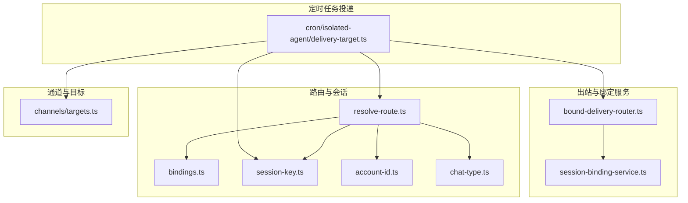
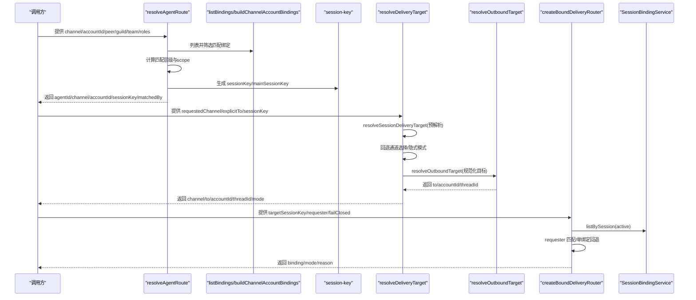
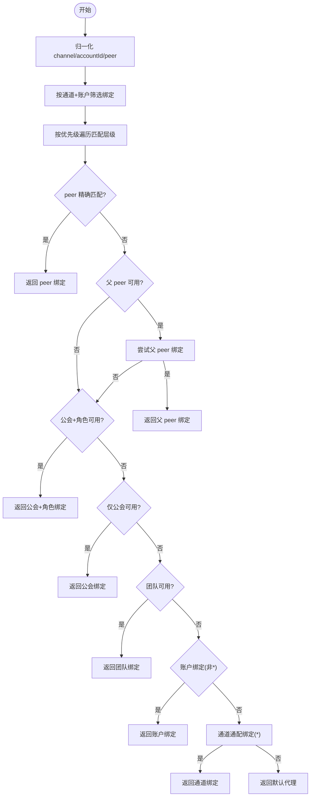
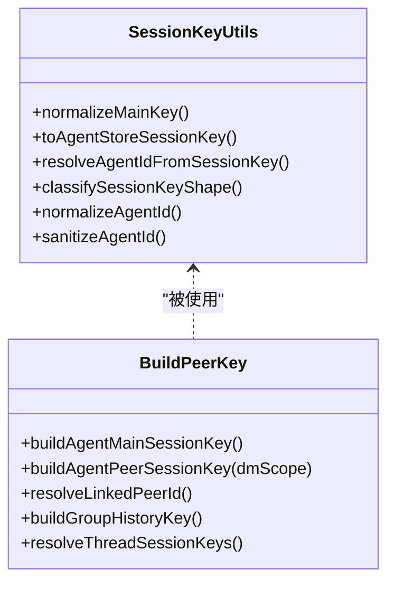
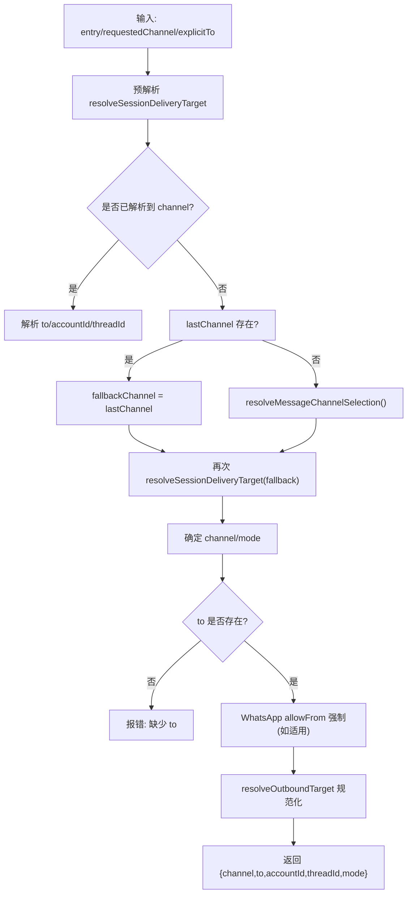
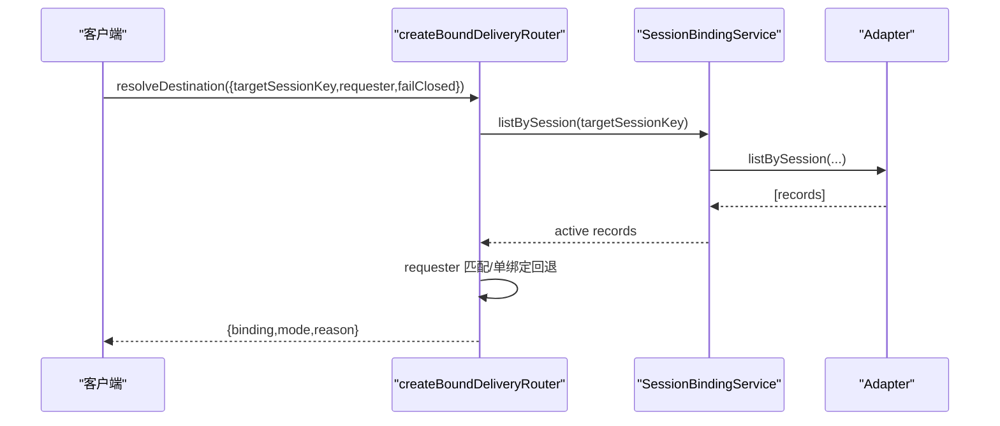
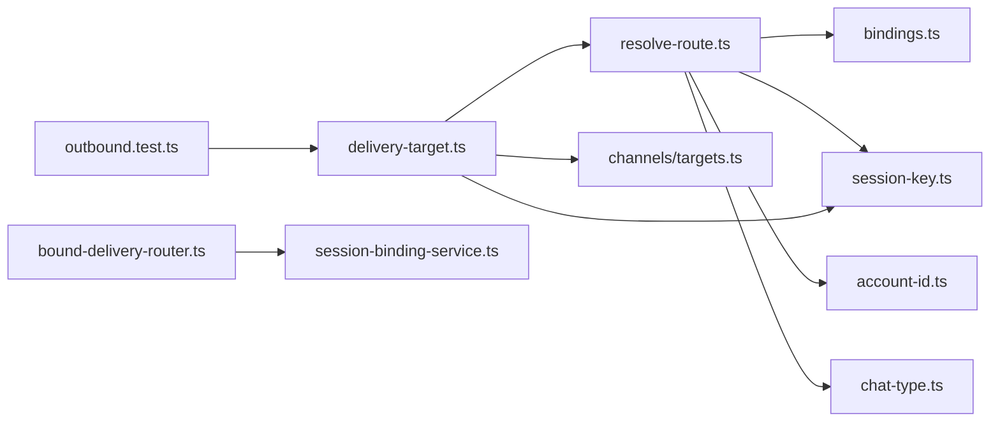

# 频道路由机制

<cite>
**本文引用的文件**
- [src/routing/resolve-route.ts](file://src/routing/resolve-route.ts)
- [src/routing/bindings.ts](file://src/routing/bindings.ts)
- [src/routing/session-key.ts](file://src/routing/session-key.ts)
- [src/routing/account-id.ts](file://src/routing/account-id.ts)
- [src/infra/outbound/bound-delivery-router.ts](file://src/infra/outbound/bound-delivery-router.ts)
- [src/infra/outbound/session-binding-service.ts](file://src/infra/outbound/session-binding-service.ts)
- [src/cron/isolated-agent/delivery-target.ts](file://src/cron/isolated-agent/delivery-target.ts)
- [src/channels/chat-type.ts](file://src/channels/chat-type.ts)
- [src/channels/targets.ts](file://src/channels/targets.ts)
- [src/infra/outbound/outbound.test.ts](file://src/infra/outbound/outbound.test.ts)
</cite>

## 目录

1. [引言](#引言)
2. [项目结构](#项目结构)
3. [核心组件](#核心组件)
4. [架构总览](#架构总览)
5. [详细组件分析](#详细组件分析)
6. [依赖关系分析](#依赖关系分析)
7. [性能考量](#性能考量)
8. [故障排除指南](#故障排除指南)
9. [结论](#结论)
10. [附录](#附录)

## 引言

本文件系统性阐述 OpenClaw 的“频道路由”机制，覆盖消息路由设计原理、目标解析、会话管理、消息转发逻辑、路由策略与优先级、负载均衡思路、会话状态与用户/群组绑定、配置项、性能优化、故障转移、调试与监控、以及多频道协调、消息去重与一致性保障等主题。文档以代码为依据，结合图示帮助读者从高层到细节全面理解。

## 项目结构

围绕“频道路由”的关键目录与文件如下：

- 路由与绑定：src/routing/\*
- 出站路由与会话绑定：src/infra/outbound/\*
- 通道与目标解析：src/channels/\*
- 定时任务中的投递目标解析：src/cron/isolated-agent/delivery-target.ts
- 测试用例：src/infra/outbound/outbound.test.ts

**图表来源**

- [src/routing/resolve-route.ts](file://src/routing/resolve-route.ts#L1-L444)
- [src/routing/bindings.ts](file://src/routing/bindings.ts#L1-L114)
- [src/routing/session-key.ts](file://src/routing/session-key.ts#L1-L242)
- [src/routing/account-id.ts](file://src/routing/account-id.ts#L1-L45)
- [src/channels/chat-type.ts](file://src/channels/chat-type.ts#L1-L19)
- [src/channels/targets.ts](file://src/channels/targets.ts#L1-L101)
- [src/infra/outbound/bound-delivery-router.ts](file://src/infra/outbound/bound-delivery-router.ts#L1-L132)
- [src/infra/outbound/session-binding-service.ts](file://src/infra/outbound/session-binding-service.ts#L1-L326)
- [src/cron/isolated-agent/delivery-target.ts](file://src/cron/isolated-agent/delivery-target.ts#L1-L212)

**章节来源**

- [src/routing/resolve-route.ts](file://src/routing/resolve-route.ts#L1-L444)
- [src/routing/bindings.ts](file://src/routing/bindings.ts#L1-L114)
- [src/routing/session-key.ts](file://src/routing/session-key.ts#L1-L242)
- [src/routing/account-id.ts](file://src/routing/account-id.ts#L1-L45)
- [src/channels/chat-type.ts](file://src/channels/chat-type.ts#L1-L19)
- [src/channels/targets.ts](file://src/channels/targets.ts#L1-L101)
- [src/infra/outbound/bound-delivery-router.ts](file://src/infra/outbound/bound-delivery-router.ts#L1-L132)
- [src/infra/outbound/session-binding-service.ts](file://src/infra/outbound/session-binding-service.ts#L1-L326)
- [src/cron/isolated-agent/delivery-target.ts](file://src/cron/isolated-agent/delivery-target.ts#L1-L212)

## 核心组件

- 路由器（resolveAgentRoute）：根据通道、账户、用户/群组/频道、公会/团队、角色等维度匹配绑定，生成会话键与主会话键，并记录匹配来源，用于调试与日志。
- 绑定与账户映射（listBindings、buildChannelAccountBindings）：列出绑定并按通道/代理聚合账户列表，支持默认账户解析。
- 会话键构建（buildAgentPeerSessionKey、buildAgentMainSessionKey、resolveThreadSessionKeys）：支持 DM 多作用域（main/per-peer/per-channel-peer/per-account-channel-peer）、线程后缀、身份链接合并等。
- 出站目标解析（resolveSessionDeliveryTarget、resolveOutboundTarget）：从会话入口推导最终投递目标，支持隐式/显式模式、回退通道选择、线程 ID 携带策略。
- 绑定投递路由器（createBoundDeliveryRouter）：基于会话绑定记录解析目标绑定，支持请求者限定与容错回退。
- 会话绑定服务（SessionBindingService/Adapter）：抽象适配器能力、绑定生命周期、查询与解绑，统一跨通道账户的绑定管理。
- 通道类型与目标（ChatType、MessagingTarget）：标准化聊天类型与目标表示，辅助解析与校验。

**章节来源**

- [src/routing/resolve-route.ts](file://src/routing/resolve-route.ts#L291-L443)
- [src/routing/bindings.ts](file://src/routing/bindings.ts#L16-L114)
- [src/routing/session-key.ts](file://src/routing/session-key.ts#L106-L241)
- [src/cron/isolated-agent/delivery-target.ts](file://src/cron/isolated-agent/delivery-target.ts#L39-L211)
- [src/infra/outbound/bound-delivery-router.ts](file://src/infra/outbound/bound-delivery-router.ts#L55-L131)
- [src/infra/outbound/session-binding-service.ts](file://src/infra/outbound/session-binding-service.ts#L70-L310)
- [src/channels/chat-type.ts](file://src/channels/chat-type.ts#L1-L19)
- [src/channels/targets.ts](file://src/channels/targets.ts#L1-L101)

## 架构总览

下图展示从“输入参数”到“最终投递目标”的端到端流程，包括路由策略、会话键生成、目标解析与绑定解析。

**图表来源**

- [src/routing/resolve-route.ts](file://src/routing/resolve-route.ts#L291-L443)
- [src/routing/bindings.ts](file://src/routing/bindings.ts#L16-L114)
- [src/routing/session-key.ts](file://src/routing/session-key.ts#L106-L241)
- [src/cron/isolated-agent/delivery-target.ts](file://src/cron/isolated-agent/delivery-target.ts#L39-L211)
- [src/channels/targets.ts](file://src/channels/targets.ts#L1-L101)
- [src/infra/outbound/bound-delivery-router.ts](file://src/infra/outbound/bound-delivery-router.ts#L55-L131)
- [src/infra/outbound/session-binding-service.ts](file://src/infra/outbound/session-binding-service.ts#L198-L310)

## 详细组件分析

### 路由策略与优先级

- 输入要素：通道、账户、用户/群组/频道、公会/团队、成员角色。
- 匹配层级（优先级从高到低）：
  1. 精确 peer 匹配
  2. 线程父 peer 继承匹配
  3. 公会+角色组合
  4. 公会匹配（无角色）
  5. 团队匹配
  6. 账户绑定（非通配）
  7. 通道通配绑定（accountId=\*）
  8. 默认代理
- 匹配范围：在给定通道+账户的缓存中评估绑定，避免重复计算。
- 输出：agentId、channel、accountId、sessionKey、mainSessionKey、matchedBy。

**图表来源**

- [src/routing/resolve-route.ts](file://src/routing/resolve-route.ts#L370-L440)

**章节来源**

- [src/routing/resolve-route.ts](file://src/routing/resolve-route.ts#L291-L443)

### 会话键与会话状态管理

- 会话键形状与分类：支持 agent: 主键、遗留别名、畸形等形态识别。
- 主键与代理 ID 归一化：严格字符集与长度限制，确保路径安全。
- DM 作用域策略：
  - main：始终使用主会话
  - per-peer：按 peerId 建立独立会话
  - per-channel-peer：按 channel:peerId 建立会话
  - per-account-channel-peer：按 account:channel:peerId 建立会话
- 身份链接合并：通过 identityLinks 将不同 peerId 映射到同一规范 ID，提升跨平台一致性。
- 线程会话键：支持在基础会话键上追加 :thread:<id>，或复用基础键作为父会话键。

**图表来源**

- [src/routing/session-key.ts](file://src/routing/session-key.ts#L33-L241)

**章节来源**

- [src/routing/session-key.ts](file://src/routing/session-key.ts#L106-L241)

### 目标解析与消息转发

- 预解析阶段：从会话入口 entry 推导 channel/to/accountId/threadId，支持 requestedChannel 与 explicitTo。
- 回退通道：当 requestedChannel 为 "last" 且无 lastChannel 时，尝试自动选择通道；若仍失败则报错。
- 隐式/显式模式：隐式模式允许从上下文推断目标，显式模式要求明确指定。
- 线程 ID 规则：仅在显式设置或与上次 to 相同的情况下携带，防止跨会话泄漏。
- WhatsApp 特例：隐式模式下可强制 allowFrom 白名单中的首个目标，确保合规。
- 最终出站目标：通过 resolveOutboundTarget 规范化 to、accountId、threadId，并返回 docked 结果。

**图表来源**

- [src/cron/isolated-agent/delivery-target.ts](file://src/cron/isolated-agent/delivery-target.ts#L64-L211)

**章节来源**

- [src/cron/isolated-agent/delivery-target.ts](file://src/cron/isolated-agent/delivery-target.ts#L39-L211)

### 绑定投递与会话绑定服务

- 绑定记录：包含 bindingId、目标会话键、目标类型（子代理/会话）、对话引用、状态、过期时间与元数据。
- 解析流程：
  - 必须提供 targetSessionKey；若无有效 active 绑定则回退。
  - 若未提供 requester，则单绑定可直接命中；多绑定需回退。
  - requester 匹配：按 channel+accountId+conversationId 精确匹配；若无精确匹配但仅一个候选，可按 failClosed 决策回退。
- 适配器能力：注册/注销适配器，查询能力（bind/unbind/placements），统一 bind/touch/unbind 调用。

**图表来源**

- [src/infra/outbound/bound-delivery-router.ts](file://src/infra/outbound/bound-delivery-router.ts#L55-L131)
- [src/infra/outbound/session-binding-service.ts](file://src/infra/outbound/session-binding-service.ts#L198-L310)

**章节来源**

- [src/infra/outbound/bound-delivery-router.ts](file://src/infra/outbound/bound-delivery-router.ts#L55-L131)
- [src/infra/outbound/session-binding-service.ts](file://src/infra/outbound/session-binding-service.ts#L70-L310)

### 账户与通道类型

- 账户 ID 归一化：严格字符集与长度限制，屏蔽受保护键名。
- 聊天类型标准化：direct/group/channel（含 dm 别名），用于 peer 类型判定与会话键拼装。

**章节来源**

- [src/routing/account-id.ts](file://src/routing/account-id.ts#L1-L45)
- [src/channels/chat-type.ts](file://src/channels/chat-type.ts#L1-L19)

## 依赖关系分析

- resolve-route.ts 依赖：
  - bindings.ts：绑定列表与账户映射
  - session-key.ts：会话键构建与归一化
  - account-id.ts：账户 ID 归一化
  - chat-type.ts：聊天类型标准化
- delivery-target.ts 依赖：
  - resolve-route.ts：默认代理与会话键生成
  - session-key.ts：会话存储路径与主会话键
  - channels/targets.ts：目标解析与规范化
  - outbound/\*：通道选择与出站目标解析
- bound-delivery-router.ts 依赖：
  - session-binding-service.ts：绑定服务接口与适配器
- outbound.test.ts：验证 resolveOutboundSessionRoute 的行为

**图表来源**

- [src/routing/resolve-route.ts](file://src/routing/resolve-route.ts#L1-L444)
- [src/routing/bindings.ts](file://src/routing/bindings.ts#L1-L114)
- [src/routing/session-key.ts](file://src/routing/session-key.ts#L1-L242)
- [src/routing/account-id.ts](file://src/routing/account-id.ts#L1-L45)
- [src/channels/chat-type.ts](file://src/channels/chat-type.ts#L1-L19)
- [src/channels/targets.ts](file://src/channels/targets.ts#L1-L101)
- [src/infra/outbound/bound-delivery-router.ts](file://src/infra/outbound/bound-delivery-router.ts#L1-L132)
- [src/infra/outbound/session-binding-service.ts](file://src/infra/outbound/session-binding-service.ts#L1-L326)
- [src/cron/isolated-agent/delivery-target.ts](file://src/cron/isolated-agent/delivery-target.ts#L1-L212)
- [src/infra/outbound/outbound.test.ts](file://src/infra/outbound/outbound.test.ts#L970-L1001)

**章节来源**

- 同上各文件对应段落

## 性能考量

- 绑定评估缓存：按 cfg 引用与 channel+accountId 组合作为键缓存评估结果，超过阈值清空，避免内存膨胀。
- 字符串归一化与正则：对 ID/名称进行预编译正则与小写化，减少重复计算。
- 会话键构建：按需拼装，避免不必要的字符串操作；线程键支持后缀与父键复用。
- 绑定服务：统一适配器接口，批量查询与去重，降低跨通道查询成本。
- 日志与调试：可选的详细日志输出，便于定位性能瓶颈与匹配路径。

[本节为通用性能建议，不直接分析具体文件]

## 故障排除指南

- 无匹配绑定：检查 bindings 中的 match 条件（channel/accountId/peer/guild/team/roles）是否与输入一致。
- 会话键缺失或格式错误：确认 sessionKey 形态与 classifySessionKeyShape 的分类；必要时使用 toAgentStoreSessionKey 进行转换。
- 目标解析失败：
  - requestedChannel 为 "last" 且无 lastChannel：需显式设置 delivery.channel 或在会话中先有一次成功发送。
  - explicitTo 为空：需提供 to 或通过隐式模式正确推断。
- 绑定解析失败：
  - 无 active 绑定：确认绑定状态与过期时间。
  - requester 不完整：确保 channel、conversationId 等字段非空。
  - 多绑定且无 requester：考虑提供 requester 或调整 failClosed 策略。
- WhatsApp allowFrom：隐式模式可能被白名单强制替换，检查 allowFrom 配置与 store 中的 allowFrom。

**章节来源**

- [src/infra/outbound/bound-delivery-router.ts](file://src/infra/outbound/bound-delivery-router.ts#L59-L129)
- [src/cron/isolated-agent/delivery-target.ts](file://src/cron/isolated-agent/delivery-target.ts#L71-L160)
- [src/infra/outbound/outbound.test.ts](file://src/infra/outbound/outbound.test.ts#L978-L1000)

## 结论

OpenClaw 的频道路由机制通过“绑定+会话键+目标解析+绑定投递”的分层设计，实现了高可配置、强一致、可扩展的消息转发体系。其优先级清晰、缓存友好、适配器抽象完善，既满足多通道、多账户、多角色场景，又提供了完善的调试与故障处理能力。后续可在负载均衡、动态权重与自适应通道选择方面进一步演进。

[本节为总结性内容，不直接分析具体文件]

## 附录

### 路由配置选项与最佳实践

- 绑定规则（bindings）：按 channel/accountId/peer/guild/team/roles 精细化控制路由。
- DM 作用域（dmScope）：根据业务需求选择 main/per-peer/per-channel-peer/per-account-channel-peer。
- 通道选择：delivery.channel 支持 "last" 自动回退，或显式指定。
- 目标解析：delivery.to 支持前缀/提及/原始 ID，结合 allowFrom 白名单进行合规约束。
- 绑定服务：通过适配器注册绑定能力，支持 bind/unbind/placements 查询。

**章节来源**

- [src/routing/bindings.ts](file://src/routing/bindings.ts#L16-L114)
- [src/routing/session-key.ts](file://src/routing/session-key.ts#L125-L162)
- [src/cron/isolated-agent/delivery-target.ts](file://src/cron/isolated-agent/delivery-target.ts#L39-L211)
- [src/infra/outbound/session-binding-service.ts](file://src/infra/outbound/session-binding-service.ts#L148-L185)

### 调试工具与监控指标

- 匹配来源（matchedBy）：用于日志与审计，快速定位路由命中路径。
- 会话键分类（classifySessionKeyShape）：辅助诊断会话键异常。
- 绑定服务能力查询：getCapabilities 可观测适配器支持情况。
- 测试用例：outbound.test.ts 中包含大量 resolveOutboundSessionRoute 的断言，可作为行为参考与回归测试。

**章节来源**

- [src/routing/resolve-route.ts](file://src/routing/resolve-route.ts#L48-L56)
- [src/routing/session-key.ts](file://src/routing/session-key.ts#L71-L80)
- [src/infra/outbound/session-binding-service.ts](file://src/infra/outbound/session-binding-service.ts#L255-L261)
- [src/infra/outbound/outbound.test.ts](file://src/infra/outbound/outbound.test.ts#L978-L1000)

### 多频道协调、消息去重与一致性

- 多频道协调：通过通道通配绑定与通道选择器实现跨频道路由；WhatsApp 等平台可结合 allowFrom 强制合规。
- 消息去重：建议在出站适配器层引入幂等键（如消息指纹）与去重表，避免重复投递。
- 一致性保证：
  - 会话键按 agentId/channel/accountId/peer/thread 精确定位，确保同一上下文使用相同会话。
  - 线程 ID 仅在显式或与上次 to 相同情况下携带，防止跨会话污染。
  - 绑定服务统一管理绑定生命周期，避免并发冲突。

[本节为通用指导，不直接分析具体文件]
