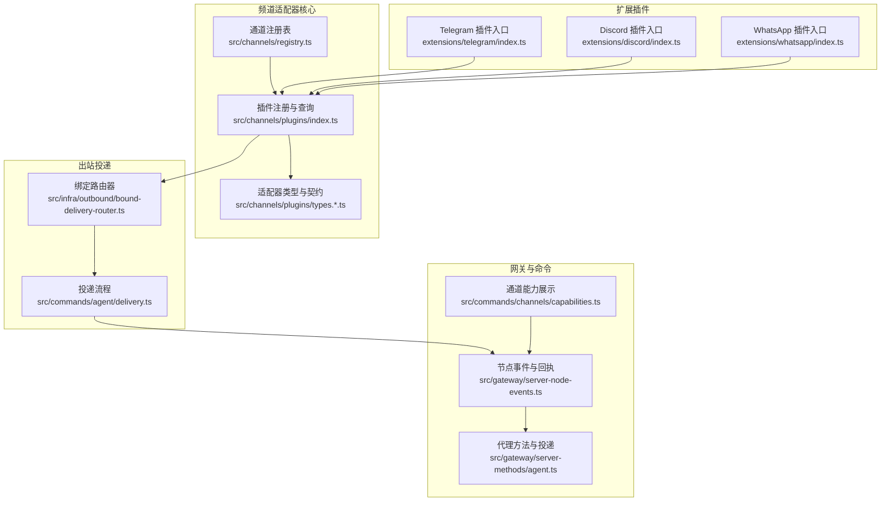
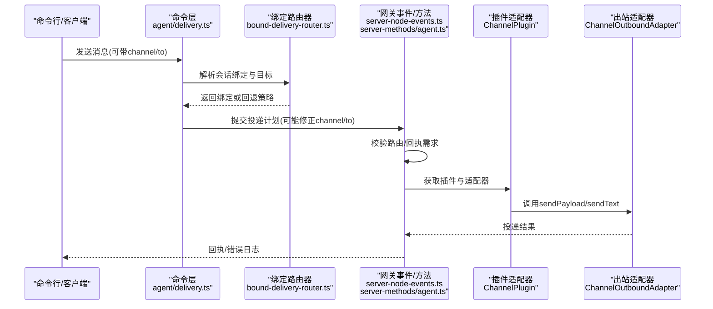
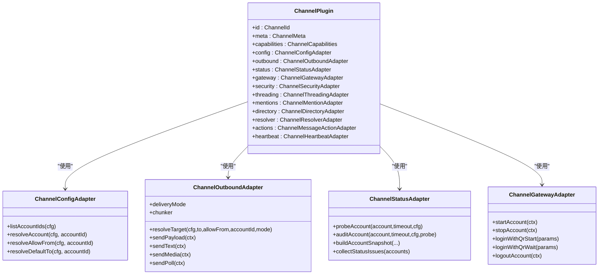
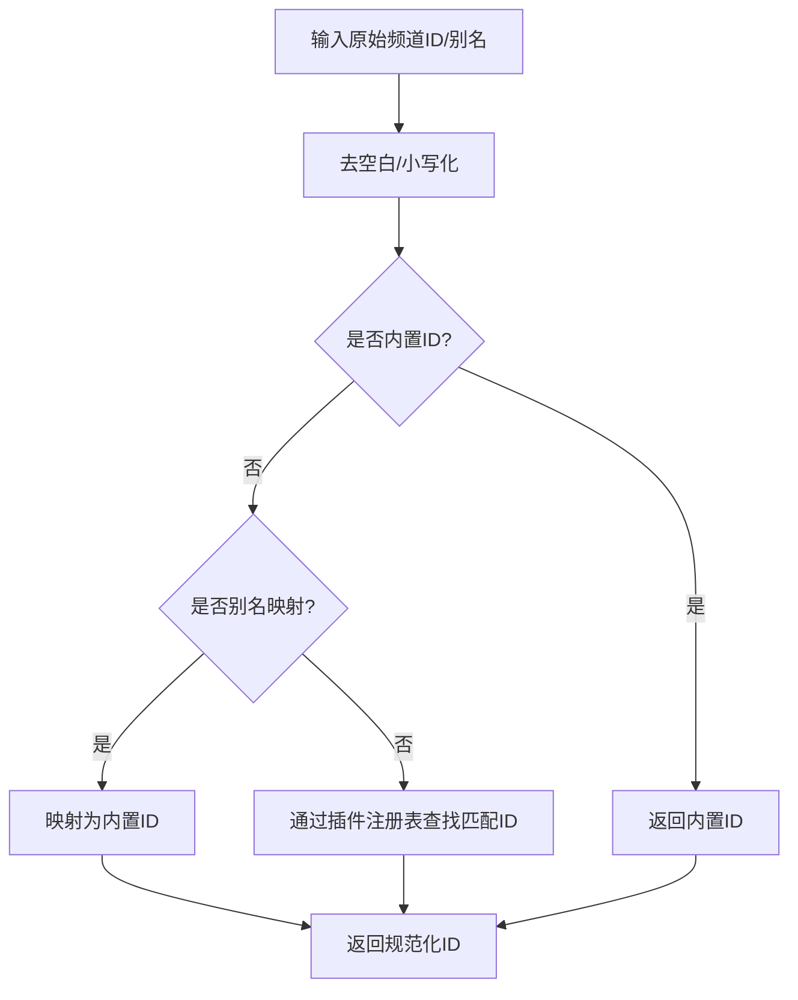
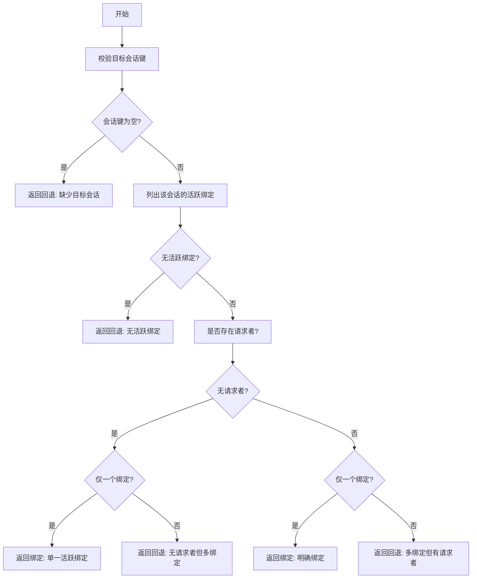
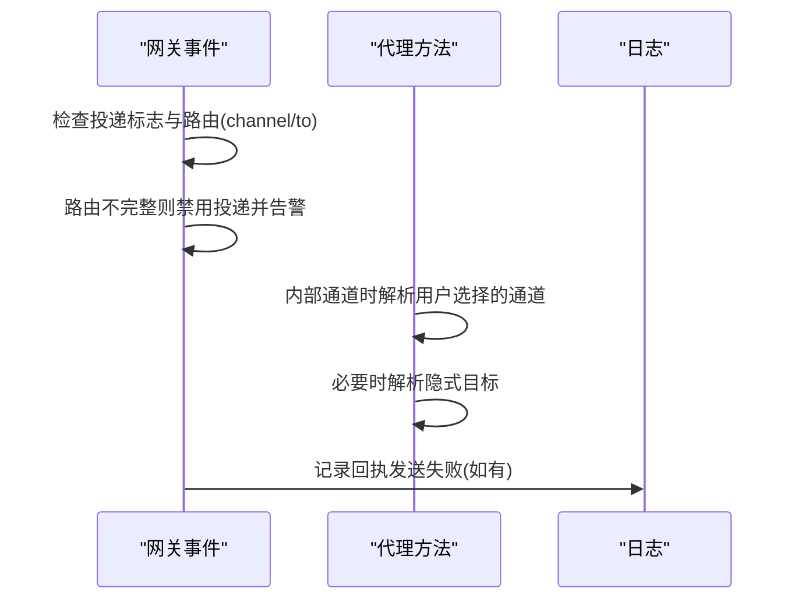
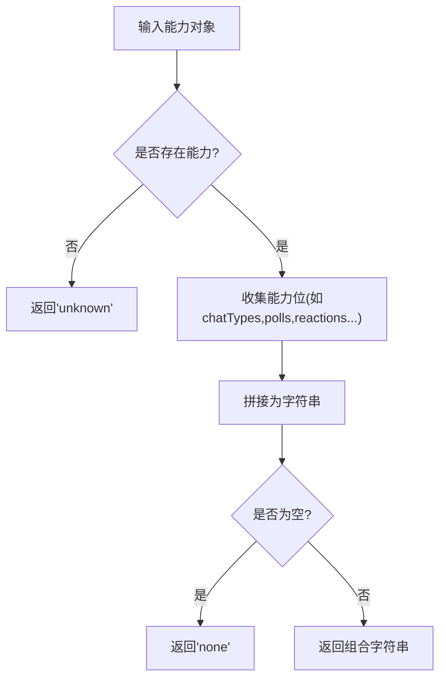
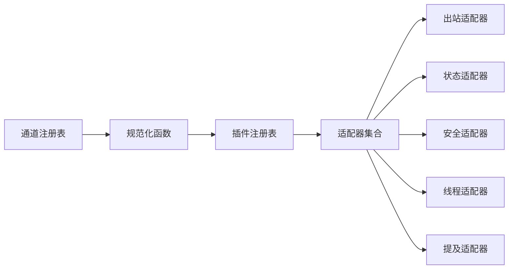

# 频道适配器架构

<cite>
**本文档引用的文件**
- [src/channels/plugins/index.ts](file://src/channels/plugins/index.ts)
- [src/channels/plugins/types.ts](file://src/channels/plugins/types.ts)
- [src/channels/plugins/types.adapters.ts](file://src/channels/plugins/types.adapters.ts)
- [src/channels/plugins/types.core.ts](file://src/channels/plugins/types.core.ts)
- [src/channels/plugins/types.plugin.ts](file://src/channels/plugins/types.plugin.ts)
- [src/channels/registry.ts](file://src/channels/registry.ts)
- [src/commands/agent/delivery.ts](file://src/commands/agent/delivery.ts)
- [src/infra/outbound/bound-delivery-router.ts](file://src/infra/outbound/bound-delivery-router.ts)
- [src/gateway/server-node-events.ts](file://src/gateway/server-node-events.ts)
- [src/gateway/server-methods/agent.ts](file://src/gateway/server-methods/agent.ts)
- [src/commands/channels/capabilities.ts](file://src/commands/channels/capabilities.ts)
- [src/channels/plugins/pairing.ts](file://src/channels/plugins/pairing.ts)
- [src/config/schema.ts](file://src/config/schema.ts)
- [extensions/telegram/index.ts](file://extensions/telegram/index.ts)
- [extensions/discord/index.ts](file://extensions/discord/index.ts)
- [extensions/whatsapp/index.ts](file://extensions/whatsapp/index.ts)
</cite>

## 目录

1. [引言](#引言)
2. [项目结构](#项目结构)
3. [核心组件](#核心组件)
4. [架构总览](#架构总览)
5. [详细组件分析](#详细组件分析)
6. [依赖关系分析](#依赖关系分析)
7. [性能考虑](#性能考虑)
8. [故障排除指南](#故障排除指南)
9. [结论](#结论)
10. [附录](#附录)

## 引言

本文件系统性阐述 OpenClaw 的频道适配器架构，重点覆盖以下方面：

- 适配器模式在频道抽象中的应用：通过统一的适配器接口屏蔽不同通信协议差异，实现“协议转换”与“消息标准化”。
- 支持的频道类型与能力模型：基于核心注册表与能力描述，统一管理各频道特性（如聊天类型、投票、媒体、线程等）。
- 实现标准与扩展机制：以 ChannelPlugin 为核心契约，定义配置、认证、出站发送、状态探测、网关接入等适配器接口。
- 路由策略与消息转发：从会话绑定到目标解析，再到插件化投递，形成可扩展的消息分发链路。
- 错误处理与可观测性：在网关层与命令层进行路由缺失与投递失败的告警与降级。
- 开发指南与最佳实践：如何编写新的频道适配器、配置管理与性能优化、测试与调试方法。

## 项目结构

OpenClaw 将“频道”抽象置于 src/channels 下，并通过插件系统动态加载具体频道实现。核心目录与职责如下：

- src/channels/plugins：适配器类型定义、插件契约、核心数据模型
- src/channels/registry：内置频道注册表与别名映射
- src/infra/outbound：出站投递基础设施（含绑定路由器）
- src/gateway：网关服务端事件与方法，负责消息路由与回执
- src/commands：CLI 命令层，包含通道能力展示与投递选择
- extensions：各频道插件入口（如 telegram、discord、whatsapp）

图表来源

- [src/channels/registry.ts](file://src/channels/registry.ts#L1-L190)
- [src/channels/plugins/index.ts](file://src/channels/plugins/index.ts#L1-L85)
- [src/channels/plugins/types.ts](file://src/channels/plugins/types.ts#L1-L66)
- [src/infra/outbound/bound-delivery-router.ts](file://src/infra/outbound/bound-delivery-router.ts#L49-L91)
- [src/commands/agent/delivery.ts](file://src/commands/agent/delivery.ts#L96-L117)
- [src/gateway/server-node-events.ts](file://src/gateway/server-node-events.ts#L383-L421)
- [src/gateway/server-methods/agent.ts](file://src/gateway/server-methods/agent.ts#L517-L552)
- [src/commands/channels/capabilities.ts](file://src/commands/channels/capabilities.ts#L76-L118)
- [extensions/telegram/index.ts](file://extensions/telegram/index.ts#L1-L18)
- [extensions/discord/index.ts](file://extensions/discord/index.ts#L1-L20)
- [extensions/whatsapp/index.ts](file://extensions/whatsapp/index.ts#L1-L17)

章节来源

- [src/channels/registry.ts](file://src/channels/registry.ts#L1-L190)
- [src/channels/plugins/index.ts](file://src/channels/plugins/index.ts#L1-L85)
- [src/channels/plugins/types.ts](file://src/channels/plugins/types.ts#L1-L66)

## 核心组件

- 通道注册表与元数据：定义内置频道顺序、别名与元信息，提供规范化与查询能力。
- 适配器类型体系：统一定义配置、认证、出站发送、状态探测、网关接入、安全策略、线程与提及等适配器接口。
- 插件契约：ChannelPlugin 作为适配器集合的载体，声明频道能力、默认行为与可选扩展点。
- 出站投递与路由：绑定路由器根据会话与请求者解析目标账户与适配器；命令层在内部通道时进行显式选择。
- 网关事件与回执：在节点事件中处理投递路由缺失与回执发送，确保可观测性与错误告警。
- 扩展插件入口：各频道通过入口文件注册自身插件并注入运行时环境。

章节来源

- [src/channels/registry.ts](file://src/channels/registry.ts#L26-L110)
- [src/channels/plugins/types.adapters.ts](file://src/channels/plugins/types.adapters.ts#L51-L79)
- [src/channels/plugins/types.adapters.ts](file://src/channels/plugins/types.adapters.ts#L106-L123)
- [src/channels/plugins/types.adapters.ts](file://src/channels/plugins/types.adapters.ts#L211-L225)
- [src/channels/plugins/types.plugin.ts](file://src/channels/plugins/types.plugin.ts#L49-L85)
- [src/infra/outbound/bound-delivery-router.ts](file://src/infra/outbound/bound-delivery-router.ts#L55-L91)
- [src/commands/agent/delivery.ts](file://src/commands/agent/delivery.ts#L96-L117)
- [src/gateway/server-node-events.ts](file://src/gateway/server-node-events.ts#L383-L421)
- [extensions/telegram/index.ts](file://extensions/telegram/index.ts#L1-L18)
- [extensions/discord/index.ts](file://extensions/discord/index.ts#L1-L20)
- [extensions/whatsapp/index.ts](file://extensions/whatsapp/index.ts#L1-L17)

## 架构总览

下图展示了从命令层到网关、再到插件适配器的完整消息路径，以及关键的协议转换与标准化环节。

图表来源

- [src/commands/agent/delivery.ts](file://src/commands/agent/delivery.ts#L96-L117)
- [src/infra/outbound/bound-delivery-router.ts](file://src/infra/outbound/bound-delivery-router.ts#L55-L91)
- [src/gateway/server-node-events.ts](file://src/gateway/server-node-events.ts#L383-L421)
- [src/gateway/server-methods/agent.ts](file://src/gateway/server-methods/agent.ts#L517-L552)
- [src/channels/plugins/types.adapters.ts](file://src/channels/plugins/types.adapters.ts#L106-L123)

## 详细组件分析

### 组件A：适配器类型与契约（适配器模式）

- 设计要点
  - 以 ChannelPlugin 为容器，聚合多种适配器（配置、认证、出站、状态、网关、安全、线程、提及、目录、解析、动作、心跳等），形成“协议转换”的统一入口。
  - 每个适配器聚焦单一职责，例如 ChannelOutboundAdapter 负责文本/媒体/Poll 的发送与分块策略，ChannelStatusAdapter 负责探针与审计。
- 关键接口
  - 配置适配器：列出账户、解析账户、启用/删除账户、允许来源解析与格式化、默认 to 解析。
  - 出站适配器：定义投递模式（直连/网关/混合）、分块器、目标解析、发送接口。
  - 网关适配器：启动/停止账户、二维码登录、登出。
  - 安全适配器：解析私信策略、收集警告。
  - 线程适配器：回复模式、工具上下文构建。
  - 提及适配器：去除提及模式与文本。
  - 目录/解析/动作/心跳适配器：用于用户/群组解析、消息动作处理与健康检查。
- 协议转换与消息标准化
  - 通过适配器将不同频道的“目标标识、消息体、附件、投票参数”转换为统一的上下文结构，再由出站适配器标准化发送。

图表来源

- [src/channels/plugins/types.plugin.ts](file://src/channels/plugins/types.plugin.ts#L49-L85)
- [src/channels/plugins/types.adapters.ts](file://src/channels/plugins/types.adapters.ts#L51-L79)
- [src/channels/plugins/types.adapters.ts](file://src/channels/plugins/types.adapters.ts#L106-L123)
- [src/channels/plugins/types.adapters.ts](file://src/channels/plugins/types.adapters.ts#L125-L164)
- [src/channels/plugins/types.adapters.ts](file://src/channels/plugins/types.adapters.ts#L211-L225)

章节来源

- [src/channels/plugins/types.adapters.ts](file://src/channels/plugins/types.adapters.ts#L51-L79)
- [src/channels/plugins/types.adapters.ts](file://src/channels/plugins/types.adapters.ts#L106-L123)
- [src/channels/plugins/types.adapters.ts](file://src/channels/plugins/types.adapters.ts#L125-L164)
- [src/channels/plugins/types.adapters.ts](file://src/channels/plugins/types.adapters.ts#L211-L225)
- [src/channels/plugins/types.plugin.ts](file://src/channels/plugins/types.plugin.ts#L49-L85)

### 组件B：通道注册表与内置频道

- 设计要点
  - 内置频道顺序与别名集中管理，提供规范化函数与元信息（标签、文档链接、系统图标等）。
  - normalizeAnyChannelId 通过插件注册表解析任意频道 ID 或别名，避免在共享代码中直接导入重型插件。
- 扩展机制
  - 新增频道只需在注册表中声明元信息与别名，并在扩展入口注册插件即可生效。

图表来源

- [src/channels/registry.ts](file://src/channels/registry.ts#L119-L172)

章节来源

- [src/channels/registry.ts](file://src/channels/registry.ts#L26-L110)
- [src/channels/registry.ts](file://src/channels/registry.ts#L119-L172)

### 组件C：出站投递与绑定路由器

- 设计要点
  - 绑定路由器依据会话键与请求者解析唯一或回退的目标绑定，避免歧义。
  - 命令层在内部通道且未显式指定目标时，尝试解析用户选择的通道，再通过插件注册表获取对应适配器。
- 错误处理
  - 当无活动绑定或歧义时返回回退模式与原因，供上层决策。

图表来源

- [src/infra/outbound/bound-delivery-router.ts](file://src/infra/outbound/bound-delivery-router.ts#L55-L91)

章节来源

- [src/commands/agent/delivery.ts](file://src/commands/agent/delivery.ts#L96-L117)
- [src/infra/outbound/bound-delivery-router.ts](file://src/infra/outbound/bound-delivery-router.ts#L55-L91)

### 组件D：网关事件与回执

- 设计要点
  - 在节点事件中，若需要投递回执但路由不完整，则禁用投递并记录警告，避免全局回退。
  - 代理方法在内部通道时尝试解析用户选择的通道，并在必要时回退到隐式目标。
- 错误处理
  - 对于缺少路由的投递，记录详细告警；对回执发送异常进行捕获与降噪。

图表来源

- [src/gateway/server-node-events.ts](file://src/gateway/server-node-events.ts#L383-L421)
- [src/gateway/server-methods/agent.ts](file://src/gateway/server-methods/agent.ts#L517-L552)

章节来源

- [src/gateway/server-node-events.ts](file://src/gateway/server-node-events.ts#L383-L421)
- [src/gateway/server-methods/agent.ts](file://src/gateway/server-methods/agent.ts#L517-L552)

### 组件E：通道能力与配置管理

- 通道能力展示
  - 将频道支持的能力（聊天类型、投票、反应、编辑、撤回、回复、效果、群组管理、线程、媒体、原生命令、阻塞流）格式化输出，便于 CLI 展示。
- 配置 Schema 合并
  - 将各频道的配置 Schema 合并到全局 Schema 中，支持 UI 呈现与校验。

图表来源

- [src/commands/channels/capabilities.ts](file://src/commands/channels/capabilities.ts#L76-L118)
- [src/config/schema.ts](file://src/config/schema.ts#L273-L297)

章节来源

- [src/commands/channels/capabilities.ts](file://src/commands/channels/capabilities.ts#L76-L118)
- [src/config/schema.ts](file://src/config/schema.ts#L273-L297)

### 组件F：配对与通道解析

- 设计要点
  - 列举支持配对的通道，按插件声明过滤；解析配对通道时进行规范化与有效性校验。
  - 通道解析统一走 normalizeAnyChannelId，确保与插件注册表一致。

章节来源

- [src/channels/plugins/pairing.ts](file://src/channels/plugins/pairing.ts#L11-L49)
- [src/channels/plugins/index.ts](file://src/channels/plugins/index.ts#L53-L57)

### 组件G：扩展插件入口（示例）

- 设计要点
  - 各频道通过入口文件注册插件并注入运行时环境，遵循统一的插件注册 API。
  - 入口文件通常包含空的配置 Schema，实际配置由各自插件实现。

章节来源

- [extensions/telegram/index.ts](file://extensions/telegram/index.ts#L1-L18)
- [extensions/discord/index.ts](file://extensions/discord/index.ts#L1-L20)
- [extensions/whatsapp/index.ts](file://extensions/whatsapp/index.ts#L1-L17)

## 依赖关系分析

- 松耦合与高内聚
  - 通道注册表与插件注册表解耦，共享代码通过规范化函数间接访问插件，避免“重型”插件被非必要模块导入。
- 适配器接口契约
  - 通过 ChannelPlugin 聚合适配器，形成清晰的边界；命令层与网关层仅依赖适配器接口，不关心具体实现。
- 可观测性与可扩展性
  - 状态适配器提供探针与审计，安全适配器提供 DM 策略与警告收集；线程与提及适配器保证跨频道一致性。

图表来源

- [src/channels/registry.ts](file://src/channels/registry.ts#L145-L172)
- [src/channels/plugins/index.ts](file://src/channels/plugins/index.ts#L12-L51)
- [src/channels/plugins/types.adapters.ts](file://src/channels/plugins/types.adapters.ts#L106-L123)
- [src/channels/plugins/types.adapters.ts](file://src/channels/plugins/types.adapters.ts#L125-L164)
- [src/channels/plugins/types.adapters.ts](file://src/channels/plugins/types.adapters.ts#L314-L320)
- [src/channels/plugins/types.adapters.ts](file://src/channels/plugins/types.adapters.ts#L222-L245)
- [src/channels/plugins/types.adapters.ts](file://src/channels/plugins/types.adapters.ts#L201-L210)

章节来源

- [src/channels/plugins/index.ts](file://src/channels/plugins/index.ts#L1-L85)
- [src/channels/plugins/types.adapters.ts](file://src/channels/plugins/types.adapters.ts#L106-L123)

## 性能考虑

- 分块与流式传输
  - 出站适配器可配置分块器与分块限制，减少单次发送负载；线程适配器提供流式合并默认值，降低频繁小包开销。
- 目标解析与缓存
  - 绑定路由器优先命中单一绑定，避免重复解析；在命令层内部通道场景尽量复用用户选择的通道，减少二次解析。
- 并发与队列
  - 插件可声明队列去抖动参数，默认行为可在插件层统一收敛突发流量。
- 探针与审计
  - 状态适配器的探针与审计有助于提前发现连接问题，减少重试与失败带来的性能损耗。

章节来源

- [src/channels/plugins/types.adapters.ts](file://src/channels/plugins/types.adapters.ts#L106-L123)
- [src/channels/plugins/types.adapters.ts](file://src/channels/plugins/types.adapters.ts#L215-L220)
- [src/channels/plugins/types.plugin.ts](file://src/channels/plugins/types.plugin.ts#L53-L57)

## 故障排除指南

- 路由缺失导致投递禁用
  - 现象：网关事件记录“agent delivery disabled”，channel/to 为空。
  - 处理：检查会话绑定与请求者信息；在内部通道场景确认用户选择的通道是否正确。
- 回执发送失败
  - 现象：记录回执失败告警。
  - 处理：检查投递路由完整性；确认适配器可用性与网络连通性。
- 内部通道未显式指定目标
  - 现象：命令层尝试解析用户选择的通道；若解析失败保持内部通道标记。
  - 处理：引导用户显式指定 channel/to 或完成通道选择。

章节来源

- [src/gateway/server-node-events.ts](file://src/gateway/server-node-events.ts#L383-L421)
- [src/commands/agent/delivery.ts](file://src/commands/agent/delivery.ts#L96-L117)

## 结论

OpenClaw 的频道适配器架构以“插件 + 适配器”为核心，通过统一的契约屏蔽不同通信协议差异，实现协议转换与消息标准化。通道注册表与插件注册表提供可扩展的频道生态，绑定路由器与命令层确保路由与投递的确定性与可观测性。配套的状态、安全、线程、提及等适配器进一步提升跨频道一致性与可维护性。新频道的开发应严格遵循 ChannelPlugin 契约，充分利用现有基础设施与测试规范，确保稳定与性能。

## 附录

### 新频道适配器开发指南

- 步骤
  - 在通道注册表中添加元信息与别名。
  - 在扩展入口注册插件并注入运行时环境。
  - 实现 ChannelPlugin 所需适配器（至少配置与出站）。
  - 在命令层与网关层验证路由、回执与错误处理。
- 最佳实践
  - 明确投递模式与分块策略，提供合理的默认值。
  - 实现状态适配器的探针与审计，便于运维监控。
  - 提供安全适配器以支持 DM 策略与警告收集。
  - 使用线程与提及适配器保证跨频道一致性。

章节来源

- [src/channels/registry.ts](file://src/channels/registry.ts#L26-L110)
- [extensions/telegram/index.ts](file://extensions/telegram/index.ts#L1-L18)
- [src/channels/plugins/types.adapters.ts](file://src/channels/plugins/types.adapters.ts#L106-L123)
- [src/channels/plugins/types.adapters.ts](file://src/channels/plugins/types.adapters.ts#L125-L164)
- [src/channels/plugins/types.adapters.ts](file://src/channels/plugins/types.adapters.ts#L314-L320)
- [src/channels/plugins/types.adapters.ts](file://src/channels/plugins/types.adapters.ts#L222-L245)

### 配置管理与 Schema 合并

- 将各频道的配置 Schema 合并到全局 Schema，支持 UI 呈现与校验。
- 通过 ChannelConfigAdapter 的 resolveAllowFrom/formatAllowFrom 与 resolveDefaultTo 提供灵活的来源与默认目标解析。

章节来源

- [src/config/schema.ts](file://src/config/schema.ts#L273-L297)
- [src/channels/plugins/types.adapters.ts](file://src/channels/plugins/types.adapters.ts#L66-L79)

### 测试与调试建议

- 单元测试
  - 验证适配器接口的返回值与错误路径。
  - 使用插件桩对象模拟不同频道行为。
- 集成测试
  - 覆盖从命令层到网关再到适配器的完整链路。
  - 模拟路由缺失、回执失败等异常场景。
- 调试技巧
  - 利用网关日志定位路由与投递问题。
  - 通过状态适配器的探针与审计快速定位连接与权限问题。

章节来源

- [src/commands/message.test.ts](file://src/commands/message.test.ts#L96-L160)
- [src/gateway/server-node-events.ts](file://src/gateway/server-node-events.ts#L383-L421)
