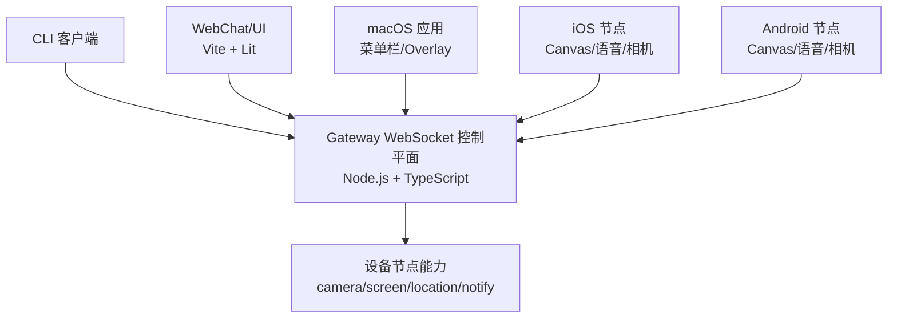
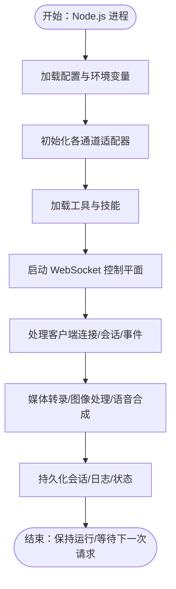
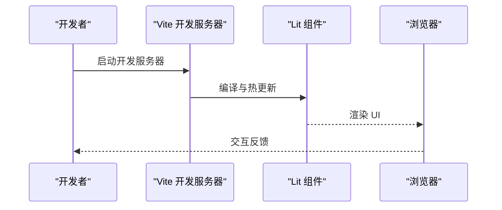
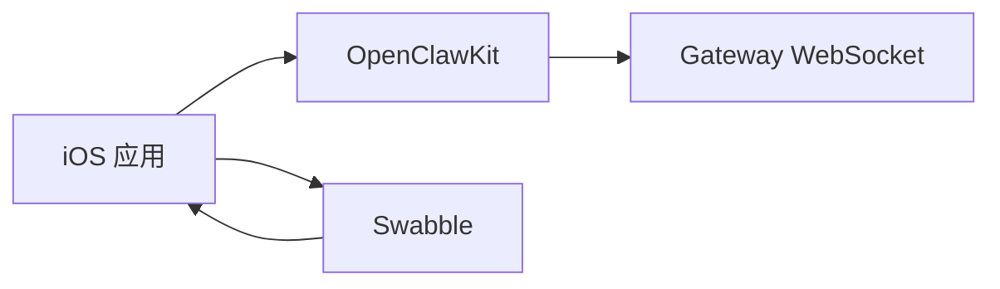
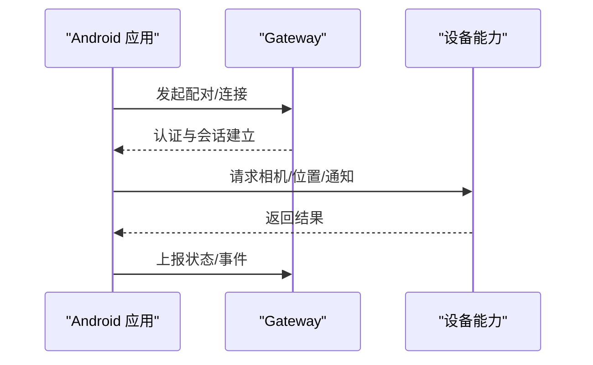
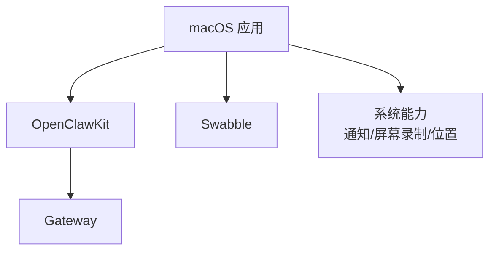
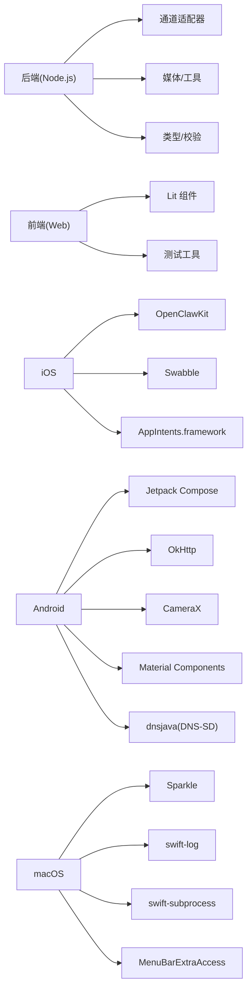

# 技术栈介绍

<cite>
**本文档引用的文件**
- [package.json](file://package.json)
- [tsconfig.json](file://tsconfig.json)
- [ui/package.json](file://ui/package.json)
- [ui/vite.config.ts](file://ui/vite.config.ts)
- [Swabble/Package.swift](file://Swabble/Package.swift)
- [apps/macos/Package.swift](file://apps/macos/Package.swift)
- [apps/shared/OpenClawKit/Package.swift](file://apps/shared/OpenClawKit/Package.swift)
- [apps/android/build.gradle.kts](file://apps/android/build.gradle.kts)
- [apps/android/app/build.gradle.kts](file://apps/android/app/build.gradle.kts)
- [apps/ios/project.yml](file://apps/ios/project.yml)
- [README.md](file://README.md)
- [Swabble/README.md](file://Swabble/README.md)
- [apps/ios/README.md](file://apps/ios/README.md)
- [apps/android/README.md](file://apps/android/README.md)
</cite>

## 目录

1. [简介](#简介)
2. [项目结构](#项目结构)
3. [核心组件](#核心组件)
4. [架构总览](#架构总览)
5. [详细组件分析](#详细组件分析)
6. [依赖关系分析](#依赖关系分析)
7. [性能考虑](#性能考虑)
8. [故障排查指南](#故障排查指南)
9. [结论](#结论)
10. [附录](#附录)

## 简介

本文件系统化梳理 OpenClaw 的技术栈与选型依据，覆盖后端（Node.js + TypeScript）、前端（Lit + 现代 Web 技术）、移动端（iOS 原生 + Android 原生）以及桌面应用（macOS）。我们将从技术动机、优势、适用场景、主要依赖、版本与兼容性、演进历史与未来规划等维度进行说明，帮助开发者快速理解并高效参与项目。

## 项目结构

OpenClaw 采用多语言混合工程组织方式：

- 后端与核心逻辑：以 Node.js + TypeScript 为主，统一在 monorepo 中管理，通过脚本与工具链完成构建、测试与打包。
- 前端控制界面：基于 Vite + Lit 的现代 Web 应用，提供控制面板与聊天界面。
- 移动端与桌面：分别采用 Swift（iOS/macOS）与 Kotlin（Android），通过共享库 OpenClawKit 实现协议与 UI 组件复用。
- 语音唤醒子系统：独立的 Swift 模块 Swabble，提供本地化的唤醒词检测与钩子机制。

```mermaid
graph TB
subgraph "后端(Node.js/TypeScript)"
TS["TypeScript 源码<br/>src/**/*"]
PKG["package.json<br/>依赖与脚本"]
TSCFG["tsconfig.json<br/>编译配置"]
end
subgraph "前端(Web)"
UI_PKG["ui/package.json<br/>Lit + Vite"]
UI_CFG["ui/vite.config.ts<br/>构建配置"]
UI_SRC["UI 源码<br/>ui/src/**/*"]
end
subgraph "移动端(ios)"
IOS_PKG["apps/ios/project.yml<br/>XcodeGen 配置"]
IOS_SRC["iOS 源码<br/>apps/ios/Sources/**/*"]
OPENKIT_IOS["OpenClawKit(iOS)<br/>共享库"]
end
subgraph "移动端(android)"
AND_PKG["apps/android/build.gradle.kts<br/>Gradle 插件"]
AND_APP["apps/android/app/build.gradle.kts<br/>应用模块"]
AND_SRC["Android 源码<br/>apps/android/app/src/**/*"]
end
subgraph "桌面(macOS)"
MAC_PKG["apps/macos/Package.swift<br/>SwiftPM 配置"]
MAC_SRC["macOS 源码<br/>apps/macos/Sources/**/*"]
OPENKIT_MAC["OpenClawKit(macOS)<br/>共享库"]
SWABBLE["Swabble<br/>语音唤醒"]
end
TS --> PKG
TSCFG --> TS
UI_SRC --> UI_PKG
UI_PKG --> UI_CFG
IOS_SRC --> OPENKIT_IOS
AND_SRC --> AND_APP
MAC_SRC --> OPENKIT_MAC
OPENKIT_MAC --> SWABBLE
```

图表来源

- [package.json](file://package.json#L1-L219)
- [tsconfig.json](file://tsconfig.json#L1-L28)
- [ui/package.json](file://ui/package.json#L1-L24)
- [ui/vite.config.ts](file://ui/vite.config.ts#L1-L42)
- [apps/ios/project.yml](file://apps/ios/project.yml#L1-L135)
- [apps/android/build.gradle.kts](file://apps/android/build.gradle.kts#L1-L7)
- [apps/android/app/build.gradle.kts](file://apps/android/app/build.gradle.kts#L1-L129)
- [apps/macos/Package.swift](file://apps/macos/Package.swift#L1-L93)
- [Swabble/Package.swift](file://Swabble/Package.swift#L1-L56)

章节来源

- [package.json](file://package.json#L1-L219)
- [tsconfig.json](file://tsconfig.json#L1-L28)
- [ui/package.json](file://ui/package.json#L1-L24)
- [ui/vite.config.ts](file://ui/vite.config.ts#L1-L42)
- [apps/ios/project.yml](file://apps/ios/project.yml#L1-L135)
- [apps/android/build.gradle.kts](file://apps/android/build.gradle.kts#L1-L7)
- [apps/android/app/build.gradle.kts](file://apps/android/app/build.gradle.kts#L1-L129)
- [apps/macos/Package.swift](file://apps/macos/Package.swift#L1-L93)
- [Swabble/Package.swift](file://Swabble/Package.swift#L1-L56)

## 核心组件

- 后端运行时与包管理
  - 运行时：Node.js ≥ 22；包管理器：pnpm。
  - 构建与打包：tsdown、tsx、Vitest、Vite 等。
  - 脚本与任务：通过 package.json 的 scripts 统一编排，涵盖构建、测试、UI 打包、协议生成、插件版本同步等。
- 前端控制界面
  - 框架：Lit 3.x、Vite 7.x。
  - 功能：控制面板、WebChat、资源构建与预览。
- 移动端与桌面
  - iOS：Swift 6.0（XcodeGen 驱动），目标 iOS 18+，使用 OpenClawKit 共享库与 Swabble 语音唤醒。
  - Android：Kotlin + Jetpack Compose，目标 Android 12+（minSdk 31），通过 Gradle 插件与 Compose 生态集成。
  - macOS：SwiftPM 工程，目标 macOS 15+，提供菜单栏应用、IPC 与发现服务。
- 共享库 OpenClawKit
  - 提供协议、聊天 UI 组件与跨平台能力，iOS/macOS 双端共享。
- 语音唤醒 Swabble
  - 独立 Swift 模块，提供本地唤醒词检测、钩子执行与日志记录，面向 iOS/macOS 平台。

章节来源

- [package.json](file://package.json#L111-L196)
- [ui/package.json](file://ui/package.json#L11-L22)
- [apps/ios/project.yml](file://apps/ios/project.yml#L2-L11)
- [apps/android/app/build.gradle.kts](file://apps/android/app/build.gradle.kts#L10-L26)
- [apps/macos/Package.swift](file://apps/macos/Package.swift#L6-L10)
- [apps/shared/OpenClawKit/Package.swift](file://apps/shared/OpenClawKit/Package.swift#L5-L10)
- [Swabble/README.md](file://Swabble/README.md#L1-L112)

## 架构总览

OpenClaw 的核心是“网关 WebSocket 控制平面”，所有客户端（CLI、WebChat、macOS 应用、iOS/Android 节点）通过该平面进行会话、工具与事件交互。桌面与移动应用作为“节点”扩展设备能力（如摄像头、屏幕录制、位置、通知等），并通过 Gateway 协议进行安全调用。

图表来源

- [README.md](file://README.md#L180-L207)
- [apps/ios/README.md](file://apps/ios/README.md#L11-L17)
- [apps/android/README.md](file://apps/android/README.md#L3-L9)

章节来源

- [README.md](file://README.md#L180-L207)
- [apps/ios/README.md](file://apps/ios/README.md#L11-L17)
- [apps/android/README.md](file://apps/android/README.md#L3-L9)

## 详细组件分析

### 后端：Node.js + TypeScript

- 语言与运行时
  - 使用 ES2023 目标与 NodeNext 模块解析，启用严格类型检查与实验性装饰器。
  - Node.js 版本要求 ≥ 22，包管理器为 pnpm。
- 关键依赖与生态
  - Web/通道适配：Express 5、ws、grammy、@whiskeysockets/baileys、@slack/bolt 等。
  - 工具与媒体：sharp、pdfjs-dist、@xterm/headless、node-edge-tts 等。
  - 类型与校验：@sinclair/typebox、zod、ajv。
  - 开发工具：tsx、tsdown、vitest、oxlint、rolldown。
- 构建与测试
  - 通过脚本统一执行构建、打包、测试与覆盖率统计；支持 UI 子工程构建与测试。
- 适用场景
  - 多通道消息接入、工具执行、会话与媒体处理、远程暴露与安全控制。

图表来源

- [package.json](file://package.json#L33-L110)
- [tsconfig.json](file://tsconfig.json#L2-L26)

章节来源

- [package.json](file://package.json#L111-L196)
- [tsconfig.json](file://tsconfig.json#L2-L26)

### 前端：Lit + Vite

- 技术选型
  - UI 框架：Lit 3.x，轻量且与 Web Components 生态契合。
  - 构建工具：Vite 7.x，提供快速开发服务器与生产构建。
  - 依赖：dompurify、marked、playwright（浏览器测试）。
- 构建流程
  - 通过 ui/vite.config.ts 配置输出目录、公共目录与开发服务器端口；支持环境变量 base 路径定制。
- 适用场景
  - 控制面板、WebChat、仪表盘与调试工具，强调响应式与可组合 UI。

图表来源

- [ui/vite.config.ts](file://ui/vite.config.ts#L21-L41)
- [ui/package.json](file://ui/package.json#L5-L22)

章节来源

- [ui/package.json](file://ui/package.json#L11-L22)
- [ui/vite.config.ts](file://ui/vite.config.ts#L1-L42)

### 移动端：iOS 原生

- 平台与工具链
  - Swift 6.0，XcodeGen 驱动，目标 iOS 18+。
  - 通过 SwiftPM 引入 OpenClawKit 与 Swabble，实现协议与语音唤醒能力。
- 能力与权限
  - 支持 Canvas、Talk/Chat、相机、位置、照片、日历、提醒等（受 iOS 权限约束）。
- 适用场景
  - 作为“节点”连接到 Gateway，提供本地化能力与持续交互体验。

图表来源

- [apps/ios/project.yml](file://apps/ios/project.yml#L12-L41)
- [apps/shared/OpenClawKit/Package.swift](file://apps/shared/OpenClawKit/Package.swift#L16-L47)
- [Swabble/Package.swift](file://Swabble/Package.swift#L1-L56)

章节来源

- [apps/ios/project.yml](file://apps/ios/project.yml#L1-L135)
- [apps/shared/OpenClawKit/Package.swift](file://apps/shared/OpenClawKit/Package.swift#L1-L62)
- [Swabble/Package.swift](file://Swabble/Package.swift#L1-L56)
- [apps/ios/README.md](file://apps/ios/README.md#L1-L67)

### 移动端：Android 原生

- 平台与工具链
  - Kotlin + Jetpack Compose，目标 Android 12+（minSdk 31），Gradle 插件由 build.gradle.kts 统一声明。
  - Compose BOM、OkHttp、CameraX、Material Components 等生态集成。
- 能力与权限
  - 前台服务维持连接、相机快照/视频、屏幕录制、位置获取、通知等；按需申请权限。
- 适用场景
  - 作为“节点”提供设备能力，与 iOS/macOS 共享同一会话与命令语义。

图表来源

- [apps/android/app/build.gradle.kts](file://apps/android/app/build.gradle.kts#L80-L124)
- [apps/android/README.md](file://apps/android/README.md#L3-L9)

章节来源

- [apps/android/build.gradle.kts](file://apps/android/build.gradle.kts#L1-L7)
- [apps/android/app/build.gradle.kts](file://apps/android/app/build.gradle.kts#L1-L129)
- [apps/android/README.md](file://apps/android/README.md#L1-L52)

### 桌面应用：macOS

- 平台与工具链
  - SwiftPM 工程，目标 macOS 15+，集成 MenuBarExtraAccess、Subprocess、Logging、Sparkle 等。
  - 通过 OpenClawKit 提供协议与 UI 组件，Swabble 提供语音唤醒。
- 能力与权限
  - 菜单栏控制、语音唤醒/PTT、WebChat、远程网关控制、屏幕录制与系统通知等。
- 适用场景
  - 作为本地控制中心与节点，提供高权限与强交互体验。

图表来源

- [apps/macos/Package.swift](file://apps/macos/Package.swift#L17-L57)
- [apps/shared/OpenClawKit/Package.swift](file://apps/shared/OpenClawKit/Package.swift#L16-L52)
- [Swabble/Package.swift](file://Swabble/Package.swift#L1-L56)

章节来源

- [apps/macos/Package.swift](file://apps/macos/Package.swift#L1-L93)
- [apps/shared/OpenClawKit/Package.swift](file://apps/shared/OpenClawKit/Package.swift#L1-L62)
- [Swabble/Package.swift](file://Swabble/Package.swift#L1-L56)
- [Swabble/README.md](file://Swabble/README.md#L1-L112)

## 依赖关系分析

- 后端依赖
  - 通道与消息：grammy、@whiskeysockets/baileys、@slack/bolt、discord-api-types 等。
  - 媒体与工具：sharp、pdfjs-dist、@xterm/headless、node-edge-tts。
  - 类型与校验：@sinclair/typebox、zod、ajv。
  - 开发与构建：tsx、tsdown、vitest、oxlint、rolldown。
- 前端依赖
  - UI：lit、marked、dompurify。
  - 测试：vitest、playwright。
- 移动端依赖
  - iOS：OpenClawKit、Swabble、AppIntents.framework。
  - Android：Compose BOM、OkHttp、CameraX、Material Components、dnsjava（DNS-SD）。
- 桌面依赖
  - macOS：MenuBarExtraAccess、Subprocess、Logging、Sparkle、Peekaboo。

图表来源

- [package.json](file://package.json#L111-L163)
- [ui/package.json](file://ui/package.json#L11-L17)
- [apps/ios/project.yml](file://apps/ios/project.yml#L12-L41)
- [apps/android/app/build.gradle.kts](file://apps/android/app/build.gradle.kts#L80-L124)
- [apps/macos/Package.swift](file://apps/macos/Package.swift#L17-L57)

章节来源

- [package.json](file://package.json#L111-L196)
- [ui/package.json](file://ui/package.json#L11-L22)
- [apps/ios/project.yml](file://apps/ios/project.yml#L1-L135)
- [apps/android/app/build.gradle.kts](file://apps/android/app/build.gradle.kts#L80-L124)
- [apps/macos/Package.swift](file://apps/macos/Package.swift#L1-L93)

## 性能考虑

- 后端
  - 使用高性能媒体处理库（sharp、pdfjs-dist）与流式传输（ws、undici）降低延迟。
  - 严格类型与静态校验减少运行时错误，提升稳定性。
- 前端
  - Lit 的细粒度更新与 Vite 的快速热更新，优化开发体验与首屏渲染。
- 移动端
  - Android 使用 CameraX 与 OkHttp，iOS 使用系统级权限与 AppIntents，确保低开销与高可用。
- 桌面
  - macOS 使用 Sparkle 自动更新与 Logging 统一日志，结合 MenuBarExtraAccess 提升交互效率。

## 故障排查指南

- Node.js 运行时
  - 确认 Node.js 版本满足 ≥ 22；使用 pnpm 安装依赖；通过脚本执行构建与测试。
- 前端
  - 若 UI 构建失败，检查 ui/vite.config.ts 的 base 与输出目录；确认依赖安装与测试通过。
- iOS
  - 确认 Xcode 与 Swift 6.0；若签名或权限问题，参考 iOS README 的配对与权限说明。
- Android
  - 确认 minSdk 与权限清单；前台服务与相机/麦克风权限按需申请。
- macOS
  - 确认 macOS 15+；若更新失败，检查 Sparkle 配置与签名；关注 Swabble 的语音授权与设备可用性。

章节来源

- [README.md](file://README.md#L47-L62)
- [ui/vite.config.ts](file://ui/vite.config.ts#L21-L41)
- [apps/ios/README.md](file://apps/ios/README.md#L28-L48)
- [apps/android/README.md](file://apps/android/README.md#L43-L52)
- [Swabble/README.md](file://Swabble/README.md#L108-L112)

## 结论

OpenClaw 的技术栈围绕“统一网关 + 多端节点”的理念设计：后端以 Node.js + TypeScript 提供稳定可控的控制平面；前端以 Lit + Vite 提供现代化 Web 体验；移动端与桌面以 Swift/Kotlin 原生实现，借助 SwiftPM 与 Gradle 生态，配合共享库 OpenClawKit 与 Swabble，形成一致的协议与能力边界。该架构兼顾性能、可维护性与扩展性，适合构建本地优先、跨平台的个人 AI 助手系统。

## 附录

- 版本与兼容性要点
  - Node.js：≥ 22；包管理器：pnpm。
  - TypeScript：ES2023 目标，NodeNext 模块解析，严格模式。
  - iOS：Swift 6.0，目标 iOS 18+。
  - Android：minSdk 31，Kotlin + Jetpack Compose。
  - macOS：目标 macOS 15+。
- 演进与规划
  - Swabble：计划完善 launchd 控制、JSON 日志与更强的唤醒词检测。
  - iOS/Android：持续打磨 UI 与后台行为，强化权限与稳定性。
  - 共享库：OpenClawKit 将持续增强协议与 UI 组件的跨平台一致性。

章节来源

- [README.md](file://README.md#L47-L62)
- [tsconfig.json](file://tsconfig.json#L8-L18)
- [apps/ios/project.yml](file://apps/ios/project.yml#L4-L6)
- [apps/android/app/build.gradle.kts](file://apps/android/app/build.gradle.kts#L20-L26)
- [apps/macos/Package.swift](file://apps/macos/Package.swift#L7-L9)
- [Swabble/README.md](file://Swabble/README.md#L108-L112)
