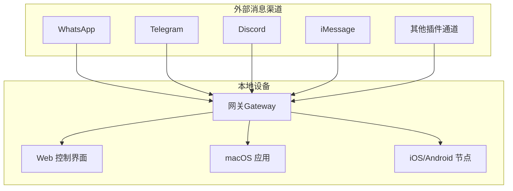
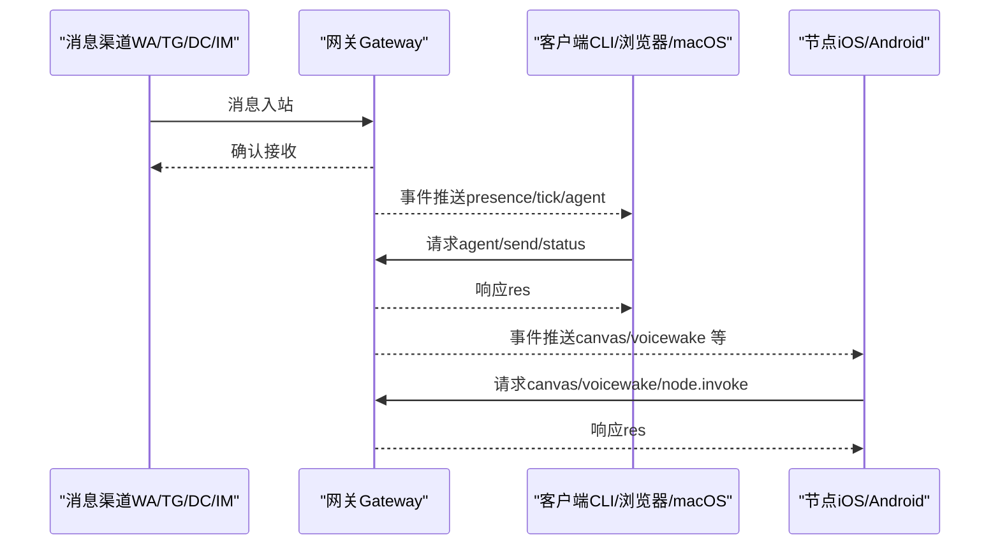
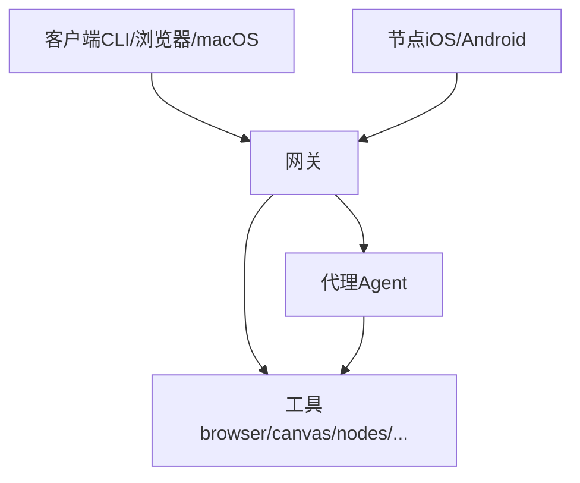

# 核心价值主张

<cite>
**本文引用的文件**
- [README.md](file://README.md)
- [docs/index.md](file://docs/index.md)
- [docs/start/openclaw.md](file://docs/start/openclaw.md)
- [docs/concepts/architecture.md](file://docs/concepts/architecture.md)
- [docs/concepts/features.md](file://docs/concepts/features.md)
- [docs/gateway/configuration.md](file://docs/gateway/configuration.md)
- [docs/nodes/voicewake.md](file://docs/nodes/voicewake.md)
- [docs/platforms/mac/canvas.md](file://docs/platforms/mac/canvas.md)
- [docs/channels/index.md](file://docs/channels/index.md)
- [docs/gateway/security/index.md](file://docs/gateway/security/index.md)
- [docs/concepts/model-failover.md](file://docs/concepts/model-failover.md)
</cite>

## 目录

1. [引言](#引言)
2. [项目结构](#项目结构)
3. [核心组件](#核心组件)
4. [架构总览](#架构总览)
5. [详细组件分析](#详细组件分析)
6. [依赖关系分析](#依赖关系分析)
7. [性能考量](#性能考量)
8. [故障排查指南](#故障排查指南)
9. [结论](#结论)
10. [附录](#附录)

## 引言

OpenClaw 是一款在您自己的设备上运行的个人 AI 助手。它以“本地优先”的方式提供即时、始终在线的智能体验，并通过统一的网关（Gateway）连接多渠道消息通道（如 WhatsApp、Telegram、Discord、iMessage 等），同时支持跨平台节点（macOS/iOS/Android）与 Canvas 可视化工作区。其核心理念是去中心化、隐私保护与多平台集成，使用户在不牺牲数据主权的前提下，获得强大而灵活的智能助理。

## 项目结构

OpenClaw 的价值体现在“单点网关 + 多端协同”的整体设计：网关负责会话、路由、事件与工具调用的控制平面；客户端（CLI、Web 控制界面、macOS 应用）与节点（移动与桌面设备）通过 WebSocket 连接网关，实现统一的身份认证、设备配对与能力授权。该结构确保了本地运行时的数据不出域、权限可审计、能力可扩展。

图示来源

- [docs/concepts/architecture.md](file://docs/concepts/architecture.md#L12-L22)
- [docs/channels/index.md](file://docs/channels/index.md#L14-L36)

章节来源

- [README.md](file://README.md#L21-L26)
- [docs/index.md](file://docs/index.md#L44-L56)
- [docs/concepts/architecture.md](file://docs/concepts/architecture.md#L12-L22)

## 核心组件

- 网关（Gateway）：单一长连接的控制平面，承载会话、路由、事件与工具调用；所有消息表面由网关统一维护与暴露。
- 客户端：包括 CLI、Web 控制界面与 macOS 应用，均通过 WebSocket 连接网关，支持请求、订阅与事件推送。
- 节点：macOS/iOS/Android 设备以“节点”角色连接网关，声明能力与命令集，实现本地权限与能力的受控执行。
- Canvas：基于 WKWebView 的可视化工作区，支持 A2UI 推送与本地文件系统访问，便于构建交互式可视化界面。
- 语音唤醒：全局唤醒词列表由网关持有并广播，各节点同步状态，实现一致的语音触发体验。

章节来源

- [docs/concepts/architecture.md](file://docs/concepts/architecture.md#L26-L44)
- [docs/platforms/mac/canvas.md](file://docs/platforms/mac/canvas.md#L10-L14)
- [docs/nodes/voicewake.md](file://docs/nodes/voicewake.md#L9-L16)

## 架构总览

下图展示了从消息入口到网关、再到客户端与节点的整体流程，以及网关如何通过 WebSocket 提供统一的请求/响应与事件推送机制。

图示来源

- [docs/concepts/architecture.md](file://docs/concepts/architecture.md#L58-L75)

章节来源

- [docs/concepts/architecture.md](file://docs/concepts/architecture.md#L56-L75)

## 详细组件分析

### 本地优先与始终在线

- 单一网关进程常驻，绑定回环地址或受控网络，结合令牌/密码认证与设备配对，确保本地运行时的最小暴露面。
- 支持心跳（heartbeat）与定时任务（cron），在无人值守时也能保持活跃与例行检查。
- 远程访问通过 Tailscale 或 SSH 隧道实现，既保证可用性又维持本地信任边界。

章节来源

- [docs/start/openclaw.md](file://docs/start/openclaw.md#L13-L26)
- [docs/gateway/configuration.md](file://docs/gateway/configuration.md#L221-L238)
- [docs/concepts/architecture.md](file://docs/concepts/architecture.md#L111-L122)

### 去中心化与隐私保护

- 默认采用“配对/白名单”策略控制入站 DM 与群组触发，避免公开入口带来的风险。
- 会话日志与敏感文件存储于本地，需严格限制目录权限；建议使用沙箱与只读工作区降低攻击面。
- 浏览器控制与远程节点需在受信网络内启用，避免公网暴露。

章节来源

- [docs/gateway/security/index.md](file://docs/gateway/security/index.md#L180-L232)
- [docs/gateway/security/index.md](file://docs/gateway/security/index.md#L105-L111)
- [docs/gateway/security/index.md](file://docs/gateway/security/index.md#L471-L486)

### 多平台集成与统一控制

- 支持多渠道并行接入，统一路由至不同代理（Agent）与会话空间，实现“按人/按群/按账户”的隔离与联动。
- 客户端与节点共享同一协议与认证模型，设备配对后自动批准本地连接，远端连接需签名挑战并通过人工审批。

章节来源

- [docs/channels/index.md](file://docs/channels/index.md#L14-L36)
- [docs/concepts/architecture.md](file://docs/concepts/architecture.md#L90-L103)

### 多代理路由与复杂任务协调

- 通过多代理路由规则，将不同来源的消息映射到独立的工作区与会话，实现跨会话协作与上下文隔离。
- 提供会话工具（sessions_list/history/send/spawn）用于在代理间传递消息与状态，减少跨表面切换成本。

章节来源

- [docs/gateway/configuration.md](file://docs/gateway/configuration.md#L284-L304)
- [README.md](file://README.md#L250-L257)

### 语音唤醒与 Canvas 可视化增强交互

- 全局唤醒词列表由网关集中管理与广播，各节点本地仍保留启用/禁用开关，兼顾一致性与本地权限。
- Canvas 通过自定义 URL Scheme 提供本地文件系统访问与 A2UI 推送，支持在菜单栏附近弹出面板，实现所见即所得的可视化交互。

章节来源

- [docs/nodes/voicewake.md](file://docs/nodes/voicewake.md#L9-L16)
- [docs/platforms/mac/canvas.md](file://docs/platforms/mac/canvas.md#L10-L14)
- [docs/platforms/mac/canvas.md](file://docs/platforms/mac/canvas.md#L44-L66)

### 多渠道消息集成与无缝沟通

- 支持 WhatsApp、Telegram、Discord、iMessage、Google Chat、Signal、Microsoft Teams、Matrix、Zalo 等主流渠道，部分渠道通过插件扩展。
- 统一的媒体支持（图片/音频/文档）与提及触发（mention gating）策略，保障群聊中的可控响应。

章节来源

- [docs/channels/index.md](file://docs/channels/index.md#L14-L36)
- [docs/gateway/configuration.md](file://docs/gateway/configuration.md#L148-L174)

### 模型选择与容错（安全与稳定）

- 支持主模型与回退模型链路，配合认证档案轮转与指数退避冷却，提升在限流/配额不足场景下的稳定性。
- 建议优先选用具备更强抗提示注入能力的模型，降低高风险输入带来的安全风险。

章节来源

- [docs/concepts/model-failover.md](file://docs/concepts/model-failover.md#L130-L138)
- [docs/gateway/security/index.md](file://docs/gateway/security/index.md#L274-L284)

## 依赖关系分析

- 网关是所有消息表面与工具调用的唯一入口，客户端与节点均依赖其协议与认证。
- 客户端与节点之间通过事件总线互通（如 Canvas/A2UI、语音唤醒），但具体能力由网关授权与调度。
- 会话与路由规则决定消息流向与代理隔离，工具策略与沙箱进一步约束执行范围。

图示来源

- [docs/concepts/architecture.md](file://docs/concepts/architecture.md#L26-L44)

章节来源

- [docs/concepts/architecture.md](file://docs/concepts/architecture.md#L24-L44)

## 性能考量

- 本地运行避免云端往返延迟，结合 WebSocket 的低开销与事件驱动，实现快速响应与持续在线。
- 通过会话复用与工具缓存（如模型认证档案轮转）减少重复开销；在高负载场景下建议启用沙箱与只读工作区，平衡性能与安全。
- 心跳与定时任务的频率需根据实际需求权衡，避免过度消耗资源。

## 故障排查指南

- 使用诊断命令（如 doctor、status、health）快速定位配置错误、网络暴露与权限问题。
- 若出现“公开入口”或“弱认证”，立即收紧 DM/群组策略与网关认证模式，并调整绑定与暴露策略。
- 对于浏览器控制与远程节点，优先在受信网络内启用，避免公网直连。

章节来源

- [docs/gateway/security/index.md](file://docs/gateway/security/index.md#L14-L22)
- [docs/gateway/security/index.md](file://docs/gateway/security/index.md#L342-L358)
- [docs/gateway/security/index.md](file://docs/gateway/security/index.md#L471-L486)

## 结论

OpenClaw 将“本地优先、隐私保护、多平台集成”落实到架构与协议层面：以单一网关为核心，统一消息入口、会话与工具调用；通过严格的认证与配对、白名单与沙箱策略，确保数据不出域；借助多代理路由、语音唤醒与 Canvas 可视化，提供无缝且可扩展的智能助理体验。对于追求自主可控与隐私安全的用户而言，OpenClaw 提供了从入门到进阶的完整路径与强大的工程化能力。

## 附录

- 快速开始与向导：通过 `openclaw onboard` 完成安装与服务安装，随后启动网关并进行渠道配对。
- 配置热重载：大多数设置可在不重启的情况下即时生效，关键变更（如端口/认证）按模式自动处理。
- 文档导航：从“概念总览”到“功能清单”，再到“安全与排障”，形成完整的知识闭环。

章节来源

- [README.md](file://README.md#L58-L76)
- [docs/index.md](file://docs/index.md#L96-L118)
- [docs/gateway/configuration.md](file://docs/gateway/configuration.md#L330-L368)
