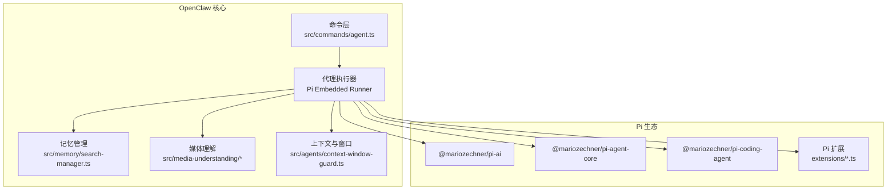
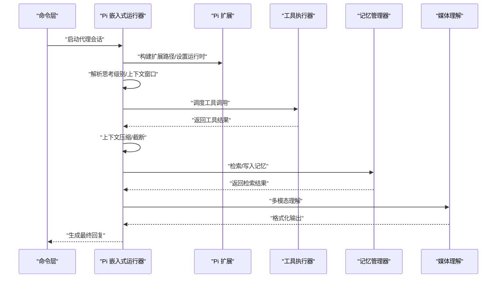
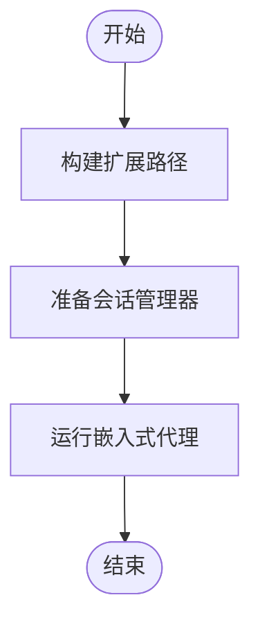
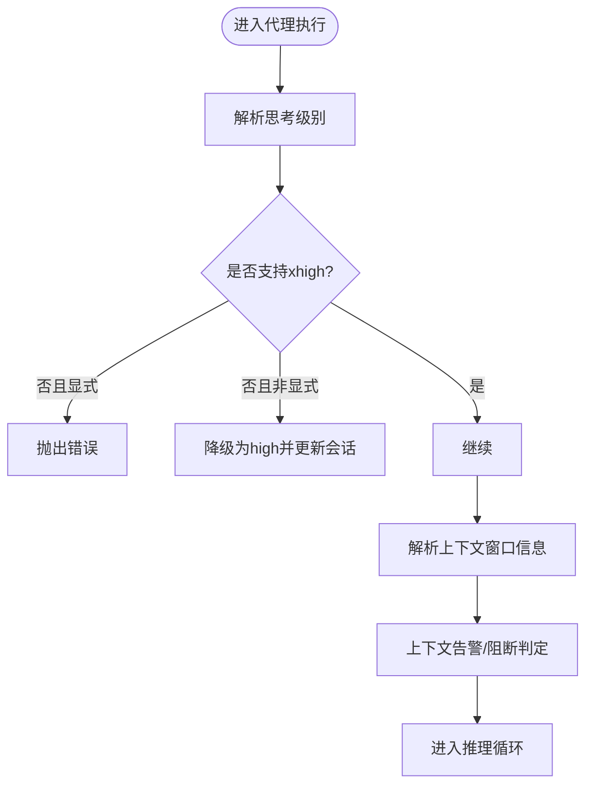
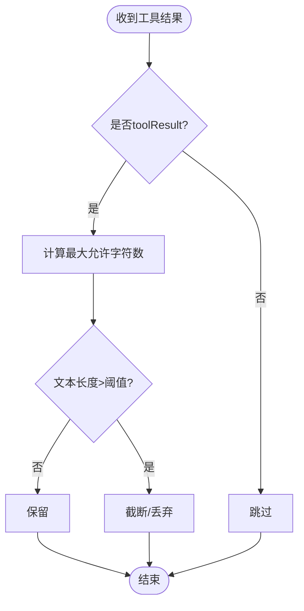
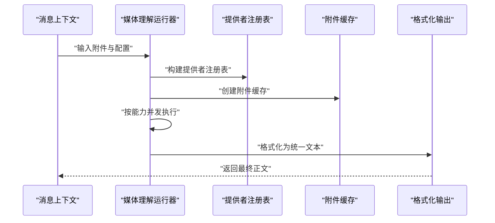
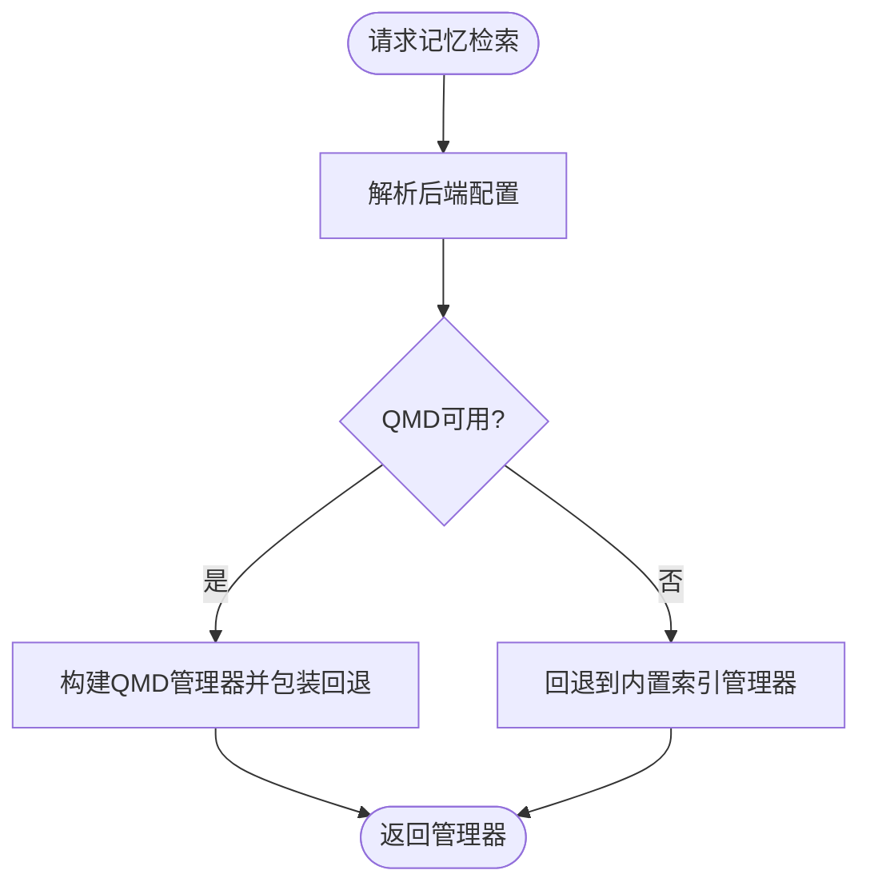
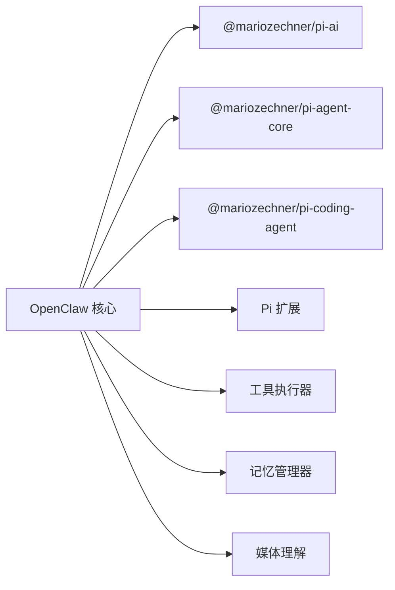

# AI代理系统

<cite>
**本文引用的文件**
- [docs/pi.md](file://docs/pi.md)
- [src/agents/pi-embedded-runner/tool-result-truncation.ts](file://src/agents/pi-embedded-runner/tool-result-truncation.ts)
- [src/agents/context-window-guard.ts](file://src/agents/context-window-guard.ts)
- [src/auto-reply/reply/commands-context-report.ts](file://src/auto-reply/reply/commands-context-report.ts)
- [src/media-understanding/runner.ts](file://src/media-understanding/runner.ts)
- [src/media-understanding/format.ts](file://src/media-understanding/format.ts)
- [src/media-understanding/apply.ts](file://src/media-understanding/apply.ts)
- [src/media-understanding/providers/index.ts](file://src/media-understanding/providers/index.ts)
- [src/memory/search-manager.ts](file://src/memory/search-manager.ts)
- [docs/design/cross-session-memory-sync.md](file://docs/design/cross-session-memory-sync.md)
- [src/commands/agent.ts](file://src/commands/agent.ts)
- [dist/plugin-sdk/agents/pi-embedded-runner/run.d.ts](file://dist/plugin-sdk/agents/pi-embedded-runner/run.d.ts)
- [dist/plugin-sdk/agents/pi-embedded-runner/extensions.d.ts](file://dist/plugin-sdk/agents/pi-embedded-runner/extensions.d.ts)
- [dist/plugin-sdk/agents/pi-embedded-runner/session-manager-init.d.ts](file://dist/plugin-sdk/agents/pi-embedded-runner/session-manager-init.d.ts)
</cite>

## 目录

1. [简介](#简介)
2. [项目结构](#项目结构)
3. [核心组件](#核心组件)
4. [架构总览](#架构总览)
5. [详细组件分析](#详细组件分析)
6. [依赖关系分析](#依赖关系分析)
7. [性能考量](#性能考量)
8. [故障排查指南](#故障排查指南)
9. [结论](#结论)
10. [附录](#附录)

## 简介

本技术文档面向OpenClaw AI代理系统的Pi Agent Core集成，系统性阐述代理的集成架构、代理配置管理、工具执行机制、记忆管理系统、思考级别控制、工具调用流程、上下文窗口管理、会话状态维护、多模态能力（媒体理解）、推理过程与输出格式化，并提供工具开发指南、记忆检索算法与上下文压缩策略、性能优化与并发控制、错误处理最佳实践以及具体配置示例与调试技巧。

## 项目结构

OpenClaw采用多语言混合架构，核心逻辑以TypeScript实现，围绕“命令-代理-工具-记忆-媒体理解”主线组织模块。Pi Agent Core通过嵌入式运行器与OpenClaw的会话管理、工具注册、模型选择、上下文压缩等机制协同工作。

图示来源

- [src/commands/agent.ts](file://src/commands/agent.ts#L339-L373)
- [src/agents/context-window-guard.ts](file://src/agents/context-window-guard.ts#L21-L55)
- [src/memory/search-manager.ts](file://src/memory/search-manager.ts#L19-L55)
- [src/media-understanding/runner.ts](file://src/media-understanding/runner.ts#L1152-L1298)
- [docs/pi.md](file://docs/pi.md#L31-L532)

章节来源

- [docs/pi.md](file://docs/pi.md#L31-L532)
- [src/commands/agent.ts](file://src/commands/agent.ts#L339-L373)

## 核心组件

- Pi 集成与运行器
  - 通过嵌入式运行器启动Pi Agent Core，支持扩展加载、会话初始化与运行参数构建。
  - 关键接口定义位于插件SDK中，包括运行入口、扩展路径构建、会话准备等。
- 上下文窗口与思考级别
  - 上下文窗口信息解析与告警/阻断判定；思考级别默认解析与降级策略。
- 工具执行与结果截断
  - 工具结果大小限制与超限检测，避免上下文溢出。
- 媒体理解（多模态）
  - 多能力（音频转写、图像描述、视频摘要）并行执行，按策略选择模型与提示词，格式化输出。
- 记忆系统
  - 记忆检索管理器构建与回退策略，支持跨会话增量同步设计。

章节来源

- [dist/plugin-sdk/agents/pi-embedded-runner/run.d.ts](file://dist/plugin-sdk/agents/pi-embedded-runner/run.d.ts#L1-L4)
- [dist/plugin-sdk/agents/pi-embedded-runner/extensions.d.ts](file://dist/plugin-sdk/agents/pi-embedded-runner/extensions.d.ts#L1-L13)
- [dist/plugin-sdk/agents/pi-embedded-runner/session-manager-init.d.ts](file://dist/plugin-sdk/agents/pi-embedded-runner/session-manager-init.d.ts#L1-L18)
- [src/agents/context-window-guard.ts](file://src/agents/context-window-guard.ts#L21-L55)
- [src/commands/agent.ts](file://src/commands/agent.ts#L339-L373)
- [src/agents/pi-embedded-runner/tool-result-truncation.ts](file://src/agents/pi-embedded-runner/tool-result-truncation.ts#L291-L328)
- [src/media-understanding/runner.ts](file://src/media-understanding/runner.ts#L1152-L1298)
- [src/media-understanding/format.ts](file://src/media-understanding/format.ts#L1-L98)
- [src/media-understanding/apply.ts](file://src/media-understanding/apply.ts#L454-L503)
- [src/memory/search-manager.ts](file://src/memory/search-manager.ts#L19-L55)

## 架构总览

OpenClaw通过命令层触发代理执行，Pi嵌入式运行器负责会话生命周期、上下文管理、工具调用与媒体理解，记忆系统提供检索与持久化能力，Pi扩展用于上下文压缩与安全守卫。

图示来源

- [src/commands/agent.ts](file://src/commands/agent.ts#L339-L373)
- [src/agents/context-window-guard.ts](file://src/agents/context-window-guard.ts#L21-L55)
- [src/agents/pi-embedded-runner/tool-result-truncation.ts](file://src/agents/pi-embedded-runner/tool-result-truncation.ts#L291-L328)
- [src/media-understanding/runner.ts](file://src/media-understanding/runner.ts#L1152-L1298)
- [src/memory/search-manager.ts](file://src/memory/search-manager.ts#L19-L55)
- [docs/pi.md](file://docs/pi.md#L374-L403)

## 详细组件分析

### Pi 集成与运行器

- 运行入口
  - 提供统一的嵌入式运行函数，封装参数与结果类型，便于在OpenClaw中编排。
- 扩展加载
  - 根据配置与会话状态动态构建Pi扩展路径，支持压缩守卫与上下文修剪等扩展。
- 会话初始化
  - 针对SessionManager的持久化特性进行预处理，确保首次用户消息被正确持久化。

图示来源

- [dist/plugin-sdk/agents/pi-embedded-runner/extensions.d.ts](file://dist/plugin-sdk/agents/pi-embedded-runner/extensions.d.ts#L5-L12)
- [dist/plugin-sdk/agents/pi-embedded-runner/session-manager-init.d.ts](file://dist/plugin-sdk/agents/pi-embedded-runner/session-manager-init.d.ts#L11-L17)
- [dist/plugin-sdk/agents/pi-embedded-runner/run.d.ts](file://dist/plugin-sdk/agents/pi-embedded-runner/run.d.ts#L1-L4)

章节来源

- [docs/pi.md](file://docs/pi.md#L31-L532)
- [dist/plugin-sdk/agents/pi-embedded-runner/run.d.ts](file://dist/plugin-sdk/agents/pi-embedded-runner/run.d.ts#L1-L4)
- [dist/plugin-sdk/agents/pi-embedded-runner/extensions.d.ts](file://dist/plugin-sdk/agents/pi-embedded-runner/extensions.d.ts#L1-L13)
- [dist/plugin-sdk/agents/pi-embedded-runner/session-manager-init.d.ts](file://dist/plugin-sdk/agents/pi-embedded-runner/session-manager-init.d.ts#L1-L18)

### 思考级别控制与上下文窗口管理

- 思考级别解析与降级
  - 默认解析思考级别，当目标模型不支持“极高”思考级别时，若为显式请求则报错，否则降级为“高”，并更新会话存储。
- 上下文窗口信息
  - 优先从模型配置与模型元数据解析上下文窗口，再受全局上限约束，提供来源标记与告警/阻断判定。

图示来源

- [src/commands/agent.ts](file://src/commands/agent.ts#L339-L373)
- [src/agents/context-window-guard.ts](file://src/agents/context-window-guard.ts#L21-L55)

章节来源

- [src/commands/agent.ts](file://src/commands/agent.ts#L339-L373)
- [src/agents/context-window-guard.ts](file://src/agents/context-window-guard.ts#L21-L55)

### 工具执行机制与结果截断

- 工具结果大小限制
  - 对“工具结果”角色的消息进行长度检查，依据上下文窗口估算最大字符数，超过阈值则进行截断或放弃。
- 超大工具结果启发式检测
  - 遍历历史消息，快速判断是否存在超大工具结果导致上下文溢出，决定是否尝试截断。

图示来源

- [src/agents/pi-embedded-runner/tool-result-truncation.ts](file://src/agents/pi-embedded-runner/tool-result-truncation.ts#L291-L328)

章节来源

- [src/agents/pi-embedded-runner/tool-result-truncation.ts](file://src/agents/pi-embedded-runner/tool-result-truncation.ts#L291-L328)

### 媒体理解（多模态）与输出格式化

- 能力与并发
  - 支持多能力（音频转写、图像描述、视频摘要），按顺序并发执行，记录每次尝试与最终选择。
- 模型选择与提示词
  - 根据配置与活跃模型解析候选条目，支持自动解析与超时、提示词、字节/字符限制。
- 输出格式化
  - 将多段媒体理解输出合并为统一文本，保留用户附加文本，按类型分节展示，避免重复信息。

图示来源

- [src/media-understanding/apply.ts](file://src/media-understanding/apply.ts#L454-L503)
- [src/media-understanding/runner.ts](file://src/media-understanding/runner.ts#L1152-L1298)
- [src/media-understanding/format.ts](file://src/media-understanding/format.ts#L1-L98)
- [src/media-understanding/providers/index.ts](file://src/media-understanding/providers/index.ts#L1-L27)

章节来源

- [src/media-understanding/apply.ts](file://src/media-understanding/apply.ts#L454-L503)
- [src/media-understanding/runner.ts](file://src/media-understanding/runner.ts#L1152-L1298)
- [src/media-understanding/format.ts](file://src/media-understanding/format.ts#L1-L98)
- [src/media-understanding/providers/index.ts](file://src/media-understanding/providers/index.ts#L1-L27)

### 记忆系统与检索管理

- 检索管理器构建
  - 优先使用QMD后端，失败时回退到内置索引管理器；支持缓存与失效回调。
- 跨会话同步
  - 设计包含延迟与存储影响评估，保证异步增量同步不影响首响应时间，且与现有机制兼容。

图示来源

- [src/memory/search-manager.ts](file://src/memory/search-manager.ts#L19-L55)
- [docs/design/cross-session-memory-sync.md](file://docs/design/cross-session-memory-sync.md#L632-L724)

章节来源

- [src/memory/search-manager.ts](file://src/memory/search-manager.ts#L19-L55)
- [docs/design/cross-session-memory-sync.md](file://docs/design/cross-session-memory-sync.md#L632-L724)

### 代理配置管理与系统提示

- 系统提示构建
  - 统一构建系统提示，注入工具名称与摘要、技能提示、沙箱/运行时信息、记忆引用模式等。
- 配置来源与覆盖
  - 上下文窗口信息来源于模型配置、模型元数据与默认值，并受全局上限约束。

章节来源

- [src/auto-reply/reply/commands-context-report.ts](file://src/auto-reply/reply/commands-context-report.ts#L141-L183)
- [src/agents/context-window-guard.ts](file://src/agents/context-window-guard.ts#L21-L55)

## 依赖关系分析

Pi生态与OpenClaw核心模块之间的依赖关系如下：

图示来源

- [docs/pi.md](file://docs/pi.md#L31-L532)
- [src/memory/search-manager.ts](file://src/memory/search-manager.ts#L19-L55)
- [src/media-understanding/runner.ts](file://src/media-understanding/runner.ts#L1152-L1298)

章节来源

- [docs/pi.md](file://docs/pi.md#L31-L532)

## 性能考量

- 并发控制
  - 媒体理解按能力并发执行，结合并发度配置，平衡吞吐与资源占用。
- 上下文压缩与截断
  - 工具结果截断与上下文窗口告警/阻断，防止超大结果导致溢出。
- 记忆检索
  - QMD优先、回退策略与缓存，降低检索延迟与存储压力。
- 扩展与守卫
  - 压缩守卫与上下文修剪扩展在保障安全的同时减少冗余内容。

章节来源

- [src/media-understanding/apply.ts](file://src/media-understanding/apply.ts#L488-L488)
- [src/agents/pi-embedded-runner/tool-result-truncation.ts](file://src/agents/pi-embedded-runner/tool-result-truncation.ts#L291-L328)
- [src/memory/search-manager.ts](file://src/memory/search-manager.ts#L19-L55)
- [docs/pi.md](file://docs/pi.md#L374-L403)

## 故障排查指南

- 思考级别不支持
  - 当目标模型不支持“极高”思考级别时，显式请求会报错；建议降级或更换模型。
- 工具结果过大
  - 若出现上下文溢出，启用工具结果截断策略或缩短工具输出。
- 媒体理解失败
  - 检查提供者配置、超时与提示词；确认附件选择策略与缓存状态。
- 记忆不可用
  - 若QMD不可用，系统会回退到内置索引；检查后端可用性与权限。
- 扩展加载问题
  - 确认扩展路径构建与Pi扩展版本兼容性。

章节来源

- [src/commands/agent.ts](file://src/commands/agent.ts#L339-L373)
- [src/agents/pi-embedded-runner/tool-result-truncation.ts](file://src/agents/pi-embedded-runner/tool-result-truncation.ts#L291-L328)
- [src/media-understanding/runner.ts](file://src/media-understanding/runner.ts#L1152-L1298)
- [src/memory/search-manager.ts](file://src/memory/search-manager.ts#L19-L55)
- [docs/pi.md](file://docs/pi.md#L374-L403)

## 结论

OpenClaw通过Pi生态实现了高度可扩展的代理执行框架，结合上下文窗口管理、工具结果截断、多模态媒体理解与记忆检索，形成完整的推理与交互闭环。通过扩展与守卫机制，系统在保证安全性的同时兼顾性能与易用性。建议在生产环境中合理配置思考级别、上下文窗口与并发度，并持续监控记忆检索与媒体理解的延迟与稳定性。

## 附录

### 代理工具开发指南

- 工具签名与适配
  - 遵循Pi生态工具签名规范，必要时进行适配以兼容Pi Agent Core与Pi Coding Agent。
- 结果大小控制
  - 控制工具输出长度，避免超过上下文窗口阈值；必要时启用截断策略。
- 错误处理
  - 明确错误分类与重试策略，避免污染上下文。

章节来源

- [docs/pi.md](file://docs/pi.md#L524-L532)
- [src/agents/pi-embedded-runner/tool-result-truncation.ts](file://src/agents/pi-embedded-runner/tool-result-truncation.ts#L291-L328)

### 记忆检索算法与上下文压缩策略

- 检索算法
  - 优先QMD后端，失败回退内置索引；支持缓存与失效回调。
- 上下文压缩
  - 压缩守卫与上下文修剪扩展，结合令牌预算与工具失败/文件操作摘要，降低冗余。

章节来源

- [src/memory/search-manager.ts](file://src/memory/search-manager.ts#L19-L55)
- [docs/pi.md](file://docs/pi.md#L374-L403)
- [docs/design/cross-session-memory-sync.md](file://docs/design/cross-session-memory-sync.md#L632-L724)

### 代理配置示例与调试技巧

- 配置要点
  - 模型上下文窗口、思考级别默认值、媒体理解能力开关与并发度、记忆后端与增量同步策略。
- 调试技巧
  - 开启详细日志，观察媒体理解决策摘要、记忆检索延迟与工具结果截断情况；逐步调整上下文与并发度以平衡性能与质量。

章节来源

- [src/auto-reply/reply/commands-context-report.ts](file://src/auto-reply/reply/commands-context-report.ts#L141-L183)
- [src/media-understanding/runner.ts](file://src/media-understanding/runner.ts#L1152-L1298)
- [docs/design/cross-session-memory-sync.md](file://docs/design/cross-session-memory-sync.md#L632-L724)
