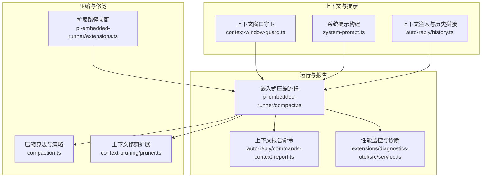
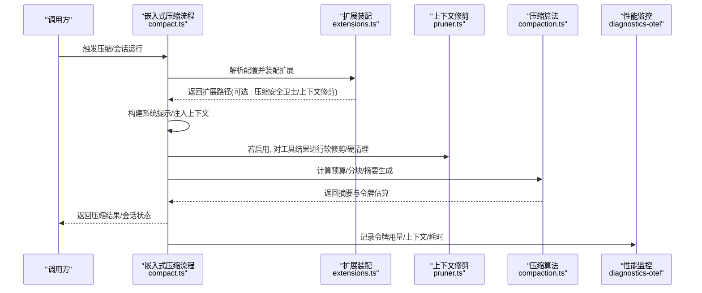
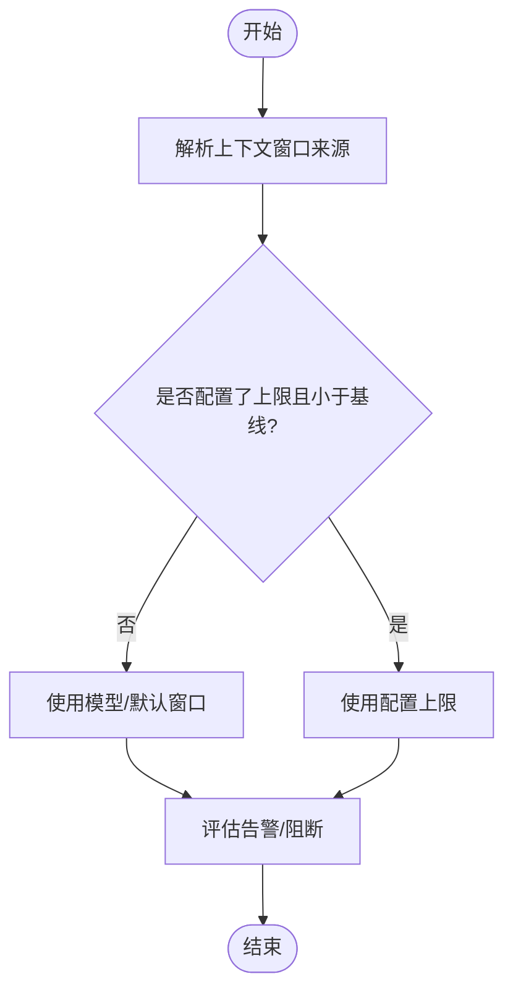
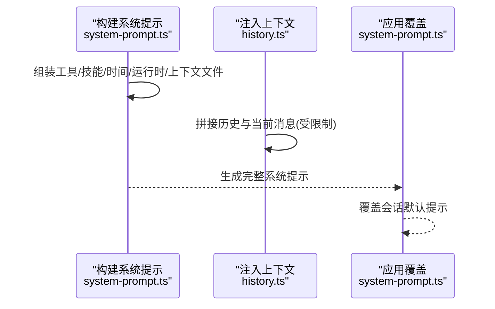
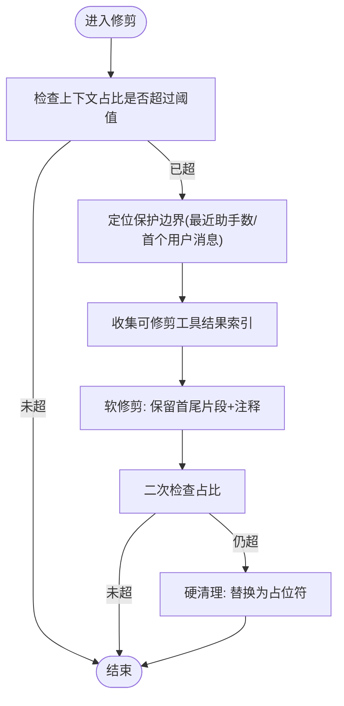
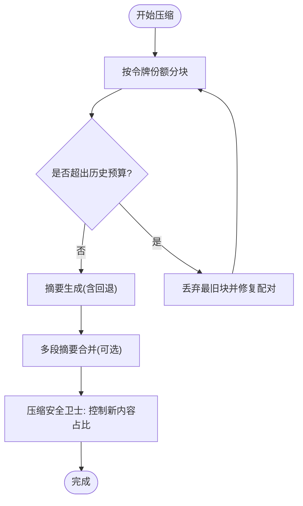
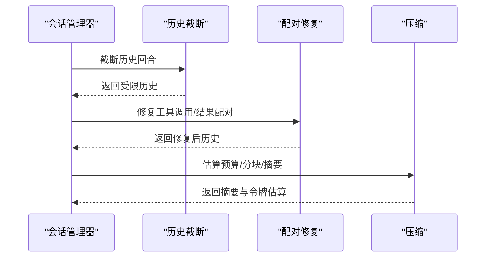
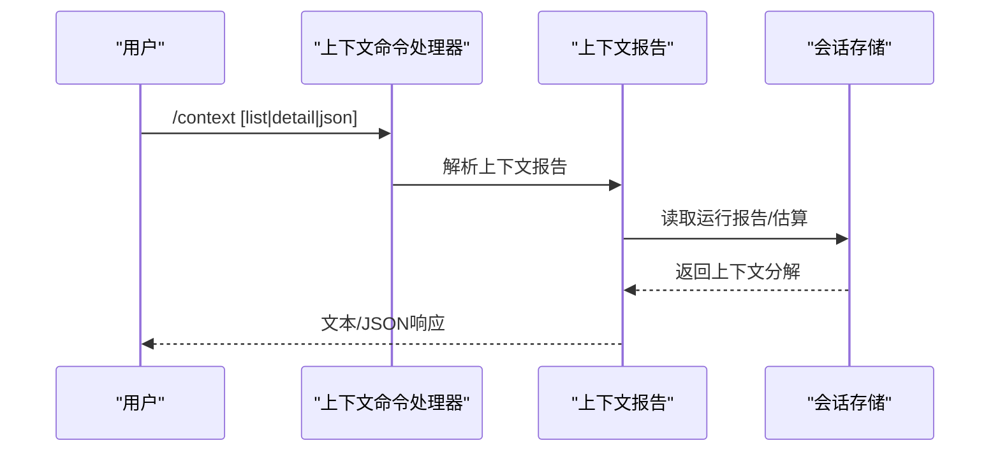
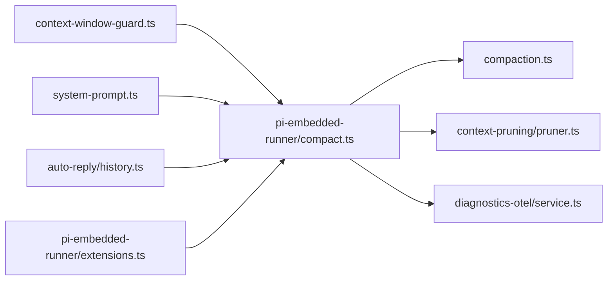

# 上下文处理机制

<cite>
**本文引用的文件**
- [src/agents/compaction.ts](file://src/agents/compaction.ts)
- [src/agents/pi-embedded-runner/compact.ts](file://src/agents/pi-embedded-runner/compact.ts)
- [src/agents/pi-embedded-runner/extensions.ts](file://src/agents/pi-embedded-runner/extensions.ts)
- [src/agents/pi-extensions/context-pruning/pruner.ts](file://src/agents/pi-extensions/context-pruning/pruner.ts)
- [src/agents/pi-extensions/context-pruning.ts](file://src/agents/pi-extensions/context-pruning.ts)
- [src/agents/context-window-guard.ts](file://src/agents/context-window-guard.ts)
- [src/agents/pi-embedded-runner/system-prompt.ts](file://src/agents/pi-embedded-runner/system-prompt.ts)
- [src/auto-reply/reply/history.ts](file://src/auto-reply/reply/history.ts)
- [src/auto-reply/reply/commands-context-report.ts](file://src/auto-reply/reply/commands-context-report.ts)
- [docs/concepts/context.md](file://docs/concepts/context.md)
- [docs/concepts/compaction.md](file://docs/concepts/compaction.md)
- [extensions/diagnostics-otel/src/service.ts](file://extensions/diagnostics-otel/src/service.ts)
</cite>

## 目录

1. [引言](#引言)
2. [项目结构](#项目结构)
3. [核心组件](#核心组件)
4. [架构总览](#架构总览)
5. [详细组件分析](#详细组件分析)
6. [依赖关系分析](#依赖关系分析)
7. [性能考量](#性能考量)
8. [故障排查指南](#故障排查指南)
9. [结论](#结论)
10. [附录](#附录)

## 引言

本文件面向OpenClaw的上下文处理机制，系统性阐述上下文窗口管理、内容压缩、系统提示工程与上下文注入策略，以及动态调整、历史消息修剪、重要信息保留与上下文完整性保障。同时覆盖系统提示的构建、参数化与个性化配置，上下文优化算法、性能监控与调试工具，并给出上下文长度限制、溢出处理与内存优化策略。

## 项目结构

OpenClaw围绕“嵌入式Pi会话”组织上下文处理逻辑，关键模块包括：

- 上下文窗口解析与守卫：决定模型上下文上限与运行期约束
- 系统提示工程：构建并注入到会话的系统提示
- 历史与上下文注入：历史拼接、工作区文件注入、工具Schema等
- 压缩与修剪：自动压缩与会话级修剪策略
- 运行期扩展：上下文修剪扩展、压缩安全卫士
- 性能监控与诊断：令牌用量、上下文直方图、耗时统计

**图表来源**

- [src/agents/context-window-guard.ts](file://src/agents/context-window-guard.ts#L21-L55)
- [src/agents/pi-embedded-runner/system-prompt.ts](file://src/agents/pi-embedded-runner/system-prompt.ts#L11-L78)
- [src/auto-reply/reply/history.ts](file://src/auto-reply/reply/history.ts#L106-L193)
- [src/agents/compaction.ts](file://src/agents/compaction.ts#L330-L392)
- [src/agents/pi-extensions/context-pruning/pruner.ts](file://src/agents/pi-extensions/context-pruning/pruner.ts#L225-L346)
- [src/agents/pi-embedded-runner/extensions.ts](file://src/agents/pi-embedded-runner/extensions.ts#L74-L102)
- [src/agents/pi-embedded-runner/compact.ts](file://src/agents/pi-embedded-runner/compact.ts#L497-L508)
- [src/auto-reply/reply/commands-context-report.ts](file://src/auto-reply/reply/commands-context-report.ts#L185-L228)
- [extensions/diagnostics-otel/src/service.ts](file://extensions/diagnostics-otel/src/service.ts#L346-L383)

**章节来源**

- [src/agents/context-window-guard.ts](file://src/agents/context-window-guard.ts#L1-L55)
- [src/agents/pi-embedded-runner/system-prompt.ts](file://src/agents/pi-embedded-runner/system-prompt.ts#L1-L100)
- [src/auto-reply/reply/history.ts](file://src/auto-reply/reply/history.ts#L106-L193)
- [src/agents/compaction.ts](file://src/agents/compaction.ts#L1-L397)
- [src/agents/pi-extensions/context-pruning/pruner.ts](file://src/agents/pi-extensions/context-pruning/pruner.ts#L1-L347)
- [src/agents/pi-embedded-runner/extensions.ts](file://src/agents/pi-embedded-runner/extensions.ts#L1-L105)
- [src/agents/pi-embedded-runner/compact.ts](file://src/agents/pi-embedded-runner/compact.ts#L1-L508)
- [src/auto-reply/reply/commands-context-report.ts](file://src/auto-reply/reply/commands-context-report.ts#L185-L228)
- [extensions/diagnostics-otel/src/service.ts](file://extensions/diagnostics-otel/src/service.ts#L346-L383)

## 核心组件

- 上下文窗口解析与守卫：从模型定义、配置与默认值中解析有效上下文上限，并提供告警与阻断判断
- 系统提示工程：构建包含工具清单、技能列表、时间/运行时信息、工作区上下文等的系统提示，并支持覆盖
- 历史与上下文注入：将历史消息、当前消息与工作区文件注入到提示中，支持按配置限制历史长度
- 压缩算法：基于消息分块、令牌估算与摘要生成，实现历史压缩与摘要合并
- 上下文修剪：对工具结果进行软修剪与硬清理，仅影响本次请求的内存上下文
- 运行期扩展装配：根据配置启用压缩安全卫士与上下文修剪扩展
- 性能监控与诊断：记录输入/输出/缓存/提示令牌用量、总用量、上下文限制与使用量、耗时等指标

**章节来源**

- [src/agents/context-window-guard.ts](file://src/agents/context-window-guard.ts#L21-L55)
- [src/agents/pi-embedded-runner/system-prompt.ts](file://src/agents/pi-embedded-runner/system-prompt.ts#L11-L78)
- [src/auto-reply/reply/history.ts](file://src/auto-reply/reply/history.ts#L106-L193)
- [src/agents/compaction.ts](file://src/agents/compaction.ts#L330-L392)
- [src/agents/pi-extensions/context-pruning/pruner.ts](file://src/agents/pi-extensions/context-pruning/pruner.ts#L225-L346)
- [src/agents/pi-embedded-runner/extensions.ts](file://src/agents/pi-embedded-runner/extensions.ts#L74-L102)
- [extensions/diagnostics-otel/src/service.ts](file://extensions/diagnostics-otel/src/service.ts#L346-L383)

## 架构总览

OpenClaw在每次嵌入式会话运行前，解析上下文窗口、构建系统提示、注入工作区与历史上下文，随后根据策略进行压缩或修剪，最后调用模型完成推理。运行期间可收集令牌用量与上下文直方图，辅助性能监控与调试。

**图表来源**

- [src/agents/pi-embedded-runner/compact.ts](file://src/agents/pi-embedded-runner/compact.ts#L497-L508)
- [src/agents/pi-embedded-runner/extensions.ts](file://src/agents/pi-embedded-runner/extensions.ts#L74-L102)
- [src/agents/pi-extensions/context-pruning/pruner.ts](file://src/agents/pi-extensions/context-pruning/pruner.ts#L225-L346)
- [src/agents/compaction.ts](file://src/agents/compaction.ts#L330-L392)
- [extensions/diagnostics-otel/src/service.ts](file://extensions/diagnostics-otel/src/service.ts#L346-L383)

## 详细组件分析

### 上下文窗口与长度限制

- 上下文窗口来源与覆盖：优先来自模型目录定义，其次来自运行时模型定义，再次来自全局配置上限，最终回退到默认值
- 告警与阻断：当配置的上限低于基线窗口时发出警告；提供阻断判定入口
- 运行期令牌估算：用于压缩与修剪的预算计算

**图表来源**

- [src/agents/context-window-guard.ts](file://src/agents/context-window-guard.ts#L21-L55)

**章节来源**

- [src/agents/context-window-guard.ts](file://src/agents/context-window-guard.ts#L1-L55)
- [docs/concepts/context.md](file://docs/concepts/context.md#L46-L48)

### 系统提示工程与上下文注入策略

- 系统提示构建：包含工具清单、技能列表、时间/运行时信息、工作区上下文、TTS提示、心跳提示、沙箱信息、消息工具提示等
- 提示覆盖：支持对默认系统提示进行覆盖，确保会话始终使用最新构建的提示
- 工作区文件注入：按配置截断大文件，避免占用过多上下文
- 历史注入：将历史消息与当前消息拼接，支持按配置限制历史长度

**图表来源**

- [src/agents/pi-embedded-runner/system-prompt.ts](file://src/agents/pi-embedded-runner/system-prompt.ts#L11-L78)
- [src/auto-reply/reply/history.ts](file://src/auto-reply/reply/history.ts#L106-L193)
- [src/agents/pi-embedded-runner/system-prompt.ts](file://src/agents/pi-embedded-runner/system-prompt.ts#L80-L100)

**章节来源**

- [src/agents/pi-embedded-runner/system-prompt.ts](file://src/agents/pi-embedded-runner/system-prompt.ts#L11-L78)
- [src/auto-reply/reply/history.ts](file://src/auto-reply/reply/history.ts#L106-L193)
- [docs/concepts/context.md](file://docs/concepts/context.md#L90-L131)

### 动态调整与历史消息修剪

- 历史修剪：在请求级内存中裁剪旧的工具结果，不影响持久化历史
- 上下文修剪扩展：按配置对工具结果进行软修剪（保留首尾片段）与硬清理（替换为占位符），保护用户消息与最近助手回复
- 工具可修剪判定：基于工具白名单与内容类型（跳过图像类结果）

**图表来源**

- [src/agents/pi-extensions/context-pruning/pruner.ts](file://src/agents/pi-extensions/context-pruning/pruner.ts#L225-L346)

**章节来源**

- [src/agents/pi-extensions/context-pruning/pruner.ts](file://src/agents/pi-extensions/context-pruning/pruner.ts#L1-L347)
- [src/agents/pi-embedded-runner/extensions.ts](file://src/agents/pi-embedded-runner/extensions.ts#L38-L68)

### 上下文压缩与摘要生成

- 分块与预算：按令牌估算将历史分块，计算历史份额预算，逐步丢弃旧块并修复配对
- 摘要生成：对块进行分阶段摘要，必要时合并摘要，处理超大消息与失败回退
- 安全卫士：在压缩前进行预修剪，控制新内容占比，避免超出历史预算

**图表来源**

- [src/agents/compaction.ts](file://src/agents/compaction.ts#L330-L392)
- [src/agents/compaction.ts](file://src/agents/compaction.ts#L161-L265)
- [src/agents/pi-embedded-runner/extensions.ts](file://src/agents/pi-embedded-runner/extensions.ts#L82-L96)

**章节来源**

- [src/agents/compaction.ts](file://src/agents/compaction.ts#L1-L397)
- [src/agents/pi-embedded-runner/extensions.ts](file://src/agents/pi-embedded-runner/extensions.ts#L70-L96)
- [docs/concepts/compaction.md](file://docs/concepts/compaction.md#L11-L62)

### 上下文完整性保证与配对修复

- 工具调用与结果配对修复：在丢弃块后修复孤儿工具结果，避免API报错
- 历史截断与二次修复：在限制回合数后重新修复配对，确保上下文一致性
- 令牌估算与预算校验：在压缩前后进行估算，确保预算约束

**图表来源**

- [src/agents/compaction.ts](file://src/agents/compaction.ts#L362-L378)
- [src/agents/compaction.ts](file://src/agents/compaction.ts#L330-L392)
- [src/agents/pi-embedded-runner/compact.ts](file://src/agents/pi-embedded-runner/compact.ts#L433-L442)

**章节来源**

- [src/agents/compaction.ts](file://src/agents/compaction.ts#L330-L392)
- [src/agents/pi-embedded-runner/compact.ts](file://src/agents/pi-embedded-runner/compact.ts#L417-L446)

### 上下文报告与可视化

- 上下文报告命令：支持list/detail/json三种模式，展示系统提示、工作区文件、工具Schema等贡献度
- 运行期与估计两种系统提示报告：优先使用最近一次运行构建的报告，否则现场估算
- 会话令牌统计：提供总令牌、输入/输出/上下文令牌等

**图表来源**

- [src/auto-reply/reply/commands-context-report.ts](file://src/auto-reply/reply/commands-context-report.ts#L185-L228)
- [docs/concepts/context.md](file://docs/concepts/context.md#L154-L162)

**章节来源**

- [src/auto-reply/reply/commands-context-report.ts](file://src/auto-reply/reply/commands-context-report.ts#L185-L228)
- [docs/concepts/context.md](file://docs/concepts/context.md#L154-L162)

## 依赖关系分析

- 上下文窗口守卫为所有上下文处理提供统一的窗口来源与约束
- 系统提示构建依赖工具汇总、技能快照、时间/运行时信息与工作区上下文
- 历史注入依赖会话键与通道能力，确保注入范围可控
- 压缩与修剪均依赖令牌估算与预算计算，且压缩依赖摘要生成
- 运行期扩展装配根据配置动态启用压缩安全卫士与上下文修剪扩展
- 性能监控贯穿运行期，采集令牌用量、上下文直方图与耗时

**图表来源**

- [src/agents/context-window-guard.ts](file://src/agents/context-window-guard.ts#L21-L55)
- [src/agents/pi-embedded-runner/compact.ts](file://src/agents/pi-embedded-runner/compact.ts#L497-L508)
- [src/agents/compaction.ts](file://src/agents/compaction.ts#L330-L392)
- [src/agents/pi-extensions/context-pruning/pruner.ts](file://src/agents/pi-extensions/context-pruning/pruner.ts#L225-L346)
- [src/agents/pi-embedded-runner/extensions.ts](file://src/agents/pi-embedded-runner/extensions.ts#L74-L102)
- [extensions/diagnostics-otel/src/service.ts](file://extensions/diagnostics-otel/src/service.ts#L346-L383)

**章节来源**

- [src/agents/context-window-guard.ts](file://src/agents/context-window-guard.ts#L1-L55)
- [src/agents/pi-embedded-runner/compact.ts](file://src/agents/pi-embedded-runner/compact.ts#L1-L508)
- [src/agents/compaction.ts](file://src/agents/compaction.ts#L1-L397)
- [src/agents/pi-extensions/context-pruning/pruner.ts](file://src/agents/pi-extensions/context-pruning/pruner.ts#L1-L347)
- [src/agents/pi-embedded-runner/extensions.ts](file://src/agents/pi-embedded-runner/extensions.ts#L1-L105)
- [extensions/diagnostics-otel/src/service.ts](file://extensions/diagnostics-otel/src/service.ts#L346-L383)

## 性能考量

- 令牌估算误差与安全边际：在分块与摘要生成中引入安全系数，降低估算偏差导致的越界风险
- 分块比例自适应：根据平均消息大小动态调整分块比例，避免单条消息过大引发的压缩困难
- 工具结果修剪：优先对文本类工具结果进行软修剪与硬清理，图像类结果跳过以保证准确性
- 历史预算控制：通过最大历史份额与分块策略，确保压缩后上下文仍在预算内
- 监控指标：输入/输出/缓存/提示令牌用量、总用量、上下文限制与使用量、耗时直方图，便于定位瓶颈

**章节来源**

- [src/agents/compaction.ts](file://src/agents/compaction.ts#L131-L150)
- [src/agents/compaction.ts](file://src/agents/compaction.ts#L161-L265)
- [src/agents/pi-extensions/context-pruning/pruner.ts](file://src/agents/pi-extensions/context-pruning/pruner.ts#L225-L346)
- [extensions/diagnostics-otel/src/service.ts](file://extensions/diagnostics-otel/src/service.ts#L346-L383)

## 故障排查指南

- 上下文溢出/频繁压缩：检查模型上下文窗口、配置上限、历史份额与工具结果规模；必要时启用上下文修剪扩展
- 压缩失败/摘要不可用：关注超大消息与摘要生成异常，系统提供部分摘要与最终回退方案
- 配对错误/孤儿工具结果：确认压缩/修剪后是否执行配对修复；必要时检查历史截断后的修复逻辑
- 上下文报告不一致：确认是否使用运行期报告；若无运行报告则采用估计值
- 性能异常：查看令牌用量与上下文直方图，定位高开销来源（工具Schema、大文件注入、图像结果）

**章节来源**

- [src/agents/compaction.ts](file://src/agents/compaction.ts#L217-L265)
- [src/agents/compaction.ts](file://src/agents/compaction.ts#L362-L378)
- [src/auto-reply/reply/commands-context-report.ts](file://src/auto-reply/reply/commands-context-report.ts#L185-L228)
- [extensions/diagnostics-otel/src/service.ts](file://extensions/diagnostics-otel/src/service.ts#L346-L383)

## 结论

OpenClaw通过“上下文窗口守卫+系统提示工程+历史与上下文注入+压缩与修剪”的组合，实现了对长会话的动态上下文管理。其设计强调安全性（配对修复、安全边际）、可观察性（上下文报告、性能监控）与可调性（配置化策略、扩展装配）。在实际部署中，建议结合模型窗口、业务场景与资源约束，合理选择压缩模式与修剪策略，并持续监控令牌用量与上下文直方图以优化性能。

## 附录

- 上下文长度限制与溢出处理
  - 通过上下文窗口守卫与配置上限双重约束，防止越界
  - 压缩与修剪共同承担溢出处理职责，压缩持久化摘要，修剪仅内存裁剪
- 内存优化策略
  - 工具结果软修剪与硬清理，优先保留关键信息
  - 历史回合限制与配对修复，减少冗余与无效数据
- 调试工具
  - 上下文报告命令：list/detail/json
  - 性能监控：令牌用量、上下文直方图、耗时统计

**章节来源**

- [src/agents/context-window-guard.ts](file://src/agents/context-window-guard.ts#L21-L55)
- [src/agents/compaction.ts](file://src/agents/compaction.ts#L330-L392)
- [src/agents/pi-extensions/context-pruning/pruner.ts](file://src/agents/pi-extensions/context-pruning/pruner.ts#L225-L346)
- [src/auto-reply/reply/commands-context-report.ts](file://src/auto-reply/reply/commands-context-report.ts#L185-L228)
- [extensions/diagnostics-otel/src/service.ts](file://extensions/diagnostics-otel/src/service.ts#L346-L383)
