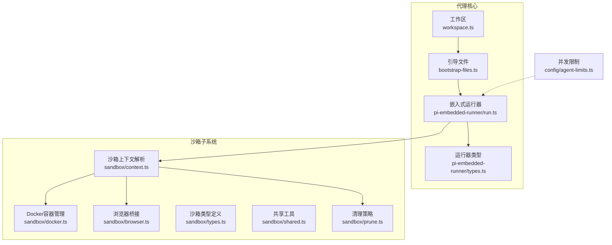
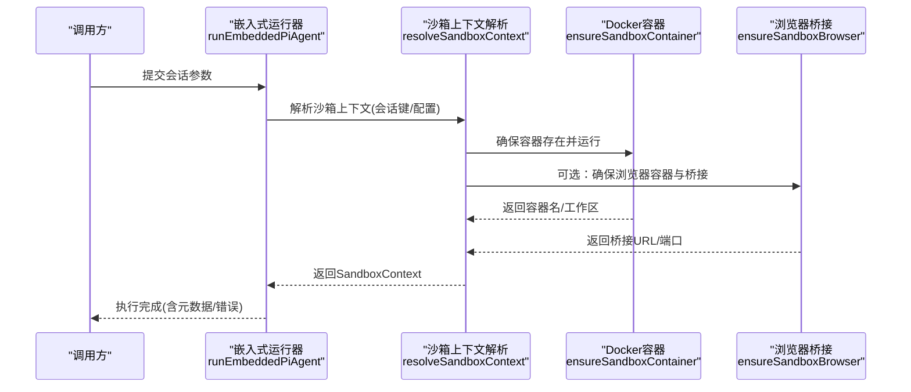
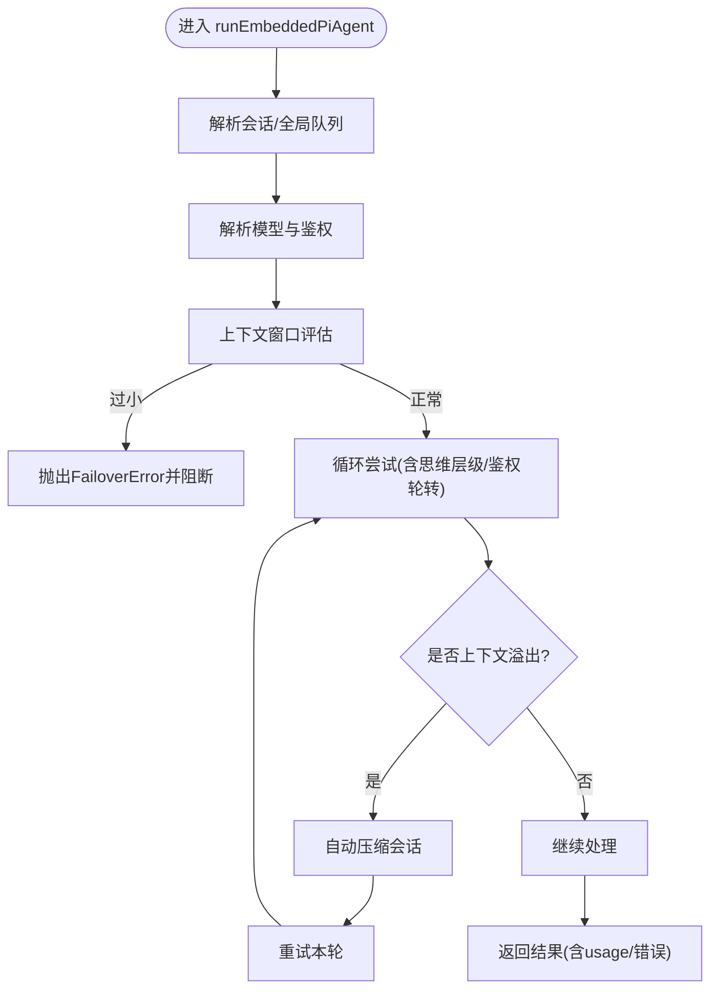
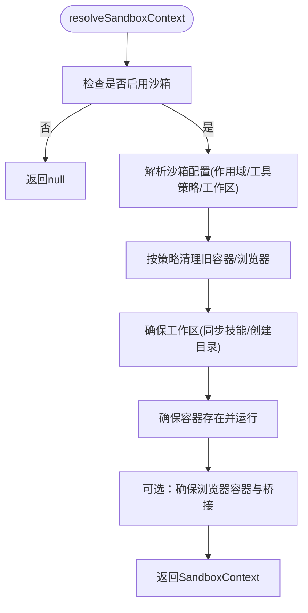
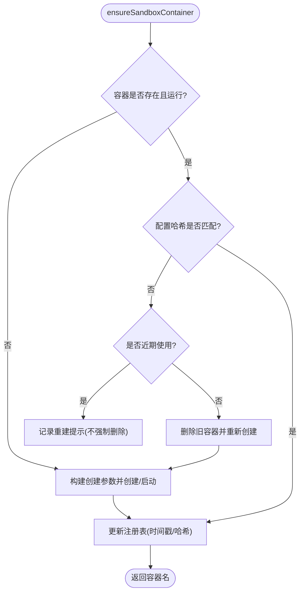
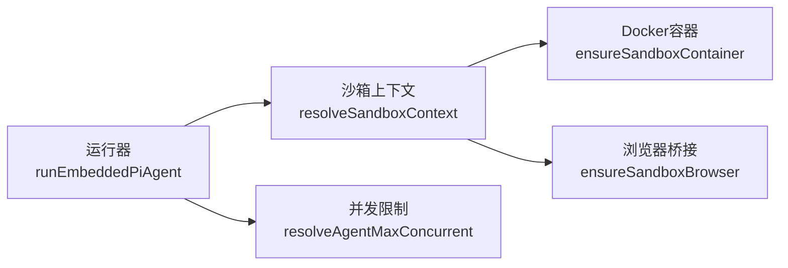

# 代理核心架构

<cite>
**本文引用的文件**
- [src/agents/pi-embedded-runner.ts](file://src/agents/pi-embedded-runner.ts)
- [src/agents/pi-embedded-runner/run.ts](file://src/agents/pi-embedded-runner/run.ts)
- [src/agents/pi-embedded-runner/types.ts](file://src/agents/pi-embedded-runner/types.ts)
- [src/agents/sandbox/context.ts](file://src/agents/sandbox/context.ts)
- [src/agents/sandbox/docker.ts](file://src/agents/sandbox/docker.ts)
- [src/agents/sandbox/browser.ts](file://src/agents/sandbox/browser.ts)
- [src/agents/sandbox/types.ts](file://src/agents/sandbox/types.ts)
- [src/agents/sandbox/shared.ts](file://src/agents/sandbox/shared.ts)
- [src/agents/sandbox/prune.ts](file://src/agents/sandbox/prune.ts)
- [src/agents/workspace.ts](file://src/agents/workspace.ts)
- [src/agents/bootstrap-files.ts](file://src/agents/bootstrap-files.ts)
- [src/agents/agent-scope.ts](file://src/agents/agent-scope.ts)
- [src/config/agent-limits.ts](file://src/config/agent-limits.ts)
- [src/config/config.agent-concurrency-defaults.test.ts](file://src/config/config.agent-concurrency-defaults.test.ts)
- [extensions/llm-task/src/llm-task-tool.ts](file://extensions/llm-task/src/llm-task-tool.ts)
</cite>

## 目录

1. [引言](#引言)
2. [项目结构](#项目结构)
3. [核心组件](#核心组件)
4. [架构总览](#架构总览)
5. [详细组件分析](#详细组件分析)
6. [依赖关系分析](#依赖关系分析)
7. [性能考量](#性能考量)
8. [故障排查指南](#故障排查指南)
9. [结论](#结论)
10. [附录：代理配置参数与扩展开发指南](#附录代理配置参数与扩展开发指南)

## 引言

本文件面向OpenClaw代理核心架构，聚焦Pi Agent Core（嵌入式Pi代理）的集成实现、代理生命周期管理、作用域隔离与沙箱机制、引导文件系统、初始化与配置加载、并发控制、多进程与资源限制、性能调优与故障诊断，以及扩展开发最佳实践。文档以代码级事实为基础，辅以图示帮助不同背景读者理解。

## 项目结构

OpenClaw采用多模块分层组织，代理核心位于src/agents目录，围绕“工作区（workspace）—引导文件（bootstrap）—嵌入式运行器（pi-embedded-runner）—沙箱（sandbox）”主线展开；配置与并发策略在src/config中定义；扩展通过插件/技能体系接入。

图表来源

- [src/agents/workspace.ts](file://src/agents/workspace.ts#L1-L306)
- [src/agents/bootstrap-files.ts](file://src/agents/bootstrap-files.ts#L1-L41)
- [src/agents/pi-embedded-runner/run.ts](file://src/agents/pi-embedded-runner/run.ts#L158-L800)
- [src/agents/sandbox/context.ts](file://src/agents/sandbox/context.ts#L17-L74)
- [src/agents/sandbox/docker.ts](file://src/agents/sandbox/docker.ts#L282-L358)
- [src/agents/sandbox/browser.ts](file://src/agents/sandbox/browser.ts#L87-L233)
- [src/agents/sandbox/types.ts](file://src/agents/sandbox/types.ts#L51-L86)
- [src/agents/sandbox/shared.ts](file://src/agents/sandbox/shared.ts#L18-L46)
- [src/agents/sandbox/prune.ts](file://src/agents/sandbox/prune.ts#L76-L102)
- [src/config/agent-limits.ts](file://src/config/agent-limits.ts#L1-L20)

章节来源

- [src/agents/workspace.ts](file://src/agents/workspace.ts#L1-L306)
- [src/agents/bootstrap-files.ts](file://src/agents/bootstrap-files.ts#L1-L41)
- [src/agents/sandbox/context.ts](file://src/agents/sandbox/context.ts#L17-L74)
- [src/agents/sandbox/docker.ts](file://src/agents/sandbox/docker.ts#L282-L358)
- [src/agents/sandbox/browser.ts](file://src/agents/sandbox/browser.ts#L87-L233)
- [src/agents/sandbox/types.ts](file://src/agents/sandbox/types.ts#L51-L86)
- [src/agents/sandbox/shared.ts](file://src/agents/sandbox/shared.ts#L18-L46)
- [src/agents/sandbox/prune.ts](file://src/agents/sandbox/prune.ts#L76-L102)
- [src/config/agent-limits.ts](file://src/config/agent-limits.ts#L1-L20)

## 核心组件

- 工作区与引导文件系统
  - 工作区默认路径与模板填充、Git初始化、引导文件清单与过滤。
  - 引导文件按会话维度筛选，支持钩子覆盖。
- 嵌入式Pi代理运行器
  - 会话/全局队列、上下文窗口保护、鉴权配置轮转、失败回退、自动压缩与超长工具结果截断、错误分类与用户提示。
- 沙箱子系统
  - 作用域隔离（会话/代理/共享）、工作区挂载策略（只读/读写）、Docker容器与浏览器桥接、端口映射、清理与注册表维护。
- 并发与资源限制
  - 全局与子代理并发上限、Docker ulimits/cpus/memory等资源约束、PIDs限制、seccomp/apparmor安全策略。

章节来源

- [src/agents/workspace.ts](file://src/agents/workspace.ts#L10-L200)
- [src/agents/bootstrap-files.ts](file://src/agents/bootstrap-files.ts#L21-L41)
- [src/agents/pi-embedded-runner/run.ts](file://src/agents/pi-embedded-runner/run.ts#L158-L800)
- [src/agents/sandbox/context.ts](file://src/agents/sandbox/context.ts#L17-L74)
- [src/agents/sandbox/docker.ts](file://src/agents/sandbox/docker.ts#L125-L251)
- [src/agents/sandbox/browser.ts](file://src/agents/sandbox/browser.ts#L87-L233)
- [src/config/agent-limits.ts](file://src/config/agent-limits.ts#L1-L20)

## 架构总览

下图展示从“会话请求”到“沙箱执行”的端到端流程，包括工作区准备、引导文件注入、模型选择与鉴权轮转、运行器调度、沙箱容器/浏览器准备、以及清理回收。

图表来源

- [src/agents/pi-embedded-runner/run.ts](file://src/agents/pi-embedded-runner/run.ts#L158-L200)
- [src/agents/sandbox/context.ts](file://src/agents/sandbox/context.ts#L17-L74)
- [src/agents/sandbox/docker.ts](file://src/agents/sandbox/docker.ts#L282-L358)
- [src/agents/sandbox/browser.ts](file://src/agents/sandbox/browser.ts#L87-L233)

## 详细组件分析

### 组件A：Pi代理嵌入式运行器

- 职责
  - 会话级与全局级命令队列调度，避免并发冲突。
  - 上下文窗口保护与阻断策略，防止超上下文溢出。
  - 鉴权配置轮转与失败回退（配额/速率限制/账单/认证错误）。
  - 自动压缩与工具结果截断恢复上下文溢出。
  - 错误分类与用户可读提示，输出标准化payload与元数据。
- 关键流程
  - 模型解析与鉴权存储初始化。
  - 多轮尝试与思维层级降级。
  - 上下文溢出时的自动压缩与工具结果截断。
  - 失败时的鉴权轮转或回退策略。
- 数据结构
  - 运行结果类型包含payloads、meta（含provider/model/usage/错误类别）、发送状态等。

图表来源

- [src/agents/pi-embedded-runner/run.ts](file://src/agents/pi-embedded-runner/run.ts#L158-L800)
- [src/agents/pi-embedded-runner/types.ts](file://src/agents/pi-embedded-runner/types.ts#L52-L96)

章节来源

- [src/agents/pi-embedded-runner/run.ts](file://src/agents/pi-embedded-runner/run.ts#L158-L800)
- [src/agents/pi-embedded-runner/types.ts](file://src/agents/pi-embedded-runner/types.ts#L1-L96)

### 组件B：沙箱上下文与作用域隔离

- 职责
  - 基于会话键解析沙箱启用状态与配置。
  - 计算作用域键（会话/代理/共享），决定工作区根与挂载策略。
  - 同步技能到沙箱工作区（仅在需要时），确保浏览器与容器可用。
- 关键点
  - 作用域解析与工作区目录生成。
  - 读写/只读挂载策略与代理工作区共享。
  - 容器与浏览器容器的创建/启动与端口映射。
  - 清理策略按空闲时长与最大年龄执行。

图表来源

- [src/agents/sandbox/context.ts](file://src/agents/sandbox/context.ts#L17-L74)
- [src/agents/sandbox/shared.ts](file://src/agents/sandbox/shared.ts#L18-L46)
- [src/agents/sandbox/prune.ts](file://src/agents/sandbox/prune.ts#L76-L102)

章节来源

- [src/agents/sandbox/context.ts](file://src/agents/sandbox/context.ts#L17-L74)
- [src/agents/sandbox/shared.ts](file://src/agents/sandbox/shared.ts#L18-L46)
- [src/agents/sandbox/prune.ts](file://src/agents/sandbox/prune.ts#L76-L102)

### 组件C：Docker容器与资源限制

- 职责
  - 镜像存在性校验与拉取/标签化。
  - 构建容器创建参数（网络、用户、环境、安全选项、DNS、hosts、ulimits、CPU/内存/PIDs、绑定挂载等）。
  - 容器生命周期管理（创建、启动、状态查询、配置哈希校验与热更新提示）。
- 关键点
  - 通过标签与注册表记录容器信息，支持按作用域重建。
  - 支持setupCommand在容器内执行初始化脚本。

图表来源

- [src/agents/sandbox/docker.ts](file://src/agents/sandbox/docker.ts#L125-L251)
- [src/agents/sandbox/docker.ts](file://src/agents/sandbox/docker.ts#L282-L358)

章节来源

- [src/agents/sandbox/docker.ts](file://src/agents/sandbox/docker.ts#L125-L251)
- [src/agents/sandbox/docker.ts](file://src/agents/sandbox/docker.ts#L282-L358)

### 组件D：浏览器桥接与可视化

- 职责
  - 在沙箱中运行浏览器容器，暴露CDP与可选NoVNC端口。
  - 启动/复用桥接服务，等待CDP可达后返回桥接URL。
  - 注册表记录容器与端口映射，支持自动启动与超时控制。
- 关键点
  - 仅当工具策略允许“browser”时启用。
  - 通过slug化作用域键命名容器，避免冲突。

章节来源

- [src/agents/sandbox/browser.ts](file://src/agents/sandbox/browser.ts#L87-L233)

### 组件E：工作区与引导文件系统

- 职责
  - 默认工作区路径解析与模板填充，首次创建写入标准引导文件。
  - 加载工作区内的引导文件集合，支持去重与按会话过滤。
  - 引导文件钩子覆盖能力，便于动态扩展。
- 关键点
  - 子代理会话仅允许特定引导文件白名单。
  - 支持记忆类引导文件的多候选去重。

章节来源

- [src/agents/workspace.ts](file://src/agents/workspace.ts#L10-L200)
- [src/agents/bootstrap-files.ts](file://src/agents/bootstrap-files.ts#L21-L41)

### 组件F：代理作用域与配置解析

- 职责
  - 解析默认代理ID、会话所属代理ID、代理配置合并与覆盖。
  - 代理工作区/代理目录解析，支持默认与自定义路径。
- 关键点
  - 多个默认标记时给出警告并取首个。
  - 子代理会话键仅影响会话代理ID解析。

章节来源

- [src/agents/agent-scope.ts](file://src/agents/agent-scope.ts#L60-L193)

## 依赖关系分析

- 运行器对沙箱的依赖
  - 运行器通过会话键解析沙箱上下文，获得工作区与容器信息，再进行后续执行。
- 沙箱对Docker/浏览器的依赖
  - 容器创建参数来自沙箱配置与工作区挂载策略；浏览器桥接依赖容器端口映射与CDP可达性。
- 并发与资源限制
  - 运行器通过命令队列与并发上限控制器共同保障系统稳定性。

图表来源

- [src/agents/pi-embedded-runner/run.ts](file://src/agents/pi-embedded-runner/run.ts#L158-L200)
- [src/agents/sandbox/context.ts](file://src/agents/sandbox/context.ts#L17-L74)
- [src/agents/sandbox/docker.ts](file://src/agents/sandbox/docker.ts#L282-L358)
- [src/agents/sandbox/browser.ts](file://src/agents/sandbox/browser.ts#L87-L233)
- [src/config/agent-limits.ts](file://src/config/agent-limits.ts#L6-L20)

章节来源

- [src/agents/pi-embedded-runner/run.ts](file://src/agents/pi-embedded-runner/run.ts#L158-L200)
- [src/agents/sandbox/context.ts](file://src/agents/sandbox/context.ts#L17-L74)
- [src/agents/sandbox/docker.ts](file://src/agents/sandbox/docker.ts#L282-L358)
- [src/agents/sandbox/browser.ts](file://src/agents/sandbox/browser.ts#L87-L233)
- [src/config/agent-limits.ts](file://src/config/agent-limits.ts#L1-L20)

## 性能考量

- 上下文窗口与自动压缩
  - 当检测到上下文溢出时，优先尝试自动压缩；若无效则进行工具结果截断，减少消息体大小。
- 鉴权轮转与失败回退
  - 对速率限制/配额/账单/认证错误进行轮转或回退，降低整体失败率。
- 并发控制
  - 全局与子代理并发上限默认值可配置，建议根据硬件与模型上下文窗口合理调整。
- 沙箱资源限制
  - 通过Docker ulimits、CPU/内存/PIDs限制与安全策略，避免单任务拖垮系统。
- I/O与工作区
  - 读写挂载与只读挂载的选择影响I/O开销；首次同步技能到沙箱可能带来额外I/O，建议在共享作用域下复用。

章节来源

- [src/agents/pi-embedded-runner/run.ts](file://src/agents/pi-embedded-runner/run.ts#L517-L624)
- [src/config/agent-limits.ts](file://src/config/agent-limits.ts#L1-L20)
- [src/agents/sandbox/docker.ts](file://src/agents/sandbox/docker.ts#L184-L205)

## 故障排查指南

- 上下文溢出
  - 现象：提示“上下文溢出”，建议重置会话或使用更大上下文模型。
  - 排查：查看运行器日志中的溢出诊断信息与尝试次数。
- 角色顺序冲突
  - 现象：提示“消息顺序冲突”，建议重试或新建会话。
- 图像尺寸过大
  - 现象：提示图像超过模型限制，建议压缩或调整尺寸。
- 浏览器桥接不可达
  - 现象：无法连接CDP或NoVNC。
  - 排查：确认容器已启动、端口映射正确、自动启动超时设置合理。
- 沙箱容器重建
  - 现象：配置变更导致容器需重建。
  - 排查：根据运行器日志提示执行重建命令，或等待热容器窗口内延迟重建。

章节来源

- [src/agents/pi-embedded-runner/run.ts](file://src/agents/pi-embedded-runner/run.ts#L626-L719)
- [src/agents/sandbox/browser.ts](file://src/agents/sandbox/browser.ts#L174-L190)
- [src/agents/sandbox/docker.ts](file://src/agents/sandbox/docker.ts#L324-L333)

## 结论

OpenClaw代理核心以“工作区—引导文件—嵌入式运行器—沙箱”为主线，结合严格的上下文窗口保护、鉴权轮转与失败回退、作用域隔离与资源限制，形成稳定可靠的多进程代理执行框架。通过并发上限与清理策略，系统在保证安全性的同时兼顾性能与可维护性。

## 附录：代理配置参数与扩展开发指南

### 代理配置参数详解

- 并发控制
  - 全局代理最大并发：默认值与解析逻辑。
  - 子代理最大并发：默认值与解析逻辑。
- 沙箱配置
  - 模式：关闭/非主模式/全部。
  - 作用域：会话/代理/共享。
  - 工作区访问：无/只读/读写。
  - Docker镜像与网络、用户、环境变量、安全选项、DNS、主机名、ulimits、CPU/内存/PIDs限制、绑定挂载、启动命令。
  - 浏览器：启用、镜像、前缀、CDP/VNC/NoVNC端口、headless、NoVNC开关、宿主控制、自动启动与超时。
  - 工具策略：允许/禁止列表及来源标注。
  - 清理策略：空闲小时数与最大存活天数。
- 工作区与引导文件
  - 默认工作区路径、模板文件、Git初始化、引导文件集合与按会话过滤、钩子覆盖。

章节来源

- [src/config/agent-limits.ts](file://src/config/agent-limits.ts#L1-L20)
- [src/agents/sandbox/types.ts](file://src/agents/sandbox/types.ts#L51-L86)
- [src/agents/sandbox/docker.ts](file://src/agents/sandbox/docker.ts#L125-L212)
- [src/agents/workspace.ts](file://src/agents/workspace.ts#L10-L200)
- [src/agents/bootstrap-files.ts](file://src/agents/bootstrap-files.ts#L21-L41)

### 性能调优

- 合理设置并发上限，避免过多并发导致上下文溢出与资源争用。
- 为Docker容器设置合适的CPU/内存/PIDs限制，结合seccomp/apparmor提升安全性。
- 使用共享作用域减少重复技能同步带来的I/O开销。
- 针对大模型场景，适当提高上下文窗口阈值与自动压缩尝试次数。

章节来源

- [src/config/agent-limits.ts](file://src/config/agent-limits.ts#L1-L20)
- [src/agents/sandbox/docker.ts](file://src/agents/sandbox/docker.ts#L184-L205)

### 故障诊断方法

- 查看运行器日志中的上下文溢出诊断与尝试次数。
- 检查鉴权配置轮转与失败原因分类，定位配额/速率限制/账单问题。
- 验证沙箱容器状态、端口映射与桥接服务可达性。
- 使用清理策略定期移除长时间未使用的容器与浏览器实例。

章节来源

- [src/agents/pi-embedded-runner/run.ts](file://src/agents/pi-embedded-runner/run.ts#L517-L624)
- [src/agents/sandbox/browser.ts](file://src/agents/sandbox/browser.ts#L174-L190)
- [src/agents/sandbox/prune.ts](file://src/agents/sandbox/prune.ts#L76-L102)

### 扩展开发指南与最佳实践

- 通过内置运行器入口加载扩展逻辑（如嵌入式Pi代理运行器），确保从源码或打包产物中正确解析内部模块。
- 利用引导文件钩子机制动态扩展引导内容，避免硬编码。
- 在沙箱中启用必要的工具策略（如browser），并合理设置端口与权限。
- 遵循并发与资源限制策略，避免扩展引入额外的资源瓶颈。

章节来源

- [extensions/llm-task/src/llm-task-tool.ts](file://extensions/llm-task/src/llm-task-tool.ts#L14-L33)
- [src/agents/bootstrap-files.ts](file://src/agents/bootstrap-files.ts#L21-L41)
- [src/agents/sandbox/types.ts](file://src/agents/sandbox/types.ts#L5-L26)
