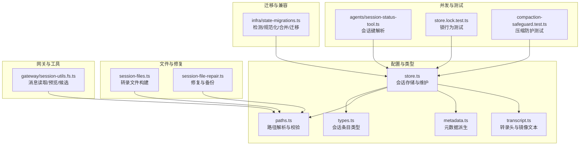
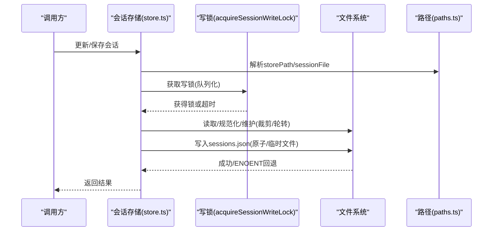
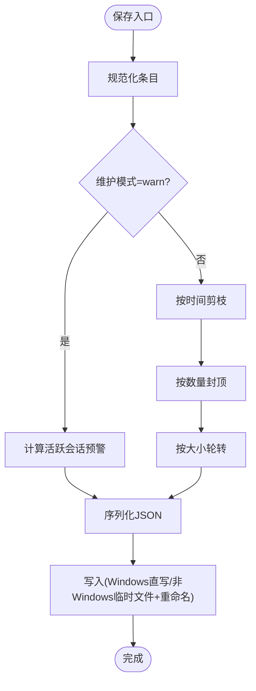
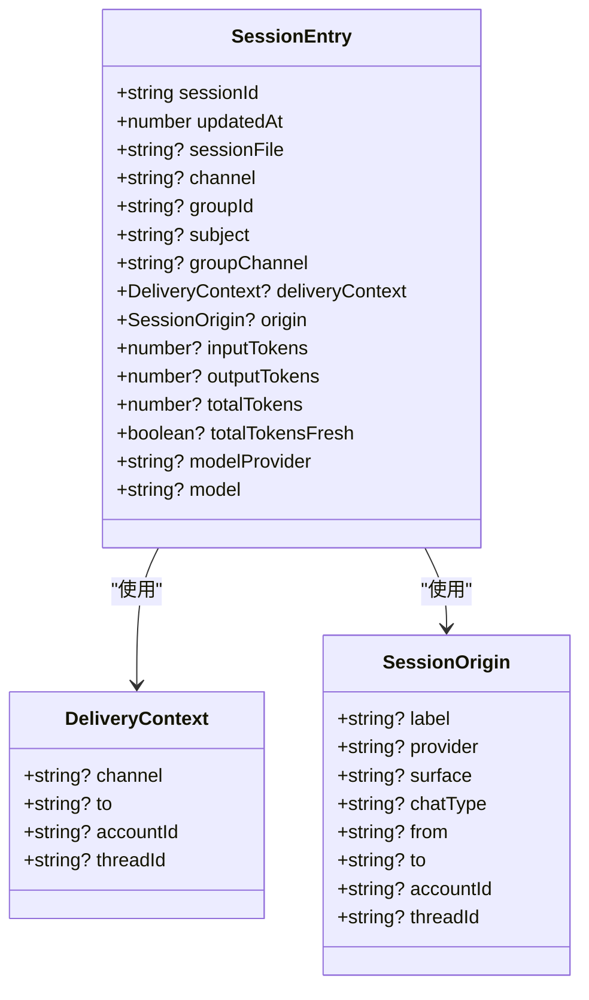
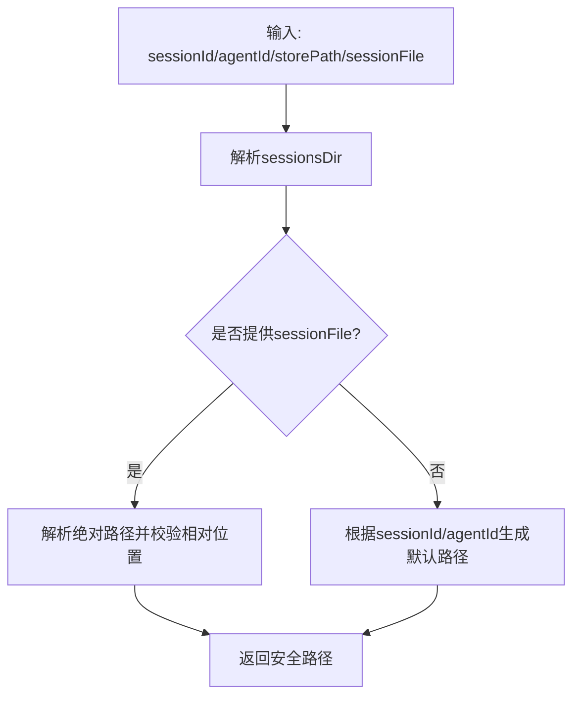
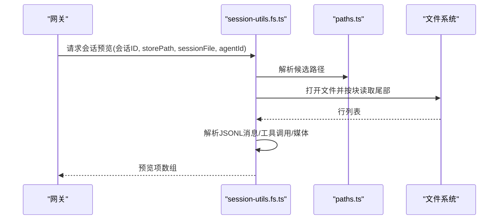
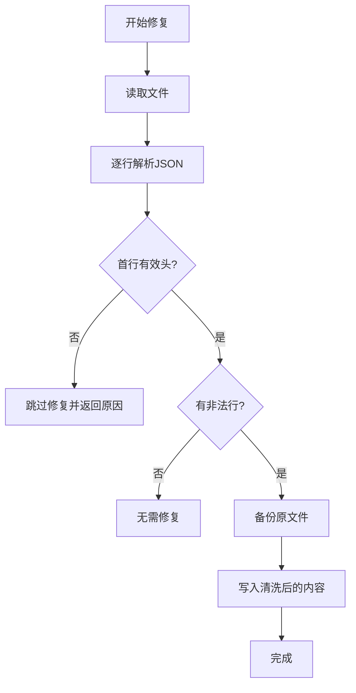
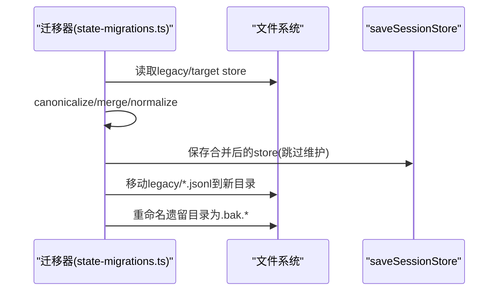
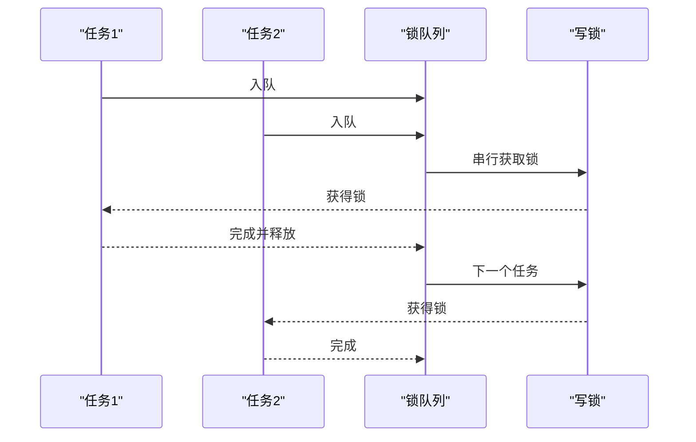
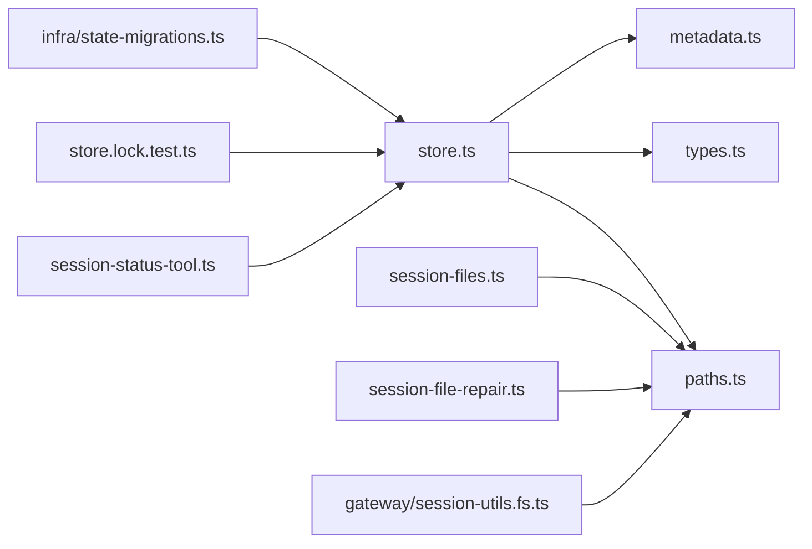

# 会话管理

<cite>
**本文引用的文件**
- [src/config/sessions/store.ts](file://src/config/sessions/store.ts)
- [src/config/sessions/types.ts](file://src/config/sessions/types.ts)
- [src/config/sessions/paths.ts](file://src/config/sessions/paths.ts)
- [src/config/sessions/metadata.ts](file://src/config/sessions/metadata.ts)
- [src/config/sessions/transcript.ts](file://src/config/sessions/transcript.ts)
- [src/memory/session-files.ts](file://src/memory/session-files.ts)
- [src/agents/session-file-repair.ts](file://src/agents/session-file-repair.ts)
- [src/gateway/session-utils.fs.ts](file://src/gateway/session-utils.fs.ts)
- [src/infra/state-migrations.ts](file://src/infra/state-migrations.ts)
- [src/agents/session-status-tool.ts](file://src/agents/session-status-tool.ts)
- [src/agents/pi-extensions/compaction-safeguard.test.ts](file://src/agents/pi-extensions/compaction-safeguard.test.ts)
- [src/config/sessions/store.lock.test.ts](file://src/config/sessions/store.lock.test.ts)
</cite>

## 目录

1. [简介](#简介)
2. [项目结构](#项目结构)
3. [核心组件](#核心组件)
4. [架构总览](#架构总览)
5. [详细组件分析](#详细组件分析)
6. [依赖关系分析](#依赖关系分析)
7. [性能考量](#性能考量)
8. [故障排查指南](#故障排查指南)
9. [结论](#结论)
10. [附录](#附录)

## 简介

本文件面向OpenClaw会话管理系统，系统化阐述会话的创建、维护、状态跟踪与生命周期管理；详解会话文件格式、转录修复、工具结果保护与会话合并机制；介绍会话标识符生成、会话标签系统与会话历史管理；并提供备份恢复、数据迁移与版本兼容处理方案；最后给出性能优化、并发访问控制与错误恢复策略。

## 项目结构

围绕会话管理的关键模块分布如下：

- 配置与类型：会话存储、条目类型、路径解析、元数据派生
- 文件读写与修复：JSONL转录读取、修复与校验
- 网关与工具：会话消息读取、预览、候选路径解析
- 迁移与兼容：旧态检测、键规范化、合并与迁移
- 并发与锁：会话存储互斥、队列化执行、超时与清理
- 测试与保障：锁行为测试、压缩防护运行时测试

**图表来源**

- [src/config/sessions/store.ts](file://src/config/sessions/store.ts#L1-L888)
- [src/config/sessions/types.ts](file://src/config/sessions/types.ts#L1-L201)
- [src/config/sessions/paths.ts](file://src/config/sessions/paths.ts#L1-L157)
- [src/config/sessions/metadata.ts](file://src/config/sessions/metadata.ts#L1-L173)
- [src/config/sessions/transcript.ts](file://src/config/sessions/transcript.ts#L1-L76)
- [src/memory/session-files.ts](file://src/memory/session-files.ts#L1-L132)
- [src/agents/session-file-repair.ts](file://src/agents/session-file-repair.ts#L1-L110)
- [src/gateway/session-utils.fs.ts](file://src/gateway/session-utils.fs.ts#L1-L485)
- [src/infra/state-migrations.ts](file://src/infra/state-migrations.ts#L1-L973)
- [src/agents/session-status-tool.ts](file://src/agents/session-status-tool.ts#L142-L186)
- [src/agents/pi-extensions/compaction-safeguard.test.ts](file://src/agents/pi-extensions/compaction-safeguard.test.ts#L215-L251)
- [src/config/sessions/store.lock.test.ts](file://src/config/sessions/store.lock.test.ts#L1-L275)

**章节来源**

- [src/config/sessions/store.ts](file://src/config/sessions/store.ts#L1-L888)
- [src/config/sessions/types.ts](file://src/config/sessions/types.ts#L1-L201)
- [src/config/sessions/paths.ts](file://src/config/sessions/paths.ts#L1-L157)
- [src/config/sessions/metadata.ts](file://src/config/sessions/metadata.ts#L1-L173)
- [src/config/sessions/transcript.ts](file://src/config/sessions/transcript.ts#L1-L76)
- [src/memory/session-files.ts](file://src/memory/session-files.ts#L1-L132)
- [src/agents/session-file-repair.ts](file://src/agents/session-file-repair.ts#L1-L110)
- [src/gateway/session-utils.fs.ts](file://src/gateway/session-utils.fs.ts#L1-L485)
- [src/infra/state-migrations.ts](file://src/infra/state-migrations.ts#L1-L973)
- [src/agents/session-status-tool.ts](file://src/agents/session-status-tool.ts#L142-L186)
- [src/agents/pi-extensions/compaction-safeguard.test.ts](file://src/agents/pi-extensions/compaction-safeguard.test.ts#L215-L251)
- [src/config/sessions/store.lock.test.ts](file://src/config/sessions/store.lock.test.ts#L1-L275)

## 核心组件

- 会话存储与维护（store.ts）
  - 缓存与TTL、加载/保存、维护（裁剪、清理、轮转）、并发锁队列、警告模式
- 会话类型与元数据（types.ts、metadata.ts）
  - 条目字段、合并策略、来源与群组派生、显示名构建
- 路径解析与安全（paths.ts）
  - 会话目录、默认store路径、文件路径解析、ID合法性校验、候选路径安全检查
- 转录与文件工具（transcript.ts、session-files.ts、gateway/session-utils.fs.ts）
  - 转录头、镜像文本、消息读取、预览、候选路径、字节限制、工具调用识别
- 修复与保护（session-file-repair.ts）
  - 修复JSONL、备份、跳过无效行、失败回滚
- 数据迁移与兼容（infra/state-migrations.ts）
  - 旧态检测、键规范化、合并策略、目标迁移、备份保留
- 并发与一致性（store.lock.test.ts、agents/session-status-tool.ts）
  - 锁队列、超时、串行化、会话键解析

**章节来源**

- [src/config/sessions/store.ts](file://src/config/sessions/store.ts#L28-L213)
- [src/config/sessions/types.ts](file://src/config/sessions/types.ts#L25-L121)
- [src/config/sessions/metadata.ts](file://src/config/sessions/metadata.ts#L45-L172)
- [src/config/sessions/paths.ts](file://src/config/sessions/paths.ts#L56-L156)
- [src/config/sessions/transcript.ts](file://src/config/sessions/transcript.ts#L40-L76)
- [src/memory/session-files.ts](file://src/memory/session-files.ts#L21-L132)
- [src/agents/session-file-repair.ts](file://src/agents/session-file-repair.ts#L19-L110)
- [src/gateway/session-utils.fs.ts](file://src/gateway/session-utils.fs.ts#L15-L485)
- [src/infra/state-migrations.ts](file://src/infra/state-migrations.ts#L33-L200)
- [src/agents/session-status-tool.ts](file://src/agents/session-status-tool.ts#L142-L186)
- [src/config/sessions/store.lock.test.ts](file://src/config/sessions/store.lock.test.ts#L16-L275)

## 架构总览

会话管理由“配置层（类型/路径/元数据）—存储层（缓存/维护/锁）—文件层（转录/修复/读取）—迁移层（检测/合并/迁移）”构成，形成从数据模型到持久化与演进的闭环。

**图表来源**

- [src/config/sessions/store.ts](file://src/config/sessions/store.ts#L580-L753)
- [src/config/sessions/paths.ts](file://src/config/sessions/paths.ts#L128-L156)

**章节来源**

- [src/config/sessions/store.ts](file://src/config/sessions/store.ts#L580-L753)
- [src/config/sessions/paths.ts](file://src/config/sessions/paths.ts#L128-L156)

## 详细组件分析

### 会话存储与维护（store.ts）

- 缓存与TTL
  - 基于Map的内存缓存，支持TTL失效与mtime校验，避免重复磁盘IO
- 加载与保存
  - 加载时进行最佳努力迁移（通道命名、群组字段等），保存前规范化条目
- 维护策略
  - 剪枝（按updatedAt阈值）、封顶（按最近更新排序裁剪）、轮转（超过大小阈值重命名为.bak.\*，最多保留3份）
  - 支持“仅警告”模式：对活跃会话发出预警但不强制执行
- 并发控制
  - 基于队列的写锁，支持超时、过期清理、串行化执行，保证一致性
- 工具函数
  - 读取updatedAt、获取维护警告、capEntryCount、rotateSessionFile、withSessionStoreLock等

**图表来源**

- [src/config/sessions/store.ts](file://src/config/sessions/store.ts#L476-L578)

**章节来源**

- [src/config/sessions/store.ts](file://src/config/sessions/store.ts#L28-L213)
- [src/config/sessions/store.ts](file://src/config/sessions/store.ts#L227-L465)
- [src/config/sessions/store.ts](file://src/config/sessions/store.ts#L476-L578)
- [src/config/sessions/store.ts](file://src/config/sessions/store.ts#L580-L753)

### 会话类型与元数据（types.ts、metadata.ts）

- 类型定义
  - SessionEntry涵盖会话标识、更新时间、通道/群组/来源、交付上下文、令牌统计、系统提示报告、技能快照等
  - 合并策略mergeSessionEntry确保sessionId与updatedAt正确生成与更新
- 元数据派生
  - 派生SessionOrigin（标签、提供商、表面、聊天类型、账号、线程等）
  - 派生群组会话补丁（群组频道、主题、空间、显示名）
  - 组合origin与群组补丁，生成可合并的meta补丁

**图表来源**

- [src/config/sessions/types.ts](file://src/config/sessions/types.ts#L25-L109)
- [src/config/sessions/metadata.ts](file://src/config/sessions/metadata.ts#L10-L172)

**章节来源**

- [src/config/sessions/types.ts](file://src/config/sessions/types.ts#L25-L121)
- [src/config/sessions/metadata.ts](file://src/config/sessions/metadata.ts#L45-L172)

### 路径解析与安全（paths.ts）

- 会话目录与默认store路径
- 会话文件路径解析（支持自定义sessionsDir、agentId占位符、~展开）
- 会话ID合法性校验（正则约束）
- 安全路径解析（禁止越界访问）

**图表来源**

- [src/config/sessions/paths.ts](file://src/config/sessions/paths.ts#L66-L126)

**章节来源**

- [src/config/sessions/paths.ts](file://src/config/sessions/paths.ts#L56-L156)

### 转录与文件工具（transcript.ts、session-files.ts、gateway/session-utils.fs.ts）

- 转录头与镜像文本
  - 确保会话文件存在且带有效头
  - 从媒体URL提取镜像文本，无内容时返回null
- 转录文件构建
  - 列举指定agent的.jsonl文件，构建摘要（内容、哈希、行映射）
  - 提取用户/助手消息文本并脱敏
- 网关读取与预览
  - 读取候选路径（含旧版home目录），优先存在者
  - 读取首条用户消息、最后消息预览、构建预览项（角色/文本）
  - 字节数与行数限制，工具调用识别与截断

**图表来源**

- [src/gateway/session-utils.fs.ts](file://src/gateway/session-utils.fs.ts#L62-L103)
- [src/gateway/session-utils.fs.ts](file://src/gateway/session-utils.fs.ts#L459-L484)
- [src/config/sessions/paths.ts](file://src/config/sessions/paths.ts#L107-L126)

**章节来源**

- [src/config/sessions/transcript.ts](file://src/config/sessions/transcript.ts#L40-L76)
- [src/memory/session-files.ts](file://src/memory/session-files.ts#L21-L132)
- [src/gateway/session-utils.fs.ts](file://src/gateway/session-utils.fs.ts#L15-L485)

### 修复与保护（session-file-repair.ts）

- 修复流程
  - 读取文件，逐行解析JSON，丢弃非法行，保留合法记录
  - 若首行不是有效头则跳过修复
  - 备份原文件后写入清洗后的数据
- 保护措施
  - 失败回滚与清理，保留原始权限

**图表来源**

- [src/agents/session-file-repair.ts](file://src/agents/session-file-repair.ts#L19-L110)

**章节来源**

- [src/agents/session-file-repair.ts](file://src/agents/session-file-repair.ts#L19-L110)

### 数据迁移与兼容（infra/state-migrations.ts）

- 旧态检测
  - 识别旧state目录、旧sessions目录、legacy键集合
- 规范化与合并
  - canonicalizeSessionKeyForAgent统一键格式
  - canonicalizeSessionStore合并legacy与target，去重与偏好策略
  - normalizeSessionEntry标准化条目字段
- 迁移执行
  - 将legacy文件移动至新agents/<agent>/sessions
  - 保存合并后的store（跳过维护以避免破坏迁移过程）
  - 保留遗留目录为.bak.\*以防意外

**图表来源**

- [src/infra/state-migrations.ts](file://src/infra/state-migrations.ts#L662-L788)
- [src/infra/state-migrations.ts](file://src/infra/state-migrations.ts#L226-L255)

**章节来源**

- [src/infra/state-migrations.ts](file://src/infra/state-migrations.ts#L33-L200)
- [src/infra/state-migrations.ts](file://src/infra/state-migrations.ts#L662-L788)

### 并发与一致性（store.lock.test.ts、agents/session-status-tool.ts）

- 锁队列与串行化
  - withSessionStoreLock基于队列实现FIFO串行化，支持超时与过期清理
  - 测试覆盖并发更新、顺序执行、超时拒绝
- 会话键解析
  - 支持多候选键（含agent前缀、main别名、internal键等），定位对应条目

**图表来源**

- [src/config/sessions/store.ts](file://src/config/sessions/store.ts#L712-L753)
- [src/config/sessions/store.lock.test.ts](file://src/config/sessions/store.lock.test.ts#L250-L275)

**章节来源**

- [src/config/sessions/store.ts](file://src/config/sessions/store.ts#L626-L753)
- [src/config/sessions/store.lock.test.ts](file://src/config/sessions/store.lock.test.ts#L16-L275)
- [src/agents/session-status-tool.ts](file://src/agents/session-status-tool.ts#L142-L186)

## 依赖关系分析

- 存储层依赖路径解析与类型定义，负责I/O与一致性
- 文件层依赖路径解析与日志/哈希工具，负责转录读取与摘要
- 网关层依赖路径解析与工具函数，负责消息读取与预览
- 迁移层依赖存储层与路径解析，负责跨版本兼容
- 并发层依赖写锁与队列，保证多写者安全

**图表来源**

- [src/config/sessions/store.ts](file://src/config/sessions/store.ts#L1-L888)
- [src/config/sessions/types.ts](file://src/config/sessions/types.ts#L1-L201)
- [src/config/sessions/paths.ts](file://src/config/sessions/paths.ts#L1-L157)
- [src/config/sessions/metadata.ts](file://src/config/sessions/metadata.ts#L1-L173)
- [src/memory/session-files.ts](file://src/memory/session-files.ts#L1-L132)
- [src/agents/session-file-repair.ts](file://src/agents/session-file-repair.ts#L1-L110)
- [src/gateway/session-utils.fs.ts](file://src/gateway/session-utils.fs.ts#L1-L485)
- [src/infra/state-migrations.ts](file://src/infra/state-migrations.ts#L1-L973)
- [src/agents/session-status-tool.ts](file://src/agents/session-status-tool.ts#L142-L186)
- [src/config/sessions/store.lock.test.ts](file://src/config/sessions/store.lock.test.ts#L1-L275)

**章节来源**

- [src/config/sessions/store.ts](file://src/config/sessions/store.ts#L1-L888)
- [src/config/sessions/paths.ts](file://src/config/sessions/paths.ts#L1-L157)
- [src/infra/state-migrations.ts](file://src/infra/state-migrations.ts#L1-L973)

## 性能考量

- 缓存与TTL：减少重复读取，结合mtime校验避免脏读
- 维护策略：定期剪枝与封顶降低索引规模；轮转控制单文件大小
- I/O优化：非Windows平台采用临时文件+重命名，避免原子替换问题；Windows直接写入
- 读取优化：网关按块读取尾部，限制扫描行数与字节数，快速预览
- 并发串行化：通过队列避免竞争写导致的多次重试与冲突

[本节为通用指导，无需特定文件分析]

## 故障排查指南

- 会话文件损坏
  - 使用修复工具自动清洗并备份原文件，若首行无效头则跳过修复
- 会话预览为空
  - 检查候选路径是否存在，确认文件编码与JSONL格式
- 保存失败或丢失
  - 关注ENOENT回退逻辑与临时文件清理；检查目录权限与磁盘空间
- 并发写冲突
  - 查看锁队列长度与超时设置；必要时增大超时或减少并发
- 迁移异常
  - 检查legacy store可读性与键规范化结果；确认目标目录权限

**章节来源**

- [src/agents/session-file-repair.ts](file://src/agents/session-file-repair.ts#L19-L110)
- [src/gateway/session-utils.fs.ts](file://src/gateway/session-utils.fs.ts#L15-L103)
- [src/config/sessions/store.ts](file://src/config/sessions/store.ts#L524-L578)
- [src/config/sessions/store.lock.test.ts](file://src/config/sessions/store.lock.test.ts#L250-L275)
- [src/infra/state-migrations.ts](file://src/infra/state-migrations.ts#L662-L788)

## 结论

OpenClaw会话管理系统通过严格的类型定义、路径安全校验、文件修复与维护策略、并发锁队列以及迁移兼容机制，实现了高可靠、高性能的会话生命周期管理。配合网关侧的高效读取与预览能力，系统在复杂场景下仍能保持稳定与可维护性。

[本节为总结，无需特定文件分析]

## 附录

### 会话文件格式与转录修复要点

- 文件头：包含type、version、id、timestamp等
- 消息行：每行一条JSONL记录，包含message对象
- 修复策略：丢弃非法行，保留合法记录并备份原文件

**章节来源**

- [src/config/sessions/transcript.ts](file://src/config/sessions/transcript.ts#L60-L76)
- [src/agents/session-file-repair.ts](file://src/agents/session-file-repair.ts#L19-L110)

### 会话标识符生成与标签系统

- 会话ID：字母数字及少量特殊字符，长度受限
- 显示名：基于群组主题/频道/空间/ID组合生成
- 标签：来自渠道/表面/聊天类型等元信息

**章节来源**

- [src/config/sessions/paths.ts](file://src/config/sessions/paths.ts#L56-L64)
- [src/config/sessions/metadata.ts](file://src/config/sessions/metadata.ts#L138-L148)

### 会话历史管理与压缩防护

- 历史截断：通过维护策略按时间与数量裁剪
- 压缩防护：运行时注册表隔离不同会话管理器，防止误伤

**章节来源**

- [src/config/sessions/store.ts](file://src/config/sessions/store.ts#L296-L397)
- [src/agents/pi-extensions/compaction-safeguard.test.ts](file://src/agents/pi-extensions/compaction-safeguard.test.ts#L215-L251)

### 备份恢复与版本兼容

- 备份：修复与迁移均保留.bak.\*或备份目录
- 兼容：键规范化、字段迁移、旧态检测与合并

**章节来源**

- [src/agents/session-file-repair.ts](file://src/agents/session-file-repair.ts#L73-L101)
- [src/infra/state-migrations.ts](file://src/infra/state-migrations.ts#L775-L788)
- [src/infra/state-migrations.ts](file://src/infra/state-migrations.ts#L226-L255)
