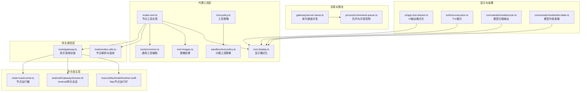
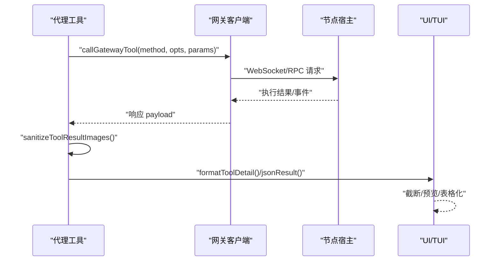
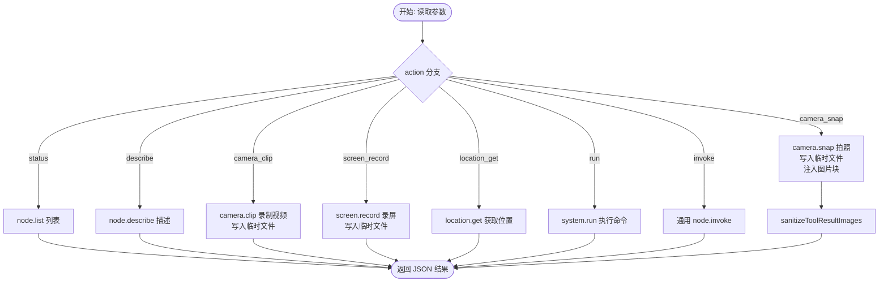
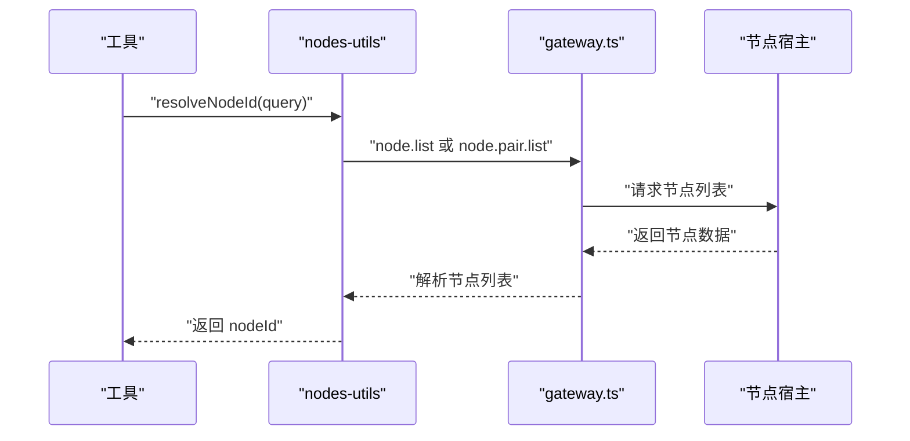
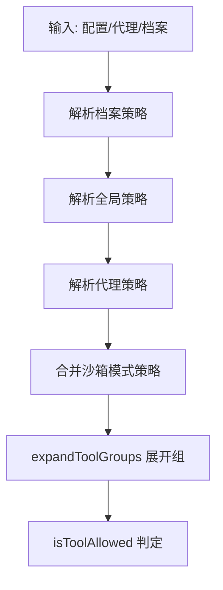
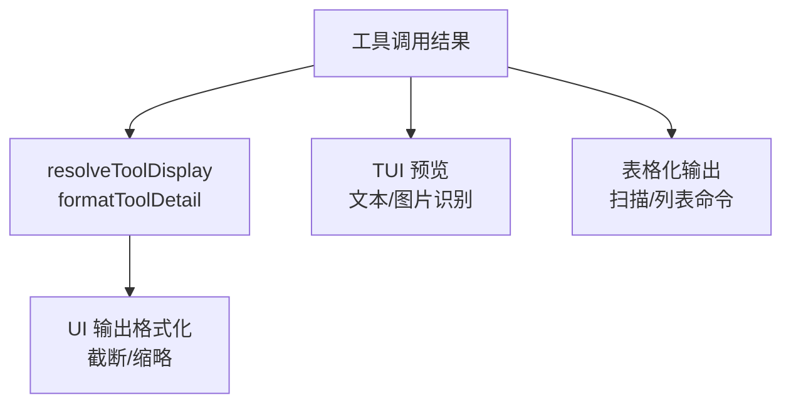
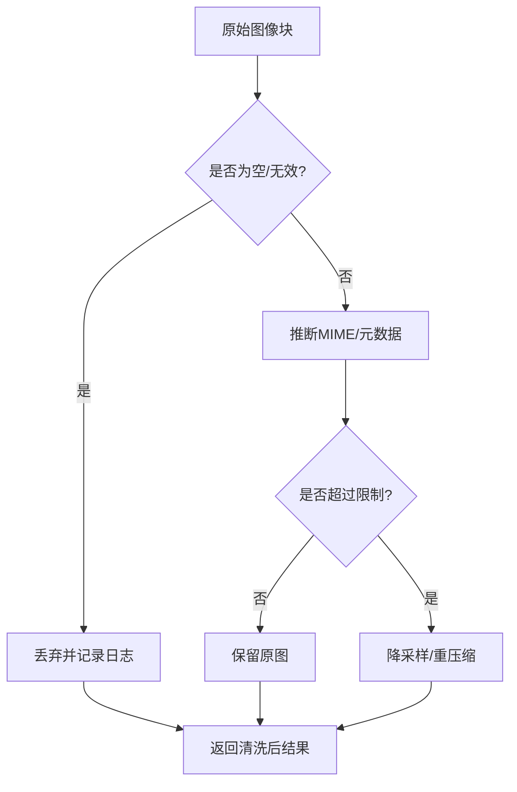
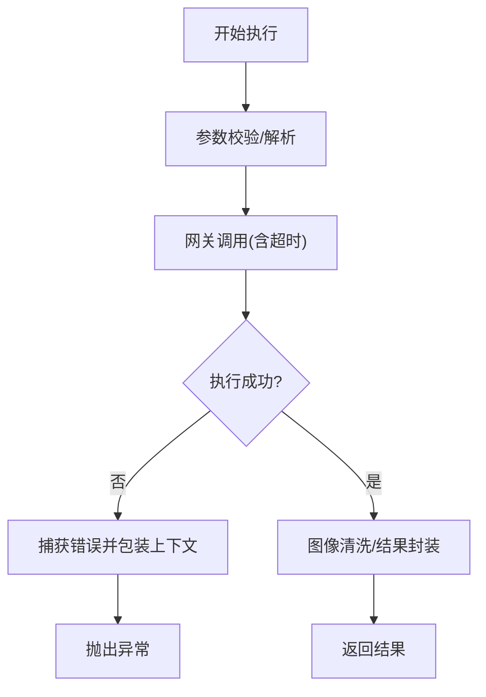
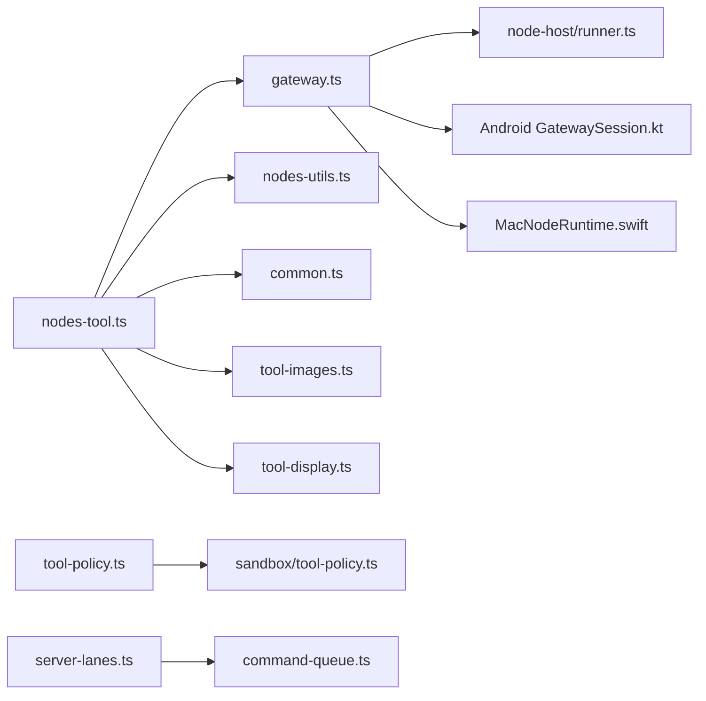

# 工具执行系统

<cite>
**本文档引用的文件**
- [src/agents/tools/nodes-tool.ts](file://src/agents/tools/nodes-tool.ts)
- [src/agents/tools/common.ts](file://src/agents/tools/common.ts)
- [src/agents/tools/gateway.ts](file://src/agents/tools/gateway.ts)
- [src/agents/tools/nodes-utils.ts](file://src/agents/tools/nodes-utils.ts)
- [src/agents/tool-display.ts](file://src/agents/tool-display.ts)
- [src/agents/tool-images.ts](file://src/agents/tool-images.ts)
- [src/agents/tool-policy.ts](file://src/agents/tool-policy.ts)
- [src/agents/sandbox/tool-policy.ts](file://src/agents/sandbox/tool-policy.ts)
- [src/agents/sandbox/types.ts](file://src/agents/sandbox/types.ts)
- [src/agents/sandbox/constants.ts](file://src/agents/sandbox/constants.ts)
- [src/process/command-queue.ts](file://src/process/command-queue.ts)
- [src/gateway/server-lanes.ts](file://src/gateway/server-lanes.ts)
- [src/config/config.agent-concurrency-defaults.test.ts](file://src/config/config.agent-concurrency-defaults.test.ts)
- [src/infra/transport-ready.ts](file://src/infra/transport-ready.ts)
- [apps/android/app/src/main/java/ai/openclaw/android/gateway/GatewaySession.kt](file://apps/android/app/src/main/java/ai/openclaw/android/gateway/GatewaySession.kt)
- [apps/macos/Sources/OpenClaw/NodeMode/MacNodeRuntime.swift](file://apps/macos/Sources/OpenClaw/NodeMode/MacNodeRuntime.swift)
- [ui/src/ui/app-tool-stream.ts](file://ui/src/ui/app-tool-stream.ts)
- [src/tui/components/tool-execution.ts](file://src/tui/components/tool-execution.ts)
- [src/commands/models/scan.ts](file://src/commands/models/scan.ts)
- [src/commands/models/list.table.ts](file://src/commands/models/list.table.ts)
- [src/security/audit-extra.sync.ts](file://src/security/audit-extra.sync.ts)
- [src/node-host/runner.ts](file://src/node-host/runner.ts)
</cite>

## 目录

1. [简介](#简介)
2. [项目结构](#项目结构)
3. [核心组件](#核心组件)
4. [架构总览](#架构总览)
5. [详细组件分析](#详细组件分析)
6. [依赖关系分析](#依赖关系分析)
7. [性能考虑](#性能考虑)
8. [故障排除指南](#故障排除指南)
9. [结论](#结论)
10. [附录](#附录)

## 简介

本文件面向OpenClaw工具执行系统，系统性阐述工具注册机制、调用流程、权限控制与结果处理；深入解析工具策略配置、显示格式化、图像处理与多模态工具支持；介绍工具生命周期管理、错误处理、超时控制与并发限制；提供工具开发规范、测试方法与调试技巧，并包含内置工具清单、自定义工具开发与工具市场集成指南。

## 项目结构

OpenClaw工具执行系统由“代理工具层”、“网关通信层”、“节点宿主层”、“沙箱与安全层”、“显示与结果层”、“并发与限流层”等组成，形成从工具注册到结果呈现的完整链路。



**图表来源**

- [src/agents/tools/nodes-tool.ts](file://src/agents/tools/nodes-tool.ts#L1-L492)
- [src/agents/tools/common.ts](file://src/agents/tools/common.ts#L1-L244)
- [src/agents/tools/gateway.ts](file://src/agents/tools/gateway.ts#L1-L48)
- [src/agents/tools/nodes-utils.ts](file://src/agents/tools/nodes-utils.ts#L1-L178)
- [src/agents/tool-display.ts](file://src/agents/tool-display.ts#L1-L292)
- [src/agents/tool-images.ts](file://src/agents/tool-images.ts#L1-L224)
- [src/agents/tool-policy.ts](file://src/agents/tool-policy.ts#L1-L292)
- [src/agents/sandbox/tool-policy.ts](file://src/agents/sandbox/tool-policy.ts#L1-L143)
- [src/gateway/server-lanes.ts](file://src/gateway/server-lanes.ts#L1-L10)
- [src/process/command-queue.ts](file://src/process/command-queue.ts#L54-L94)
- [src/node-host/runner.ts](file://src/node-host/runner.ts#L631-L660)
- [apps/android/app/src/main/java/ai/openclaw/android/gateway/GatewaySession.kt](file://apps/android/app/src/main/java/ai/openclaw/android/gateway/GatewaySession.kt#L466-L496)
- [apps/macos/Sources/OpenClaw/NodeMode/MacNodeRuntime.swift](file://apps/macos/Sources/OpenClaw/NodeMode/MacNodeRuntime.swift#L619-L654)
- [ui/src/ui/app-tool-stream.ts](file://ui/src/ui/app-tool-stream.ts#L73-L112)
- [src/tui/components/tool-execution.ts](file://src/tui/components/tool-execution.ts#L1-L52)
- [src/commands/models/scan.ts](file://src/commands/models/scan.ts#L126-L139)
- [src/commands/models/list.table.ts](file://src/commands/models/list.table.ts#L50-L91)

**章节来源**

- [src/agents/tools/nodes-tool.ts](file://src/agents/tools/nodes-tool.ts#L1-L492)
- [src/agents/tools/gateway.ts](file://src/agents/tools/gateway.ts#L1-L48)
- [src/agents/tools/nodes-utils.ts](file://src/agents/tools/nodes-utils.ts#L1-L178)
- [src/agents/tool-display.ts](file://src/agents/tool-display.ts#L1-L292)
- [src/agents/tool-images.ts](file://src/agents/tool-images.ts#L1-L224)
- [src/agents/tool-policy.ts](file://src/agents/tool-policy.ts#L1-L292)
- [src/agents/sandbox/tool-policy.ts](file://src/agents/sandbox/tool-policy.ts#L1-L143)
- [src/gateway/server-lanes.ts](file://src/gateway/server-lanes.ts#L1-L10)
- [src/process/command-queue.ts](file://src/process/command-queue.ts#L54-L94)

## 核心组件

- 工具注册与执行：通过工具工厂函数创建工具实例，统一参数校验、网关调用与结果封装。
- 网关通信：统一分辨网关地址、令牌与超时，屏蔽底层传输细节。
- 节点解析：支持节点列表查询、默认节点选择与模糊匹配。
- 权限与策略：工具允许/拒绝列表、沙箱策略、插件组展开与所有者限制。
- 显示与结果：工具详情格式化、UI输出截断、TUI预览与表格化展示。
- 图像处理：多模态图像自动降采样、压缩与尺寸/大小限制。
- 并发与限流：命令通道并发配置、队列泵式调度与等待告警。
- 节点宿主：Android/iOS/macOS侧节点运行时与授权审批流程。

**章节来源**

- [src/agents/tools/common.ts](file://src/agents/tools/common.ts#L1-L244)
- [src/agents/tools/gateway.ts](file://src/agents/tools/gateway.ts#L1-L48)
- [src/agents/tools/nodes-utils.ts](file://src/agents/tools/nodes-utils.ts#L1-L178)
- [src/agents/tool-display.ts](file://src/agents/tool-display.ts#L1-L292)
- [src/agents/tool-images.ts](file://src/agents/tool-images.ts#L1-L224)
- [src/agents/tool-policy.ts](file://src/agents/tool-policy.ts#L1-L292)
- [src/agents/sandbox/tool-policy.ts](file://src/agents/sandbox/tool-policy.ts#L1-L143)
- [src/process/command-queue.ts](file://src/process/command-queue.ts#L54-L94)

## 架构总览

工具执行系统采用“代理工具层 → 网关 → 节点宿主”的分层设计，结合沙箱与策略控制，确保在多平台（Android、iOS、macOS）上的一致行为与安全边界。



**图表来源**

- [src/agents/tools/gateway.ts](file://src/agents/tools/gateway.ts#L29-L47)
- [src/agents/tools/nodes-tool.ts](file://src/agents/tools/nodes-tool.ts#L428-L443)
- [src/agents/tool-images.ts](file://src/agents/tool-images.ts#L211-L223)
- [src/agents/tool-display.ts](file://src/agents/tool-display.ts#L272-L291)
- [src/tui/components/tool-execution.ts](file://src/tui/components/tool-execution.ts#L20-L52)
- [ui/src/ui/app-tool-stream.ts](file://ui/src/ui/app-tool-stream.ts#L73-L112)

## 详细组件分析

### 工具注册与调用流程（nodes-tool）

- 注册：通过工厂函数创建工具实例，定义参数Schema与描述信息。
- 执行：根据action分支调用网关方法，如状态查询、相机拍照、屏幕录制、位置获取、系统命令执行与通用invoke。
- 参数校验：使用通用读取函数进行字符串/数组/数字参数解析与校验。
- 结果封装：统一返回文本内容与详情对象，必要时写入临时文件并注入图片块。



**图表来源**

- [src/agents/tools/nodes-tool.ts](file://src/agents/tools/nodes-tool.ts#L108-L491)
- [src/agents/tools/common.ts](file://src/agents/tools/common.ts#L189-L244)
- [src/agents/tool-images.ts](file://src/agents/tool-images.ts#L211-L223)

**章节来源**

- [src/agents/tools/nodes-tool.ts](file://src/agents/tools/nodes-tool.ts#L1-L492)
- [src/agents/tools/common.ts](file://src/agents/tools/common.ts#L1-L244)

### 网关调用与节点解析

- 网关选项：支持显式URL/令牌/超时，提供默认值与范围约束。
- 节点解析：支持节点列表加载、默认节点挑选（优先带canvas且已连接）、模糊匹配（displayName、remoteIp、nodeId前缀）。



**图表来源**

- [src/agents/tools/nodes-utils.ts](file://src/agents/tools/nodes-utils.ts#L72-L177)
- [src/agents/tools/gateway.ts](file://src/agents/tools/gateway.ts#L12-L27)

**章节来源**

- [src/agents/tools/nodes-utils.ts](file://src/agents/tools/nodes-utils.ts#L1-L178)
- [src/agents/tools/gateway.ts](file://src/agents/tools/gateway.ts#L1-L48)

### 权限控制与工具策略

- 工具策略：支持工具组（fs/web/runtime/sessions/ui/automation/messaging/nodes/openclaw）与通配符，支持插件组展开。
- 沙箱策略：按agent/global/default来源合并allow/deny，对image工具在沙箱中默认放行。
- 审计策略：聚合全局/代理/档案策略，生成最终策略集合。



**图表来源**

- [src/agents/tool-policy.ts](file://src/agents/tool-policy.ts#L135-L147)
- [src/agents/sandbox/tool-policy.ts](file://src/agents/sandbox/tool-policy.ts#L71-L142)
- [src/security/audit-extra.sync.ts](file://src/security/audit-extra.sync.ts#L200-L229)

**章节来源**

- [src/agents/tool-policy.ts](file://src/agents/tool-policy.ts#L1-L292)
- [src/agents/sandbox/tool-policy.ts](file://src/agents/sandbox/tool-policy.ts#L1-L143)
- [src/security/audit-extra.sync.ts](file://src/security/audit-extra.sync.ts#L188-L229)

### 显示格式化与结果处理

- 工具详情：从工具名、动作、参数中提取可读摘要，支持路径/偏移/布尔/数值等键值映射。
- UI输出：对工具输出进行文本抽取、截断与人类可读格式化；TUI支持预览与类型识别（文本/图片）。
- 表格化展示：模型扫描与列表命令输出采用对齐格式与颜色标记。



**图表来源**

- [src/agents/tool-display.ts](file://src/agents/tool-display.ts#L222-L291)
- [ui/src/ui/app-tool-stream.ts](file://ui/src/ui/app-tool-stream.ts#L73-L112)
- [src/tui/components/tool-execution.ts](file://src/tui/components/tool-execution.ts#L20-L52)
- [src/commands/models/scan.ts](file://src/commands/models/scan.ts#L126-L139)
- [src/commands/models/list.table.ts](file://src/commands/models/list.table.ts#L50-L91)

**章节来源**

- [src/agents/tool-display.ts](file://src/agents/tool-display.ts#L1-L292)
- [ui/src/ui/app-tool-stream.ts](file://ui/src/ui/app-tool-stream.ts#L73-L112)
- [src/tui/components/tool-execution.ts](file://src/tui/components/tool-execution.ts#L1-L52)
- [src/commands/models/scan.ts](file://src/commands/models/scan.ts#L126-L139)
- [src/commands/models/list.table.ts](file://src/commands/models/list.table.ts#L50-L91)

### 图像处理与多模态支持

- 自动降采样与压缩：基于最大边长与最大字节限制，自动调整JPEG质量与尺寸。
- 多模态兼容：针对不同模型API限制（如Anthropic Messages API）进行韧性处理。
- 结果清洗：对空或异常图像块进行丢弃并提示。



**图表来源**

- [src/agents/tool-images.ts](file://src/agents/tool-images.ts#L53-L146)
- [src/agents/tool-images.ts](file://src/agents/tool-images.ts#L148-L223)

**章节来源**

- [src/agents/tool-images.ts](file://src/agents/tool-images.ts#L1-L224)

### 生命周期管理、错误处理、超时控制与并发限制

- 生命周期：工具执行前进行参数校验与网关调用准备，执行后进行图像清洗与结果封装。
- 错误处理：统一包装错误信息，包含agentId/nodeId/gatewayUrl/action上下文，便于定位问题。
- 超时控制：网关调用与节点命令均支持超时设置与幂等键。
- 并发限制：命令通道（Main/Subagent/Cron）独立并发上限，队列泵式调度与等待告警。



**图表来源**

- [src/agents/tools/nodes-tool.ts](file://src/agents/tools/nodes-tool.ts#L475-L488)
- [src/agents/tools/gateway.ts](file://src/agents/tools/gateway.ts#L29-L47)
- [src/process/command-queue.ts](file://src/process/command-queue.ts#L54-L94)

**章节来源**

- [src/agents/tools/nodes-tool.ts](file://src/agents/tools/nodes-tool.ts#L1-L492)
- [src/agents/tools/gateway.ts](file://src/agents/tools/gateway.ts#L1-L48)
- [src/process/command-queue.ts](file://src/process/command-queue.ts#L54-L94)

### 节点宿主与平台适配

- Android：网关会话解析invoke事件，异步执行并回传结果。
- macOS：节点运行时解析system.run请求，执行前进行权限与白名单检查，必要时弹窗询问。
- 节点运行器：处理system.execApprovals.get等特殊命令，返回快照与哈希。

```mermaid
sequenceDiagram
participant And as "Android GatewaySession"
participant Mac as "MacNodeRuntime"
participant NR as "NodeHost Runner"
And->>And : "handleInvokeEvent 解析参数"
And->>And : "onInvoke 异步执行"
And-->>And : "sendInvokeResult 回传结果"
Mac->>Mac : "resolveSystemRunApproval 权限/白名单/ask"
Mac-->>Mac : "执行或弹窗确认"
NR->>NR : "system.execApprovals.get"
NR-->>NR : "返回快照/错误码"
```

**图表来源**

- [apps/android/app/src/main/java/ai/openclaw/android/gateway/GatewaySession.kt](file://apps/android/app/src/main/java/ai/openclaw/android/gateway/GatewaySession.kt#L472-L496)
- [apps/macos/Sources/OpenClaw/NodeMode/MacNodeRuntime.swift](file://apps/macos/Sources/OpenClaw/NodeMode/MacNodeRuntime.swift#L645-L654)
- [src/node-host/runner.ts](file://src/node-host/runner.ts#L631-L660)

**章节来源**

- [apps/android/app/src/main/java/ai/openclaw/android/gateway/GatewaySession.kt](file://apps/android/app/src/main/java/ai/openclaw/android/gateway/GatewaySession.kt#L466-L496)
- [apps/macos/Sources/OpenClaw/NodeMode/MacNodeRuntime.swift](file://apps/macos/Sources/OpenClaw/NodeMode/MacNodeRuntime.swift#L619-L654)
- [src/node-host/runner.ts](file://src/node-host/runner.ts#L621-L660)

## 依赖关系分析

- 组件耦合：工具层依赖网关与节点工具；网关依赖节点宿主；显示与结果层依赖工具层输出。
- 外部依赖：Android/iOS/macOS平台侧节点运行时；Docker容器（沙箱）；WebSocket/RPC传输。
- 并发耦合：命令通道与队列共同决定并发度，避免资源争用。



**图表来源**

- [src/agents/tools/nodes-tool.ts](file://src/agents/tools/nodes-tool.ts#L1-L492)
- [src/agents/tools/gateway.ts](file://src/agents/tools/gateway.ts#L1-L48)
- [src/agents/tools/nodes-utils.ts](file://src/agents/tools/nodes-utils.ts#L1-L178)
- [src/agents/tool-images.ts](file://src/agents/tool-images.ts#L1-L224)
- [src/agents/tool-display.ts](file://src/agents/tool-display.ts#L1-L292)
- [src/agents/tool-policy.ts](file://src/agents/tool-policy.ts#L1-L292)
- [src/agents/sandbox/tool-policy.ts](file://src/agents/sandbox/tool-policy.ts#L1-L143)
- [src/gateway/server-lanes.ts](file://src/gateway/server-lanes.ts#L1-L10)
- [src/process/command-queue.ts](file://src/process/command-queue.ts#L54-L94)
- [src/node-host/runner.ts](file://src/node-host/runner.ts#L621-L660)
- [apps/android/app/src/main/java/ai/openclaw/android/gateway/GatewaySession.kt](file://apps/android/app/src/main/java/ai/openclaw/android/gateway/GatewaySession.kt#L466-L496)
- [apps/macos/Sources/OpenClaw/NodeMode/MacNodeRuntime.swift](file://apps/macos/Sources/OpenClaw/NodeMode/MacNodeRuntime.swift#L619-L654)

**章节来源**

- [src/agents/tools/nodes-tool.ts](file://src/agents/tools/nodes-tool.ts#L1-L492)
- [src/agents/tools/gateway.ts](file://src/agents/tools/gateway.ts#L1-L48)
- [src/agents/tools/nodes-utils.ts](file://src/agents/tools/nodes-utils.ts#L1-L178)
- [src/agents/tool-images.ts](file://src/agents/tool-images.ts#L1-L224)
- [src/agents/tool-display.ts](file://src/agents/tool-display.ts#L1-L292)
- [src/agents/tool-policy.ts](file://src/agents/tool-policy.ts#L1-L292)
- [src/agents/sandbox/tool-policy.ts](file://src/agents/sandbox/tool-policy.ts#L1-L143)
- [src/gateway/server-lanes.ts](file://src/gateway/server-lanes.ts#L1-L10)
- [src/process/command-queue.ts](file://src/process/command-queue.ts#L54-L94)
- [src/node-host/runner.ts](file://src/node-host/runner.ts#L621-L660)
- [apps/android/app/src/main/java/ai/openclaw/android/gateway/GatewaySession.kt](file://apps/android/app/src/main/java/ai/openclaw/android/gateway/GatewaySession.kt#L466-L496)
- [apps/macos/Sources/OpenClaw/NodeMode/MacNodeRuntime.swift](file://apps/macos/Sources/OpenClaw/NodeMode/MacNodeRuntime.swift#L619-L654)

## 性能考虑

- 并发控制：通过命令通道与队列限制同时执行的任务数，避免过载；对长时间排队发出告警。
- 资源优化：图像自动降采样与压缩减少网络与API负载；默认超时与幂等键降低无效重试。
- 可观测性：等待时间、错误统计与日志级别区分，便于定位瓶颈。

**章节来源**

- [src/process/command-queue.ts](file://src/process/command-queue.ts#L54-L94)
- [src/agents/tool-images.ts](file://src/agents/tool-images.ts#L14-L18)
- [src/gateway/server-lanes.ts](file://src/gateway/server-lanes.ts#L6-L10)

## 故障排除指南

- 常见错误
  - 节点不可用：检查节点列表与连接状态，确认支持的命令。
  - 参数错误：核对命令数组、环境变量、超时参数格式。
  - 权限不足：确认沙箱策略与白名单，必要时弹窗授权。
- 调试建议
  - 启用详细日志，观察等待队列与错误堆栈。
  - 使用UI/TUI预览工具输出，快速定位异常块。
  - 检查网关连通性与超时设置，必要时增加超时阈值。

**章节来源**

- [src/agents/tools/nodes-tool.ts](file://src/agents/tools/nodes-tool.ts#L390-L407)
- [src/agents/tools/nodes-tool.ts](file://src/agents/tools/nodes-tool.ts#L475-L488)
- [src/infra/transport-ready.ts](file://src/infra/transport-ready.ts#L21-L39)
- [src/tui/components/tool-execution.ts](file://src/tui/components/tool-execution.ts#L1-L52)

## 结论

OpenClaw工具执行系统以清晰的分层设计与严格的策略控制，实现了跨平台、多模态、高可靠性的工具调用能力。通过统一的网关接口、完善的权限体系与结果处理机制，系统在保证安全性的同时提供了良好的扩展性与可观测性。

## 附录

### 内置工具清单（节选）

- 节点工具：状态查询、描述、待配对列表、批准/拒绝配对、通知、相机拍照/剪辑、屏幕录制、位置获取、系统命令执行、通用invoke。
- 文件与运行：读取、写入、编辑、补丁应用、进程与执行。
- 会话与消息：会话列表、历史、发送、派生、状态、消息发送。
- Web与媒体：网页搜索/抓取、图像生成与理解。
- 其他：浏览器、画布、定时任务、网关。

**章节来源**

- [src/agents/tool-policy.ts](file://src/agents/tool-policy.ts#L15-L59)
- [src/agents/tools/nodes-tool.ts](file://src/agents/tools/nodes-tool.ts#L27-L41)

### 自定义工具开发规范

- 工具注册
  - 使用工具工厂函数创建实例，定义参数Schema与描述。
  - 在工具执行前进行参数校验与网关调用准备。
- 结果封装
  - 返回文本内容与详情对象；必要时写入临时文件并注入图片块。
  - 对图像进行清洗与降采样，确保多模态兼容。
- 权限与策略
  - 明确工具允许/拒绝列表，必要时加入沙箱策略。
  - 支持插件组展开与所有者限制。
- 显示与交互
  - 提供可读的工具详情摘要，便于UI/TUI展示。
  - 对输出进行截断与格式化，提升可读性。

**章节来源**

- [src/agents/tools/common.ts](file://src/agents/tools/common.ts#L189-L244)
- [src/agents/tool-images.ts](file://src/agents/tool-images.ts#L211-L223)
- [src/agents/tool-display.ts](file://src/agents/tool-display.ts#L222-L291)
- [src/agents/tool-policy.ts](file://src/agents/tool-policy.ts#L135-L147)

### 测试方法与调试技巧

- 单元测试
  - 使用工具详情格式化测试验证参数映射与截断逻辑。
  - 并发测试验证队列与等待告警行为。
- 端到端测试
  - 覆盖节点列表、默认节点选择与模糊匹配场景。
  - 验证图像处理在极限尺寸/大小下的表现。
- 调试技巧
  - 启用详细日志，观察等待队列与错误堆栈。
  - 使用UI/TUI预览工具输出，快速定位异常块。
  - 检查网关连通性与超时设置，必要时增加超时阈值。

**章节来源**

- [src/agents/tool-display.test.ts](file://src/agents/tool-display.test.ts#L1-L55)
- [src/config/config.agent-concurrency-defaults.test.ts](file://src/config/config.agent-concurrency-defaults.test.ts#L1-L42)
- [src/commands/models/scan.ts](file://src/commands/models/scan.ts#L126-L139)
- [src/commands/models/list.table.ts](file://src/commands/models/list.table.ts#L50-L91)
