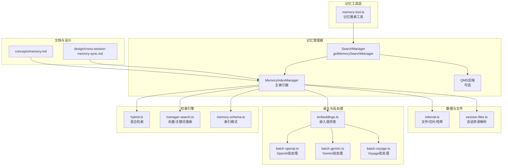
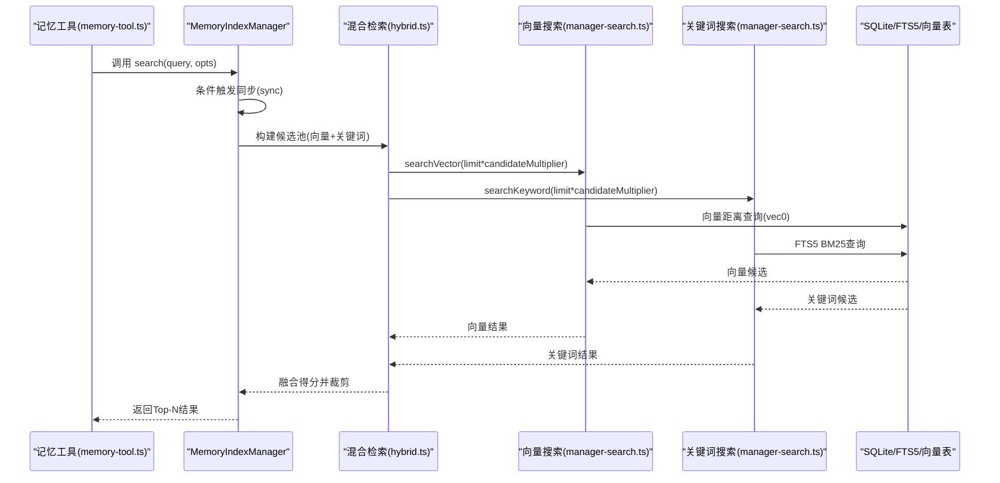
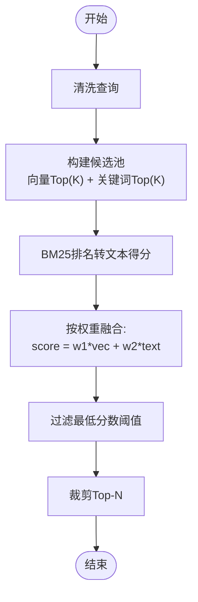
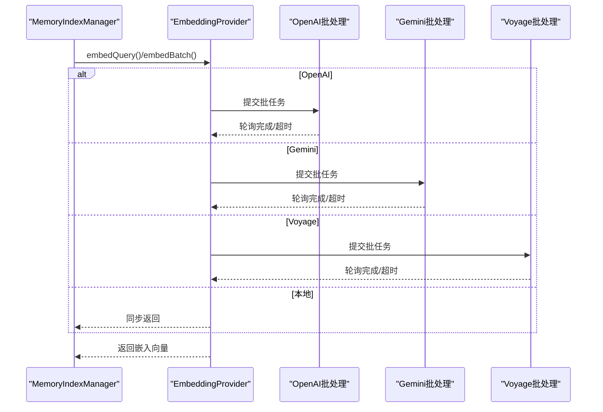
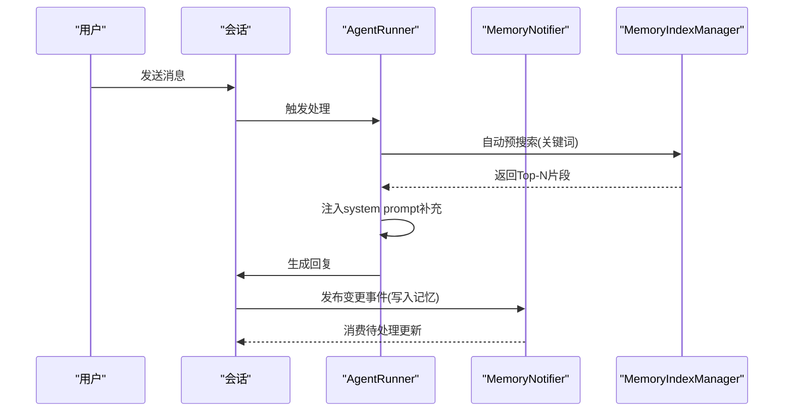
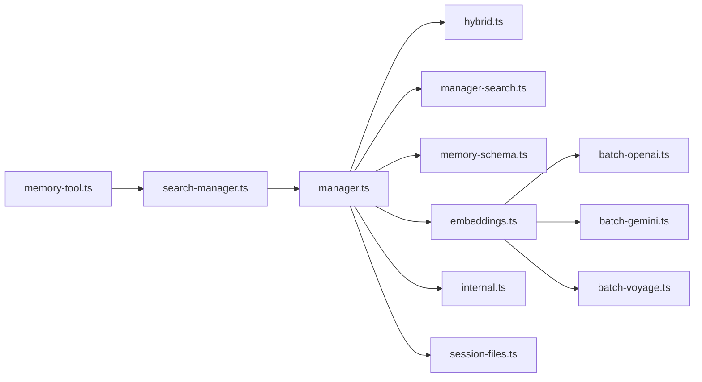

# 记忆管理系统

<cite>
**本文档引用的文件**
- [src/memory/manager.ts](file://src/memory/manager.ts)
- [src/memory/types.ts](file://src/memory/types.ts)
- [src/memory/search-manager.ts](file://src/memory/search-manager.ts)
- [src/memory/hybrid.ts](file://src/memory/hybrid.ts)
- [src/memory/internal.ts](file://src/memory/internal.ts)
- [src/memory/embeddings.ts](file://src/memory/embeddings.ts)
- [src/memory/manager-search.ts](file://src/memory/manager-search.ts)
- [src/memory/memory-schema.ts](file://src/memory/memory-schema.ts)
- [src/memory/session-files.ts](file://src/memory/session-files.ts)
- [docs/concepts/memory.md](file://docs/concepts/memory.md)
- [docs/design/cross-session-memory-sync.md](file://docs/design/cross-session-memory-sync.md)
- [src/agents/tools/memory-tool.ts](file://src/agents/tools/memory-tool.ts)
- [src/auto-reply/reply/memory-flush.ts](file://src/auto-reply/reply/memory-flush.ts)
- [extensions/memory-lancedb/index.ts](file://extensions/memory-lancedb/index.ts)
</cite>

## 目录

1. [简介](#简介)
2. [项目结构](#项目结构)
3. [核心组件](#核心组件)
4. [架构总览](#架构总览)
5. [详细组件分析](#详细组件分析)
6. [依赖关系分析](#依赖关系分析)
7. [性能考虑](#性能考虑)
8. [故障排查指南](#故障排查指南)
9. [结论](#结论)
10. [附录](#附录)

## 简介

本文件面向OpenClaw记忆管理系统，系统性阐述向量嵌入、语义搜索、记忆索引与检索算法，以及持久化存储、批量处理、同步机制与性能优化策略。同时覆盖记忆的分类管理、标签系统、时间戳与相关性排序，查询语法与模糊匹配、跨会话检索能力，并提供容量管理、清理策略与备份恢复机制的实践建议。

## 项目结构

OpenClaw记忆系统由“内置SQLite索引器”和“可选QMD后端”构成，核心模块围绕内存索引管理器、嵌入提供者、混合检索与增量同步展开。系统通过工具接口暴露记忆搜索与读取能力，并在会话生命周期中进行自动预搜索与跨会话通知。



**图表来源**

- [src/agents/tools/memory-tool.ts](file://src/agents/tools/memory-tool.ts#L25-L62)
- [src/memory/search-manager.ts](file://src/memory/search-manager.ts#L19-L65)
- [src/memory/manager.ts](file://src/memory/manager.ts#L111-L248)
- [src/memory/hybrid.ts](file://src/memory/hybrid.ts#L41-L116)
- [src/memory/manager-search.ts](file://src/memory/manager-search.ts#L20-L188)
- [src/memory/memory-schema.ts](file://src/memory/memory-schema.ts#L3-L97)
- [src/memory/embeddings.ts](file://src/memory/embeddings.ts#L130-L214)
- [src/memory/internal.ts](file://src/memory/internal.ts#L78-L144)
- [src/memory/session-files.ts](file://src/memory/session-files.ts#L21-L132)
- [docs/concepts/memory.md](file://docs/concepts/memory.md#L358-L462)
- [docs/design/cross-session-memory-sync.md](file://docs/design/cross-session-memory-sync.md#L95-L124)

**章节来源**

- [src/memory/manager.ts](file://src/memory/manager.ts#L111-L248)
- [src/memory/search-manager.ts](file://src/memory/search-manager.ts#L19-L65)
- [docs/concepts/memory.md](file://docs/concepts/memory.md#L358-L462)

## 核心组件

- 记忆搜索管理器接口与实现：统一对外提供搜索、读取、状态查询、可用性探测与关闭能力。
- 混合检索引擎：融合向量相似度与BM25关键词匹配，平衡语义与精确匹配。
- 嵌入提供者：支持OpenAI、本地、Gemini、Voyage等多种提供者，并具备回退机制。
- 索引与模式：SQLite表结构、FTS5虚拟表、向量表（sqlite-vec）与嵌入缓存。
- 增量同步与会话索引：基于文件系统监听与会话转录增量阈值的异步同步。
- 批量处理：针对OpenAI/Gemini/Voyage的批嵌入提交与轮询，提升大规模索引效率。
- 工具与前端集成：记忆搜索工具、记忆读取工具与跨会话通知机制。

**章节来源**

- [src/memory/types.ts](file://src/memory/types.ts#L61-L81)
- [src/memory/hybrid.ts](file://src/memory/hybrid.ts#L41-L116)
- [src/memory/embeddings.ts](file://src/memory/embeddings.ts#L130-L214)
- [src/memory/memory-schema.ts](file://src/memory/memory-schema.ts#L3-L97)
- [src/memory/session-files.ts](file://src/memory/session-files.ts#L21-L132)
- [src/memory/manager.ts](file://src/memory/manager.ts#L391-L403)

## 架构总览

OpenClaw记忆系统采用“工具层 → 管理器 → 检索引擎 → 数据层”的分层架构。工具层通过统一入口获取管理器实例；管理器负责索引构建、增量同步、混合检索与状态报告；检索引擎提供向量与关键词两种路径；数据层以SQLite为核心，辅以FTS5与向量扩展。



**图表来源**

- [src/agents/tools/memory-tool.ts](file://src/agents/tools/memory-tool.ts#L46-L62)
- [src/memory/manager.ts](file://src/memory/manager.ts#L266-L314)
- [src/memory/hybrid.ts](file://src/memory/hybrid.ts#L41-L116)
- [src/memory/manager-search.ts](file://src/memory/manager-search.ts#L20-L94)

**章节来源**

- [src/memory/manager.ts](file://src/memory/manager.ts#L266-L314)
- [src/memory/hybrid.ts](file://src/memory/hybrid.ts#L41-L116)
- [src/memory/manager-search.ts](file://src/memory/manager-search.ts#L20-L94)

## 详细组件分析

### 记忆索引管理器（MemoryIndexManager）

- 职责：封装索引构建、增量同步、混合检索、状态查询、可用性探测与资源释放。
- 关键特性：
  - 按代理维度缓存与复用，避免重复初始化。
  - 支持Sources过滤（memory/sessions）与额外路径索引。
  - 向量加速（sqlite-vec）与FTS5双引擎并行，混合结果融合。
  - 增量同步：文件系统监听与会话转录增量阈值驱动。
  - 批量嵌入：OpenAI/Gemini/Voyage批处理，支持等待完成与轮询。
  - 嵌入缓存：SQLite缓存嵌入向量，降低重复索引成本。
  - 备份恢复：索引文件原子替换与回滚，保障一致性。

```mermaid
classDiagram
class MemoryIndexManager {
-cacheKey : string
-cfg : OpenClawConfig
-agentId : string
-workspaceDir : string
-settings : ResolvedMemorySearchConfig
-provider : EmbeddingProvider
-batch : BatchConfig
-db : DatabaseSync
-sources : Set<MemorySource>
-vector : VectorState
-fts : FtsState
-watcher : FSWatcher
-sessionPendingFiles : Set<string>
+search(query, opts) MemorySearchResult[]
+sync(params) void
+readFile(params) {text, path}
+status() MemoryProviderStatus
+probeEmbeddingAvailability() MemoryEmbeddingProbeResult
+probeVectorAvailability() boolean
+close() void
}
class EmbeddingProvider {
+id : string
+model : string
+embedQuery(text) number[]
+embedBatch(texts) number[][]
}
class DatabaseSync
class FSWatcher
MemoryIndexManager --> EmbeddingProvider : "使用"
MemoryIndexManager --> DatabaseSync : "访问"
MemoryIndexManager --> FSWatcher : "监听"
```

**图表来源**

- [src/memory/manager.ts](file://src/memory/manager.ts#L111-L248)
- [src/memory/embeddings.ts](file://src/memory/embeddings.ts#L24-L40)

**章节来源**

- [src/memory/manager.ts](file://src/memory/manager.ts#L111-L248)
- [src/memory/embeddings.ts](file://src/memory/embeddings.ts#L130-L214)

### 混合检索与查询融合

- 查询流程：先构建候选池（向量TopK与关键词TopK），再将BM25排名转换为文本得分，最后按权重融合得到最终得分。
- 权重归一化：向量权重与文本权重之和为1，作为百分比权重使用。
- 容错策略：嵌入不可用时仍可走关键词检索；FTS5不可用时回退向量检索。



**图表来源**

- [src/memory/manager.ts](file://src/memory/manager.ts#L266-L314)
- [src/memory/hybrid.ts](file://src/memory/hybrid.ts#L41-L116)

**章节来源**

- [src/memory/hybrid.ts](file://src/memory/hybrid.ts#L23-L116)
- [docs/concepts/memory.md](file://docs/concepts/memory.md#L380-L422)

### 嵌入提供者与批处理

- 提供者选择：支持auto自动选择（本地/远程），并具备回退策略。
- 本地嵌入：node-llama-cpp，模型自动下载与缓存。
- 远程嵌入：OpenAI、Gemini、Voyage，支持自定义Endpoint与Headers。
- 批处理：OpenAI异步批任务、Gemini批任务与Voyage批任务，支持并发与轮询。



**图表来源**

- [src/memory/embeddings.ts](file://src/memory/embeddings.ts#L130-L214)
- [src/memory/manager.ts](file://src/memory/manager.ts#L124-L134)

**章节来源**

- [src/memory/embeddings.ts](file://src/memory/embeddings.ts#L130-L214)
- [src/memory/manager.ts](file://src/memory/manager.ts#L124-L134)

### 索引模式与持久化

- 模式定义：meta、files、chunks、embedding_cache、FTS5虚拟表、向量表（vec0）。
- 索引字段：文件与块的路径、源、行范围、哈希、模型、嵌入、更新时间等。
- FTS5可用性：按需创建，失败记录错误但不影响向量检索。
- 向量表：按维度动态创建，支持sqlite-vec加速；不可用时回退JS余弦相似度。

**章节来源**

- [src/memory/memory-schema.ts](file://src/memory/memory-schema.ts#L3-L97)
- [src/memory/manager.ts](file://src/memory/manager.ts#L669-L692)

### 增量同步与会话索引

- 文件监听：对MEMORY.md与memory目录进行监听，去抖后触发同步。
- 会话增量：基于字节与消息数量阈值，异步增量索引会话转录。
- 同步策略：按需触发（会话开始、搜索前、定时器），支持强制全量重建。
- 会话转录解析：抽取user/assistant消息，敏感信息脱敏，生成可索引文本。

**章节来源**

- [src/memory/manager.ts](file://src/memory/manager.ts#L877-L913)
- [src/memory/manager.ts](file://src/memory/manager.ts#L1070-L1092)
- [src/memory/session-files.ts](file://src/memory/session-files.ts#L74-L132)

### 跨会话检索与自动预搜索

- 自动预搜索：在Agent处理流程中对用户消息关键词执行memory_search，将高相关结果注入system prompt补充区。
- 变更通知：通过进程内事件总线通知其他会话，消费待处理更新并在下次回复前注入摘要。
- 会话Bootstrap增强：新会话加载MEMORY.md全文与近期摘要，已有会话检测MEMORY.md增量差异并注入。



**图表来源**

- [docs/design/cross-session-memory-sync.md](file://docs/design/cross-session-memory-sync.md#L95-L124)
- [docs/design/cross-session-memory-sync.md](file://docs/design/cross-session-memory-sync.md#L444-L459)

**章节来源**

- [docs/design/cross-session-memory-sync.md](file://docs/design/cross-session-memory-sync.md#L424-L484)

### 记忆工具与前端集成

- memory_search工具：返回片段、路径、行号、得分、来源与可选引用。
- memory_get工具：读取指定路径的Markdown内容，支持行范围。
- 工具参数：查询、最大结果数、最低分数、会话键等。
- 扩展插件：如memory-lancedb提供记忆召回与存储工具，支持类别识别与重要性标注。

**章节来源**

- [src/agents/tools/memory-tool.ts](file://src/agents/tools/memory-tool.ts#L25-L62)
- [extensions/memory-lancedb/index.ts](file://extensions/memory-lancedb/index.ts#L262-L337)

## 依赖关系分析



**图表来源**

- [src/agents/tools/memory-tool.ts](file://src/agents/tools/memory-tool.ts#L46-L62)
- [src/memory/search-manager.ts](file://src/memory/search-manager.ts#L19-L65)
- [src/memory/manager.ts](file://src/memory/manager.ts#L111-L248)
- [src/memory/hybrid.ts](file://src/memory/hybrid.ts#L41-L116)
- [src/memory/manager-search.ts](file://src/memory/manager-search.ts#L20-L188)
- [src/memory/memory-schema.ts](file://src/memory/memory-schema.ts#L3-L97)
- [src/memory/embeddings.ts](file://src/memory/embeddings.ts#L130-L214)
- [src/memory/internal.ts](file://src/memory/internal.ts#L78-L144)
- [src/memory/session-files.ts](file://src/memory/session-files.ts#L21-L132)

**章节来源**

- [src/memory/manager.ts](file://src/memory/manager.ts#L111-L248)
- [src/memory/search-manager.ts](file://src/memory/search-manager.ts#L19-L65)

## 性能考虑

- 向量加速：sqlite-vec启用时，向量距离查询在数据库内完成，避免将所有向量加载至JS内存。
- 候选池控制：通过候选倍数限制向量与关键词的候选规模，平衡召回与性能。
- 嵌入缓存：缓存嵌入向量，避免重复索引，尤其适用于频繁更新场景。
- 批量嵌入：大规模索引时使用批处理，显著降低API调用次数与成本。
- 增量同步：文件监听与会话增量阈值减少全量扫描与索引开销。
- 超时与重试：嵌入查询与批处理设置超时与重试策略，避免阻塞主线程。
- FTS5可用性：FTS5不可用时自动回退向量检索，保证功能可用性。

[本节为通用性能指导，无需特定文件引用]

## 故障排查指南

- 嵌入不可用：检查API密钥、网络连通性与提供者配置；查看回退原因与错误信息。
- sqlite-vec加载失败：确认扩展路径与权限，查看加载错误日志；必要时禁用向量加速回退JS相似度。
- FTS5创建失败：记录错误信息，系统会回退向量检索；可在支持平台修复SQLite扩展。
- 批处理失败：检查批任务状态与轮询间隔，必要时降低并发或延长超时。
- 索引重建：当提供者/模型/分片参数变化时，系统自动重置并重建索引。
- 资源释放：确保在关闭时释放FSWatcher、定时器与数据库连接，避免资源泄漏。

**章节来源**

- [src/memory/manager.ts](file://src/memory/manager.ts#L613-L667)
- [src/memory/manager.ts](file://src/memory/manager.ts#L1511-L1522)
- [src/memory/embeddings.ts](file://src/memory/embeddings.ts#L194-L213)

## 结论

OpenClaw记忆系统通过“向量+关键词”的混合检索、SQLite为核心的索引模式、嵌入缓存与批处理优化，实现了高效、稳定且可扩展的记忆检索能力。结合跨会话通知与自动预搜索，系统在不改变用户交互的前提下，显著提升了跨会话一致性与检索效果。建议在生产环境中启用向量加速、合理配置候选池与批处理参数，并定期清理与备份索引文件以维持最佳性能。

[本节为总结性内容，无需特定文件引用]

## 附录

### 记忆查询语法与模糊匹配

- 查询预处理：提取字母数字词元，使用AND连接形成FTS5查询。
- 模糊匹配：向量检索支持语义近似，关键词检索支持精确词匹配。
- 结果融合：根据权重融合向量与关键词得分，输出Top-N片段。

**章节来源**

- [src/memory/hybrid.ts](file://src/memory/hybrid.ts#L23-L39)
- [src/memory/manager-search.ts](file://src/memory/manager-search.ts#L136-L188)

### 时间戳与相关性排序

- 时间戳：索引记录updated_at，用于缓存失效与增量对比。
- 相关性排序：向量检索使用余弦距离，关键词检索使用BM25排名，最终融合得分排序。

**章节来源**

- [src/memory/memory-schema.ts](file://src/memory/memory-schema.ts#L38-L52)
- [src/memory/manager-search.ts](file://src/memory/manager-search.ts#L136-L188)

### 记忆分类管理与标签系统

- 分类：偏好、决策、实体、事实等类别，支持工具自动识别与人工标注。
- 标签：通过类别枚举与重要性评分辅助检索与排序。

**章节来源**

- [extensions/memory-lancedb/index.ts](file://extensions/memory-lancedb/index.ts#L221-L236)

### 容量管理、清理策略与备份恢复

- 容量管理：通过候选倍数与最大结果限制控制内存与I/O开销。
- 清理策略：定期清理过期会话转录与冗余索引，避免索引膨胀。
- 备份恢复：索引文件原子替换与回滚，确保一致性与可恢复性。

**章节来源**

- [src/memory/manager.ts](file://src/memory/manager.ts#L766-L796)
- [src/memory/manager.ts](file://src/memory/manager.ts#L1511-L1522)
