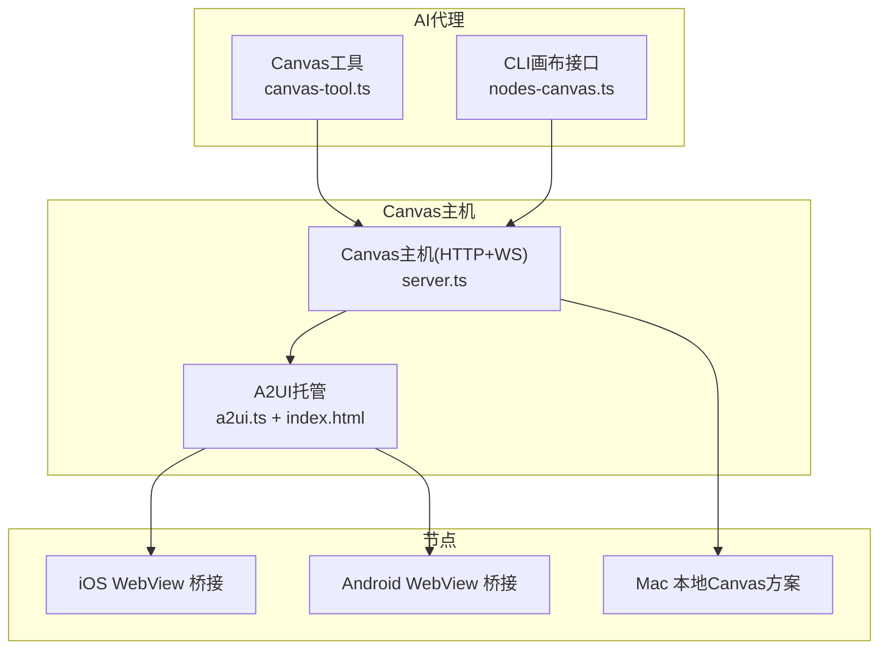
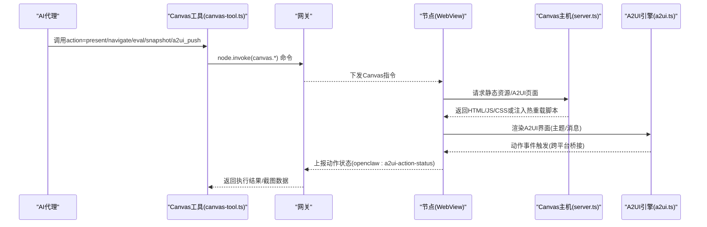
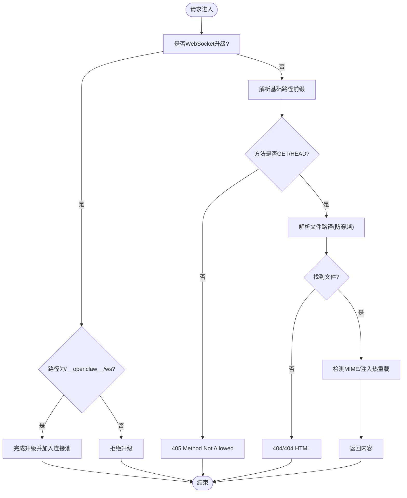
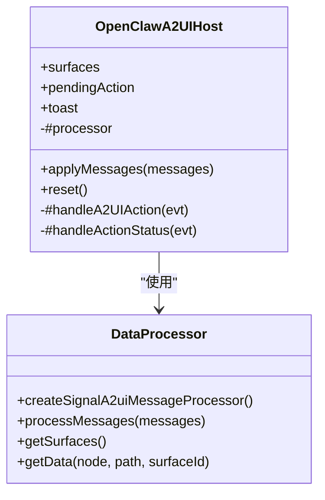
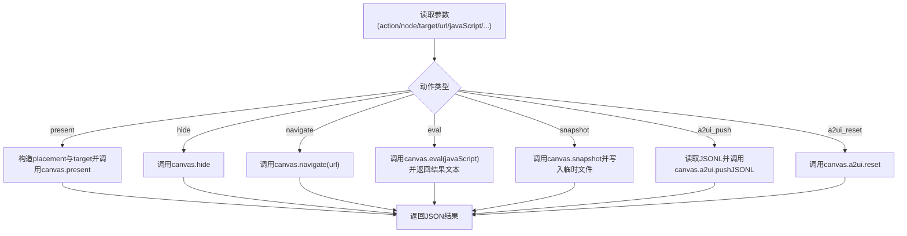
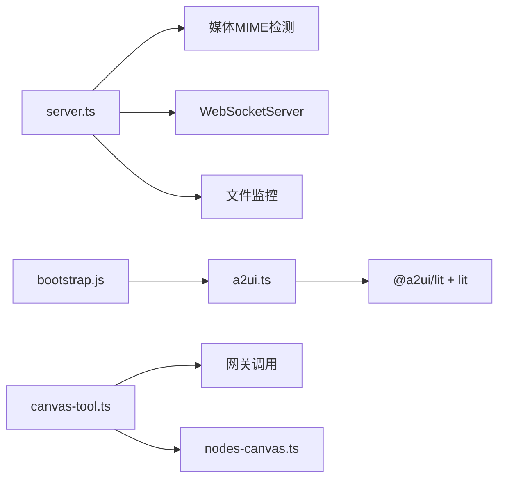

# Canvas可视化工作区

<cite>
**本文引用的文件**
- [server.ts](file://src/canvas-host/server.ts)
- [a2ui.ts](file://src/canvas-host/a2ui.ts)
- [index.html](file://src/canvas-host/a2ui/index.html)
- [canvas-tool.ts](file://src/agents/tools/canvas-tool.ts)
- [bootstrap.js](file://apps/shared/OpenClawKit/Tools/CanvasA2UI/bootstrap.js)
- [SKILL.md](file://skills/canvas/SKILL.md)
- [canvas-host-url.ts](file://src/infra/canvas-host-url.ts)
- [napi-rs-canvas.d.ts](file://src/types/napi-rs-canvas.d.ts)
- [canvas-a2ui-copy.ts](file://scripts/canvas-a2ui-copy.ts)
- [nodes-canvas.ts](file://src/cli/nodes-canvas.ts)
- [CanvasCommands.swift](file://apps/shared/OpenClawKit/Sources/OpenClawKit/CanvasCommands.swift)
- [GatewayModels.swift](file://apps/shared/OpenClawKit/Sources/OpenClawProtocol/GatewayModels.swift)
- [CanvasSchemeHandler.swift](file://apps/macos/Sources/OpenClaw/CanvasSchemeHandler.swift)
- [canvas.md](file://docs/platforms/mac/canvas.md)
</cite>

## 目录

1. [简介](#简介)
2. [项目结构](#项目结构)
3. [核心组件](#核心组件)
4. [架构总览](#架构总览)
5. [详细组件分析](#详细组件分析)
6. [依赖关系分析](#依赖关系分析)
7. [性能考虑](#性能考虑)
8. [故障排查指南](#故障排查指南)
9. [结论](#结论)
10. [附录](#附录)

## 简介

本文件面向OpenClaw Canvas可视化工作区，系统化阐述Canvas架构、A2UI渲染引擎与实时可视化技术，覆盖绘制API、事件处理与用户交互、与AI代理的集成、动态内容生成与实时更新、配置与安全限制、跨平台兼容性、性能优化与内存管理，并提供开发示例、调试工具与最佳实践。

## 项目结构

Canvas相关能力由“Canvas主机服务 + A2UI渲染引擎 + 节点桥接”三层构成：

- Canvas主机服务：提供静态资源与A2UI托管、WebSocket热重载、路径规范化与安全校验。
- A2UI渲染引擎：在Canvas中以Web组件形式渲染AI驱动的界面，支持消息推送、状态反馈与跨平台桥接。
- 节点桥接：将Canvas命令（呈现/隐藏/导航/脚本执行/截图）从网关转发到各端节点（Mac/iOS/Android）。

图表来源

- [server.ts](file://src/canvas-host/server.ts#L436-L515)
- [a2ui.ts](file://src/canvas-host/a2ui.ts#L161-L218)
- [canvas-tool.ts](file://src/agents/tools/canvas-tool.ts#L51-L180)
- [nodes-canvas.ts](file://src/cli/nodes-canvas.ts#L1-L35)

章节来源

- [server.ts](file://src/canvas-host/server.ts#L1-L516)
- [a2ui.ts](file://src/canvas-host/a2ui.ts#L1-L219)
- [canvas-tool.ts](file://src/agents/tools/canvas-tool.ts#L1-L181)
- [nodes-canvas.ts](file://src/cli/nodes-canvas.ts#L1-L35)

## 核心组件

- Canvas主机服务
  - 提供HTTP静态资源服务与A2UI托管，支持路径规范化、安全打开、MIME推断与缓存控制。
  - 可选WebSocket热重载：监听根目录变更并广播“reload”，实现开发期快速迭代。
  - 支持自定义基础路径前缀，便于多实例或多会话隔离。
- A2UI渲染引擎
  - 托管A2UI资源，注入跨平台动作桥接脚本，建立与原生WebView的消息通道。
  - 提供状态栏与Toast提示，展示动作发送状态与错误信息。
  - 基于消息处理器解析并渲染A2UI界面，支持主题上下文与组件上下文数据绑定。
- Canvas工具与CLI
  - AI代理通过Canvas工具调用网关命令，实现呈现、隐藏、导航、脚本执行、截图与A2UI推送/重置。
  - CLI层负责截图结果的临时文件落盘与格式化输出。
- 跨平台桥接
  - iOS通过WebKit消息处理器；Android通过全局JS接口postMessage；Mac采用本地Canvas Scheme处理器与安全路径映射。

章节来源

- [server.ts](file://src/canvas-host/server.ts#L249-L434)
- [a2ui.ts](file://src/canvas-host/a2ui.ts#L102-L218)
- [bootstrap.js](file://apps/shared/OpenClawKit/Tools/CanvasA2UI/bootstrap.js#L154-L491)
- [canvas-tool.ts](file://src/agents/tools/canvas-tool.ts#L51-L180)
- [nodes-canvas.ts](file://src/cli/nodes-canvas.ts#L1-L35)

## 架构总览

Canvas工作流从AI代理发起，经由网关命令到达节点，节点通过WebView渲染Canvas内容或A2UI界面；Canvas主机同时提供静态资源与A2UI托管，并可启用热重载提升开发效率。

图表来源

- [canvas-tool.ts](file://src/agents/tools/canvas-tool.ts#L58-L178)
- [server.ts](file://src/canvas-host/server.ts#L453-L479)
- [a2ui.ts](file://src/canvas-host/a2ui.ts#L161-L218)
- [bootstrap.js](file://apps/shared/OpenClawKit/Tools/CanvasA2UI/bootstrap.js#L333-L422)

## 详细组件分析

### Canvas主机服务（server.ts）

- 路径与安全
  - 规范化URL路径，防止目录穿越；仅允许根目录内文件访问。
  - 自动准备默认index.html，确保首次访问可用。
- 静态资源与MIME
  - 自动检测MIME类型；对HTML注入热重载脚本或直接返回。
  - 设置Cache-Control: no-store，避免缓存干扰。
- 热重载
  - 使用chokidar监控根目录变更，去抖后向所有WebSocket客户端广播“reload”。
  - WebSocket路径独立，避免与HTTP请求冲突。
- 生命周期
  - 支持优雅关闭：清理定时器、关闭Watcher与WebSocketServer。

图表来源

- [server.ts](file://src/canvas-host/server.ts#L338-L416)

章节来源

- [server.ts](file://src/canvas-host/server.ts#L249-L434)

### A2UI渲染引擎（a2ui.ts + index.html + bootstrap.js）

- 资源托管与注入
  - 解析A2UI资源根目录，支持多部署形态回退；仅允许根目录内文件访问。
  - 对HTML注入跨平台动作桥接脚本与热重载WebSocket客户端。
- 状态与提示
  - 提供状态栏与Toast，展示动作发送中/成功/失败状态。
- 消息处理
  - 基于消息处理器解析A2UI消息，构建表面(Surface)树并渲染组件。
  - 支持主题上下文，适配不同平台视觉风格。
- 事件桥接
  - 将组件触发的动作封装为userAction，通过原生桥接发送至节点。

图表来源

- [bootstrap.js](file://apps/shared/OpenClawKit/Tools/CanvasA2UI/bootstrap.js#L154-L491)
- [a2ui.ts](file://src/canvas-host/a2ui.ts#L161-L218)
- [index.html](file://src/canvas-host/a2ui/index.html#L1-L308)

章节来源

- [a2ui.ts](file://src/canvas-host/a2ui.ts#L102-L218)
- [index.html](file://src/canvas-host/a2ui/index.html#L1-L308)
- [bootstrap.js](file://apps/shared/OpenClawKit/Tools/CanvasA2UI/bootstrap.js#L154-L491)

### Canvas工具与CLI（canvas-tool.ts + nodes-canvas.ts）

- 工具参数与动作
  - 支持present/hide/navigate/eval/snapshot/a2ui_push/a2ui_reset等动作。
  - 支持目标URL、窗口位置与尺寸、JavaScript执行、截图格式与质量等参数。
- 执行流程
  - 解析节点ID与网关参数，构造node.invoke调用，返回统一结果。
  - 截图动作将二进制数据写入临时文件并返回图片结果。
- CLI辅助
  - 解析截图负载、生成临时文件路径，配合工具进行结果落盘。

图表来源

- [canvas-tool.ts](file://src/agents/tools/canvas-tool.ts#L58-L178)
- [nodes-canvas.ts](file://src/cli/nodes-canvas.ts#L19-L35)

章节来源

- [canvas-tool.ts](file://src/agents/tools/canvas-tool.ts#L51-L180)
- [nodes-canvas.ts](file://src/cli/nodes-canvas.ts#L1-L35)

### 跨平台桥接与本地Canvas（iOS/Android/Mac）

- iOS桥接
  - 通过WebKit消息处理器openclawCanvasA2UIAction.postMessage发送userAction。
- Android桥接
  - 通过全局对象window.openclawCanvasA2UIAction.postMessage发送字符串化payload。
- Mac本地Canvas
  - 使用自定义scheme的安全文件映射，禁止目录穿越；仅允许显式导航到http(s)链接。
- 命令枚举
  - 统一的Canvas命令集合，便于跨端一致调用。

章节来源

- [bootstrap.js](file://apps/shared/OpenClawKit/Tools/CanvasA2UI/bootstrap.js#L402-L421)
- [CanvasSchemeHandler.swift](file://apps/macos/Sources/OpenClaw/CanvasSchemeHandler.swift#L42-L66)
- [CanvasCommands.swift](file://apps/shared/OpenClawKit/Sources/OpenClawKit/CanvasCommands.swift#L3-L9)
- [canvas.md](file://docs/platforms/mac/canvas.md#L121-L126)

## 依赖关系分析

- Canvas主机依赖
  - 文件系统与MIME检测：用于安全打开与类型推断。
  - WebSocket与chokidar：用于热重载。
  - 运行时日志与环境变量：用于禁用测试场景与错误上报。
- A2UI引擎依赖
  - lit与@a2ui/lit：组件渲染与主题上下文。
  - 注入脚本依赖：跨平台桥接与热重载。
- 工具与CLI依赖
  - 网关调用与节点解析：统一通过网关命令分发。
  - 截图依赖：临时文件与图像格式转换。

图表来源

- [server.ts](file://src/canvas-host/server.ts#L1-L20)
- [a2ui.ts](file://src/canvas-host/a2ui.ts#L1-L6)
- [bootstrap.js](file://apps/shared/OpenClawKit/Tools/CanvasA2UI/bootstrap.js#L1-L8)
- [canvas-tool.ts](file://src/agents/tools/canvas-tool.ts#L1-L10)
- [nodes-canvas.ts](file://src/cli/nodes-canvas.ts#L1-L5)

章节来源

- [server.ts](file://src/canvas-host/server.ts#L1-L20)
- [a2ui.ts](file://src/canvas-host/a2ui.ts#L1-L6)
- [bootstrap.js](file://apps/shared/OpenClawKit/Tools/CanvasA2UI/bootstrap.js#L1-L8)
- [canvas-tool.ts](file://src/agents/tools/canvas-tool.ts#L1-L10)
- [nodes-canvas.ts](file://src/cli/nodes-canvas.ts#L1-L5)

## 性能考虑

- 热重载优化
  - 使用去抖与等待写入完成策略，降低频繁刷新带来的抖动与资源浪费。
  - 测试模式下可切换轮询监控，避免文件系统差异导致的误报。
- 资源加载
  - HTML注入热重载脚本与桥接脚本，减少额外网络往返。
  - 静态资源按需读取并设置无缓存头，保证开发期一致性。
- 截图与渲染
  - 截图结果写入临时文件，避免大对象在内存中长时间驻留。
  - 可配置最大宽度与质量，平衡清晰度与体积。
- 平台差异
  - Android与iOS桥接采用原生消息通道，避免DOM操作开销。
  - Mac本地Canvas采用自定义scheme，减少网络栈与跨进程通信成本。

章节来源

- [server.ts](file://src/canvas-host/server.ts#L300-L322)
- [nodes-canvas.ts](file://src/cli/nodes-canvas.ts#L29-L35)
- [bootstrap.js](file://apps/shared/OpenClawKit/Tools/CanvasA2UI/bootstrap.js#L306-L331)

## 故障排查指南

- 白屏或内容不加载
  - 检查网关绑定模式与端口占用，确认URL使用正确的主机名而非localhost。
  - 使用curl直接验证路径与MIME。
- “node required”或“node not connected”
  - 确保指定有效节点ID且节点在线。
- 内容未更新
  - 检查liveReload开关、文件是否位于根目录、Watcher错误日志。
- Mac本地Canvas
  - 确认使用自定义scheme与会话根目录，避免目录穿越与非法路径。
- A2UI动作未生效
  - 检查跨平台桥接脚本注入与WebSocket连接状态，关注动作状态事件。

章节来源

- [SKILL.md](file://skills/canvas/SKILL.md#L151-L180)
- [canvas.md](file://docs/platforms/mac/canvas.md#L121-L126)
- [server.ts](file://src/canvas-host/server.ts#L313-L322)

## 结论

Canvas工作区通过“主机服务 + A2UI引擎 + 节点桥接”的分层设计，实现了跨平台的实时可视化与交互。其安全策略（路径校验、自定义scheme、显式导航）与热重载机制（文件监控+WebSocket）显著提升了开发体验；工具与CLI提供了统一的API入口，便于AI代理集成与自动化。建议在生产环境中谨慎开启热重载，并结合平台特性选择合适的渲染与桥接策略。

## 附录

### Canvas绘制API与事件处理

- 呈现/隐藏/导航/脚本执行/截图/推送A2UI消息/重置A2UI
- 用户动作通过跨平台桥接发送至节点，节点上报动作状态事件

章节来源

- [canvas-tool.ts](file://src/agents/tools/canvas-tool.ts#L12-L20)
- [bootstrap.js](file://apps/shared/OpenClawKit/Tools/CanvasA2UI/bootstrap.js#L333-L422)

### 实时可视化与动态内容

- 主机侧热重载：文件变更自动刷新Canvas页面
- A2UI消息驱动界面动态更新：applyMessages后同步表面列表

章节来源

- [server.ts](file://src/canvas-host/server.ts#L289-L298)
- [bootstrap.js](file://apps/shared/OpenClawKit/Tools/CanvasA2UI/bootstrap.js#L424-L444)

### 安全限制与权限控制

- 路径安全：禁止目录穿越，仅允许根目录内访问
- Mac本地Canvas：自定义scheme，严格路径映射
- 外部URL：仅允许显式导航，避免自动加载外部资源

章节来源

- [server.ts](file://src/canvas-host/server.ts#L158-L194)
- [CanvasSchemeHandler.swift](file://apps/macos/Sources/OpenClaw/CanvasSchemeHandler.swift#L42-L66)
- [canvas.md](file://docs/platforms/mac/canvas.md#L121-L126)

### 跨平台兼容性

- iOS：WebKit消息处理器
- Android：全局JS接口postMessage
- Mac：本地Canvas Scheme处理器
- A2UI主题与样式：针对Android与iOS差异化适配

章节来源

- [bootstrap.js](file://apps/shared/OpenClawKit/Tools/CanvasA2UI/bootstrap.js#L38-L43)
- [CanvasCommands.swift](file://apps/shared/OpenClawKit/Sources/OpenClawKit/CanvasCommands.swift#L3-L9)

### 配置选项与环境变量

- Canvas主机配置：启用/端口/根目录/基础路径/热重载
- 环境变量：禁用Canvas主机（测试/CI场景）

章节来源

- [SKILL.md](file://skills/canvas/SKILL.md#L58-L74)
- [server.ts](file://src/canvas-host/server.ts#L196-L210)

### 性能优化与内存管理

- 热重载去抖与写入完成等待
- 截图结果落盘与临时文件清理
- 无缓存头与按需读取

章节来源

- [server.ts](file://src/canvas-host/server.ts#L289-L322)
- [nodes-canvas.ts](file://src/cli/nodes-canvas.ts#L29-L35)

### 开发示例与调试工具

- 示例：创建HTML页面、查找Canvas主机URL、列出已连接节点、执行present/navigate/snapshot/a2ui_push
- 调试：检查绑定模式、端口占用、直接访问URL、查看Watcher错误日志

章节来源

- [SKILL.md](file://skills/canvas/SKILL.md#L86-L149)
- [SKILL.md](file://skills/canvas/SKILL.md#L151-L180)

### A2UI资源打包与复制

- A2UI资源复制脚本：校验bundle存在性、复制到dist目录
- 环境变量：源目录/输出目录/跳过缺失

章节来源

- [canvas-a2ui-copy.ts](file://scripts/canvas-a2ui-copy.ts#L7-L28)

### Canvas主机URL解析

- 支持hostOverride/requestHost/localAddress与Forwarded-Proto解析，生成最终URL

章节来源

- [canvas-host-url.ts](file://src/infra/canvas-host-url.ts#L46-L66)

### Canvas类型声明（NAPI-RS Canvas）

- Canvas对象与缓冲区导出，便于后续扩展绘图能力

章节来源

- [napi-rs-canvas.d.ts](file://src/types/napi-rs-canvas.d.ts#L1-L8)
