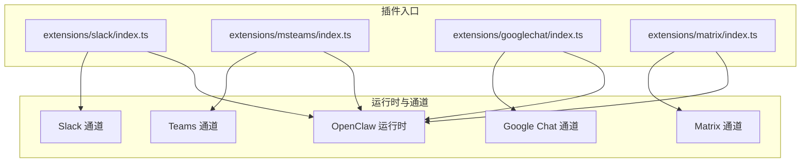
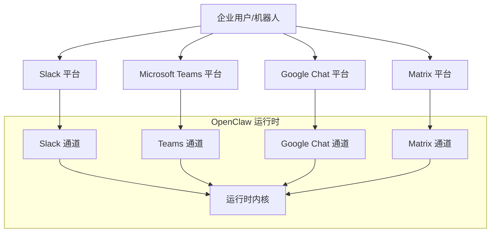
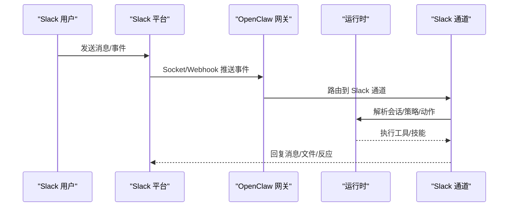
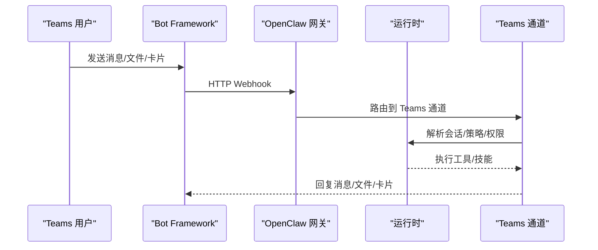
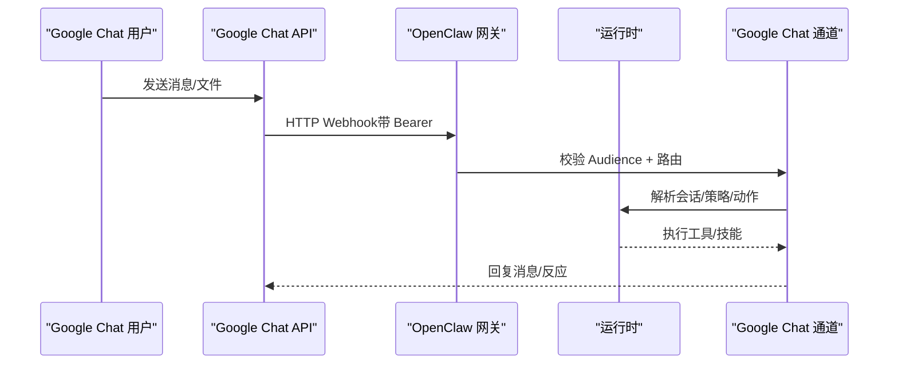
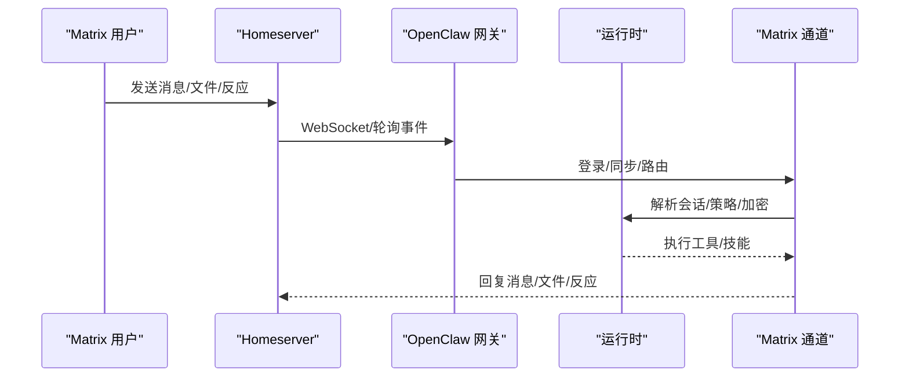
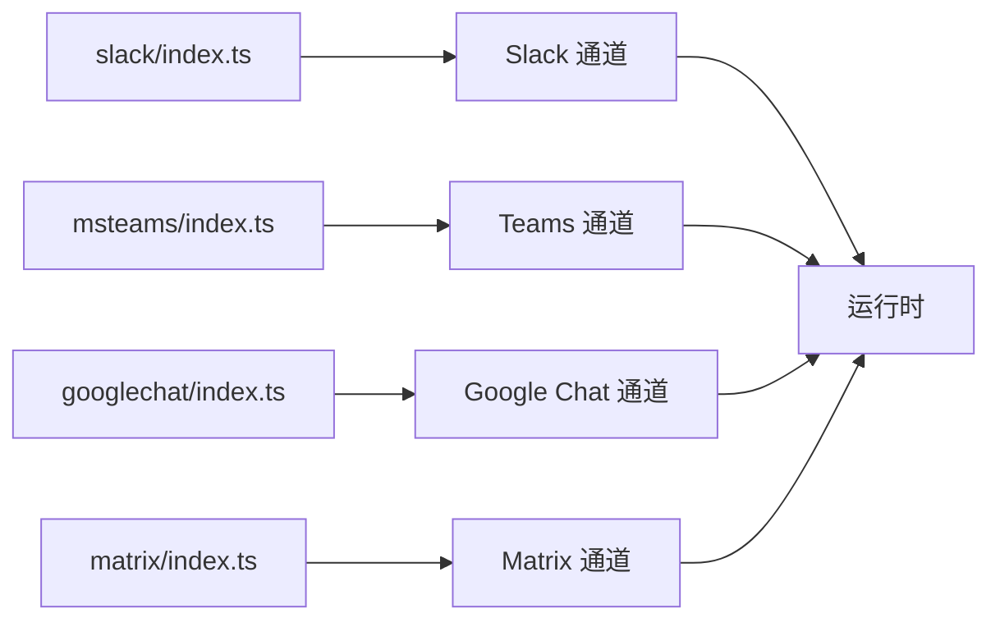

# 企业通信渠道

<cite>
**本文引用的文件**   
- [docs/channels/slack.md](file://docs/channels/slack.md)
- [docs/channels/msteams.md](file://docs/channels/msteams.md)
- [docs/channels/googlechat.md](file://docs/channels/googlechat.md)
- [docs/channels/matrix.md](file://docs/channels/matrix.md)
- [extensions/slack/index.ts](file://extensions/slack/index.ts)
- [extensions/msteams/index.ts](file://extensions/msteams/index.ts)
- [extensions/googlechat/index.ts](file://extensions/googlechat/index.ts)
- [extensions/matrix/index.ts](file://extensions/matrix/index.ts)
</cite>

## 目录

1. [简介](#简介)
2. [项目结构](#项目结构)
3. [核心组件](#核心组件)
4. [架构总览](#架构总览)
5. [详细组件分析](#详细组件分析)
6. [依赖关系分析](#依赖关系分析)
7. [性能考虑](#性能考虑)
8. [故障排查指南](#故障排查指南)
9. [结论](#结论)
10. [附录](#附录)

## 简介

本文件面向企业级通信渠道集成场景，系统性梳理 OpenClaw 在 Slack、Microsoft Teams、Google Chat、Matrix 四大平台的集成方式与运行机制。内容覆盖认证与授权模型、会话与路由策略、权限控制与审计、文件与媒体处理、事件映射与线程模型、以及企业部署的安全与性能优化建议。目标是帮助企业用户在合规前提下完成端到端落地，并提供可操作的排障路径。

## 项目结构

OpenClaw 将各通信渠道以“插件”形式组织，统一通过插件注册接口接入运行时，形成一致的通道能力边界与配置入口。Slack、Teams、Google Chat、Matrix 的插件入口均位于各自扩展目录的 index.ts 中，负责注册通道与可选的 HTTP 钩子（如 Google Chat）。

图表来源

- [extensions/slack/index.ts](file://extensions/slack/index.ts#L1-L18)
- [extensions/msteams/index.ts](file://extensions/msteams/index.ts#L1-L18)
- [extensions/googlechat/index.ts](file://extensions/googlechat/index.ts#L1-L20)
- [extensions/matrix/index.ts](file://extensions/matrix/index.ts#L1-L18)

章节来源

- [extensions/slack/index.ts](file://extensions/slack/index.ts#L1-L18)
- [extensions/msteams/index.ts](file://extensions/msteams/index.ts#L1-L18)
- [extensions/googlechat/index.ts](file://extensions/googlechat/index.ts#L1-L20)
- [extensions/matrix/index.ts](file://extensions/matrix/index.ts#L1-L18)

## 核心组件

- 插件注册与通道暴露：各渠道插件在 index.ts 中调用运行时注册函数，向 OpenClaw 暴露通道能力；部分插件还注册了 HTTP 钩子用于接收外部事件（如 Google Chat Webhook）。
- 通道配置与模式：各通道支持多模式与多令牌组合（例如 Slack 的 Socket Mode 与 HTTP Events API），Teams 的 Bot Framework Webhook，Google Chat 的服务账号与 Audience 校验，Matrix 的访问令牌或用户名密码登录。
- 访问控制与路由：默认采用“配对/白名单/开放/禁用”的策略组合，结合会话键空间实现 DM、群组、频道的路由隔离。
- 事件与动作映射：消息、编辑、删除、反应、加 pin、成员加入/离开、频道重命名等事件被映射为系统事件，便于审计与后续处理。
- 媒体与分片：入站附件下载与存储、出站文本分片与文件上传、线程回复与标签支持，满足企业日常协作需求。

章节来源

- [docs/channels/slack.md](file://docs/channels/slack.md#L123-L134)
- [docs/channels/msteams.md](file://docs/channels/msteams.md#L446-L471)
- [docs/channels/googlechat.md](file://docs/channels/googlechat.md#L159-L199)
- [docs/channels/matrix.md](file://docs/channels/matrix.md#L139-L182)

## 架构总览

下图展示企业通信渠道在 OpenClaw 中的整体交互：外部平台通过各自的协议/SDK/Webhook 接入，经由通道层转换为内部会话与事件模型，再由运行时调度执行工具与技能，最终回写到对应平台。

图表来源

- [extensions/slack/index.ts](file://extensions/slack/index.ts#L11-L14)
- [extensions/msteams/index.ts](file://extensions/msteams/index.ts#L11-L14)
- [extensions/googlechat/index.ts](file://extensions/googlechat/index.ts#L12-L16)
- [extensions/matrix/index.ts](file://extensions/matrix/index.ts#L11-L14)

## 详细组件分析

### Slack 集成

- 模式与令牌
  - Socket Mode：需要 App Token 与 Bot Token，适合低延迟实时交互。
  - HTTP Events API：需要 Bot Token 与 Signing Secret，事件回调由 Slack 推送至网关。
- 访问控制
  - DM 策略：支持配对、白名单、开放、禁用；默认配对，未知发送者需批准。
  - 频道策略：支持开放、白名单、禁用；可通过名称或 ID 解析。
  - 提及门控：默认要求提及，可按频道细化 users 允许列表、是否允许机器人、工具策略等。
- 会话与线程
  - DM 使用主会话键；频道使用通道会话键；MPIM 使用群组会话键；线程可继承历史或独立会话。
- 媒体与分发
  - 入站附件下载与大小限制；出站文本分片与文件上传；支持显式目标 user: / channel:。
- 动作与事件
  - 支持消息、反应、Pin、成员信息、表情列表等动作组；多种事件映射为系统事件。
- 安全与合规
  - 环境变量降级与配置优先级；用户令牌读写分离；签名验证（HTTP 模式）。

图表来源

- [docs/channels/slack.md](file://docs/channels/slack.md#L27-L121)
- [docs/channels/slack.md](file://docs/channels/slack.md#L135-L194)
- [docs/channels/slack.md](file://docs/channels/slack.md#L236-L262)

章节来源

- [docs/channels/slack.md](file://docs/channels/slack.md#L24-L121)
- [docs/channels/slack.md](file://docs/channels/slack.md#L135-L194)
- [docs/channels/slack.md](file://docs/channels/slack.md#L216-L262)
- [docs/channels/slack.md](file://docs/channels/slack.md#L264-L285)
- [docs/channels/slack.md](file://docs/channels/slack.md#L374-L431)

### Microsoft Teams 集成

- 插件化部署：Teams 作为独立插件安装，避免核心体积膨胀。
- Bot Framework Webhook：默认监听 /api/messages，需公网可达或隧道。
- 凭证与权限
  - Azure Bot（App ID、密码、Tenant ID）。
  - RSC 权限：仅实现实时监听；若需历史与文件下载，需 Graph API Application 权限并授予管理员同意。
- 访问控制
  - DM：默认配对；支持白名单（AAD 对象 ID、UPN、显示名）。
  - 群组/频道：默认白名单，可按团队/频道细粒度配置；支持提及门控。
- 文件与媒体
  - DM：FileConsentCard 流程，用户确认后上传。
  - 群组/频道：需 SharePoint Site ID + Graph 权限上传并生成分享链接；否则仅文本。
- 会话与回复风格
  - 会话键区分 DM 与群组；回复风格支持“线程式”或“顶部级”，需按频道实际 UI 风格配置。
- 已知限制
  - Webhook 超时可能导致重复与丢包；需快速响应或采用预回复策略。

图表来源

- [docs/channels/msteams.md](file://docs/channels/msteams.md#L41-L66)
- [docs/channels/msteams.md](file://docs/channels/msteams.md#L140-L148)
- [docs/channels/msteams.md](file://docs/channels/msteams.md#L446-L471)
- [docs/channels/msteams.md](file://docs/channels/msteams.md#L513-L590)

章节来源

- [docs/channels/msteams.md](file://docs/channels/msteams.md#L16-L40)
- [docs/channels/msteams.md](file://docs/channels/msteams.md#L149-L284)
- [docs/channels/msteams.md](file://docs/channels/msteams.md#L415-L471)
- [docs/channels/msteams.md](file://docs/channels/msteams.md#L513-L590)
- [docs/channels/msteams.md](file://docs/channels/msteams.md#L689-L737)

### Google Chat 集成

- 模式与凭证
  - HTTP Webhook，需服务账号与 Audience 校验（应用 URL 或项目编号）。
  - 默认仅暴露 /googlechat 路径，建议配合 Tailscale Funnel 或反向代理。
- 访问控制
  - DM 默认配对；群组默认需要 @提及；支持按空间细化 users、系统提示词、工具策略等。
- 会话与路由
  - DM 使用 agent:<aid>:googlechat:dm:<spaceId>；群组使用 agent:<aid>:googlechat:group:<spaceId>。
- 媒体与动作
  - 附件下载与大小限制；支持反应动作（需开启相应动作组）；打字指示器可配置。
- 安全与合规
  - 严格 Audience 校验；仅在受信网络暴露 webhook；私有应用需按名称搜索添加。

图表来源

- [docs/channels/googlechat.md](file://docs/channels/googlechat.md#L12-L51)
- [docs/channels/googlechat.md](file://docs/channels/googlechat.md#L139-L151)
- [docs/channels/googlechat.md](file://docs/channels/googlechat.md#L159-L199)

章节来源

- [docs/channels/googlechat.md](file://docs/channels/googlechat.md#L12-L51)
- [docs/channels/googlechat.md](file://docs/channels/googlechat.md#L139-L199)
- [docs/channels/googlechat.md](file://docs/channels/googlechat.md#L200-L247)

### Matrix 集成

- 插件化部署：通过用户态连接任意 Homeserver，支持 E2EE。
- 登录与凭证
  - 支持访问令牌或用户名+密码登录；令牌自动保存与复用。
  - 启用 E2EE 需加载加密模块并完成设备验证。
- 访问控制
  - DM 默认配对；群组默认白名单且提及门控；支持房间别名与 ID 解析。
- 会话与线程
  - DM 共享主会话；房间使用群组会话；支持线程回复与回复标签。
- 能力矩阵
  - 支持 DM/房间/线程/媒体/E2EE/反应/投票/位置/原生命令等。

图表来源

- [docs/channels/matrix.md](file://docs/channels/matrix.md#L39-L79)
- [docs/channels/matrix.md](file://docs/channels/matrix.md#L139-L182)
- [docs/channels/matrix.md](file://docs/channels/matrix.md#L191-L204)

章节来源

- [docs/channels/matrix.md](file://docs/channels/matrix.md#L18-L38)
- [docs/channels/matrix.md](file://docs/channels/matrix.md#L39-L110)
- [docs/channels/matrix.md](file://docs/channels/matrix.md#L144-L182)
- [docs/channels/matrix.md](file://docs/channels/matrix.md#L205-L230)

## 依赖关系分析

- 插件注册链路：各通道插件通过统一的插件 SDK 注册自身，形成“插件入口 → 通道实现 → 运行时”的依赖闭环。
- 外部依赖：Slack（Socket/Webhook）、Teams（Bot Framework Webhook + 可选 Graph API）、Google Chat（服务账号 + Audience）、Matrix（Homeserver + 可选 E2EE）。
- 配置耦合点：各通道的模式、令牌、Audience、会话键、动作开关、媒体上限等参数构成关键耦合点，需在企业环境中集中治理与审计。

图表来源

- [extensions/slack/index.ts](file://extensions/slack/index.ts#L11-L14)
- [extensions/msteams/index.ts](file://extensions/msteams/index.ts#L11-L14)
- [extensions/googlechat/index.ts](file://extensions/googlechat/index.ts#L12-L16)
- [extensions/matrix/index.ts](file://extensions/matrix/index.ts#L11-L14)

章节来源

- [extensions/slack/index.ts](file://extensions/slack/index.ts#L1-L18)
- [extensions/msteams/index.ts](file://extensions/msteams/index.ts#L1-L18)
- [extensions/googlechat/index.ts](file://extensions/googlechat/index.ts#L1-L20)
- [extensions/matrix/index.ts](file://extensions/matrix/index.ts#L1-L18)

## 性能考虑

- 事件处理吞吐
  - Teams Webhook 存在超时风险，应尽量缩短下游 LLM/工具调用耗时，必要时采用“先回复、异步补充”的策略。
  - Slack Socket Mode 适合高并发低延迟场景；HTTP 模式需确保网关具备高可用与限流保护。
- 媒体与分片
  - 合理设置媒体上限与文本分片阈值，避免单次响应过大导致平台限制或超时。
  - Google Chat 与 Teams 的文件上传需考虑网络抖动与重试策略。
- 会话与历史
  - 合理配置历史拉取范围（如 Slack 线程初始历史限制、Teams 历史读取开关），避免一次性加载过多上下文。
- 资源隔离
  - 不同通道的令牌与凭据隔离存放，避免跨通道误用；对敏感字段进行最小化暴露与轮换。

## 故障排查指南

- Slack
  - 无回复：检查 groupPolicy、频道白名单、requireMention、用户白名单。
  - DM 忽略：检查 dm.enabled、dm.policy、配对状态。
  - Socket 模式未连接：校验 App Token/Bot Token 与 Socket Mode 开启。
  - HTTP 模式未接收：校验 Signing Secret、Webhook 路径、请求 URL、多账户路径唯一性。
- Microsoft Teams
  - 图像/文件不显示：确认 Graph 权限与管理员同意；重新安装应用并完全退出 Teams 刷新缓存。
  - 无响应：检查提及门控与 per-team/per-channel 配置。
  - Webhook 超时/重复：优化响应速度或采用预回复策略。
- Google Chat
  - 405：确认已启用通道、插件状态正常、网关已重启。
  - Audience 校验失败：核对 audienceType 与 audience 值。
- Matrix
  - 加密房间无法解密：确认加密模块可用、设备已验证；变更令牌需重新验证。
  - 房间消息被忽略：检查 groupPolicy 与房间白名单。

章节来源

- [docs/channels/slack.md](file://docs/channels/slack.md#L374-L431)
- [docs/channels/msteams.md](file://docs/channels/msteams.md#L738-L760)
- [docs/channels/googlechat.md](file://docs/channels/googlechat.md#L200-L247)
- [docs/channels/matrix.md](file://docs/channels/matrix.md#L205-L230)

## 结论

OpenClaw 通过插件化架构将 Slack、Teams、Google Chat、Matrix 等企业通信平台纳入统一运行时，提供一致的会话、路由、权限与事件模型。企业可在严格的安全与合规约束下，基于各平台特性选择最优模式（Socket/Webhook/RSC/Graph），并通过精细化的访问控制、媒体与分片策略、以及可观测性手段保障生产稳定运行。

## 附录

- 配置参考要点（摘自各通道文档）
  - Slack：mode/auth、DM/频道策略、线程/历史、投递与动作、用户令牌读写分离。
  - Teams：Bot 凭证、Webhook 端点、RSC/Graph 权限、回复风格、文件上传与 SharePoint、会话键。
  - Google Chat：服务账号、Audience 校验、DM/群组策略、会话键、媒体上限、动作开关。
  - Matrix：Homeserver、访问令牌/密码、E2EE、房间白名单、线程与回复标签、能力矩阵。

章节来源

- [docs/channels/slack.md](file://docs/channels/slack.md#L433-L447)
- [docs/channels/msteams.md](file://docs/channels/msteams.md#L446-L471)
- [docs/channels/googlechat.md](file://docs/channels/googlechat.md#L159-L199)
- [docs/channels/matrix.md](file://docs/channels/matrix.md#L231-L260)
