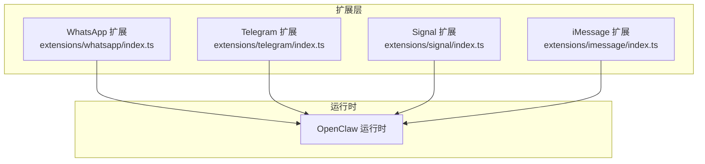
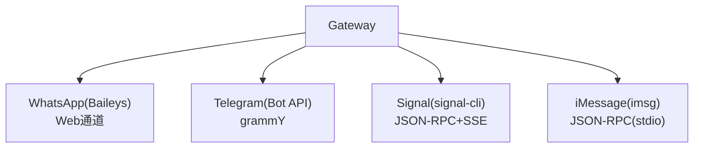
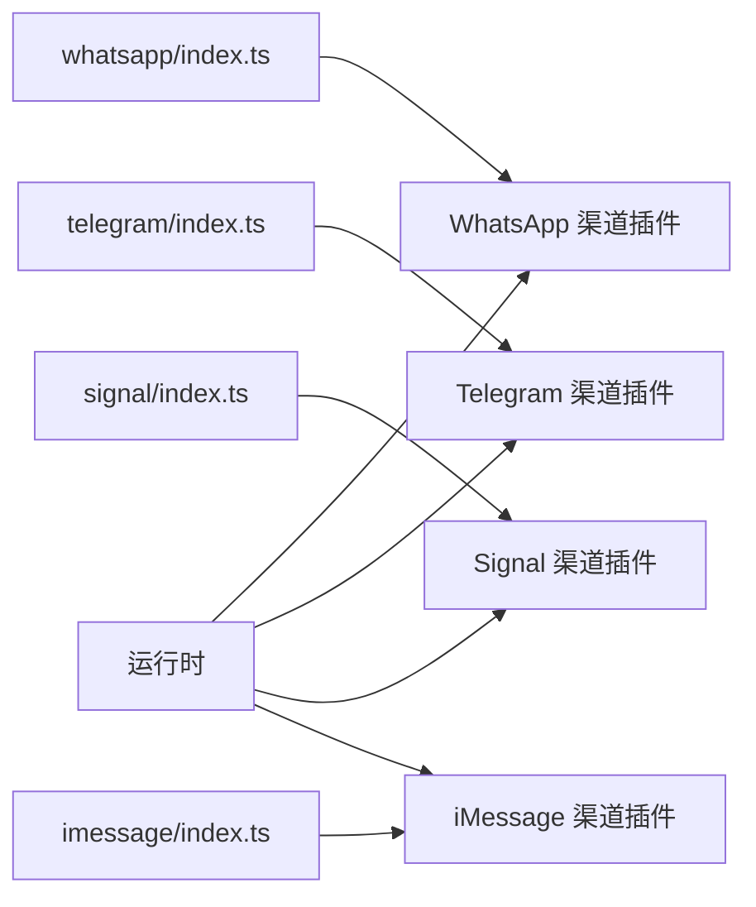

# 即时通讯渠道

<cite>
**本文引用的文件**
- [docs/channels/whatsapp.md](file://docs/channels/whatsapp.md)
- [docs/channels/telegram.md](file://docs/channels/telegram.md)
- [docs/channels/signal.md](file://docs/channels/signal.md)
- [docs/channels/imessage.md](file://docs/channels/imessage.md)
- [extensions/whatsapp/index.ts](file://extensions/whatsapp/index.ts)
- [extensions/telegram/index.ts](file://extensions/telegram/index.ts)
- [extensions/signal/index.ts](file://extensions/signal/index.ts)
- [extensions/imessage/index.ts](file://extensions/imessage/index.ts)
</cite>

## 目录

1. [简介](#简介)
2. [项目结构](#项目结构)
3. [核心组件](#核心组件)
4. [架构总览](#架构总览)
5. [详细组件分析](#详细组件分析)
6. [依赖关系分析](#依赖关系分析)
7. [性能考量](#性能考量)
8. [故障排除指南](#故障排除指南)
9. [结论](#结论)
10. [附录](#附录)

## 简介

本文件面向OpenClaw即时通讯渠道集成，系统性梳理并解读以下平台的接入方式与实现要点：WhatsApp（Web通道，基于Baileys）、Telegram（Bot API，基于grammY）、Signal（通过signal-cli JSON-RPC+SSE）、iMessage（遗留方案imsg，推荐新部署使用BlueBubbles）。文档覆盖认证与配对、消息处理与分块、媒体上传与大小限制、群组管理与提及门控、工具动作与能力开关、配置示例、API限制与性能优化建议，并提供可操作的故障排除步骤。

## 项目结构

OpenClaw采用插件化扩展体系，各渠道以独立扩展存在，入口位于extensions目录下的对应子目录，每个扩展导出一个注册器，负责向OpenClaw运行时注册渠道插件并设置运行时行为。

图表来源

- [extensions/whatsapp/index.ts](file://extensions/whatsapp/index.ts#L1-L18)
- [extensions/telegram/index.ts](file://extensions/telegram/index.ts#L1-L18)
- [extensions/signal/index.ts](file://extensions/signal/index.ts#L1-L18)
- [extensions/imessage/index.ts](file://extensions/imessage/index.ts#L1-L18)

章节来源

- [extensions/whatsapp/index.ts](file://extensions/whatsapp/index.ts#L1-L18)
- [extensions/telegram/index.ts](file://extensions/telegram/index.ts#L1-L18)
- [extensions/signal/index.ts](file://extensions/signal/index.ts#L1-L18)
- [extensions/imessage/index.ts](file://extensions/imessage/index.ts#L1-L18)

## 核心组件

- 渠道插件注册器：每个扩展在index.ts中导出插件对象，调用运行时注册渠道并注入运行时设置。
- 配置参考与行为说明：各平台的配置项、访问控制策略、消息分块、媒体限制、提及门控、工具动作、Webhook/长轮询模式、历史上下文注入、自检与排障等，详见对应文档。

章节来源

- [extensions/whatsapp/index.ts](file://extensions/whatsapp/index.ts#L6-L15)
- [extensions/telegram/index.ts](file://extensions/telegram/index.ts#L6-L15)
- [extensions/signal/index.ts](file://extensions/signal/index.ts#L6-L15)
- [extensions/imessage/index.ts](file://extensions/imessage/index.ts#L6-L15)

## 架构总览

下图展示OpenClaw与各即时通讯渠道的交互关系：Gateway持有会话/监听器；渠道通过各自SDK或外部CLI与平台通信；消息经统一信封进入路由与会话管理；回复按平台规则回发。

图表来源

- [docs/channels/whatsapp.md](file://docs/channels/whatsapp.md#L126-L132)
- [docs/channels/telegram.md](file://docs/channels/telegram.md#L10-L10)
- [docs/channels/signal.md](file://docs/channels/signal.md#L11-L11)
- [docs/channels/imessage.md](file://docs/channels/imessage.md#L17-L17)

## 详细组件分析

### WhatsApp（Web通道）

- 运行模型
  - Gateway拥有WebSocket连接与重连循环。
  - 出站发送需目标账户存在活跃监听。
  - 忽略状态/广播类聊天；私聊按DM会话规则路由；群聊会话隔离。
- 访问控制与激活
  - DM策略：配对/允许名单/开放/禁用；允许名单支持E.164号码；默认允许已登录自号；来自自身的出站私聊不自动配对。
  - 群组策略：两层控制（成员允许名单 + 发送者允许名单），支持通配符；未配置时默认开放；群发者允许名单回退至全局allowFrom。
  - 提及门控：默认群组回复需要提及；支持显式提及、正则模式、隐式“回复给机器人”检测；会话级/持久化命令切换。
- 自我聊天保护
  - 当自号出现在允许名单中，跳过自聊已读回执、避免自触发提及、默认回复前缀根据身份命名或默认值。
- 消息归一化与上下文
  - 入站消息包装为通用入站信封；引用回复附加上下文标记；媒体仅消息体转为占位符；位置/联系人文本化后路由。
  - 群组未处理消息可缓冲并在触发时注入上下文，上限可配置。
  - 已读回执默认开启，支持全局/账户级关闭；自聊回合跳过。
- 投递、分块与媒体
  - 文本分块：默认长度上限与换行优先两种模式。
  - 媒体：支持图片/视频/音频（语音备忘）/文档；音频OGG重写为含Opus编解码；多媒体回复首项加标题；支持HTTP/本地路径。
  - 大小限制：入站保存上限、自动回复出站上限、图片自动优化、失败时首项回退为文本提示。
- 确认反应
  - 支持即时确认反应（emoji），在入站接受后立即发送，失败不影响回复；群组按提及/总是策略；使用渠道专属配置项。
- 多账户与凭据
  - 账户选择：默认账户或首个配置账户；账户ID内部标准化。
  - 凭据路径：当前为特定目录+备份文件；旧版默认目录兼容迁移。
  - 注销：清理指定账户认证状态，保留OAuth文件。
- 工具与动作
  - 支持反应动作；动作门控：反应、投票等；默认允许渠道发起配置写入。
- 故障排除
  - 未链接（需扫码）：重新登录并检查状态。
  - 已链接但断线：运行诊断与日志；必要时重新登录。
  - 发送无监听：确保Gateway运行且账户已链接。
  - 群消息被忽略：检查群策略/允许名单/群发者名单/提及门控。
  - Bun运行警告：建议使用Node稳定运行WhatsApp/Telegram网关。

章节来源

- [docs/channels/whatsapp.md](file://docs/channels/whatsapp.md#L126-L132)
- [docs/channels/whatsapp.md](file://docs/channels/whatsapp.md#L134-L192)
- [docs/channels/whatsapp.md](file://docs/channels/whatsapp.md#L194-L282)
- [docs/channels/whatsapp.md](file://docs/channels/whatsapp.md#L284-L307)
- [docs/channels/whatsapp.md](file://docs/channels/whatsapp.md#L309-L333)
- [docs/channels/whatsapp.md](file://docs/channels/whatsapp.md#L334-L355)
- [docs/channels/whatsapp.md](file://docs/channels/whatsapp.md#L357-L364)
- [docs/channels/whatsapp.md](file://docs/channels/whatsapp.md#L365-L414)
- [docs/channels/whatsapp.md](file://docs/channels/whatsapp.md#L416-L435)

### Telegram（Bot API）

- 运行模型
  - 生产就绪：Bot DM与群组；默认长轮询；可选Webhook。
  - Gateway全权持有；路由确定：入站回发到Telegram；群组会话按ID隔离；论坛主题附加topic标识；DM支持message_thread_id保持线程。
  - grammY运行器按聊天/线程顺序执行；并发受全局最大并发限制。
  - Telegram Bot API无已读回执。
- 侧边设置与可见性
  - 默认隐私模式限制群组消息；可通过BotFather关闭隐私或设为管理员以接收全部消息；切换后需移除并重新添加Bot。
- 访问控制与激活
  - DM策略：配对/允许名单/开放/禁用；允许名单支持数字ID与用户名（带前缀可标准化）。
  - 查找用户ID：查看日志中的from.id或使用官方API方法；第三方Bot亦可。
  - 群组策略：两套独立控制（允许哪些群 + 哪些人在群内可触发）；群发者名单回退至全局allowFrom。
  - 提及行为：默认群组回复需要提及；支持原生@机器人名或自定义正则；会话级命令切换。
- 行为特性
  - 草稿流式：DM中可用草稿气泡流式输出；支持部分草稿与块状草稿两种模式；块状草稿受文本分块限制。
  - 格式化与HTML回退：默认HTML解析；Markdown转安全HTML；若Telegram拒绝解析则回退纯文本。
  - 命令菜单：启动时注册；支持自定义命令；冲突跳过并记录；DNS/HTTPS可达性影响注册。
  - 内联按钮：支持范围控制（关闭/仅DM/群/全部/允许名单）；回调数据透传为文本。
  - 消息动作：支持发送/反应/删除/编辑等；动作门控；贴纸动作可启用。
  - 回复线程标签：支持回复到当前或指定消息ID；回复目标模式可配置。
  - 论坛主题与线程：主题会话键追加topic标识；回复与打字指示指向主题；主题继承群组配置。
  - 音频/视频/贴纸：区分语音与音频文件；视频支持视频消息；贴纸缓存减少重复视觉分析；贴纸动作可启用。
  - 反应通知：可配置仅自身/所有；非论坛群组路由至群会话；论坛群组路由至总主题会话。
  - 配置写入：默认允许；支持群迁移事件与命令触发的配置变更。
  - 长轮询与Webhook：默认长轮询；Webhook需URL与密钥；可配置路径与本地监听端口。
- 限制、重试与CLI
  - 文本分块：默认上限与换行优先模式；媒体上限；超时与重试可配置；群组上下文历史默认上限；DM历史可按群或用户覆盖。
  - CLI发送目标：支持数字ID或用户名。

章节来源

- [docs/channels/telegram.md](file://docs/channels/telegram.md#L10-L102)
- [docs/channels/telegram.md](file://docs/channels/telegram.md#L104-L206)
- [docs/channels/telegram.md](file://docs/channels/telegram.md#L208-L217)
- [docs/channels/telegram.md](file://docs/channels/telegram.md#L218-L624)
- [docs/channels/telegram.md](file://docs/channels/telegram.md#L626-L668)
- [docs/channels/telegram.md](file://docs/channels/telegram.md#L672-L697)

### Signal（signal-cli）

- 快速上手
  - 推荐使用独立Signal号码；安装signal-cli并链接设备；配置OpenClaw并启动Gateway。
- 数号模型（重要）
  - Gateway连接的是Signal设备（signal-cli账号）；如在个人账号上运行，会忽略自己的消息以防止环路；“我发消息给Bot，Bot回复”场景请使用独立Bot号码。
- 访问控制（DM与群组）
  - DM：默认配对；未知发件人需配对码；配对码1小时过期；支持UUID发件人存储为uuid:格式。
  - 群组：策略支持开放/允许名单/禁用；群发者名单控制触发条件。
- 行为与媒体
  - signal-cli作为守护进程，Gateway通过SSE读取事件；入站消息归一化；回复始终回发到同一号码或群组。
  - 文本分块与换行优先；支持附件（从signal-cli获取Base64）；默认媒体上限；可跳过下载；群组历史上下文可配置。
- 打字与已读回执
  - 打字指示：通过signal-cli发送并随回复生成刷新；已读回执：可转发允许的DM已读回执；群组不暴露已读回执。
- 反应（消息工具）
  - 使用react消息动作；目标支持E.164或UUID；群组反应需提供目标作者信息；动作门控与级别可配置。
- 外部守护模式
  - 可自行管理signal-cli守护进程并通过httpUrl指向；禁用自动启动；慢启动可设置超时。
- 故障排除
  - 基础检查：状态、网关状态、日志、诊断、探针；确认DM配对状态。

章节来源

- [docs/channels/signal.md](file://docs/channels/signal.md#L13-L36)
- [docs/channels/signal.md](file://docs/channels/signal.md#L55-L61)
- [docs/channels/signal.md](file://docs/channels/signal.md#L103-L163)
- [docs/channels/signal.md](file://docs/channels/signal.md#L171-L196)
- [docs/channels/signal.md](file://docs/channels/signal.md#L197-L229)

### iMessage（遗留：imsg）

- 快速上手
  - 本地Mac：安装并验证imsg；配置OpenClaw；启动Gateway；批准首次DM配对。
  - 远程Mac（SSH）：通过包装脚本将cliPath指向远程imsg；启用远端主机用于附件SCP拉取。
- 要求与权限（macOS）
  - Messages需登录；OpenClaw/ imsg进程需具备全盘访问与自动化权限；可在相同上下文下交互式触发授权提示。
- 访问控制与路由
  - DM策略：配对/允许名单/开放/禁用；允许名单支持句柄或聊天目标（chat_id/ GUID/identifier）。
  - 群组策略：开放/允许名单/禁用；群发者名单回退至全局allowFrom；无原生提及元数据，依赖正则模式与控制命令绕过。
  - 会话与确定性回复：DM直连路由；群组路由；默认DM会话合并至主会话；群组会话隔离；回复按来源元数据回发。
- 部署模式
  - 专用Bot macOS用户：独立Apple ID与用户，隔离Bot流量。
  - Tailscale远程Mac：典型拓扑与SSH包装脚本示例；启用非交互式密钥。
  - 多账户：per-account配置覆盖字段。
- 媒体、分块与投递目标
  - 附件：可选入站抓取；远端路径可通过SCP拉取；出站媒体上限。
  - 分块：默认长度上限与换行优先。
  - 地址格式：推荐chat_id/ GUID/identifier；也支持句柄格式。
- 配置写入
  - 默认允许渠道发起的配置写入（当命令配置启用时）。
- 故障排除
  - imsg不可用或RPC不受支持：验证二进制与RPC支持；更新imsg。
  - DM被忽略：检查DM策略/允许名单/配对状态。
  - 群消息被忽略：检查群策略/群发者名单/允许名单/提及正则。
  - 远端附件失败：检查远端主机/SSH密钥/远端路径可读性。
  - macOS权限提示遗漏：在同一用户/会话上下文中交互式触发授权。

章节来源

- [docs/channels/imessage.md](file://docs/channels/imessage.md#L31-L108)
- [docs/channels/imessage.md](file://docs/channels/imessage.md#L110-L126)
- [docs/channels/imessage.md](file://docs/channels/imessage.md#L127-L177)
- [docs/channels/imessage.md](file://docs/channels/imessage.md#L179-L236)
- [docs/channels/imessage.md](file://docs/channels/imessage.md#L238-L272)
- [docs/channels/imessage.md](file://docs/channels/imessage.md#L274-L289)
- [docs/channels/imessage.md](file://docs/channels/imessage.md#L290-L344)
- [docs/channels/imessage.md](file://docs/channels/imessage.md#L345-L352)

## 依赖关系分析

- 插件注册依赖
  - 各扩展在index.ts中导入渠道插件与运行时设置函数，并通过运行时注册渠道。
- 平台差异
  - WhatsApp：Web通道（Baileys），Gateway维护会话与重连。
  - Telegram：Bot API（grammY），支持长轮询与Webhook。
  - Signal：外部CLI（signal-cli），HTTP JSON-RPC + SSE。
  - iMessage：外部CLI（imsg），JSON-RPC通过stdio。
- 配置与行为耦合
  - 访问控制策略、消息分块、媒体限制、提及门控、工具动作、配置写入等均通过配置驱动，体现高内聚低耦合的设计。

图表来源

- [extensions/whatsapp/index.ts](file://extensions/whatsapp/index.ts#L1-L18)
- [extensions/telegram/index.ts](file://extensions/telegram/index.ts#L1-L18)
- [extensions/signal/index.ts](file://extensions/signal/index.ts#L1-L18)
- [extensions/imessage/index.ts](file://extensions/imessage/index.ts#L1-L18)

章节来源

- [extensions/whatsapp/index.ts](file://extensions/whatsapp/index.ts#L1-L18)
- [extensions/telegram/index.ts](file://extensions/telegram/index.ts#L1-L18)
- [extensions/signal/index.ts](file://extensions/signal/index.ts#L1-L18)
- [extensions/imessage/index.ts](file://extensions/imessage/index.ts#L1-L18)

## 性能考量

- 文本分块与换行优先：在长文本场景下优先按段落边界切分，降低截断成本。
- 媒体自动优化：入站图片自动压缩/缩放，满足平台限制并提升传输效率。
- 历史上下文注入：群组未处理消息缓冲注入，减少上下文缺失导致的重复问答。
- 并发与限流：Telegram长轮询按聊天/线程顺序执行，整体并发受全局最大并发限制；Signal打字指示持续刷新以改善感知延迟。
- 网络稳定性：Telegram API域名IPv6解析异常可能导致间歇性失败，建议检查DNS解析结果并确保网络连通性。

## 故障排除指南

- WhatsApp
  - 未链接：重新登录并检查状态。
  - 断线/重连：运行诊断与日志；必要时重新登录。
  - 发送失败：确保目标账户存在活跃监听。
  - 群消息被忽略：检查群策略/允许名单/群发者名单/提及门控。
  - 运行环境：避免使用Bun，建议使用Node。
- Telegram
  - 非提及群消息无响应：关闭隐私模式或设为管理员；使用探针检查具体群ID。
  - 完全看不到群消息：确认群组已在允许名单中并处于成员状态。
  - 命令部分/完全无效：授权发送者身份（配对/允许名单）；命令授权在群策略开放时仍生效；setMyCommands失败通常为DNS/HTTPS可达性问题。
  - 轮询/网络不稳定：注意Node版本与fetch/代理可能引发Abort类型不匹配；检查api.telegram.org的A/AAAA解析。
- Signal
  - 守护可达但无回复：核对账户/守护设置（httpUrl/account）与接收模式。
  - DM被忽略：发送者待配对审批。
  - 群消息被忽略：群发者/提及门控阻止。
- iMessage
  - imsg不可用或RPC不受支持：验证二进制与RPC支持。
  - DM被忽略：检查DM策略/允许名单/配对状态。
  - 群消息被忽略：检查群策略/群发者名单/允许名单/提及正则。
  - 远端附件失败：检查远端主机/SSH密钥/远端路径可读性。
  - 权限提示遗漏：在同一用户/会话上下文中交互式触发授权。

章节来源

- [docs/channels/whatsapp.md](file://docs/channels/whatsapp.md#L365-L414)
- [docs/channels/telegram.md](file://docs/channels/telegram.md#L626-L668)
- [docs/channels/signal.md](file://docs/channels/signal.md#L171-L196)
- [docs/channels/imessage.md](file://docs/channels/imessage.md#L290-L344)

## 结论

OpenClaw对WhatsApp、Telegram、Signal、iMessage四类即时通讯渠道提供了完善的接入与运维能力：清晰的访问控制与提及门控、稳健的消息分块与媒体处理、灵活的多账户与配置写入、以及详尽的排障指引。结合平台特性与限制，建议在生产环境中优先采用独立号码/账号、合理配置分块与媒体上限、启用必要的Webhook/守护模式，并持续关注网络与权限配置以保障稳定性。

## 附录

- 配置参考与示例：各平台文档提供了高信号字段清单与最小配置示例，便于快速落地。
- 相关主题：配对、渠道路由、故障排除等主题文档可进一步深化理解。
