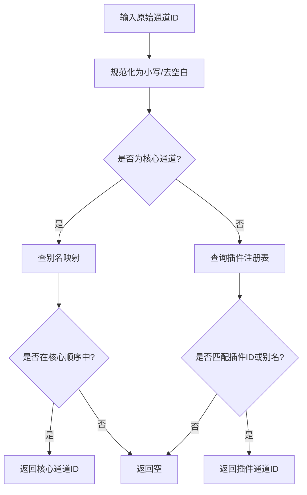
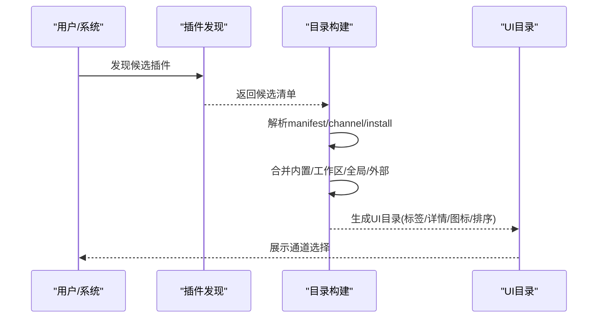
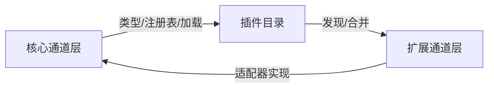

# 多渠道消息集成

<cite>
**本文引用的文件**
- [README.md](file://README.md)
- [docs/index.md](file://docs/index.md)
- [src/channels/registry.ts](file://src/channels/registry.ts)
- [src/channels/plugins/types.ts](file://src/channels/plugins/types.ts)
- [src/channels/plugins/load.ts](file://src/channels/plugins/load.ts)
- [src/channels/plugins/catalog.ts](file://src/channels/plugins/catalog.ts)
- [src/channels/plugins/config-schema.ts](file://src/channels/plugins/config-schema.ts)
- [src/channels/plugins/helpers.ts](file://src/channels/plugins/helpers.ts)
- [extensions/whatsapp/index.ts](file://extensions/whatsapp/index.ts)
- [extensions/telegram/index.ts](file://extensions/telegram/index.ts)
- [extensions/discord/index.ts](file://extensions/discord/index.ts)
- [extensions/googlechat/index.ts](file://extensions/googlechat/index.ts)
- [extensions/signal/index.ts](file://extensions/signal/index.ts)
- [extensions/imessage/index.ts](file://extensions/imessage/index.ts)
- [extensions/bluebubbles/index.ts](file://extensions/bluebubbles/index.ts)
- [extensions/matrix/index.ts](file://extensions/matrix/index.ts)
- [extensions/zalo/index.ts](file://extensions/zalo/index.ts)
- [extensions/zalouser/index.ts](file://extensions/zalouser/index.ts)
- [extensions/irc/index.ts](file://extensions/irc/index.ts)
- [extensions/line/index.ts](file://extensions/line/index.ts)
- [extensions/mattermost/index.ts](file://extensions/mattermost/index.ts)
- [extensions/feishu/index.ts](file://extensions/feishu/index.ts)
- [extensions/nostr/index.ts](file://extensions/nostr/index.ts)
- [extensions/tlon/index.ts](file://extensions/tlon/index.ts)
- [extensions/twitch/index.ts](file://extensions/twitch/index.ts)
- [extensions/copilot-proxy/index.ts](file://extensions/copilot-proxy/index.ts)
- [extensions/device-pair/index.ts](file://extensions/device-pair/index.ts)
- [extensions/diagnostics-otel/index.ts](file://extensions/diagnostics-otel/index.ts)
- [extensions/llm-task/index.ts](file://extensions/llm-task/index.ts)
- [extensions/memory-core/index.ts](file://extensions/memory-core/index.ts)
- [extensions/memory-lancedb/index.ts](file://extensions/memory-lancedb/index.ts)
- [extensions/minimax-portal-auth/index.ts](file://extensions/minimax-portal-auth/index.ts)
- [extensions/msteams/index.ts](file://extensions/msteams/index.ts)
- [extensions/nextcloud-talk/index.ts](file://extensions/nextcloud-talk/index.ts)
- [extensions/open-prose/index.ts](file://extensions/open-prose/index.ts)
- [extensions/phone-control/index.ts](file://extensions/phone-control/index.ts)
- [extensions/qwen-portal-auth/index.ts](file://extensions/qwen-portal-auth/index.ts)
- [extensions/talk-voice/index.ts](file://extensions/talk-voice/index.ts)
- [extensions/voice-call/index.ts](file://extensions/voice-call/index.ts)
- [docs/channels/index.md](file://docs/channels/index.md)
- [docs/channels/whatsapp.md](file://docs/channels/whatsapp.md)
- [docs/channels/telegram.md](file://docs/channels/telegram.md)
- [docs/channels/discord.md](file://docs/channels/discord.md)
- [docs/channels/googlechat.md](file://docs/channels/googlechat.md)
- [docs/channels/signal.md](file://docs/channels/signal.md)
- [docs/channels/imessage.md](file://docs/channels/imessage.md)
- [docs/channels/bluebubbles.md](file://docs/channels/bluebubbles.md)
- [docs/channels/matrix.md](file://docs/channels/matrix.md)
- [docs/channels/zalo.md](file://docs/channels/zalo.md)
- [docs/channels/zalouser.md](file://docs/channels/zalouser.md)
- [docs/channels/irc.md](file://docs/channels/irc.md)
- [docs/channels/line.md](file://docs/channels/line.md)
- [docs/channels/mattermost.md](file://docs/channels/mattermost.md)
- [docs/channels/feishu.md](file://docs/channels/feishu.md)
- [docs/channels/nostr.md](file://docs/channels/nostr.md)
- [docs/channels/tlon.md](file://docs/channels/tlon.md)
- [docs/channels/twitch.md](file://docs/channels/twitch.md)
- [docs/channels/troubleshooting.md](file://docs/channels/troubleshooting.md)
- [docs/concepts/channel-routing.md](file://docs/concepts/channel-routing.md)
- [docs/concepts/group-messages.md](file://docs/concepts/group-messages.md)
- [docs/concepts/messages.md](file://docs/concepts/messages.md)
- [docs/concepts/typing-indicators.md](file://docs/concepts/typing-indicators.md)
- [docs/concepts/streaming.md](file://docs/concepts/streaming.md)
- [docs/concepts/retry.md](file://docs/concepts/retry.md)
- [docs/gateway/configuration.md](file://docs/gateway/configuration.md)
- [docs/gateway/authentication.md](file://docs/gateway/authentication.md)
- [docs/gateway/security.md](file://docs/gateway/security.md)
- [docs/gateway/troubleshooting.md](file://docs/gateway/troubleshooting.md)
- [docs/cli/channels.md](file://docs/cli/channels.md)
- [docs/cli/pairing.md](file://docs/cli/pairing.md)
- [docs/cli/configure.md](file://docs/cli/configure.md)
</cite>

## 目录

1. [简介](#简介)
2. [项目结构](#项目结构)
3. [核心组件](#核心组件)
4. [架构总览](#架构总览)
5. [详细组件分析](#详细组件分析)
6. [依赖关系分析](#依赖关系分析)
7. [性能考量](#性能考量)
8. [故障排除指南](#故障排除指南)
9. [结论](#结论)
10. [附录](#附录)

## 简介

本技术文档面向OpenClaw多渠道消息集成系统，系统支持20+消息平台（如WhatsApp、Telegram、Slack、Discord、Google Chat、Signal、iMessage、BlueBubbles、Microsoft Teams、Matrix、Zalo、IRC、Line、Mattermost、Feishu、Nostr、Tlon、Twitch等），通过统一的通道适配器抽象与插件化架构，实现跨渠道的消息路由、群组管理、提及门控、媒体处理、认证与安全控制。本文从系统架构、适配器设计、路由规则、认证机制、配置方法、API限制与最佳实践等方面进行深入解析，并提供实际配置示例与故障排除建议。

## 项目结构

OpenClaw采用“核心通道注册表 + 插件目录”的双层结构：核心层定义通道元数据与通用类型，扩展层以插件形式提供各平台适配器。核心文件包括通道注册表、插件类型与加载、UI目录构建、配置模式等；扩展目录包含各平台的入口与适配器实现。

```mermaid
graph TB
subgraph "核心通道层"
REG["通道注册表<br/>src/channels/registry.ts"]
TYPES["适配器类型定义<br/>src/channels/plugins/types.ts"]
LOAD["插件加载缓存<br/>src/channels/plugins/load.ts"]
CAT["插件目录构建<br/>src/channels/plugins/catalog.ts"]
CFG["配置Schema工具<br/>src/channels/plugins/config-schema.ts"]
HELP["辅助函数<br/>src/channels/plugins/helpers.ts"]
end
subgraph "扩展通道层"
EXT_WA["WhatsApp 扩展<br/>extensions/whatsapp/index.ts"]
EXT_TG["Telegram 扩展<br/>extensions/telegram/index.ts"]
EXT_DC["Discord 扩展<br/>extensions/discord/index.ts"]
EXT_GC["Google Chat 扩展<br/>extensions/googlechat/index.ts"]
EXT_SG["Signal 扩展<br/>extensions/signal/index.ts"]
EXT_IM["iMessage 扩展<br/>extensions/imessage/index.ts"]
EXT_BB["BlueBubbles 扩展<br/>extensions/bluebubbles/index.ts"]
EXT_MT["Matrix 扩展<br/>extensions/matrix/index.ts"]
EXT_ZA["Zalo 扩展<br/>extensions/zalo/index.ts"]
EXT_ZU["Zalo个人 扩展<br/>extensions/zalouser/index.ts"]
EXT_IR["IRC 扩展<br/>extensions/irc/index.ts"]
EXT_LN["Line 扩展<br/>extensions/line/index.ts"]
EXT_MM["Mattermost 扩展<br/>extensions/mattermost/index.ts"]
EXT_FS["飞书 扩展<br/>extensions/feishu/index.ts"]
EXT_NS["Nostr 扩展<br/>extensions/nostr/index.ts"]
EXT_TL["Tlon 扩展<br/>extensions/tlon/index.ts"]
EXT_TW["Twitch 扩展<br/>extensions/twitch/index.ts"]
end
REG --> TYPES
TYPES --> LOAD
TYPES --> CAT
CAT --> EXT_WA
CAT --> EXT_TG
CAT --> EXT_DC
CAT --> EXT_GC
CAT --> EXT_SG
CAT --> EXT_IM
CAT --> EXT_BB
CAT --> EXT_MT
CAT --> EXT_ZA
CAT --> EXT_ZU
CAT --> EXT_IR
CAT --> EXT_LN
CAT --> EXT_MM
CAT --> EXT_FS
CAT --> EXT_NS
CAT --> EXT_TL
CAT --> EXT_TW
```

图表来源

- [src/channels/registry.ts](file://src/channels/registry.ts#L1-L192)
- [src/channels/plugins/types.ts](file://src/channels/plugins/types.ts#L1-L64)
- [src/channels/plugins/load.ts](file://src/channels/plugins/load.ts#L1-L30)
- [src/channels/plugins/catalog.ts](file://src/channels/plugins/catalog.ts#L1-L308)
- [extensions/whatsapp/index.ts](file://extensions/whatsapp/index.ts)
- [extensions/telegram/index.ts](file://extensions/telegram/index.ts)
- [extensions/discord/index.ts](file://extensions/discord/index.ts)
- [extensions/googlechat/index.ts](file://extensions/googlechat/index.ts)
- [extensions/signal/index.ts](file://extensions/signal/index.ts)
- [extensions/imessage/index.ts](file://extensions/imessage/index.ts)
- [extensions/bluebubbles/index.ts](file://extensions/bluebubbles/index.ts)
- [extensions/matrix/index.ts](file://extensions/matrix/index.ts)
- [extensions/zalo/index.ts](file://extensions/zalo/index.ts)
- [extensions/zalouser/index.ts](file://extensions/zalouser/index.ts)
- [extensions/irc/index.ts](file://extensions/irc/index.ts)
- [extensions/line/index.ts](file://extensions/line/index.ts)
- [extensions/mattermost/index.ts](file://extensions/mattermost/index.ts)
- [extensions/feishu/index.ts](file://extensions/feishu/index.ts)
- [extensions/nostr/index.ts](file://extensions/nostr/index.ts)
- [extensions/tlon/index.ts](file://extensions/tlon/index.ts)
- [extensions/twitch/index.ts](file://extensions/twitch/index.ts)

章节来源

- [README.md](file://README.md#L121-L171)
- [docs/index.md](file://docs/index.md#L44-L94)

## 核心组件

- 通道注册表：定义核心聊天通道顺序、别名映射、元信息与标准化函数，确保跨模块一致的通道标识解析。
- 适配器类型系统：统一声明认证、命令、配置、目录、解析、心跳、登录、登出、出站消息、配对、安全、设置、状态、流式传输、线程等适配器接口。
- 插件加载与目录：按优先级发现并构建通道插件目录，支持本地/工作区/全局/捆绑安装源；提供UI目录构建与排序。
- 配置Schema工具：将Zod模式转换为可序列化的JSON Schema，便于配置校验与UI渲染。
- 辅助函数：默认账户解析、配对批准提示格式化等。

章节来源

- [src/channels/registry.ts](file://src/channels/registry.ts#L1-L192)
- [src/channels/plugins/types.ts](file://src/channels/plugins/types.ts#L1-L64)
- [src/channels/plugins/load.ts](file://src/channels/plugins/load.ts#L1-L30)
- [src/channels/plugins/catalog.ts](file://src/channels/plugins/catalog.ts#L1-L308)
- [src/channels/plugins/config-schema.ts](file://src/channels/plugins/config-schema.ts#L1-L12)
- [src/channels/plugins/helpers.ts](file://src/channels/plugins/helpers.ts#L1-L21)

## 架构总览

OpenClaw的通道适配器采用“核心注册表 + 插件目录 + 各平台扩展”的分层设计。核心层负责通道元数据与类型约束，插件层负责发现与目录构建，扩展层提供具体平台适配器。通道消息在网关中统一路由到会话与代理，支持提及门控、回复标签、分块与流式传输等高级能力。

```mermaid
graph TB
GW["网关控制平面<br/>WebSocket/CLI/UI/节点"]
REG["通道注册表<br/>registry.ts"]
CAT["插件目录<br/>catalog.ts"]
LOAD["插件加载<br/>load.ts"]
WA["WhatsApp 适配器<br/>extensions/whatsapp/index.ts"]
TG["Telegram 适配器<br/>extensions/telegram/index.ts"]
DC["Discord 适配器<br/>extensions/discord/index.ts"]
GC["Google Chat 适配器<br/>extensions/googlechat/index.ts"]
SG["Signal 适配器<br/>extensions/signal/index.ts"]
IM["iMessage 适配器<br/>extensions/imessage/index.ts"]
BB["BlueBubbles 适配器<br/>extensions/bluebubbles/index.ts"]
MT["Matrix 适配器<br/>extensions/matrix/index.ts"]
ZA["Zalo 适配器<br/>extensions/zalo/index.ts"]
ZU["Zalo个人 适配器<br/>extensions/zalouser/index.ts"]
IR["IRC 适配器<br/>extensions/irc/index.ts"]
LN["Line 适配器<br/>extensions/line/index.ts"]
MM["Mattermost 适配器<br/>extensions/mattermost/index.ts"]
FS["飞书 适配器<br/>extensions/feishu/index.ts"]
NS["Nostr 适配器<br/>extensions/nostr/index.ts"]
TL["Tlon 适配器<br/>extensions/tlon/index.ts"]
TW["Twitch 适配器<br/>extensions/twitch/index.ts"]
GW --> REG
GW --> CAT
GW --> LOAD
CAT --> WA
CAT --> TG
CAT --> DC
CAT --> GC
CAT --> SG
CAT --> IM
CAT --> BB
CAT --> MT
CAT --> ZA
CAT --> ZU
CAT --> IR
CAT --> LN
CAT --> MM
CAT --> FS
CAT --> NS
CAT --> TL
CAT --> TW
```

图表来源

- [src/channels/registry.ts](file://src/channels/registry.ts#L1-L192)
- [src/channels/plugins/catalog.ts](file://src/channels/plugins/catalog.ts#L1-L308)
- [src/channels/plugins/load.ts](file://src/channels/plugins/load.ts#L1-L30)
- [extensions/whatsapp/index.ts](file://extensions/whatsapp/index.ts)
- [extensions/telegram/index.ts](file://extensions/telegram/index.ts)
- [extensions/discord/index.ts](file://extensions/discord/index.ts)
- [extensions/googlechat/index.ts](file://extensions/googlechat/index.ts)
- [extensions/signal/index.ts](file://extensions/signal/index.ts)
- [extensions/imessage/index.ts](file://extensions/imessage/index.ts)
- [extensions/bluebubbles/index.ts](file://extensions/bluebubbles/index.ts)
- [extensions/matrix/index.ts](file://extensions/matrix/index.ts)
- [extensions/zalo/index.ts](file://extensions/zalo/index.ts)
- [extensions/zalouser/index.ts](file://extensions/zalouser/index.ts)
- [extensions/irc/index.ts](file://extensions/irc/index.ts)
- [extensions/line/index.ts](file://extensions/line/index.ts)
- [extensions/mattermost/index.ts](file://extensions/mattermost/index.ts)
- [extensions/feishu/index.ts](file://extensions/feishu/index.ts)
- [extensions/nostr/index.ts](file://extensions/nostr/index.ts)
- [extensions/tlon/index.ts](file://extensions/tlon/index.ts)
- [extensions/twitch/index.ts](file://extensions/twitch/index.ts)

## 详细组件分析

### 通道注册表与标准化

- 定义核心聊天通道顺序与别名映射，提供标准化函数用于解析通道ID与生成选择行文案。
- 支持“核心通道”与“任意通道”两种标准化路径，避免在共享代码中直接导入重型插件实现。

图表来源

- [src/channels/registry.ts](file://src/channels/registry.ts#L114-L174)

章节来源

- [src/channels/registry.ts](file://src/channels/registry.ts#L1-L192)

### 插件目录与UI目录构建

- 按优先级合并内置、工作区、全局与外部目录，构建通道插件目录；支持外部目录文件解析与环境变量覆盖。
- 将插件元信息转换为UI目录，包含标签、详情标签、系统图标与ID映射，便于前端展示与选择。

图表来源

- [src/channels/plugins/catalog.ts](file://src/channels/plugins/catalog.ts#L259-L308)

章节来源

- [src/channels/plugins/catalog.ts](file://src/channels/plugins/catalog.ts#L1-L308)

### 适配器类型系统

- 统一声明认证、命令、配置、目录、解析、心跳、登录、登出、出站消息、配对、安全、设置、状态、流式传输、线程等适配器接口，确保各平台适配器遵循一致契约。
- 提供消息动作名称集合与上下文类型，支撑跨平台消息处理一致性。

章节来源

- [src/channels/plugins/types.ts](file://src/channels/plugins/types.ts#L1-L64)

### 插件加载与缓存

- 基于活动插件注册表进行插件加载，使用Map缓存已加载插件，避免重复加载与性能损耗。
- 当注册表变更时自动清空缓存，保证一致性。

章节来源

- [src/channels/plugins/load.ts](file://src/channels/plugins/load.ts#L1-L30)

### 配置Schema工具

- 将Zod模式转换为可序列化的JSON Schema，便于配置校验与UI渲染，提升配置体验与一致性。

章节来源

- [src/channels/plugins/config-schema.ts](file://src/channels/plugins/config-schema.ts#L1-L12)

### 辅助函数

- 默认账户解析：根据插件配置与账户列表确定默认账户ID。
- 配对批准提示：生成配对列表与批准命令提示，便于运维操作。

章节来源

- [src/channels/plugins/helpers.ts](file://src/channels/plugins/helpers.ts#L1-L21)

### 平台适配器概览

以下为部分平台适配器的入口文件位置，具体实现位于对应扩展目录中：

- WhatsApp: extensions/whatsapp/index.ts
- Telegram: extensions/telegram/index.ts
- Discord: extensions/discord/index.ts
- Google Chat: extensions/googlechat/index.ts
- Signal: extensions/signal/index.ts
- iMessage: extensions/imessage/index.ts
- BlueBubbles: extensions/bluebubbles/index.ts
- Matrix: extensions/matrix/index.ts
- Zalo: extensions/zalo/index.ts
- Zalo个人: extensions/zalouser/index.ts
- IRC: extensions/irc/index.ts
- Line: extensions/line/index.ts
- Mattermost: extensions/mattermost/index.ts
- 飞书: extensions/feishu/index.ts
- Nostr: extensions/nostr/index.ts
- Tlon: extensions/tlon/index.ts
- Twitch: extensions/twitch/index.ts

章节来源

- [extensions/whatsapp/index.ts](file://extensions/whatsapp/index.ts)
- [extensions/telegram/index.ts](file://extensions/telegram/index.ts)
- [extensions/discord/index.ts](file://extensions/discord/index.ts)
- [extensions/googlechat/index.ts](file://extensions/googlechat/index.ts)
- [extensions/signal/index.ts](file://extensions/signal/index.ts)
- [extensions/imessage/index.ts](file://extensions/imessage/index.ts)
- [extensions/bluebubbles/index.ts](file://extensions/bluebubbles/index.ts)
- [extensions/matrix/index.ts](file://extensions/matrix/index.ts)
- [extensions/zalo/index.ts](file://extensions/zalo/index.ts)
- [extensions/zalouser/index.ts](file://extensions/zalouser/index.ts)
- [extensions/irc/index.ts](file://extensions/irc/index.ts)
- [extensions/line/index.ts](file://extensions/line/index.ts)
- [extensions/mattermost/index.ts](file://extensions/mattermost/index.ts)
- [extensions/feishu/index.ts](file://extensions/feishu/index.ts)
- [extensions/nostr/index.ts](file://extensions/nostr/index.ts)
- [extensions/tlon/index.ts](file://extensions/tlon/index.ts)
- [extensions/twitch/index.ts](file://extensions/twitch/index.ts)

### 渠道路由策略与群组管理

- 路由策略：基于通道ID、账户ID、会话键与目标上下文进行路由，支持主会话与非主会话沙箱隔离。
- 群组管理：支持提及门控、回复标签、每通道分块与路由；群组允许列表与提及模式可配置。
- 类型指示与流式传输：支持打字指示与消息分块/流式传输，提升用户体验与吞吐。

章节来源

- [docs/concepts/channel-routing.md](file://docs/concepts/channel-routing.md)
- [docs/concepts/group-messages.md](file://docs/concepts/group-messages.md)
- [docs/concepts/typing-indicators.md](file://docs/concepts/typing-indicators.md)
- [docs/concepts/streaming.md](file://docs/concepts/streaming.md)

### 认证与安全

- 默认行为：私信配对策略（dmPolicy="pairing"）要求未知发件人先配对；公开入站私信需显式开启（dmPolicy="open"）并加入允许列表。
- 安全建议：生产环境建议启用沙箱、工具白名单、模型降级与日志审计；远程访问建议使用Tailscale或SSH隧道。

章节来源

- [README.md](file://README.md#L113-L119)
- [docs/gateway/security.md](file://docs/gateway/security.md)
- [docs/gateway/authentication.md](file://docs/gateway/authentication.md)

### 配置方法与最佳实践

- 最小配置：模型与默认值，随后逐步添加通道配置与允许列表。
- 通道配置：各平台通过独立配置段落（如channels.whatsapp、channels.telegram等）进行设置；支持环境变量覆盖。
- 最佳实践：为群组启用提及门控；限制媒体大小；为高风险通道启用沙箱；定期运行doctor检查配置健康度。

章节来源

- [README.md](file://README.md#L335-L426)
- [docs/gateway/configuration.md](file://docs/gateway/configuration.md)
- [docs/cli/configure.md](file://docs/cli/configure.md)

### 平台特定配置与API限制

- WhatsApp：设备登录（存储凭据于~/.openclaw/credentials），允许列表与群组允许列表。
- Telegram：BOT_TOKEN或channels.telegram.botToken；可选群组规则与Webhook。
- Discord：DISCORD_BOT_TOKEN或channels.discord.token；可选命令与访问组。
- Google Chat：Google Workspace Chat应用与HTTP Webhook。
- Signal：需要signal-cli与channels.signal配置。
- iMessage：macOS专用，Legacy imsg方式；群组允许列表。
- BlueBubbles：推荐iMessage集成，配置serverUrl、password与webhook。
- 其他平台：Matrix、Zalo、IRC、Line、Mattermost、飞书、Nostr、Tlon、Twitch等均通过各自扩展入口提供适配器与配置项。

章节来源

- [docs/channels/whatsapp.md](file://docs/channels/whatsapp.md)
- [docs/channels/telegram.md](file://docs/channels/telegram.md)
- [docs/channels/discord.md](file://docs/channels/discord.md)
- [docs/channels/googlechat.md](file://docs/channels/googlechat.md)
- [docs/channels/signal.md](file://docs/channels/signal.md)
- [docs/channels/imessage.md](file://docs/channels/imessage.md)
- [docs/channels/bluebubbles.md](file://docs/channels/bluebubbles.md)
- [docs/channels/matrix.md](file://docs/channels/matrix.md)
- [docs/channels/zalo.md](file://docs/channels/zalo.md)
- [docs/channels/zalouser.md](file://docs/channels/zalouser.md)
- [docs/channels/irc.md](file://docs/channels/irc.md)
- [docs/channels/line.md](file://docs/channels/line.md)
- [docs/channels/mattermost.md](file://docs/channels/mattermost.md)
- [docs/channels/feishu.md](file://docs/channels/feishu.md)
- [docs/channels/nostr.md](file://docs/channels/nostr.md)
- [docs/channels/tlon.md](file://docs/channels/tlon.md)
- [docs/channels/twitch.md](file://docs/channels/twitch.md)

## 依赖关系分析

- 低耦合：核心通道层仅依赖轻量类型与注册表，不直接导入各平台实现，避免启动时的重型依赖。
- 可扩展：通过插件目录与发现机制，支持本地/工作区/全局/外部插件源，便于第三方扩展接入。
- 一致性：统一的适配器接口与配置Schema，确保不同平台在认证、消息、目录、线程、状态等方面保持一致行为。

图表来源

- [src/channels/registry.ts](file://src/channels/registry.ts#L1-L192)
- [src/channels/plugins/catalog.ts](file://src/channels/plugins/catalog.ts#L1-L308)
- [src/channels/plugins/load.ts](file://src/channels/plugins/load.ts#L1-L30)

章节来源

- [src/channels/registry.ts](file://src/channels/registry.ts#L1-L192)
- [src/channels/plugins/catalog.ts](file://src/channels/plugins/catalog.ts#L1-L308)
- [src/channels/plugins/load.ts](file://src/channels/plugins/load.ts#L1-L30)

## 性能考量

- 插件缓存：插件加载使用Map缓存，减少重复加载开销。
- 目录构建：按优先级合并目录，避免重复扫描与无效解析。
- 分块与流式传输：消息分块与流式传输降低单次传输压力，提升大媒体与长文本处理效率。
- 沙箱隔离：非主会话使用容器沙箱，隔离工具执行，降低资源争用与安全风险。

## 故障排除指南

- 通道无法连接：检查令牌/密钥配置、网络连通性与Webhook端点；使用doctor诊断配置问题。
- 私信配对：若收到未知发件人的消息，需先配对批准；可通过CLI列出待批准条目并执行批准。
- 群组权限：未启用提及门控时，群组消息可能被误触发；建议为群组启用requireMention或mentionPatterns。
- 远程访问：使用Tailscale Serve/Funnel或SSH隧道；注意绑定地址与鉴权模式设置。
- 日志与监控：启用详细日志与遥测，定位异常事件与性能瓶颈。

章节来源

- [docs/channels/troubleshooting.md](file://docs/channels/troubleshooting.md)
- [docs/gateway/troubleshooting.md](file://docs/gateway/troubleshooting.md)
- [docs/cli/pairing.md](file://docs/cli/pairing.md)
- [docs/gateway/tailscale.md](file://docs/gateway/tailscale.md)

## 结论

OpenClaw通过统一的通道注册表与插件化架构，实现了对20+消息平台的一致适配与高效集成。其核心通道层提供稳定的类型与标准化能力，扩展层以插件形式承载各平台适配器，配合路由、群组管理、提及门控、媒体处理与认证安全机制，满足从个人到企业级的多场景需求。建议在生产环境中结合沙箱、工具白名单与远程安全暴露策略，持续通过doctor与日志进行健康检查与优化。

## 附录

- 快速开始：安装后通过openclaw onboard引导完成网关安装与服务守护进程配置，随后启动网关并进行通道登录与配对。
- CLI参考：channels、pairing、configure等子命令用于通道管理、配对与配置维护。
- 文档索引：各平台详细配置与故障排除见docs/channels与docs/concepts相关文档。

章节来源

- [README.md](file://README.md#L58-L76)
- [docs/cli/channels.md](file://docs/cli/channels.md)
- [docs/cli/pairing.md](file://docs/cli/pairing.md)
- [docs/cli/configure.md](file://docs/cli/configure.md)
- [docs/index.md](file://docs/index.md#L151-L172)
