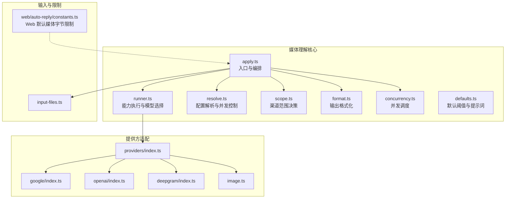
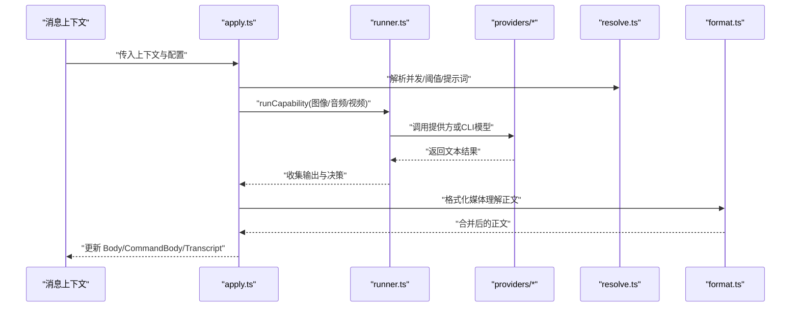
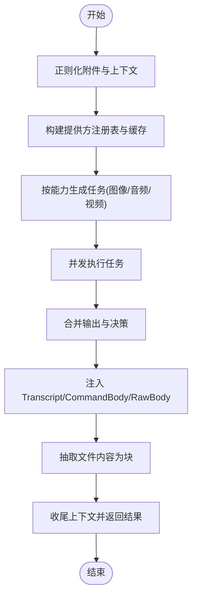
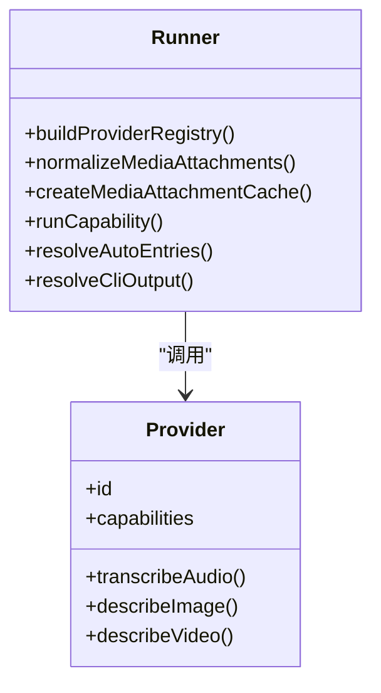
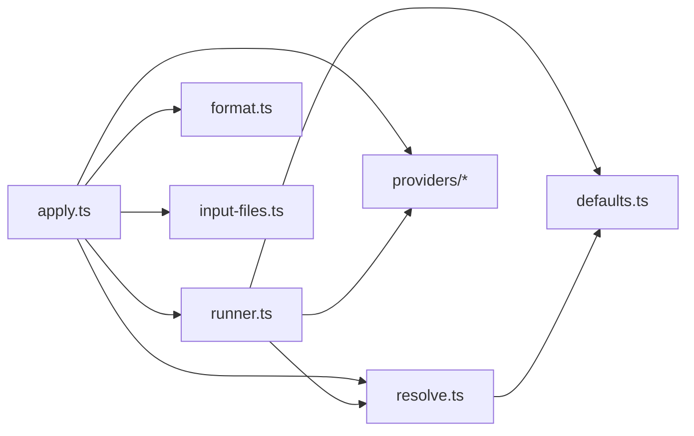

# 媒体处理与传输

<cite>
**本文引用的文件**
- [src/media-understanding/index.ts](file://src/media-understanding/index.ts)
- [src/media-understanding/types.ts](file://src/media-understanding/types.ts)
- [src/media-understanding/apply.ts](file://src/media-understanding/apply.ts)
- [src/media-understanding/format.ts](file://src/media-understanding/format.ts)
- [src/media-understanding/runner.ts](file://src/media-understanding/runner.ts)
- [src/media-understanding/scope.ts](file://src/media-understanding/scope.ts)
- [src/media-understanding/concurrency.ts](file://src/media-understanding/concurrency.ts)
- [src/media-understanding/resolve.ts](file://src/media-understanding/resolve.ts)
- [src/media-understanding/defaults.ts](file://src/media-understanding/defaults.ts)
- [src/media-understanding/providers/index.ts](file://src/media-understanding/providers/index.ts)
- [src/media-understanding/providers/google/index.ts](file://src/media-understanding/providers/google/index.ts)
- [src/media-understanding/providers/openai/index.ts](file://src/media-understanding/providers/openai/index.ts)
- [src/media-understanding/providers/deepgram/index.ts](file://src/media-understanding/providers/deepgram/index.ts)
- [src/media-understanding/providers/image.ts](file://src/media-understanding/providers/image.ts)
- [src/media/input-files.ts](file://src/media/input-files.ts)
- [src/web/auto-reply/constants.ts](file://src/web/auto-reply/constants.ts)
- [src/gateway/server-methods/usage.ts](file://src/gateway/server-methods/usage.ts)
</cite>

## 目录

1. [简介](#简介)
2. [项目结构](#项目结构)
3. [核心组件](#核心组件)
4. [架构总览](#架构总览)
5. [详细组件分析](#详细组件分析)
6. [依赖关系分析](#依赖关系分析)
7. [性能考虑](#性能考虑)
8. [故障排查指南](#故障排查指南)
9. [结论](#结论)
10. [附录](#附录)

## 简介

本技术文档面向 OpenClaw 媒体处理与传输系统，聚焦以下能力：

- 媒体文件的上传、下载、转换与理解（图像描述、音频转录、视频描述、OCR 文本提取）
- 不同渠道的媒体限制（格式、大小、URL 允许策略等）
- 图像处理、音频转录、视频理解与 OCR 的实现机制
- 媒体缓存策略、CDN 集成与带宽优化建议
- 性能监控与质量保障措施

## 项目结构

媒体处理相关代码主要集中在 src/media-understanding 及其子模块，围绕“理解”能力构建统一抽象与执行框架；同时在 src/media 下提供输入文件解析与限制策略，在 src/web 中定义 Web 端默认媒体大小限制。

图表来源

- [src/media-understanding/apply.ts](file://src/media-understanding/apply.ts#L454-L557)
- [src/media-understanding/runner.ts](file://src/media-understanding/runner.ts#L1-L120)
- [src/media-understanding/resolve.ts](file://src/media-understanding/resolve.ts#L141-L147)
- [src/media-understanding/scope.ts](file://src/media-understanding/scope.ts#L26-L64)
- [src/media-understanding/format.ts](file://src/media-understanding/format.ts#L32-L91)
- [src/media-understanding/concurrency.ts](file://src/media-understanding/concurrency.ts#L3-L33)
- [src/media-understanding/defaults.ts](file://src/media-understanding/defaults.ts#L1-L54)
- [src/media-understanding/providers/index.ts](file://src/media-understanding/providers/index.ts#L29-L58)
- [src/media-understanding/providers/google/index.ts](file://src/media-understanding/providers/google/index.ts#L1-L12)
- [src/media-understanding/providers/openai/index.ts](file://src/media-understanding/providers/openai/index.ts#L1-L10)
- [src/media-understanding/providers/deepgram/index.ts](file://src/media-understanding/providers/deepgram/index.ts#L1-L8)
- [src/media-understanding/providers/image.ts](file://src/media-understanding/providers/image.ts#L10-L67)
- [src/media/input-files.ts](file://src/media/input-files.ts)
- [src/web/auto-reply/constants.ts](file://src/web/auto-reply/constants.ts#L1-L1)

章节来源

- [src/media-understanding/index.ts](file://src/media-understanding/index.ts#L1-L10)
- [src/media-understanding/types.ts](file://src/media-understanding/types.ts#L1-L116)

## 核心组件

- 统一类型与能力枚举：定义媒体理解的种类、附件、输出、决策结果等核心类型。
- 执行入口与编排：负责按能力顺序并行执行、聚合输出、注入上下文、生成最终消息体。
- 能力执行器：根据配置与可用密钥自动选择提供方或本地 CLI 模型，解析参数与超时，抽取 CLI 输出文本。
- 配置解析与并发：解析最大字符数、最大字节数、超时、并发度、提示词、模型列表与作用域。
- 提供方注册与适配：内置多提供商（Google、OpenAI、Deepgram、Anthropic、Minimax、Zai），统一 ID 规范与能力声明。
- 输出格式化：将多路理解结果按类别分段组织，支持多附件编号后缀与用户文本保留。
- 并发调度：固定并发上限的任务调度器，避免资源争用。
- 默认阈值与提示词：为图像、音频、视频提供默认大小、超时、提示词与模型映射。
- 输入文件解析与限制：统一解析附件来源、MIME 归一化、大小/字符/重定向/超时限制、PDF 处理策略、文本内容提取块拼接。

章节来源

- [src/media-understanding/types.ts](file://src/media-understanding/types.ts#L1-L116)
- [src/media-understanding/apply.ts](file://src/media-understanding/apply.ts#L454-L557)
- [src/media-understanding/runner.ts](file://src/media-understanding/runner.ts#L545-L587)
- [src/media-understanding/resolve.ts](file://src/media-understanding/resolve.ts#L101-L187)
- [src/media-understanding/providers/index.ts](file://src/media-understanding/providers/index.ts#L29-L58)
- [src/media-understanding/format.ts](file://src/media-understanding/format.ts#L32-L91)
- [src/media-understanding/concurrency.ts](file://src/media-understanding/concurrency.ts#L3-L33)
- [src/media-understanding/defaults.ts](file://src/media-understanding/defaults.ts#L1-L54)
- [src/media/input-files.ts](file://src/media/input-files.ts)

## 架构总览

媒体理解流程从消息上下文出发，按“图像/音频/视频”的顺序并行执行，每个能力内部再根据配置与密钥选择具体模型或 CLI 工具，最终将理解结果与文件内容块注入到消息体中，并进行格式化输出。

图表来源

- [src/media-understanding/apply.ts](file://src/media-understanding/apply.ts#L454-L557)
- [src/media-understanding/runner.ts](file://src/media-understanding/runner.ts#L545-L587)
- [src/media-understanding/providers/index.ts](file://src/media-understanding/providers/index.ts#L29-L58)
- [src/media-understanding/resolve.ts](file://src/media-understanding/resolve.ts#L141-L147)
- [src/media-understanding/format.ts](file://src/media-understanding/format.ts#L32-L91)

## 详细组件分析

### 组件A：媒体理解入口与编排（apply.ts）

- 责任边界
  - 解析原始用户文本占位符，保留用户输入上下文
  - 正常化附件、构建提供方注册表与缓存
  - 按能力顺序并行执行，汇总输出与决策
  - 将音频转录结果写入 Transcript，并回填 CommandBody/RawBody
  - 抽取文件内容为“<file>”块并追加到正文
  - 最终调用收尾逻辑，确保上下文一致
- 关键点
  - 并发控制通过 runWithConcurrency 实现
  - 文件块抽取受 URL 允许、MIME 白名单、大小/字符限制影响
  - 对 PDF 的页数、像素与最小文本字符有专门限制
- 输出
  - 返回 outputs、decisions 以及是否应用了图像/音频/视频/文件

图表来源

- [src/media-understanding/apply.ts](file://src/media-understanding/apply.ts#L454-L557)

章节来源

- [src/media-understanding/apply.ts](file://src/media-understanding/apply.ts#L454-L557)

### 组件B：能力执行与模型选择（runner.ts）

- 责任边界
  - 自动探测本地 CLI（whisper/sherpa/gemini）与云端提供方密钥
  - 解析模型条目、提示词、最大字符数、超时、查询参数
  - 从 stdout 或输出文件中抽取最终文本
  - 记录模型决策摘要与失败原因
- 关键点
  - 支持 provider 与 cli 两种执行路径
  - 为不同提供方构建兼容查询参数（如 Deepgram 的字段名映射）
  - CLI 输出解析对 gemini、sherpa-onnx 等做了特殊处理
- 输出
  - 单能力的输出数组与决策对象

图表来源

- [src/media-understanding/runner.ts](file://src/media-understanding/runner.ts#L67-L80)
- [src/media-understanding/providers/index.ts](file://src/media-understanding/providers/index.ts#L29-L58)

章节来源

- [src/media-understanding/runner.ts](file://src/media-understanding/runner.ts#L370-L390)
- [src/media-understanding/runner.ts](file://src/media-understanding/runner.ts#L476-L502)
- [src/media-understanding/runner.ts](file://src/media-understanding/runner.ts#L642-L679)

### 组件C：配置解析与并发（resolve.ts、concurrency.ts、defaults.ts）

- 配置解析
  - 超时、提示词、最大字符数、最大字节数、模型列表、作用域决策
  - 并发度默认 2，可由配置覆盖
- 并发调度
  - 固定并发上限的任务调度器，异常被记录但不影响整体完成
- 默认阈值
  - 图像/音频/视频默认最大字节数、超时秒数、提示词、默认模型映射

章节来源

- [src/media-understanding/resolve.ts](file://src/media-understanding/resolve.ts#L19-L84)
- [src/media-understanding/concurrency.ts](file://src/media-understanding/concurrency.ts#L3-L33)
- [src/media-understanding/defaults.ts](file://src/media-understanding/defaults.ts#L1-L54)

### 组件D：提供方注册与适配（providers/index.ts、google/openai/deepgram/image）

- 注册与归一化
  - 内置多个提供方，统一 ID 规范（如 gemini -> google）
  - 支持外部覆盖与合并
- 能力声明
  - 各提供方声明自身支持的能力（image/audio/video）
- 具体实现
  - Google：图像、音频、视频
  - OpenAI：图像、音频
  - Deepgram：音频
  - 图像通用函数：统一鉴权、模型发现、调用与文本后处理

章节来源

- [src/media-understanding/providers/index.ts](file://src/media-understanding/providers/index.ts#L29-L58)
- [src/media-understanding/providers/google/index.ts](file://src/media-understanding/providers/google/index.ts#L1-L12)
- [src/media-understanding/providers/openai/index.ts](file://src/media-understanding/providers/openai/index.ts#L1-L10)
- [src/media-understanding/providers/deepgram/index.ts](file://src/media-understanding/providers/deepgram/index.ts#L1-L8)
- [src/media-understanding/providers/image.ts](file://src/media-understanding/providers/image.ts#L10-L67)

### 组件E：输出格式化（format.ts）

- 功能
  - 提取用户文本（去除媒体占位符）
  - 按类别（音频转录/图像描述/视频描述）分段输出
  - 多附件时添加编号后缀，保持用户文本可见性
  - 音频转录单独格式化为多段文本

章节来源

- [src/media-understanding/format.ts](file://src/media-understanding/format.ts#L32-L91)

### 组件F：输入文件解析与限制（input-files.ts、web 默认限制）

- 输入文件解析
  - 归一化 MIME、限制最大字节/字符、最大重定向次数、超时
  - PDF 特殊限制：最大页数、像素、最小文本字符
  - 文本内容提取与“<file>”块拼接
- Web 默认媒体大小
  - Web 端默认媒体字节限制为 5MB

章节来源

- [src/media/input-files.ts](file://src/media/input-files.ts)
- [src/web/auto-reply/constants.ts](file://src/web/auto-reply/constants.ts#L1-L1)

## 依赖关系分析

- 模块内聚
  - apply.ts 作为编排层，耦合 runner.ts、resolve.ts、format.ts、providers/\*、input-files.ts
  - runner.ts 与 providers/\* 弱耦合，通过接口抽象解耦
- 外部依赖
  - 提供方 SDK/HTTP 客户端、本地 CLI 工具（whisper/sherpa/gemini）、鉴权存储
- 循环依赖
  - 未见循环依赖迹象，各模块职责清晰

图表来源

- [src/media-understanding/apply.ts](file://src/media-understanding/apply.ts#L454-L557)
- [src/media-understanding/runner.ts](file://src/media-understanding/runner.ts#L1-L120)
- [src/media-understanding/resolve.ts](file://src/media-understanding/resolve.ts#L141-L147)
- [src/media-understanding/defaults.ts](file://src/media-understanding/defaults.ts#L1-L54)
- [src/media-understanding/providers/index.ts](file://src/media-understanding/providers/index.ts#L29-L58)
- [src/media/input-files.ts](file://src/media/input-files.ts)

## 性能考虑

- 并发与吞吐
  - 默认并发 2，可根据资源与延迟目标调整
  - 并发任务失败会被记录但不阻塞其他任务
- 超时与资源
  - 图像/音频/视频分别有默认超时，避免长时间占用
  - CLI 输出缓冲区限制为 5MB，防止内存膨胀
- 缓存与重用
  - 附件缓存减少重复下载与解码
  - 提供方探测结果缓存（如 gemini 探测）
- 带宽优化
  - Web 端默认媒体大小限制为 5MB，降低首屏与传输压力
  - 文件块抽取仅对非二进制媒体与允许 MIME 生效，避免无意义处理
- 监控与可观测性
  - 使用延迟统计与每日聚合指标，便于定位瓶颈

章节来源

- [src/media-understanding/concurrency.ts](file://src/media-understanding/concurrency.ts#L3-L33)
- [src/media-understanding/defaults.ts](file://src/media-understanding/defaults.ts#L52-L54)
- [src/web/auto-reply/constants.ts](file://src/web/auto-reply/constants.ts#L1-L1)
- [src/gateway/server-methods/usage.ts](file://src/gateway/server-methods/usage.ts#L572-L600)

## 故障排查指南

- 常见问题
  - 附件未被处理：检查 URL 是否被禁用、MIME 是否在白名单、大小/字符是否超过限制
  - 无转录结果：确认音频能力已启用、提供方密钥有效、CLI 工具存在且可执行
  - 图像/视频未理解：确认对应提供方能力声明与模型可用
- 定位手段
  - 查看决策摘要与失败原因（runner.ts 记录）
  - 检查并发任务失败日志（concurrency.ts）
  - 校验输入文件解析与 MIME 归一化（input-files.ts）

章节来源

- [src/media-understanding/runner.ts](file://src/media-understanding/runner.ts#L783-L800)
- [src/media-understanding/concurrency.ts](file://src/media-understanding/concurrency.ts#L23-L27)
- [src/media/input-files.ts](file://src/media/input-files.ts)

## 结论

OpenClaw 的媒体处理与传输体系以“媒体理解”为核心，通过统一的类型与执行框架，结合提供方适配与本地 CLI 能力，实现了图像描述、音频转录与视频理解的自动化编排。配合严格的输入限制、并发控制与输出格式化，系统在易用性与稳定性之间取得平衡。建议在生产环境中结合 CDN 与边缘节点进一步优化带宽与延迟，并持续完善监控与告警体系。

## 附录

### 媒体理解能力与提供方支持概览

- 图像：OpenAI、Anthropic、Google、Minimax、Zai
- 音频：OpenAI、Groq、Deepgram、Google（通过提供方适配）
- 视频：Google（通过提供方适配）

章节来源

- [src/media-understanding/providers/index.ts](file://src/media-understanding/providers/index.ts#L11-L19)
- [src/media-understanding/providers/google/index.ts](file://src/media-understanding/providers/google/index.ts#L1-L12)
- [src/media-understanding/providers/openai/index.ts](file://src/media-understanding/providers/openai/index.ts#L1-L10)
- [src/media-understanding/providers/deepgram/index.ts](file://src/media-understanding/providers/deepgram/index.ts#L1-L8)

### 渠道范围决策规则

- 支持按 channel、chatType、会话 key 前缀进行 allow/deny 控制
- 未匹配规则时采用默认动作（默认 allow）

章节来源

- [src/media-understanding/scope.ts](file://src/media-understanding/scope.ts#L26-L64)
