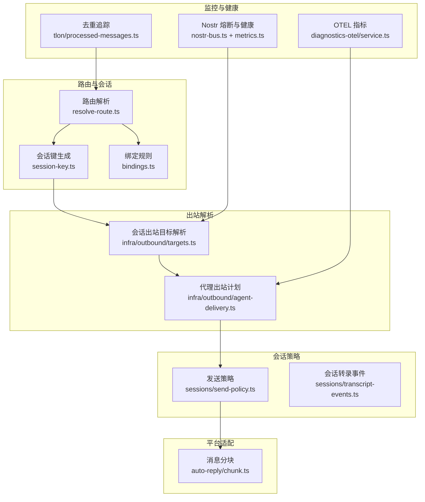
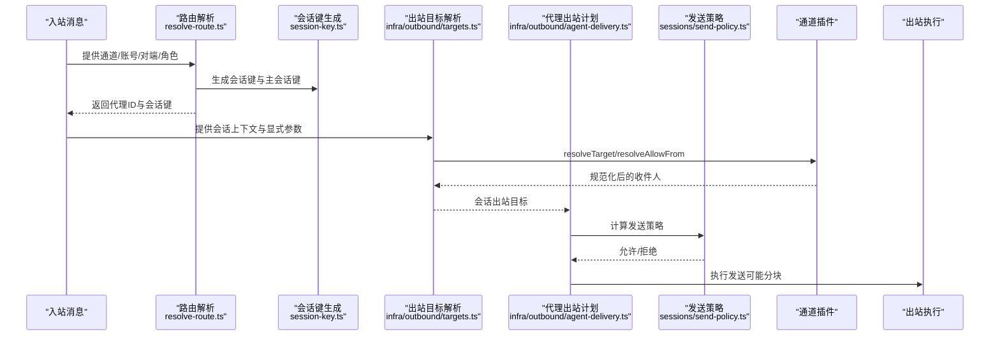
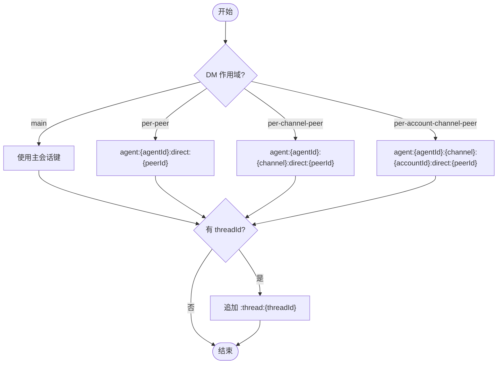
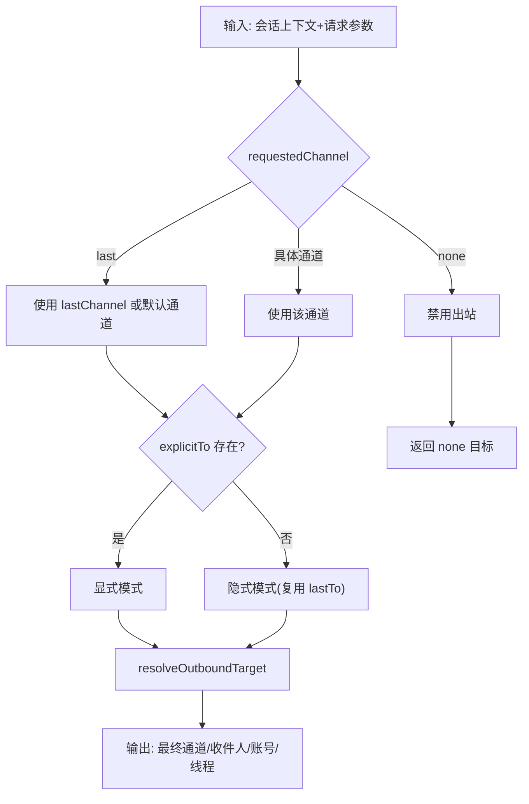
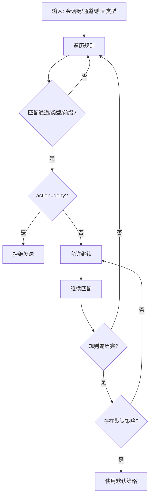
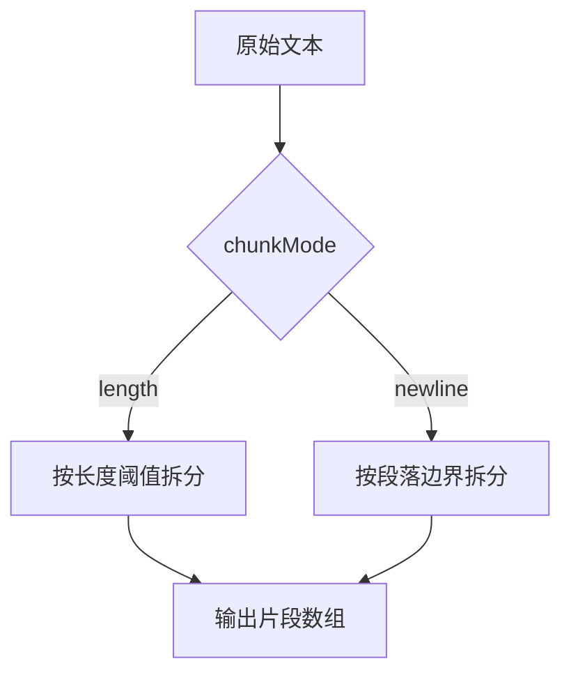
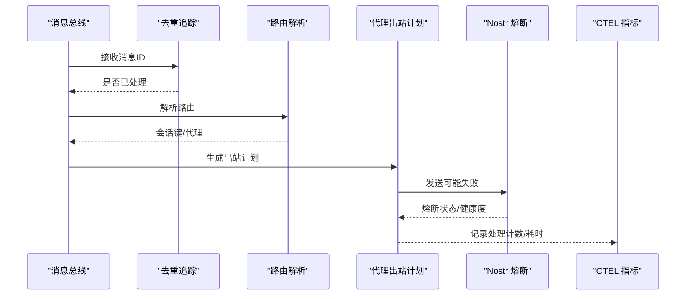
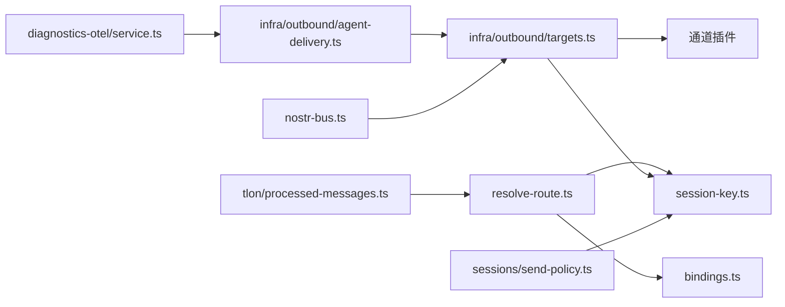

# 消息路由与处理

<cite>
**本文引用的文件**
- [src/routing/resolve-route.ts](file://src/routing/resolve-route.ts)
- [src/routing/session-key.ts](file://src/routing/session-key.ts)
- [src/routing/bindings.ts](file://src/routing/bindings.ts)
- [src/infra/outbound/targets.ts](file://src/infra/outbound/targets.ts)
- [src/infra/outbound/agent-delivery.ts](file://src/infra/outbound/agent-delivery.ts)
- [src/sessions/send-policy.ts](file://src/sessions/send-policy.ts)
- [src/sessions/transcript-events.ts](file://src/sessions/transcript-events.ts)
- [src/auto-reply/chunk.ts](file://src/auto-reply/chunk.ts)
- [extensions/diagnostics-otel/src/service.ts](file://extensions/diagnostics-otel/src/service.ts)
- [extensions/nostr/src/nostr-bus.ts](file://extensions/nostr/src/nostr-bus.ts)
- [extensions/nostr/src/metrics.ts](file://extensions/nostr/src/metrics.ts)
- [extensions/tlon/src/monitor/processed-messages.ts](file://extensions/tlon/src/monitor/processed-messages.ts)
- [docs/zh-CN/refactor/outbound-session-mirroring.md](file://docs/zh-CN/refactor/outbound-session-mirroring.md)
</cite>

## 目录

1. [引言](#引言)
2. [项目结构](#项目结构)
3. [核心组件](#核心组件)
4. [架构总览](#架构总览)
5. [详细组件分析](#详细组件分析)
6. [依赖关系分析](#依赖关系分析)
7. [性能考量](#性能考量)
8. [故障排查指南](#故障排查指南)
9. [结论](#结论)
10. [附录](#附录)

## 引言

本技术文档围绕 OpenClaw 的消息路由与处理系统，系统性阐述以下主题：

- 消息路由算法与会话管理：如何基于绑定规则、账户与通道维度选择代理（Agent），以及如何生成稳定的会话键（SessionKey）。
- 目标解析机制：如何从会话上下文与显式参数推导出最终的出站目标（通道、账号、收件人、线程）。
- 提及门控、命令门控与消息分块：平台适配层如何控制消息发送范围与内容大小，避免越权与超限。
- 路由策略配置、优先级与负载均衡：绑定规则匹配顺序、默认代理回退、账户偏好选择。
- 消息处理流水线、错误重试与状态同步：从入站到出站的端到端流程、去重与健康度跟踪、会话事件广播。
- 性能优化与监控指标：队列深度、等待时间、会话卡顿、运行尝试次数等可观测性指标。

## 项目结构

OpenClaw 的消息路由与处理主要分布在如下模块：

- 路由与会话键：负责代理选择与会话键生成，确保跨通道、跨账号的一致性与可追溯性。
- 出站目标解析：从会话上下文与显式请求中解析出站通道、账号与收件人，并进行允许来源校验。
- 发送策略：按会话键前缀、聊天类型与通道维度控制是否允许发送。
- 分块与适配：根据平台限制与配置决定分块模式与阈值，保证消息不被截断。
- 监控与健康：提供队列与会话指标、电路熔断与健康评分，保障系统稳定性。

**图表来源**

- [src/routing/resolve-route.ts](file://src/routing/resolve-route.ts#L185-L292)
- [src/routing/session-key.ts](file://src/routing/session-key.ts#L130-L186)
- [src/routing/bindings.ts](file://src/routing/bindings.ts#L16-L109)
- [src/infra/outbound/targets.ts](file://src/infra/outbound/targets.ts#L53-L116)
- [src/infra/outbound/agent-delivery.ts](file://src/infra/outbound/agent-delivery.ts#L29-L102)
- [src/sessions/send-policy.ts](file://src/sessions/send-policy.ts#L47-L106)
- [src/auto-reply/chunk.ts](file://src/auto-reply/chunk.ts#L13-L29)
- [extensions/diagnostics-otel/src/service.ts](file://extensions/diagnostics-otel/src/service.ts#L166-L206)
- [extensions/nostr/src/nostr-bus.ts](file://extensions/nostr/src/nostr-bus.ts#L163-L207)
- [extensions/nostr/src/metrics.ts](file://extensions/nostr/src/metrics.ts#L256-L416)
- [extensions/tlon/src/monitor/processed-messages.ts](file://extensions/tlon/src/monitor/processed-messages.ts#L7-L46)

**章节来源**

- [src/routing/resolve-route.ts](file://src/routing/resolve-route.ts#L1-L293)
- [src/routing/session-key.ts](file://src/routing/session-key.ts#L1-L263)
- [src/routing/bindings.ts](file://src/routing/bindings.ts#L1-L121)
- [src/infra/outbound/targets.ts](file://src/infra/outbound/targets.ts#L1-L350)
- [src/infra/outbound/agent-delivery.ts](file://src/infra/outbound/agent-delivery.ts#L1-L145)
- [src/sessions/send-policy.ts](file://src/sessions/send-policy.ts#L1-L107)
- [src/sessions/transcript-events.ts](file://src/sessions/transcript-events.ts#L1-L26)
- [src/auto-reply/chunk.ts](file://src/auto-reply/chunk.ts#L1-L29)
- [extensions/diagnostics-otel/src/service.ts](file://extensions/diagnostics-otel/src/service.ts#L166-L206)
- [extensions/nostr/src/nostr-bus.ts](file://extensions/nostr/src/nostr-bus.ts#L163-L207)
- [extensions/nostr/src/metrics.ts](file://extensions/nostr/src/metrics.ts#L256-L416)
- [extensions/tlon/src/monitor/processed-messages.ts](file://extensions/tlon/src/monitor/processed-messages.ts#L1-L46)

## 核心组件

- 路由解析（resolve-route.ts）
  - 输入：通道、账号、对端标识（群组/私聊）、公会/团队角色等。
  - 输出：代理ID、会话键、主会话键与匹配来源（绑定规则）。
  - 关键点：多级匹配（对端、父线程、公会+角色、公会、团队、账号、任意账号），默认代理回退。
- 会话键生成（session-key.ts）
  - 支持多种 DM 作用域（主会话、按对端、按通道+对端、按账号+通道+对端）。
  - 支持身份链接（identityLinks）将不同平台对端映射为同一会话。
  - 支持线程会话键拼接（threadId）。
- 绑定规则（bindings.ts）
  - 列举绑定、查询默认绑定账号、构建“通道→代理→账号”映射。
- 出站目标解析（targets.ts）
  - 从会话上下文与显式参数解析通道、账号、收件人与线程。
  - 通过插件的 resolveAllowFrom 与 resolveTarget 校验与规范化目标。
- 代理出站计划（agent-delivery.ts）
  - 将请求的通道/收件人与会话上下文合并，生成最终出站计划（含模式：显式/隐式）。
- 发送策略（send-policy.ts）
  - 基于会话键前缀、聊天类型与通道维度的白/黑名单策略。
- 分块（auto-reply/chunk.ts）
  - 长度与段落两种分块模式，支持通道与账号级覆盖。
- 监控与健康（diagnostics-otel、nostr、processed-messages）
  - OTEL 指标：消息处理计数、耗时、队列深度/等待、会话状态与卡顿。
  - Nostr 熔断与健康：失败计数与状态切换、健康评分排序。
  - 去重追踪：基于环形窗口的去重与淘汰。

**章节来源**

- [src/routing/resolve-route.ts](file://src/routing/resolve-route.ts#L185-L292)
- [src/routing/session-key.ts](file://src/routing/session-key.ts#L130-L262)
- [src/routing/bindings.ts](file://src/routing/bindings.ts#L16-L121)
- [src/infra/outbound/targets.ts](file://src/infra/outbound/targets.ts#L53-L350)
- [src/infra/outbound/agent-delivery.ts](file://src/infra/outbound/agent-delivery.ts#L29-L145)
- [src/sessions/send-policy.ts](file://src/sessions/send-policy.ts#L47-L106)
- [src/auto-reply/chunk.ts](file://src/auto-reply/chunk.ts#L13-L29)
- [extensions/diagnostics-otel/src/service.ts](file://extensions/diagnostics-otel/src/service.ts#L166-L206)
- [extensions/nostr/src/nostr-bus.ts](file://extensions/nostr/src/nostr-bus.ts#L163-L207)
- [extensions/nostr/src/metrics.ts](file://extensions/nostr/src/metrics.ts#L256-L416)
- [extensions/tlon/src/monitor/processed-messages.ts](file://extensions/tlon/src/monitor/processed-messages.ts#L7-L46)

## 架构总览

下图展示从入站到出站的关键交互：路由解析确定代理与会话键，会话上下文用于推导出站目标，插件解析目标并执行发送，同时记录会话事件与监控指标。

**图表来源**

- [src/routing/resolve-route.ts](file://src/routing/resolve-route.ts#L185-L292)
- [src/routing/session-key.ts](file://src/routing/session-key.ts#L130-L186)
- [src/infra/outbound/targets.ts](file://src/infra/outbound/targets.ts#L119-L173)
- [src/infra/outbound/agent-delivery.ts](file://src/infra/outbound/agent-delivery.ts#L29-L102)
- [src/sessions/send-policy.ts](file://src/sessions/send-policy.ts#L47-L106)

## 详细组件分析

### 路由与会话键

- 匹配优先级
  - 对端精确匹配 → 父线程继承 → 公会+角色 → 公会 → 团队 → 账号 → 任意账号 → 默认代理。
- 会话键形态
  - 主会话键：agent:{agentId}:{mainKey}
  - DM 会话键：支持 per-peer/per-channel-peer/per-account-channel-peer/main 多种作用域。
  - 群组/频道：agent:{agentId}:{channel}:{peerKind}:{peerId}
  - 线程：在基础键后追加 ":thread:{threadId}"
- 身份链接
  - 通过 identityLinks 将不同平台对端映射为同一会话，减少重复会话。

**图表来源**

- [src/routing/session-key.ts](file://src/routing/session-key.ts#L130-L186)
- [src/routing/session-key.ts](file://src/routing/session-key.ts#L246-L262)

**章节来源**

- [src/routing/resolve-route.ts](file://src/routing/resolve-route.ts#L185-L292)
- [src/routing/session-key.ts](file://src/routing/session-key.ts#L130-L262)

### 出站目标解析与代理出站计划

- 会话出站目标解析
  - 从会话上下文提取 lastChannel/lastTo/lastAccountId/lastThreadId。
  - requestedChannel 可为 "last"/"none"/具体通道；当为 "last" 时优先复用上次通道与收件人。
  - explicitTo/explicitThreadId 优先级最高；allowMismatchedLastTo 控制是否允许跨通道复用 lastTo。
- 代理出站计划
  - 合并请求通道与会话上下文，决定 resolvedChannel 与 deliveryTargetMode（显式/隐式）。
  - 当 resolvedChannel 为可交付通道且 validateExplicitTarget 为真时，调用 resolveOutboundTarget 完成最终目标解析。
- 心跳目标解析
  - 支持 heartbeat.target 为 "none"/"last"/具体通道；若指定账号需校验插件允许列表。

**图表来源**

- [src/infra/outbound/targets.ts](file://src/infra/outbound/targets.ts#L53-L116)
- [src/infra/outbound/agent-delivery.ts](file://src/infra/outbound/agent-delivery.ts#L29-L102)
- [src/infra/outbound/targets.ts](file://src/infra/outbound/targets.ts#L175-L287)

**章节来源**

- [src/infra/outbound/targets.ts](file://src/infra/outbound/targets.ts#L53-L350)
- [src/infra/outbound/agent-delivery.ts](file://src/infra/outbound/agent-delivery.ts#L29-L145)

### 发送策略与门控

- 发送策略
  - 支持按通道、聊天类型、会话键前缀的规则匹配，deny 优先于 allow。
  - 未命中规则时采用默认策略，默认允许。
- 提及门控与命令门控
  - 通过 resolveAllowFrom 与 resolveTarget 的组合实现“允许来源”与“目标规范化”，从而限制消息可见范围与发送对象。
  - 结合 send-policy 可在更高层控制是否允许发送。
- 账户偏好与默认绑定
  - 通过绑定规则与 resolvePreferredAccountId 选择默认账号，提升用户体验。

**图表来源**

- [src/sessions/send-policy.ts](file://src/sessions/send-policy.ts#L47-L106)
- [src/infra/outbound/targets.ts](file://src/infra/outbound/targets.ts#L119-L173)
- [src/routing/bindings.ts](file://src/routing/bindings.ts#L111-L121)

**章节来源**

- [src/sessions/send-policy.ts](file://src/sessions/send-policy.ts#L1-L107)
- [src/infra/outbound/targets.ts](file://src/infra/outbound/targets.ts#L119-L173)
- [src/routing/bindings.ts](file://src/routing/bindings.ts#L111-L121)

### 消息分块与平台适配

- 分块模式
  - "length"：仅超过 textChunkLimit 时拆分。
  - "newline"：优先段落边界（空行）拆分，否则回落到长度限制。
- 配置覆盖
  - 通道级与账号级覆盖，满足不同平台与账号的差异化需求。
- 与出站流程衔接
  - 在 resolveOutboundTarget 成功后，结合分块策略将长文本拆分为多个片段发送。

**图表来源**

- [src/auto-reply/chunk.ts](file://src/auto-reply/chunk.ts#L13-L29)

**章节来源**

- [src/auto-reply/chunk.ts](file://src/auto-reply/chunk.ts#L1-L29)

### 消息处理流水线、错误重试与状态同步

- 流水线
  - 入站消息触发路由解析与会话键生成。
  - 出站阶段解析目标、执行发送（可能分块），并记录会话事件。
- 错误重试与熔断
  - Nostr 插件提供电路熔断器：连续失败达到阈值进入 open 状态，记录指标。
  - 健康评分：统计成功率、失败率、延迟，支持按健康度排序选择上游。
- 去重与状态同步
  - 去重追踪器维护固定容量的环形窗口，避免重复处理。
  - 会话转录事件广播，监听者可据此同步外部存储或 UI。

**图表来源**

- [extensions/tlon/src/monitor/processed-messages.ts](file://extensions/tlon/src/monitor/processed-messages.ts#L7-L46)
- [src/routing/resolve-route.ts](file://src/routing/resolve-route.ts#L185-L292)
- [src/infra/outbound/agent-delivery.ts](file://src/infra/outbound/agent-delivery.ts#L29-L145)
- [extensions/nostr/src/nostr-bus.ts](file://extensions/nostr/src/nostr-bus.ts#L163-L207)
- [extensions/diagnostics-otel/src/service.ts](file://extensions/diagnostics-otel/src/service.ts#L166-L206)

**章节来源**

- [extensions/tlon/src/monitor/processed-messages.ts](file://extensions/tlon/src/monitor/processed-messages.ts#L1-L46)
- [src/sessions/transcript-events.ts](file://src/sessions/transcript-events.ts#L1-L26)
- [extensions/nostr/src/nostr-bus.ts](file://extensions/nostr/src/nostr-bus.ts#L163-L207)
- [extensions/nostr/src/metrics.ts](file://extensions/nostr/src/metrics.ts#L256-L416)
- [extensions/diagnostics-otel/src/service.ts](file://extensions/diagnostics-otel/src/service.ts#L166-L206)

### 出站会话镜像与线程作用域

- 出站镜像
  - 出站消息镜像到目标渠道会话键，而非当前工具会话键，确保与入站会话一致。
  - 缺失时自动创建会话条目，保持线程/话题作用域对齐。
- 线程/话题处理
  - Slack/Discord/Telegram 等平台的 threadId/replyTo 映射与会话键后缀策略。

**章节来源**

- [docs/zh-CN/refactor/outbound-session-mirroring.md](file://docs/zh-CN/refactor/outbound-session-mirroring.md#L32-L47)

## 依赖关系分析

- 路由与会话键
  - resolve-route.ts 依赖 session-key.ts 与 bindings.ts，形成“代理选择→会话键生成”的闭环。
- 出站解析
  - targets.ts 依赖插件系统（resolveAllowFrom/resolveTarget），并回退到 session 上下文。
  - agent-delivery.ts 依赖 targets.ts 与 session 上下文，决定最终发送模式。
- 发送策略
  - send-policy.ts 与 session-key 前缀、聊天类型耦合，提供细粒度控制。
- 监控与健康
  - OTEL 指标与 Nostr 熔断相互独立但共同保障系统可观测性与韧性。

**图表来源**

- [src/routing/resolve-route.ts](file://src/routing/resolve-route.ts#L185-L292)
- [src/routing/session-key.ts](file://src/routing/session-key.ts#L130-L186)
- [src/routing/bindings.ts](file://src/routing/bindings.ts#L16-L109)
- [src/infra/outbound/targets.ts](file://src/infra/outbound/targets.ts#L119-L173)
- [src/infra/outbound/agent-delivery.ts](file://src/infra/outbound/agent-delivery.ts#L29-L102)
- [src/sessions/send-policy.ts](file://src/sessions/send-policy.ts#L47-L106)
- [extensions/tlon/src/monitor/processed-messages.ts](file://extensions/tlon/src/monitor/processed-messages.ts#L7-L46)
- [extensions/nostr/src/nostr-bus.ts](file://extensions/nostr/src/nostr-bus.ts#L163-L207)
- [extensions/diagnostics-otel/src/service.ts](file://extensions/diagnostics-otel/src/service.ts#L166-L206)

**章节来源**

- [src/routing/resolve-route.ts](file://src/routing/resolve-route.ts#L1-L293)
- [src/routing/session-key.ts](file://src/routing/session-key.ts#L1-L263)
- [src/routing/bindings.ts](file://src/routing/bindings.ts#L1-L121)
- [src/infra/outbound/targets.ts](file://src/infra/outbound/targets.ts#L1-L350)
- [src/infra/outbound/agent-delivery.ts](file://src/infra/outbound/agent-delivery.ts#L1-L145)
- [src/sessions/send-policy.ts](file://src/sessions/send-policy.ts#L1-L107)
- [extensions/tlon/src/monitor/processed-messages.ts](file://extensions/tlon/src/monitor/processed-messages.ts#L1-L46)
- [extensions/nostr/src/nostr-bus.ts](file://extensions/nostr/src/nostr-bus.ts#L163-L207)
- [extensions/diagnostics-otel/src/service.ts](file://extensions/diagnostics-otel/src/service.ts#L166-L206)

## 性能考量

- 路由与会话键
  - 使用预编译正则与小写归一化降低匹配成本；identityLinks 查询通过集合快速判定。
- 出站解析
  - 优先复用 lastTo 与 lastChannel，减少插件调用与网络往返。
- 分块策略
  - 选择合适的 chunkMode 与阈值，避免过度拆分导致往返增加。
- 监控指标
  - 通过 OTEL 指标观测队列深度、等待时间、处理耗时与会话卡顿，指导扩容与限流。

[本节为通用性能建议，无需特定文件引用]

## 故障排查指南

- 出站目标为空
  - 检查 resolveOutboundTarget 返回的错误原因（如不支持的通道、目标缺失、插件未实现 resolveTarget）。
- 心跳发送失败
  - 核对 heartbeat.target 与账号有效性；确认 resolveAllowFrom 返回的 allowFrom 列表。
- 重复消息
  - 使用去重追踪器检查消息ID是否已存在；必要时增大窗口容量。
- 会话卡顿
  - 关注 OTEL 中 openclaw.session.stuck 与 openclaw.session.stuck_age_ms 指标，定位长时间占用的任务。
- Nostr 熔断
  - 查看 relay.circuit_breaker.open 指标与健康评分，评估上游可靠性。

**章节来源**

- [src/infra/outbound/targets.ts](file://src/infra/outbound/targets.ts#L119-L173)
- [src/infra/outbound/targets.ts](file://src/infra/outbound/targets.ts#L175-L287)
- [extensions/tlon/src/monitor/processed-messages.ts](file://extensions/tlon/src/monitor/processed-messages.ts#L7-L46)
- [extensions/diagnostics-otel/src/service.ts](file://extensions/diagnostics-otel/src/service.ts#L166-L206)
- [extensions/nostr/src/nostr-bus.ts](file://extensions/nostr/src/nostr-bus.ts#L163-L207)
- [extensions/nostr/src/metrics.ts](file://extensions/nostr/src/metrics.ts#L256-L416)

## 结论

OpenClaw 的消息路由与处理体系以“稳定会话键 + 多级绑定 + 插件化目标解析”为核心，辅以发送策略、分块与监控，实现了高可用、可扩展的消息流转。通过明确的优先级与回退策略，系统在复杂多通道场景下仍能保持一致性与可控性。

[本节为总结性内容，无需特定文件引用]

## 附录

- 路由策略配置要点
  - 绑定规则按“对端→父线程→公会+角色→公会→团队→账号→任意账号→默认代理”顺序匹配。
  - 默认代理与默认账号可通过配置与工具函数解析。
- 负载均衡与优先级
  - 通过 resolvePreferredAccountId 与 resolveAllowFrom 的组合，实现账号与来源的优先级控制。
- 出站镜像与线程作用域
  - 出站镜像到目标渠道会话键，缺失时自动创建；线程/话题通过会话键后缀或平台映射保持一致。

**章节来源**

- [src/routing/resolve-route.ts](file://src/routing/resolve-route.ts#L185-L292)
- [src/routing/bindings.ts](file://src/routing/bindings.ts#L111-L121)
- [docs/zh-CN/refactor/outbound-session-mirroring.md](file://docs/zh-CN/refactor/outbound-session-mirroring.md#L32-L47)
