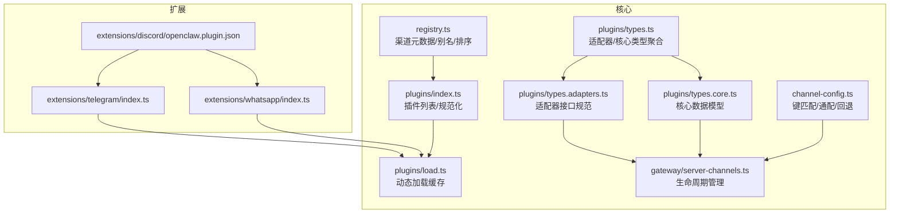
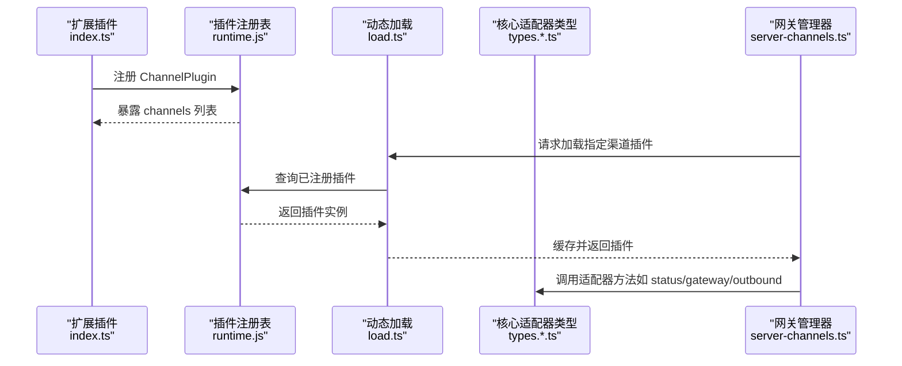
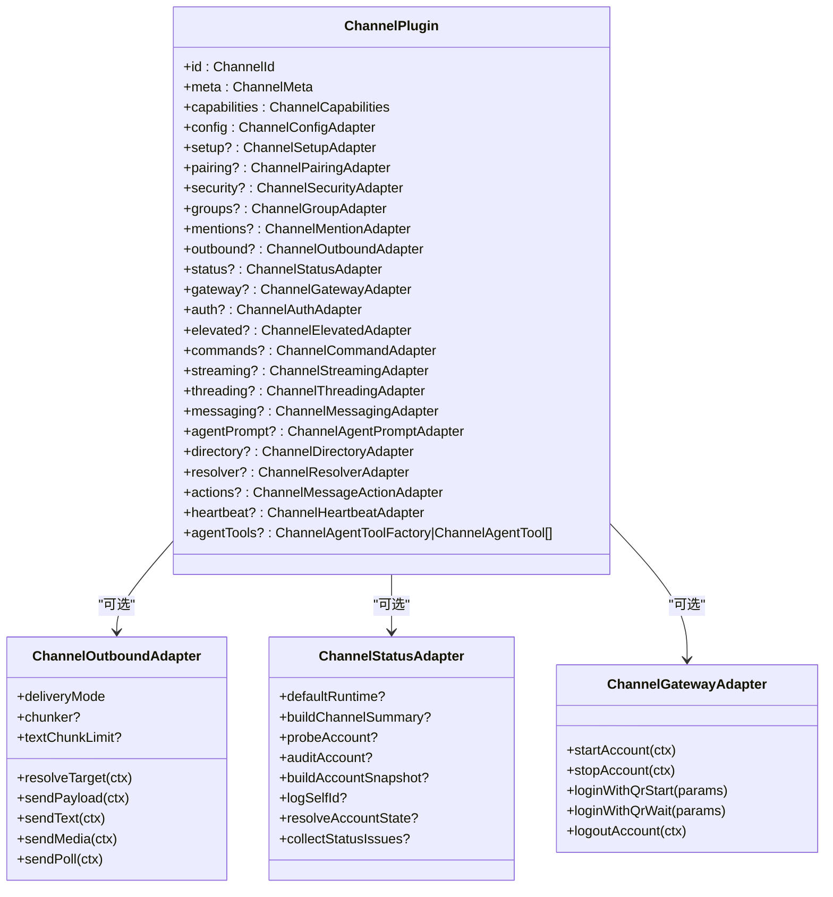
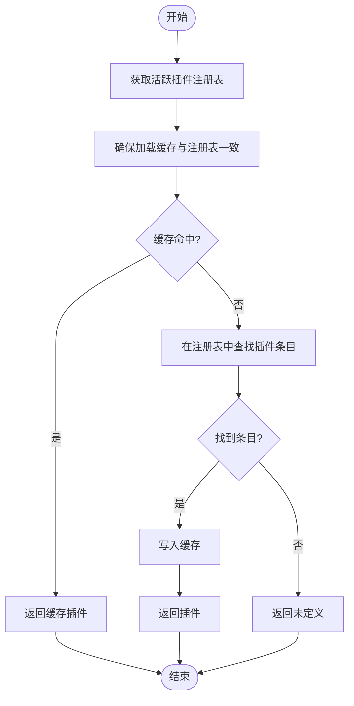
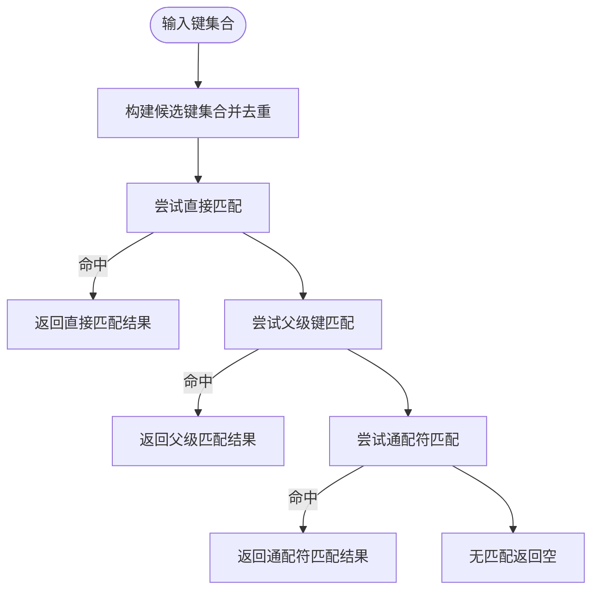
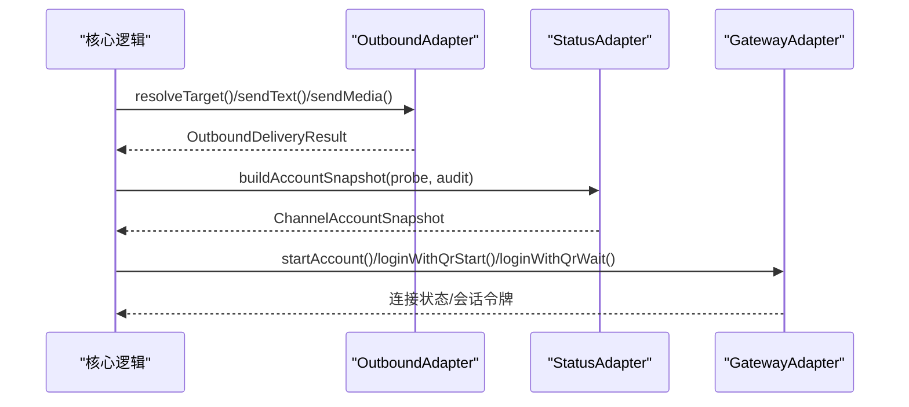
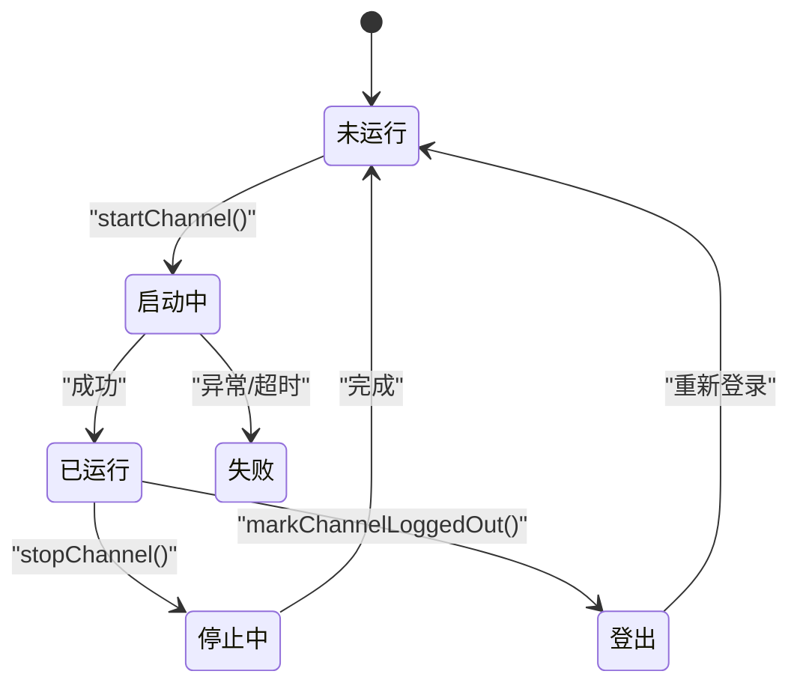
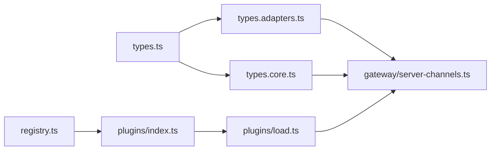

# 渠道适配器架构

<cite>
**本文引用的文件**
- [src/channels/registry.ts](file://src/channels/registry.ts)
- [src/channels/plugins/index.ts](file://src/channels/plugins/index.ts)
- [src/channels/plugins/types.ts](file://src/channels/plugins/types.ts)
- [src/channels/plugins/types.adapters.ts](file://src/channels/plugins/types.adapters.ts)
- [src/channels/plugins/types.core.ts](file://src/channels/plugins/types.core.ts)
- [src/channels/plugins/types.plugin.ts](file://src/channels/plugins/types.plugin.ts)
- [src/channels/plugins/load.ts](file://src/channels/plugins/load.ts)
- [src/channels/channel-config.ts](file://src/channels/channel-config.ts)
- [src/gateway/server-channels.ts](file://src/gateway/server-channels.ts)
- [src/channels/plugins/pairing.ts](file://src/channels/plugins/pairing.ts)
- [extensions/discord/openclaw.plugin.json](file://extensions/discord/openclaw.plugin.json)
- [extensions/telegram/index.ts](file://extensions/telegram/index.ts)
- [extensions/whatsapp/index.ts](file://extensions/whatsapp/index.ts)
</cite>

## 目录

1. [引言](#引言)
2. [项目结构](#项目结构)
3. [核心组件](#核心组件)
4. [架构总览](#架构总览)
5. [组件详解](#组件详解)
6. [依赖关系分析](#依赖关系分析)
7. [性能考量](#性能考量)
8. [故障排查指南](#故障排查指南)
9. [结论](#结论)
10. [附录](#附录)

## 引言

本文件系统性阐述 OpenClaw 的“渠道适配器”架构：统一抽象设计、注册与动态加载机制、配置与校验、适配器接口规范、消息转换与发送流程、错误处理策略，以及适配器生命周期管理。文档面向不同技术背景读者，既提供高层概览，也给出可操作的开发与测试建议。

## 项目结构

OpenClaw 将“核心渠道能力”与“扩展渠道插件”解耦：

- 核心层位于 src/channels 下，定义渠道元数据、插件类型、匹配与解析工具、生命周期管理等。
- 扩展层位于 extensions 下，每个渠道以独立插件形式存在，通过 openclaw.plugin.json 声明 ID 与配置模式，并在入口 index.ts 中注册到运行时。

图表来源

- [src/channels/registry.ts](file://src/channels/registry.ts#L1-L192)
- [src/channels/plugins/index.ts](file://src/channels/plugins/index.ts#L1-L85)
- [src/channels/plugins/types.ts](file://src/channels/plugins/types.ts#L1-L64)
- [src/channels/plugins/types.adapters.ts](file://src/channels/plugins/types.adapters.ts#L1-L313)
- [src/channels/plugins/types.core.ts](file://src/channels/plugins/types.core.ts#L1-L338)
- [src/channels/plugins/load.ts](file://src/channels/plugins/load.ts#L1-L30)
- [src/channels/channel-config.ts](file://src/channels/channel-config.ts#L1-L183)
- [src/gateway/server-channels.ts](file://src/gateway/server-channels.ts#L40-L77)
- [extensions/discord/openclaw.plugin.json](file://extensions/discord/openclaw.plugin.json#L1-L10)
- [extensions/telegram/index.ts](file://extensions/telegram/index.ts#L1-L18)
- [extensions/whatsapp/index.ts](file://extensions/whatsapp/index.ts#L1-L18)

章节来源

- [src/channels/registry.ts](file://src/channels/registry.ts#L1-L192)
- [src/channels/plugins/index.ts](file://src/channels/plugins/index.ts#L1-L85)
- [src/channels/plugins/types.ts](file://src/channels/plugins/types.ts#L1-L64)
- [src/channels/plugins/types.adapters.ts](file://src/channels/plugins/types.adapters.ts#L1-L313)
- [src/channels/plugins/types.core.ts](file://src/channels/plugins/types.core.ts#L1-L338)
- [src/channels/plugins/load.ts](file://src/channels/plugins/load.ts#L1-L30)
- [src/channels/channel-config.ts](file://src/channels/channel-config.ts#L1-L183)
- [src/gateway/server-channels.ts](file://src/gateway/server-channels.ts#L40-L77)
- [extensions/discord/openclaw.plugin.json](file://extensions/discord/openclaw.plugin.json#L1-L10)
- [extensions/telegram/index.ts](file://extensions/telegram/index.ts#L1-L18)
- [extensions/whatsapp/index.ts](file://extensions/whatsapp/index.ts#L1-L18)

## 核心组件

- 渠道元数据与规范化
  - 定义内置渠道顺序、默认渠道、元信息（文档链接、图标、别名）与标准化函数，确保输入一致。
- 插件注册与动态加载
  - 运行时从插件注册表中解析已注册渠道插件；提供带缓存的按需加载，避免重复导入重型模块。
- 适配器接口规范
  - 统一定义配置、网关、状态、安全、群组、提及、消息、目录、解析、心跳、动作等适配器契约，保证各渠道行为一致性。
- 生命周期管理
  - 网关侧集中管理渠道启动/停止、运行时快照、登出标记等，支持按账户维度控制。
- 配置匹配与校验
  - 提供键候选构建、直接/父级/通配匹配、嵌套白名单决策等工具，支撑灵活的配置路由。

章节来源

- [src/channels/registry.ts](file://src/channels/registry.ts#L1-L192)
- [src/channels/plugins/index.ts](file://src/channels/plugins/index.ts#L1-L85)
- [src/channels/plugins/types.adapters.ts](file://src/channels/plugins/types.adapters.ts#L1-L313)
- [src/channels/plugins/types.core.ts](file://src/channels/plugins/types.core.ts#L1-L338)
- [src/gateway/server-channels.ts](file://src/gateway/server-channels.ts#L40-L77)
- [src/channels/channel-config.ts](file://src/channels/channel-config.ts#L1-L183)

## 架构总览

下图展示从“渠道插件注册”到“生命周期管理”的关键交互路径，以及适配器接口如何被调用。

图表来源

- [extensions/telegram/index.ts](file://extensions/telegram/index.ts#L1-L18)
- [src/channels/plugins/load.ts](file://src/channels/plugins/load.ts#L1-L30)
- [src/channels/plugins/types.adapters.ts](file://src/channels/plugins/types.adapters.ts#L1-L313)
- [src/gateway/server-channels.ts](file://src/gateway/server-channels.ts#L40-L77)

## 组件详解

### 统一抽象与类型体系

- 类型聚合
  - 通过 types.ts 聚合适配器与核心类型，便于上层共享引用。
- 核心数据模型
  - ChannelId、ChannelMeta、ChannelAccountSnapshot、ChannelCapabilities 等，定义渠道能力边界与运行态快照。
- 适配器接口
  - 配置/网关/状态/安全/群组/提及/消息/目录/解析/心跳/动作等，覆盖渠道全生命周期能力。

图表来源

- [src/channels/plugins/types.plugin.ts](file://src/channels/plugins/types.plugin.ts#L48-L84)
- [src/channels/plugins/types.adapters.ts](file://src/channels/plugins/types.adapters.ts#L89-L147)
- [src/channels/plugins/types.adapters.ts](file://src/channels/plugins/types.adapters.ts#L194-L208)

章节来源

- [src/channels/plugins/types.ts](file://src/channels/plugins/types.ts#L1-L64)
- [src/channels/plugins/types.core.ts](file://src/channels/plugins/types.core.ts#L1-L338)
- [src/channels/plugins/types.adapters.ts](file://src/channels/plugins/types.adapters.ts#L1-L313)
- [src/channels/plugins/types.plugin.ts](file://src/channels/plugins/types.plugin.ts#L1-L85)

### 注册机制与动态加载

- 注册表
  - 由扩展插件在初始化时通过 API 注册 ChannelPlugin，核心侧通过运行时获取当前活跃注册表。
- 动态加载
  - 按需加载并缓存插件实例，避免重复导入重型模块；当注册表变更时清空缓存。
- 规范化与发现
  - 通过插件 ID 或别名在注册表中查找对应插件，支持跨内置与外部扩展渠道。

图表来源

- [src/channels/plugins/load.ts](file://src/channels/plugins/load.ts#L1-L30)

章节来源

- [src/channels/plugins/load.ts](file://src/channels/plugins/load.ts#L1-L30)
- [src/channels/plugins/index.ts](file://src/channels/plugins/index.ts#L1-L85)

### 配置管理与验证

- 键匹配与回退
  - 支持直接匹配、父级键匹配、通配符键匹配与键归一化，优先返回最精确匹配。
- 嵌套白名单决策
  - 外层配置/匹配与内层配置/匹配的组合规则，决定最终允许与否。
- 配置模式声明
  - 扩展通过 openclaw.plugin.json 声明配置 Schema，核心据此进行 UI 提示与校验。

图表来源

- [src/channels/channel-config.ts](file://src/channels/channel-config.ts#L60-L164)

章节来源

- [src/channels/channel-config.ts](file://src/channels/channel-config.ts#L1-L183)
- [extensions/discord/openclaw.plugin.json](file://extensions/discord/openclaw.plugin.json#L1-L10)

### 适配器接口规范与消息转换流程

- 发送适配器（Outbound）
  - 定义目标解析、文本/媒体/投票发送、分片策略与限制；支持直连/网关/混合投递模式。
- 状态适配器（Status）
  - 提供探针、审计、快照构建、运行时摘要生成、状态问题收集等。
- 网关适配器（Gateway）
  - 提供账户生命周期钩子（启动/停止）、二维码登录（开始/等待）、登出流程。
- 解析与目录
  - 目标解析器将用户/群标识解析为渠道内部 ID；目录适配器提供自我信息、成员列表等查询。

图表来源

- [src/channels/plugins/types.adapters.ts](file://src/channels/plugins/types.adapters.ts#L89-L147)
- [src/channels/plugins/types.adapters.ts](file://src/channels/plugins/types.adapters.ts#L194-L208)

章节来源

- [src/channels/plugins/types.adapters.ts](file://src/channels/plugins/types.adapters.ts#L1-L313)

### 错误处理策略

- 生命周期错误
  - 网关管理器维护账户运行时快照，记录连接/断开时间、错误信息与重连次数，便于诊断与恢复。
- 适配器可选方法
  - 大多数适配器方法为可选，未实现则按“不支持/降级”处理，避免强制实现负担。
- 登录/配对通知
  - 配对批准后可通过适配器回调通知渠道端，确保 UI 与状态同步。

章节来源

- [src/gateway/server-channels.ts](file://src/gateway/server-channels.ts#L40-L77)
- [src/channels/plugins/pairing.ts](file://src/channels/plugins/pairing.ts#L1-L69)

### 渠道配置验证与动态加载机制

- 配置验证
  - 通过扩展声明的 Schema 与 UI 提示，结合核心工具进行键匹配与白名单决策，减少配置歧义。
- 动态加载
  - 使用 Map 缓存已加载插件，注册表变化时清空缓存，确保加载最新版本。

章节来源

- [extensions/discord/openclaw.plugin.json](file://extensions/discord/openclaw.plugin.json#L1-L10)
- [src/channels/plugins/load.ts](file://src/channels/plugins/load.ts#L1-L30)

### 适配器生命周期管理

- 启动/停止
  - 网关管理器提供按渠道与账户维度的启动/停止接口，内部维护运行时存储与快照。
- 登出标记
  - 支持标记渠道登出状态，便于后续重新登录或清理资源。
- 默认运行时
  - 可从插件状态适配器解析默认运行时快照，作为账户初始状态。

图表来源

- [src/gateway/server-channels.ts](file://src/gateway/server-channels.ts#L40-L77)

章节来源

- [src/gateway/server-channels.ts](file://src/gateway/server-channels.ts#L40-L77)

## 依赖关系分析

- 低耦合高内聚
  - 核心类型与适配器接口集中于 plugins/types.\*.ts，扩展仅实现必要适配器，避免核心侵入。
- 动态依赖
  - 通过运行时注册表与动态加载，渠道插件可按需引入监控、登录等重型模块。
- 循环依赖规避
  - 规范化与发现逻辑集中在 registry.ts 与 plugins/index.ts，避免在重型插件中直接引用。

图表来源

- [src/channels/plugins/types.ts](file://src/channels/plugins/types.ts#L1-L64)
- [src/channels/plugins/types.adapters.ts](file://src/channels/plugins/types.adapters.ts#L1-L313)
- [src/channels/plugins/types.core.ts](file://src/channels/plugins/types.core.ts#L1-L338)
- [src/channels/registry.ts](file://src/channels/registry.ts#L1-L192)
- [src/channels/plugins/index.ts](file://src/channels/plugins/index.ts#L1-L85)
- [src/channels/plugins/load.ts](file://src/channels/plugins/load.ts#L1-L30)
- [src/gateway/server-channels.ts](file://src/gateway/server-channels.ts#L40-L77)

章节来源

- [src/channels/plugins/types.ts](file://src/channels/plugins/types.ts#L1-L64)
- [src/channels/plugins/types.adapters.ts](file://src/channels/plugins/types.adapters.ts#L1-L313)
- [src/channels/plugins/types.core.ts](file://src/channels/plugins/types.core.ts#L1-L338)
- [src/channels/registry.ts](file://src/channels/registry.ts#L1-L192)
- [src/channels/plugins/index.ts](file://src/channels/plugins/index.ts#L1-L85)
- [src/channels/plugins/load.ts](file://src/channels/plugins/load.ts#L1-L30)
- [src/gateway/server-channels.ts](file://src/gateway/server-channels.ts#L40-L77)

## 性能考量

- 加载缓存
  - 动态加载使用 Map 缓存插件实例，显著降低重复导入成本。
- 匹配算法
  - 键匹配与归一化采用集合去重与早期返回，复杂度与键数量线性相关。
- 分片与限流
  - OutboundAdapter 支持文本/Markdown 分片与长度限制，避免单次发送超限。
- 生命周期幂等
  - 网关管理器对启动/停止进行幂等处理，避免重复操作带来的资源浪费。

## 故障排查指南

- 登录/配对
  - 若配对未生效，检查配对适配器是否实现通知方法，并确认渠道 ID 规范化正确。
- 状态快照
  - 通过状态适配器构建快照，关注 lastError、lastEventAt、reconnectAttempts 等字段定位问题。
- 目标解析
  - 使用解析适配器的 targetResolver.hint 与 looksLikeId 辅助判断输入格式是否正确。
- 日志与诊断
  - 使用 ChannelLogSink 输出 info/warn/error，结合网关日志定位异常。

章节来源

- [src/channels/plugins/pairing.ts](file://src/channels/plugins/pairing.ts#L1-L69)
- [src/channels/plugins/types.adapters.ts](file://src/channels/plugins/types.adapters.ts#L108-L147)
- [src/channels/plugins/types.adapters.ts](file://src/channels/plugins/types.adapters.ts#L285-L293)

## 结论

OpenClaw 的渠道适配器架构以“统一抽象 + 动态加载 + 生命周期管理”为核心，通过严格的类型契约与可选适配器设计，实现了对多渠道的一致性支持。借助注册表与插件 Schema，既能快速集成新渠道，又能保障配置与运行时的稳定性。

## 附录

### 开发指南：新渠道集成最佳实践

- 插件骨架
  - 在扩展目录创建 openclaw.plugin.json，声明 id 与最小配置 Schema。
  - 在入口 index.ts 中注册 ChannelPlugin，设置运行时环境。
- 必备适配器
  - 至少实现 config、outbound、status、gateway（若支持）。
- 可选增强
  - directory/resolver/actions/heartbeat 等提升用户体验与自动化能力。
- 配置与校验
  - 明确键匹配策略，提供 UI 提示与敏感字段保护。
- 测试策略
  - 单元测试覆盖适配器接口契约；集成测试覆盖生命周期（启动/停止/登出）与消息发送链路；端到端测试覆盖二维码登录与配对通知。

章节来源

- [extensions/discord/openclaw.plugin.json](file://extensions/discord/openclaw.plugin.json#L1-L10)
- [extensions/telegram/index.ts](file://extensions/telegram/index.ts#L1-L18)
- [extensions/whatsapp/index.ts](file://extensions/whatsapp/index.ts#L1-L18)
- [src/channels/plugins/types.plugin.ts](file://src/channels/plugins/types.plugin.ts#L48-L84)
- [src/channels/plugins/types.adapters.ts](file://src/channels/plugins/types.adapters.ts#L89-L147)
- [src/channels/plugins/types.adapters.ts](file://src/channels/plugins/types.adapters.ts#L194-L208)
