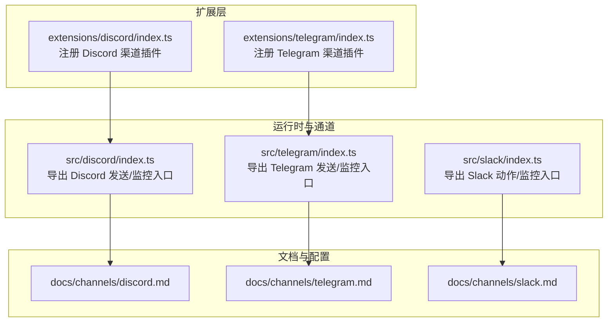
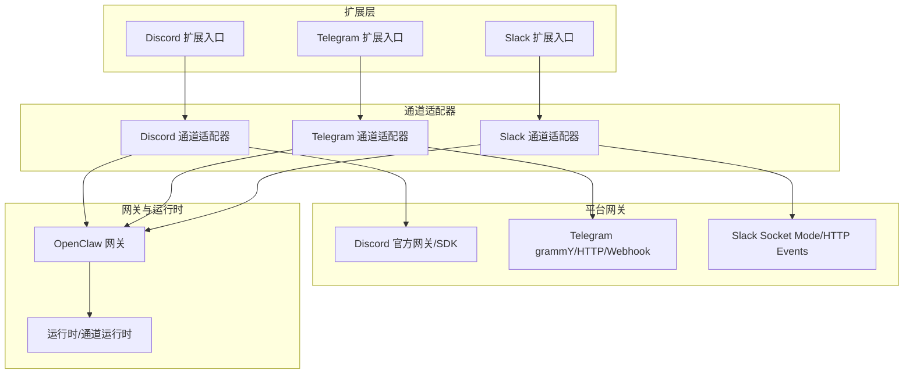
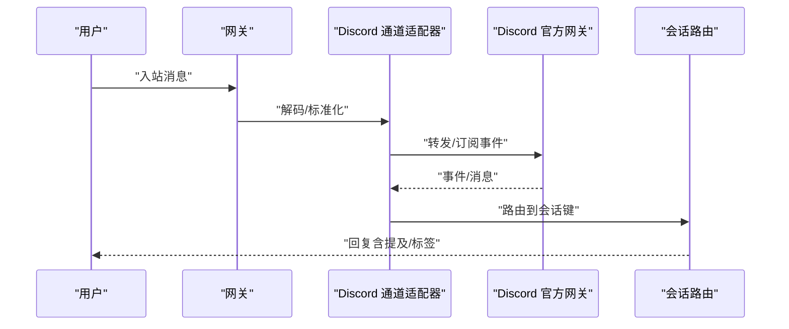
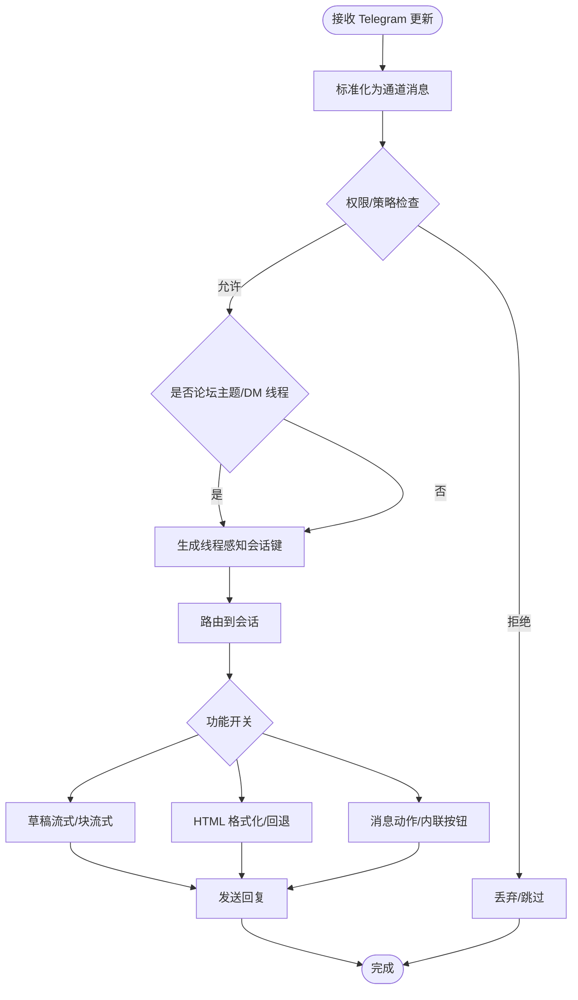
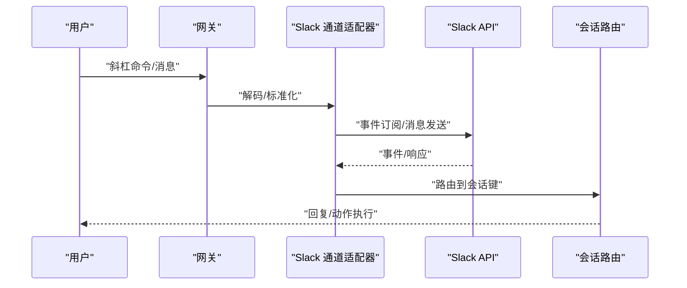
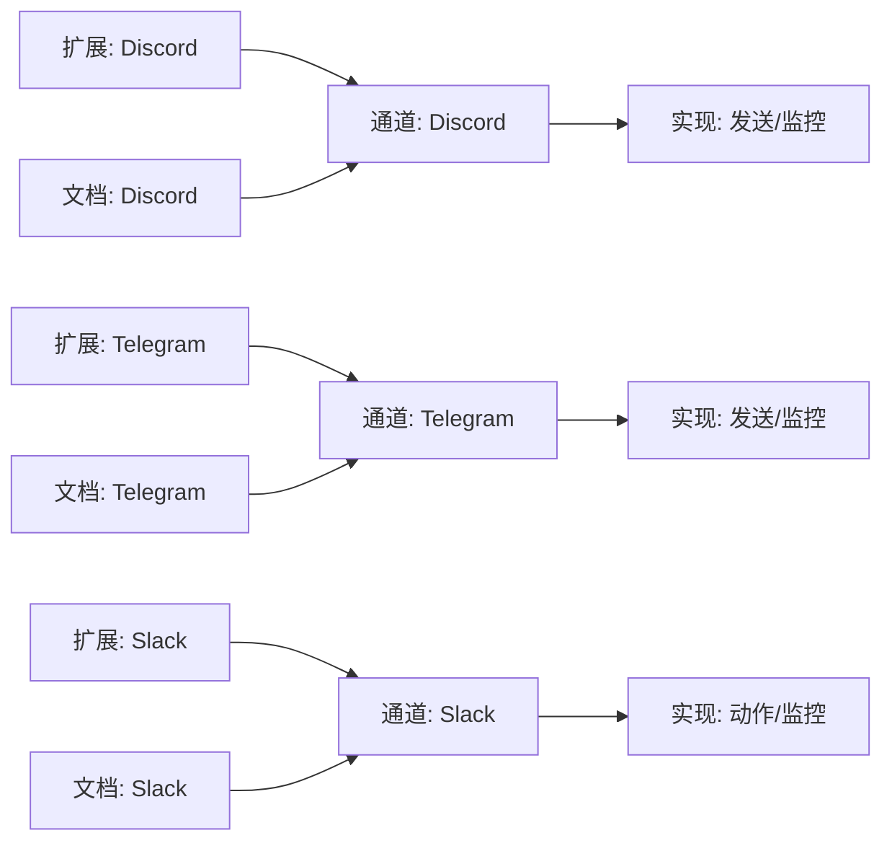

# 社交媒体渠道

<cite>
**本文引用的文件**
- [docs/channels/discord.md](file://docs/channels/discord.md)
- [docs/channels/telegram.md](file://docs/channels/telegram.md)
- [docs/channels/slack.md](file://docs/channels/slack.md)
- [extensions/discord/index.ts](file://extensions/discord/index.ts)
- [extensions/telegram/index.ts](file://extensions/telegram/index.ts)
- [src/discord/index.ts](file://src/discord/index.ts)
- [src/telegram/index.ts](file://src/telegram/index.ts)
- [src/slack/index.ts](file://src/slack/index.ts)
</cite>

## 目录

1. [简介](#简介)
2. [项目结构](#项目结构)
3. [核心组件](#核心组件)
4. [架构总览](#架构总览)
5. [详细组件分析](#详细组件分析)
6. [依赖关系分析](#依赖关系分析)
7. [性能考量](#性能考量)
8. [故障排查指南](#故障排查指南)
9. [结论](#结论)
10. [附录](#附录)

## 简介

本技术文档聚焦于 OpenClaw 的社交媒体渠道集成，重点覆盖 Discord、Telegram、Slack 等平台的集成架构与运行机制。内容涵盖：

- 平台 API 特点与权限模型
- 消息路由与会话隔离策略
- 机器人账户管理与权限处理
- 内容过滤与提及规则
- 平台特有能力（嵌入链接、表情符号、话题标签等）的处理方式
- 配置指南与最佳实践

## 项目结构

OpenClaw 将各渠道以插件形式组织，通过扩展层注册并注入到运行时，再由通道适配器对接具体平台的网关或 SDK。

图表来源

- [extensions/discord/index.ts](file://extensions/discord/index.ts#L1-L18)
- [extensions/telegram/index.ts](file://extensions/telegram/index.ts#L1-L18)
- [src/discord/index.ts](file://src/discord/index.ts#L1-L3)
- [src/telegram/index.ts](file://src/telegram/index.ts#L1-L5)
- [src/slack/index.ts](file://src/slack/index.ts#L1-L26)
- [docs/channels/discord.md](file://docs/channels/discord.md#L1-L485)
- [docs/channels/telegram.md](file://docs/channels/telegram.md#L1-L697)
- [docs/channels/slack.md](file://docs/channels/slack.md#L1-L455)

章节来源

- [extensions/discord/index.ts](file://extensions/discord/index.ts#L1-L18)
- [extensions/telegram/index.ts](file://extensions/telegram/index.ts#L1-L18)
- [src/discord/index.ts](file://src/discord/index.ts#L1-L3)
- [src/telegram/index.ts](file://src/telegram/index.ts#L1-L5)
- [src/slack/index.ts](file://src/slack/index.ts#L1-L26)
- [docs/channels/discord.md](file://docs/channels/discord.md#L1-L485)
- [docs/channels/telegram.md](file://docs/channels/telegram.md#L1-L697)
- [docs/channels/slack.md](file://docs/channels/slack.md#L1-L455)

## 核心组件

- 插件注册与运行时注入：各渠道在扩展入口中注册插件，并将运行时注入通道实现，确保配置解析、事件监听与消息发送链路贯通。
- 通道适配器：通道适配器负责将平台特定的消息格式、权限与事件映射为统一的 OpenClaw 通道消息模型，实现跨平台一致的路由与会话管理。
- 网关所有权：文档明确“网关拥有连接”，即通道生命周期与认证由网关托管，确保一致性与可观测性。
- 权限与策略：各平台均支持基于策略（开放/白名单/禁用）与允许列表（用户/角色/频道）的访问控制；提及规则与线程行为可按群组/频道细化。

章节来源

- [docs/channels/discord.md](file://docs/channels/discord.md#L81-L172)
- [docs/channels/telegram.md](file://docs/channels/telegram.md#L104-L206)
- [docs/channels/slack.md](file://docs/channels/slack.md#L135-L194)

## 架构总览

下图展示 OpenClaw 在社交媒体渠道中的总体交互：扩展层注册渠道插件，通道适配器对接平台网关，网关统一调度消息、权限与事件，最终进入会话路由与工具执行。

图表来源

- [extensions/discord/index.ts](file://extensions/discord/index.ts#L1-L18)
- [extensions/telegram/index.ts](file://extensions/telegram/index.ts#L1-L18)
- [src/discord/index.ts](file://src/discord/index.ts#L1-L3)
- [src/telegram/index.ts](file://src/telegram/index.ts#L1-L5)
- [src/slack/index.ts](file://src/slack/index.ts#L1-L26)
- [docs/channels/discord.md](file://docs/channels/discord.md#L10-L22)
- [docs/channels/telegram.md](file://docs/channels/telegram.md#L10-L22)
- [docs/channels/slack.md](file://docs/channels/slack.md#L10-L22)

## 详细组件分析

### Discord 组件分析

- 运行模型与路由
  - 网关拥有连接，回复路由确定：入站回复回传至 Discord。
  - DM 默认使用主会话；公会频道使用独立会话键；群组 DM 默认忽略。
  - 原生斜杠命令在隔离会话中运行，同时携带目标会话键。
- 权限与策略
  - DM 政策：配对、白名单、开放、禁用；未知用户默认阻断或提示配对。
  - 公会策略：开放/白名单/禁用，默认安全基线为白名单。
  - 提及规则：默认公会消息需被提及；可通过配置与模式匹配控制。
- 功能特性
  - 回复标签与原生回复：支持回复标签与历史消息 ID 上下文。
  - 历史与上下文：可配置历史窗口；主题注入为非可信上下文。
  - 反应通知：可配置反应事件系统事件注入。
  - PluralKit 支持：可启用映射代理身份，失败时按配置处理。
  - 执行审批：支持按钮式 DM 执行审批。
  - 动作门控：默认启用消息/反应/线程/贴纸等，角色/审核/状态默认关闭。
- 配置要点
  - 必须启用“消息内容意图”和“服务器成员意图”（建议）。
  - 支持账户感知的令牌解析与环境回退。
  - 支持配置写入、分片与重试、媒体大小限制等。

图表来源

- [docs/channels/discord.md](file://docs/channels/discord.md#L81-L172)
- [src/discord/index.ts](file://src/discord/index.ts#L1-L3)

章节来源

- [docs/channels/discord.md](file://docs/channels/discord.md#L10-L485)
- [src/discord/index.ts](file://src/discord/index.ts#L1-L3)

### Telegram 组件分析

- 运行模型与路由
  - 网关拥有连接；路由确定：入站回复回传至 Telegram。
  - 群组会话按群组 ID 隔离；论坛主题附加主题标识；DM 可携带线程 ID 并保持线程感知会话键。
  - 长轮询使用 grammY 运行器，整体并发受全局并发限制控制。
- 权限与策略
  - DM 政策：配对、白名单、开放、禁用；支持用户名与数字 ID。
  - 群组策略：两套独立控制（允许哪些群、群内允许哪些发送者）；默认群组发送者白名单。
  - 提及规则：默认要求提及；支持会话级激活切换与持久化配置。
- 功能特性
  - 草稿流式：支持草稿气泡流式输出（DM 且具备线程 ID 且启用主题）。
  - 格式化与 HTML 回退：优先 HTML，失败则回退纯文本；链接预览默认开启。
  - 原生命令与自定义命令菜单：启动时注册；冲突处理与权限控制。
  - 内联按钮：支持作用域控制（关闭/仅 DM/群/全部/白名单）。
  - 消息动作：发送、反应、删除、编辑、贴纸搜索等；动作门控可细粒度控制。
  - 回复标签：支持显式回复标签与模式控制。
  - 论坛主题与线程：主题会话键继承群组设置；特殊主题（通用）行为差异。
  - 音频/视频/贴纸：语音笔记与视频笔记区分；贴纸缓存与描述。
  - 反应通知：可配置通知级别与范围。
  - 配置写入：支持群迁移与命令触发的配置写入。
  - 长轮询与 Webhook：默认长轮询；可选 Webhook（需签名密钥与路径）。
- 配置要点
  - 令牌解析顺序与环境回退；隐私模式与管理员权限影响可见性。
  - 文本分片、块模式、媒体上限、超时与重试、历史窗口等。

图表来源

- [docs/channels/telegram.md](file://docs/channels/telegram.md#L104-L206)
- [docs/channels/telegram.md](file://docs/channels/telegram.md#L218-L624)

章节来源

- [docs/channels/telegram.md](file://docs/channels/telegram.md#L1-L697)
- [src/telegram/index.ts](file://src/telegram/index.ts#L1-L5)

### Slack 组件分析

- 运行模型与路由
  - 网关拥有连接；DM 作为 direct，群组作为 group，频道作为 channel。
  - DM 默认合并到主会话；频道会话键独立；线程回复可创建线程会话后缀。
  - 线程历史获取与继承策略可配置。
- 权限与策略
  - DM 政策：配对、白名单、开放、禁用；支持群组 DM 开关与白名单。
  - 频道策略：开放/白名单/禁用；名称与 ID 解析在令牌授权范围内进行。
  - 提及规则：默认提及；支持正则与隐式回复行为。
- 功能特性
  - 斜杠命令：默认不自动启用；可启用原生处理或单命令模式。
  - 媒体与分片：附件下载与上传；文本分片与块模式；媒体上限。
  - 动作门控：消息、反应、置顶、成员信息、表情列表等默认启用。
  - 事件映射：编辑/删除/广播/反应/成员变更/频道重命名/置顶变更等映射为系统事件。
- 配置要点
  - Socket Mode 与 HTTP Events API 两种模式；令牌模型与环境回退。
  - 用户令牌读写行为与只读策略；多账户 HTTP Webhook 路径唯一性。

图表来源

- [docs/channels/slack.md](file://docs/channels/slack.md#L135-L194)
- [src/slack/index.ts](file://src/slack/index.ts#L1-L26)

章节来源

- [docs/channels/slack.md](file://docs/channels/slack.md#L1-L455)
- [src/slack/index.ts](file://src/slack/index.ts#L1-L26)

## 依赖关系分析

- 插件注册依赖：扩展入口负责注册通道插件并将运行时注入，确保通道适配器可用。
- 通道适配器依赖：通道适配器导出发送、监控与探测等能力，供网关统一调度。
- 文档与实现对齐：各平台文档详细列出配置项、权限模型与行为边界，便于对照实现。

图表来源

- [extensions/discord/index.ts](file://extensions/discord/index.ts#L1-L18)
- [extensions/telegram/index.ts](file://extensions/telegram/index.ts#L1-L18)
- [src/discord/index.ts](file://src/discord/index.ts#L1-L3)
- [src/telegram/index.ts](file://src/telegram/index.ts#L1-L5)
- [src/slack/index.ts](file://src/slack/index.ts#L1-L26)
- [docs/channels/discord.md](file://docs/channels/discord.md#L1-L485)
- [docs/channels/telegram.md](file://docs/channels/telegram.md#L1-L697)
- [docs/channels/slack.md](file://docs/channels/slack.md#L1-L455)

章节来源

- [extensions/discord/index.ts](file://extensions/discord/index.ts#L1-L18)
- [extensions/telegram/index.ts](file://extensions/telegram/index.ts#L1-L18)
- [src/discord/index.ts](file://src/discord/index.ts#L1-L3)
- [src/telegram/index.ts](file://src/telegram/index.ts#L1-L5)
- [src/slack/index.ts](file://src/slack/index.ts#L1-L26)

## 性能考量

- 并发与序列化
  - Telegram 长轮询采用 per-chat/per-thread 序列化，整体并发受全局并发限制控制，避免过度竞争。
- 分片与重试
  - 各平台均支持文本分片与块模式，结合媒体上限与重试策略，平衡吞吐与稳定性。
- 事件映射与系统事件
  - Slack 等平台将编辑、删除、反应、成员变更等映射为系统事件，减少重复拉取，提升可观测性。
- 网络与超时
  - Telegram 支持超时覆盖与网络族选择；Slack 支持用户令牌读操作与只读策略，降低写操作开销。

章节来源

- [docs/channels/telegram.md](file://docs/channels/telegram.md#L214-L216)
- [docs/channels/telegram.md](file://docs/channels/telegram.md#L605-L623)
- [docs/channels/slack.md](file://docs/channels/slack.md#L236-L262)

## 故障排查指南

- Discord
  - 未启用意图或看不到公会消息：启用“消息内容意图”和“服务器成员意图”，重启网关。
  - 公会消息被意外阻止：核对 groupPolicy、公会白名单、提及配置与允许列表。
  - 权限审计不匹配：探针检查仅对数字 ID 生效；使用数字 ID 更易验证。
  - DM 与配对问题：检查 DM 开关、策略与配对审批。
  - Bot 间循环：默认忽略机器人消息；若允许机器人，需严格提及与白名单规则。
- Telegram
  - 非提及群组消息无响应：若 requireMention=false，需关闭隐私模式并重新添加机器人。
  - 群组消息完全不可见：确认群组已列入配置或通配符，核对成员身份与日志。
  - 命令部分生效或无效：核对发送者授权（配对/允许列表），命令授权仍生效。
  - 轮询或网络不稳定：检查 DNS 解析与 IPv6 出口，验证主机网络环境。
- Slack
  - 频道无回复：依次检查 groupPolicy、频道白名单、提及与用户允许列表。
  - DM 被忽略：检查 DM 开关、策略与配对/允许列表。
  - Socket 模式无法连接：校验应用令牌与 Socket Mode 开启状态。
  - HTTP 模式未接收事件：校验签名密钥、Webhook 路径与请求 URL 设置，确保每账户路径唯一。
  - 原生/斜杠命令未触发：确认是否启用原生命令模式并已在 Slack 注册对应斜杠命令。

章节来源

- [docs/channels/discord.md](file://docs/channels/discord.md#L396-L454)
- [docs/channels/telegram.md](file://docs/channels/telegram.md#L626-L668)
- [docs/channels/slack.md](file://docs/channels/slack.md#L374-L431)

## 结论

OpenClaw 的社交媒体渠道集成以插件化与通道适配器为核心，结合平台特定的网关与 SDK，实现了统一的权限模型、消息路由与功能门控。通过详尽的配置参考与故障排查指南，可在不同平台间快速落地并稳定运行。建议在生产环境中遵循最小权限原则、启用必要的意图/权限与事件订阅，并针对平台特性（提及、线程、草稿流式、反应通知等）制定清晰的策略与流程。

## 附录

- 配置参考指针（按平台）
  - Discord：启动/鉴权、策略、命令、回复/历史、投递、媒体/重试、动作、特性、执行审批等。
  - Telegram：启动/鉴权、访问控制、命令/菜单、线程/回复、流式、格式化/投递、媒体/网络、Webhook、动作/能力、反应、写入/历史等。
  - Slack：模式/鉴权、DM 访问、频道访问、线程/历史、投递、媒体/分片、动作门控、事件与运行行为等。

章节来源

- [docs/channels/discord.md](file://docs/channels/discord.md#L456-L472)
- [docs/channels/telegram.md](file://docs/channels/telegram.md#L672-L691)
- [docs/channels/slack.md](file://docs/channels/slack.md#L433-L447)
