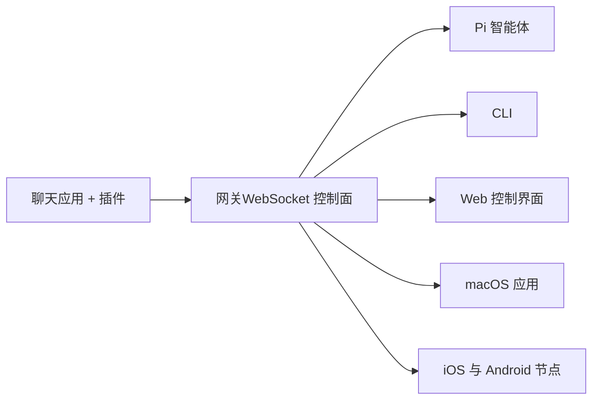
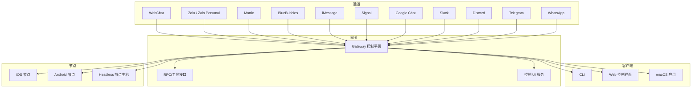
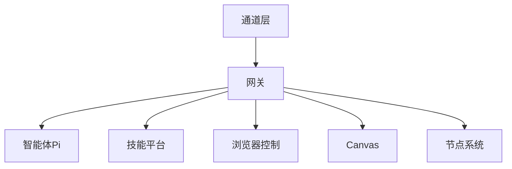

# 核心功能特性

<cite>
**本文引用的文件**
- [README.md](file://README.md)
- [docs/index.md](file://docs/index.md)
- [docs/start/openclaw.md](file://docs/start/openclaw.md)
- [docs/concepts/architecture.md](file://docs/concepts/architecture.md)
- [docs/gateway/index.md](file://docs/gateway/index.md)
- [docs/concepts/features.md](file://docs/concepts/features.md)
- [docs/nodes/index.md](file://docs/nodes/index.md)
- [docs/tools/skills.md](file://docs/tools/skills.md)
- [docs/web/control-ui.md](file://docs/web/control-ui.md)
- [docs/platforms/mac/canvas.md](file://docs/platforms/mac/canvas.md)
- [docs/nodes/audio.md](file://docs/nodes/audio.md)
- [docs/nodes/talk.md](file://docs/nodes/talk.md)
- [docs/nodes/voicewake.md](file://docs/nodes/voicewake.md)
- [docs/tools/browser.md](file://docs/tools/browser.md)
</cite>

## 目录

1. [简介](#简介)
2. [项目结构](#项目结构)
3. [核心组件](#核心组件)
4. [架构总览](#架构总览)
5. [详细组件分析](#详细组件分析)
6. [依赖关系分析](#依赖关系分析)
7. [性能考量](#性能考量)
8. [故障排查指南](#故障排查指南)
9. [结论](#结论)
10. [附录](#附录)

## 简介

OpenClaw 是一个“自托管”的个人 AI 助手网关，运行在你的设备上，连接 WhatsApp、Telegram、Discord、iMessage 等聊天应用与 Pi 编码智能体。它以单一网关作为会话、路由与事件的控制平面，支持多通道消息集成、多代理路由、语音唤醒与 Talk 模式、Live Canvas 可视化工作区、浏览器控制、设备节点系统、技能平台等能力，帮助你在本地获得始终在线、快速且可控的个人助理体验。

- 本地优先：在你的硬件上运行，遵循你的规则
- 多通道：一个网关同时服务多个即时通讯平台
- 代理原生：面向编码智能体，具备工具调用、会话、记忆与多代理路由
- 开源：MIT 许可证，社区驱动

## 项目结构

OpenClaw 的核心由“网关（Gateway）+ 控制平面 + 客户端/节点 + 插件/技能”构成。下图展示了从聊天应用到智能体的端到端路径，以及网关作为控制平面的角色。

图表来源

- [docs/index.md](file://docs/index.md#L59-L71)

章节来源

- [README.md](file://README.md#L21-L26)
- [docs/index.md](file://docs/index.md#L59-L71)

## 核心组件

- 网关（Gateway）：单一长连接的控制平面，负责会话、路由、通道连接与事件分发；提供 WebSocket 控制/RPC、HTTP 工具接口与控制 UI。
- 客户端与节点：通过同一 WebSocket 服务器连接，客户端（macOS 应用、CLI、Web UI、自动化）与节点（macOS/iOS/Android/headless）共享协议，节点以“设备身份”进行配对与授权。
- 通道（Channels）：支持 WhatsApp、Telegram、Discord、Slack、Google Chat、Signal、iMessage、BlueBubbles、Matrix、Zalo、Zalo Personal、WebChat 等，插件可扩展更多平台。
- 多代理路由：按工作区或发送者隔离会话，支持群组激活与提及门控。
- 媒体与语音：支持图片/音频/文档收发，语音转写与命令解析；Talk 模式支持持续对话与流式播放。
- Live Canvas：基于 WKWebView 的可视化工作区，支持 A2UI 推送与快照。
- 浏览器控制：专用 Chrome/Chromium 配置文件，支持动作、截图、PDF、状态设置等。
- 设备节点系统：Canvas、相机拍照/视频录制、屏幕录制、位置获取、系统命令执行等。
- 技能平台：基于 AgentSkills 的技能目录，支持捆绑、托管与工作区覆盖，按环境/配置/二进制存在性进行加载过滤。

章节来源

- [docs/concepts/architecture.md](file://docs/concepts/architecture.md#L12-L23)
- [docs/concepts/features.md](file://docs/concepts/features.md#L8-L29)
- [docs/gateway/index.md](file://docs/gateway/index.md#L62-L71)

## 架构总览

OpenClaw 的架构以“网关为中心”的单控制平面为核心，所有消息表面（通道）与工具调用都经由网关统一编排。客户端与节点通过 WebSocket 连接，网关负责鉴权、配对、事件广播与请求响应。

图表来源

- [docs/concepts/architecture.md](file://docs/concepts/architecture.md#L14-L22)
- [docs/gateway/index.md](file://docs/gateway/index.md#L62-L71)

章节来源

- [docs/concepts/architecture.md](file://docs/concepts/architecture.md#L12-L23)
- [docs/gateway/index.md](file://docs/gateway/index.md#L62-L71)

## 详细组件分析

### 本地优先的网关架构

- 单一网关进程常驻，统一维护各提供商连接与会话生命周期。
- 默认绑定 loopback，支持通过 Tailscale Serve/Funnel 或 SSH 隧道安全暴露。
- 支持热重载（hot/hybrid/restart），配置变更时自动应用或重启。
- 提供健康检查、诊断与守护进程管理（launchd/systemd）。

使用示例

- 启动网关：openclaw gateway --port 18789
- 查看健康：openclaw gateway status
- 远程访问：通过 SSH 隧道或 Tailscale Serve

章节来源

- [docs/gateway/index.md](file://docs/gateway/index.md#L21-L56)
- [docs/gateway/index.md](file://docs/gateway/index.md#L118-L162)
- [docs/concepts/architecture.md](file://docs/concepts/architecture.md#L111-L122)

### 多渠道消息集成（20+ 平台）

- 内置通道：WhatsApp（Baileys）、Telegram（grammY）、Discord（discord.js）、Slack（Bolt）、Google Chat（Chat API）、Signal（signal-cli）、iMessage（imsg）、BlueBubbles（iMessage，推荐）、Matrix、Zalo、Zalo Personal、WebChat。
- 插件扩展：Mattermost 等第三方通道可通过扩展包接入。
- 群组路由：支持提及门控、回复标签、分片与路由规则。

使用示例

- 登录并配对 WhatsApp：openclaw channels login
- 设置允许列表与群组策略：在配置中设置 channels.whatsapp.allowFrom 与 groups 规则

章节来源

- [README.md](file://README.md#L124-L149)
- [docs/start/openclaw.md](file://docs/start/openclaw.md#L58-L66)

### 多代理路由系统

- 会话模型：主会话 main 用于直接聊天，群组隔离；支持按工作区/发送者隔离。
- 群组激活：通过 mentionPatterns 与 requireMention 实现“提及才激活”。
- 心跳与主动模式：可配置心跳周期与提示词，保障长期会话上下文。

使用示例

- 配置群组提及规则：routing.groupChat.mentionPatterns
- 设置会话作用域：session.scope 为 per-sender

章节来源

- [docs/start/openclaw.md](file://docs/start/openclaw.md#L105-L149)
- [docs/concepts/architecture.md](file://docs/concepts/architecture.md#L129-L134)

### 语音唤醒与 Talk 模式

- 全局唤醒词：网关集中管理唤醒词列表，跨节点同步；各设备仍保留本地启用开关。
- Talk 模式：连续语音对话循环（听→思考→说），支持中断、流式播放与语音参数控制。
- 配置项：voiceId、modelId、outputFormat、apiKey、interruptOnSpeech 等。

使用示例

- 配置 Talk 模式参数：在 ~/.openclaw/openclaw.json 中设置 talk.\*
- 在 macOS 菜单栏启用 Talk 模式并调整语音参数

章节来源

- [docs/nodes/voicewake.md](file://docs/nodes/voicewake.md#L9-L48)
- [docs/nodes/talk.md](file://docs/nodes/talk.md#L9-L91)

### Live Canvas 可视化工作区

- Canvas：基于 WKWebView 的可视化工作区，支持本地文件与外部 URL 导航、JavaScript 评估、快照捕获。
- A2UI：网关 Canvas Host 渲染 A2UI v0.8 消息，支持 surfaceUpdate、dataModelUpdate 等推送。
- 节点控制：通过 node.invoke 执行 canvas.present/navigate/eval/snapshot 等命令。

使用示例

- 在节点上展示 Canvas：openclaw nodes canvas present --node <id>
- 推送 A2UI 数据：openclaw nodes canvas a2ui push --node <id> --text "Hello"

章节来源

- [docs/platforms/mac/canvas.md](file://docs/platforms/mac/canvas.md#L10-L126)
- [docs/nodes/index.md](file://docs/nodes/index.md#L180-L191)

### 浏览器控制

- 专用浏览器：openclaw 独立配置文件，隔离于个人浏览器；支持 tab 列表、打开/聚焦/关闭、快照/截图/PDF、动作与等待条件。
- 配置：默认 profile、颜色、headless/noSandbox、可选远程 CDP、多配置文件。
- 安全：loopback 仅、需网关鉴权；远程 CDP 使用令牌或 Basic Auth。

使用示例

- 启动并打开页面：openclaw browser --browser-profile openclaw start && openclaw browser open https://example.com
- 截图与快照：openclaw browser screenshot && openclaw browser snapshot

章节来源

- [docs/tools/browser.md](file://docs/tools/browser.md#L10-L583)

### 设备节点系统

- 节点角色：与客户端共享同一 WebSocket 服务器，声明 role: node，并携带设备身份与权限映射。
- 能力清单：canvas._、camera._、screen.record、location.get、system.run/notify 等。
- 远程节点主机：可在另一台机器上运行节点主机，网关通过 node.invoke 转发执行；支持 exec 审批与白名单。

使用示例

- 节点状态与描述：openclaw nodes status && openclaw nodes describe --node <id>
- 屏幕录制：openclaw nodes screen record --node <id> --duration 10s

章节来源

- [docs/nodes/index.md](file://docs/nodes/index.md#L10-L144)
- [docs/nodes/index.md](file://docs/nodes/index.md#L145-L343)

### 技能平台

- 目录层次：捆绑技能（安装自带）→ 托管/本地技能（~/.openclaw/skills）→ 工作区技能（<workspace>/skills）
- 加载过滤：基于 metadata.openclaw 的 requires（二进制、环境变量、配置）、os、install 等规则动态筛选。
- 环境注入：在一次智能体运行期间临时注入 env/apiKey，结束后恢复。
- ClawHub：公共技能注册中心，支持安装、更新与备份。

使用示例

- 启用/禁用技能：在 skills.entries 下配置 enabled
- 注入 API Key：skills.entries.<skill>.apiKey 或 env

章节来源

- [docs/tools/skills.md](file://docs/tools/skills.md#L9-L301)

### 媒体与语音处理

- 音频转写：支持本地 CLI（sherpa-onnx/whisper 等）与多家提供商（OpenAI/Groq/Deepgram/Google），自动检测与回退。
- 群组提及检测：对无文本的语音消息进行预转写后再做 mention 检测，避免误判。
- 限制与配置：maxBytes、maxChars、scope 规则、多附件处理等。

使用示例

- 配置 OpenAI + Whisper CLI 回退：tools.media.audio.models
- 群组仅允许直聊：tools.media.audio.scope.rules

章节来源

- [docs/nodes/audio.md](file://docs/nodes/audio.md#L8-L134)

### 控制 UI 与远程访问

- 控制 UI：由网关内置的 Vite + Lit SPA 提供，直接通过 WebSocket 与网关交互，支持聊天、通道状态、会话、Cron、技能、节点、配置、日志、更新等。
- 设备配对：首次连接需要设备配对批准；支持 Tailscale Serve（HTTPS）与 SSH 隧道。
- 安全：非安全上下文（HTTP）默认阻断设备身份认证；建议使用 HTTPS 或本机访问。

使用示例

- 本地打开：http://127.0.0.1:18789/
- Serve 暴露：openclaw gateway --tailscale serve

章节来源

- [docs/web/control-ui.md](file://docs/web/control-ui.md#L9-L224)

## 依赖关系分析

- 组件耦合
  - 网关是所有通道与工具的唯一入口，客户端与节点均依赖其鉴权与事件广播。
  - 技能平台与媒体处理模块通过工具接口与智能体交互，受会话与沙箱策略影响。
  - 浏览器控制与 Canvas 依赖节点能力或本地浏览器实例，受安全策略与远程 CDP 限制。
- 外部依赖
  - 通道提供商（如 Telegram/Slack/Discord）与本地系统能力（macOS/iOS/Android）。
  - 第三方服务（ElevenLabs、Deepgram、OpenAI 等）用于语音与转写。

图表来源

- [docs/concepts/architecture.md](file://docs/concepts/architecture.md#L12-L23)
- [docs/tools/skills.md](file://docs/tools/skills.md#L13-L27)
- [docs/tools/browser.md](file://docs/tools/browser.md#L12-L34)

章节来源

- [docs/concepts/architecture.md](file://docs/concepts/architecture.md#L12-L23)
- [docs/tools/skills.md](file://docs/tools/skills.md#L13-L27)
- [docs/tools/browser.md](file://docs/tools/browser.md#L12-L34)

## 性能考量

- 会话与记忆：按发送者/工作区隔离会话，减少上下文膨胀；支持 compact 与每日重置策略。
- 工具调用：浏览器控制与 Canvas 操作采用稳定接口，避免脆弱选择器；快照与截图按需生成，降低带宽与延迟。
- 语音与转写：本地 CLI 优先，必要时回退至提供商；对超大音频进行大小限制与回退链路。
- 远程访问：Tailscale Serve/Funnel 与 SSH 隧道减少公网暴露风险，同时保持低延迟。

## 故障排查指南

- 网关启动与健康
  - 启动失败：检查端口占用、认证配置与绑定模式；使用 openclaw gateway status 与 openclaw logs --follow 定位问题。
  - 多实例冲突：确保唯一端口与配置/状态目录。
- 通道连通性
  - 使用 openclaw channels status --probe 检查通道就绪状态；针对 Telegram/Slack/Discord 进行深度探测。
- 控制 UI 与远程访问
  - 非安全上下文（HTTP）可能阻止设备身份认证；建议 HTTPS 或本机访问。
  - Serve/Funnel 需要正确的身份头与密码/令牌策略。
- 节点与浏览器
  - 节点未配对：通过 openclaw devices list/approve 处理；确认节点主机上的 exec 审批。
  - 浏览器远程 CDP：校验 URL/令牌，优先短时效令牌；避免明文写入配置。

章节来源

- [docs/gateway/index.md](file://docs/gateway/index.md#L228-L238)
- [docs/web/control-ui.md](file://docs/web/control-ui.md#L131-L158)
- [docs/nodes/index.md](file://docs/nodes/index.md#L24-L44)
- [docs/tools/browser.md](file://docs/tools/browser.md#L190-L203)

## 结论

OpenClaw 通过“本地优先的网关架构”，将多通道消息、多代理路由、语音与视觉交互、浏览器控制与设备节点系统整合为统一的控制平面，既保证了数据主权与安全边界，又提供了强大的自动化与可视化能力。借助技能平台与控制 UI，用户可以按需扩展与运维，构建高度定制化的个人助理生态。

## 附录

- 快速开始
  - 安装与引导：openclaw onboard --install-daemon
  - 启动网关：openclaw gateway --port 18789
  - 发送消息：openclaw message send --to +1234567890 --message "Hello from OpenClaw"
  - 与助手对话：openclaw agent --message "Ship checklist" --thinking high
- 安全建议
  - 默认 DM 策略：dmPolicy="pairing"，未知发件人需配对批准
  - 分组策略：channels.<platform>.groups 中包含 "\*" 以允许全部群组
  - 心跳与信任：初始阶段将 agents.defaults.heartbeat.every 设为 0m，待信任后再开启

章节来源

- [README.md](file://README.md#L58-L76)
- [README.md](file://README.md#L113-L119)
- [docs/start/openclaw.md](file://docs/start/openclaw.md#L21-L26)
