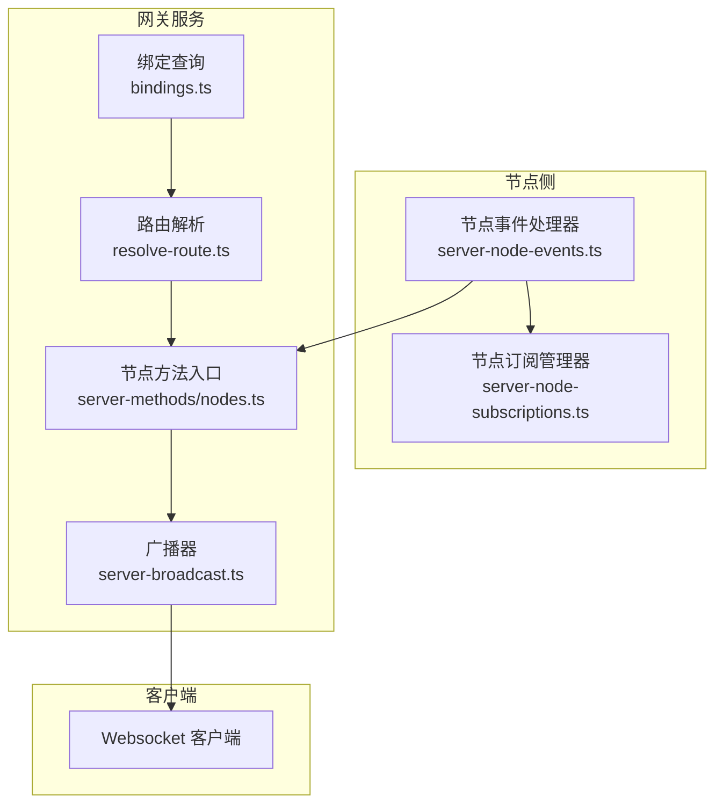
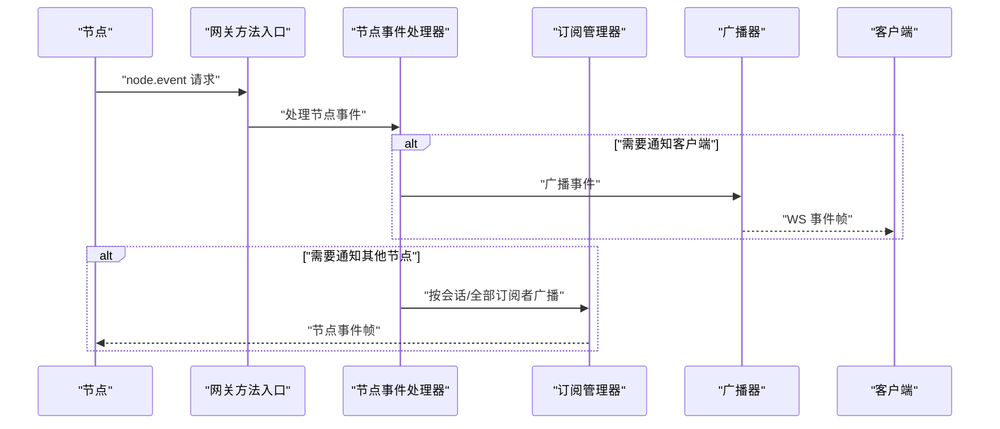
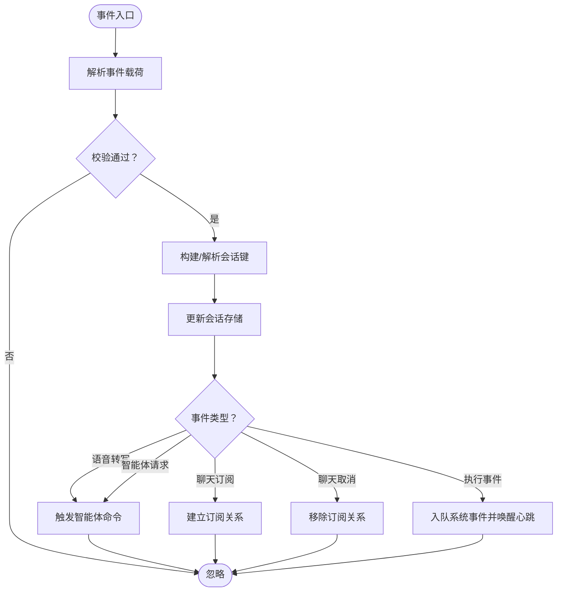
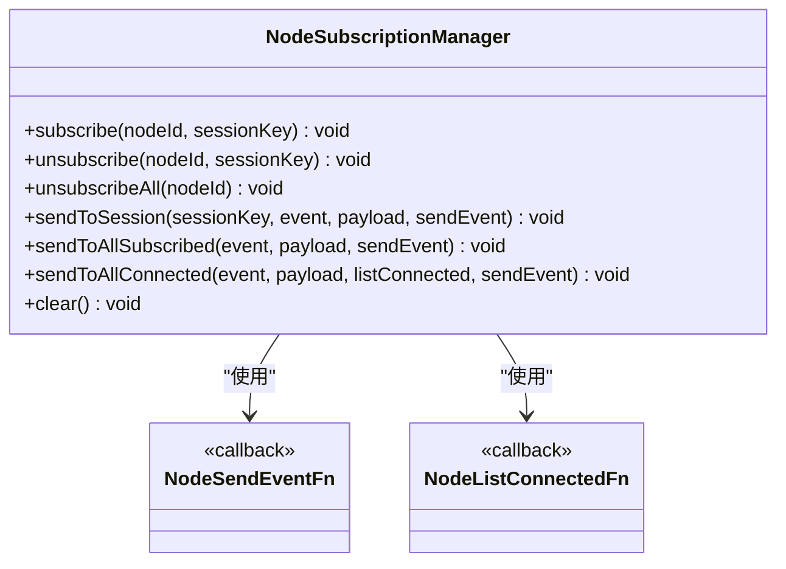
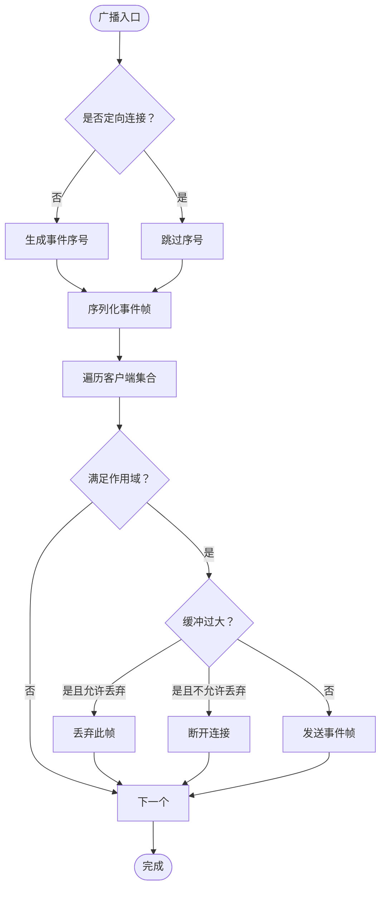
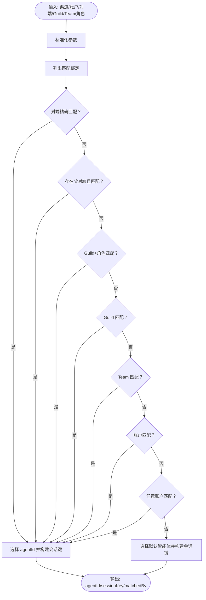
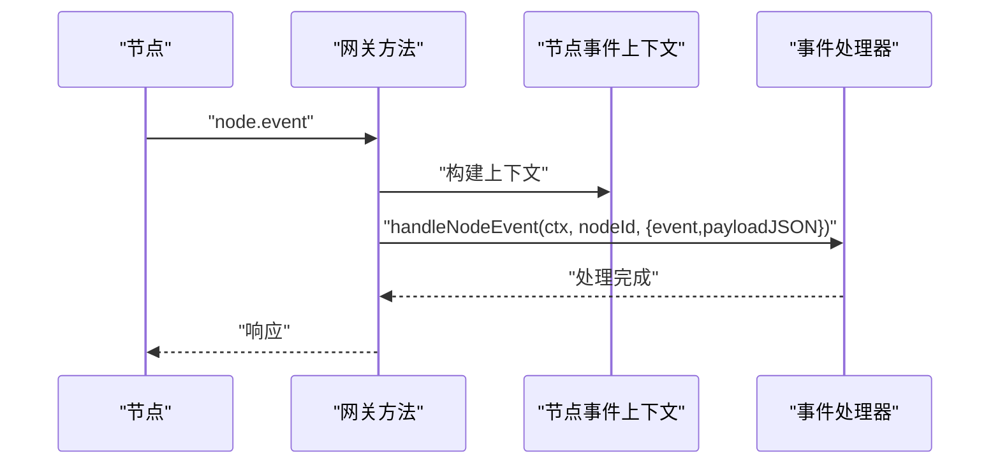
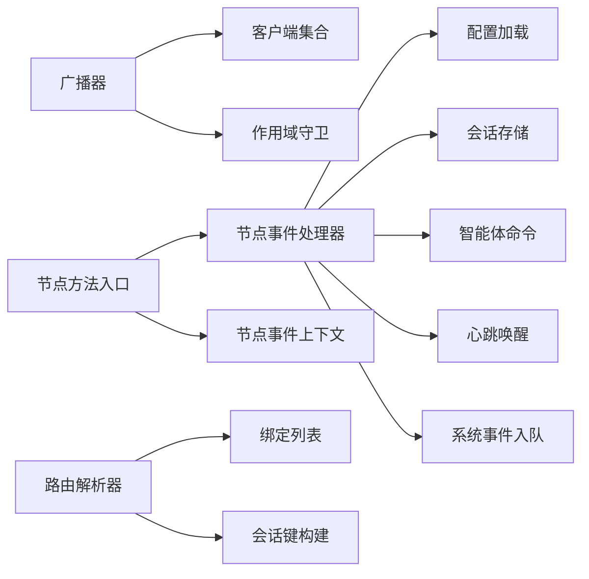

# 事件路由系统

<cite>
**本文引用的文件**
- [src/gateway/server-node-events-types.ts](file://src/gateway/server-node-events-types.ts)
- [src/gateway/server-node-events.ts](file://src/gateway/server-node-events.ts)
- [src/gateway/server-node-subscriptions.ts](file://src/gateway/server-node-subscriptions.ts)
- [src/gateway/server-node-subscriptions.test.ts](file://src/gateway/server-node-subscriptions.test.ts)
- [src/gateway/server-broadcast.ts](file://src/gateway/server-broadcast.ts)
- [src/routing/resolve-route.ts](file://src/routing/resolve-route.ts)
- [src/routing/bindings.ts](file://src/routing/bindings.ts)
- [src/gateway/server-methods/nodes.ts](file://src/gateway/server-methods/nodes.ts)
- [docs/zh-CN/channels/channel-routing.md](file://docs/zh-CN/channels/channel-routing.md)
- [docs/zh-CN/concepts/multi-agent.md](file://docs/zh-CN/concepts/multi-agent.md)
- [src/node-host/runner.ts](file://src/node-host/runner.ts)
- [src/infra/heartbeat-wake.test.ts](file://src/infra/heartbeat-wake.test.ts)
- [src/auto-reply/reply/queue/normalize.ts](file://src/auto-reply/reply/queue/normalize.ts)
- [src/auto-reply/reply/queue/drain.ts](file://src/auto-reply/reply/queue/drain.ts)
- [src/memory/manager.ts](file://src/memory/manager.ts)
</cite>

## 目录

1. [简介](#简介)
2. [项目结构](#项目结构)
3. [核心组件](#核心组件)
4. [架构总览](#架构总览)
5. [详细组件分析](#详细组件分析)
6. [依赖关系分析](#依赖关系分析)
7. [性能考量](#性能考量)
8. [故障排查指南](#故障排查指南)
9. [结论](#结论)
10. [附录](#附录)

## 简介

本技术文档聚焦于 OpenClaw 的事件路由系统，系统围绕“事件分发、订阅管理、路由算法、事件传播”展开，覆盖节点事件处理、客户端通知、跨节点事件同步以及事件优先级与过滤策略。文档同时给出事件类型定义、路由规则配置、性能优化策略、事件过滤与批量处理、错误重试机制，并提供可操作的事件处理示例与路由配置指引，帮助开发者快速理解并扩展事件系统。

## 项目结构

事件路由系统主要分布在以下模块：

- 节点事件与订阅：负责节点侧事件的接收、解析、派发与订阅管理
- 广播与客户端通知：负责向 Websocket 客户端广播事件、按作用域过滤与慢消费者处理
- 路由与绑定：负责根据配置将入站消息路由到指定智能体与会话键
- 节点到网关通信：负责节点事件通过网关方法进行统一入口处理
- 文档与配置：提供路由规则与配置示例

图表来源

- [src/gateway/server-node-events.ts](file://src/gateway/server-node-events.ts#L1-L249)
- [src/gateway/server-node-subscriptions.ts](file://src/gateway/server-node-subscriptions.ts#L1-L164)
- [src/gateway/server-methods/nodes.ts](file://src/gateway/server-methods/nodes.ts#L509-L537)
- [src/gateway/server-broadcast.ts](file://src/gateway/server-broadcast.ts#L1-L121)
- [src/routing/resolve-route.ts](file://src/routing/resolve-route.ts#L1-L293)
- [src/routing/bindings.ts](file://src/routing/bindings.ts#L1-L121)

章节来源

- [src/gateway/server-node-events.ts](file://src/gateway/server-node-events.ts#L1-L249)
- [src/gateway/server-node-subscriptions.ts](file://src/gateway/server-node-subscriptions.ts#L1-L164)
- [src/gateway/server-methods/nodes.ts](file://src/gateway/server-methods/nodes.ts#L509-L537)
- [src/gateway/server-broadcast.ts](file://src/gateway/server-broadcast.ts#L1-L121)
- [src/routing/resolve-route.ts](file://src/routing/resolve-route.ts#L1-L293)
- [src/routing/bindings.ts](file://src/routing/bindings.ts#L1-L121)

## 核心组件

- 节点事件上下文与事件类型：定义节点事件处理所需的上下文能力与事件载体
- 节点事件处理器：解析节点事件、构建会话、触发智能体命令、维护聊天运行状态
- 节点订阅管理器：维护节点与会话之间的订阅映射，支持按会话/全部订阅者广播
- 广播器：面向客户端的事件广播，支持作用域过滤、慢消费者丢弃/断开、目标连接定向广播
- 路由解析器与绑定：从配置中解析路由规则，选择目标智能体与会话键
- 节点方法入口：统一接收节点事件请求，调用事件处理器并返回响应

章节来源

- [src/gateway/server-node-events-types.ts](file://src/gateway/server-node-events-types.ts#L1-L37)
- [src/gateway/server-node-events.ts](file://src/gateway/server-node-events.ts#L1-L249)
- [src/gateway/server-node-subscriptions.ts](file://src/gateway/server-node-subscriptions.ts#L1-L164)
- [src/gateway/server-broadcast.ts](file://src/gateway/server-broadcast.ts#L1-L121)
- [src/routing/resolve-route.ts](file://src/routing/resolve-route.ts#L1-L293)
- [src/routing/bindings.ts](file://src/routing/bindings.ts#L1-L121)
- [src/gateway/server-methods/nodes.ts](file://src/gateway/server-methods/nodes.ts#L509-L537)

## 架构总览

事件从节点侧进入，经由网关方法统一入口，再由事件处理器完成业务处理与状态更新，随后通过广播器向客户端推送事件；同时，订阅管理器负责节点间事件的订阅与定向分发；路由解析器则负责将入站消息映射到正确的智能体与会话键。

图表来源

- [src/gateway/server-methods/nodes.ts](file://src/gateway/server-methods/nodes.ts#L509-L537)
- [src/gateway/server-node-events.ts](file://src/gateway/server-node-events.ts#L1-L249)
- [src/gateway/server-broadcast.ts](file://src/gateway/server-broadcast.ts#L1-L121)
- [src/gateway/server-node-subscriptions.ts](file://src/gateway/server-node-subscriptions.ts#L1-L164)

## 详细组件分析

### 节点事件处理与传播

- 事件类型与上下文
  - 事件类型包含事件名与可选的 JSON 载荷
  - 上下文提供广播、订阅/取消订阅、聊天运行状态管理、健康快照、模型目录加载等能力
- 处理流程
  - 解析事件载荷并进行基本校验（非空、长度限制等）
  - 基于配置与会话键加载/创建会话条目
  - 触发智能体命令或系统事件入队
  - 维护聊天运行映射，确保 UI 刷新
- 典型事件
  - 语音转写：提取文本、确定会话键、触发智能体处理
  - 智能体请求：解析深链参数、构造消息与会话键、触发智能体执行
  - 聊天订阅/取消：维护节点与会话的订阅关系
  - 执行事件：将执行开始/结束/拒绝转化为系统事件并唤醒心跳

图表来源

- [src/gateway/server-node-events-types.ts](file://src/gateway/server-node-events-types.ts#L1-L37)
- [src/gateway/server-node-events.ts](file://src/gateway/server-node-events.ts#L1-L249)

章节来源

- [src/gateway/server-node-events-types.ts](file://src/gateway/server-node-events-types.ts#L1-L37)
- [src/gateway/server-node-events.ts](file://src/gateway/server-node-events.ts#L1-L249)

### 订阅管理与跨节点事件同步

- 数据结构
  - 节点订阅映射：节点ID -> 会话集合
  - 会话订阅映射：会话键 -> 节点集合
- 能力
  - 订阅/取消订阅/全部取消
  - 按会话广播
  - 广播给所有已订阅节点
  - 广播给当前已连接节点（结合节点列表回调）
- 测试验证
  - 路由到已订阅节点
  - 全部取消后不再收到事件

图表来源

- [src/gateway/server-node-subscriptions.ts](file://src/gateway/server-node-subscriptions.ts#L1-L31)

章节来源

- [src/gateway/server-node-subscriptions.ts](file://src/gateway/server-node-subscriptions.ts#L1-L164)
- [src/gateway/server-node-subscriptions.test.ts](file://src/gateway/server-node-subscriptions.test.ts#L1-L38)

### 客户端通知与事件过滤

- 作用域过滤
  - 不同事件需要特定角色与作用域（如审批、配对）
  - 未满足条件的客户端会被过滤
- 慢消费者处理
  - 当客户端缓冲超过阈值时，可选择丢弃或断开连接
- 广播策略
  - 普通广播与按连接ID定向广播
  - 可携带状态版本号用于客户端一致性

图表来源

- [src/gateway/server-broadcast.ts](file://src/gateway/server-broadcast.ts#L1-L121)

章节来源

- [src/gateway/server-broadcast.ts](file://src/gateway/server-broadcast.ts#L1-L121)

### 路由算法与事件优先级

- 路由规则
  - 精确对端匹配（peer.kind + peer.id）
  - Guild 匹配（Discord）
  - Team 匹配（Slack）
  - 账户匹配（accountId）
  - 渠道匹配（任意账户）
  - 默认智能体（agents.list[].default 或列表首项）
- 会话键构建
  - 基于 agentId、channel、accountId、peer、DM 作用域、身份链接等
- 优先级
  - 最具体匹配优先；线性查找命中即止
  - 支持线程父对端继承匹配

图表来源

- [src/routing/resolve-route.ts](file://src/routing/resolve-route.ts#L185-L292)
- [src/routing/bindings.ts](file://src/routing/bindings.ts#L16-L18)

章节来源

- [src/routing/resolve-route.ts](file://src/routing/resolve-route.ts#L1-L293)
- [src/routing/bindings.ts](file://src/routing/bindings.ts#L1-L121)
- [docs/zh-CN/channels/channel-routing.md](file://docs/zh-CN/channels/channel-routing.md#L47-L104)
- [docs/zh-CN/concepts/multi-agent.md](file://docs/zh-CN/concepts/multi-agent.md#L140-L203)

### 节点事件到网关的统一入口

- 网关方法接收节点事件请求，解析事件与载荷
- 构造节点上下文并调用事件处理器
- 返回处理结果

图表来源

- [src/gateway/server-methods/nodes.ts](file://src/gateway/server-methods/nodes.ts#L509-L537)
- [src/gateway/server-node-events-types.ts](file://src/gateway/server-node-events-types.ts#L8-L31)
- [src/gateway/server-node-events.ts](file://src/gateway/server-node-events.ts#L14-L248)

章节来源

- [src/gateway/server-methods/nodes.ts](file://src/gateway/server-methods/nodes.ts#L509-L537)
- [src/gateway/server-node-events-types.ts](file://src/gateway/server-node-events-types.ts#L1-L37)
- [src/gateway/server-node-events.ts](file://src/gateway/server-node-events.ts#L1-L249)

### 事件类型定义与扩展

- 节点事件类型
  - 事件名与可选 JSON 载荷
- 节点事件上下文
  - 广播、订阅/取消订阅、聊天运行管理、健康快照、模型目录加载、日志等
- 节点到网关事件发送
  - 通过请求封装事件名与载荷，失败时采用最佳努力策略

章节来源

- [src/gateway/server-node-events-types.ts](file://src/gateway/server-node-events-types.ts#L1-L37)
- [src/node-host/runner.ts](file://src/node-host/runner.ts#L1279-L1288)

### 路由规则配置与示例

- 配置要点
  - agents.list：智能体定义
  - bindings：将渠道/账户/对端映射到智能体
  - 广播组：同一对端运行多个智能体
- 示例参考
  - 多智能体路由示例
  - 渠道路由规则说明

章节来源

- [docs/zh-CN/channels/channel-routing.md](file://docs/zh-CN/channels/channel-routing.md#L47-L104)
- [docs/zh-CN/concepts/multi-agent.md](file://docs/zh-CN/concepts/multi-agent.md#L140-L203)

## 依赖关系分析

- 节点事件处理器依赖配置加载、会话存储、智能体命令、心跳唤醒、系统事件入队等
- 广播器依赖客户端集合、作用域守卫、慢消费者策略
- 路由解析器依赖绑定列表、会话键构建工具
- 节点方法入口依赖事件处理器与上下文

图表来源

- [src/gateway/server-node-events.ts](file://src/gateway/server-node-events.ts#L1-L249)
- [src/gateway/server-broadcast.ts](file://src/gateway/server-broadcast.ts#L1-L121)
- [src/routing/resolve-route.ts](file://src/routing/resolve-route.ts#L1-L293)
- [src/routing/bindings.ts](file://src/routing/bindings.ts#L1-L121)
- [src/gateway/server-methods/nodes.ts](file://src/gateway/server-methods/nodes.ts#L509-L537)

章节来源

- [src/gateway/server-node-events.ts](file://src/gateway/server-node-events.ts#L1-L249)
- [src/gateway/server-broadcast.ts](file://src/gateway/server-broadcast.ts#L1-L121)
- [src/routing/resolve-route.ts](file://src/routing/resolve-route.ts#L1-L293)
- [src/routing/bindings.ts](file://src/routing/bindings.ts#L1-L121)
- [src/gateway/server-methods/nodes.ts](file://src/gateway/server-methods/nodes.ts#L509-L537)

## 性能考量

- 广播性能
  - 使用作用域过滤减少无效投递
  - 慢消费者丢弃或断开避免阻塞主循环
  - 序列化一次复用，避免重复序列化
- 订阅管理
  - 双向映射（节点->会话、会话->节点）降低查询成本
  - 批量广播时按订阅集合迭代，避免全量扫描
- 路由解析
  - 绑定列表预筛选（通道+账户），减少后续匹配开销
  - 优先级匹配顺序保证命中即停
- 事件处理
  - 异步触发智能体命令，避免阻塞事件处理
  - 会话存储更新采用原子写入，减少竞争

[本节为通用性能建议，不直接分析具体文件]

## 故障排查指南

- 节点事件未到达客户端
  - 检查作用域守卫与客户端角色/作用域
  - 检查慢消费者策略是否导致丢弃
- 节点订阅无效
  - 确认订阅/取消订阅调用与会话键一致
  - 使用测试用例验证订阅映射
- 路由不生效
  - 核对 bindings 配置与通道/账户/对端匹配
  - 检查默认智能体回退逻辑
- 心跳与系统事件
  - 执行事件应触发系统事件入队与心跳唤醒
  - 若未触发，检查事件类型与处理分支

章节来源

- [src/gateway/server-broadcast.ts](file://src/gateway/server-broadcast.ts#L18-L32)
- [src/gateway/server-node-subscriptions.test.ts](file://src/gateway/server-node-subscriptions.test.ts#L1-L38)
- [src/gateway/server-node-events.ts](file://src/gateway/server-node-events.ts#L241-L243)
- [src/infra/heartbeat-wake.test.ts](file://src/infra/heartbeat-wake.test.ts#L80-L116)

## 结论

OpenClaw 的事件路由系统以“节点事件处理器 + 订阅管理 + 广播器 + 路由解析器”为核心，形成清晰的职责边界与高效的事件传播路径。通过作用域过滤与慢消费者策略保障广播性能，通过订阅映射实现跨节点事件同步，通过路由规则与会话键构建实现灵活的多智能体调度。配合配置化的绑定与广播组，系统具备良好的可扩展性与可运维性。

[本节为总结性内容，不直接分析具体文件]

## 附录

### 事件处理示例与路由配置

- 节点事件处理示例
  - 语音转写事件：解析文本、确定会话键、触发智能体命令
  - 智能体请求事件：解析深链参数、构造消息与会话键、触发智能体执行
  - 执行事件：入队系统事件并唤醒心跳
- 路由配置示例
  - 多智能体路由与广播组配置
  - 渠道路由规则与匹配字段说明

章节来源

- [src/gateway/server-node-events.ts](file://src/gateway/server-node-events.ts#L16-L80)
- [src/gateway/server-node-events.ts](file://src/gateway/server-node-events.ts#L81-L154)
- [src/gateway/server-node-events.ts](file://src/gateway/server-node-events.ts#L193-L244)
- [docs/zh-CN/channels/channel-routing.md](file://docs/zh-CN/channels/channel-routing.md#L47-L104)
- [docs/zh-CN/concepts/multi-agent.md](file://docs/zh-CN/concepts/multi-agent.md#L140-L203)

### 事件过滤、批量处理与错误重试

- 事件过滤
  - 作用域过滤：仅授予特定角色与作用域的事件可见
- 批量处理
  - 订阅广播按订阅集合批量投递
  - 自动回复队列的批量出队与去重策略
- 错误重试
  - 心跳唤醒处理器在首次失败后按默认延迟重试
  - 内存批处理记录失败次数并在阈值后禁用批处理

章节来源

- [src/gateway/server-broadcast.ts](file://src/gateway/server-broadcast.ts#L18-L32)
- [src/gateway/server-node-subscriptions.ts](file://src/gateway/server-node-subscriptions.ts#L100-L133)
- [src/auto-reply/reply/queue/normalize.ts](file://src/auto-reply/reply/queue/normalize.ts#L1-L44)
- [src/auto-reply/reply/queue/drain.ts](file://src/auto-reply/reply/queue/drain.ts#L118-L135)
- [src/infra/heartbeat-wake.test.ts](file://src/infra/heartbeat-wake.test.ts#L80-L116)
- [src/memory/manager.ts](file://src/memory/manager.ts#L2087-L2138)
