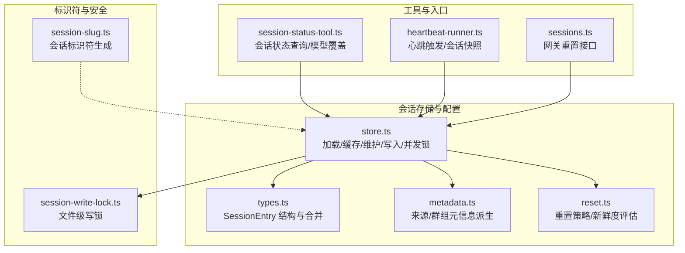
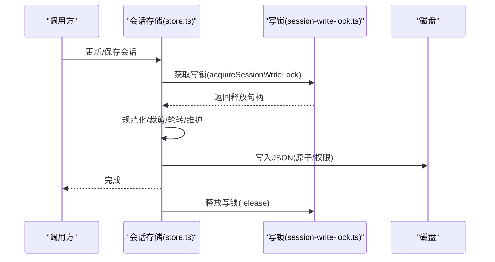
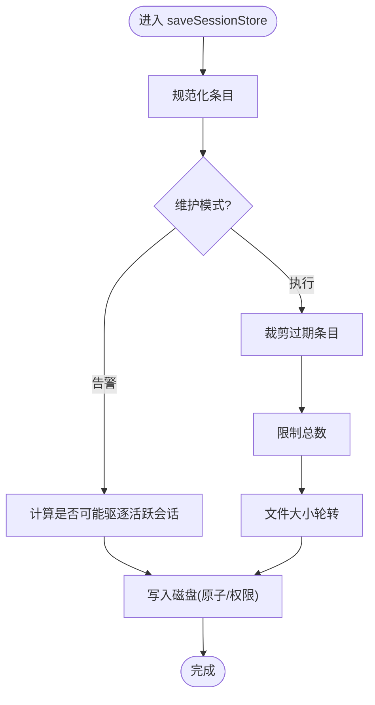
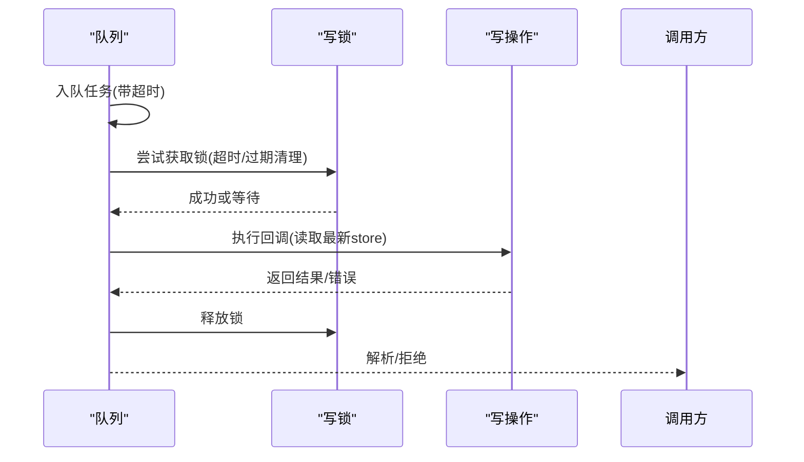
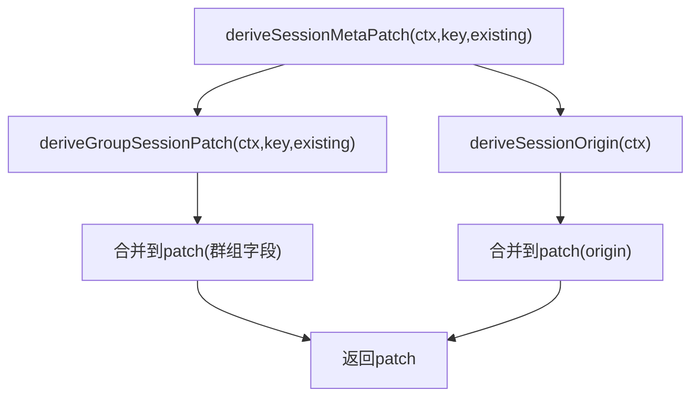
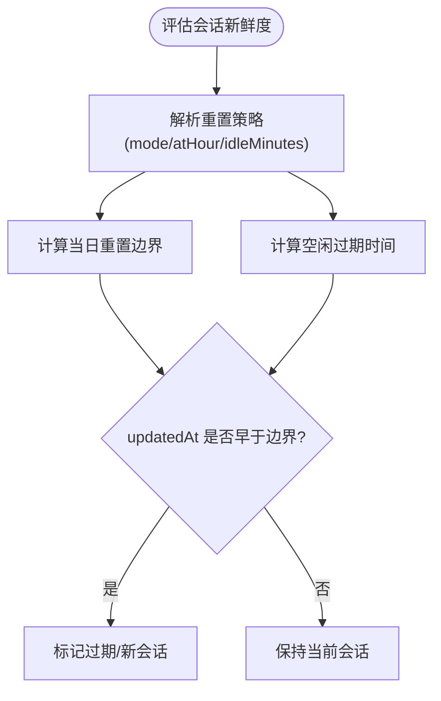
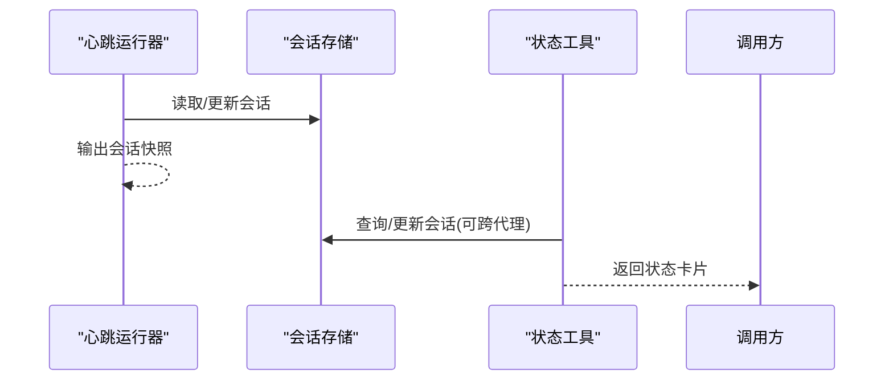
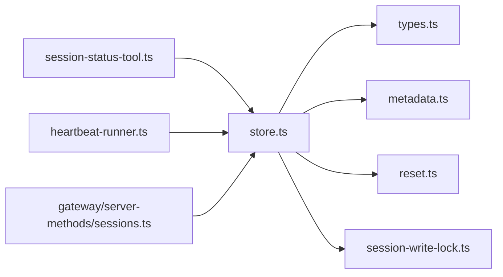

# 会话管理系统

<cite>
**本文引用的文件**
- [src/config/sessions/store.ts](file://src/config/sessions/store.ts)
- [src/config/sessions/types.ts](file://src/config/sessions/types.ts)
- [src/config/sessions/metadata.ts](file://src/config/sessions/metadata.ts)
- [src/config/sessions/reset.ts](file://src/config/sessions/reset.ts)
- [src/agents/session-slug.ts](file://src/agents/session-slug.ts)
- [src/agents/session-write-lock.ts](file://src/agents/session-write-lock.ts)
- [src/agents/tools/session-status-tool.ts](file://src/agents/tools/session-status-tool.ts)
- [src/web/auto-reply/heartbeat-runner.ts](file://src/web/auto-reply/heartbeat-runner.ts)
- [src/gateway/server-methods/sessions.ts](file://src/gateway/server-methods/sessions.ts)
- [docs/concepts/session.md](file://docs/concepts/session.md)
- [src/config/sessions/store.lock.test.ts](file://src/config/sessions/store.lock.test.ts)
- [src/auto-reply/reply/session.test.ts](file://src/auto-reply/reply/session.test.ts)
</cite>

## 目录

1. [简介](#简介)
2. [项目结构](#项目结构)
3. [核心组件](#核心组件)
4. [架构总览](#架构总览)
5. [详细组件分析](#详细组件分析)
6. [依赖关系分析](#依赖关系分析)
7. [性能考量](#性能考量)
8. [故障排查指南](#故障排查指南)
9. [结论](#结论)
10. [附录](#附录)

## 简介

本文件系统化阐述 OpenClaw 会话管理系统：从会话生命周期（创建、更新、销毁、持久化）、会话标识符生成、状态维护到清理与并发控制；并结合配置项（超时、重置策略、维护模式）与事件处理（心跳、状态同步、异常恢复），帮助开发者快速理解并扩展会话能力。

## 项目结构

围绕会话管理的关键模块分布如下：

- 配置与存储层：会话存储读写、缓存、维护（裁剪、轮转）、并发锁
- 类型与元数据：会话条目结构、来源与群组元信息派生
- 重置策略：按日/空闲/类型/通道的会话新鲜度判定
- 工具与入口：会话状态工具、心跳运行器、网关会话重置接口
- 文档与测试：概念文档、并发锁测试、会话新鲜度测试



图表来源

- [src/config/sessions/store.ts](file://src/config/sessions/store.ts#L147-L213)
- [src/config/sessions/types.ts](file://src/config/sessions/types.ts#L25-L121)
- [src/config/sessions/metadata.ts](file://src/config/sessions/metadata.ts#L45-L87)
- [src/config/sessions/reset.ts](file://src/config/sessions/reset.ts#L84-L176)
- [src/agents/tools/session-status-tool.ts](file://src/agents/tools/session-status-tool.ts#L251-L474)
- [src/web/auto-reply/heartbeat-runner.ts](file://src/web/auto-reply/heartbeat-runner.ts#L76-L114)
- [src/gateway/server-methods/sessions.ts](file://src/gateway/server-methods/sessions.ts#L233-L267)
- [src/agents/session-slug.ts](file://src/agents/session-slug.ts#L115-L144)
- [src/agents/session-write-lock.ts](file://src/agents/session-write-lock.ts#L112-L202)

章节来源

- [docs/concepts/session.md](file://docs/concepts/session.md#L1-L205)

## 核心组件

- 会话存储与缓存：支持 TTL 缓存、磁盘读取、迁移字段、规范化、维护（裁剪、轮转）、序列化写入与权限设置
- 并发控制：基于文件锁的串行化写队列，避免竞态与损坏
- 会话条目与合并：统一结构、时间戳合并、默认值生成
- 元信息派生：来源标签、渠道、线程、群组显示名等
- 重置策略：按类型/通道/全局的每日/空闲策略，新鲜度判定
- 标识符生成：可冲突检测的 slug 生成
- 工具与入口：状态查询、心跳触发、网关重置

章节来源

- [src/config/sessions/store.ts](file://src/config/sessions/store.ts#L147-L213)
- [src/config/sessions/store.ts](file://src/config/sessions/store.ts#L281-L294)
- [src/config/sessions/store.ts](file://src/config/sessions/store.ts#L476-L578)
- [src/config/sessions/store.ts](file://src/config/sessions/store.ts#L604-L753)
- [src/config/sessions/types.ts](file://src/config/sessions/types.ts#L25-L121)
- [src/config/sessions/metadata.ts](file://src/config/sessions/metadata.ts#L153-L172)
- [src/config/sessions/reset.ts](file://src/config/sessions/reset.ts#L84-L176)
- [src/agents/session-slug.ts](file://src/agents/session-slug.ts#L115-L144)
- [src/agents/session-write-lock.ts](file://src/agents/session-write-lock.ts#L112-L202)

## 架构总览

会话管理以“存储文件 + 内存缓存 + 维护策略 + 并发锁”为核心，配合“元信息派生 + 重置策略 + 工具入口”形成完整的生命周期闭环。



图表来源

- [src/config/sessions/store.ts](file://src/config/sessions/store.ts#L580-L588)
- [src/config/sessions/store.ts](file://src/config/sessions/store.ts#L476-L578)
- [src/agents/session-write-lock.ts](file://src/agents/session-write-lock.ts#L112-L202)

## 详细组件分析

### 会话存储与缓存（load/save/update）

- 加载：支持缓存命中（含 mtime 校验）、缺失/无效文件容错、字段迁移（provider→channel、room→groupChannel）
- 维护：裁剪过期条目、限制总数、文件大小轮转；维护模式支持“仅告警不强制”
- 保存：规范化条目、维护执行、目录创建、跨平台写入策略（Windows 直写，其他平台临时文件+重命名+chmod）
- 并发：队列化串行化写入，超时与过期清理，避免竞态



图表来源

- [src/config/sessions/store.ts](file://src/config/sessions/store.ts#L476-L578)
- [src/config/sessions/store.ts](file://src/config/sessions/store.ts#L281-L294)
- [src/config/sessions/store.ts](file://src/config/sessions/store.ts#L301-L319)
- [src/config/sessions/store.ts](file://src/config/sessions/store.ts#L371-L397)
- [src/config/sessions/store.ts](file://src/config/sessions/store.ts#L413-L465)

章节来源

- [src/config/sessions/store.ts](file://src/config/sessions/store.ts#L147-L213)
- [src/config/sessions/store.ts](file://src/config/sessions/store.ts#L281-L294)
- [src/config/sessions/store.ts](file://src/config/sessions/store.ts#L476-L578)
- [src/config/sessions/store.ts](file://src/config/sessions/store.ts#L580-L602)
- [src/config/sessions/store.ts](file://src/config/sessions/store.ts#L604-L753)

### 并发控制与锁队列

- 文件锁：基于锁文件的互斥，支持超时、过期清理、进程存活检测
- 写队列：同一 storePath 的任务串行执行，超时拒绝、定时器清理、失败回滚
- 测试验证：并发更新不会丢失数据，合并补丁正确累积



图表来源

- [src/agents/session-write-lock.ts](file://src/agents/session-write-lock.ts#L112-L202)
- [src/config/sessions/store.ts](file://src/config/sessions/store.ts#L604-L753)
- [src/config/sessions/store.lock.test.ts](file://src/config/sessions/store.lock.test.ts#L39-L70)

章节来源

- [src/agents/session-write-lock.ts](file://src/agents/session-write-lock.ts#L112-L202)
- [src/config/sessions/store.ts](file://src/config/sessions/store.ts#L604-L753)
- [src/config/sessions/store.lock.test.ts](file://src/config/sessions/store.lock.test.ts#L39-L70)

### 会话条目结构与合并

- 结构：包含 sessionId、updatedAt、渠道/线程/群组/来源元信息、令牌统计、队列/策略/覆盖等
- 合并：自动补齐 sessionId 与 updatedAt，确保时间单调递增

```mermaid
classDiagram
class SessionEntry {
+string sessionId
+number updatedAt
+string? channel
+string? lastChannel
+string? lastTo
+string? lastAccountId
+string|number? lastThreadId
+DeliveryContext? deliveryContext
+SessionOrigin? origin
+number? inputTokens
+number? outputTokens
+number? totalTokens
+boolean? totalTokensFresh
+string? providerOverride
+string? modelOverride
+string? authProfileOverride
+string? groupActivation
+string? queueMode
+number? queueDebounceMs
+number? queueCap
+string? queueDrop
+string? label
+string? displayName
+string? groupId
+string? subject
+string? groupChannel
+string? space
}
class mergeSessionEntry(existing, patch) SessionEntry
```

图表来源

- [src/config/sessions/types.ts](file://src/config/sessions/types.ts#L25-L121)

章节来源

- [src/config/sessions/types.ts](file://src/config/sessions/types.ts#L25-L121)

### 元信息派生（来源/群组）

- 来源：从上下文推导 provider/surface/chatType/from/to/accountId/threadId，并合并到 origin
- 群组：根据上下文与键推导群组显示名，填充 displayName/subject/channel/space



图表来源

- [src/config/sessions/metadata.ts](file://src/config/sessions/metadata.ts#L153-L172)
- [src/config/sessions/metadata.ts](file://src/config/sessions/metadata.ts#L96-L151)
- [src/config/sessions/metadata.ts](file://src/config/sessions/metadata.ts#L45-L87)

章节来源

- [src/config/sessions/metadata.ts](file://src/config/sessions/metadata.ts#L153-L172)
- [src/config/sessions/metadata.ts](file://src/config/sessions/metadata.ts#L96-L151)
- [src/config/sessions/metadata.ts](file://src/config/sessions/metadata.ts#L45-L87)

### 重置策略与新鲜度

- 策略解析：支持全局 reset、按类型（direct/group/thread）、按通道覆盖；兼容 legacy dm→direct
- 新鲜度评估：按日重置边界与空闲过期时间，二者取先到期者
- 触发重置：/new 或 /reset 命令触发新 sessionId 并清零令牌计数



图表来源

- [src/config/sessions/reset.ts](file://src/config/sessions/reset.ts#L84-L176)
- [src/gateway/server-methods/sessions.ts](file://src/gateway/server-methods/sessions.ts#L233-L267)

章节来源

- [src/config/sessions/reset.ts](file://src/config/sessions/reset.ts#L84-L176)
- [src/gateway/server-methods/sessions.ts](file://src/gateway/server-methods/sessions.ts#L233-L267)
- [src/auto-reply/reply/session.test.ts](file://src/auto-reply/reply/session.test.ts#L210-L294)

### 会话标识符生成

- 生成策略：优先短词组合，冲突则追加序号；失败回退到随机后缀，保证唯一性
- 使用场景：初始化/重置时生成新的 sessionId，或在需要唯一标识时使用

章节来源

- [src/agents/session-slug.ts](file://src/agents/session-slug.ts#L115-L144)

### 会话状态工具与心跳

- 状态工具：支持按 key/sessionId 查询、跨代理访问控制、模型覆盖设置、队列/时间/用量展示
- 心跳运行器：根据目标生成 sessionKey，更新 sessionId 与 updatedAt，并输出会话快照



图表来源

- [src/web/auto-reply/heartbeat-runner.ts](file://src/web/auto-reply/heartbeat-runner.ts#L76-L114)
- [src/agents/tools/session-status-tool.ts](file://src/agents/tools/session-status-tool.ts#L251-L474)

章节来源

- [src/web/auto-reply/heartbeat-runner.ts](file://src/web/auto-reply/heartbeat-runner.ts#L76-L114)
- [src/agents/tools/session-status-tool.ts](file://src/agents/tools/session-status-tool.ts#L251-L474)

## 依赖关系分析

- 存储层依赖：类型定义、交付上下文、解析工具（字节/时长）、日志子系统
- 工具层依赖：配置加载、会话存储、路由键工具、模型选择/认证、用量统计
- 运行器依赖：会话存储、会话快照、消息上下文



图表来源

- [src/config/sessions/store.ts](file://src/config/sessions/store.ts#L1-L22)
- [src/agents/tools/session-status-tool.ts](file://src/agents/tools/session-status-tool.ts#L1-L27)
- [src/web/auto-reply/heartbeat-runner.ts](file://src/web/auto-reply/heartbeat-runner.ts#L1-L11)
- [src/gateway/server-methods/sessions.ts](file://src/gateway/server-methods/sessions.ts#L1-L10)

章节来源

- [src/config/sessions/store.ts](file://src/config/sessions/store.ts#L1-L22)
- [src/agents/tools/session-status-tool.ts](file://src/agents/tools/session-status-tool.ts#L1-L27)
- [src/web/auto-reply/heartbeat-runner.ts](file://src/web/auto-reply/heartbeat-runner.ts#L1-L11)
- [src/gateway/server-methods/sessions.ts](file://src/gateway/server-methods/sessions.ts#L1-L10)

## 性能考量

- 缓存：默认 45 秒 TTL，减少重复磁盘 IO；mtime 校验避免脏读
- 维护：批量裁剪/限流/轮转，降低文件膨胀；维护模式可仅告警避免破坏活跃会话
- 写入：跨平台原子写（非 Windows 直写），减少部分写风险；写前失效缓存保证一致性
- 并发：队列化串行化写入，避免锁竞争；超时与过期清理防止死锁
- 计算：新鲜度评估为 O(1)，裁剪/排序为 O(n log n)，适合中等规模会话表

[本节为通用性能讨论，无需列出具体文件来源]

## 故障排查指南

- 锁超时：检查是否存在长时间持有锁的进程，确认 staleMs 设置是否合理
- 写入失败：关注 ENOENT（路径不存在）与权限问题；Windows 下直写策略不同
- 数据丢失/覆盖：确认并发写入是否通过 withSessionStoreLock；查看队列长度与超时
- 会话未刷新：核对重置策略（daily/atHour/idleMinutes），确认 updatedAt 是否被更新
- 元信息缺失：检查 deriveSessionMetaPatch 输入上下文字段是否完整

章节来源

- [src/agents/session-write-lock.ts](file://src/agents/session-write-lock.ts#L112-L202)
- [src/config/sessions/store.ts](file://src/config/sessions/store.ts#L524-L577)
- [src/config/sessions/store.ts](file://src/config/sessions/store.ts#L604-L753)
- [src/config/sessions/reset.ts](file://src/config/sessions/reset.ts#L139-L176)
- [src/config/sessions/metadata.ts](file://src/config/sessions/metadata.ts#L153-L172)

## 结论

OpenClaw 会话管理系统以“可靠存储 + 智能维护 + 强并发控制 + 可观测工具”为核心，既满足多通道、多账户、多类型的复杂场景，又提供灵活的配置与可观测性。通过本文档的架构与实现解析，开发者可以高效地扩展会话功能、优化性能并稳定运维。

[本节为总结性内容，无需列出具体文件来源]

## 附录

### 会话生命周期与关键流程

- 创建：首次写入或重置触发，生成/替换 sessionId，初始化 updatedAt
- 更新：记录元信息、更新令牌统计、刷新 deliveryContext
- 销毁：删除键或文件，下次访问重建
- 持久化：规范化后写入磁盘，必要时进行裁剪/轮转

章节来源

- [src/config/sessions/store.ts](file://src/config/sessions/store.ts#L476-L578)
- [src/config/sessions/store.ts](file://src/config/sessions/store.ts#L778-L809)
- [src/gateway/server-methods/sessions.ts](file://src/gateway/server-methods/sessions.ts#L233-L267)

### 会话配置要点（节选）

- 重置策略：mode、atHour、idleMinutes；按类型/通道覆盖
- 维护策略：pruneAfter/maxEntries/rotateBytes；维护模式 warn/strict
- 会话键规则：dmScope、identityLinks、mainKey
- 发送策略：按规则阻断特定类型会话的消息投递

章节来源

- [docs/concepts/session.md](file://docs/concepts/session.md#L103-L182)
- [src/config/sessions/reset.ts](file://src/config/sessions/reset.ts#L84-L176)
- [src/config/sessions/store.ts](file://src/config/sessions/store.ts#L281-L294)
