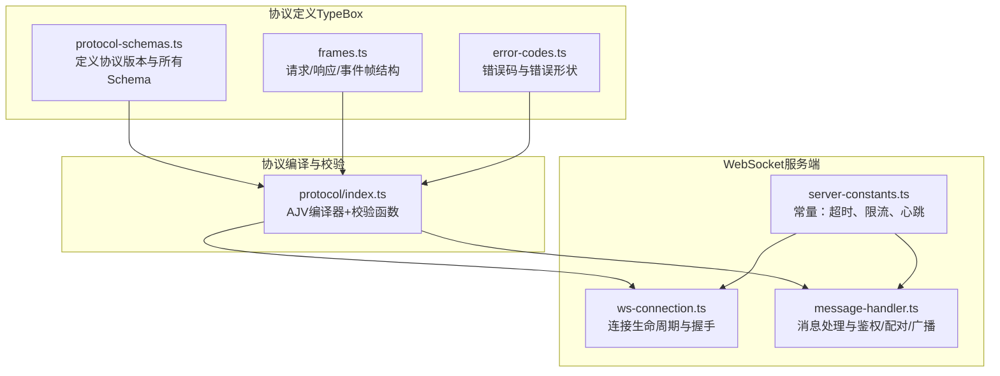
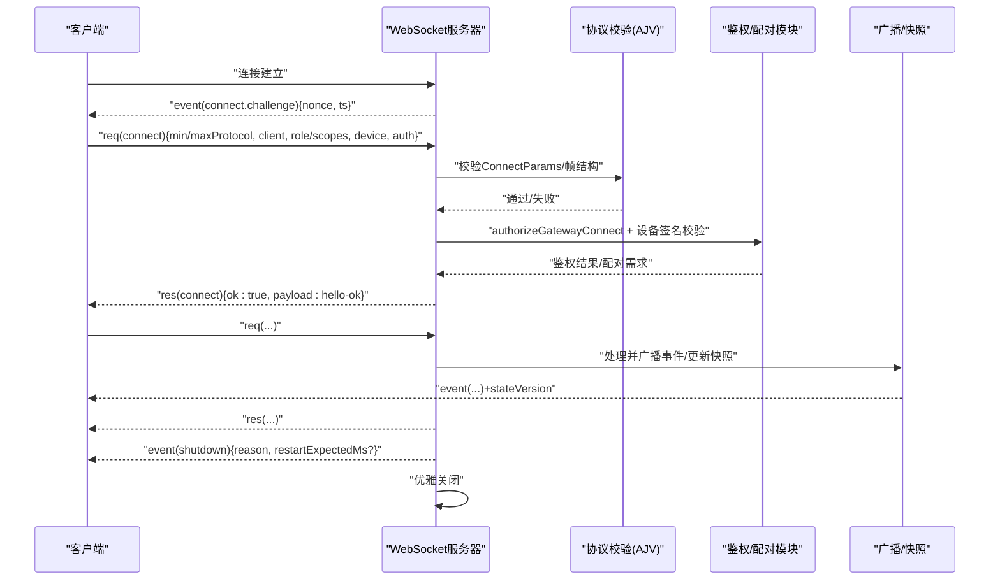
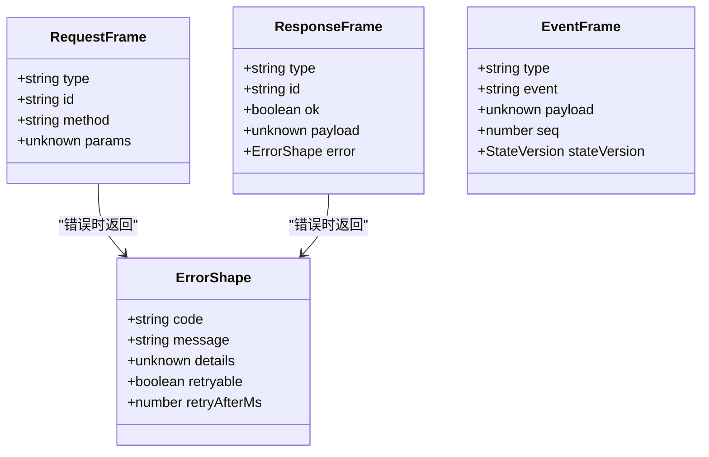
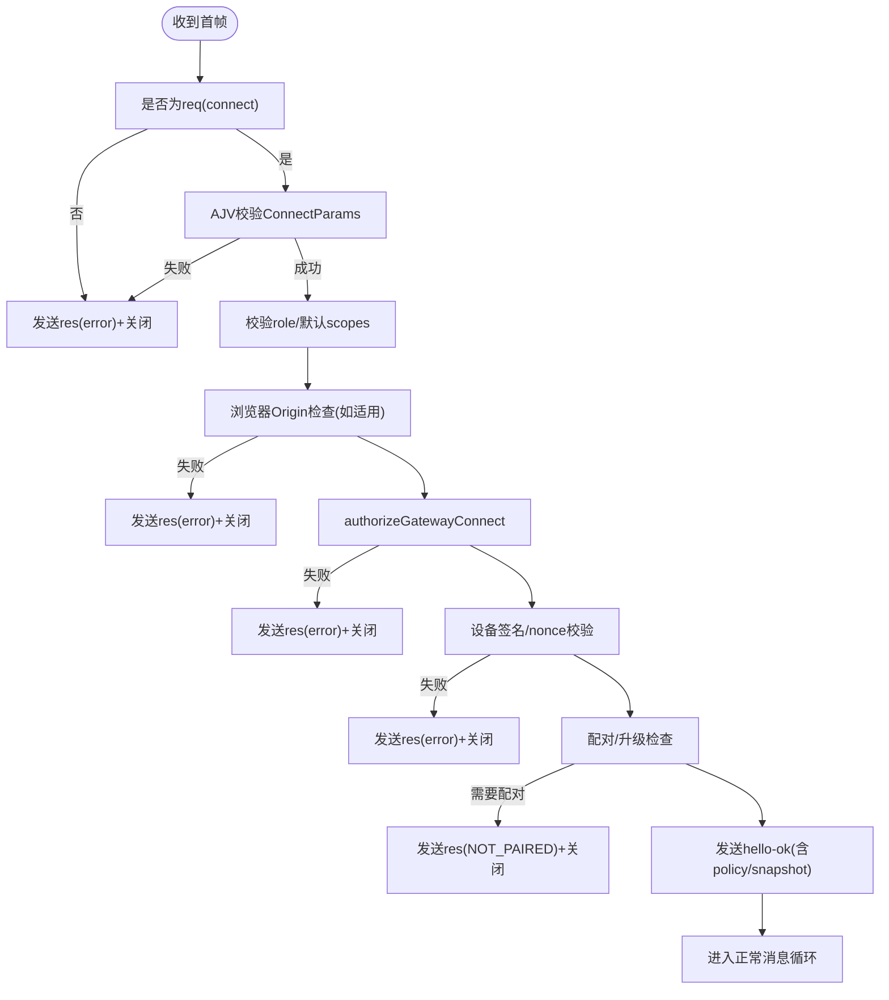
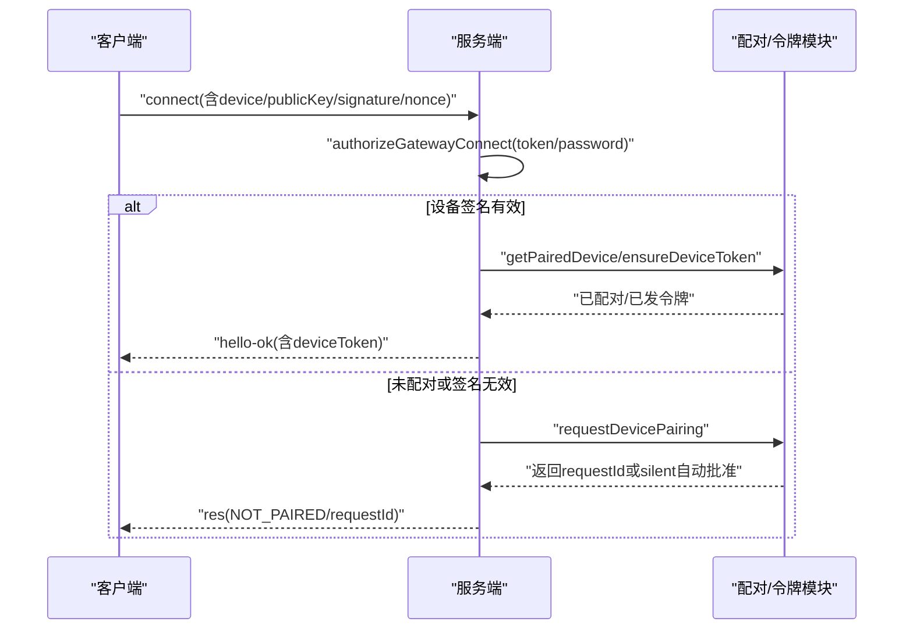
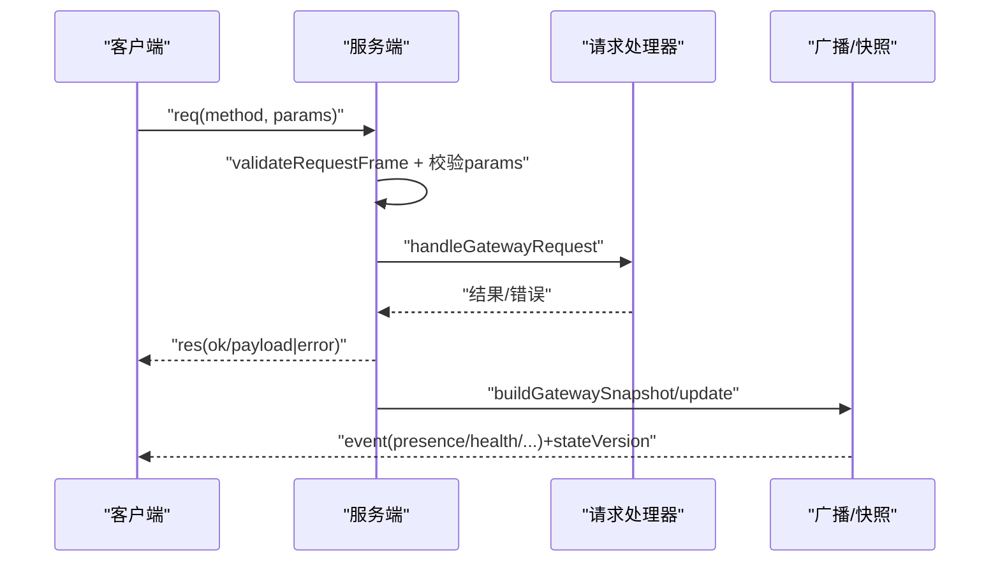
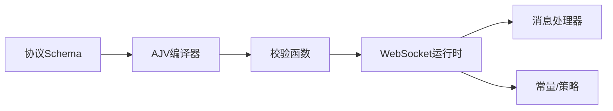

# 网关协议规范

<cite>
**本文引用的文件**
- [docs/gateway/protocol.md](file://docs/gateway/protocol.md)
- [docs/gateway/index.md](file://docs/gateway/index.md)
- [docs/gateway/heartbeat.md](file://docs/gateway/heartbeat.md)
- [docs/gateway/bridge-protocol.md](file://docs/gateway/bridge-protocol.md)
- [src/gateway/protocol/schema.ts](file://src/gateway/protocol/schema.ts)
- [src/gateway/protocol/schema/protocol-schemas.ts](file://src/gateway/protocol/schema/protocol-schemas.ts)
- [src/gateway/protocol/schema/frames.ts](file://src/gateway/protocol/schema/frames.ts)
- [src/gateway/protocol/schema/error-codes.ts](file://src/gateway/protocol/schema/error-codes.ts)
- [src/gateway/protocol/index.ts](file://src/gateway/protocol/index.ts)
- [src/gateway/server/ws-connection.ts](file://src/gateway/server/ws-connection.ts)
- [src/gateway/server/ws-connection/message-handler.ts](file://src/gateway/server/ws-connection/message-handler.ts)
- [src/gateway/server-constants.ts](file://src/gateway/server-constants.ts)
- [src/gateway/server/ws-types.ts](file://src/gateway/server/ws-types.ts)
</cite>

## 目录

1. [简介](#简介)
2. [项目结构](#项目结构)
3. [核心组件](#核心组件)
4. [架构总览](#架构总览)
5. [详细组件分析](#详细组件分析)
6. [依赖关系分析](#依赖关系分析)
7. [性能考量](#性能考量)
8. [故障排查指南](#故障排查指南)
9. [结论](#结论)
10. [附录](#附录)

## 简介

本规范面向实现与集成OpenClaw网关协议的开发者，系统阐述WebSocket控制平面协议的设计原则、握手流程、消息帧格式、版本管理、角色与权限模型、设备身份与配对、认证与授权、错误码与响应结构、以及心跳与健康状态等关键要素。文档同时给出协议演进与兼容性策略，帮助客户端在不同版本间平滑迁移。

## 项目结构

OpenClaw将“协议规范”与“运行时实现”解耦：协议规范由TypeBox Schema定义并通过生成工具产出跨语言模型；运行时在服务端负责解析、校验、鉴权、配对与事件广播，并通过WebSocket承载统一的控制与节点传输通道。

**图表来源**

- [src/gateway/protocol/schema/protocol-schemas.ts](file://src/gateway/protocol/schema/protocol-schemas.ts#L266-L266)
- [src/gateway/protocol/schema/frames.ts](file://src/gateway/protocol/schema/frames.ts#L1-L165)
- [src/gateway/protocol/schema/error-codes.ts](file://src/gateway/protocol/schema/error-codes.ts#L1-L26)
- [src/gateway/protocol/index.ts](file://src/gateway/protocol/index.ts#L227-L408)
- [src/gateway/server/ws-connection.ts](file://src/gateway/server/ws-connection.ts#L1-L267)
- [src/gateway/server/ws-connection/message-handler.ts](file://src/gateway/server/ws-connection/message-handler.ts#L1-L800)
- [src/gateway/server-constants.ts](file://src/gateway/server-constants.ts#L1-L35)

**章节来源**

- [src/gateway/protocol/schema.ts](file://src/gateway/protocol/schema.ts#L1-L17)
- [src/gateway/protocol/schema/protocol-schemas.ts](file://src/gateway/protocol/schema/protocol-schemas.ts#L266-L266)
- [src/gateway/protocol/index.ts](file://src/gateway/protocol/index.ts#L227-L408)
- [src/gateway/server/ws-connection.ts](file://src/gateway/server/ws-connection.ts#L1-L267)
- [src/gateway/server/ws-connection/message-handler.ts](file://src/gateway/server/ws-connection/message-handler.ts#L1-L800)
- [src/gateway/server-constants.ts](file://src/gateway/server-constants.ts#L1-L35)

## 核心组件

- 协议版本与Schema集合：协议版本号集中定义于Schema集合文件中，所有请求/响应/事件帧与参数均以TypeBox定义并由AJV编译为校验器。
- 帧结构：统一使用文本帧承载JSON，包含三类帧：
  - 请求帧：用于调用方法
  - 响应帧：返回结果或错误
  - 事件帧：推送状态、系统事件、节点事件等
- 连接与握手：首次帧必须是connect请求；服务端下发connect.challenge，客户端签名后完成握手；握手失败即刻关闭。
- 鉴权与配对：支持共享密钥（token/password）与设备签名双重路径；非本地连接要求设备签名与nonce校验；新设备需经配对审批。
- 广播与快照：服务端维护健康与在线状态快照，事件携带状态版本号，客户端可据此恢复断点。
- 心跳与健康：周期性tick事件驱动代理回合；健康状态定期刷新；服务端广播shutdown事件后优雅关闭。

**章节来源**

- [docs/gateway/protocol.md](file://docs/gateway/protocol.md#L10-L222)
- [src/gateway/protocol/schema/protocol-schemas.ts](file://src/gateway/protocol/schema/protocol-schemas.ts#L266-L266)
- [src/gateway/protocol/schema/frames.ts](file://src/gateway/protocol/schema/frames.ts#L126-L165)
- [src/gateway/server/ws-connection.ts](file://src/gateway/server/ws-connection.ts#L112-L141)
- [src/gateway/server/ws-connection/message-handler.ts](file://src/gateway/server/ws-connection/message-handler.ts#L307-L337)

## 架构总览

下图展示从客户端到服务端的消息流与关键处理阶段：连接建立、握手挑战、鉴权与配对、方法调用、事件广播与状态同步。

**图表来源**

- [src/gateway/server/ws-connection.ts](file://src/gateway/server/ws-connection.ts#L112-L141)
- [src/gateway/server/ws-connection/message-handler.ts](file://src/gateway/server/ws-connection/message-handler.ts#L307-L337)
- [src/gateway/protocol/index.ts](file://src/gateway/protocol/index.ts#L227-L408)
- [src/gateway/server/ws-connection/message-handler.ts](file://src/gateway/server/ws-connection/message-handler.ts#L408-L461)

**章节来源**

- [src/gateway/server/ws-connection.ts](file://src/gateway/server/ws-connection.ts#L61-L266)
- [src/gateway/server/ws-connection/message-handler.ts](file://src/gateway/server/ws-connection/message-handler.ts#L234-L337)

## 详细组件分析

### 协议版本与消息帧

- 版本号：协议版本集中定义于Schema集合文件，客户端通过min/maxProtocol进行协商，服务端拒绝不兼容版本。
- 帧结构：
  - 请求帧：type="req"，包含id、method、params
  - 响应帧：type="res"，包含id、ok、payload或error
  - 事件帧：type="event"，包含event、payload、seq、stateVersion
- 错误形状：包含code、message、details、retryable、retryAfterMs等字段，便于客户端进行重试与降级。

**图表来源**

- [src/gateway/protocol/schema/frames.ts](file://src/gateway/protocol/schema/frames.ts#L126-L165)
- [src/gateway/protocol/schema/error-codes.ts](file://src/gateway/protocol/schema/error-codes.ts#L15-L25)

**章节来源**

- [src/gateway/protocol/schema/protocol-schemas.ts](file://src/gateway/protocol/schema/protocol-schemas.ts#L266-L266)
- [src/gateway/protocol/schema/frames.ts](file://src/gateway/protocol/schema/frames.ts#L126-L165)
- [src/gateway/protocol/schema/error-codes.ts](file://src/gateway/protocol/schema/error-codes.ts#L1-L26)

### 握手与连接生命周期

- 首帧约束：首个帧必须是connect请求；否则视为无效握手并关闭。
- 挑战与响应：服务端先下发connect.challenge，客户端在connect.params.device中提供nonce签名；非本地连接必须校验nonce一致性。
- 超时与关闭：握手超时触发关闭；连接关闭时记录原因、时长、最后帧元信息。
- 客户端类型：区分operator与node两类角色；node可声明能力、命令白名单与权限开关。

**图表来源**

- [src/gateway/server/ws-connection.ts](file://src/gateway/server/ws-connection.ts#L120-L125)
- [src/gateway/server/ws-connection/message-handler.ts](file://src/gateway/server/ws-connection/message-handler.ts#L267-L337)
- [src/gateway/server/ws-connection/message-handler.ts](file://src/gateway/server/ws-connection/message-handler.ts#L408-L461)
- [src/gateway/server-constants.ts](file://src/gateway/server-constants.ts#L21-L30)

**章节来源**

- [src/gateway/server/ws-connection.ts](file://src/gateway/server/ws-connection.ts#L87-L141)
- [src/gateway/server/ws-connection/message-handler.ts](file://src/gateway/server/ws-connection/message-handler.ts#L234-L337)

### 认证、授权与设备配对

- 认证方式：
  - 共享密钥：token或password，支持远程/本地两种路径
  - 设备签名：非本地连接必须提供设备签名与nonce，服务端校验公钥、时间戳与签名
- 授权：
  - 角色：operator/node
  - 权限：operator.scopes显式授予；空scopes默认无权限
  - 浏览器来源：Control UI/Webchat需满足allowedOrigins限制
- 设备配对：
  - 新设备首次连接会触发配对请求；本地直连可自动批准
  - 已配对设备的角色/范围变更可能触发“角色/范围升级”配对
  - 支持设备令牌轮换与吊销

**图表来源**

- [src/gateway/server/ws-connection/message-handler.ts](file://src/gateway/server/ws-connection/message-handler.ts#L408-L461)
- [src/gateway/server/ws-connection/message-handler.ts](file://src/gateway/server/ws-connection/message-handler.ts#L674-L728)
- [src/gateway/server/ws-connection/message-handler.ts](file://src/gateway/server/ws-connection/message-handler.ts#L784-L786)

**章节来源**

- [docs/gateway/protocol.md](file://docs/gateway/protocol.md#L187-L216)
- [src/gateway/server/ws-connection/message-handler.ts](file://src/gateway/server/ws-connection/message-handler.ts#L408-L461)

### 方法调用与事件广播

- 方法调用：客户端通过req(method, params)发起；服务端通过AJV校验params后执行对应处理器，返回res(ok/payload|error)。
- 事件广播：服务端维护健康与在线状态快照，事件帧携带stateVersion，客户端可据此恢复断点。
- 节点能力：node连接可声明caps/commands/permissions，服务端按允许清单过滤命令白名单。

**图表来源**

- [src/gateway/protocol/index.ts](file://src/gateway/protocol/index.ts#L227-L408)
- [src/gateway/server/ws-connection/message-handler.ts](file://src/gateway/server/ws-connection/message-handler.ts#L45-L55)

**章节来源**

- [src/gateway/protocol/index.ts](file://src/gateway/protocol/index.ts#L227-L408)
- [src/gateway/server/ws-connection/message-handler.ts](file://src/gateway/server/ws-connection/message-handler.ts#L788-L799)

### 心跳机制与健康状态

- 心跳周期：默认30分钟；Anthropic订阅场景为1小时；可通过配置调整。
- 触发条件：周期性tick事件驱动代理回合；若队列繁忙则跳过本轮。
- 可见性控制：每通道/账户可独立控制是否显示“心跳OK”、“告警”与指示事件。
- 成功响应：模型返回“HEARTBEAT_OK”时，若内容长度小于阈值且位于消息起止位置，会被视为确认并丢弃。

**章节来源**

- [docs/gateway/heartbeat.md](file://docs/gateway/heartbeat.md#L18-L365)

### 二进制与序列化细节

- 传输层：WebSocket文本帧，JSON序列化。
- 大小限制：单帧最大8MiB；发送缓冲上限16MiB；握手超时默认10秒。
- 快照与去重：健康与在线状态版本号随事件下发；重复消息去重缓存窗口5分钟，最多1000条。
- Canvas主机URL：根据请求头与配置推导，用于节点能力访问。

**章节来源**

- [docs/gateway/protocol.md](file://docs/gateway/protocol.md#L19-L21)
- [src/gateway/server-constants.ts](file://src/gateway/server-constants.ts#L1-L35)
- [src/gateway/server/ws-connection.ts](file://src/gateway/server/ws-connection.ts#L79-L85)

### 兼容性与版本升级策略

- 协议版本：当前版本号为3；客户端需在connect.params中声明min/maxProtocol并匹配服务端版本。
- 向后兼容：服务端拒绝不兼容版本，客户端应提示用户升级或回退；建议在新版本发布前保留至少一个主版本的兼容窗口。
- 模型生成：通过脚本生成TypeScript/Swift模型与校验器，确保跨语言一致性。

**章节来源**

- [docs/gateway/protocol.md](file://docs/gateway/protocol.md#L178-L186)
- [src/gateway/protocol/schema/protocol-schemas.ts](file://src/gateway/protocol/schema/protocol-schemas.ts#L266-L266)

### 传统桥接协议（遗留）

- 传输：TCP JSONL（已不再默认启用）
- 能力：仅暴露有限RPC子集，配合配对与节点身份
- 使用建议：新客户端请使用统一WebSocket协议；遗留桥接协议作为历史参考

**章节来源**

- [docs/gateway/bridge-protocol.md](file://docs/gateway/bridge-protocol.md#L1-L90)

## 依赖关系分析

协议层与运行时的耦合度低，通过Schema与编译器解耦；运行时通过上下文构建器注入请求处理器与广播器，保持高内聚、低耦合。

**图表来源**

- [src/gateway/protocol/index.ts](file://src/gateway/protocol/index.ts#L227-L408)
- [src/gateway/server/ws-connection.ts](file://src/gateway/server/ws-connection.ts#L1-L267)
- [src/gateway/server/ws-connection/message-handler.ts](file://src/gateway/server/ws-connection/message-handler.ts#L1-L800)
- [src/gateway/server-constants.ts](file://src/gateway/server-constants.ts#L1-L35)

**章节来源**

- [src/gateway/protocol/index.ts](file://src/gateway/protocol/index.ts#L227-L408)
- [src/gateway/server/ws-connection.ts](file://src/gateway/server/ws-connection.ts#L1-L267)

## 性能考量

- 帧大小与缓冲：单帧上限8MiB，发送缓冲16MiB，避免内存膨胀；建议客户端分片大对象或采用HTTP接口。
- 心跳频率：合理设置心跳间隔，避免频繁模型调用；必要时降低模型成本或目标通道。
- 去重与快照：利用stateVersion与去重策略减少冗余事件；关注去重TTL与容量阈值。
- 握手超时：默认10秒，测试环境可调整；生产环境建议保持稳定超时以避免资源占用。

[本节为通用指导，无需特定文件引用]

## 故障排查指南

- 常见握手失败：
  - 非connect首帧：立即关闭
  - 协议版本不匹配：返回INVALID_REQUEST并关闭
  - 角色非法：返回INVALID_REQUEST并关闭
  - Origin不允许：返回INVALID_REQUEST并关闭
  - 设备签名/nonce校验失败：返回INVALID_REQUEST并关闭
  - 未配对：返回NOT_PAIRED并关闭
  - 未授权：返回INVALID_REQUEST并关闭
- 运行期错误：
  - INVALID_REQUEST：请求参数校验失败
  - PERMISSION_DENIED：权限不足
  - UNAVAILABLE：服务不可用
  - NOT_FOUND：资源不存在
  - AGENT_TIMEOUT：代理执行超时
- 连接关闭：
  - 记录关闭原因、握手状态、持续时间、最后帧元信息，便于定位问题

**章节来源**

- [src/gateway/server/ws-connection.ts](file://src/gateway/server/ws-connection.ts#L132-L141)
- [src/gateway/server/ws-connection/message-handler.ts](file://src/gateway/server/ws-connection/message-handler.ts#L272-L304)
- [src/gateway/protocol/schema/error-codes.ts](file://src/gateway/protocol/schema/error-codes.ts#L3-L11)

## 结论

OpenClaw网关协议以统一的WebSocket控制平面承载全量API，结合严格的协议版本协商、设备身份与配对、细粒度的权限模型与事件广播，形成安全、可观测、可扩展的控制通道。遵循本文档的握手流程、消息格式与版本策略，可确保客户端在多平台、多角色场景下稳定接入。

## 附录

- 快速参考（操作者视角）：
  - 首帧必须是connect
  - 服务端返回hello-ok快照（presence、health、stateVersion、uptimeMs、limits/policy）
  - 请求：req(method, params) → res(ok/payload|error)
  - 常见事件：connect.challenge、agent、chat、presence、tick、health、heartbeat、shutdown
  - 代理运行两阶段：即时接受（status:"accepted"）→最终完成（status:"ok"|“error”），中间可流式推送agent事件

**章节来源**

- [docs/gateway/index.md](file://docs/gateway/index.md#L195-L207)
