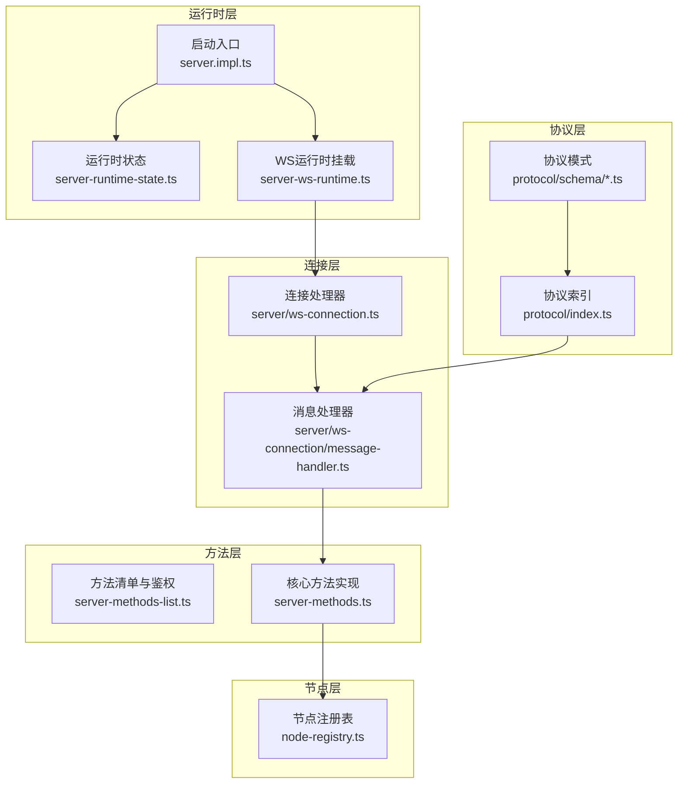
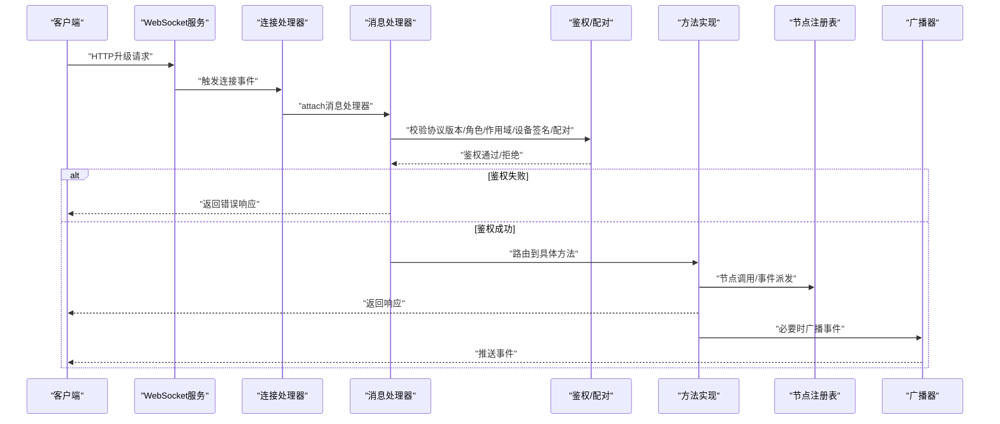
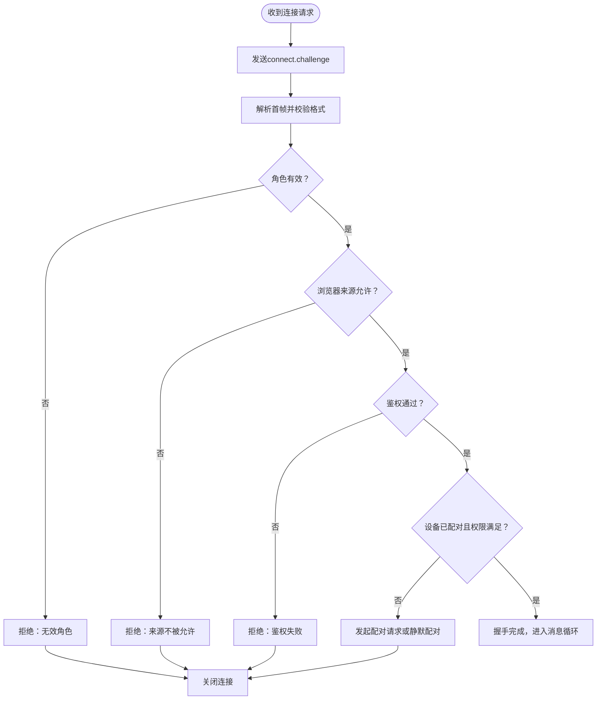
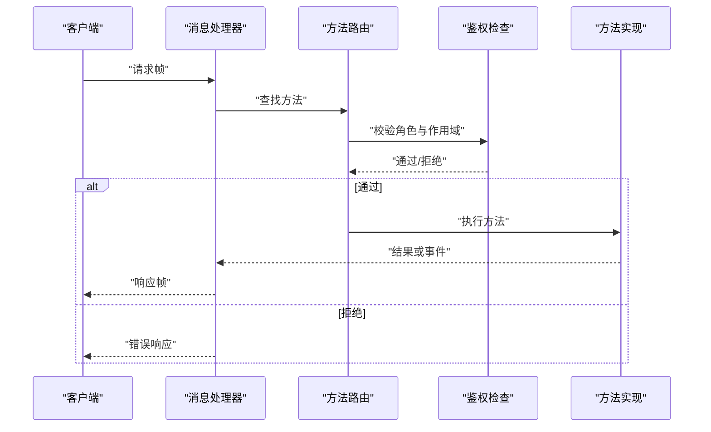
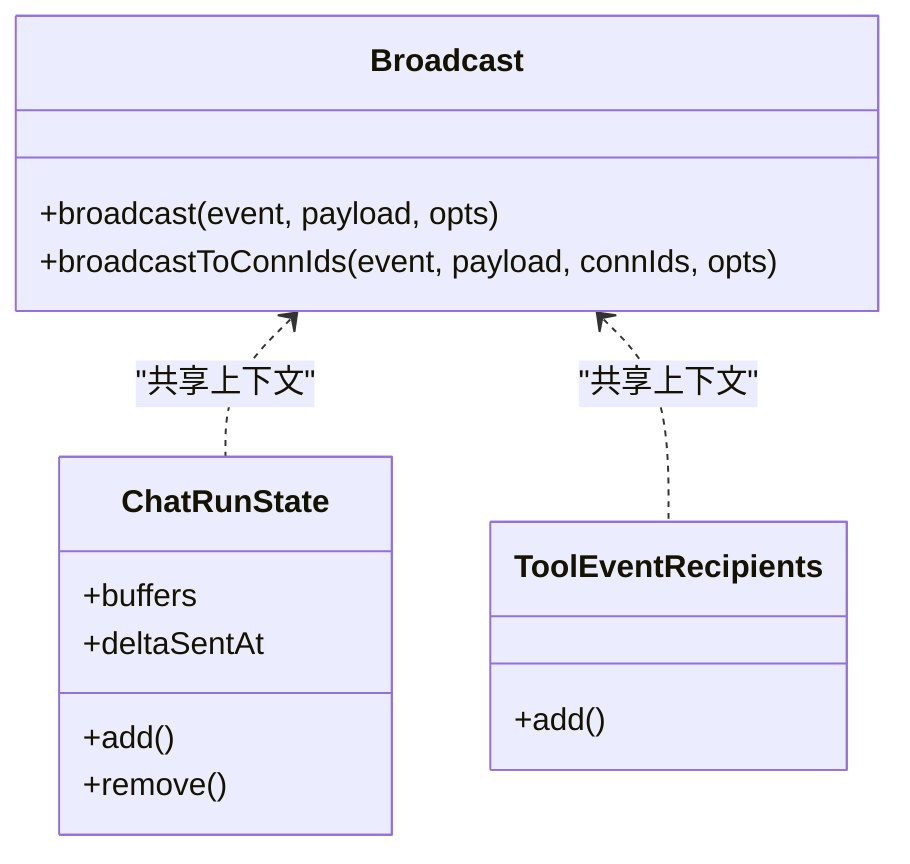
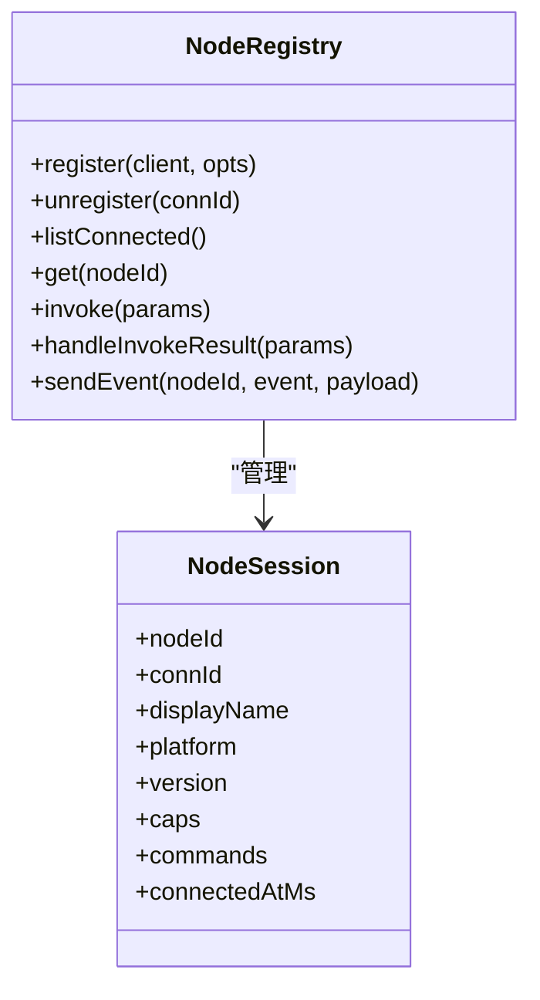
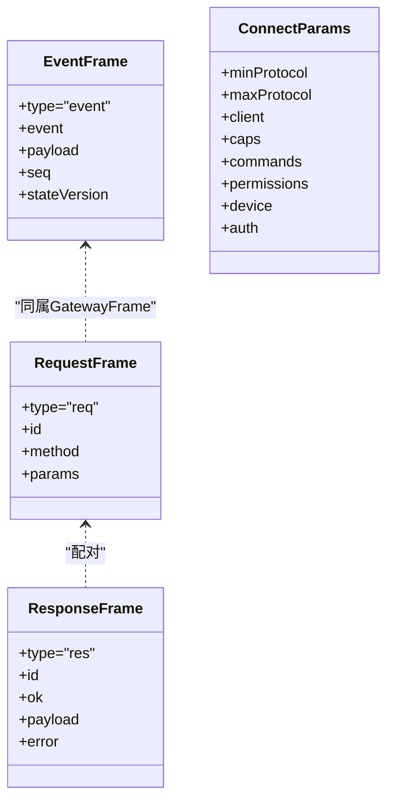
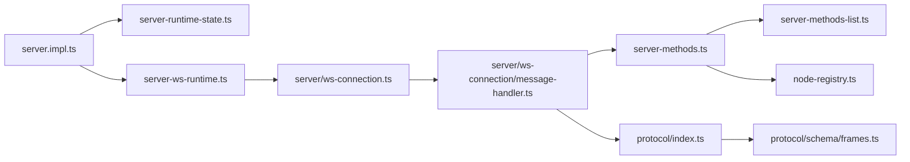

# 网关控制平面

<cite>
**本文引用的文件**
- [src/gateway/server.impl.ts](file://src/gateway/server.impl.ts)
- [src/gateway/server.ts](file://src/gateway/server.ts)
- [src/gateway/server-ws-runtime.ts](file://src/gateway/server-ws-runtime.ts)
- [src/gateway/server/ws-connection.ts](file://src/gateway/server/ws-connection.ts)
- [src/gateway/server/ws-connection/message-handler.ts](file://src/gateway/server/ws-connection/message-handler.ts)
- [src/gateway/server-runtime-state.ts](file://src/gateway/server-runtime-state.ts)
- [src/gateway/server-methods.ts](file://src/gateway/server-methods.ts)
- [src/gateway/server-methods-list.ts](file://src/gateway/server-methods-list.ts)
- [src/gateway/protocol/index.ts](file://src/gateway/protocol/index.ts)
- [src/gateway/protocol/schema.ts](file://src/gateway/protocol/schema.ts)
- [src/gateway/protocol/schema/frames.ts](file://src/gateway/protocol/schema/frames.ts)
- [src/gateway/server/ws-types.ts](file://src/gateway/server/ws-types.ts)
- [src/gateway/node-registry.ts](file://src/gateway/node-registry.ts)
</cite>

## 目录

1. [简介](#简介)
2. [项目结构](#项目结构)
3. [核心组件](#核心组件)
4. [架构总览](#架构总览)
5. [详细组件分析](#详细组件分析)
6. [依赖关系分析](#依赖关系分析)
7. [性能考量](#性能考量)
8. [故障排查指南](#故障排查指南)
9. [结论](#结论)
10. [附录](#附录)

## 简介

本文件面向OpenClaw网关控制平面，系统性阐述其作为单一控制平面如何协调客户端、工具与事件：包括WebSocket连接处理、消息路由、会话生命周期管理、节点注册与事件广播等。文档覆盖协议设计（握手、帧模型、鉴权与配对）、运行时状态管理、事件路由与广播、以及配置项与性能优化策略，并提供可追溯的源码路径以便开发者快速定位实现细节。

## 项目结构

OpenClaw网关控制平面位于src/gateway目录下，采用“按职责分层+按功能模块聚合”的组织方式：

- 协议层：定义请求/响应/事件帧、参数校验与错误码，确保跨客户端一致性
- 运行时层：启动HTTP/WebSocket服务、插件与钩子、维护全局状态与广播通道
- 连接层：处理WebSocket升级、鉴权、握手、消息解析与回包
- 方法层：实现具体方法（如聊天、会话、节点、技能、配置等）并进行权限控制
- 节点层：节点注册、命令下发、结果回调与订阅管理

图表来源

- [src/gateway/server.impl.ts](file://src/gateway/server.impl.ts#L157-L667)
- [src/gateway/server-runtime-state.ts](file://src/gateway/server-runtime-state.ts#L29-L211)
- [src/gateway/server-ws-runtime.ts](file://src/gateway/server-ws-runtime.ts#L8-L50)
- [src/gateway/server/ws-connection.ts](file://src/gateway/server/ws-connection.ts#L19-L267)
- [src/gateway/server/ws-connection/message-handler.ts](file://src/gateway/server/ws-connection/message-handler.ts#L133-L1004)
- [src/gateway/server-methods-list.ts](file://src/gateway/server-methods-list.ts#L1-L118)
- [src/gateway/server-methods.ts](file://src/gateway/server-methods.ts#L1-L220)
- [src/gateway/node-registry.ts](file://src/gateway/node-registry.ts#L38-L210)
- [src/gateway/protocol/index.ts](file://src/gateway/protocol/index.ts#L1-L603)
- [src/gateway/protocol/schema.ts](file://src/gateway/protocol/schema.ts#L1-L17)
- [src/gateway/protocol/schema/frames.ts](file://src/gateway/protocol/schema/frames.ts#L1-L165)

章节来源

- [src/gateway/server.impl.ts](file://src/gateway/server.impl.ts#L157-L667)
- [src/gateway/server-runtime-state.ts](file://src/gateway/server-runtime-state.ts#L29-L211)

## 核心组件

- 启动器与运行时
  - 启动器负责读取配置、加载插件、构建运行时状态、挂载HTTP/WS、注册发现与心跳、启动侧车服务等
  - 运行时状态封装WebSocketServer、HTTP服务器集合、客户端集合、广播器、聊天运行时、去重与工具事件接收者等
- 连接与握手
  - 处理WebSocket升级、鉴权（令牌/密码/Tailscale/设备签名）、设备配对、角色与作用域校验、握手超时与关闭原因记录
- 方法与鉴权
  - 统一方法清单与鉴权规则，区分operator/node角色与read/write/admin/scopes等授权维度
- 节点注册与事件
  - 节点注册表维护节点会话、命令能力、invoke请求/响应、事件派发与订阅管理

章节来源

- [src/gateway/server.ts](file://src/gateway/server.ts#L1-L4)
- [src/gateway/server.impl.ts](file://src/gateway/server.impl.ts#L157-L667)
- [src/gateway/server-runtime-state.ts](file://src/gateway/server-runtime-state.ts#L29-L211)
- [src/gateway/server-ws-runtime.ts](file://src/gateway/server-ws-runtime.ts#L8-L50)
- [src/gateway/server/ws-connection.ts](file://src/gateway/server/ws-connection.ts#L19-L267)
- [src/gateway/server/ws-connection/message-handler.ts](file://src/gateway/server/ws-connection/message-handler.ts#L133-L1004)
- [src/gateway/server-methods-list.ts](file://src/gateway/server-methods-list.ts#L1-L118)
- [src/gateway/server-methods.ts](file://src/gateway/server-methods.ts#L1-L220)
- [src/gateway/node-registry.ts](file://src/gateway/node-registry.ts#L38-L210)

## 架构总览

下图展示从客户端到方法处理再到节点与事件的端到端流程，以及运行时状态与广播通道的角色。

图表来源

- [src/gateway/server-ws-runtime.ts](file://src/gateway/server-ws-runtime.ts#L8-L50)
- [src/gateway/server/ws-connection.ts](file://src/gateway/server/ws-connection.ts#L61-L267)
- [src/gateway/server/ws-connection/message-handler.ts](file://src/gateway/server/ws-connection/message-handler.ts#L234-L1004)
- [src/gateway/server-methods.ts](file://src/gateway/server-methods.ts#L193-L220)
- [src/gateway/node-registry.ts](file://src/gateway/node-registry.ts#L107-L155)
- [src/gateway/server-runtime-state.ts](file://src/gateway/server-runtime-state.ts#L110-L112)

## 详细组件分析

### WebSocket连接与握手

- 升级与握手
  - 生成随机nonce并通过connect.challenge通知客户端；在握手超时时间内完成鉴权与配对
  - 记录连接元信息（远端地址、X-Forwarded-\*、User-Agent、Host等），用于审计与诊断
- 鉴权与配对
  - 支持令牌/密码/设备签名/Tailscale等多种鉴权方式；设备签名需匹配公钥、时间戳偏差限制、nonce一致性
  - 控制台UI与WebChat在特定条件下允许宽松鉴权策略
  - 设备未配对时触发配对请求，支持静默配对与交互式配对
- 角色与作用域
  - operator与node两类角色；node仅能调用受限方法；operator按read/write/admin与具体scope授权
- 关闭与清理
  - 记录关闭原因、握手状态、最后帧元数据；更新系统存在性状态并广播presence

图表来源

- [src/gateway/server/ws-connection.ts](file://src/gateway/server/ws-connection.ts#L61-L267)
- [src/gateway/server/ws-connection/message-handler.ts](file://src/gateway/server/ws-connection/message-handler.ts#L264-L782)

章节来源

- [src/gateway/server.ws-connection.ts](file://src/gateway/server/ws-connection.ts#L19-L267)
- [src/gateway/server/ws-connection/message-handler.ts](file://src/gateway/server/ws-connection/message-handler.ts#L133-L1004)

### 消息路由与方法执行

- 方法路由
  - 基于方法名路由至核心方法实现或插件扩展；未知方法返回INVALID_REQUEST
- 权限控制
  - 依据角色与作用域进行细粒度授权；admin前缀与特定方法集需要管理员权限
- 错误处理
  - 使用统一错误形状与错误码，支持details、retryable、retryAfterMs等字段

图表来源

- [src/gateway/server-methods.ts](file://src/gateway/server-methods.ts#L193-L220)
- [src/gateway/server-methods-list.ts](file://src/gateway/server-methods-list.ts#L93-L118)

章节来源

- [src/gateway/server-methods.ts](file://src/gateway/server-methods.ts#L1-L220)
- [src/gateway/server-methods-list.ts](file://src/gateway/server-methods-list.ts#L1-L118)

### 会话管理与事件广播

- 广播器
  - 提供向所有客户端或指定连接ID集合广播的能力，支持dropIfSlow与stateVersion以优化性能与一致性
- 聊天运行时
  - 维护会话级运行状态、缓冲区与增量发送时间，支持中止控制器与工具事件接收者注册
- 去重与幂等
  - 基于键值的去重条目，避免重复处理

图表来源

- [src/gateway/server-runtime-state.ts](file://src/gateway/server-runtime-state.ts#L58-L88)

章节来源

- [src/gateway/server-runtime-state.ts](file://src/gateway/server-runtime-state.ts#L29-L211)

### 节点注册与事件派发

- 注册表
  - 维护节点会话（按nodeId与connId双向映射）、命令能力、权限与环境变量；支持invoke请求/响应的超时与去重
- 事件派发
  - 将事件直接发送给节点会话；支持节点间订阅与广播

图表来源

- [src/gateway/node-registry.ts](file://src/gateway/node-registry.ts#L38-L210)

章节来源

- [src/gateway/node-registry.ts](file://src/gateway/node-registry.ts#L38-L210)

### 协议设计与消息格式

- 帧模型
  - 请求帧：type="req"，包含id、method、params
  - 响应帧：type="res"，包含id、ok、payload或error
  - 事件帧：type="event"，包含event、payload、seq、stateVersion
- 参数校验
  - 使用Ajv与TypeBox Schema对各方法参数进行严格校验，提供可读的验证错误信息
- 错误码与错误形状
  - 统一错误形状包含code、message、details、retryable、retryAfterMs等字段

图表来源

- [src/gateway/protocol/schema/frames.ts](file://src/gateway/protocol/schema/frames.ts#L126-L165)
- [src/gateway/protocol/schema/frames.ts](file://src/gateway/protocol/schema/frames.ts#L20-L68)

章节来源

- [src/gateway/protocol/index.ts](file://src/gateway/protocol/index.ts#L1-L603)
- [src/gateway/protocol/schema.ts](file://src/gateway/protocol/schema.ts#L1-L17)
- [src/gateway/protocol/schema/frames.ts](file://src/gateway/protocol/schema/frames.ts#L1-L165)

## 依赖关系分析

- 启动器依赖运行时状态、HTTP/WS服务器、插件与钩子、发现与心跳、Tailscale暴露等子系统
- 连接层依赖协议校验、鉴权、配对、健康与存在性状态
- 方法层依赖节点注册表、聊天运行时、广播器、去重与工具事件接收者
- 协议层为所有上层提供类型安全的参数校验与错误处理

图表来源

- [src/gateway/server.impl.ts](file://src/gateway/server.impl.ts#L157-L667)
- [src/gateway/server-runtime-state.ts](file://src/gateway/server-runtime-state.ts#L29-L211)
- [src/gateway/server-ws-runtime.ts](file://src/gateway/server-ws-runtime.ts#L8-L50)
- [src/gateway/server/ws-connection.ts](file://src/gateway/server/ws-connection.ts#L19-L267)
- [src/gateway/server/ws-connection/message-handler.ts](file://src/gateway/server/ws-connection/message-handler.ts#L133-L1004)
- [src/gateway/server-methods.ts](file://src/gateway/server-methods.ts#L1-L220)
- [src/gateway/server-methods-list.ts](file://src/gateway/server-methods-list.ts#L1-L118)
- [src/gateway/node-registry.ts](file://src/gateway/node-registry.ts#L38-L210)
- [src/gateway/protocol/index.ts](file://src/gateway/protocol/index.ts#L1-L603)
- [src/gateway/protocol/schema/frames.ts](file://src/gateway/protocol/schema/frames.ts#L1-L165)

章节来源

- [src/gateway/server.impl.ts](file://src/gateway/server.impl.ts#L157-L667)
- [src/gateway/server-methods.ts](file://src/gateway/server-methods.ts#L1-L220)

## 性能考量

- 广播优化
  - 使用dropIfSlow在高负载时丢弃过慢目标，保障整体吞吐
  - 使用stateVersion与seq减少不必要的重复传输
- 聊天流控
  - 维护buffers与deltaSentAt，避免重复与过度刷新
- 去重与幂等
  - 基于键值的去重条目，降低重复处理开销
- 连接与握手
  - 握手超时阈值与错误快速关闭，避免资源占用
- 代理与本地检测
  - 严格的代理头与本地地址判定，防止误判导致的鉴权绕过与日志噪声

[本节为通用指导，无需列出章节来源]

## 故障排查指南

- 常见握手失败
  - 协议版本不兼容、角色非法、来源不允许、设备签名无效、配对缺失
  - 可通过日志中的close原因、握手状态与最后帧元数据定位问题
- 鉴权失败
  - 令牌/密码/Tailscale身份缺失或不匹配；设备未配对或权限不足
  - 检查配置与客户端参数，确认allowedOrigins与trustedProxies设置
- 节点离线
  - 查看节点注册表中是否存在该节点；检查节点invoke超时与结果回调
- 广播异常
  - 检查dropIfSlow策略与stateVersion是否合理；确认客户端连接状态

章节来源

- [src/gateway/server/ws-connection.ts](file://src/gateway/server/ws-connection.ts#L153-L216)
- [src/gateway/server/ws-connection/message-handler.ts](file://src/gateway/server/ws-connection/message-handler.ts#L428-L782)
- [src/gateway/node-registry.ts](file://src/gateway/node-registry.ts#L107-L155)

## 结论

OpenClaw网关控制平面通过严谨的协议设计、完善的鉴权与配对机制、灵活的方法路由与权限控制、以及高效的广播与会话管理，实现了对客户端、工具与事件的统一协调。其模块化架构便于扩展与维护，同时提供了丰富的配置与可观测性能力，适合在多平台与多场景下部署与演进。

[本节为总结性内容，无需列出章节来源]

## 附录

### 协议与方法参考

- 协议版本与帧模型
  - 参考路径：[协议索引](file://src/gateway/protocol/index.ts#L1-L603)、[帧定义](file://src/gateway/protocol/schema/frames.ts#L126-L165)
- 方法清单与鉴权规则
  - 参考路径：[方法清单](file://src/gateway/server-methods-list.ts#L1-L118)、[鉴权与路由](file://src/gateway/server-methods.ts#L193-L220)
- WebSocket类型
  - 参考路径：[WebSocket类型](file://src/gateway/server/ws-types.ts#L1-L11)

章节来源

- [src/gateway/protocol/index.ts](file://src/gateway/protocol/index.ts#L1-L603)
- [src/gateway/protocol/schema/frames.ts](file://src/gateway/protocol/schema/frames.ts#L126-L165)
- [src/gateway/server-methods-list.ts](file://src/gateway/server-methods-list.ts#L1-L118)
- [src/gateway/server-methods.ts](file://src/gateway/server-methods.ts#L193-L220)
- [src/gateway/server/ws-types.ts](file://src/gateway/server/ws-types.ts#L1-L11)
