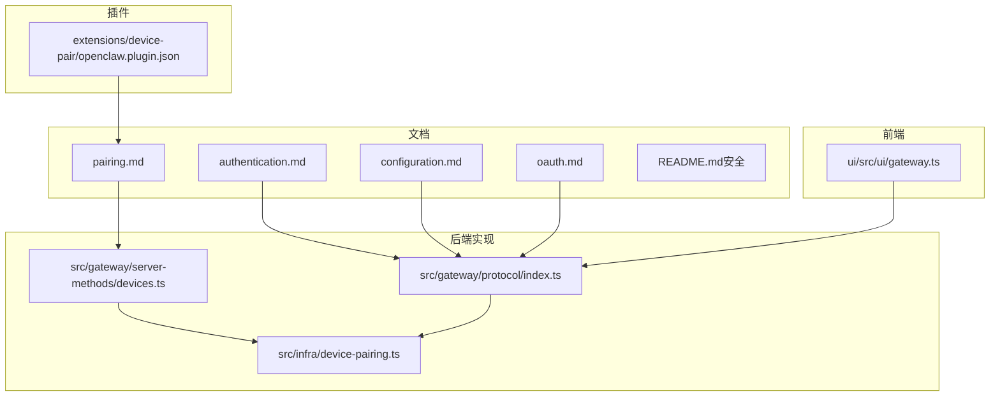
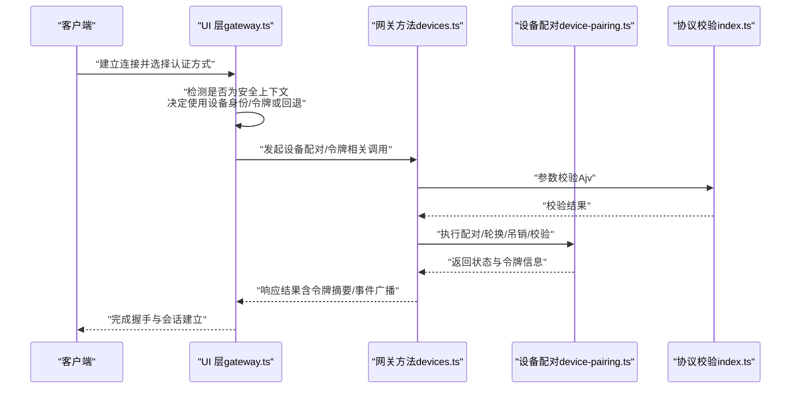
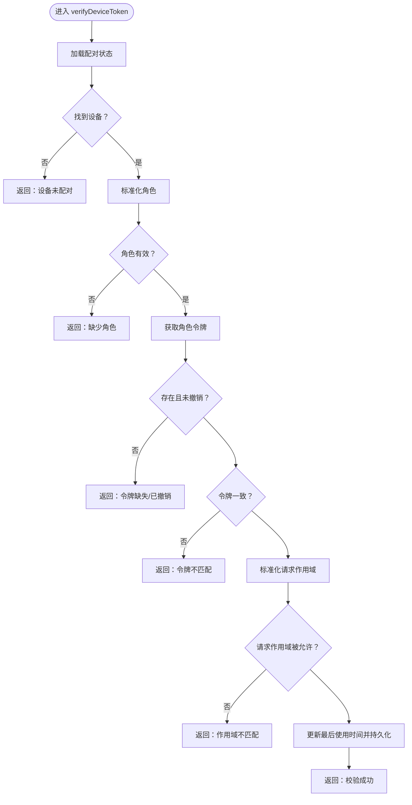
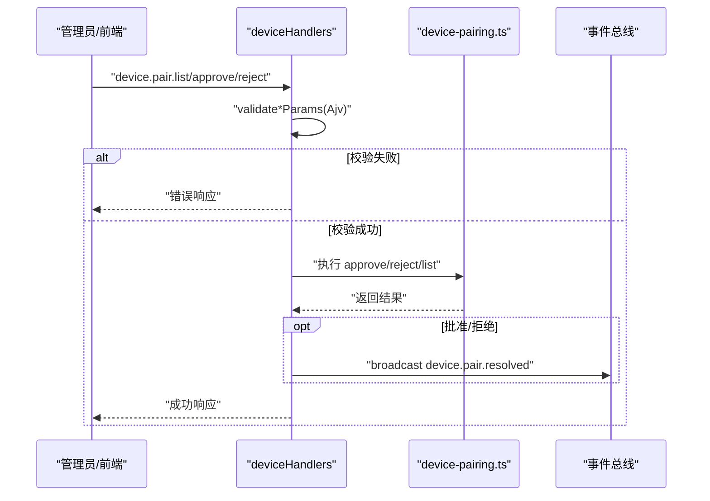
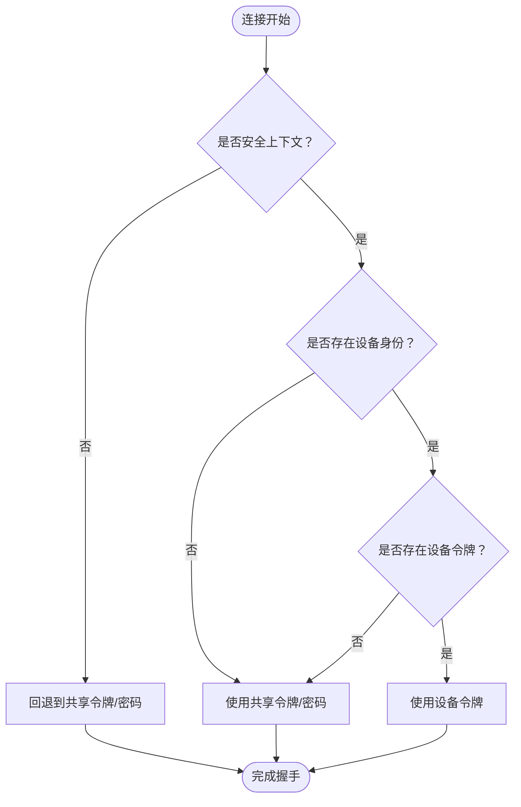
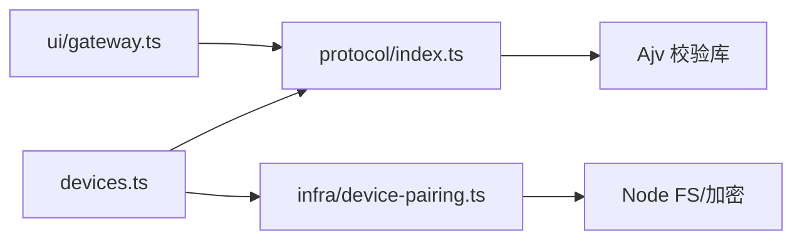

# 网关认证与授权

<cite>
**本文引用的文件**
- [authentication.md](file://docs/gateway/authentication.md)
- [pairing.md](file://docs/gateway/pairing.md)
- [configuration.md](file://docs/gateway/configuration.md)
- [README.md（安全）](file://docs/security/README.md)
- [oauth.md](file://docs/concepts/oauth.md)
- [device-pairing.ts](file://src/infra/device-pairing.ts)
- [devices.ts](file://src/gateway/server-methods/devices.ts)
- [index.ts（协议）](file://src/gateway/protocol/index.ts)
- [gateway.ts（UI）](file://ui/src/ui/gateway.ts)
- [openclaw.plugin.json（设备配对插件）](file://extensions/device-pair/openclaw.plugin.json)
</cite>

## 目录

1. [简介](#简介)
2. [项目结构](#项目结构)
3. [核心组件](#核心组件)
4. [架构总览](#架构总览)
5. [详细组件分析](#详细组件分析)
6. [依赖关系分析](#依赖关系分析)
7. [性能考量](#性能考量)
8. [故障排查指南](#故障排查指南)
9. [结论](#结论)
10. [附录：配置与最佳实践](#附录配置与最佳实践)

## 简介

本技术文档聚焦于 OpenClaw 网关的“认证与授权”体系，覆盖设备认证机制、访问控制策略、权限验证流程与安全策略实施。内容包括：

- 设备配对流程与令牌管理
- 会话验证与安全边界控制
- 多设备认证、权限继承与安全审计
- 认证配置选项、权限模型与安全最佳实践
- 实际安全配置示例与认证流程图解

## 项目结构

围绕认证与授权的关键目录与文件如下：

- 文档层：认证与配对说明、配置参考、OAuth 概念
- 核心实现层：设备配对状态机与令牌校验、网关方法处理、协议参数校验
- 前端集成层：UI 中的设备身份与令牌选择逻辑
- 插件层：设备配对插件的配置模式与提示

**图表来源**

- [authentication.md](file://docs/gateway/authentication.md#L1-L146)
- [pairing.md](file://docs/gateway/pairing.md#L1-L100)
- [configuration.md](file://docs/gateway/configuration.md#L1-L483)
- [oauth.md](file://docs/concepts/oauth.md#L1-L146)
- [device-pairing.ts](file://src/infra/device-pairing.ts#L1-L560)
- [devices.ts](file://src/gateway/server-methods/devices.ts#L1-L191)
- [index.ts（协议）](file://src/gateway/protocol/index.ts#L1-L603)
- [gateway.ts（UI）](file://ui/src/ui/gateway.ts#L139-L175)
- [openclaw.plugin.json（设备配对插件）](file://extensions/device-pair/openclaw.plugin.json#L1-L20)

**章节来源**

- [authentication.md](file://docs/gateway/authentication.md#L1-L146)
- [pairing.md](file://docs/gateway/pairing.md#L1-L100)
- [configuration.md](file://docs/gateway/configuration.md#L1-L483)
- [oauth.md](file://docs/concepts/oauth.md#L1-L146)
- [README.md（安全）](file://docs/security/README.md#L1-L18)

## 核心组件

- 设备配对与令牌管理（后端）
  - 设备配对状态机：待审批请求、已配对设备、令牌集合
  - 令牌生命周期：生成、轮换、吊销、校验、使用时间更新
- 网关方法（RPC）
  - 列表、批准、拒绝、轮换、吊销等设备配对相关方法
  - 参数校验与错误响应
- 协议与参数校验
  - 使用 Ajv 对请求参数进行严格校验
  - 统一错误格式化输出
- 前端集成
  - 在安全上下文中优先使用设备身份与设备令牌；否则回退到共享令牌或密码
- 插件配置
  - 设备配对插件支持通过公共 URL 配置，用于生成配对码与审批

**章节来源**

- [device-pairing.ts](file://src/infra/device-pairing.ts#L1-L560)
- [devices.ts](file://src/gateway/server-methods/devices.ts#L1-L191)
- [index.ts（协议）](file://src/gateway/protocol/index.ts#L1-L603)
- [gateway.ts（UI）](file://ui/src/ui/gateway.ts#L139-L175)
- [openclaw.plugin.json（设备配对插件）](file://extensions/device-pair/openclaw.plugin.json#L1-L20)

## 架构总览

下图展示从客户端发起连接到服务端完成设备认证与令牌校验的整体流程。

**图表来源**

- [gateway.ts（UI）](file://ui/src/ui/gateway.ts#L139-L175)
- [devices.ts](file://src/gateway/server-methods/devices.ts#L1-L191)
- [index.ts（协议）](file://src/gateway/protocol/index.ts#L1-L603)
- [device-pairing.ts](file://src/infra/device-pairing.ts#L1-L560)

## 详细组件分析

### 设备配对与令牌管理（后端）

- 状态存储
  - 待审批请求与已配对设备分别持久化至独立文件，自动清理过期请求
  - 文件写入采用原子重命名，确保一致性与权限设置
- 角色与作用域
  - 支持为不同角色（如 operator）分配作用域集合，令牌校验时进行包含性检查
  - 合并现有角色与作用域，避免重复与遗漏
- 令牌生命周期
  - 生成：随机 UUID 规范化为无连字符字符串
  - 轮换：生成新令牌并记录轮换时间，可选同步更新设备级作用域
  - 吊销：标记撤销时间，后续校验失败
  - 校验：设备存在、角色存在、未撤销、令牌一致、作用域包含
  - 使用追踪：每次校验更新最后使用时间
- 并发控制
  - 全局锁保证状态变更的串行化，避免竞态

**图表来源**

- [device-pairing.ts](file://src/infra/device-pairing.ts#L411-L449)

**章节来源**

- [device-pairing.ts](file://src/infra/device-pairing.ts#L1-L560)

### 网关方法（RPC）

- 方法清单
  - 列出待审批与已配对设备
  - 批准/拒绝设备配对请求（触发事件广播）
  - 轮换/吊销设备令牌（记录日志与返回最新状态）
- 参数校验
  - 使用 Ajv Schema 对每个方法的参数进行严格校验
  - 错误统一格式化输出，便于前端与运维定位问题
- 安全事件
  - 批准/拒绝后广播事件，便于 UI 与自动化系统感知

**图表来源**

- [devices.ts](file://src/gateway/server-methods/devices.ts#L32-L191)
- [index.ts（协议）](file://src/gateway/protocol/index.ts#L330-L344)

**章节来源**

- [devices.ts](file://src/gateway/server-methods/devices.ts#L1-L191)
- [index.ts（协议）](file://src/gateway/protocol/index.ts#L1-L603)

### 前端认证选择与回退策略

- 安全上下文检测
  - 在 HTTPS 或本地回环环境下启用设备身份与设备令牌
  - 在非安全上下文下，若未开启允许不安全认证，则回退到共享令牌或密码
- 设备令牌优先
  - 若存在设备身份与对应角色令牌，优先使用设备令牌
  - 可在同时存在共享令牌时进行“令牌回退”策略（取决于配置）
- UI 行为
  - 记录最后一次认证来源，便于调试与审计

**图表来源**

- [gateway.ts（UI）](file://ui/src/ui/gateway.ts#L139-L175)

**章节来源**

- [gateway.ts（UI）](file://ui/src/ui/gateway.ts#L139-L175)

### 设备配对插件与公共 URL

- 插件配置
  - 提供 publicUrl 字段，用于生成配对码与审批入口
  - UI 提示明确用途，便于用户理解配对流程
- 与配对文档协同
  - 插件与配对文档共同定义“网关拥有”的配对模式与存储位置

**章节来源**

- [openclaw.plugin.json（设备配对插件）](file://extensions/device-pair/openclaw.plugin.json#L1-L20)
- [pairing.md](file://docs/gateway/pairing.md#L1-L100)

## 依赖关系分析

- 组件耦合
  - 网关方法依赖协议校验模块与设备配对基础设施
  - 设备配对基础设施依赖状态目录解析与安全比较函数
  - 前端依赖协议与设备配对状态，以决定认证路径
- 外部依赖
  - Ajv 用于参数校验
  - Node 加密与文件系统用于令牌生成与状态持久化
- 潜在循环依赖
  - 当前模块划分清晰，未见循环导入迹象

**图表来源**

- [devices.ts](file://src/gateway/server-methods/devices.ts#L1-L20)
- [index.ts（协议）](file://src/gateway/protocol/index.ts#L1-L20)
- [device-pairing.ts](file://src/infra/device-pairing.ts#L1-L10)
- [gateway.ts（UI）](file://ui/src/ui/gateway.ts#L139-L175)

**章节来源**

- [devices.ts](file://src/gateway/server-methods/devices.ts#L1-L20)
- [index.ts（协议）](file://src/gateway/protocol/index.ts#L1-L20)
- [device-pairing.ts](file://src/infra/device-pairing.ts#L1-L10)
- [gateway.ts（UI）](file://ui/src/ui/gateway.ts#L139-L175)

## 性能考量

- 并发与锁
  - 使用全局锁保护状态文件读写，避免并发冲突；建议在高并发场景下评估锁粒度优化
- 文件 I/O
  - 写入采用临时文件 + 原子重命名，减少部分写入风险；注意磁盘性能与权限设置
- 校验开销
  - Ajv 校验在高频请求中可能成为瓶颈，建议结合缓存与限流策略
- 作用域检查
  - scopesAllow 为线性检查，建议在作用域数量较多时考虑索引优化

## 故障排查指南

- 常见错误与定位
  - 参数无效：检查 Ajv 校验错误消息，确认字段类型与必填项
  - 设备未配对：确认配对请求是否过期（默认 5 分钟），或是否已被批准/拒绝
  - 令牌不匹配/撤销：核对设备 ID、角色与作用域，必要时轮换或吊销令牌
  - 非安全上下文：在 HTTP 环境下需启用允许不安全认证或改用 HTTPS
- 运维建议
  - 定期轮换令牌，限制令牌有效期
  - 启用事件广播与日志，便于审计与问题复现
  - 使用插件提供的公共 URL 作为配对入口，确保网络可达性

**章节来源**

- [devices.ts](file://src/gateway/server-methods/devices.ts#L34-L45)
- [device-pairing.ts](file://src/infra/device-pairing.ts#L69-L117)
- [gateway.ts（UI）](file://ui/src/ui/gateway.ts#L139-L142)

## 结论

OpenClaw 的网关认证与授权体系以“设备配对 + 令牌管理 + 协议校验 + 前端回退策略”为核心，形成完整的安全边界控制链路。通过严谨的状态持久化、并发控制与参数校验，系统在易用性与安全性之间取得平衡。建议在生产环境中结合配置参考与安全文档，完善令牌轮换、作用域最小化与审计策略。

## 附录：配置与最佳实践

### 认证配置选项与权限模型

- 网关认证模式
  - 支持令牌、密码等多种认证方式，可通过配置与 UI 选择
- 设备配对
  - 使用设备身份与角色令牌，支持多角色与作用域继承
  - 令牌轮换与吊销可按需执行，避免长期有效令牌带来的风险
- OAuth 与模型认证
  - 支持多种提供商的 OAuth 与 API Key，建议使用短期刷新与多账户配置
- 配置热重载
  - 大多数配置变更可热应用，关键变更（如端口、TLS）需要重启

**章节来源**

- [configuration.md](file://docs/gateway/configuration.md#L1-L483)
- [authentication.md](file://docs/gateway/authentication.md#L1-L146)
- [oauth.md](file://docs/concepts/oauth.md#L1-L146)

### 多设备认证与权限继承

- 多设备接入
  - 通过设备配对列表与批准流程，实现多设备受控接入
- 权限继承
  - 已配对设备的角色与作用域可合并继承，避免重复授权
- 令牌管理
  - 为不同角色生成独立令牌，支持按角色轮换与吊销

**章节来源**

- [pairing.md](file://docs/gateway/pairing.md#L1-L100)
- [device-pairing.ts](file://src/infra/device-pairing.ts#L297-L347)

### 安全审计与合规

- 审计要点
  - 记录配对请求创建、批准/拒绝、令牌轮换与吊销事件
  - 记录最后使用时间，便于追踪异常登录
- 合规建议
  - 令牌最小化暴露（仅在安全上下文传输）
  - 定期审查配对列表与令牌状态
  - 使用 HTTPS 与严格的访问控制策略

**章节来源**

- [README.md（安全）](file://docs/security/README.md#L1-L18)
- [devices.ts](file://src/gateway/server-methods/devices.ts#L77-L89)
