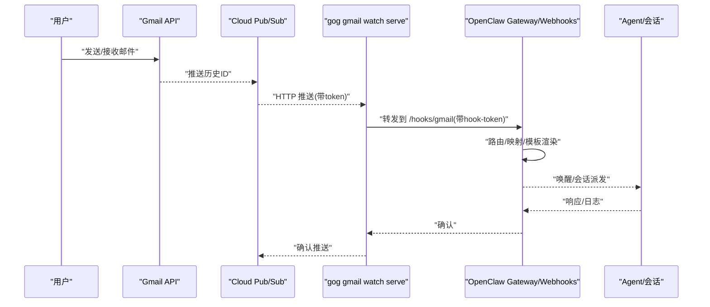
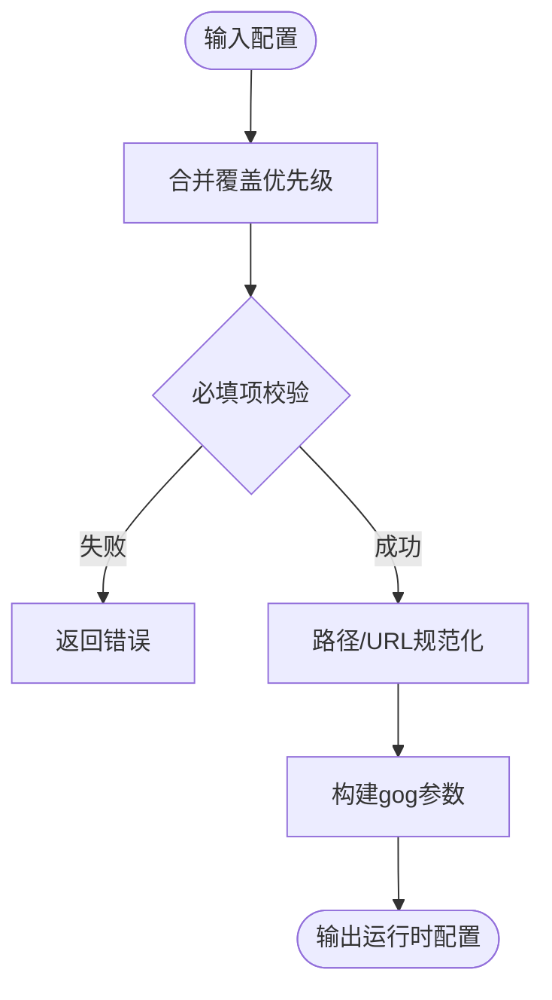
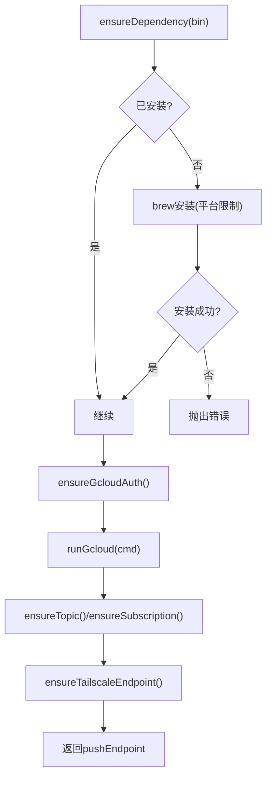
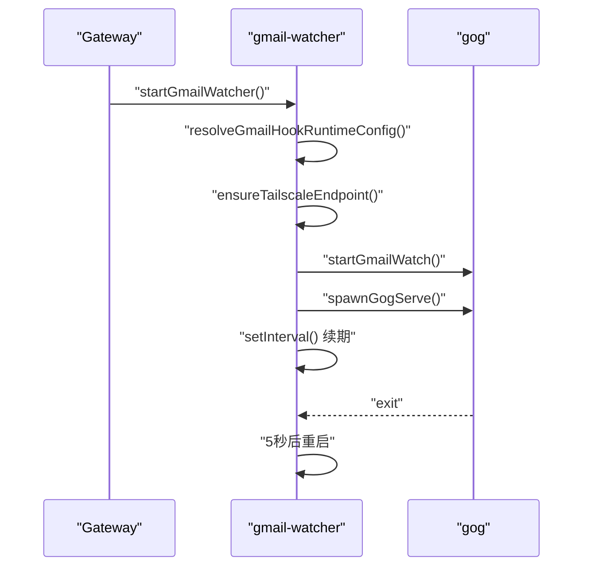
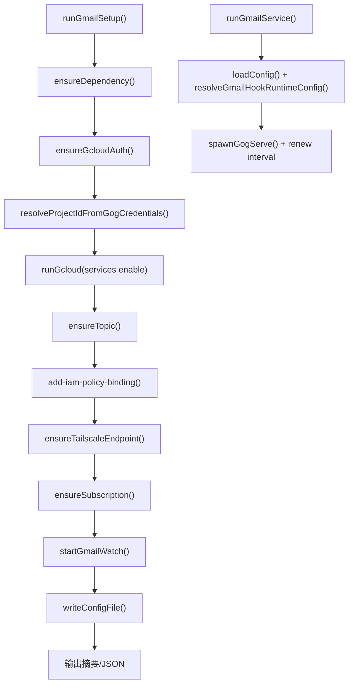
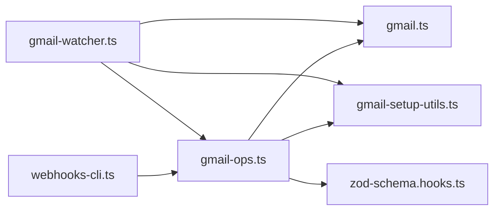

# Gmail Pub/Sub监听

<cite>
**本文引用的文件**
- [gmail-pubsub.md](file://docs/automation/gmail-pubsub.md)
- [gmail.ts](file://src/hooks/gmail.ts)
- [gmail-setup-utils.ts](file://src/hooks/gmail-setup-utils.ts)
- [gmail-watcher.ts](file://src/hooks/gmail-watcher.ts)
- [gmail-ops.ts](file://src/hooks/gmail-ops.ts)
- [webhooks-cli.ts](file://src/cli/webhooks-cli.ts)
- [zod-schema.hooks.ts](file://src/config/zod-schema.hooks.ts)
- [gmail-setup-utils.test.ts](file://src/hooks/gmail-setup-utils.test.ts)
- [gmail-watcher.test.ts](file://src/hooks/gmail-watcher.test.ts)
- [gmail.test.ts](file://src/hooks/gmail.test.ts)
</cite>

## 目录
1. [简介](#简介)
2. [项目结构](#项目结构)
3. [核心组件](#核心组件)
4. [架构总览](#架构总览)
5. [详细组件分析](#详细组件分析)
6. [依赖关系分析](#依赖关系分析)
7. [性能考虑](#性能考虑)
8. [故障排查指南](#故障排查指南)
9. [结论](#结论)
10. [附录](#附录)

## 简介
本技术文档聚焦于OpenClaw的Gmail Pub/Sub监听能力，围绕以下目标展开：
- 基于Google Cloud Pub/Sub的Gmail实时监听与增量同步
- Gmail事件的过滤、解析与派发至OpenClaw Webhooks
- Gmail API认证、权限与配额管理
- 配置步骤、安全加固与性能调优
- 事件解析、附件提取与邮件归档策略
- 实战示例、常见问题排查与最佳实践

该能力通过gogcli驱动Gmail Watch注册与推送，结合OpenClaw的Webhook路由与会话派发，形成从“Gmail事件”到“Agent唤醒/消息投递”的完整闭环。

## 项目结构
与Gmail Pub/Sub监听直接相关的模块分布如下：
- CLI层：提供一键化设置与运行命令
- 配置与类型：定义hooks.gmail配置结构与校验
- 工具与封装：GCP/G Suite工具链封装、Tailscale端点管理
- 监听器：自动拉起gog服务、周期性续期watch
- 核心逻辑：参数解析、命令构建、路径与令牌规范化

```mermaid
graph TB
subgraph "CLI"
CLI["webhooks-cli.ts<br/>命令入口"]
end
subgraph "配置与类型"
CFG["zod-schema.hooks.ts<br/>hooks.gmail类型定义"]
GMDEF["gmail.ts<br/>默认值/路径/令牌/参数构建"]
end
subgraph "工具与封装"
SETUP["gmail-setup-utils.ts<br/>gcloud/tailscale/gog封装"]
OPS["gmail-ops.ts<br/>setup/run主流程"]
WATCH["gmail-watcher.ts<br/>自动启动/续期/重启"]
end
subgraph "外部系统"
GCP["GCP Pub/Sub"]
GMAIL["Gmail API"]
TAIL["Tailscale Funnel/Serve"]
GW["OpenClaw Gateway/Webhooks"]
end
CLI --> OPS
OPS --> SETUP
OPS --> GMDEF
WATCH --> GMDEF
SETUP --> GCP
SETUP --> TAIL
OPS --> GMAIL
OPS --> GW
WATCH --> GMAIL
WATCH --> GW
```

图表来源
- [webhooks-cli.ts](file://src/cli/webhooks-cli.ts#L23-L134)
- [gmail-ops.ts](file://src/hooks/gmail-ops.ts#L90-L281)
- [gmail-setup-utils.ts](file://src/hooks/gmail-setup-utils.ts#L158-L316)
- [gmail-watcher.ts](file://src/hooks/gmail-watcher.ts#L132-L202)
- [gmail.ts](file://src/hooks/gmail.ts#L100-L206)
- [zod-schema.hooks.ts](file://src/config/zod-schema.hooks.ts#L95-L135)

章节来源
- [webhooks-cli.ts](file://src/cli/webhooks-cli.ts#L23-L134)
- [gmail-ops.ts](file://src/hooks/gmail-ops.ts#L90-L281)
- [gmail-setup-utils.ts](file://src/hooks/gmail-setup-utils.ts#L158-L316)
- [gmail-watcher.ts](file://src/hooks/gmail-watcher.ts#L132-L202)
- [gmail.ts](file://src/hooks/gmail.ts#L100-L206)
- [zod-schema.hooks.ts](file://src/config/zod-schema.hooks.ts#L95-L135)

## 核心组件
- 配置与参数解析
  - 默认值与路径规范：监听绑定地址、端口、路径、最大消息体大小、续期周期等
  - 运行时配置合并：优先级覆盖（命令行覆盖配置文件），缺失项回退默认
- 工具与封装
  - gcloud命令封装：鉴权、项目设置、API启用、Topic/Subscription管理、IAM绑定
  - Tailscale端点：Funnel/Serve模式下自动生成公网URL并注入token
  - gog二进制封装：watch start/serve参数构建与执行
- 监听器服务
  - 自动启动：Gateway启动时按需拉起gog serve，并周期性执行watch start续期
  - 异常处理：端口占用检测、进程退出重试、优雅停止
- CLI命令
  - openclaw webhooks gmail setup：一键完成GCP/Tailscale/gog配置与watch启动
  - openclaw webhooks gmail run：独立运行gog serve与watch续期

章节来源
- [gmail.ts](file://src/hooks/gmail.ts#L100-L206)
- [gmail-setup-utils.ts](file://src/hooks/gmail-setup-utils.ts#L158-L316)
- [gmail-ops.ts](file://src/hooks/gmail-ops.ts#L90-L281)
- [gmail-watcher.ts](file://src/hooks/gmail-watcher.ts#L132-L202)
- [webhooks-cli.ts](file://src/cli/webhooks-cli.ts#L23-L134)

## 架构总览
整体流程从Gmail事件触发开始，经由Pub/Sub推送到gog服务，再由OpenClaw Webhooks路由到Agent或会话派发。



图表来源
- [gmail-pubsub.md](file://docs/automation/gmail-pubsub.md#L9-L257)
- [gmail-ops.ts](file://src/hooks/gmail-ops.ts#L283-L357)
- [gmail-setup-utils.ts](file://src/hooks/gmail-setup-utils.ts#L264-L316)
- [gmail.ts](file://src/hooks/gmail.ts#L208-L251)

## 详细组件分析

### 组件A：配置与参数解析（gmail.ts）
职责与要点
- 默认值与约束：监听绑定、端口、路径、最大字节数、续期分钟数等
- 参数合并策略：hooks.gmail优先，其次配置文件，最后默认值
- 路径与URL规范化：确保hooks路径与serve路径的一致性与兼容（Tailscale场景）
- 命令行参数构建：为gog watch start/serve生成稳定参数



图表来源
- [gmail.ts](file://src/hooks/gmail.ts#L100-L206)
- [gmail.ts](file://src/hooks/gmail.ts#L208-L251)

章节来源
- [gmail.ts](file://src/hooks/gmail.ts#L100-L206)
- [gmail.ts](file://src/hooks/gmail.ts#L208-L251)

### 组件B：GCP与Tailscale工具封装（gmail-setup-utils.ts）
职责与要点
- gcloud封装：鉴权状态检查、项目设置、API启用、Topic/Subscription管理、IAM绑定
- Python环境：在未设置CLOUDSDK_PYTHON时自动探测可用python3/python路径
- Tailscale端点：Funnel/Serve模式下生成公网URL，支持token注入与路径剥离规则
- 错误格式化：统一输出命令返回码、stdout/stderr，便于排障



图表来源
- [gmail-setup-utils.ts](file://src/hooks/gmail-setup-utils.ts#L168-L192)
- [gmail-setup-utils.ts](file://src/hooks/gmail-setup-utils.ts#L194-L214)
- [gmail-setup-utils.ts](file://src/hooks/gmail-setup-utils.ts#L216-L262)
- [gmail-setup-utils.ts](file://src/hooks/gmail-setup-utils.ts#L264-L316)

章节来源
- [gmail-setup-utils.ts](file://src/hooks/gmail-setup-utils.ts#L168-L192)
- [gmail-setup-utils.ts](file://src/hooks/gmail-setup-utils.ts#L194-L214)
- [gmail-setup-utils.ts](file://src/hooks/gmail-setup-utils.ts#L216-L262)
- [gmail-setup-utils.ts](file://src/hooks/gmail-setup-utils.ts#L264-L316)

### 组件C：监听器服务（gmail-watcher.ts）
职责与要点
- 自动启动：Gateway启动时检测hooks.gmail配置，若存在账户则拉起gog serve
- 续期机制：按配置周期调用watch start，保持订阅有效
- 异常处理：检测端口占用、进程退出重试、优雅停止
- 运行状态：暴露运行状态查询接口



图表来源
- [gmail-watcher.ts](file://src/hooks/gmail-watcher.ts#L132-L202)
- [gmail-watcher.ts](file://src/hooks/gmail-watcher.ts#L66-L121)

章节来源
- [gmail-watcher.ts](file://src/hooks/gmail-watcher.ts#L132-L202)
- [gmail-watcher.ts](file://src/hooks/gmail-watcher.ts#L66-L121)

### 组件D：一键设置与运行（gmail-ops.ts）
职责与要点
- setup流程：安装依赖、鉴权、设置项目、启用API、创建/更新Topic与Subscription、配置Tailscale端点、启动watch
- run流程：加载配置、解析运行时参数、可选Tailscale端点、启动watch、拉起gog serve并周期续期
- 配置写入：校验后写回配置文件，输出摘要或JSON



图表来源
- [gmail-ops.ts](file://src/hooks/gmail-ops.ts#L90-L281)
- [gmail-ops.ts](file://src/hooks/gmail-ops.ts#L283-L357)

章节来源
- [gmail-ops.ts](file://src/hooks/gmail-ops.ts#L90-L281)
- [gmail-ops.ts](file://src/hooks/gmail-ops.ts#L283-L357)

### 组件E：CLI命令（webhooks-cli.ts）
职责与要点
- 提供openclaw webhooks gmail setup与run子命令
- 解析参数、调用对应操作函数
- 输出友好提示与下一步指引

章节来源
- [webhooks-cli.ts](file://src/cli/webhooks-cli.ts#L23-L134)

### 组件F：配置类型定义（zod-schema.hooks.ts）
职责与要点
- 定义hooks.gmail的可选字段：账户、标签、Topic/Subscription、令牌、hookUrl、includeBody、maxBytes、续期周期、serve/tailscale子配置、模型与思考层级等
- 保证配置文件的结构化与可验证性

章节来源
- [zod-schema.hooks.ts](file://src/config/zod-schema.hooks.ts#L95-L135)

## 依赖关系分析
- 内部耦合
  - gmail-ops依赖gmail.ts（参数构建）、gmail-setup-utils.ts（GCP/Tailscale）、zod-schema.hooks.ts（类型）
  - gmail-watcher依赖gmail.ts（参数构建）、gmail-setup-utils.ts（Tailscale）、gmail-ops.ts（watch start）
  - webhooks-cli.ts依赖gmail-ops.ts
- 外部依赖
  - gcloud：GCP项目设置、API启用、Topic/Subscription/IAM
  - tailscale：Funnel/Serve公网暴露
  - gog：Gmail Watch注册与推送服务
  - Gmail API：事件推送与历史ID增量同步



图表来源
- [webhooks-cli.ts](file://src/cli/webhooks-cli.ts#L23-L134)
- [gmail-ops.ts](file://src/hooks/gmail-ops.ts#L90-L281)
- [gmail-setup-utils.ts](file://src/hooks/gmail-setup-utils.ts#L158-L316)
- [gmail-watcher.ts](file://src/hooks/gmail-watcher.ts#L132-L202)
- [gmail.ts](file://src/hooks/gmail.ts#L100-L206)
- [zod-schema.hooks.ts](file://src/config/zod-schema.hooks.ts#L95-L135)

章节来源
- [webhooks-cli.ts](file://src/cli/webhooks-cli.ts#L23-L134)
- [gmail-ops.ts](file://src/hooks/gmail-ops.ts#L90-L281)
- [gmail-setup-utils.ts](file://src/hooks/gmail-setup-utils.ts#L158-L316)
- [gmail-watcher.ts](file://src/hooks/gmail-watcher.ts#L132-L202)
- [gmail.ts](file://src/hooks/gmail.ts#L100-L206)
- [zod-schema.hooks.ts](file://src/config/zod-schema.hooks.ts#L95-L135)

## 性能考虑
- 监听端口与路径
  - Tailscale模式下，gog需监听“/”，而公网URL保留路径，避免代理层路径剥离导致的请求错配
- 续期周期
  - 默认续期周期较长，可在高并发场景适当缩短，但需平衡API调用频率
- 消息体大小
  - 通过max-bytes限制单次推送的消息体大小，避免超大邮件影响网关吞吐
- 重试与背压
  - gog serve退出时自动重试，建议配合负载均衡与限流策略
- 认证与网络
  - 使用OIDC/JWT与受信域名可减少鉴权开销与中间人风险

[本节为通用指导，无需列出具体文件来源]

## 故障排查指南
常见问题与定位思路
- 无效topic名称
  - 原因：Topic所在项目与OAuth客户端项目不一致
  - 处理：确保gog credentials指向的项目号与所选GCP项目一致
- 用户未授权
  - 原因：Topic缺少Pub/Sub发布者角色
  - 处理：添加roles/pubsub.publisher给gmail-api-push@system.gserviceaccount.com
- 空消息
  - 原因：Gmail Push仅提供historyId，需通过gog gmail history获取详情
  - 处理：使用watch status与history命令核对
- 端口占用
  - 原因：已有gog serve实例运行
  - 处理：关闭冲突进程或设置OPENCLAW_SKIP_GMAIL_WATCHER=1

章节来源
- [gmail-pubsub.md](file://docs/automation/gmail-pubsub.md#L244-L257)
- [gmail-setup-utils.ts](file://src/hooks/gmail-setup-utils.ts#L216-L262)
- [gmail-watcher.ts](file://src/hooks/gmail-watcher.ts#L25-L27)

## 结论
OpenClaw通过gogcli与GCP Pub/Sub实现了对Gmail事件的实时监听与增量同步，结合Tailscale公网暴露与OpenClaw Webhooks路由，形成了低侵入、可扩展的邮件自动化通道。通过完善的配置类型、工具封装与监听器服务，系统在易用性、安全性与稳定性方面达到良好平衡。建议在生产环境中启用OIDC/JWT、合理设置续期周期与消息体大小，并结合监控与告警完善运维体系。

[本节为总结性内容，无需列出具体文件来源]

## 附录

### 配置步骤与示例
- 一键设置
  - 使用openclaw webhooks gmail setup完成依赖安装、鉴权、GCP资源创建、Tailscale端点与watch启动
- 手动运行
  - 使用openclaw webhooks gmail run启动gog serve与watch续期
- 配置项参考
  - hooks.gmail.account、topic、subscription、pushToken、hookUrl、includeBody、maxBytes、renewEveryMinutes、serve/bind/port/path、tailscale/mode/path/target

章节来源
- [gmail-pubsub.md](file://docs/automation/gmail-pubsub.md#L93-L200)
- [gmail-ops.ts](file://src/hooks/gmail-ops.ts#L90-L281)
- [gmail.ts](file://src/hooks/gmail.ts#L100-L206)
- [zod-schema.hooks.ts](file://src/config/zod-schema.hooks.ts#L95-L135)

### 安全与合规
- 认证与权限
  - 使用gcloud鉴权与IAM绑定，确保最小权限原则
- 传输安全
  - 生产环境启用OIDC/JWT与受信域名，避免明文token泄露
- 数据保护
  - 通过allowUnsafeExternalContent开关控制外部内容边界，默认启用安全边界

章节来源
- [gmail-pubsub.md](file://docs/automation/gmail-pubsub.md#L219-L224)
- [gmail-setup-utils.ts](file://src/hooks/gmail-setup-utils.ts#L172-L185)
- [zod-schema.hooks.ts](file://src/config/zod-schema.hooks.ts#L95-L135)

### 性能调优建议
- 监听路径与端口：Tailscale模式下遵循“gog监听/、公网URL保留路径”的约定
- 续期周期：根据邮件流量调整renewEveryMinutes
- 消息体大小：maxBytes限制推送体量，兼顾Agent处理能力
- 重试策略：利用内置重试与优雅停止，避免资源泄漏

章节来源
- [gmail.ts](file://src/hooks/gmail.ts#L80-L89)
- [gmail-ops.ts](file://src/hooks/gmail-ops.ts#L147-L159)
- [gmail-watcher.ts](file://src/hooks/gmail-watcher.ts#L188-L196)

### 邮件解析、附件提取与归档策略
- 事件解析
  - Gmail Push提供historyId，需通过gog gmail history获取邮件详情
- 附件提取
  - 在Agent侧基于Gmail API拉取附件元数据与内容，结合OpenClaw的工具链进行处理
- 归档策略
  - 建议在Agent会话中实现标签/归档动作，或通过Webhook映射到特定渠道的归档流程

章节来源
- [gmail-pubsub.md](file://docs/automation/gmail-pubsub.md#L248-L248)

### 单元测试与行为验证
- Python路径解析与缓存
- Tailscale端点错误信息携带stdout/stderr
- 地址占用错误识别

章节来源
- [gmail-setup-utils.test.ts](file://src/hooks/gmail-setup-utils.test.ts#L12-L126)
- [gmail-watcher.test.ts](file://src/hooks/gmail-watcher.test.ts#L1-L13)
- [gmail.test.ts](file://src/hooks/gmail.test.ts#L1-L46)