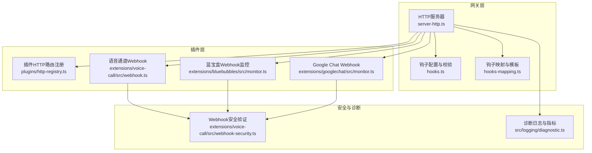
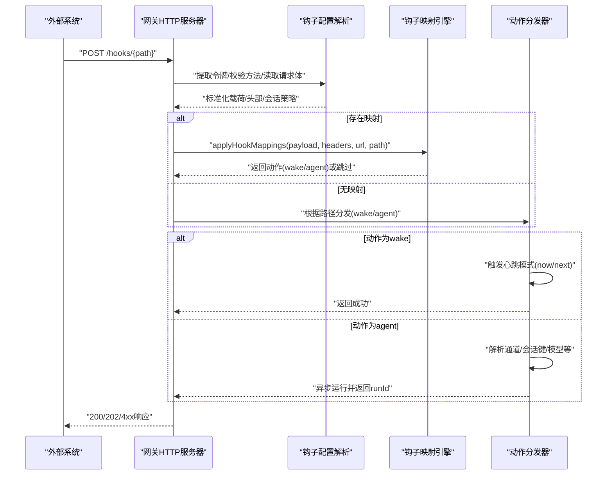
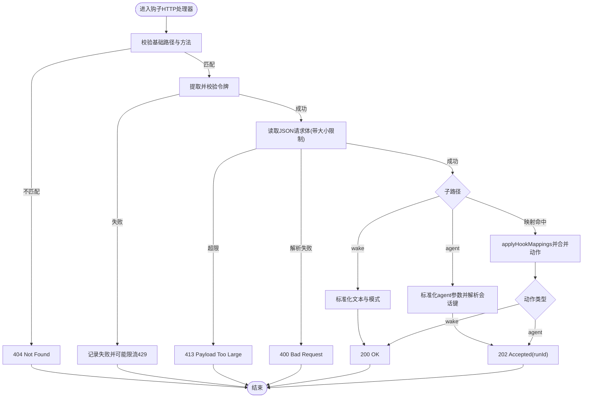
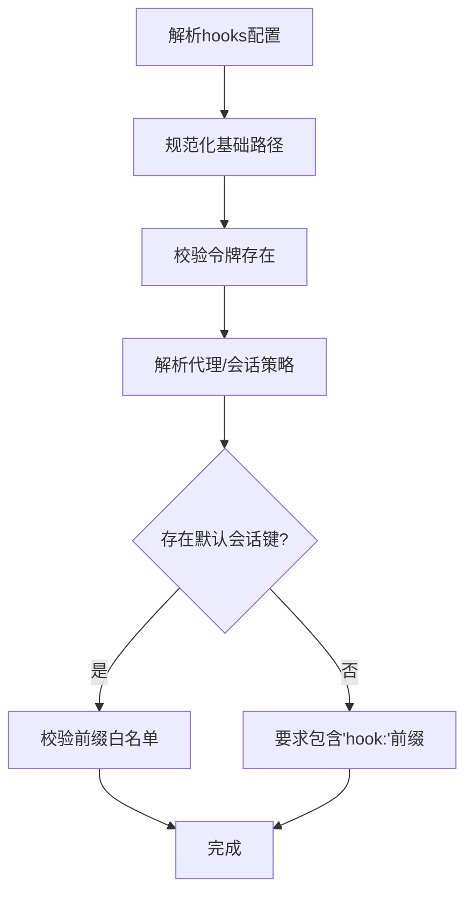
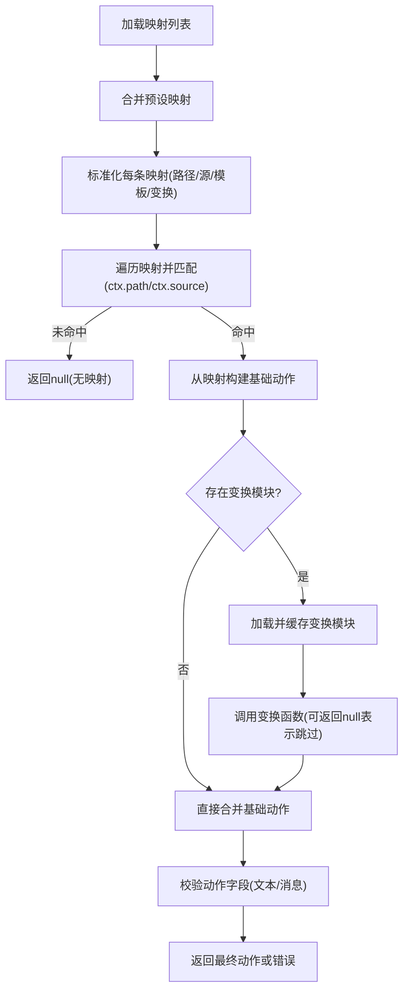
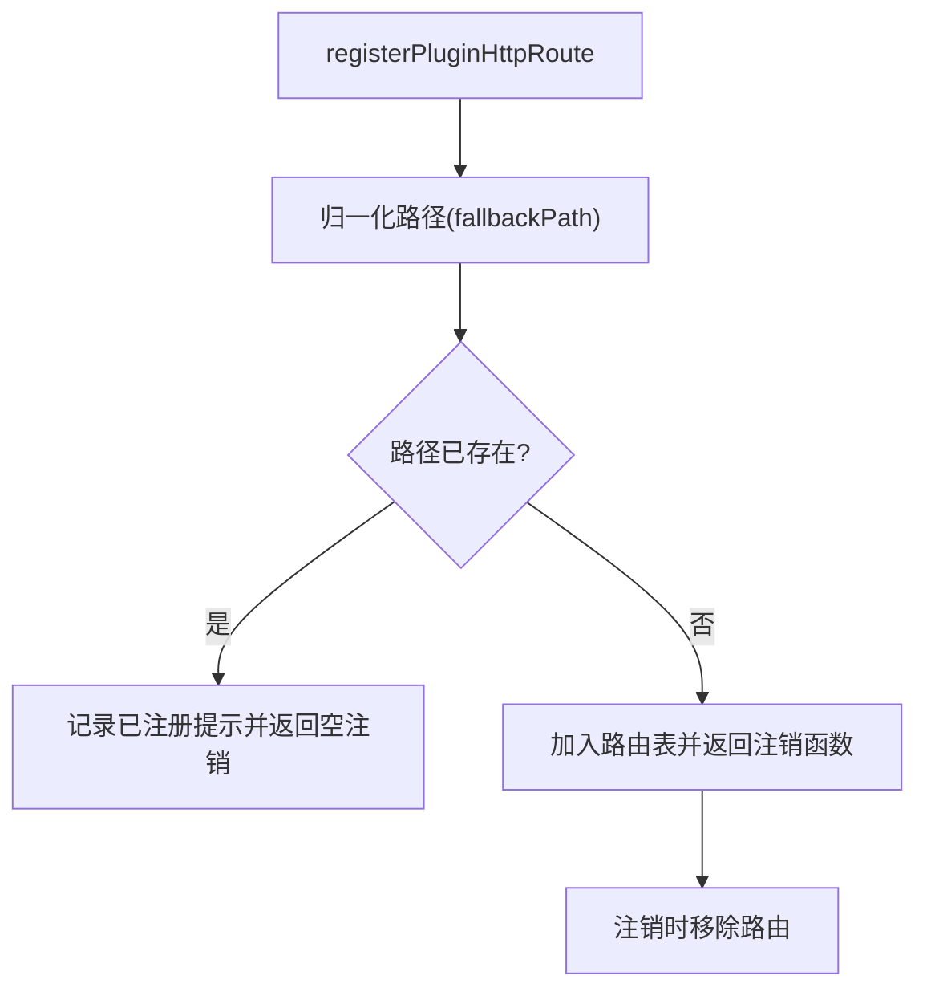
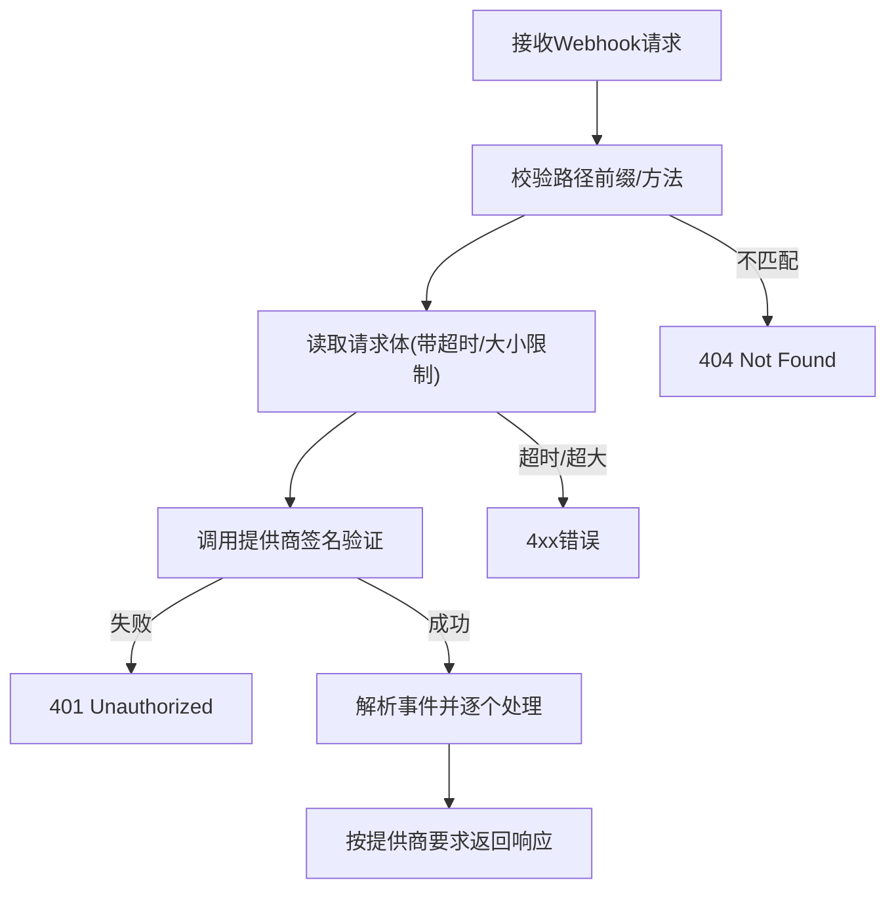
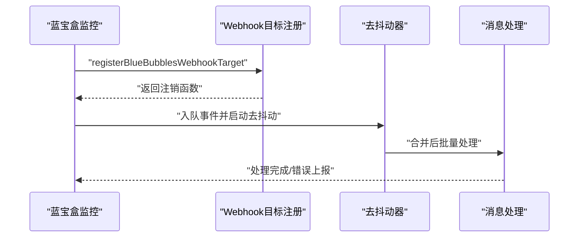
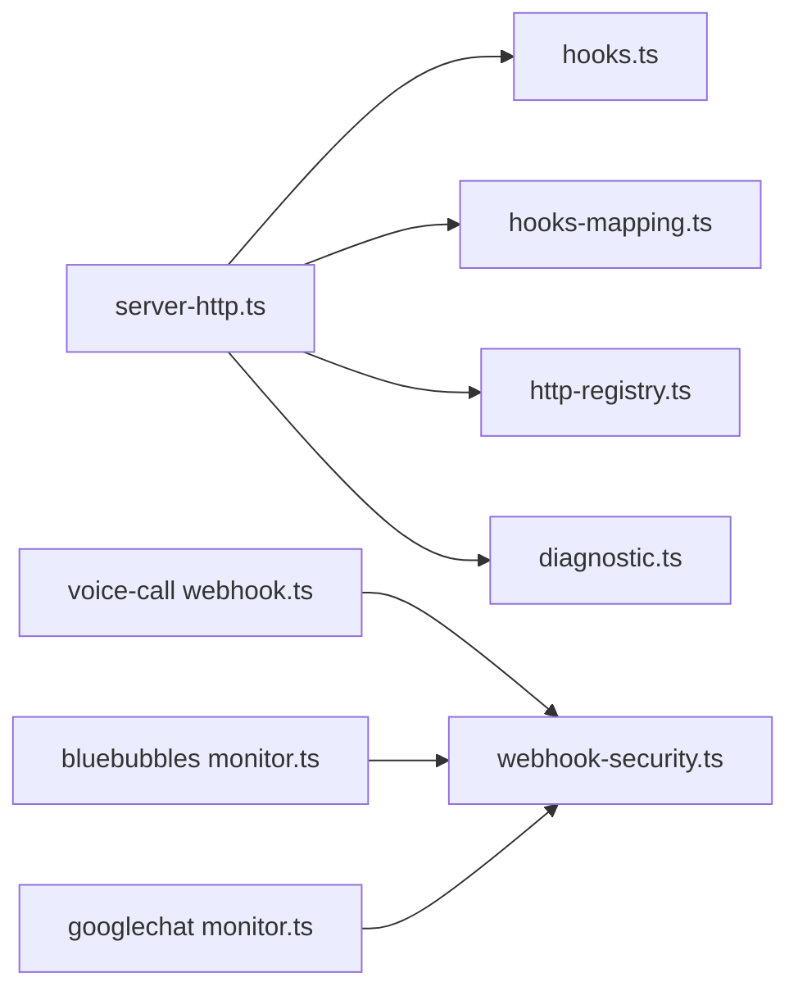

# Webhook触发系统

<cite>
**本文档引用的文件**
- [docs/automation/webhook.md](file://docs/automation/webhook.md)
- [docs/cli/webhooks.md](file://docs/cli/webhooks.md)
- [src/gateway/server-http.ts](file://src/gateway/server-http.ts)
- [src/gateway/hooks.ts](file://src/gateway/hooks.ts)
- [src/gateway/hooks-mapping.ts](file://src/gateway/hooks-mapping.ts)
- [src/plugins/http-registry.ts](file://src/plugins/http-registry.ts)
- [extensions/voice-call/src/webhook.ts](file://extensions/voice-call/src/webhook.ts)
- [extensions/voice-call/src/webhook-security.ts](file://extensions/voice-call/src/webhook-security.ts)
- [extensions/voice-call/src/webhook-security.test.ts](file://extensions/voice-call/src/webhook-security.test.ts)
- [extensions/bluebubbles/src/monitor.ts](file://extensions/bluebubbles/src/monitor.ts)
- [extensions/googlechat/src/monitor.ts](file://extensions/googlechat/src/monitor.ts)
- [src/logging/diagnostic.ts](file://src/logging/diagnostic.ts)
- [src/infra/retry-policy.ts](file://src/infra/retry-policy.ts)
- [extensions/msteams/src/errors.ts](file://extensions/msteams/src/errors.ts)
</cite>

## 目录

1. [简介](#简介)
2. [项目结构](#项目结构)
3. [核心组件](#核心组件)
4. [架构总览](#架构总览)
5. [详细组件分析](#详细组件分析)
6. [依赖关系分析](#依赖关系分析)
7. [性能考虑](#性能考虑)
8. [故障排查指南](#故障排查指南)
9. [结论](#结论)
10. [附录](#附录)

## 简介

本文件面向OpenClaw Webhook触发系统的使用者与维护者，系统性阐述Webhook的注册、配置与管理机制，深入解析事件捕获、过滤与路由处理流程，详述安全验证、签名认证与防重放攻击策略，并提供最佳实践、性能优化与监控方案，以及调试方法、错误处理与重试逻辑。

## 项目结构

OpenClaw的Webhook能力主要由网关层HTTP服务器、钩子配置与映射、插件HTTP路由注册、以及各通道插件的Webhook处理器共同构成。文档与CLI参考位于docs目录，核心实现位于src/gateway与extensions下。

**图表来源**

- [src/gateway/server-http.ts](file://src/gateway/server-http.ts#L1-L556)
- [src/gateway/hooks.ts](file://src/gateway/hooks.ts#L1-L413)
- [src/gateway/hooks-mapping.ts](file://src/gateway/hooks-mapping.ts#L1-L445)
- [src/plugins/http-registry.ts](file://src/plugins/http-registry.ts#L1-L52)
- [extensions/voice-call/src/webhook.ts](file://extensions/voice-call/src/webhook.ts#L1-L517)
- [extensions/voice-call/src/webhook-security.ts](file://extensions/voice-call/src/webhook-security.ts#L333-L646)
- [extensions/bluebubbles/src/monitor.ts](file://extensions/bluebubbles/src/monitor.ts#L95-L136)
- [extensions/googlechat/src/monitor.ts](file://extensions/googlechat/src/monitor.ts#L127-L304)
- [src/logging/diagnostic.ts](file://src/logging/diagnostic.ts#L1-L342)

**章节来源**

- [src/gateway/server-http.ts](file://src/gateway/server-http.ts#L1-L556)
- [src/gateway/hooks.ts](file://src/gateway/hooks.ts#L1-L413)
- [src/gateway/hooks-mapping.ts](file://src/gateway/hooks-mapping.ts#L1-L445)
- [src/plugins/http-registry.ts](file://src/plugins/http-registry.ts#L1-L52)
- [extensions/voice-call/src/webhook.ts](file://extensions/voice-call/src/webhook.ts#L1-L517)
- [extensions/voice-call/src/webhook-security.ts](file://extensions/voice-call/src/webhook-security.ts#L333-L646)
- [extensions/bluebubbles/src/monitor.ts](file://extensions/bluebubbles/src/monitor.ts#L95-L136)
- [extensions/googlechat/src/monitor.ts](file://extensions/googlechat/src/monitor.ts#L127-L304)
- [src/logging/diagnostic.ts](file://src/logging/diagnostic.ts#L1-L342)

## 核心组件

- 网关HTTP请求处理器：负责鉴权、方法与路径校验、请求体读取、映射与动作分发。
- 钩子配置解析器：解析hooks配置、路径规范化、令牌提取、代理头处理、会话键策略与代理策略。
- 钩子映射引擎：基于预设与自定义规则进行路径/源匹配，模板渲染与可选变换模块合并。
- 插件HTTP路由注册：为插件暴露HTTP端点提供统一注册与去重机制。
- 安全验证模块：针对不同提供商的Webhook签名验证与URL重建，支持转发头白名单与代理IP信任。
- 诊断与指标：记录Webhook接收/处理计数、活动状态与心跳指标。

**章节来源**

- [src/gateway/server-http.ts](file://src/gateway/server-http.ts#L139-L361)
- [src/gateway/hooks.ts](file://src/gateway/hooks.ts#L35-L93)
- [src/gateway/hooks-mapping.ts](file://src/gateway/hooks-mapping.ts#L105-L176)
- [src/plugins/http-registry.ts](file://src/plugins/http-registry.ts#L11-L52)
- [src/logging/diagnostic.ts](file://src/logging/diagnostic.ts#L23-L106)

## 架构总览

下图展示从外部HTTP请求到内部钩子动作执行的完整链路，包括鉴权、映射、动作选择与调度。

**图表来源**

- [src/gateway/server-http.ts](file://src/gateway/server-http.ts#L183-L360)
- [src/gateway/hooks.ts](file://src/gateway/hooks.ts#L236-L412)
- [src/gateway/hooks-mapping.ts](file://src/gateway/hooks-mapping.ts#L140-L176)

**章节来源**

- [src/gateway/server-http.ts](file://src/gateway/server-http.ts#L183-L360)
- [src/gateway/hooks.ts](file://src/gateway/hooks.ts#L236-L412)
- [src/gateway/hooks-mapping.ts](file://src/gateway/hooks-mapping.ts#L140-L176)

## 详细组件分析

### 网关HTTP请求处理器

- 路径与方法校验：仅接受POST，路径必须以hooks基础路径开头。
- 鉴权：支持Authorization Bearer与自定义头，拒绝查询参数令牌；对重复失败进行限流。
- 请求体读取：限制最大字节数，超限返回413。
- 动作分发：
  - /wake：标准化文本与心跳模式，直接触发心跳。
  - /agent：标准化消息、会话键、通道、模型等，异步调度执行并返回runId。
  - 映射：若存在映射，先按映射生成动作，再与请求参数合并覆盖。

**图表来源**

- [src/gateway/server-http.ts](file://src/gateway/server-http.ts#L183-L360)
- [src/gateway/hooks.ts](file://src/gateway/hooks.ts#L157-L222)

**章节来源**

- [src/gateway/server-http.ts](file://src/gateway/server-http.ts#L183-L360)
- [src/gateway/hooks.ts](file://src/gateway/hooks.ts#L157-L222)

### 钩子配置与策略

- 基础路径与令牌：路径不可为根"/"，默认路径"/hooks"，令牌必填。
- 会话键策略：支持默认会话键、是否允许请求覆盖、前缀白名单校验。
- 代理与转发头：规范化请求头，支持白名单主机与可信代理IP，防止Host注入。
- 代理策略：允许在受控环境下信任X-Forwarded-\*头，否则忽略。

**图表来源**

- [src/gateway/hooks.ts](file://src/gateway/hooks.ts#L35-L93)
- [src/gateway/hooks.ts](file://src/gateway/hooks.ts#L129-L155)

**章节来源**

- [src/gateway/hooks.ts](file://src/gateway/hooks.ts#L35-L93)
- [src/gateway/hooks.ts](file://src/gateway/hooks.ts#L129-L155)

### 钩子映射与模板

- 预设映射：如Gmail，内置路径与模板。
- 自定义映射：支持match.path或match.source匹配，模板渲染payload/headers/query路径表达式。
- 变换模块：可加载本地JS/TS模块，导出函数用于动态覆盖动作字段。
- 合并策略：先构建基础动作，再应用变换结果，最后进行字段校验。

**图表来源**

- [src/gateway/hooks-mapping.ts](file://src/gateway/hooks-mapping.ts#L105-L176)
- [src/gateway/hooks-mapping.ts](file://src/gateway/hooks-mapping.ts#L321-L339)
- [src/gateway/hooks-mapping.ts](file://src/gateway/hooks-mapping.ts#L268-L319)

**章节来源**

- [src/gateway/hooks-mapping.ts](file://src/gateway/hooks-mapping.ts#L66-L79)
- [src/gateway/hooks-mapping.ts](file://src/gateway/hooks-mapping.ts#L105-L176)
- [src/gateway/hooks-mapping.ts](file://src/gateway/hooks-mapping.ts#L321-L339)
- [src/gateway/hooks-mapping.ts](file://src/gateway/hooks-mapping.ts#L268-L319)

### 插件HTTP路由注册

- 统一注册接口：提供路径归一化、重复注册检查与注销回调。
- 作用域：为插件暴露HTTP端点，支持账户维度绑定。

**图表来源**

- [src/plugins/http-registry.ts](file://src/plugins/http-registry.ts#L11-L52)

**章节来源**

- [src/plugins/http-registry.ts](file://src/plugins/http-registry.ts#L11-L52)

### 安全验证与防重放

- 令牌校验：严格禁止查询参数令牌，仅支持头部携带；失败后进行限流。
- 转发头安全：支持allowedHosts白名单与trustedProxyIPs，避免Host注入；可选择信任转发头。
- 签名验证：针对Twilio/Plivo等提供专用验证函数，支持ngrok免费版兼容模式与跳过验证选项（开发模式）。
- 时间安全比较：使用定时安全相等比较，降低侧信道风险。

**图表来源**

- [extensions/voice-call/src/webhook.ts](file://extensions/voice-call/src/webhook.ts#L221-L296)
- [extensions/voice-call/src/webhook-security.ts](file://extensions/voice-call/src/webhook-security.ts#L333-L422)
- [extensions/voice-call/src/webhook-security.ts](file://extensions/voice-call/src/webhook-security.ts#L578-L646)

**章节来源**

- [src/gateway/server-http.ts](file://src/gateway/server-http.ts#L194-L221)
- [extensions/voice-call/src/webhook.ts](file://extensions/voice-call/src/webhook.ts#L221-L296)
- [extensions/voice-call/src/webhook-security.ts](file://extensions/voice-call/src/webhook-security.ts#L333-L422)
- [extensions/voice-call/src/webhook-security.ts](file://extensions/voice-call/src/webhook-security.ts#L578-L646)

### 通道Webhook处理器示例

- 蓝宝盒：注册Webhook目标路径，支持去抖动合并消息，超时保护。
- Google Chat：按目标audienceType/audience进行验证，支持多种空间/用户场景。
- 语音通道：提供Twilio/Plivo等签名验证与媒体流WebSocket升级。

**图表来源**

- [extensions/bluebubbles/src/monitor.ts](file://extensions/bluebubbles/src/monitor.ts#L495-L530)
- [extensions/bluebubbles/src/monitor.ts](file://extensions/bluebubbles/src/monitor.ts#L454-L474)

**章节来源**

- [extensions/bluebubbles/src/monitor.ts](file://extensions/bluebubbles/src/monitor.ts#L495-L530)
- [extensions/bluebubbles/src/monitor.ts](file://extensions/bluebubbles/src/monitor.ts#L454-L474)
- [extensions/googlechat/src/monitor.ts](file://extensions/googlechat/src/monitor.ts#L127-L304)
- [extensions/voice-call/src/webhook.ts](file://extensions/voice-call/src/webhook.ts#L162-L200)

## 依赖关系分析

- 网关HTTP服务器依赖钩子配置解析与映射引擎，同时与插件HTTP路由注册协作。
- 安全验证模块独立于具体提供商，但被各通道Webhook处理器调用。
- 诊断模块贯穿事件接收与处理，提供统计与心跳输出。

**图表来源**

- [src/gateway/server-http.ts](file://src/gateway/server-http.ts#L1-L556)
- [src/gateway/hooks.ts](file://src/gateway/hooks.ts#L1-L413)
- [src/gateway/hooks-mapping.ts](file://src/gateway/hooks-mapping.ts#L1-L445)
- [src/plugins/http-registry.ts](file://src/plugins/http-registry.ts#L1-L52)
- [src/logging/diagnostic.ts](file://src/logging/diagnostic.ts#L1-L342)
- [extensions/voice-call/src/webhook.ts](file://extensions/voice-call/src/webhook.ts#L1-L517)
- [extensions/voice-call/src/webhook-security.ts](file://extensions/voice-call/src/webhook-security.ts#L333-L646)
- [extensions/bluebubbles/src/monitor.ts](file://extensions/bluebubbles/src/monitor.ts#L95-L136)
- [extensions/googlechat/src/monitor.ts](file://extensions/googlechat/src/monitor.ts#L127-L304)

**章节来源**

- [src/gateway/server-http.ts](file://src/gateway/server-http.ts#L1-L556)
- [src/gateway/hooks.ts](file://src/gateway/hooks.ts#L1-L413)
- [src/gateway/hooks-mapping.ts](file://src/gateway/hooks-mapping.ts#L1-L445)
- [src/plugins/http-registry.ts](file://src/plugins/http-registry.ts#L1-L52)
- [src/logging/diagnostic.ts](file://src/logging/diagnostic.ts#L1-L342)
- [extensions/voice-call/src/webhook.ts](file://extensions/voice-call/src/webhook.ts#L1-L517)
- [extensions/voice-call/src/webhook-security.ts](file://extensions/voice-call/src/webhook-security.ts#L333-L646)
- [extensions/bluebubbles/src/monitor.ts](file://extensions/bluebubbles/src/monitor.ts#L95-L136)
- [extensions/googlechat/src/monitor.ts](file://extensions/googlechat/src/monitor.ts#L127-L304)

## 性能考虑

- 请求体读取：采用流式拼接与超时控制，防止慢连接与慢注入；建议合理设置maxBodyBytes。
- 会话键生成：默认使用随机UUID，结合前缀白名单减少冲突与越权。
- 去抖动与批处理：通道Webhook支持合并与去抖动，降低重复处理开销。
- 重试策略：对外部发送错误进行分类，区分瞬时与永久错误，避免重复投递。

**章节来源**

- [src/gateway/hooks.ts](file://src/gateway/hooks.ts#L176-L222)
- [extensions/bluebubbles/src/monitor.ts](file://extensions/bluebubbles/src/monitor.ts#L454-L474)
- [src/infra/retry-policy.ts](file://src/infra/retry-policy.ts#L1-L43)
- [extensions/msteams/src/errors.ts](file://extensions/msteams/src/errors.ts#L107-L156)

## 故障排查指南

- 鉴权失败与限流：检查令牌是否通过Authorization头传递，确认未使用查询参数令牌；关注429响应与Retry-After头。
- 请求体过大或超时：确认maxBodyBytes配置与实际负载大小；检查网络稳定性与超时阈值。
- 映射未生效：核对match.path或match.source是否与请求一致；检查模板语法与路径表达式。
- 安全验证失败：确认提供商签名算法与密钥配置；在受控环境下启用allowedHosts或trustedProxyIPs。
- 诊断与监控：查看webhook.received/processed计数与心跳输出，定位积压与异常。

**章节来源**

- [src/gateway/server-http.ts](file://src/gateway/server-http.ts#L194-L221)
- [src/gateway/server-http.ts](file://src/gateway/server-http.ts#L349-L354)
- [src/logging/diagnostic.ts](file://src/logging/diagnostic.ts#L63-L106)
- [extensions/voice-call/src/webhook-security.test.ts](file://extensions/voice-call/src/webhook-security.test.ts#L197-L356)

## 结论

OpenClaw的Webhook体系通过“网关统一入口 + 配置与映射 + 插件扩展 + 安全验证 + 诊断监控”的设计，在保证安全性与可扩展性的同时，提供了灵活的事件捕获、过滤与路由能力。遵循本文的最佳实践与安全建议，可在生产环境中稳定运行并高效扩展。

## 附录

### 配置与使用参考

- 基本启用与令牌：hooks.enabled、hooks.token、hooks.path。
- 认证方式：推荐Authorization: Bearer，其次x-openclaw-token，拒绝查询参数令牌。
- 端点与负载：
  - POST /hooks/wake：text必填，mode可选(now/next-heartbeat)。
  - POST /hooks/agent：message必填，支持agentId、sessionKey、channel、to、model、thinking、timeoutSeconds等。
- 映射与模板：hooks.presets、hooks.mappings、hooks.transformsDir、模板表达式{{payload.*}}/{{headers.*}}/{{query.*}}。
- 会话键策略：hooks.defaultSessionKey、hooks.allowRequestSessionKey、hooks.allowedSessionKeyPrefixes。

**章节来源**

- [docs/automation/webhook.md](file://docs/automation/webhook.md#L15-L214)

### CLI辅助

- Gmail Pub/Sub：openclaw webhooks gmail setup/run，简化Gmail订阅与钩子配置。

**章节来源**

- [docs/cli/webhooks.md](file://docs/cli/webhooks.md#L18-L26)
